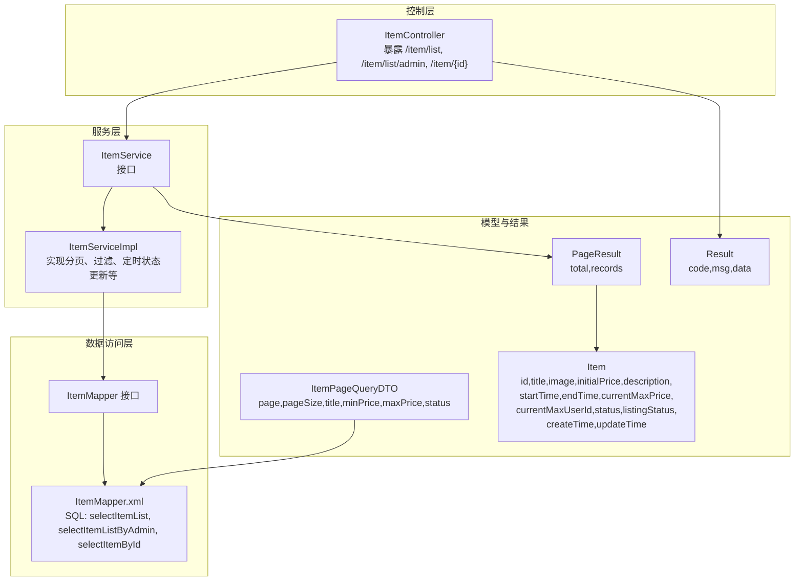
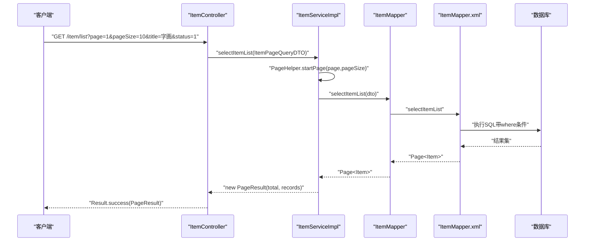
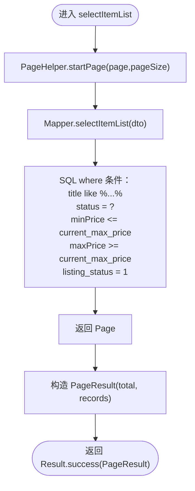
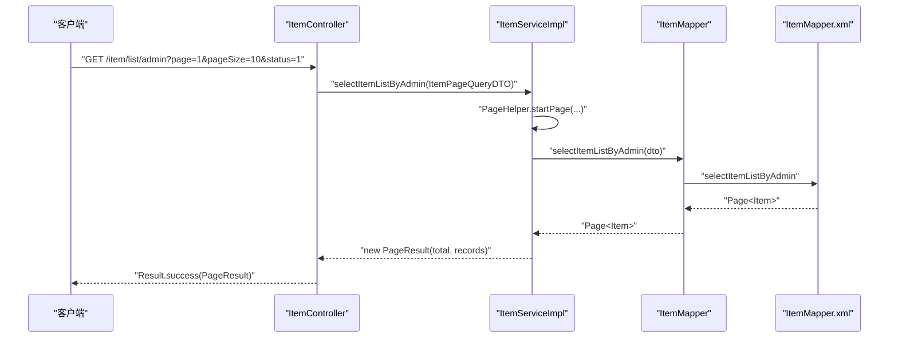
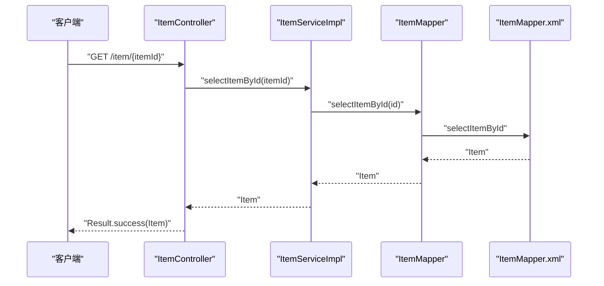
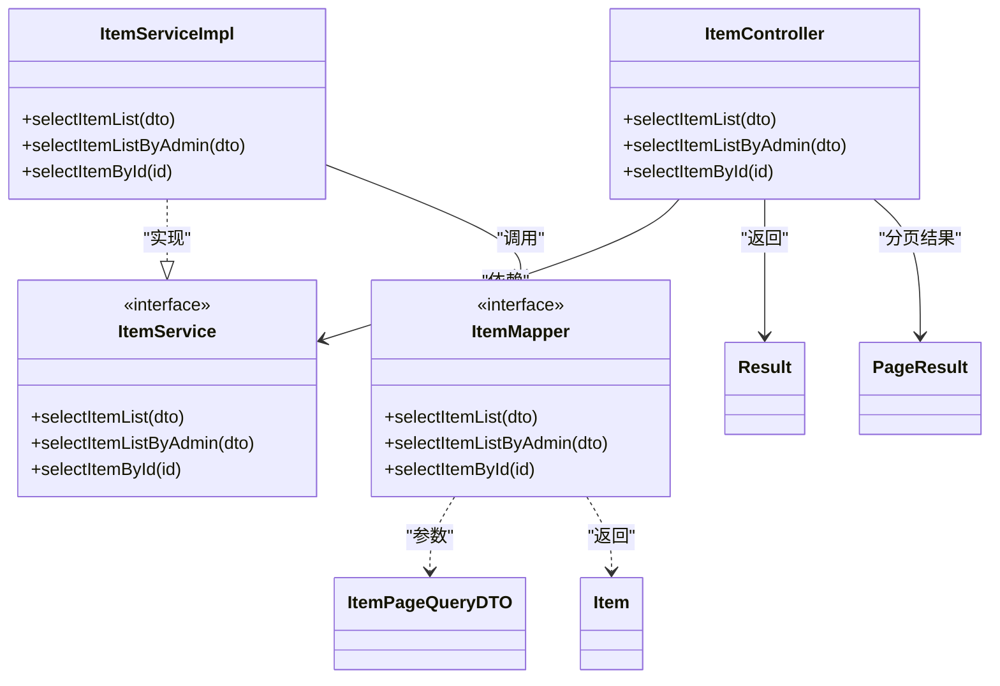

# 拍品查询类接口

<cite>
**本文引用的文件**
- [ItemController.java](file://src/main/java/com/qkl/auctionsystem/controller/ItemController.java)
- [ItemService.java](file://src/main/java/com/qkl/auctionsystem/service/ItemService.java)
- [ItemServiceImpl.java](file://src/main/java/com/qkl/auctionsystem/service/impl/ItemServiceImpl.java)
- [ItemMapper.java](file://src/main/java/com/qkl/auctionsystem/mapper/ItemMapper.java)
- [ItemMapper.xml](file://src/main/resources/mapper/ItemMapper.xml)
- [ItemPageQueryDTO.java](file://src/main/java/com/qkl/auctionsystem/pojo/dto/ItemPageQueryDTO.java)
- [PageResult.java](file://src/main/java/com/qkl/auctionsystem/result/PageResult.java)
- [Result.java](file://src/main/java/com/qkl/auctionsystem/result/Result.java)
- [Item.java](file://src/main/java/com/qkl/auctionsystem/pojo/entity/Item.java)
</cite>

## 目录
1. [简介](#简介)
2. [项目结构](#项目结构)
3. [核心组件](#核心组件)
4. [架构总览](#架构总览)
5. [详细组件分析](#详细组件分析)
6. [依赖关系分析](#依赖关系分析)
7. [性能与分页特性](#性能与分页特性)
8. [典型请求与响应示例](#典型请求与响应示例)
9. [故障排查指南](#故障排查指南)
10. [结论](#结论)

## 简介
本文件面向开发者，系统化梳理“拍品查询类接口”的完整API文档，覆盖以下三个核心接口：
- 公开拍品列表查询：GET /item/list
- 管理员专属拍品列表查询：GET /item/list/admin
- 拍品详情查询：GET /item/{itemId}

重点说明：
- 查询参数通过 ItemPageQueryDTO 接收，返回 PageResult 分页结果；
- 列表查询默认仅展示“已上架”拍品；
- 管理员接口可查询全部拍品（含未上架）；
- 统一返回体 Result，包含 code、msg、data 字段；
- 使用 PageHelper 实现分页，pageNum/pageSize 映射为 page/pageSize。

## 项目结构
围绕拍品查询相关的后端模块组织如下：
- 控制层：ItemController 提供对外HTTP接口
- 服务层：ItemService 定义业务契约，ItemServiceImpl 实现具体逻辑
- 数据访问层：ItemMapper 接口 + ItemMapper.xml SQL映射
- DTO/实体/结果封装：ItemPageQueryDTO、Item、PageResult、Result

图表来源
- [ItemController.java](file://src/main/java/com/qkl/auctionsystem/controller/ItemController.java#L36-L55)
- [ItemService.java](file://src/main/java/com/qkl/auctionsystem/service/ItemService.java#L13-L33)
- [ItemServiceImpl.java](file://src/main/java/com/qkl/auctionsystem/service/impl/ItemServiceImpl.java#L45-L105)
- [ItemMapper.java](file://src/main/java/com/qkl/auctionsystem/mapper/ItemMapper.java#L12-L35)
- [ItemMapper.xml](file://src/main/resources/mapper/ItemMapper.xml#L41-L93)
- [ItemPageQueryDTO.java](file://src/main/java/com/qkl/auctionsystem/pojo/dto/ItemPageQueryDTO.java#L1-L19)
- [PageResult.java](file://src/main/java/com/qkl/auctionsystem/result/PageResult.java#L1-L23)
- [Result.java](file://src/main/java/com/qkl/auctionsystem/result/Result.java#L1-L39)
- [Item.java](file://src/main/java/com/qkl/auctionsystem/pojo/entity/Item.java#L1-L34)

章节来源
- [ItemController.java](file://src/main/java/com/qkl/auctionsystem/controller/ItemController.java#L36-L55)
- [ItemServiceImpl.java](file://src/main/java/com/qkl/auctionsystem/service/impl/ItemServiceImpl.java#L45-L105)
- [ItemMapper.xml](file://src/main/resources/mapper/ItemMapper.xml#L41-L93)

## 核心组件
- 控制器 ItemController
  - 对外暴露 GET /item/list、GET /item/list/admin、GET /item/{itemId}
  - 调用 ItemService 执行业务逻辑，统一包装 Result 返回
- 服务层 ItemServiceImpl
  - 使用 PageHelper 实现分页
  - selectItemList 默认仅查询 listing_status=1 的拍品
  - selectItemListByAdmin 不加“已上架”限制，用于管理员全量查询
  - selectItemById 直接按主键查询
- 数据访问层 ItemMapper/ItemMapper.xml
  - selectItemList：标题模糊匹配、状态精确匹配、价格区间过滤、强制 listing_status=1
  - selectItemListByAdmin：标题、状态、价格区间过滤，无 listing_status 限制
  - selectItemById：按 id 查询
- DTO/实体/结果
  - ItemPageQueryDTO：page、pageSize、title、minPrice、maxPrice、status
  - Item：拍品实体字段
  - PageResult：total、records
  - Result：code、msg、data

章节来源
- [ItemController.java](file://src/main/java/com/qkl/auctionsystem/controller/ItemController.java#L36-L55)
- [ItemServiceImpl.java](file://src/main/java/com/qkl/auctionsystem/service/impl/ItemServiceImpl.java#L45-L105)
- [ItemMapper.xml](file://src/main/resources/mapper/ItemMapper.xml#L41-L93)
- [ItemPageQueryDTO.java](file://src/main/java/com/qkl/auctionsystem/pojo/dto/ItemPageQueryDTO.java#L1-L19)
- [PageResult.java](file://src/main/java/com/qkl/auctionsystem/result/PageResult.java#L1-L23)
- [Result.java](file://src/main/java/com/qkl/auctionsystem/result/Result.java#L1-L39)
- [Item.java](file://src/main/java/com/qkl/auctionsystem/pojo/entity/Item.java#L1-L34)

## 架构总览
拍品查询类接口遵循标准的 MVC 分层架构，调用链路清晰：

图表来源
- [ItemController.java](file://src/main/java/com/qkl/auctionsystem/controller/ItemController.java#L36-L41)
- [ItemServiceImpl.java](file://src/main/java/com/qkl/auctionsystem/service/impl/ItemServiceImpl.java#L45-L50)
- [ItemMapper.java](file://src/main/java/com/qkl/auctionsystem/mapper/ItemMapper.java#L16-L16)
- [ItemMapper.xml](file://src/main/resources/mapper/ItemMapper.xml#L41-L50)

## 详细组件分析

### 公开拍品列表查询 GET /item/list
- 功能概述
  - 支持分页与多条件筛选
  - 参数接收：ItemPageQueryDTO（page、pageSize、title、minPrice、maxPrice、status）
  - 返回：Result<PageResult>，其中 PageResult 包含 total 和 records
- 分页处理
  - 服务层使用 PageHelper.startPage(itemPageQueryDTO.getPage(), itemPageQueryDTO.getPageSize())
  - MyBatis 返回 Page<Item>，再封装为 PageResult(total, records)
- 查询条件构建
  - 标题模糊匹配：where 条件中对 title 进行 like '%{title}%'
  - 状态精确匹配：where 条件中对 status 进行等值比较
  - 价格区间过滤：最小价与最大价分别作为 >= 与 <= 条件
  - 默认仅展示已上架拍品：强制添加 and listing_status = 1
- 响应结构
  - Result.code：1 表示成功，0 表示失败
  - Result.data：PageResult(total, records)
  - records 类型为 List<Item>
- 错误处理
  - 若服务层抛出异常，控制器会捕获并返回 Result.error(msg)

图表来源
- [ItemServiceImpl.java](file://src/main/java/com/qkl/auctionsystem/service/impl/ItemServiceImpl.java#L45-L50)
- [ItemMapper.xml](file://src/main/resources/mapper/ItemMapper.xml#L41-L50)

章节来源
- [ItemController.java](file://src/main/java/com/qkl/auctionsystem/controller/ItemController.java#L36-L41)
- [ItemServiceImpl.java](file://src/main/java/com/qkl/auctionsystem/service/impl/ItemServiceImpl.java#L45-L50)
- [ItemMapper.xml](file://src/main/resources/mapper/ItemMapper.xml#L41-L50)
- [ItemPageQueryDTO.java](file://src/main/java/com/qkl/auctionsystem/pojo/dto/ItemPageQueryDTO.java#L1-L19)
- [PageResult.java](file://src/main/java/com/qkl/auctionsystem/result/PageResult.java#L1-L23)
- [Result.java](file://src/main/java/com/qkl/auctionsystem/result/Result.java#L1-L39)

### 管理员专属拍品列表查询 GET /item/list/admin
- 功能概述
  - 与公开列表类似，但不强制 listing_status=1，便于管理员查看全部拍品
- 查询条件构建
  - 标题、状态、价格区间过滤逻辑同公开列表
  - 无 listing_status 限制
- 分页与返回
  - 同公开列表，使用 PageHelper 分页，返回 Result<PageResult>

图表来源
- [ItemController.java](file://src/main/java/com/qkl/auctionsystem/controller/ItemController.java#L43-L48)
- [ItemServiceImpl.java](file://src/main/java/com/qkl/auctionsystem/service/impl/ItemServiceImpl.java#L100-L105)
- [ItemMapper.xml](file://src/main/resources/mapper/ItemMapper.xml#L85-L93)

章节来源
- [ItemController.java](file://src/main/java/com/qkl/auctionsystem/controller/ItemController.java#L43-L48)
- [ItemServiceImpl.java](file://src/main/java/com/qkl/auctionsystem/service/impl/ItemServiceImpl.java#L100-L105)
- [ItemMapper.xml](file://src/main/resources/mapper/ItemMapper.xml#L85-L93)

### 拍品详情查询 GET /item/{itemId}
- 功能概述
  - 根据拍品ID查询完整信息
- 处理流程
  - 控制器接收路径变量 itemId
  - 服务层直接调用 Mapper.selectItemById(id)
  - 返回 Result.success(Item)

图表来源
- [ItemController.java](file://src/main/java/com/qkl/auctionsystem/controller/ItemController.java#L50-L55)
- [ItemMapper.xml](file://src/main/resources/mapper/ItemMapper.xml#L52-L54)

章节来源
- [ItemController.java](file://src/main/java/com/qkl/auctionsystem/controller/ItemController.java#L50-L55)
- [ItemMapper.xml](file://src/main/resources/mapper/ItemMapper.xml#L52-L54)

## 依赖关系分析
- 控制器依赖服务层接口 ItemService
- 服务层依赖 Mapper 接口，Mapper 依赖 XML 中的 SQL
- DTO/实体/结果封装贯穿各层，保证参数与返回结构一致

图表来源
- [ItemController.java](file://src/main/java/com/qkl/auctionsystem/controller/ItemController.java#L36-L55)
- [ItemService.java](file://src/main/java/com/qkl/auctionsystem/service/ItemService.java#L13-L33)
- [ItemServiceImpl.java](file://src/main/java/com/qkl/auctionsystem/service/impl/ItemServiceImpl.java#L45-L105)
- [ItemMapper.java](file://src/main/java/com/qkl/auctionsystem/mapper/ItemMapper.java#L12-L35)
- [ItemPageQueryDTO.java](file://src/main/java/com/qkl/auctionsystem/pojo/dto/ItemPageQueryDTO.java#L1-L19)
- [Item.java](file://src/main/java/com/qkl/auctionsystem/pojo/entity/Item.java#L1-L34)
- [PageResult.java](file://src/main/java/com/qkl/auctionsystem/result/PageResult.java#L1-L23)
- [Result.java](file://src/main/java/com/qkl/auctionsystem/result/Result.java#L1-L39)

章节来源
- [ItemController.java](file://src/main/java/com/qkl/auctionsystem/controller/ItemController.java#L36-L55)
- [ItemService.java](file://src/main/java/com/qkl/auctionsystem/service/ItemService.java#L13-L33)
- [ItemServiceImpl.java](file://src/main/java/com/qkl/auctionsystem/service/impl/ItemServiceImpl.java#L45-L105)
- [ItemMapper.java](file://src/main/java/com/qkl/auctionsystem/mapper/ItemMapper.java#L12-L35)

## 性能与分页特性
- 分页实现
  - 使用 PageHelper.startPage(page, pageSize) 实现分页
  - MyBatis 返回 Page<Item>，自动统计 total 并截取当前页 records
- 查询优化
  - SQL 中对 title 使用 like '%...%'，建议在 title 上建立索引以提升模糊查询性能
  - 价格区间过滤使用 current_max_price 字段，建议在该字段建立索引
- 缓存策略
  - 当前代码未实现专门的缓存层；若需要可考虑在服务层增加 Redis 缓存或本地缓存，针对热点拍品列表进行缓存
- 并发与事务
  - 读取接口天然无写入，无需事务；若后续扩展写操作，需注意并发一致性

章节来源
- [ItemServiceImpl.java](file://src/main/java/com/qkl/auctionsystem/service/impl/ItemServiceImpl.java#L45-L50)
- [ItemMapper.xml](file://src/main/resources/mapper/ItemMapper.xml#L41-L50)

## 典型请求与响应示例
- 请求参数说明（均来自 ItemPageQueryDTO）
  - page：页码（从1开始）
  - pageSize：每页条数
  - title：拍品标题关键词（模糊匹配）
  - minPrice：最低价格
  - maxPrice：最高价格
  - status：拍品状态（如 0 未开始、1 竞拍中、2 已结束）
- 响应结构说明（来自 Result 与 PageResult）
  - Result.code：1 成功，0 或其他数字失败
  - Result.msg：错误信息（成功时为空或提示）
  - Result.data：当为列表查询时为 PageResult；当为详情查询时为 Item
  - PageResult.total：总记录数
  - PageResult.records：当前页拍品列表（List<Item>）

- 示例一：公开列表查询
  - 请求：GET /item/list?page=1&pageSize=10&title=字画&status=1
  - 响应：Result.success(PageResult)，其中 PageResult.total 为满足条件的总数，records 为当前页拍品列表

- 示例二：管理员列表查询
  - 请求：GET /item/list/admin?page=1&pageSize=20&status=0
  - 响应：Result.success(PageResult)，包含全部状态的拍品（不含 listing_status 强制限制）

- 示例三：拍品详情查询
  - 请求：GET /item/123
  - 响应：Result.success(Item)，包含该拍品的完整信息

章节来源
- [ItemPageQueryDTO.java](file://src/main/java/com/qkl/auctionsystem/pojo/dto/ItemPageQueryDTO.java#L1-L19)
- [PageResult.java](file://src/main/java/com/qkl/auctionsystem/result/PageResult.java#L1-L23)
- [Result.java](file://src/main/java/com/qkl/auctionsystem/result/Result.java#L1-L39)
- [ItemController.java](file://src/main/java/com/qkl/auctionsystem/controller/ItemController.java#L36-L55)
- [ItemMapper.xml](file://src/main/resources/mapper/ItemMapper.xml#L41-L93)

## 故障排查指南
- 常见问题与定位
  - 参数缺失或类型不正确：确认 page、pageSize 是否为整数且大于0
  - 查询不到数据：检查 listing_status 是否为 1（公开列表默认强制），或尝试管理员接口
  - SQL 报错：检查 ItemMapper.xml 中的 where 条件与字段名是否与数据库一致
- 错误码约定
  - 成功：Result.code = 1
  - 失败：Result.code = 0（并附带 msg）
- 日志与调试
  - 控制器与服务层均输出日志，可通过日志定位请求参数与执行路径

章节来源
- [Result.java](file://src/main/java/com/qkl/auctionsystem/result/Result.java#L1-L39)
- [ItemController.java](file://src/main/java/com/qkl/auctionsystem/controller/ItemController.java#L36-L55)
- [ItemServiceImpl.java](file://src/main/java/com/qkl/auctionsystem/service/impl/ItemServiceImpl.java#L45-L50)

## 结论
本文档系统性地梳理了拍品查询类接口的实现与使用方式，明确了公开列表、管理员列表与详情查询的参数、行为与返回结构。通过 PageHelper 实现高效分页，SQL 层面实现了灵活的条件过滤与默认的“仅展示已上架”策略。建议在生产环境中进一步完善索引、缓存与监控体系，以提升查询性能与稳定性。