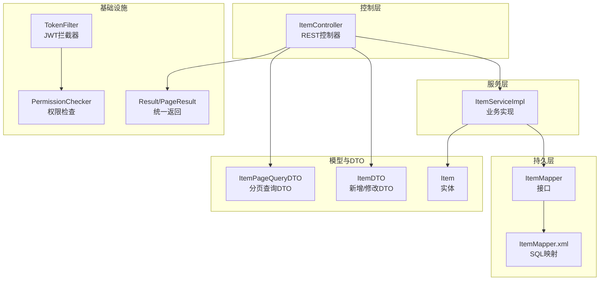
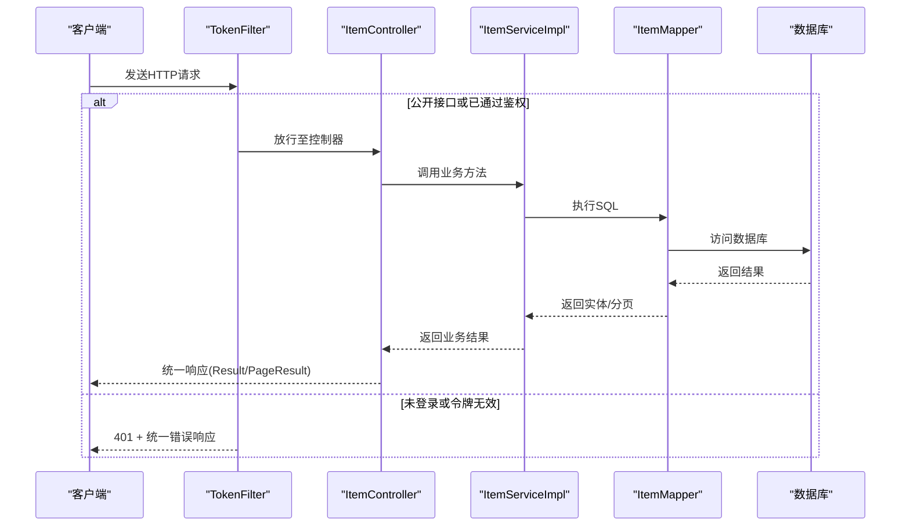
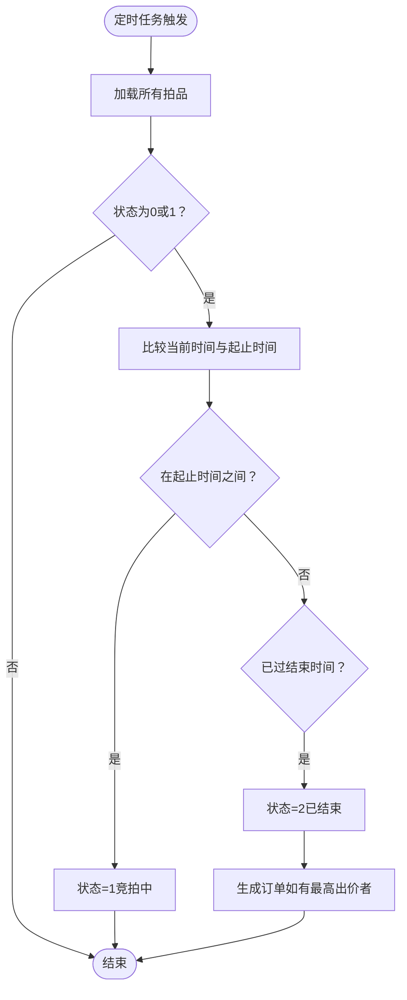
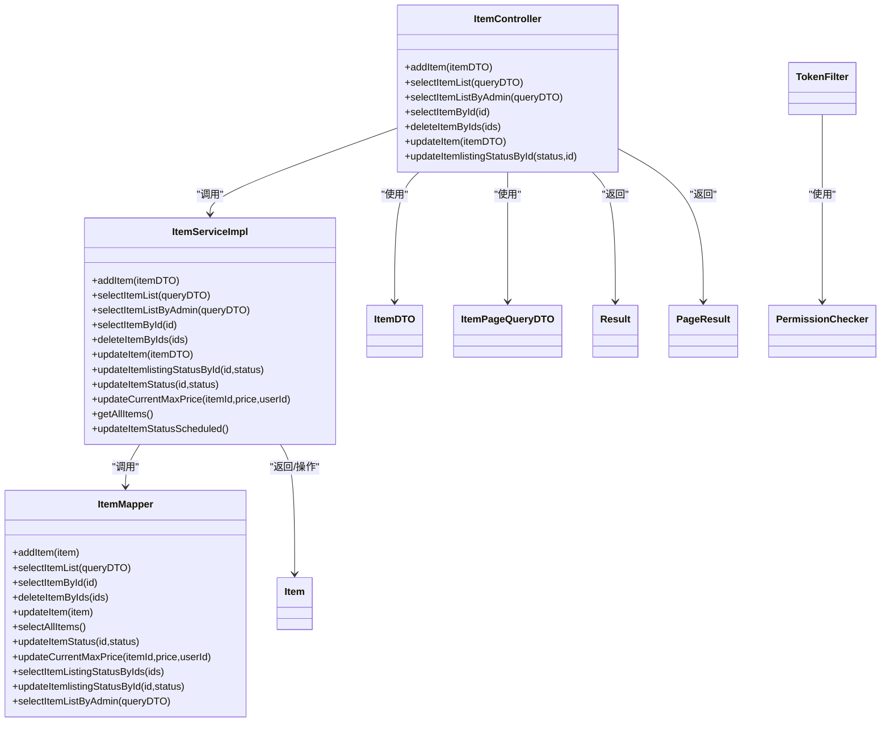
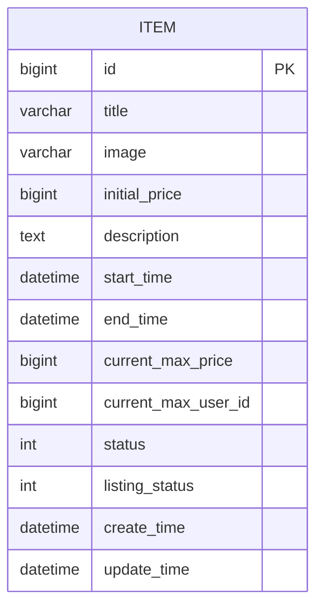

# 拍品模块API

<cite>
**本文引用的文件**
- [ItemController.java](file://src/main/java/com/qkl/auctionsystem/controller/ItemController.java)
- [ItemServiceImpl.java](file://src/main/java/com/qkl/auctionsystem/service/impl/ItemServiceImpl.java)
- [ItemMapper.java](file://src/main/java/com/qkl/auctionsystem/mapper/ItemMapper.java)
- [ItemMapper.xml](file://src/main/resources/mapper/ItemMapper.xml)
- [ItemDTO.java](file://src/main/java/com/qkl/auctionsystem/pojo/dto/ItemDTO.java)
- [ItemPageQueryDTO.java](file://src/main/java/com/qkl/auctionsystem/pojo/dto/ItemPageQueryDTO.java)
- [Item.java](file://src/main/java/com/qkl/auctionsystem/pojo/entity/Item.java)
- [PermissionChecker.java](file://src/main/java/com/qkl/auctionsystem/utils/PermissionChecker.java)
- [TokenFilter.java](file://src/main/java/com/qkl/auctionsystem/filter/TokenFilter.java)
- [Result.java](file://src/main/java/com/qkl/auctionsystem/result/Result.java)
- [PageResult.java](file://src/main/java/com/qkl/auctionsystem/result/PageResult.java)
</cite>

## 目录
1. [简介](#简介)
2. [项目结构](#项目结构)
3. [核心组件](#核心组件)
4. [架构总览](#架构总览)
5. [详细接口文档](#详细接口文档)
6. [依赖关系分析](#依赖关系分析)
7. [性能与并发特性](#性能与并发特性)
8. [故障排查指南](#故障排查指南)
9. [结论](#结论)

## 简介
本文件为拍品模块的完整API文档，覆盖拍品全生命周期管理接口，包括添加拍品、修改拍品、查询拍品列表（含管理员视角）、查询拍品详情、批量删除拍品以及修改上架状态等。文档重点说明：
- 接口权限要求（管理员专属或公开访问）
- 参数校验与业务约束（如仅可对下架拍品进行修改）
- 状态转换逻辑（竞拍状态与上架状态）
- 分页查询参数(pageNum, pageSize)的处理方式
- 请求/响应示例与错误场景

## 项目结构
拍品模块采用典型的分层架构：
- 控制层：接收HTTP请求，调用服务层
- 服务层：实现业务逻辑，协调持久层
- 持久层：MyBatis映射SQL，访问数据库
- 实体与DTO：封装数据传输对象
- 统一返回与权限过滤：统一封装响应格式，拦截器校验令牌与角色

图表来源
- [ItemController.java](file://src/main/java/com/qkl/auctionsystem/controller/ItemController.java#L1-L86)
- [ItemServiceImpl.java](file://src/main/java/com/qkl/auctionsystem/service/impl/ItemServiceImpl.java#L1-L182)
- [ItemMapper.java](file://src/main/java/com/qkl/auctionsystem/mapper/ItemMapper.java#L1-L35)
- [ItemMapper.xml](file://src/main/resources/mapper/ItemMapper.xml#L1-L109)
- [ItemDTO.java](file://src/main/java/com/qkl/auctionsystem/pojo/dto/ItemDTO.java#L1-L16)
- [ItemPageQueryDTO.java](file://src/main/java/com/qkl/auctionsystem/pojo/dto/ItemPageQueryDTO.java#L1-L19)
- [Item.java](file://src/main/java/com/qkl/auctionsystem/pojo/entity/Item.java#L1-L34)
- [TokenFilter.java](file://src/main/java/com/qkl/auctionsystem/filter/TokenFilter.java#L1-L141)
- [PermissionChecker.java](file://src/main/java/com/qkl/auctionsystem/utils/PermissionChecker.java#L1-L36)
- [Result.java](file://src/main/java/com/qkl/auctionsystem/result/Result.java#L1-L39)
- [PageResult.java](file://src/main/java/com/qkl/auctionsystem/result/PageResult.java#L1-L23)

章节来源
- [ItemController.java](file://src/main/java/com/qkl/auctionsystem/controller/ItemController.java#L1-L86)
- [ItemServiceImpl.java](file://src/main/java/com/qkl/auctionsystem/service/impl/ItemServiceImpl.java#L1-L182)
- [ItemMapper.java](file://src/main/java/com/qkl/auctionsystem/mapper/ItemMapper.java#L1-L35)
- [ItemMapper.xml](file://src/main/resources/mapper/ItemMapper.xml#L1-L109)
- [TokenFilter.java](file://src/main/java/com/qkl/auctionsystem/filter/TokenFilter.java#L1-L141)

## 核心组件
- 控制器：定义REST接口，负责参数接收、权限校验与统一返回
- 服务实现：处理业务规则（如仅下架拍品可修改、上架状态变更、定时状态更新）
- 映射器与XML：定义SQL语句，支持分页、条件查询、批量删除、状态更新
- DTO与实体：封装请求/响应数据结构
- 统一返回：Result/PageResult统一封装响应码、消息与数据
- 权限与拦截：TokenFilter解析JWT，PermissionChecker判断管理员身份

章节来源
- [ItemController.java](file://src/main/java/com/qkl/auctionsystem/controller/ItemController.java#L1-L86)
- [ItemServiceImpl.java](file://src/main/java/com/qkl/auctionsystem/service/impl/ItemServiceImpl.java#L1-L182)
- [ItemMapper.xml](file://src/main/resources/mapper/ItemMapper.xml#L1-L109)
- [Result.java](file://src/main/java/com/qkl/auctionsystem/result/Result.java#L1-L39)
- [PageResult.java](file://src/main/java/com/qkl/auctionsystem/result/PageResult.java#L1-L23)
- [PermissionChecker.java](file://src/main/java/com/qkl/auctionsystem/utils/PermissionChecker.java#L1-L36)
- [TokenFilter.java](file://src/main/java/com/qkl/auctionsystem/filter/TokenFilter.java#L1-L141)

## 架构总览
拍品模块遵循“控制器-服务-持久层”分层设计，配合JWT拦截器与权限检查工具，确保接口安全与正确性。

图表来源
- [TokenFilter.java](file://src/main/java/com/qkl/auctionsystem/filter/TokenFilter.java#L1-L141)
- [ItemController.java](file://src/main/java/com/qkl/auctionsystem/controller/ItemController.java#L1-L86)
- [ItemServiceImpl.java](file://src/main/java/com/qkl/auctionsystem/service/impl/ItemServiceImpl.java#L1-L182)
- [ItemMapper.java](file://src/main/java/com/qkl/auctionsystem/mapper/ItemMapper.java#L1-L35)
- [Result.java](file://src/main/java/com/qkl/auctionsystem/result/Result.java#L1-L39)

## 详细接口文档

### 通用约定
- 统一响应格式：Result<T>，code=1表示成功，其他值表示失败；data承载具体数据
- 分页参数：pageNum/page 对应 ItemPageQueryDTO 的 page/pageSize
- 时间字段序列化：实体中的时间字段按指定格式输出
- 权限要求：未特别标注的接口均为公开访问；管理员专属接口会在对应小节说明

章节来源
- [Result.java](file://src/main/java/com/qkl/auctionsystem/result/Result.java#L1-L39)
- [PageResult.java](file://src/main/java/com/qkl/auctionsystem/result/PageResult.java#L1-L23)
- [ItemPageQueryDTO.java](file://src/main/java/com/qkl/auctionsystem/pojo/dto/ItemPageQueryDTO.java#L1-L19)
- [Item.java](file://src/main/java/com/qkl/auctionsystem/pojo/entity/Item.java#L1-L34)

### 添加拍品
- 方法与路径：PUT /item/add
- 权限要求：管理员专属
- 请求体：ItemDTO
- 响应：Result
- 业务要点：
  - 服务层初始化默认状态与上架状态
  - 数据库插入字段包含标题、图片、初始价格、描述、起止时间、创建/更新时间、状态、上架状态等
- 参数校验与约束：
  - 非管理员调用将被拒绝
  - 无显式参数校验，建议前端校验必填项与时间先后顺序
- 请求示例（路径参考）
  - PUT /item/add
  - 请求体：ItemDTO（字段见下方“数据模型”）
- 响应示例（路径参考）
  - 成功：code=1
  - 失败：code=0 + msg

章节来源
- [ItemController.java](file://src/main/java/com/qkl/auctionsystem/controller/ItemController.java#L24-L34)
- [ItemServiceImpl.java](file://src/main/java/com/qkl/auctionsystem/service/impl/ItemServiceImpl.java#L33-L43)
- [ItemMapper.xml](file://src/main/resources/mapper/ItemMapper.xml#L6-L39)
- [PermissionChecker.java](file://src/main/java/com/qkl/auctionsystem/utils/PermissionChecker.java#L11-L18)

### 修改拍品
- 方法与路径：PUT /item/update
- 权限要求：管理员专属
- 请求体：ItemDTO
- 响应：Result
- 业务要点：
  - 仅当拍品处于下架状态（listingStatus=0）时允许修改
  - 修改后更新更新时间为当前时间
- 参数校验与约束：
  - 非管理员调用将被拒绝
  - 若拍品已上架，抛出运行时异常并阻止修改
- 请求示例（路径参考）
  - PUT /item/update
  - 请求体：ItemDTO（包含id与待修改字段）
- 响应示例（路径参考）
  - 成功：code=1
  - 失败：code=0 + msg（如“该拍品已上架，不可修改”）

章节来源
- [ItemController.java](file://src/main/java/com/qkl/auctionsystem/controller/ItemController.java#L68-L78)
- [ItemServiceImpl.java](file://src/main/java/com/qkl/auctionsystem/service/impl/ItemServiceImpl.java#L68-L78)
- [ItemMapper.xml](file://src/main/resources/mapper/ItemMapper.xml#L62-L74)
- [PermissionChecker.java](file://src/main/java/com/qkl/auctionsystem/utils/PermissionChecker.java#L11-L18)

### 查询拍品列表（公开）
- 方法与路径：GET /item/list
- 权限要求：公开访问
- 查询参数：ItemPageQueryDTO
  - page/pageSize：分页参数
  - title/status/minPrice/maxPrice：可选筛选条件
- 响应：Result<PageResult>
- 业务要点：
  - 内置条件：仅返回上架状态为1的拍品
  - 分页基于PageHelper实现
- 请求示例（路径参考）
  - GET /item/list?page=1&pageSize=10&title=示例
- 响应示例（路径参考）
  - 成功：code=1，data.total为总数，data.records为当前页拍品列表

章节来源
- [ItemController.java](file://src/main/java/com/qkl/auctionsystem/controller/ItemController.java#L36-L41)
- [ItemServiceImpl.java](file://src/main/java/com/qkl/auctionsystem/service/impl/ItemServiceImpl.java#L45-L50)
- [ItemMapper.xml](file://src/main/resources/mapper/ItemMapper.xml#L41-L50)
- [ItemPageQueryDTO.java](file://src/main/java/com/qkl/auctionsystem/pojo/dto/ItemPageQueryDTO.java#L1-L19)

### 查询拍品列表（管理员）
- 方法与路径：GET /item/list/admin
- 权限要求：管理员专属
- 查询参数：ItemPageQueryDTO
  - page/pageSize：分页参数
  - title/status/minPrice/maxPrice：可选筛选条件
- 响应：Result<PageResult>
- 业务要点：
  - 不强制上架状态为1，支持查看全部拍品
  - 分页基于PageHelper实现
- 请求示例（路径参考）
  - GET /item/list/admin?page=1&pageSize=10&status=0
- 响应示例（路径参考）
  - 成功：code=1，data.total为总数，data.records为当前页拍品列表

章节来源
- [ItemController.java](file://src/main/java/com/qkl/auctionsystem/controller/ItemController.java#L43-L48)
- [ItemServiceImpl.java](file://src/main/java/com/qkl/auctionsystem/service/impl/ItemServiceImpl.java#L100-L105)
- [ItemMapper.xml](file://src/main/resources/mapper/ItemMapper.xml#L85-L93)
- [PermissionChecker.java](file://src/main/java/com/qkl/auctionsystem/utils/PermissionChecker.java#L11-L18)

### 查询拍品详情
- 方法与路径：GET /item/{itemId}
- 权限要求：公开访问
- 路径参数：itemId（Long）
- 响应：Result<Item>
- 业务要点：
  - 直接根据id查询拍品详情
- 请求示例（路径参考）
  - GET /item/123
- 响应示例（路径参考）
  - 成功：code=1，data为Item实体

章节来源
- [ItemController.java](file://src/main/java/com/qkl/auctionsystem/controller/ItemController.java#L50-L55)
- [ItemServiceImpl.java](file://src/main/java/com/qkl/auctionsystem/service/impl/ItemServiceImpl.java#L52-L55)
- [ItemMapper.xml](file://src/main/resources/mapper/ItemMapper.xml#L52-L54)

### 批量删除拍品
- 方法与路径：DELETE /item/
- 权限要求：管理员专属
- 查询参数：ids（Long数组）
- 响应：Result
- 业务要点：
  - 仅可删除上架状态为0（下架中）的拍品
  - 若任一拍品处于上架状态（1），则抛出运行时异常并阻止删除
- 请求示例（路径参考）
  - DELETE /item/?ids=1&ids=2
- 响应示例（路径参考）
  - 成功：code=1
  - 失败：code=0 + msg（如“该拍品已上架，不可删除”）

章节来源
- [ItemController.java](file://src/main/java/com/qkl/auctionsystem/controller/ItemController.java#L56-L66)
- [ItemServiceImpl.java](file://src/main/java/com/qkl/auctionsystem/service/impl/ItemServiceImpl.java#L58-L66)
- [ItemMapper.xml](file://src/main/resources/mapper/ItemMapper.xml#L56-L61)
- [PermissionChecker.java](file://src/main/java/com/qkl/auctionsystem/utils/PermissionChecker.java#L11-L18)

### 修改上架状态
- 方法与路径：PUT /item/{listingStatus}
- 权限要求：公开访问（但实际业务由服务层控制）
- 路径参数：itemId（Long）
- 查询参数：listingStatus（Integer）
- 响应：Result
- 业务要点：
  - 服务层直接调用映射器更新listing_status
  - 无额外权限校验（控制器未做管理员限制）
- 请求示例（路径参考）
  - PUT /item/1?listingStatus=1
- 响应示例（路径参考）
  - 成功：code=1

章节来源
- [ItemController.java](file://src/main/java/com/qkl/auctionsystem/controller/ItemController.java#L80-L86)
- [ItemServiceImpl.java](file://src/main/java/com/qkl/auctionsystem/service/impl/ItemServiceImpl.java#L95-L98)
- [ItemMapper.xml](file://src/main/resources/mapper/ItemMapper.xml#L104-L108)

### 分页查询参数处理
- 控制器接收 ItemPageQueryDTO，包含 page/pageSize/title/status/minPrice/maxPrice
- 服务层使用 PageHelper.startPage(page, pageSize) 开启分页
- SQL映射中：
  - /item/list：内置条件 listing_status = 1
  - /item/list/admin：不强制listing_status
- PageResult 封装 total 与 records 字段

章节来源
- [ItemController.java](file://src/main/java/com/qkl/auctionsystem/controller/ItemController.java#L36-L41)
- [ItemServiceImpl.java](file://src/main/java/com/qkl/auctionsystem/service/impl/ItemServiceImpl.java#L45-L50)
- [ItemMapper.xml](file://src/main/resources/mapper/ItemMapper.xml#L41-L50)
- [ItemPageQueryDTO.java](file://src/main/java/com/qkl/auctionsystem/pojo/dto/ItemPageQueryDTO.java#L1-L19)
- [PageResult.java](file://src/main/java/com/qkl/auctionsystem/result/PageResult.java#L1-L23)

### 状态转换逻辑
- 竞拍状态（status）：
  - 0：未开始
  - 1：竞拍中
  - 2：已结束
- 上架状态（listingStatus）：
  - 0：下架中
  - 1：上架中
- 定时任务（每分钟）：
  - 当前时间在起止时间之间且状态为0或1时，更新为1（竞拍中）
  - 当前时间超过结束时间且状态为0或1时，更新为2（已结束），并尝试生成订单
- 修改拍品约束：
  - 仅当listingStatus=0时允许修改；否则抛出异常

图表来源
- [ItemServiceImpl.java](file://src/main/java/com/qkl/auctionsystem/service/impl/ItemServiceImpl.java#L107-L181)
- [ItemMapper.xml](file://src/main/resources/mapper/ItemMapper.xml#L76-L93)

## 依赖关系分析

图表来源
- [ItemController.java](file://src/main/java/com/qkl/auctionsystem/controller/ItemController.java#L1-L86)
- [ItemServiceImpl.java](file://src/main/java/com/qkl/auctionsystem/service/impl/ItemServiceImpl.java#L1-L182)
- [ItemMapper.java](file://src/main/java/com/qkl/auctionsystem/mapper/ItemMapper.java#L1-L35)
- [ItemDTO.java](file://src/main/java/com/qkl/auctionsystem/pojo/dto/ItemDTO.java#L1-L16)
- [ItemPageQueryDTO.java](file://src/main/java/com/qkl/auctionsystem/pojo/dto/ItemPageQueryDTO.java#L1-L19)
- [Item.java](file://src/main/java/com/qkl/auctionsystem/pojo/entity/Item.java#L1-L34)
- [TokenFilter.java](file://src/main/java/com/qkl/auctionsystem/filter/TokenFilter.java#L1-L141)
- [PermissionChecker.java](file://src/main/java/com/qkl/auctionsystem/utils/PermissionChecker.java#L1-L36)
- [Result.java](file://src/main/java/com/qkl/auctionsystem/result/Result.java#L1-L39)
- [PageResult.java](file://src/main/java/com/qkl/auctionsystem/result/PageResult.java#L1-L23)

## 性能与并发特性
- 分页性能：PageHelper分页，SQL中使用where条件过滤，建议在常用查询列上建立索引以提升查询效率
- 定时任务：每分钟扫描一次拍品状态，仅对状态为0或1的拍品进行判断，避免不必要的更新
- 并发注意：
  - 更新当前最高价时使用数据库层面的条件更新，避免竞态
  - 删除拍品前会批量查询上架状态，若存在上架拍品则直接拒绝，避免部分删除导致的数据不一致

章节来源
- [ItemServiceImpl.java](file://src/main/java/com/qkl/auctionsystem/service/impl/ItemServiceImpl.java#L107-L181)
- [ItemMapper.xml](file://src/main/resources/mapper/ItemMapper.xml#L99-L103)

## 故障排查指南
- 未授权/令牌非法
  - 现象：401状态码 + 统一错误响应
  - 原因：缺少token或token无效
  - 处理：重新登录获取有效token
- 权限不足
  - 现象：返回code=0 + msg
  - 原因：非管理员调用管理员专属接口
  - 处理：使用管理员账户或调整接口权限
- 已上架拍品禁止修改/删除
  - 现象：返回code=0 + msg（如“该拍品已上架，不可修改/不可删除”）
  - 原因：listingStatus=1
  - 处理：先将拍品下架（listingStatus=0）后再进行修改或删除
- 参数缺失或类型不匹配
  - 现象：控制器无法绑定参数或服务层抛出异常
  - 处理：确认请求体字段与DTO一致，时间字段格式正确

章节来源
- [TokenFilter.java](file://src/main/java/com/qkl/auctionsystem/filter/TokenFilter.java#L85-L117)
- [PermissionChecker.java](file://src/main/java/com/qkl/auctionsystem/utils/PermissionChecker.java#L11-L18)
- [ItemServiceImpl.java](file://src/main/java/com/qkl/auctionsystem/service/impl/ItemServiceImpl.java#L58-L78)

## 结论
拍品模块API围绕“公开查询 + 管理员管理”的模式设计，通过权限拦截与业务约束保障数据一致性与安全性。分页查询与状态定时任务提升了用户体验与系统自动化能力。建议在生产环境为常用查询列增加索引，并完善前端参数校验与错误提示。

## 附录：数据模型

图表来源
- [Item.java](file://src/main/java/com/qkl/auctionsystem/pojo/entity/Item.java#L1-L34)
- [ItemMapper.xml](file://src/main/resources/mapper/ItemMapper.xml#L6-L39)