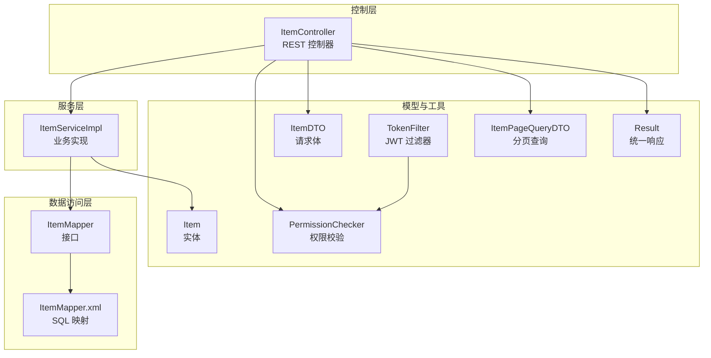
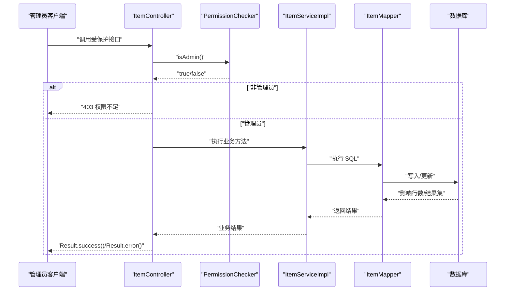
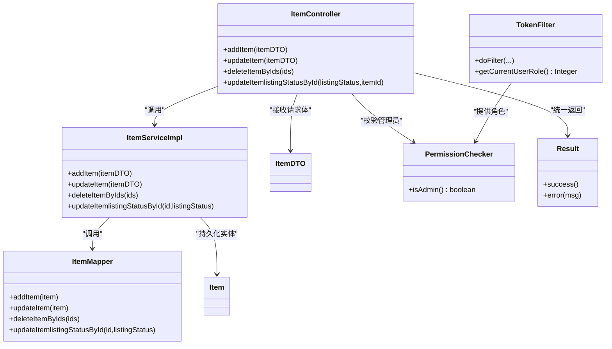

# 拍品管理类接口

<cite>
**本文引用的文件**
- [ItemController.java](file://src/main/java/com/qkl/auctionsystem/controller/ItemController.java)
- [ItemServiceImpl.java](file://src/main/java/com/qkl/auctionsystem/service/impl/ItemServiceImpl.java)
- [ItemMapper.java](file://src/main/java/com/qkl/auctionsystem/mapper/ItemMapper.java)
- [ItemMapper.xml](file://src/main/resources/mapper/ItemMapper.xml)
- [ItemDTO.java](file://src/main/java/com/qkl/auctionsystem/pojo/dto/ItemDTO.java)
- [ItemPageQueryDTO.java](file://src/main/java/com/qkl/auctionsystem/pojo/dto/ItemPageQueryDTO.java)
- [Item.java](file://src/main/java/com/qkl/auctionsystem/pojo/entity/Item.java)
- [PermissionChecker.java](file://src/main/java/com/qkl/auctionsystem/utils/PermissionChecker.java)
- [TokenFilter.java](file://src/main/java/com/qkl/auctionsystem/filter/TokenFilter.java)
- [Result.java](file://src/main/java/com/qkl/auctionsystem/result/Result.java)
- [application.properties](file://src/main/resources/application.properties)
</cite>

## 目录
1. [简介](#简介)
2. [项目结构](#项目结构)
3. [核心组件](#核心组件)
4. [架构总览](#架构总览)
5. [详细接口说明](#详细接口说明)
6. [依赖关系分析](#依赖关系分析)
7. [性能与并发特性](#性能与并发特性)
8. [故障排查指南](#故障排查指南)
9. [结论](#结论)

## 简介
本文件面向管理员，系统化梳理拍品管理相关接口，覆盖新增拍品、修改拍品、批量删除拍品、修改拍品上架状态等能力。重点说明：
- 接口权限校验机制（基于管理员角色）
- 参数绑定与请求体结构
- 业务约束与异常处理策略
- 日志记录规范
- 请求示例与响应格式、状态码含义

## 项目结构
拍品管理相关代码采用分层架构：
- 控制层：控制器负责路由与权限校验
- 服务层：业务逻辑封装，包含状态与上架状态变更
- 数据访问层：MyBatis Mapper 负责 SQL 执行
- 实体与 DTO：数据传输与持久化模型
- 过滤器与工具：JWT 校验与权限判断

图表来源
- [ItemController.java](file://src/main/java/com/qkl/auctionsystem/controller/ItemController.java#L1-L86)
- [ItemServiceImpl.java](file://src/main/java/com/qkl/auctionsystem/service/impl/ItemServiceImpl.java#L1-L182)
- [ItemMapper.java](file://src/main/java/com/qkl/auctionsystem/mapper/ItemMapper.java#L1-L35)
- [ItemMapper.xml](file://src/main/resources/mapper/ItemMapper.xml#L1-L109)
- [ItemDTO.java](file://src/main/java/com/qkl/auctionsystem/pojo/dto/ItemDTO.java#L1-L16)
- [ItemPageQueryDTO.java](file://src/main/java/com/qkl/auctionsystem/pojo/dto/ItemPageQueryDTO.java#L1-L19)
- [Item.java](file://src/main/java/com/qkl/auctionsystem/pojo/entity/Item.java#L1-L34)
- [PermissionChecker.java](file://src/main/java/com/qkl/auctionsystem/utils/PermissionChecker.java#L1-L36)
- [TokenFilter.java](file://src/main/java/com/qkl/auctionsystem/filter/TokenFilter.java#L1-L141)
- [Result.java](file://src/main/java/com/qkl/auctionsystem/result/Result.java#L1-L39)

章节来源
- [ItemController.java](file://src/main/java/com/qkl/auctionsystem/controller/ItemController.java#L1-L86)
- [application.properties](file://src/main/resources/application.properties#L1-L20)

## 核心组件
- 控制器：提供拍品管理相关 REST 接口，统一返回 Result 结构
- 服务实现：封装拍品新增、修改、删除、状态与上架状态更新
- Mapper 与 XML：定义 SQL，支持批量删除、按条件查询、状态更新
- 权限工具：基于 JWT 角色判断是否管理员
- 过滤器：全局拦截，校验令牌并注入用户信息

章节来源
- [Result.java](file://src/main/java/com/qkl/auctionsystem/result/Result.java#L1-L39)
- [PermissionChecker.java](file://src/main/java/com/qkl/auctionsystem/utils/PermissionChecker.java#L1-L36)
- [TokenFilter.java](file://src/main/java/com/qkl/auctionsystem/filter/TokenFilter.java#L1-L141)

## 架构总览
管理员通过 JWT 认证后调用拍品管理接口，控制器进行管理员权限校验，随后委派至服务层执行业务逻辑，最终通过统一响应返回。

图表来源
- [ItemController.java](file://src/main/java/com/qkl/auctionsystem/controller/ItemController.java#L24-L85)
- [PermissionChecker.java](file://src/main/java/com/qkl/auctionsystem/utils/PermissionChecker.java#L15-L18)
- [ItemServiceImpl.java](file://src/main/java/com/qkl/auctionsystem/service/impl/ItemServiceImpl.java#L33-L105)
- [ItemMapper.xml](file://src/main/resources/mapper/ItemMapper.xml#L56-L108)

## 详细接口说明

### 1. 添加拍品（POST /item/add）
- 功能：管理员新增拍品
- 权限要求：必须为管理员（通过 PermissionChecker.isAdmin() 校验）
- 请求方式：POST
- 路径：/item/add
- 请求头：
  - Authorization: Bearer <JWT 令牌>
- 请求体：ItemDTO 对象
  - 字段参考：标题、图片、初始价格、描述、开始/结束时间等
- 响应：
  - 成功：Result.success()，code=1
  - 失败：Result.error(msg)，code=0
- 业务约束：
  - 新增时设置默认状态与上架状态
  - 服务层会自动填充创建/更新时间
- 异常处理：
  - 非管理员：直接返回权限不足
  - 业务异常：抛出运行时异常，控制器捕获并返回 Result.error
- 日志：
  - 控制器记录添加拍品的日志
- 示例请求
  - 方法：POST
  - URL：/auction/item/add
  - 请求头：Authorization: Bearer <你的JWT令牌>
  - 请求体：ItemDTO JSON（字段同 ItemDTO）
- 示例响应
  - 成功：{"code":1,"msg":"成功","data":null}
  - 失败：{"code":0,"msg":"权限不足，只有管理员才能添加拍品","data":null}

章节来源
- [ItemController.java](file://src/main/java/com/qkl/auctionsystem/controller/ItemController.java#L24-L34)
- [ItemServiceImpl.java](file://src/main/java/com/qkl/auctionsystem/service/impl/ItemServiceImpl.java#L33-L43)
- [ItemDTO.java](file://src/main/java/com/qkl/auctionsystem/pojo/dto/ItemDTO.java#L1-L16)
- [Result.java](file://src/main/java/com/qkl/auctionsystem/result/Result.java#L18-L36)

### 2. 修改拍品（PUT /item/update）
- 功能：管理员修改拍品信息
- 权限要求：必须为管理员
- 请求方式：PUT
- 路径：/item/update
- 请求头：
  - Authorization: Bearer <JWT 令牌>
- 请求体：ItemDTO 对象（需包含 id）
- 响应：
  - 成功：Result.success()
  - 失败：Result.error(msg)
- 业务约束：
  - 若拍品处于“已上架”状态（listingStatus=1），则禁止修改
  - 服务层仅允许在“下架中”状态下更新字段
- 异常处理：
  - 非管理员：返回权限不足
  - 已上架拍品：抛出运行时异常，返回错误
- 日志：
  - 控制器记录更新拍品的日志
- 示例请求
  - 方法：PUT
  - URL：/auction/item/update
  - 请求头：Authorization: Bearer <你的JWT令牌>
  - 请求体：ItemDTO JSON（包含 id）
- 示例响应
  - 成功：{"code":1,"msg":"成功","data":null}
  - 失败：{"code":0,"msg":"该拍品已上架，不可修改","data":null}

章节来源
- [ItemController.java](file://src/main/java/com/qkl/auctionsystem/controller/ItemController.java#L68-L78)
- [ItemServiceImpl.java](file://src/main/java/com/qkl/auctionsystem/service/impl/ItemServiceImpl.java#L68-L78)
- [ItemMapper.xml](file://src/main/resources/mapper/ItemMapper.xml#L62-L74)

### 3. 批量删除拍品（DELETE /item/）
- 功能：管理员批量删除拍品
- 权限要求：必须为管理员
- 请求方式：DELETE
- 路径：/item/
- 查询参数：
  - ids：多个拍品ID（数组）
- 请求头：
  - Authorization: Bearer <JWT 令牌>
- 响应：
  - 成功：Result.success()
  - 失败：Result.error(msg)
- 业务约束：
  - 若任一拍品处于“已上架”状态（listingStatus=1），则整体删除失败
  - 服务层先查询各拍品的上架状态再执行删除
- 异常处理：
  - 非管理员：返回权限不足
  - 存在已上架拍品：抛出运行时异常，返回错误
- 日志：
  - 控制器记录删除拍品的日志
- 示例请求
  - 方法：DELETE
  - URL：/auction/item/?ids=1&ids=2
  - 请求头：Authorization: Bearer <你的JWT令牌>
- 示例响应
  - 成功：{"code":1,"msg":"成功","data":null}
  - 失败：{"code":0,"msg":"该拍品已上架，不可删除","data":null}

章节来源
- [ItemController.java](file://src/main/java/com/qkl/auctionsystem/controller/ItemController.java#L56-L66)
- [ItemServiceImpl.java](file://src/main/java/com/qkl/auctionsystem/service/impl/ItemServiceImpl.java#L58-L66)
- [ItemMapper.xml](file://src/main/resources/mapper/ItemMapper.xml#L56-L61)

### 4. 修改拍品上架状态（PUT /item/{listingStatus}）
- 功能：管理员切换拍品的上架状态
- 权限要求：必须为管理员
- 请求方式：PUT
- 路径：/item/{listingStatus}
- 路径参数：
  - listingStatus：目标上架状态（0 下架中，1 上架）
- 查询参数：
  - itemId：拍品ID
- 请求头：
  - Authorization: Bearer <JWT 令牌>
- 响应：
  - 成功：Result.success()
  - 失败：Result.error(msg)
- 业务约束：
  - 该接口不进行额外业务校验，直接更新 listing_status
- 异常处理：
  - 非管理员：返回权限不足
- 日志：
  - 控制器记录更新上架状态的日志
- 示例请求
  - 方法：PUT
  - URL：/auction/item/1?itemId=1001
  - 请求头：Authorization: Bearer <你的JWT令牌>
- 示例响应
  - 成功：{"code":1,"msg":"成功","data":null}
  - 失败：{"code":0,"msg":"权限不足，只有管理员才能修改拍品","data":null}

章节来源
- [ItemController.java](file://src/main/java/com/qkl/auctionsystem/controller/ItemController.java#L80-L85)
- [ItemServiceImpl.java](file://src/main/java/com/qkl/auctionsystem/service/impl/ItemServiceImpl.java#L96-L98)
- [ItemMapper.xml](file://src/main/resources/mapper/ItemMapper.xml#L104-L108)

## 依赖关系分析

图表来源
- [ItemController.java](file://src/main/java/com/qkl/auctionsystem/controller/ItemController.java#L24-L85)
- [ItemServiceImpl.java](file://src/main/java/com/qkl/auctionsystem/service/impl/ItemServiceImpl.java#L33-L105)
- [ItemMapper.java](file://src/main/java/com/qkl/auctionsystem/mapper/ItemMapper.java#L1-L35)
- [ItemDTO.java](file://src/main/java/com/qkl/auctionsystem/pojo/dto/ItemDTO.java#L1-L16)
- [Item.java](file://src/main/java/com/qkl/auctionsystem/pojo/entity/Item.java#L1-L34)
- [PermissionChecker.java](file://src/main/java/com/qkl/auctionsystem/utils/PermissionChecker.java#L15-L18)
- [TokenFilter.java](file://src/main/java/com/qkl/auctionsystem/filter/TokenFilter.java#L55-L127)
- [Result.java](file://src/main/java/com/qkl/auctionsystem/result/Result.java#L18-L36)

## 性能与并发特性
- 分页查询：服务层使用分页组件，避免一次性加载大量数据
- 批量删除：Mapper 使用 IN 子句一次性删除，减少网络往返
- 定时任务：服务层提供定时任务，按时间自动更新拍品状态，降低实时计算压力
- 并发注意：
  - 更新上架状态与修改拍品字段均直接写库，建议在业务层增加必要的幂等性与锁策略（如乐观锁字段）
  - 批量删除前先查询状态，避免不必要的数据库往返

章节来源
- [ItemServiceImpl.java](file://src/main/java/com/qkl/auctionsystem/service/impl/ItemServiceImpl.java#L45-L50)
- [ItemMapper.xml](file://src/main/resources/mapper/ItemMapper.xml#L56-L61)
- [ItemServiceImpl.java](file://src/main/java/com/qkl/auctionsystem/service/impl/ItemServiceImpl.java#L114-L147)

## 故障排查指南
- 401 未授权
  - 现象：返回未授权或令牌非法
  - 原因：缺少 Authorization 或 JWT 不合法
  - 处理：确保携带有效 JWT 令牌
- 403 权限不足
  - 现象：返回权限不足
  - 原因：当前用户非管理员
  - 处理：使用管理员账户登录获取令牌
- 业务异常
  - 已上架拍品不可修改/删除：服务层抛出运行时异常
  - 处理：先将拍品下架后再执行修改/删除
- 统一响应
  - 成功：code=1
  - 失败：code=0，msg 为错误信息
- 日志定位
  - 控制器与服务层均有日志输出，便于追踪请求与异常

章节来源
- [TokenFilter.java](file://src/main/java/com/qkl/auctionsystem/filter/TokenFilter.java#L85-L117)
- [PermissionChecker.java](file://src/main/java/com/qkl/auctionsystem/utils/PermissionChecker.java#L15-L18)
- [ItemServiceImpl.java](file://src/main/java/com/qkl/auctionsystem/service/impl/ItemServiceImpl.java#L58-L78)
- [Result.java](file://src/main/java/com/qkl/auctionsystem/result/Result.java#L18-L36)

## 结论
拍品管理接口围绕管理员权限展开，通过控制器统一入口、服务层业务约束与 Mapper 数据操作，形成清晰的职责边界。建议在生产环境中：
- 在修改/删除接口增加幂等性保障
- 对批量操作增加事务包裹，确保一致性
- 在前端展示时明确区分“已上架”与“下架中”的操作按钮状态