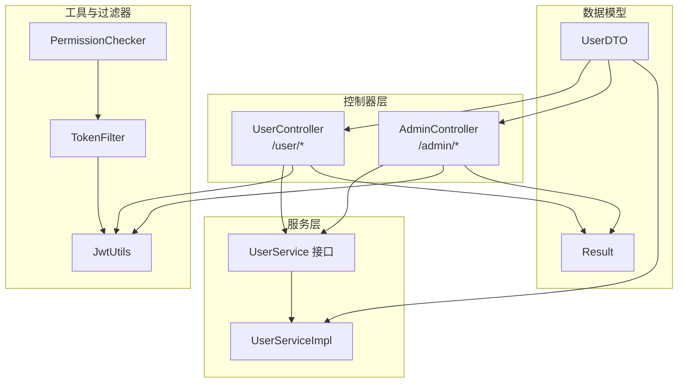
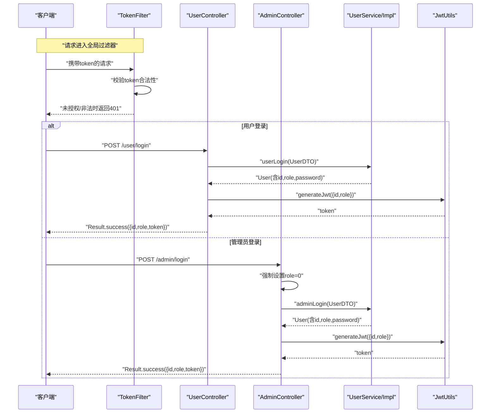
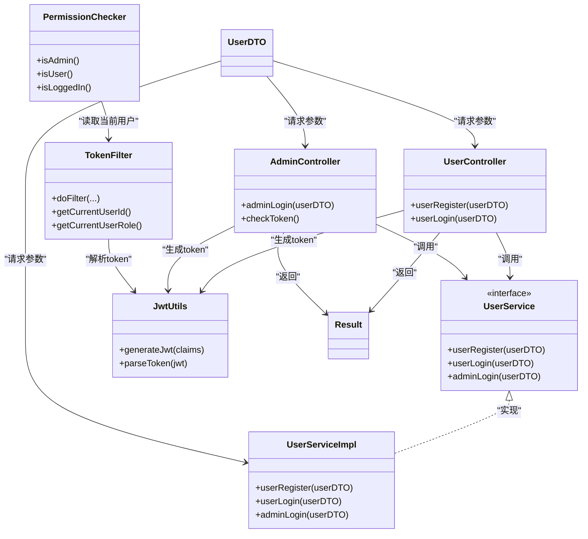

# 用户模块API

<cite>
**本文引用的文件列表**
- [UserController.java](file://src/main/java/com/qkl/auctionsystem/controller/UserController.java)
- [AdminController.java](file://src/main/java/com/qkl/auctionsystem/controller/AdminController.java)
- [UserService.java](file://src/main/java/com/qkl/auctionsystem/service/UserService.java)
- [UserServiceImpl.java](file://src/main/java/com/qkl/auctionsystem/service/impl/UserServiceImpl.java)
- [UserDTO.java](file://src/main/java/com/qkl/auctionsystem/pojo/dto/UserDTO.java)
- [JwtUtils.java](file://src/main/java/com/qkl/auctionsystem/utils/JwtUtils.java)
- [TokenFilter.java](file://src/main/java/com/qkl/auctionsystem/filter/TokenFilter.java)
- [PermissionChecker.java](file://src/main/java/com/qkl/auctionsystem/utils/PermissionChecker.java)
- [Result.java](file://src/main/java/com/qkl/auctionsystem/result/Result.java)
- [request.js](file://html/utils/request.js)
- [admin-login.html](file://html/admin-login.html)
</cite>

## 目录
1. [简介](#简介)
2. [项目结构](#项目结构)
3. [核心组件](#核心组件)
4. [架构总览](#架构总览)
5. [详细接口说明](#详细接口说明)
6. [依赖关系分析](#依赖关系分析)
7. [性能与安全考虑](#性能与安全考虑)
8. [故障排查指南](#故障排查指南)
9. [结论](#结论)
10. [附录](#附录)

## 简介
本文件面向用户模块的RESTful API，覆盖“用户注册”、“用户登录”和“管理员登录”三大核心接口。文档严格依据后端控制器与服务层实现，说明各接口的HTTP方法、URL路径、请求参数、请求体结构、响应格式以及权限校验机制在登录流程中的作用。同时提供JWT令牌生成与返回示例、curl命令行调用示例以及JavaScript fetch调用代码片段，帮助开发者快速集成与调试。

## 项目结构
用户模块相关的核心文件分布如下：
- 控制器层：UserController、AdminController
- 服务层：UserService接口及其实现UserServiceImpl
- 数据传输对象：UserDTO
- 工具类：JwtUtils（JWT生成与解析）、PermissionChecker（权限检查）、TokenFilter（全局拦截与鉴权）
- 统一响应封装：Result
- 前端请求封装：request.js
- 管理端登录页面：admin-login.html

图表来源
- [UserController.java](file://src/main/java/com/qkl/auctionsystem/controller/UserController.java#L1-L49)
- [AdminController.java](file://src/main/java/com/qkl/auctionsystem/controller/AdminController.java#L1-L73)
- [UserService.java](file://src/main/java/com/qkl/auctionsystem/service/UserService.java#L1-L14)
- [UserServiceImpl.java](file://src/main/java/com/qkl/auctionsystem/service/impl/UserServiceImpl.java#L1-L59)
- [JwtUtils.java](file://src/main/java/com/qkl/auctionsystem/utils/JwtUtils.java#L1-L36)
- [TokenFilter.java](file://src/main/java/com/qkl/auctionsystem/filter/TokenFilter.java#L1-L141)
- [PermissionChecker.java](file://src/main/java/com/qkl/auctionsystem/utils/PermissionChecker.java#L1-L36)
- [UserDTO.java](file://src/main/java/com/qkl/auctionsystem/pojo/dto/UserDTO.java#L1-L12)
- [Result.java](file://src/main/java/com/qkl/auctionsystem/result/Result.java#L1-L39)

章节来源
- [UserController.java](file://src/main/java/com/qkl/auctionsystem/controller/UserController.java#L1-L49)
- [AdminController.java](file://src/main/java/com/qkl/auctionsystem/controller/AdminController.java#L1-L73)
- [UserService.java](file://src/main/java/com/qkl/auctionsystem/service/UserService.java#L1-L14)
- [UserServiceImpl.java](file://src/main/java/com/qkl/auctionsystem/service/impl/UserServiceImpl.java#L1-L59)
- [JwtUtils.java](file://src/main/java/com/qkl/auctionsystem/utils/JwtUtils.java#L1-L36)
- [TokenFilter.java](file://src/main/java/com/qkl/auctionsystem/filter/TokenFilter.java#L1-L141)
- [PermissionChecker.java](file://src/main/java/com/qkl/auctionsystem/utils/PermissionChecker.java#L1-L36)
- [UserDTO.java](file://src/main/java/com/qkl/auctionsystem/pojo/dto/UserDTO.java#L1-L12)
- [Result.java](file://src/main/java/com/qkl/auctionsystem/result/Result.java#L1-L39)

## 核心组件
- UserController：提供用户注册与用户登录接口，登录成功后生成JWT并返回用户ID、角色与令牌。
- AdminController：提供管理员登录接口，强制将role设置为管理员（0），登录成功后同样生成JWT并返回用户ID、角色与令牌；另提供管理员token检查接口。
- UserService/UserServiceImpl：实现用户注册、用户登录与管理员登录的业务逻辑，包含用户名存在性、密码匹配与角色校验。
- JwtUtils：负责JWT的生成与解析，定义签名密钥与过期时间。
- TokenFilter：全局过滤器，拦截除公开接口外的所有请求，校验token合法性并将用户信息注入到当前线程上下文。
- PermissionChecker：基于TokenFilter提供的当前用户信息判断是否为管理员、普通用户或已登录。
- Result：统一响应封装，包含code、msg与data字段。
- UserDTO：请求参数载体，包含id、username、password、role。
- request.js：前端请求封装，自动在请求头中携带token并提供get/post/put/del等方法。

章节来源
- [UserController.java](file://src/main/java/com/qkl/auctionsystem/controller/UserController.java#L1-L49)
- [AdminController.java](file://src/main/java/com/qkl/auctionsystem/controller/AdminController.java#L1-L73)
- [UserService.java](file://src/main/java/com/qkl/auctionsystem/service/UserService.java#L1-L14)
- [UserServiceImpl.java](file://src/main/java/com/qkl/auctionsystem/service/impl/UserServiceImpl.java#L1-L59)
- [JwtUtils.java](file://src/main/java/com/qkl/auctionsystem/utils/JwtUtils.java#L1-L36)
- [TokenFilter.java](file://src/main/java/com/qkl/auctionsystem/filter/TokenFilter.java#L1-L141)
- [PermissionChecker.java](file://src/main/java/com/qkl/auctionsystem/utils/PermissionChecker.java#L1-L36)
- [Result.java](file://src/main/java/com/qkl/auctionsystem/result/Result.java#L1-L39)
- [UserDTO.java](file://src/main/java/com/qkl/auctionsystem/pojo/dto/UserDTO.java#L1-L12)
- [request.js](file://html/utils/request.js#L1-L131)

## 架构总览
下图展示用户模块API的请求-响应与权限校验流程，包括控制器、服务层、JWT与全局过滤器之间的交互。

图表来源
- [TokenFilter.java](file://src/main/java/com/qkl/auctionsystem/filter/TokenFilter.java#L55-L127)
- [UserController.java](file://src/main/java/com/qkl/auctionsystem/controller/UserController.java#L23-L48)
- [AdminController.java](file://src/main/java/com/qkl/auctionsystem/controller/AdminController.java#L30-L51)
- [UserService.java](file://src/main/java/com/qkl/auctionsystem/service/UserService.java#L1-L14)
- [UserServiceImpl.java](file://src/main/java/com/qkl/auctionsystem/service/impl/UserServiceImpl.java#L28-L59)
- [JwtUtils.java](file://src/main/java/com/qkl/auctionsystem/utils/JwtUtils.java#L18-L24)

## 详细接口说明

### 用户注册
- HTTP方法：POST
- URL路径：/user/register
- 请求体参数（UserDTO）：
  - username：字符串，必填
  - password：字符串，必填
  - id：整数，可选
  - role：整数，可选（注册时会强制设置为普通用户）
- 成功响应：Result.success()，无额外data
- 失败响应：Result.error(msg)，code为0

章节来源
- [UserController.java](file://src/main/java/com/qkl/auctionsystem/controller/UserController.java#L23-L28)
- [UserServiceImpl.java](file://src/main/java/com/qkl/auctionsystem/service/impl/UserServiceImpl.java#L18-L26)
- [UserDTO.java](file://src/main/java/com/qkl/auctionsystem/pojo/dto/UserDTO.java#L1-L12)
- [Result.java](file://src/main/java/com/qkl/auctionsystem/result/Result.java#L18-L36)

### 用户登录
- HTTP方法：POST
- URL路径：/user/login
- 请求体参数（UserDTO）：
  - username：字符串，必填
  - password：字符串，必填
  - role：整数，可选（登录时由服务层校验，但不强制设置）
- 成功响应：Result.success(data)，其中data包含
  - id：整数，用户ID
  - role：整数，用户角色
  - token：字符串，JWT令牌
- 失败响应：Result.error(msg)，code为0

权限校验机制说明：
- 登录成功后，控制器将用户ID与角色写入JWT声明并签发令牌。
- 全局过滤器对非公开接口进行token校验，解析claims后将用户ID与角色存入当前线程上下文，供后续权限检查使用。

章节来源
- [UserController.java](file://src/main/java/com/qkl/auctionsystem/controller/UserController.java#L30-L48)
- [UserServiceImpl.java](file://src/main/java/com/qkl/auctionsystem/service/impl/UserServiceImpl.java#L28-L40)
- [JwtUtils.java](file://src/main/java/com/qkl/auctionsystem/utils/JwtUtils.java#L18-L24)
- [TokenFilter.java](file://src/main/java/com/qkl/auctionsystem/filter/TokenFilter.java#L85-L117)
- [Result.java](file://src/main/java/com/qkl/auctionsystem/result/Result.java#L18-L36)

### 管理员登录
- HTTP方法：POST
- URL路径：/admin/login
- 请求体参数（UserDTO）：
  - username：字符串，必填
  - password：字符串，必填
  - role：整数，可选（控制器会强制设置为0，表示管理员）
- 成功响应：Result.success(data)，其中data包含
  - id：整数，用户ID
  - role：整数，用户角色（固定为0）
  - token：字符串，JWT令牌
- 失败响应：Result.error(msg)，code为0

管理员登录的role参数校验逻辑：
- 控制器在调用服务前，显式将role设置为0。
- 服务层在adminLogin中除校验用户名与密码外，还会校验用户的角色必须为管理员（0），否则抛出异常。

章节来源
- [AdminController.java](file://src/main/java/com/qkl/auctionsystem/controller/AdminController.java#L30-L51)
- [UserServiceImpl.java](file://src/main/java/com/qkl/auctionsystem/service/impl/UserServiceImpl.java#L42-L57)
- [JwtUtils.java](file://src/main/java/com/qkl/auctionsystem/utils/JwtUtils.java#L18-L24)
- [TokenFilter.java](file://src/main/java/com/qkl/auctionsystem/filter/TokenFilter.java#L85-L117)
- [Result.java](file://src/main/java/com/qkl/auctionsystem/result/Result.java#L18-L36)

### 管理员token检查（辅助接口）
- HTTP方法：GET
- URL路径：/admin/check-token
- 功能：读取当前线程上下文中存储的用户ID与角色，返回给前端用于界面控制或二次确认。
- 成功响应：Result.success(data)，其中data包含
  - id：整数，当前用户ID
  - role：整数，当前用户角色

章节来源
- [AdminController.java](file://src/main/java/com/qkl/auctionsystem/controller/AdminController.java#L57-L72)
- [TokenFilter.java](file://src/main/java/com/qkl/auctionsystem/filter/TokenFilter.java#L27-L45)

## 依赖关系分析
- 控制器依赖服务层接口，服务层依赖数据映射器执行数据库操作。
- 控制器在登录成功后依赖JwtUtils生成JWT，并通过全局过滤器TokenFilter完成token校验与用户信息注入。
- PermissionChecker基于TokenFilter提供的当前用户信息进行角色判断。

图表来源
- [UserController.java](file://src/main/java/com/qkl/auctionsystem/controller/UserController.java#L1-L49)
- [AdminController.java](file://src/main/java/com/qkl/auctionsystem/controller/AdminController.java#L1-L73)
- [UserService.java](file://src/main/java/com/qkl/auctionsystem/service/UserService.java#L1-L14)
- [UserServiceImpl.java](file://src/main/java/com/qkl/auctionsystem/service/impl/UserServiceImpl.java#L1-L59)
- [JwtUtils.java](file://src/main/java/com/qkl/auctionsystem/utils/JwtUtils.java#L1-L36)
- [TokenFilter.java](file://src/main/java/com/qkl/auctionsystem/filter/TokenFilter.java#L1-L141)
- [PermissionChecker.java](file://src/main/java/com/qkl/auctionsystem/utils/PermissionChecker.java#L1-L36)
- [UserDTO.java](file://src/main/java/com/qkl/auctionsystem/pojo/dto/UserDTO.java#L1-L12)
- [Result.java](file://src/main/java/com/qkl/auctionsystem/result/Result.java#L1-L39)

## 性能与安全考虑
- JWT签名与过期：采用对称签名算法，令牌有效期固定，建议结合HTTPS与安全存储策略降低泄露风险。
- 全局过滤器：对非公开接口统一校验token，避免重复校验逻辑，提升一致性与可维护性。
- 密码校验：服务层在登录时进行用户名存在性与密码匹配校验，管理员登录还校验角色为管理员，确保权限边界清晰。
- 前端存储：前端使用localStorage存储token，注意跨站脚本攻击与本地存储安全问题，建议配合HttpOnly Cookie方案或更严格的前端安全策略。

[本节为通用指导，不直接分析具体文件]

## 故障排查指南
- 未授权/非法token
  - 现象：返回401状态与错误消息。
  - 可能原因：缺少token、token为空、token非法或已过期。
  - 处理建议：重新登录获取新token，确认请求头中携带正确的token。
- 用户名不存在/密码错误
  - 现象：登录失败，返回错误消息。
  - 可能原因：用户名拼写错误或密码不正确。
  - 处理建议：核对用户名与密码，确认大小写与特殊字符。
- 非管理员尝试管理员登录
  - 现象：管理员登录失败，提示“该用户不是管理员”。
  - 可能原因：用户角色非管理员。
  - 处理建议：使用管理员账户或联系系统管理员。

章节来源
- [TokenFilter.java](file://src/main/java/com/qkl/auctionsystem/filter/TokenFilter.java#L85-L117)
- [UserServiceImpl.java](file://src/main/java/com/qkl/auctionsystem/service/impl/UserServiceImpl.java#L32-L57)
- [Result.java](file://src/main/java/com/qkl/auctionsystem/result/Result.java#L31-L36)

## 结论
用户模块API以简洁明确的REST风格提供用户注册、用户登录与管理员登录能力。登录成功后统一返回JWT令牌，配合全局过滤器实现统一的权限校验与用户信息注入。管理员登录接口通过控制器强制设置角色并由服务层进行严格校验，确保权限边界。前端通过request.js统一处理token携带与响应解析，便于集成与扩展。

[本节为总结性内容，不直接分析具体文件]

## 附录

### curl命令行调用示例
- 用户注册
  - 方法：POST
  - URL：/user/register
  - 示例：curl -X POST http://localhost:8080/user/register -H "Content-Type: application/json" -d '{"username":"test","password":"pwd"}'
- 用户登录
  - 方法：POST
  - URL：/user/login
  - 示例：curl -X POST http://localhost:8080/user/login -H "Content-Type: application/json" -d '{"username":"test","password":"pwd"}'
- 管理员登录
  - 方法：POST
  - URL：/admin/login
  - 示例：curl -X POST http://localhost:8080/admin/login -H "Content-Type: application/json" -d '{"username":"admin","password":"admin"}'

章节来源
- [UserController.java](file://src/main/java/com/qkl/auctionsystem/controller/UserController.java#L23-L48)
- [AdminController.java](file://src/main/java/com/qkl/auctionsystem/controller/AdminController.java#L30-L51)

### JavaScript fetch调用代码片段
- 通用请求封装（携带token）
  - 参考：[request.js](file://html/utils/request.js#L32-L61)
- 管理员登录（前端示例）
  - 参考：[admin-login.html](file://html/admin-login.html#L48-L82)
  - 关键点：调用/admin/login，携带username、password与role=0，登录成功后将返回的token保存至localStorage。

章节来源
- [request.js](file://html/utils/request.js#L1-L131)
- [admin-login.html](file://html/admin-login.html#L48-L82)