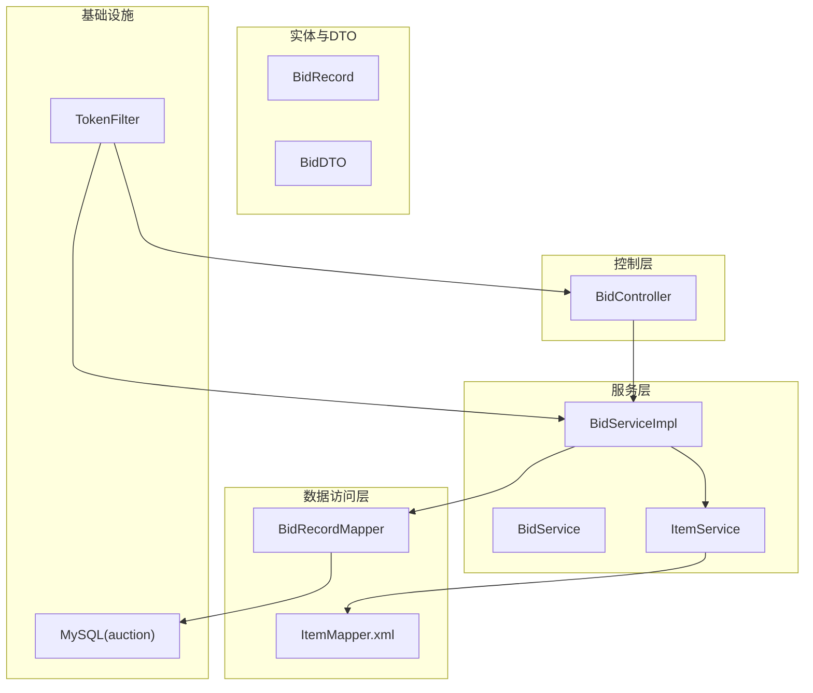
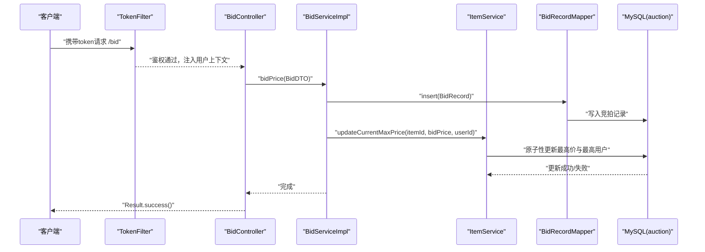
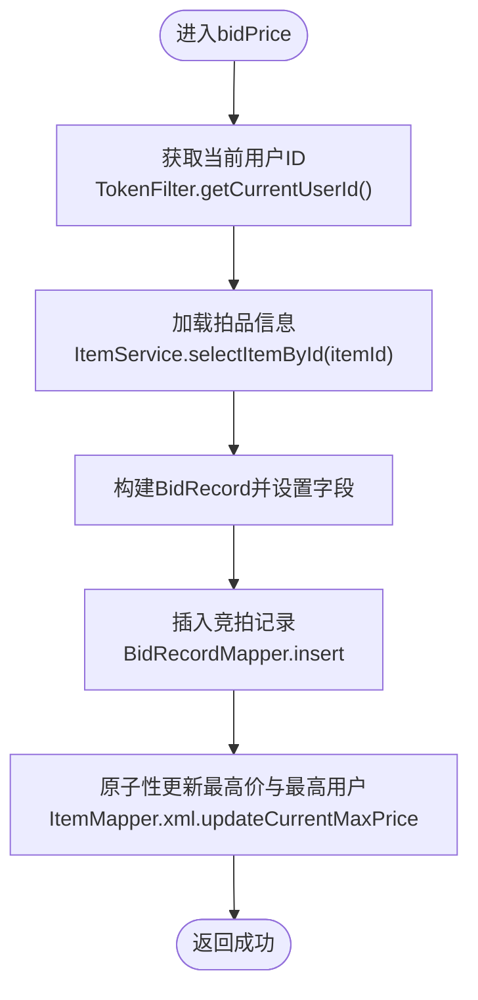
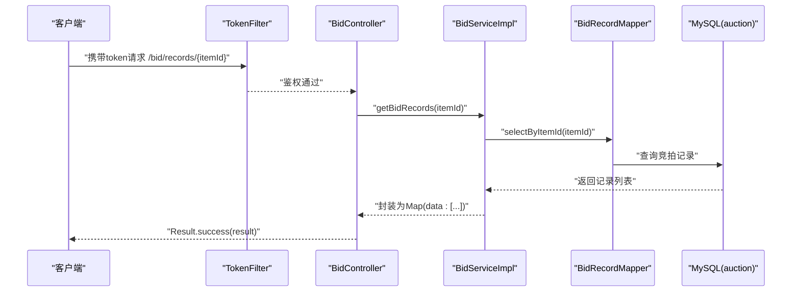
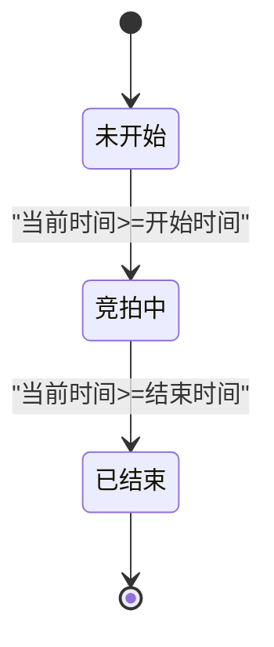
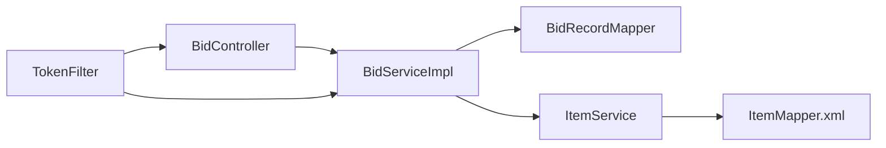

# 竞拍模块API

<cite>
**本文引用的文件**
- [BidController.java](file://src/main/java/com/qkl/auctionsystem/controller/BidController.java)
- [BidService.java](file://src/main/java/com/qkl/auctionsystem/service/BidService.java)
- [BidServiceImpl.java](file://src/main/java/com/qkl/auctionsystem/service/impl/BidServiceImpl.java)
- [BidRecordMapper.java](file://src/main/java/com/qkl/auctionsystem/mapper/BidRecordMapper.java)
- [ItemService.java](file://src/main/java/com/qkl/auctionsystem/service/ItemService.java)
- [ItemMapper.xml](file://src/main/resources/mapper/ItemMapper.xml)
- [TokenFilter.java](file://src/main/java/com/qkl/auctionsystem/filter/TokenFilter.java)
- [application.properties](file://src/main/resources/application.properties)
- [auction_database.sql](file://auction_database.sql)
- [说明.md](file://说明.md)
</cite>

## 目录
1. [简介](#简介)
2. [项目结构](#项目结构)
3. [核心组件](#核心组件)
4. [架构总览](#架构总览)
5. [详细组件分析](#详细组件分析)
6. [依赖关系分析](#依赖关系分析)
7. [性能考量](#性能考量)
8. [故障排查指南](#故障排查指南)
9. [结论](#结论)
10. [附录](#附录)

## 简介
本文件聚焦竞拍模块的两个核心API：
- 出价接口：POST /bid，接收拍品ID、出价金额与用户令牌，完成出价记录写入与最高价更新。
- 竞拍记录查询接口：GET /bid/records/{itemId}，按拍品ID查询历史出价记录，返回标准化的时间戳与金额等字段。

同时，文档结合BidController与BidServiceImpl的实现，说明业务规则校验（如出价需高于当前最高价）、事务处理逻辑（通过数据库层原子性保障）以及与区块链数据源的集成现状（当前为模拟实现，未来可扩展）。

## 项目结构
竞拍模块位于后端Java工程中，采用分层架构：
- 控制层：BidController 提供REST接口
- 服务层：BidService 接口与BidServiceImpl实现
- 数据访问层：BidRecordMapper接口与MyBatis映射文件
- 实体与DTO：BidRecord、BidDTO等
- 过滤器：TokenFilter负责鉴权与用户上下文注入
- 配置：application.properties配置数据库连接与MyBatis

图表来源
- [BidController.java](file://src/main/java/com/qkl/auctionsystem/controller/BidController.java#L1-L47)
- [BidServiceImpl.java](file://src/main/java/com/qkl/auctionsystem/service/impl/BidServiceImpl.java#L1-L75)
- [BidRecordMapper.java](file://src/main/java/com/qkl/auctionsystem/mapper/BidRecordMapper.java#L1-L19)
- [ItemMapper.xml](file://src/main/resources/mapper/ItemMapper.xml#L85-L109)
- [TokenFilter.java](file://src/main/java/com/qkl/auctionsystem/filter/TokenFilter.java#L1-L141)

章节来源
- [BidController.java](file://src/main/java/com/qkl/auctionsystem/controller/BidController.java#L1-L47)
- [application.properties](file://src/main/resources/application.properties#L1-L20)

## 核心组件
- 出价接口（POST /bid）
  - 请求体：BidDTO（itemId, bidPrice）
  - 业务规则：出价必须高于当前最高价；拍品必须处于“竞拍中”状态（由ItemMapper.xml中的条件保证原子性更新）
  - 事务处理：数据库层原子性更新最高价与最高出价用户；异常向上抛出，由全局异常处理统一返回
- 竞拍记录查询（GET /bid/records/{itemId}）
  - 参数：路径变量itemId
  - 返回：包含data数组的Map，数组元素为BidRecordDTO（包含bidTime、userId、bidPrice）

章节来源
- [BidController.java](file://src/main/java/com/qkl/auctionsystem/controller/BidController.java#L29-L46)
- [BidDTO.java](file://src/main/java/com/qkl/auctionsystem/pojo/dto/BidDTO.java#L1-L10)
- [BidServiceImpl.java](file://src/main/java/com/qkl/auctionsystem/service/impl/BidServiceImpl.java#L29-L75)
- [BidRecordMapper.java](file://src/main/java/com/qkl/auctionsystem/mapper/BidRecordMapper.java#L1-L19)
- [ItemMapper.xml](file://src/main/resources/mapper/ItemMapper.xml#L99-L103)

## 架构总览
下图展示从客户端到数据库的完整调用链路与关键决策点。

图表来源
- [TokenFilter.java](file://src/main/java/com/qkl/auctionsystem/filter/TokenFilter.java#L55-L127)
- [BidController.java](file://src/main/java/com/qkl/auctionsystem/controller/BidController.java#L29-L34)
- [BidServiceImpl.java](file://src/main/java/com/qkl/auctionsystem/service/impl/BidServiceImpl.java#L29-L53)
- [BidRecordMapper.java](file://src/main/java/com/qkl/auctionsystem/mapper/BidRecordMapper.java#L14-L15)
- [ItemMapper.xml](file://src/main/resources/mapper/ItemMapper.xml#L99-L103)

## 详细组件分析

### 出价接口（POST /bid）
- 请求参数
  - itemId：拍品ID（Long）
  - bidPrice：出价金额（Long）
  - token：请求头携带的用户令牌
- 业务规则校验
  - 出价必须高于当前最高价：由数据库层原子性更新保证，仅当当前最高价小于新出价时才更新
  - 拍品状态：必须处于“竞拍中”，由ItemMapper.xml中的条件约束确保
- 事务处理逻辑
  - 写入竞拍记录：BidRecordMapper.insert
  - 原子性更新最高价与最高出价用户：ItemMapper.xml.updateCurrentMaxPrice
  - 异常处理：捕获数据库异常并向上抛出，由全局异常处理返回错误
- 典型请求/响应示例
  - 请求示例（JSON）
    - URL：POST /auction/bid
    - Headers：token: <你的令牌>
    - Body：
      - itemId: 1001
      - bidPrice: 1200
  - 响应示例（JSON）
    - code: 200
    - msg: "成功"
    - data: null

图表来源
- [BidServiceImpl.java](file://src/main/java/com/qkl/auctionsystem/service/impl/BidServiceImpl.java#L29-L53)
- [TokenFilter.java](file://src/main/java/com/qkl/auctionsystem/filter/TokenFilter.java#L27-L37)
- [ItemMapper.xml](file://src/main/resources/mapper/ItemMapper.xml#L99-L103)

章节来源
- [BidController.java](file://src/main/java/com/qkl/auctionsystem/controller/BidController.java#L29-L34)
- [BidServiceImpl.java](file://src/main/java/com/qkl/auctionsystem/service/impl/BidServiceImpl.java#L29-L53)
- [ItemService.java](file://src/main/java/com/qkl/auctionsystem/service/ItemService.java#L26-L33)
- [ItemMapper.xml](file://src/main/resources/mapper/ItemMapper.xml#L99-L103)

### 竞拍记录查询（GET /bid/records/{itemId}）
- 请求参数
  - 路径变量：itemId（Long）
- 返回结构
  - data：数组，元素为BidRecordDTO
    - bidTime：毫秒级时间戳
    - userId：出价用户ID
    - bidPrice：出价金额（Long）
- 实现机制
  - 通过BidRecordMapper.selectByItemId(itemId)按拍品ID查询记录
  - 将BidRecord转换为BidRecordDTO，统一时间格式为毫秒级时间戳
  - 封装为Map并返回
- 与区块链数据源的集成现状
  - 当前实现基于MySQL数据库，无区块链交互逻辑
  - 若需对接区块链，可在服务层增加区块链读取与一致性校验步骤，确保链上与链下数据一致

图表来源
- [BidController.java](file://src/main/java/com/qkl/auctionsystem/controller/BidController.java#L41-L46)
- [BidServiceImpl.java](file://src/main/java/com/qkl/auctionsystem/service/impl/BidServiceImpl.java#L55-L75)
- [BidRecordMapper.java](file://src/main/java/com/qkl/auctionsystem/mapper/BidRecordMapper.java#L17-L18)

章节来源
- [BidController.java](file://src/main/java/com/qkl/auctionsystem/controller/BidController.java#L41-L46)
- [BidServiceImpl.java](file://src/main/java/com/qkl/auctionsystem/service/impl/BidServiceImpl.java#L55-L75)
- [BidRecordMapper.java](file://src/main/java/com/qkl/auctionsystem/mapper/BidRecordMapper.java#L17-L18)

### 竞拍成功后的状态更新流程
- 流程概述
  - 拍品状态由定时任务根据开始/结束时间自动更新（未开始、竞拍中、已结束）
  - 拍品结束后，若存在最高出价用户，则生成待付款订单
- 关键点
  - 最高价与最高用户在数据库层原子性更新，避免并发竞争导致的数据不一致
  - 订单生成时使用拍品的最终最高价与最高出价用户

图表来源
- [ItemServiceImpl.java](file://src/main/java/com/qkl/auctionsystem/service/impl/ItemServiceImpl.java#L108-L147)
- [ItemMapper.xml](file://src/main/resources/mapper/ItemMapper.xml#L95-L108)

章节来源
- [ItemService.java](file://src/main/java/com/qkl/auctionsystem/service/ItemService.java#L26-L33)
- [ItemMapper.xml](file://src/main/resources/mapper/ItemMapper.xml#L95-L108)

## 依赖关系分析
- 控制层依赖服务层，服务层依赖数据访问层与业务服务
- TokenFilter贯穿请求生命周期，负责鉴权与用户上下文注入
- 数据库层通过MyBatis映射文件实现原子性更新与查询

图表来源
- [BidController.java](file://src/main/java/com/qkl/auctionsystem/controller/BidController.java#L1-L47)
- [BidServiceImpl.java](file://src/main/java/com/qkl/auctionsystem/service/impl/BidServiceImpl.java#L1-L75)
- [TokenFilter.java](file://src/main/java/com/qkl/auctionsystem/filter/TokenFilter.java#L1-L141)
- [ItemMapper.xml](file://src/main/resources/mapper/ItemMapper.xml#L85-L109)

章节来源
- [application.properties](file://src/main/resources/application.properties#L1-L20)

## 性能考量
- 数据库索引
  - 拍品表对status、listing_status、start_time、end_time建立索引，有利于状态查询与排序
  - 竞拍记录表对item_id、user_id、bid_time建立索引，提升查询与排序效率
- 原子性更新
  - 使用数据库层条件更新，避免应用层竞争条件，减少锁争用
- 分页与缓存
  - 对于大量记录的查询，建议在服务层引入分页或缓存策略，降低数据库压力

章节来源
- [auction_database.sql](file://auction_database.sql#L25-L72)

## 故障排查指南
- 401未授权
  - 可能原因：缺少token或token非法
  - 解决方案：确认请求头携带token且符合JWT规范
- 出价失败
  - 可能原因：数据库异常、拍品状态不满足竞拍中、并发导致的最高价更新失败
  - 解决方案：检查数据库连接、拍品状态、重试机制
- 记录查询为空
  - 可能原因：itemId不存在或尚未有出价记录
  - 解决方案：确认itemId正确，等待出价发生后再查询

章节来源
- [TokenFilter.java](file://src/main/java/com/qkl/auctionsystem/filter/TokenFilter.java#L85-L117)
- [BidServiceImpl.java](file://src/main/java/com/qkl/auctionsystem/service/impl/BidServiceImpl.java#L44-L53)
- [ItemMapper.xml](file://src/main/resources/mapper/ItemMapper.xml#L99-L103)

## 结论
竞拍模块通过清晰的分层设计与数据库层原子性更新，实现了可靠的出价与记录查询能力。当前版本以MySQL为数据源，未来可按需扩展区块链集成以增强可信度与审计能力。建议在生产环境中完善并发控制、异常处理与监控告警体系。

## 附录
- API定义摘要
  - POST /auction/bid
    - 请求体：itemId(Long), bidPrice(Long)
    - 响应：Result.success()
  - GET /auction/bid/records/{itemId}
    - 响应：Map(data:[{bidTime(Long), userId(Long), bidPrice(Long)}])

章节来源
- [说明.md](file://说明.md#L52-L61)
- [application.properties](file://src/main/resources/application.properties#L1-L20)