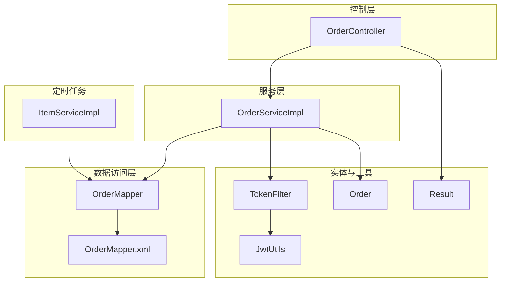
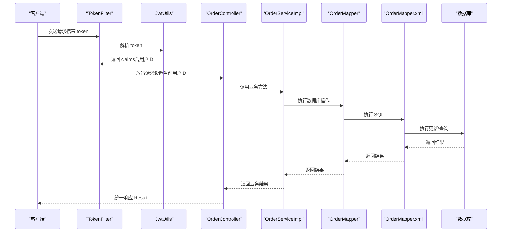
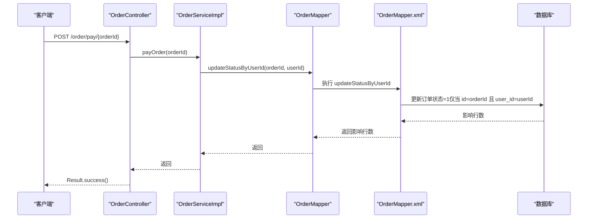
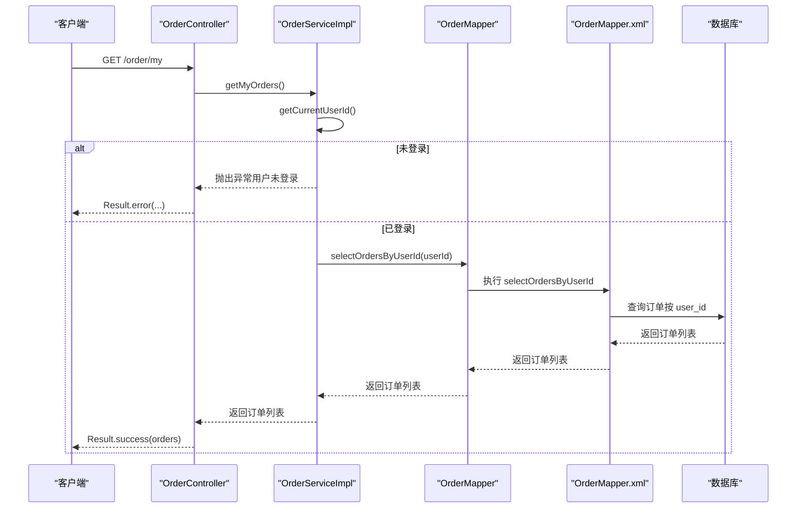
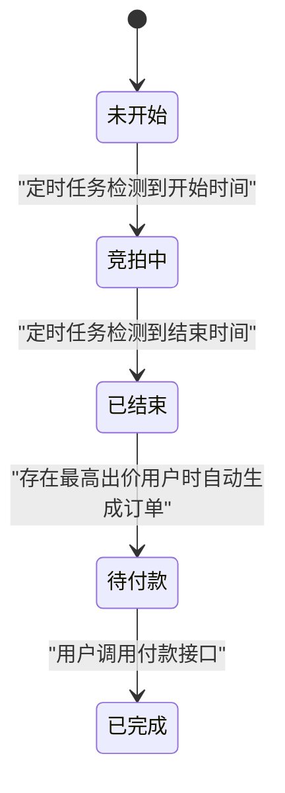
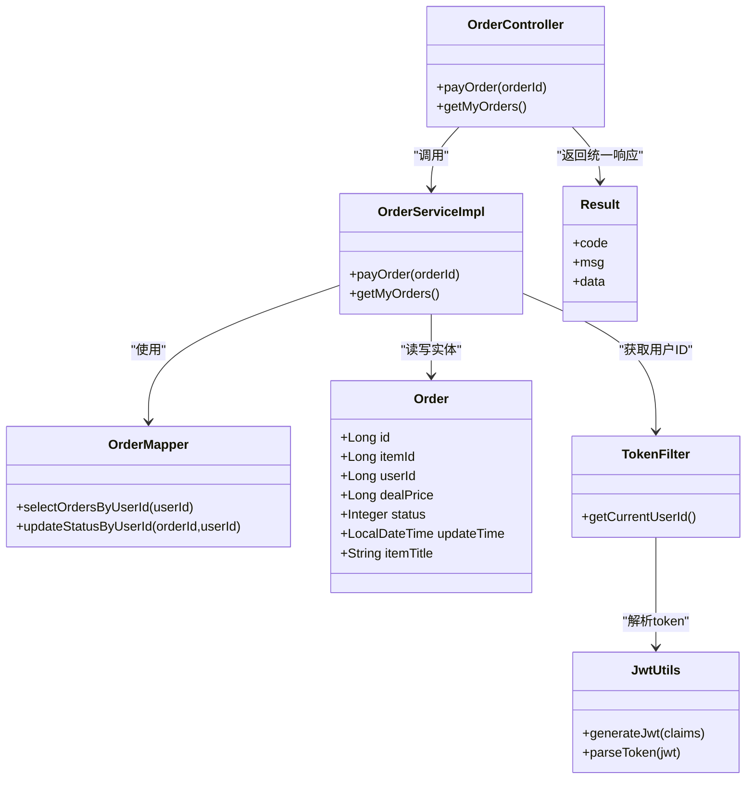

# 订单模块API

<cite>
**本文引用的文件**
- [OrderController.java](file://src/main/java/com/qkl/auctionsystem/controller/OrderController.java)
- [OrderServiceImpl.java](file://src/main/java/com/qkl/auctionsystem/service/impl/OrderServiceImpl.java)
- [OrderMapper.java](file://src/main/java/com/qkl/auctionsystem/mapper/OrderMapper.java)
- [OrderMapper.xml](file://src/main/resources/mapper/OrderMapper.xml)
- [Order.java](file://src/main/java/com/qkl/auctionsystem/pojo/entity/Order.java)
- [TokenFilter.java](file://src/main/java/com/qkl/auctionsystem/filter/TokenFilter.java)
- [JwtUtils.java](file://src/main/java/com/qkl/auctionsystem/utils/JwtUtils.java)
- [OrderService.java](file://src/main/java/com/qkl/auctionsystem/service/OrderService.java)
- [ItemServiceImpl.java](file://src/main/java/com/qkl/auctionsystem/service/impl/ItemServiceImpl.java)
- [Result.java](file://src/main/java/com/qkl/auctionsystem/result/Result.java)
- [auction_database.sql](file://auction_database.sql)
- [user-order.html](file://html/user-order.html)
</cite>

## 目录
1. [简介](#简介)
2. [项目结构](#项目结构)
3. [核心组件](#核心组件)
4. [架构总览](#架构总览)
5. [详细组件分析](#详细组件分析)
6. [依赖关系分析](#依赖关系分析)
7. [性能与扩展性](#性能与扩展性)
8. [故障排查指南](#故障排查指南)
9. [结论](#结论)
10. [附录](#附录)

## 简介
本文件面向“订单模块”的两个关键API进行系统化说明：
- 订单付款接口：POST /order/pay/{orderId}
- 我的订单列表接口：GET /order/my

重点覆盖以下内容：
- 订单付款的实现逻辑：订单状态校验（必须为待付款）、用户权限验证（必须是订单所属用户）、状态更新流程。
- 我的订单列表的分页查询与数据过滤规则（仅返回当前用户订单）。
- 强调订单的生成是自动化的（由定时任务触发），而非通过API创建。
- 基于 OrderController.java 的代码解释订单状态机的转换过程，并给出请求/响应示例与错误码说明。

## 项目结构
围绕订单模块的关键文件组织如下：
- 控制层：OrderController 负责对外暴露 REST 接口。
- 服务层：OrderServiceImpl 实现业务逻辑，依赖 TokenFilter 提取当前用户，依赖 OrderMapper 访问数据库。
- 数据访问层：OrderMapper 接口与 OrderMapper.xml 映射 SQL。
- 实体模型：Order 表示订单实体。
- 权限与认证：TokenFilter 通过 JWT 校验与解析，提供当前用户ID；JwtUtils 提供签名与解析工具。
- 定时任务：ItemServiceImpl 中的定时任务在拍品结束后自动生成订单（状态为待付款）。
- 统一返回：Result 提供统一的响应结构。

图表来源
- [OrderController.java](file://src/main/java/com/qkl/auctionsystem/controller/OrderController.java#L1-L43)
- [OrderServiceImpl.java](file://src/main/java/com/qkl/auctionsystem/service/impl/OrderServiceImpl.java#L1-L43)
- [OrderMapper.java](file://src/main/java/com/qkl/auctionsystem/mapper/OrderMapper.java#L1-L19)
- [OrderMapper.xml](file://src/main/resources/mapper/OrderMapper.xml#L1-L15)
- [Order.java](file://src/main/java/com/qkl/auctionsystem/pojo/entity/Order.java#L1-L24)
- [TokenFilter.java](file://src/main/java/com/qkl/auctionsystem/filter/TokenFilter.java#L1-L141)
- [JwtUtils.java](file://src/main/java/com/qkl/auctionsystem/utils/JwtUtils.java#L1-L36)
- [Result.java](file://src/main/java/com/qkl/auctionsystem/result/Result.java#L1-L39)
- [ItemServiceImpl.java](file://src/main/java/com/qkl/auctionsystem/service/impl/ItemServiceImpl.java#L135-L182)

章节来源
- [OrderController.java](file://src/main/java/com/qkl/auctionsystem/controller/OrderController.java#L1-L43)
- [OrderServiceImpl.java](file://src/main/java/com/qkl/auctionsystem/service/impl/OrderServiceImpl.java#L1-L43)
- [OrderMapper.java](file://src/main/java/com/qkl/auctionsystem/mapper/OrderMapper.java#L1-L19)
- [OrderMapper.xml](file://src/main/resources/mapper/OrderMapper.xml#L1-L15)
- [Order.java](file://src/main/java/com/qkl/auctionsystem/pojo/entity/Order.java#L1-L24)
- [TokenFilter.java](file://src/main/java/com/qkl/auctionsystem/filter/TokenFilter.java#L1-L141)
- [JwtUtils.java](file://src/main/java/com/qkl/auctionsystem/utils/JwtUtils.java#L1-L36)
- [Result.java](file://src/main/java/com/qkl/auctionsystem/result/Result.java#L1-L39)
- [ItemServiceImpl.java](file://src/main/java/com/qkl/auctionsystem/service/impl/ItemServiceImpl.java#L135-L182)

## 核心组件
- 订单控制器 OrderController：提供 /order/pay/{orderId} 和 /order/my 两个接口。
- 订单服务 OrderServiceImpl：实现订单付款与查询我的订单列表的业务逻辑。
- 订单映射 OrderMapper：定义订单插入、按用户查询、按用户更新状态等方法。
- MyBatis 映射 OrderMapper.xml：实现按用户查询与按用户更新状态的 SQL。
- 实体 Order：订单字段定义（含状态、成交价、更新时间等）。
- 权限过滤器 TokenFilter：从请求头 token 解析用户身份，提供当前用户ID。
- JWT 工具 JwtUtils：生成与解析 JWT。
- 统一返回 Result：统一响应结构 code/msg/data。
- 定时任务 ItemServiceImpl：拍品结束后自动生成订单（状态为待付款）。

章节来源
- [OrderController.java](file://src/main/java/com/qkl/auctionsystem/controller/OrderController.java#L1-L43)
- [OrderServiceImpl.java](file://src/main/java/com/qkl/auctionsystem/service/impl/OrderServiceImpl.java#L1-L43)
- [OrderMapper.java](file://src/main/java/com/qkl/auctionsystem/mapper/OrderMapper.java#L1-L19)
- [OrderMapper.xml](file://src/main/resources/mapper/OrderMapper.xml#L1-L15)
- [Order.java](file://src/main/java/com/qkl/auctionsystem/pojo/entity/Order.java#L1-L24)
- [TokenFilter.java](file://src/main/java/com/qkl/auctionsystem/filter/TokenFilter.java#L1-L141)
- [JwtUtils.java](file://src/main/java/com/qkl/auctionsystem/utils/JwtUtils.java#L1-L36)
- [Result.java](file://src/main/java/com/qkl/auctionsystem/result/Result.java#L1-L39)
- [ItemServiceImpl.java](file://src/main/java/com/qkl/auctionsystem/service/impl/ItemServiceImpl.java#L135-L182)

## 架构总览
订单模块遵循典型的三层架构：
- 控制层负责接收请求与返回统一响应。
- 服务层负责业务规则与权限校验。
- 数据访问层负责与数据库交互。

图表来源
- [TokenFilter.java](file://src/main/java/com/qkl/auctionsystem/filter/TokenFilter.java#L55-L127)
- [JwtUtils.java](file://src/main/java/com/qkl/auctionsystem/utils/JwtUtils.java#L26-L35)
- [OrderController.java](file://src/main/java/com/qkl/auctionsystem/controller/OrderController.java#L21-L42)
- [OrderServiceImpl.java](file://src/main/java/com/qkl/auctionsystem/service/impl/OrderServiceImpl.java#L22-L42)
- [OrderMapper.java](file://src/main/java/com/qkl/auctionsystem/mapper/OrderMapper.java#L12-L19)
- [OrderMapper.xml](file://src/main/resources/mapper/OrderMapper.xml#L6-L14)

## 详细组件分析

### 订单付款接口：POST /order/pay/{orderId}
- 接口职责：将指定订单的状态从“待付款”更新为“已完成”。
- 认证与授权：
  - 通过 TokenFilter 从请求头 token 解析用户身份，获取当前用户ID。
  - 服务层通过 TokenFilter.getCurrentUserId() 获取当前用户ID。
  - 服务层调用 OrderMapper.updateStatusByUserId(orderId, userId)，该方法在 SQL 层面同时校验订单属于当前用户。
- 状态更新：
  - MyBatis 映射 updateStatusByUserId 将订单状态更新为 1（已完成）。
  - 该更新语句仅在订单ID与用户ID匹配时生效，从而实现“仅允许订单所属用户进行付款”的权限控制。
- 错误处理：
  - 若订单不存在或不属于当前用户，SQL 不会更新任何记录，服务层不会抛出异常，但业务上可视为“无效操作”。
  - 前端可通过统一响应的 code 判断是否成功。

图表来源
- [OrderController.java](file://src/main/java/com/qkl/auctionsystem/controller/OrderController.java#L26-L31)
- [OrderServiceImpl.java](file://src/main/java/com/qkl/auctionsystem/service/impl/OrderServiceImpl.java#L22-L26)
- [OrderMapper.java](file://src/main/java/com/qkl/auctionsystem/mapper/OrderMapper.java#L16-L19)
- [OrderMapper.xml](file://src/main/resources/mapper/OrderMapper.xml#L6-L8)

章节来源
- [OrderController.java](file://src/main/java/com/qkl/auctionsystem/controller/OrderController.java#L26-L31)
- [OrderServiceImpl.java](file://src/main/java/com/qkl/auctionsystem/service/impl/OrderServiceImpl.java#L22-L26)
- [OrderMapper.java](file://src/main/java/com/qkl/auctionsystem/mapper/OrderMapper.java#L16-L19)
- [OrderMapper.xml](file://src/main/resources/mapper/OrderMapper.xml#L6-L8)
- [TokenFilter.java](file://src/main/java/com/qkl/auctionsystem/filter/TokenFilter.java#L27-L45)

### 我的订单列表接口：GET /order/my
- 接口职责：返回当前登录用户的全部订单列表。
- 分页与过滤：
  - 当前实现未使用分页插件，直接按用户ID查询所有订单。
  - MyBatis 映射 selectOrdersByUserId 在 where 条件中限定 user_id=userId。
- 数据结构：
  - 返回实体 Order，其中包含订单状态、成交价、更新时间以及拍品标题（通过左连接 auction_item 获取）。
- 权限与异常：
  - 服务层在获取当前用户ID为空时抛出运行时异常，提示“用户未登录，请先登录”。
  - 前端应确保携带有效 token，避免出现未授权情况。

图表来源
- [OrderController.java](file://src/main/java/com/qkl/auctionsystem/controller/OrderController.java#L33-L42)
- [OrderServiceImpl.java](file://src/main/java/com/qkl/auctionsystem/service/impl/OrderServiceImpl.java#L28-L42)
- [OrderMapper.java](file://src/main/java/com/qkl/auctionsystem/mapper/OrderMapper.java#L16-L16)
- [OrderMapper.xml](file://src/main/resources/mapper/OrderMapper.xml#L9-L14)

章节来源
- [OrderController.java](file://src/main/java/com/qkl/auctionsystem/controller/OrderController.java#L33-L42)
- [OrderServiceImpl.java](file://src/main/java/com/qkl/auctionsystem/service/impl/OrderServiceImpl.java#L28-L42)
- [OrderMapper.java](file://src/main/java/com/qkl/auctionsystem/mapper/OrderMapper.java#L16-L16)
- [OrderMapper.xml](file://src/main/resources/mapper/OrderMapper.xml#L9-L14)
- [Order.java](file://src/main/java/com/qkl/auctionsystem/pojo/entity/Order.java#L1-L24)

### 订单状态机与自动化生成
- 订单状态：
  - 0：待付款（由定时任务在拍品结束后生成）。
  - 1：已完成（通过付款接口更新）。
- 自动化生成：
  - ItemServiceImpl 的定时任务在拍品状态变为“已结束”时，检查是否存在最高出价用户，若存在则创建一条状态为 0 的订单并写入数据库。
- 状态转换流程：
  - 未开始 → 竞拍中 → 已结束（定时任务驱动）。
  - 已结束 → 自动生成订单（状态 0）。
  - 用户付款 → 订单状态 1。

图表来源
- [ItemServiceImpl.java](file://src/main/java/com/qkl/auctionsystem/service/impl/ItemServiceImpl.java#L135-L182)
- [OrderMapper.xml](file://src/main/resources/mapper/OrderMapper.xml#L6-L8)
- [Order.java](file://src/main/java/com/qkl/auctionsystem/pojo/entity/Order.java#L16-L24)

章节来源
- [ItemServiceImpl.java](file://src/main/java/com/qkl/auctionsystem/service/impl/ItemServiceImpl.java#L135-L182)
- [OrderMapper.xml](file://src/main/resources/mapper/OrderMapper.xml#L6-L8)
- [Order.java](file://src/main/java/com/qkl/auctionsystem/pojo/entity/Order.java#L16-L24)

### 请求与响应示例

- 订单付款（POST /order/pay/{orderId}）
  - 请求示例
    - 方法：POST
    - 路径：/order/pay/{orderId}
    - 头部：Authorization 或 token（根据项目约定）
    - 示例：POST /order/pay/123
  - 响应示例
    - 成功：code=1，msg 为空或成功提示，data 为空
    - 失败：code=0，msg 为具体错误信息（如订单不存在或不属于当前用户）

- 我的订单列表（GET /order/my）
  - 请求示例
    - 方法：GET
    - 路径：/order/my
    - 头部：Authorization 或 token（根据项目约定）
  - 响应示例
    - 成功：code=1，data 为订单数组（包含 id、itemId、userId、dealPrice、status、updateTime、itemTitle）
    - 失败：code=0，msg 为具体错误信息（如未授权或查询失败）

章节来源
- [OrderController.java](file://src/main/java/com/qkl/auctionsystem/controller/OrderController.java#L26-L42)
- [Result.java](file://src/main/java/com/qkl/auctionsystem/result/Result.java#L14-L38)
- [OrderMapper.xml](file://src/main/resources/mapper/OrderMapper.xml#L9-L14)
- [Order.java](file://src/main/java/com/qkl/auctionsystem/pojo/entity/Order.java#L16-L24)

### 错误码说明
- 统一响应结构
  - code：1 表示成功；0 表示失败。
  - msg：错误信息。
  - data：返回的数据（成功时可能为空或包含业务数据）。
- 常见错误场景
  - 未登录：TokenFilter 返回 401 并返回 Result.error("未授权，请先登录")。
  - 令牌非法：TokenFilter 返回 Result.error("令牌非法，请重新登录")。
  - 订单不存在或不属于当前用户：付款接口不更新任何记录，前端可根据 Result 判断是否成功。
  - 查询失败：服务层捕获异常并抛出运行时异常，提示“查询订单失败”。

章节来源
- [TokenFilter.java](file://src/main/java/com/qkl/auctionsystem/filter/TokenFilter.java#L85-L117)
- [OrderServiceImpl.java](file://src/main/java/com/qkl/auctionsystem/service/impl/OrderServiceImpl.java#L33-L41)
- [Result.java](file://src/main/java/com/qkl/auctionsystem/result/Result.java#L14-L38)

## 依赖关系分析
- 控制层依赖服务层；服务层依赖映射器与过滤器；映射器依赖 MyBatis XML；实体依赖 Jackson 注解。
- 订单付款与我的订单列表均依赖 TokenFilter 提供的当前用户ID。
- 订单状态更新由 SQL 层约束（仅当订单ID与用户ID匹配时才更新）。

图表来源
- [OrderController.java](file://src/main/java/com/qkl/auctionsystem/controller/OrderController.java#L1-L43)
- [OrderServiceImpl.java](file://src/main/java/com/qkl/auctionsystem/service/impl/OrderServiceImpl.java#L1-L43)
- [OrderMapper.java](file://src/main/java/com/qkl/auctionsystem/mapper/OrderMapper.java#L1-L19)
- [Order.java](file://src/main/java/com/qkl/auctionsystem/pojo/entity/Order.java#L1-L24)
- [TokenFilter.java](file://src/main/java/com/qkl/auctionsystem/filter/TokenFilter.java#L27-L45)
- [JwtUtils.java](file://src/main/java/com/qkl/auctionsystem/utils/JwtUtils.java#L18-L35)
- [Result.java](file://src/main/java/com/qkl/auctionsystem/result/Result.java#L14-L38)

章节来源
- [OrderController.java](file://src/main/java/com/qkl/auctionsystem/controller/OrderController.java#L1-L43)
- [OrderServiceImpl.java](file://src/main/java/com/qkl/auctionsystem/service/impl/OrderServiceImpl.java#L1-L43)
- [OrderMapper.java](file://src/main/java/com/qkl/auctionsystem/mapper/OrderMapper.java#L1-L19)
- [Order.java](file://src/main/java/com/qkl/auctionsystem/pojo/entity/Order.java#L1-L24)
- [TokenFilter.java](file://src/main/java/com/qkl/auctionsystem/filter/TokenFilter.java#L27-L45)
- [JwtUtils.java](file://src/main/java/com/qkl/auctionsystem/utils/JwtUtils.java#L18-L35)
- [Result.java](file://src/main/java/com/qkl/auctionsystem/result/Result.java#L14-L38)

## 性能与扩展性
- 当前实现未引入分页插件，查询全部订单可能在订单量较大时产生性能压力。建议在 getMyOrders 中引入分页（例如 PageHelper）以提升查询效率。
- 订单状态更新使用 SQL 层约束，避免了不必要的 Java 层判断，性能较好。
- TokenFilter 对所有非公开接口进行统一鉴权，减少重复校验逻辑，有利于维护与扩展。

[本节为通用建议，不直接分析具体文件]

## 故障排查指南
- 未登录或令牌缺失
  - 现象：返回 401 未授权或 Result.error("未授权，请先登录")。
  - 处理：确保请求头携带有效的 token。
- 令牌非法
  - 现象：返回 Result.error("令牌非法，请重新登录")。
  - 处理：重新登录获取新 token。
- 订单不属于当前用户
  - 现象：付款接口不更新任何记录，前端可视为失败。
  - 处理：确认当前登录用户与订单用户一致。
- 查询失败
  - 现象：服务层抛出运行时异常，提示“查询订单失败”。
  - 处理：检查数据库连接与 SQL 是否正确。

章节来源
- [TokenFilter.java](file://src/main/java/com/qkl/auctionsystem/filter/TokenFilter.java#L85-L117)
- [OrderServiceImpl.java](file://src/main/java/com/qkl/auctionsystem/service/impl/OrderServiceImpl.java#L33-L41)
- [OrderMapper.xml](file://src/main/resources/mapper/OrderMapper.xml#L6-L14)

## 结论
- 订单模块通过 TokenFilter 与 JWT 实现统一鉴权，服务层在业务层面进一步校验“仅订单所属用户可付款”，并通过 SQL 层约束确保权限安全。
- 我的订单列表接口仅返回当前用户订单，当前实现未分页，建议后续引入分页以提升性能。
- 订单的生成完全由定时任务驱动，付款接口仅负责状态变更，符合“拍品结束后自动生成待付款订单”的业务预期。

[本节为总结性内容，不直接分析具体文件]

## 附录

### 数据库表结构（与订单相关）
- 订单表（auction_order）
  - 字段：id、item_id、user_id、deal_price、status、update_time
  - 约束：status 取值 0（待付款）、1（已完成）；item_id 唯一索引（每件拍品仅生成一个订单）

章节来源
- [auction_database.sql](file://auction_database.sql#L60-L72)

### 前端集成参考
- 前端页面 user-order.html 展示了订单列表渲染、状态标签与付款按钮绑定逻辑，可作为接口联调的参考。

章节来源
- [user-order.html](file://html/user-order.html#L131-L211)
- [user-order.html](file://html/user-order.html#L214-L231)