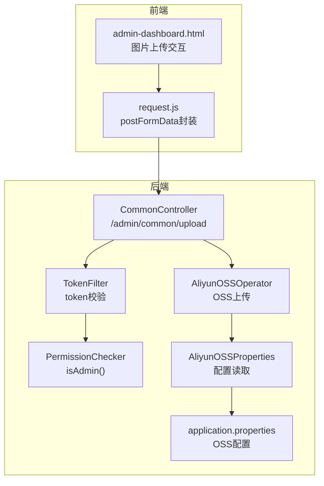
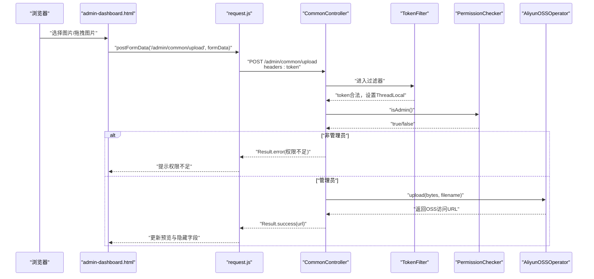
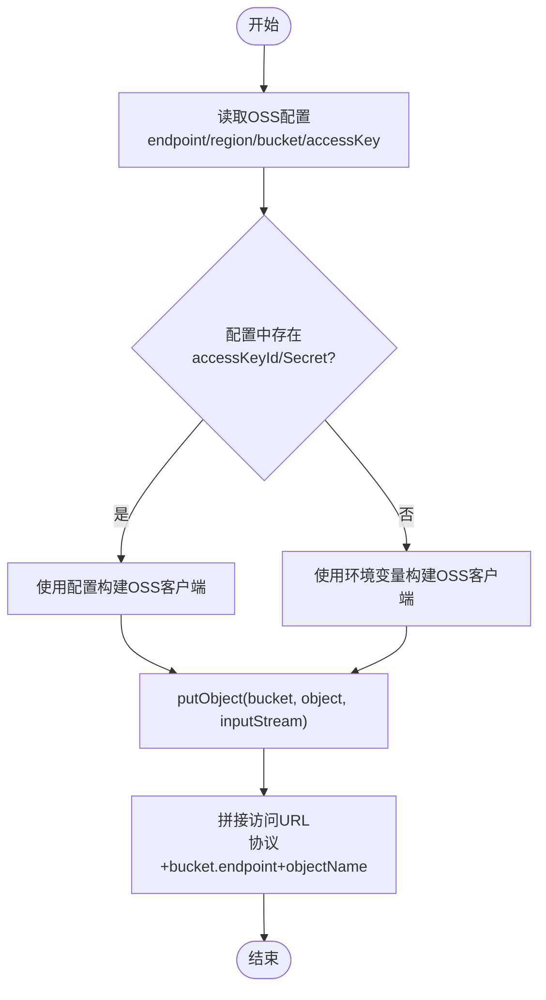
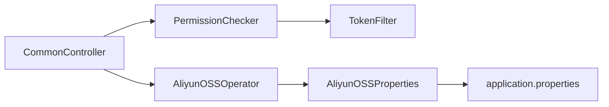

# 通用模块API

<cite>
**本文引用的文件**
- [CommonController.java](file://src/main/java/com/qkl/auctionsystem/controller/CommonController.java)
- [AliyunOSSOperator.java](file://src/main/java/com/qkl/auctionsystem/utils/AliyunOSSOperator.java)
- [AliyunOSSProperties.java](file://src/main/java/com/qkl/auctionsystem/properties/AliyunOSSProperties.java)
- [TokenFilter.java](file://src/main/java/com/qkl/auctionsystem/filter/TokenFilter.java)
- [PermissionChecker.java](file://src/main/java/com/qkl/auctionsystem/utils/PermissionChecker.java)
- [request.js](file://html/utils/request.js)
- [admin-dashboard.html](file://html/admin-dashboard.html)
- [说明.md](file://说明.md)
- [application.properties](file://src/main/resources/application.properties)
</cite>

## 目录
1. [简介](#简介)
2. [项目结构](#项目结构)
3. [核心组件](#核心组件)
4. [架构总览](#架构总览)
5. [详细组件分析](#详细组件分析)
6. [依赖关系分析](#依赖关系分析)
7. [性能考虑](#性能考虑)
8. [故障排查指南](#故障排查指南)
9. [结论](#结论)
10. [附录](#附录)

## 简介
本文件面向通用模块的文件上传接口（/admin/common/upload）进行技术说明，重点覆盖：
- 接口规范：POST 请求，multipart/form-data，返回上传后的图片URL
- 认证要求：需要管理员token
- 文件类型与大小限制：前端提示PNG/JPEG/JPG且不超过2MB
- OSS上传流程：后端使用AliyunOSSOperator将文件写入OSS并返回可访问URL
- 错误处理：空文件、权限不足、OSS认证失败、业务异常等
- 前端集成：HTML表单与JavaScript FormData两种上传方式，与request.js的上传逻辑对照

## 项目结构
围绕上传接口的关键文件组织如下：
- 控制层：CommonController 提供 /admin/common/upload 接口
- 权限校验：TokenFilter + PermissionChecker 实现管理员权限判断
- 对象存储：AliyunOSSOperator 负责OSS上传与URL拼接
- 配置：AliyunOSSProperties 与 application.properties 提供OSS凭证与桶信息
- 前端：admin-dashboard.html 中的图片上传交互，request.js 提供postFormData封装

图表来源
- [CommonController.java](file://src/main/java/com/qkl/auctionsystem/controller/CommonController.java#L1-L51)
- [TokenFilter.java](file://src/main/java/com/qkl/auctionsystem/filter/TokenFilter.java#L1-L141)
- [PermissionChecker.java](file://src/main/java/com/qkl/auctionsystem/utils/PermissionChecker.java#L1-L36)
- [AliyunOSSOperator.java](file://src/main/java/com/qkl/auctionsystem/utils/AliyunOSSOperator.java#L1-L69)
- [AliyunOSSProperties.java](file://src/main/java/com/qkl/auctionsystem/properties/AliyunOSSProperties.java#L1-L18)
- [application.properties](file://src/main/resources/application.properties#L15-L20)
- [request.js](file://html/utils/request.js#L94-L105)
- [admin-dashboard.html](file://html/admin-dashboard.html#L549-L571)

章节来源
- [CommonController.java](file://src/main/java/com/qkl/auctionsystem/controller/CommonController.java#L1-L51)
- [TokenFilter.java](file://src/main/java/com/qkl/auctionsystem/filter/TokenFilter.java#L1-L141)
- [PermissionChecker.java](file://src/main/java/com/qkl/auctionsystem/utils/PermissionChecker.java#L1-L36)
- [AliyunOSSOperator.java](file://src/main/java/com/qkl/auctionsystem/utils/AliyunOSSOperator.java#L1-L69)
- [AliyunOSSProperties.java](file://src/main/java/com/qkl/auctionsystem/properties/AliyunOSSProperties.java#L1-L18)
- [application.properties](file://src/main/resources/application.properties#L15-L20)
- [request.js](file://html/utils/request.js#L94-L105)
- [admin-dashboard.html](file://html/admin-dashboard.html#L549-L571)

## 核心组件
- 接口定义与控制流
  - CommonController.upload：接收MultipartFile，校验空文件与管理员权限，调用AliyunOSSOperator上传，返回Result<String>（图片URL）
- 权限与认证
  - TokenFilter：拦截所有请求，对非公开接口校验token；公开接口包括登录/注册、拍品列表等
  - PermissionChecker：基于TokenFilter中ThreadLocal保存的用户角色，判断是否为管理员
- OSS上传
  - AliyunOSSOperator：根据配置或环境变量构建OSS客户端，生成目录与新文件名，上传字节数组，返回可访问URL
  - AliyunOSSProperties + application.properties：提供endpoint、region、bucketName、accessKeyId、accessKeySecret
- 前端上传
  - admin-dashboard.html：提供拖拽/点击上传、预览、删除等交互
  - request.js：postFormData封装，自动携带token，用于multipart/form-data上传

章节来源
- [CommonController.java](file://src/main/java/com/qkl/auctionsystem/controller/CommonController.java#L22-L50)
- [TokenFilter.java](file://src/main/java/com/qkl/auctionsystem/filter/TokenFilter.java#L70-L127)
- [PermissionChecker.java](file://src/main/java/com/qkl/auctionsystem/utils/PermissionChecker.java#L11-L19)
- [AliyunOSSOperator.java](file://src/main/java/com/qkl/auctionsystem/utils/AliyunOSSOperator.java#L25-L67)
- [AliyunOSSProperties.java](file://src/main/java/com/qkl/auctionsystem/properties/AliyunOSSProperties.java#L12-L17)
- [application.properties](file://src/main/resources/application.properties#L15-L20)
- [request.js](file://html/utils/request.js#L94-L105)
- [admin-dashboard.html](file://html/admin-dashboard.html#L549-L571)

## 架构总览
以下序列图展示从浏览器到后端的完整上传流程，包括权限校验与OSS上传：

图表来源
- [admin-dashboard.html](file://html/admin-dashboard.html#L549-L571)
- [request.js](file://html/utils/request.js#L94-L105)
- [CommonController.java](file://src/main/java/com/qkl/auctionsystem/controller/CommonController.java#L25-L49)
- [TokenFilter.java](file://src/main/java/com/qkl/auctionsystem/filter/TokenFilter.java#L85-L127)
- [PermissionChecker.java](file://src/main/java/com/qkl/auctionsystem/utils/PermissionChecker.java#L11-L19)
- [AliyunOSSOperator.java](file://src/main/java/com/qkl/auctionsystem/utils/AliyunOSSOperator.java#L25-L67)

## 详细组件分析

### 接口定义与调用链
- 接口路径与方法
  - 路径：/admin/common/upload
  - 方法：POST
  - 内容类型：multipart/form-data
  - 参数：file（MultipartFile）
  - 返回：Result<String>（成功时data为图片URL）
- 控制器逻辑要点
  - 空文件校验与日志
  - 管理员权限校验（PermissionChecker.isAdmin）
  - 调用AliyunOSSOperator.upload(file.getBytes(), originalFilename)
  - 异常捕获并返回Result.error
- 前端调用方式
  - HTML中通过postFormData('/admin/common/upload', formData)发起上传
  - request.js会自动在header中携带token

章节来源
- [CommonController.java](file://src/main/java/com/qkl/auctionsystem/controller/CommonController.java#L25-L49)
- [admin-dashboard.html](file://html/admin-dashboard.html#L549-L571)
- [request.js](file://html/utils/request.js#L94-L105)

### 权限与认证机制
- TokenFilter
  - 拦截所有请求，跳过OPTIONS预检
  - 公开接口白名单（如登录/注册、拍品列表等）
  - 非公开接口必须携带token，否则返回401并Result.error
  - 解析token后将userId与role存入ThreadLocal，供后续使用
- PermissionChecker
  - 基于ThreadLocal中的role判断是否为管理员（role==0）
- 上传接口的管理员限制
  - CommonController在上传前调用PermissionChecker.isAdmin，非管理员直接返回权限不足

章节来源
- [TokenFilter.java](file://src/main/java/com/qkl/auctionsystem/filter/TokenFilter.java#L60-L127)
- [PermissionChecker.java](file://src/main/java/com/qkl/auctionsystem/utils/PermissionChecker.java#L11-L19)
- [CommonController.java](file://src/main/java/com/qkl/auctionsystem/controller/CommonController.java#L33-L37)

### OSS上传流程与URL生成
- 凭证来源优先级
  - 若配置文件中存在accessKeyId与accessKeySecret，则优先使用配置
  - 否则使用环境变量提供的凭证
- 目录与文件命名
  - 目录：按年/月组织（如2024/12）
  - 文件名：UUID + 原文件扩展名
- 上传与返回
  - 将字节数组以InputStream形式上传至bucketName/objectName
  - 返回形如“协议://bucketName.endpoint/目录/文件名”的可访问URL
- 配置项
  - endpoint、region、bucketName、accessKeyId、accessKeySecret
  - application.properties中提供默认值

图表来源
- [AliyunOSSOperator.java](file://src/main/java/com/qkl/auctionsystem/utils/AliyunOSSOperator.java#L25-L67)
- [AliyunOSSProperties.java](file://src/main/java/com/qkl/auctionsystem/properties/AliyunOSSProperties.java#L12-L17)
- [application.properties](file://src/main/resources/application.properties#L15-L20)

章节来源
- [AliyunOSSOperator.java](file://src/main/java/com/qkl/auctionsystem/utils/AliyunOSSOperator.java#L25-L67)
- [AliyunOSSProperties.java](file://src/main/java/com/qkl/auctionsystem/properties/AliyunOSSProperties.java#L12-L17)
- [application.properties](file://src/main/resources/application.properties#L15-L20)

### 前端上传示例与对照
- HTML表单上传（示意）
  - 使用input[type=file]，配合FormData.append('file', file)
  - 通过request.js的postFormData自动携带token
  - 成功后将返回的URL写入隐藏字段并显示预览
- JavaScript FormData上传（实际实现）
  - admin-dashboard.html中setupAddImageUpload与setupEditImageUpload均使用FormData.append('file', file)
  - 调用postFormData('/admin/common/upload', formData)
  - 成功后更新预览与隐藏字段，失败弹窗提示

章节来源
- [admin-dashboard.html](file://html/admin-dashboard.html#L549-L571)
- [admin-dashboard.html](file://html/admin-dashboard.html#L611-L691)
- [request.js](file://html/utils/request.js#L94-L105)

### 错误处理机制
- 控制器层面
  - 空文件：返回Result.error("上传文件不能为空")
  - 非管理员：返回Result.error("权限不足，只有管理员才能上传文件")
  - 业务异常：捕获异常并返回Result.error("文件上传失败: " + e.getMessage())
- 过滤器层面
  - 未携带token或token非法：返回401并Result.error
- OSS层面
  - 认证失败：抛出异常并记录日志，最终被控制器捕获

章节来源
- [CommonController.java](file://src/main/java/com/qkl/auctionsystem/controller/CommonController.java#L28-L48)
- [TokenFilter.java](file://src/main/java/com/qkl/auctionsystem/filter/TokenFilter.java#L85-L117)
- [AliyunOSSOperator.java](file://src/main/java/com/qkl/auctionsystem/utils/AliyunOSSOperator.java#L47-L50)

## 依赖关系分析
- 控制器依赖
  - CommonController依赖AliyunOSSOperator进行OSS上传
  - CommonController依赖PermissionChecker进行管理员校验
- 权限链路
  - TokenFilter负责全局token校验并将用户信息放入ThreadLocal
  - PermissionChecker从ThreadLocal读取role判断管理员
- OSS配置链路
  - AliyunOSSOperator读取AliyunOSSProperties
  - AliyunOSSProperties绑定application.properties中的aliyun.oss.*配置

图表来源
- [CommonController.java](file://src/main/java/com/qkl/auctionsystem/controller/CommonController.java#L22-L24)
- [AliyunOSSOperator.java](file://src/main/java/com/qkl/auctionsystem/utils/AliyunOSSOperator.java#L21-L24)
- [AliyunOSSProperties.java](file://src/main/java/com/qkl/auctionsystem/properties/AliyunOSSProperties.java#L8-L11)
- [application.properties](file://src/main/resources/application.properties#L15-L20)
- [TokenFilter.java](file://src/main/java/com/qkl/auctionsystem/filter/TokenFilter.java#L101-L107)
- [PermissionChecker.java](file://src/main/java/com/qkl/auctionsystem/utils/PermissionChecker.java#L11-L19)

章节来源
- [CommonController.java](file://src/main/java/com/qkl/auctionsystem/controller/CommonController.java#L22-L24)
- [AliyunOSSOperator.java](file://src/main/java/com/qkl/auctionsystem/utils/AliyunOSSOperator.java#L21-L24)
- [AliyunOSSProperties.java](file://src/main/java/com/qkl/auctionsystem/properties/AliyunOSSProperties.java#L8-L11)
- [application.properties](file://src/main/resources/application.properties#L15-L20)
- [TokenFilter.java](file://src/main/java/com/qkl/auctionsystem/filter/TokenFilter.java#L101-L107)
- [PermissionChecker.java](file://src/main/java/com/qkl/auctionsystem/utils/PermissionChecker.java#L11-L19)

## 性能考虑
- 字节流上传
  - 当前实现将MultipartFile转为byte[]再上传，大文件可能导致内存压力与GC开销
  - 建议优化：直接使用MultipartFile.getInputStream()传给OSS SDK，避免额外内存拷贝
- 并发与连接
  - OSS客户端在finally中shutdown，建议复用客户端实例或使用连接池策略
- 前端预览
  - 建议在上传前进行文件大小与类型校验，减少无效请求

[本节为通用性能建议，不涉及具体代码分析]

## 故障排查指南
- 401未授权
  - 检查localStorage中是否存在token，确认请求头是否携带token
  - 确认TokenFilter未将上传接口识别为公开接口
- 权限不足
  - 确认当前用户角色为管理员（role==0）
  - 检查TokenFilter是否正确解析token并设置ThreadLocal
- OSS认证失败
  - 检查application.properties中的aliyun.oss.*配置是否正确
  - 若使用环境变量，确认环境变量已正确设置
- 上传失败
  - 查看控制器日志，确认是否捕获到异常并返回Result.error
  - 检查OSS bucketName与endpoint是否匹配

章节来源
- [TokenFilter.java](file://src/main/java/com/qkl/auctionsystem/filter/TokenFilter.java#L85-L117)
- [PermissionChecker.java](file://src/main/java/com/qkl/auctionsystem/utils/PermissionChecker.java#L11-L19)
- [AliyunOSSOperator.java](file://src/main/java/com/qkl/auctionsystem/utils/AliyunOSSOperator.java#L36-L50)
- [application.properties](file://src/main/resources/application.properties#L15-L20)
- [CommonController.java](file://src/main/java/com/qkl/auctionsystem/controller/CommonController.java#L45-L48)

## 结论
- /admin/common/upload为管理员专用的文件上传接口，采用multipart/form-data，返回OSS可访问URL
- 安全性由TokenFilter与PermissionChecker双重保障，OSS凭证支持配置与环境变量两种来源
- 前端通过request.js的postFormData实现简单可靠的上传，具备预览与错误提示
- 建议优化点：大文件上传改为流式传输，复用OSS客户端，完善前端文件类型与大小校验

[本节为总结性内容，不涉及具体代码分析]

## 附录

### 接口定义与调用对照
- 接口定义
  - 路径：/admin/common/upload
  - 方法：POST
  - 内容类型：multipart/form-data
  - 参数：file（MultipartFile）
  - 返回：Result<String>（data为图片URL）
- 前端调用
  - 使用postFormData('/admin/common/upload', formData)，自动携带token
  - 成功后更新隐藏字段与图片预览

章节来源
- [说明.md](file://说明.md#L71-L71)
- [admin-dashboard.html](file://html/admin-dashboard.html#L549-L571)
- [request.js](file://html/utils/request.js#L94-L105)