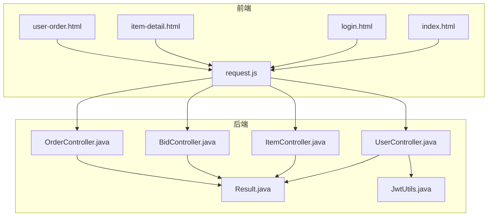
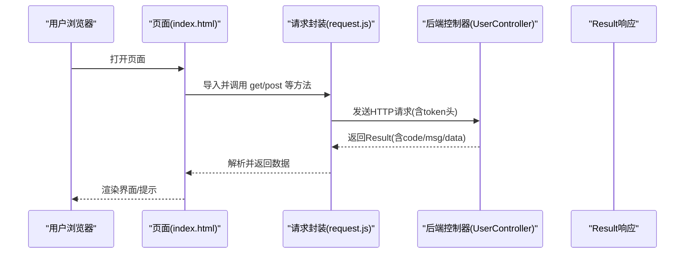
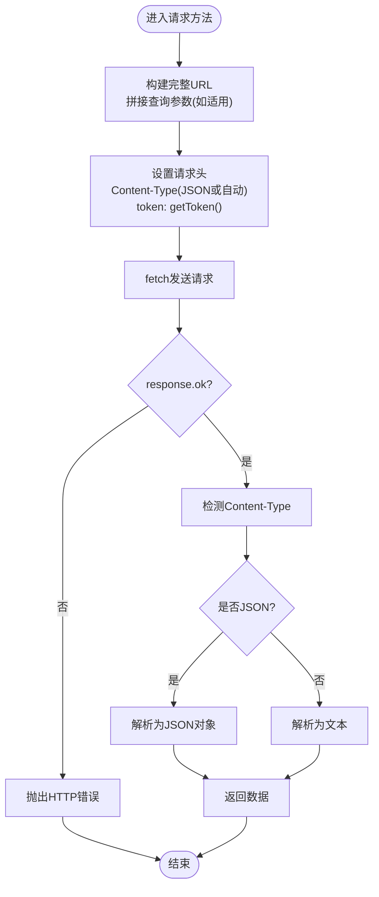
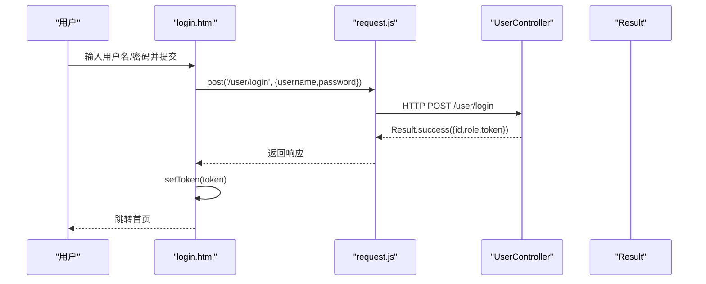
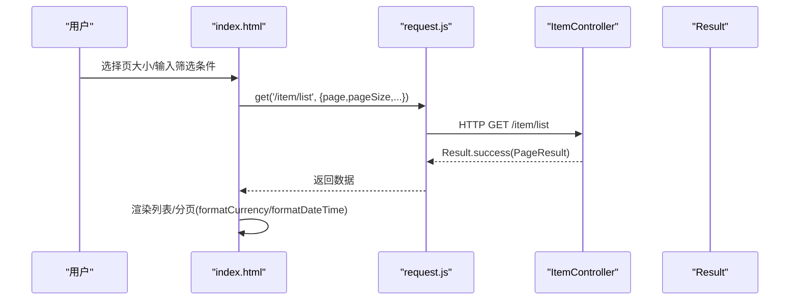
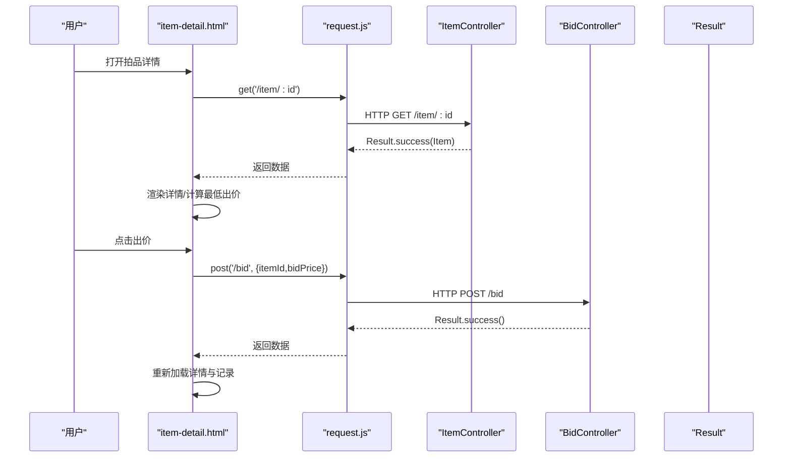
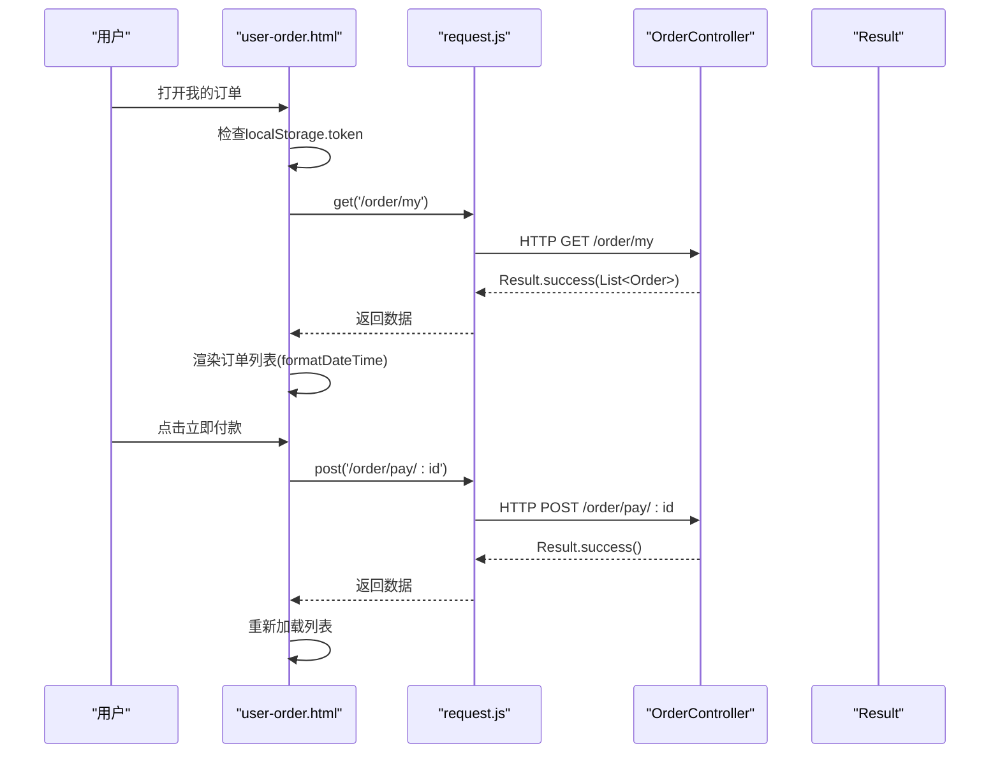
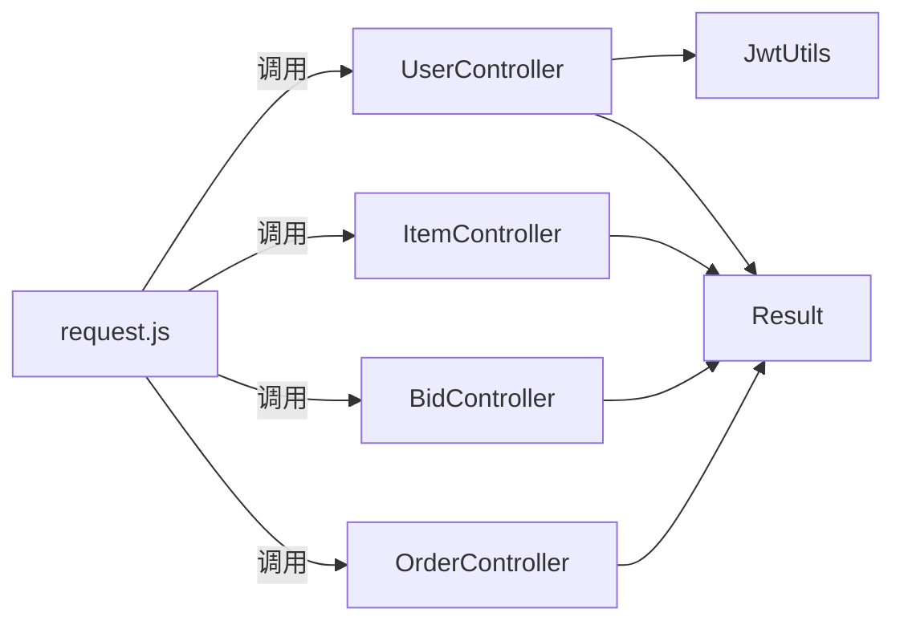

# API调用集成

<cite>
**本文引用的文件**
- [request.js](file://html/utils/request.js)
- [index.html](file://html/index.html)
- [login.html](file://html/login.html)
- [item-detail.html](file://html/item-detail.html)
- [user-order.html](file://html/user-order.html)
- [UserController.java](file://src/main/java/com/qkl/auctionsystem/controller/UserController.java)
- [ItemController.java](file://src/main/java/com/qkl/auctionsystem/controller/ItemController.java)
- [BidController.java](file://src/main/java/com/qkl/auctionsystem/controller/BidController.java)
- [OrderController.java](file://src/main/java/com/qkl/auctionsystem/controller/OrderController.java)
- [Result.java](file://src/main/java/com/qkl/auctionsystem/result/Result.java)
- [JwtUtils.java](file://src/main/java/com/qkl/auctionsystem/utils/JwtUtils.java)
</cite>

## 目录
1. [简介](#简介)
2. [项目结构](#项目结构)
3. [核心组件](#核心组件)
4. [架构总览](#架构总览)
5. [详细组件分析](#详细组件分析)
6. [依赖关系分析](#依赖关系分析)
7. [性能考虑](#性能考虑)
8. [故障排查指南](#故障排查指南)
9. [结论](#结论)

## 简介
本文件围绕前端 HTML 页面与后端 Spring Boot 服务之间的通信进行系统化梳理，重点讲解 html/utils/request.js 中封装的 HTTP 请求工具类，说明其如何统一处理与后端的 RESTful 通信，包括：
- BASE_URL 的反向代理配置，便于生产环境部署
- get、post、put、del、postFormData 方法对不同 HTTP 动词的封装，并在请求头中自动携带 JWT token
- getToken、setToken、removeToken 对本地认证状态的管理
- handleResponse 统一处理响应解析与错误抛出
- 在 index.html 获取拍品列表、login.html 提交登录请求、item-detail.html 发起出价、user-order.html 查询订单等场景下的调用方式
- formatDateTime 和 formatCurrency 在视图层的数据呈现作用

## 项目结构
前端采用模块化组织，核心请求封装位于 html/utils/request.js，各页面通过 ES 模块导入相应方法进行 API 调用。后端控制器按资源划分，提供统一的 REST 接口，返回体遵循统一的 Result 结构。

图表来源
- [request.js](file://html/utils/request.js#L1-L131)
- [index.html](file://html/index.html#L160-L220)
- [login.html](file://html/login.html#L63-L96)
- [item-detail.html](file://html/item-detail.html#L147-L170)
- [user-order.html](file://html/user-order.html#L112-L140)
- [UserController.java](file://src/main/java/com/qkl/auctionsystem/controller/UserController.java#L15-L49)
- [ItemController.java](file://src/main/java/com/qkl/auctionsystem/controller/ItemController.java#L16-L86)
- [BidController.java](file://src/main/java/com/qkl/auctionsystem/controller/BidController.java#L18-L47)
- [OrderController.java](file://src/main/java/com/qkl/auctionsystem/controller/OrderController.java#L12-L43)
- [Result.java](file://src/main/java/com/qkl/auctionsystem/result/Result.java#L7-L39)
- [JwtUtils.java](file://src/main/java/com/qkl/auctionsystem/utils/JwtUtils.java#L1-L36)

章节来源
- [request.js](file://html/utils/request.js#L1-L131)
- [index.html](file://html/index.html#L160-L220)
- [login.html](file://html/login.html#L63-L96)
- [item-detail.html](file://html/item-detail.html#L147-L170)
- [user-order.html](file://html/user-order.html#L112-L140)

## 核心组件
- request.js：封装 fetch 请求，统一处理 BASE_URL、token 注入、响应解析与错误处理，提供 get、post、put、del、postFormData、setToken、removeToken、formatDateTime、formatCurrency 等方法。
- 各页面：通过 import 使用 request.js 的方法，完成业务交互（登录、拍品列表、出价、订单查询）。
- 后端控制器：提供 /user/login、/item/list、/item/{id}、/bid、/bid/records/{itemId}、/order/my、/order/pay/{orderId} 等接口，返回 Result 结构。

章节来源
- [request.js](file://html/utils/request.js#L1-L131)
- [UserController.java](file://src/main/java/com/qkl/auctionsystem/controller/UserController.java#L15-L49)
- [ItemController.java](file://src/main/java/com/qkl/auctionsystem/controller/ItemController.java#L36-L55)
- [BidController.java](file://src/main/java/com/qkl/auctionsystem/controller/BidController.java#L29-L46)
- [OrderController.java](file://src/main/java/com/qkl/auctionsystem/controller/OrderController.java#L26-L42)
- [Result.java](file://src/main/java/com/qkl/auctionsystem/result/Result.java#L7-L39)

## 架构总览
前端通过 request.js 统一发起 HTTP 请求，后端控制器接收请求并返回 Result 结构。登录成功后，后端签发 JWT，前端将其存入 localStorage 并在后续请求头中携带 token，实现鉴权。

图表来源
- [index.html](file://html/index.html#L160-L220)
- [request.js](file://html/utils/request.js#L32-L105)
- [UserController.java](file://src/main/java/com/qkl/auctionsystem/controller/UserController.java#L30-L48)
- [Result.java](file://src/main/java/com/qkl/auctionsystem/result/Result.java#L7-L39)

## 详细组件分析

### request.js 组件分析
- BASE_URL 配置：采用相对路径前缀 /auction，配合反向代理在生产环境访问后端服务，避免硬编码 IP/端口，提升部署灵活性。
- 请求方法：
  - get(url, params)：拼接查询参数，自动注入 token 头，支持分页与筛选。
  - post(url, data)：JSON 提交，自动注入 token 头。
  - put(url, data)：更新资源，自动注入 token 头。
  - del(url, params)：删除资源，支持查询参数。
  - postFormData(url, formData)：文件上传场景，不设置 Content-Type，由浏览器自动设置 multipart/form-data。
- 认证状态管理：
  - getToken()：从 localStorage 读取 token。
  - setToken(token)：保存 token。
  - removeToken()：移除 token。
- 响应处理：
  - handleResponse(response)：校验 response.ok，识别 content-type，JSON 则解析为对象，否则返回文本；非 OK 抛出错误。
- 视图格式化：
  - formatDateTime(date)：将日期转换为“年-月-日 时:分”格式。
  - formatCurrency(amount)：将金额格式化为“¥xx.xx”。

图表来源
- [request.js](file://html/utils/request.js#L32-L105)

章节来源
- [request.js](file://html/utils/request.js#L1-L131)

### 登录流程（login.html -> UserController）
- 页面逻辑：收集用户名、密码，调用 post('/user/login') 提交登录请求。
- 后端逻辑：接收用户名与密码，验证通过后生成 JWT，返回 Result.success(data)，其中包含 token。
- 前端逻辑：若响应 code 为 1，调用 setToken(response.data.token) 保存 token，跳转首页。

图表来源
- [login.html](file://html/login.html#L63-L96)
- [request.js](file://html/utils/request.js#L49-L61)
- [UserController.java](file://src/main/java/com/qkl/auctionsystem/controller/UserController.java#L30-L48)
- [Result.java](file://src/main/java/com/qkl/auctionsystem/result/Result.java#L7-L39)
- [JwtUtils.java](file://src/main/java/com/qkl/auctionsystem/utils/JwtUtils.java#L18-L35)

章节来源
- [login.html](file://html/login.html#L63-L96)
- [UserController.java](file://src/main/java/com/qkl/auctionsystem/controller/UserController.java#L30-L48)
- [JwtUtils.java](file://src/main/java/com/qkl/auctionsystem/utils/JwtUtils.java#L18-L35)

### 拍品列表（index.html -> ItemController）
- 页面逻辑：监听每页条数变化、搜索与重置按钮，构造分页与筛选参数，调用 get('/item/list', params)。
- 后端逻辑：ItemController 提供 GET /item/list，返回分页结果 PageResult。
- 前端逻辑：解析 response.code，渲染卡片列表、分页信息；使用 formatCurrency/formatDateTime 进行格式化展示。

图表来源
- [index.html](file://html/index.html#L160-L220)
- [request.js](file://html/utils/request.js#L32-L47)
- [ItemController.java](file://src/main/java/com/qkl/auctionsystem/controller/ItemController.java#L36-L41)
- [Result.java](file://src/main/java/com/qkl/auctionsystem/result/Result.java#L7-L39)

章节来源
- [index.html](file://html/index.html#L160-L220)
- [ItemController.java](file://src/main/java/com/qkl/auctionsystem/controller/ItemController.java#L36-L41)

### 拍品详情与出价（item-detail.html -> ItemController/BidController）
- 拍品详情：get('/item/{id}') 获取 Item，渲染标题、状态、价格、时间、图片与描述；根据状态启用/禁用出价输入与按钮。
- 竞拍记录：get('/bid/records/{itemId}') 获取记录列表，格式化时间与金额。
- 出价：post('/bid', {itemId,bidPrice}) 提交出价；前端在提交前校验登录状态与最低出价金额。

图表来源
- [item-detail.html](file://html/item-detail.html#L147-L170)
- [request.js](file://html/utils/request.js#L49-L61)
- [ItemController.java](file://src/main/java/com/qkl/auctionsystem/controller/ItemController.java#L50-L55)
- [BidController.java](file://src/main/java/com/qkl/auctionsystem/controller/BidController.java#L29-L46)
- [Result.java](file://src/main/java/com/qkl/auctionsystem/result/Result.java#L7-L39)

章节来源
- [item-detail.html](file://html/item-detail.html#L147-L170)
- [BidController.java](file://src/main/java/com/qkl/auctionsystem/controller/BidController.java#L29-L46)

### 我的订单（user-order.html -> OrderController）
- 页面逻辑：进入即检查 token，不存在则跳转登录；调用 get('/order/my') 获取订单列表，渲染状态、金额、时间与操作按钮。
- 付款：post('/order/pay/{orderId}') 完成订单支付。

图表来源
- [user-order.html](file://html/user-order.html#L112-L140)
- [request.js](file://html/utils/request.js#L49-L61)
- [OrderController.java](file://src/main/java/com/qkl/auctionsystem/controller/OrderController.java#L33-L42)
- [Result.java](file://src/main/java/com/qkl/auctionsystem/result/Result.java#L7-L39)

章节来源
- [user-order.html](file://html/user-order.html#L112-L140)
- [OrderController.java](file://src/main/java/com/qkl/auctionsystem/controller/OrderController.java#L33-L42)

### 视图层数据呈现（formatDateTime 与 formatCurrency）
- formatCurrency：统一货币格式输出，确保金额显示一致。
- formatDateTime：统一时间格式输出，便于列表与详情页的时间展示。

章节来源
- [request.js](file://html/utils/request.js#L118-L131)
- [index.html](file://html/index.html#L312-L316)
- [item-detail.html](file://html/item-detail.html#L206-L217)
- [user-order.html](file://html/user-order.html#L182-L188)

## 依赖关系分析
- 前端依赖：
  - request.js 依赖浏览器 fetch 与 localStorage，负责统一网络与认证。
  - 各页面依赖 request.js 的 get/post/put/del/postFormData 与格式化函数。
- 后端依赖：
  - 控制器依赖服务层与工具类（如 JwtUtils），返回 Result 统一结构。
  - JwtUtils 用于生成与解析 JWT，配合 TokenFilter 实现鉴权过滤（见后端过滤器）。

图表来源
- [request.js](file://html/utils/request.js#L32-L105)
- [UserController.java](file://src/main/java/com/qkl/auctionsystem/controller/UserController.java#L15-L49)
- [ItemController.java](file://src/main/java/com/qkl/auctionsystem/controller/ItemController.java#L16-L86)
- [BidController.java](file://src/main/java/com/qkl/auctionsystem/controller/BidController.java#L18-L47)
- [OrderController.java](file://src/main/java/com/qkl/auctionsystem/controller/OrderController.java#L12-L43)
- [Result.java](file://src/main/java/com/qkl/auctionsystem/result/Result.java#L7-L39)
- [JwtUtils.java](file://src/main/java/com/qkl/auctionsystem/utils/JwtUtils.java#L1-L36)

章节来源
- [request.js](file://html/utils/request.js#L32-L105)
- [Result.java](file://src/main/java/com/qkl/auctionsystem/result/Result.java#L7-L39)

## 性能考虑
- 请求超时：request.js 内置 10 秒超时，有助于避免长时间挂起影响用户体验。
- 传输格式：JSON 传输减少体积，适合列表与详情数据；文件上传使用 multipart/form-data，避免额外编码开销。
- 响应解析：handleResponse 自动识别 JSON 文本，减少重复判断。
- 前端渲染：列表与详情页使用一次性渲染策略，避免频繁 DOM 操作；分页控制仅在必要时触发请求。

## 故障排查指南
- 登录失败：
  - 检查后端返回的 Result.code 是否为 1；若非 1，查看 msg 获取错误原因。
  - 确认前端是否正确调用 setToken 保存 token。
- 无权限或未登录：
  - 检查请求头是否包含 token；确认 localStorage 中存在 token。
  - 若 token 过期，需重新登录获取新 token。
- 接口 404/500：
  - 确认 BASE_URL 与后端路由匹配；检查控制器路径与方法签名。
- 出价失败：
  - 检查最低出价金额是否满足规则；确认 itemId 与 bidPrice 参数正确。
- 订单查询异常：
  - 确认已登录且 token 正确；检查后端 /order/my 返回数据结构。

章节来源
- [request.js](file://html/utils/request.js#L19-L30)
- [login.html](file://html/login.html#L77-L96)
- [item-detail.html](file://html/item-detail.html#L308-L351)
- [user-order.html](file://html/user-order.html#L130-L147)

## 结论
request.js 作为前端统一请求封装，实现了 BASE_URL 反向代理、token 自动注入、响应统一解析与错误抛出，显著降低了页面与后端交互的复杂度。结合 index.html、login.html、item-detail.html、user-order.html 的实际调用，展示了完整的用户登录、拍品浏览、出价与订单管理流程。配合 formatDateTime 与 formatCurrency 的格式化函数，提升了视图层的数据呈现一致性与可读性。建议在生产环境中通过反向代理统一转发 /auction 前缀至后端服务，确保跨域与部署灵活性。