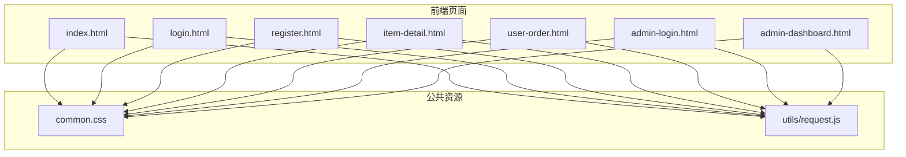
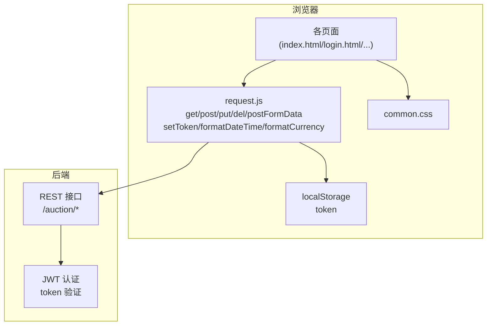
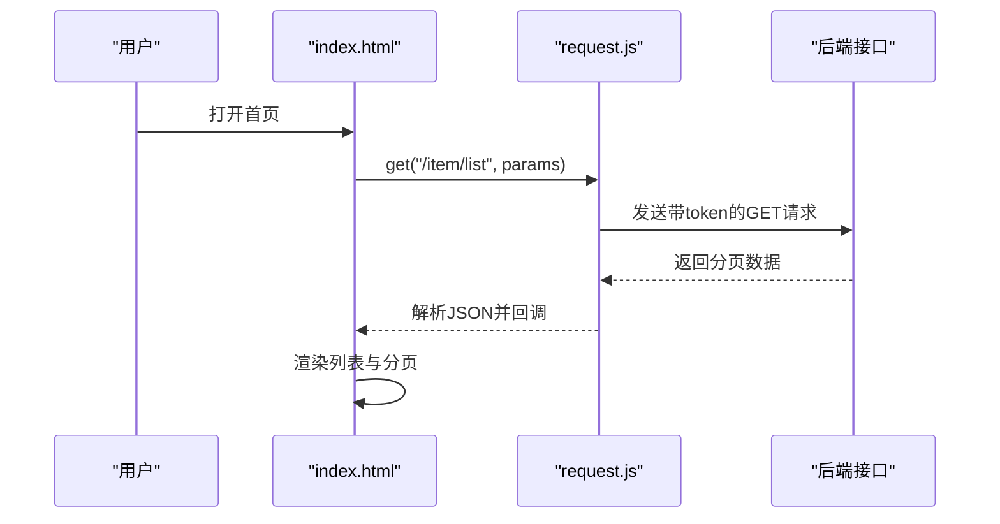
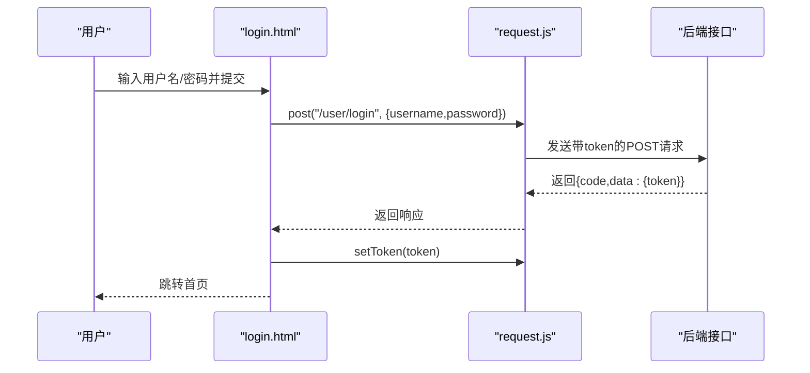
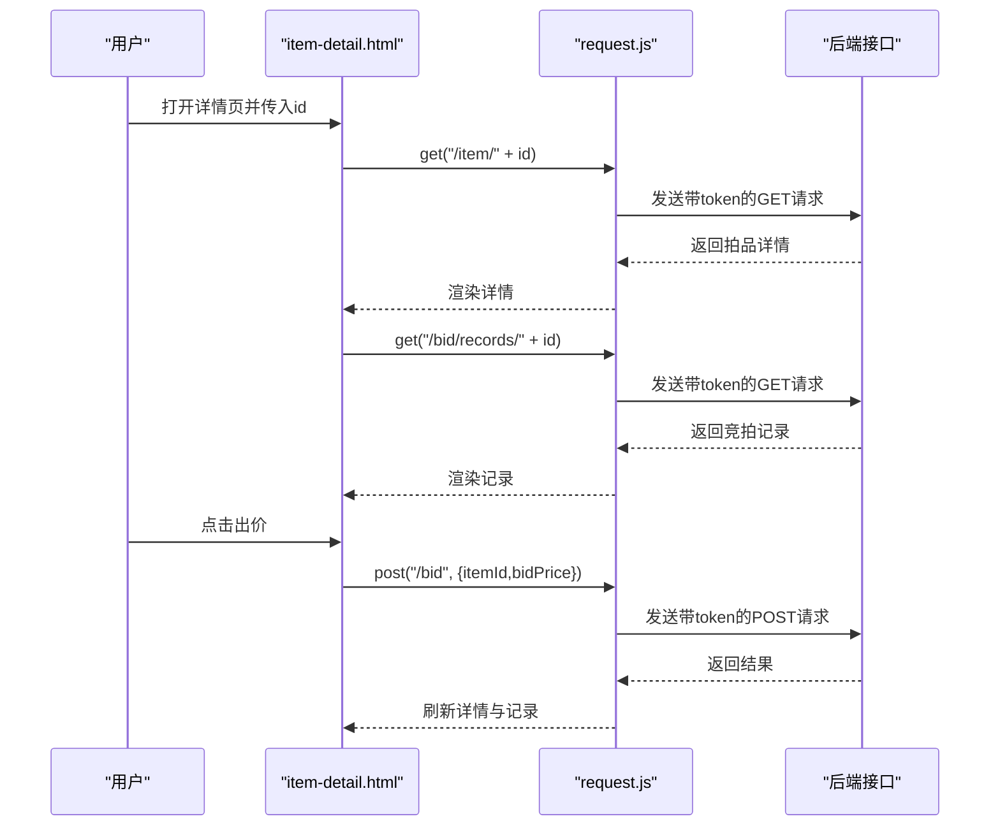
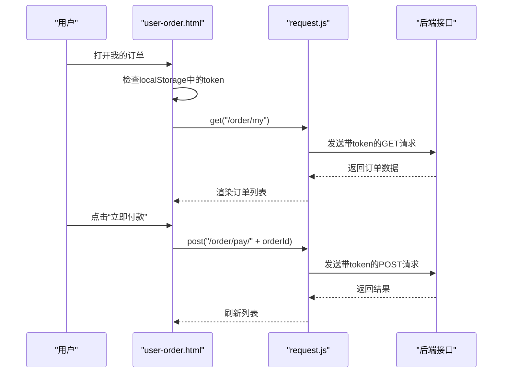
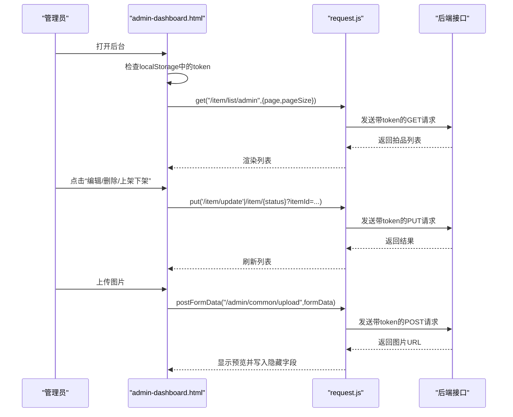
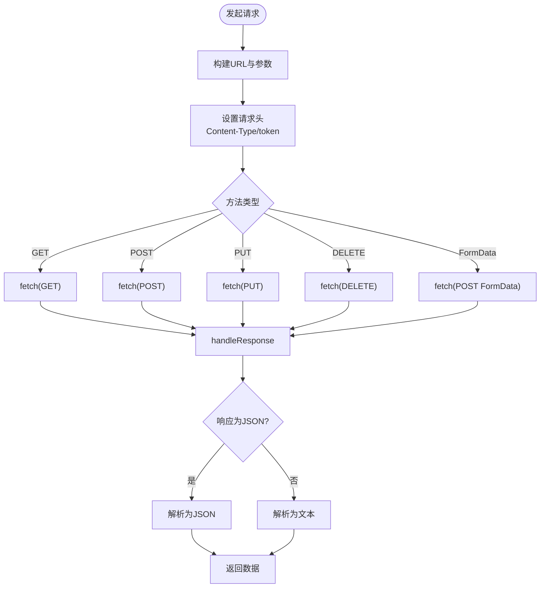
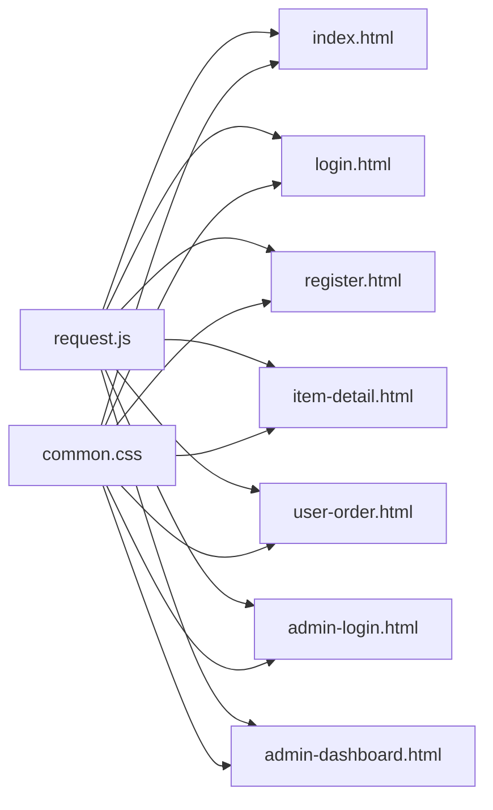

# 前端架构

<cite>
**本文引用的文件**
- [index.html](file://html/index.html)
- [login.html](file://html/login.html)
- [register.html](file://html/register.html)
- [item-detail.html](file://html/item-detail.html)
- [user-order.html](file://html/user-order.html)
- [admin-login.html](file://html/admin-login.html)
- [admin-dashboard.html](file://html/admin-dashboard.html)
- [common.css](file://html/common.css)
- [request.js](file://html/utils/request.js)
</cite>

## 目录
1. [引言](#引言)
2. [项目结构](#项目结构)
3. [核心组件](#核心组件)
4. [架构总览](#架构总览)
5. [详细组件分析](#详细组件分析)
6. [依赖关系分析](#依赖关系分析)
7. [性能考量](#性能考量)
8. [故障排查指南](#故障排查指南)
9. [结论](#结论)
10. [附录](#附录)

## 引言
本文件面向前端开发者，系统性阐述拍卖系统的前端架构设计与实现，覆盖以下要点：
- 主要页面职责与交互流程：首页、用户认证、拍品详情、用户订单、管理员入口与后台。
- 公共样式文件 common.css 的全局样式定义与视觉规范。
- request.js 中封装的 HTTP 请求工具：基础 URL 配置、请求拦截、Token 自动携带、与后端 JWT 认证的协同机制。
- 页面跳转逻辑与 API 调用示例，帮助理解从前端到后端的数据绑定与交互流程。

## 项目结构
前端采用静态 HTML + JavaScript 模块化组织，核心目录如下：
- html/
  - utils/request.js：统一的 HTTP 请求封装与工具函数
  - common.css：全局样式与组件样式
  - index.html、login.html、register.html、item-detail.html、user-order.html、admin-login.html、admin-dashboard.html：各页面入口

图表来源
- [index.html](file://html/index.html#L1-L426)
- [login.html](file://html/login.html#L1-L99)
- [register.html](file://html/register.html#L1-L107)
- [item-detail.html](file://html/item-detail.html#L1-L364)
- [user-order.html](file://html/user-order.html#L1-L251)
- [admin-login.html](file://html/admin-login.html#L1-L84)
- [admin-dashboard.html](file://html/admin-dashboard.html#L1-L835)
- [common.css](file://html/common.css#L1-L175)
- [request.js](file://html/utils/request.js#L1-L131)

章节来源
- [index.html](file://html/index.html#L1-L426)
- [common.css](file://html/common.css#L1-L175)
- [request.js](file://html/utils/request.js#L1-L131)

## 核心组件
- HTTP 请求工具（request.js）
  - 基础 URL：通过常量配置，生产环境使用相对路径配合反向代理访问后端服务。
  - 统一拦截：在请求头中自动注入 token，支持 GET/POST/PUT/DELETE 以及 FormData 文件上传。
  - 响应处理：根据 Content-Type 自动解析 JSON 或文本；统一超时控制。
  - 工具函数：格式化日期时间、格式化货币、设置/移除本地 token。
- 页面层
  - 首页：拍品列表、搜索筛选、分页、跳转详情。
  - 用户认证：登录、注册，登录成功后保存 token 并跳转首页。
  - 拍品详情：展示信息、出价、竞拍记录、最小出价限制。
  - 用户订单：我的订单、付款、查看详情。
  - 管理员入口：管理员登录、后台管理（拍品增删改、上架/下架、图片上传）。
- 公共样式（common.css）
  - 导航栏、卡片、按钮、表单、管理员后台布局、竞拍按钮、订单状态标签等统一风格。

章节来源
- [request.js](file://html/utils/request.js#L1-L131)
- [index.html](file://html/index.html#L1-L426)
- [login.html](file://html/login.html#L1-L99)
- [register.html](file://html/register.html#L1-L107)
- [item-detail.html](file://html/item-detail.html#L1-L364)
- [user-order.html](file://html/user-order.html#L1-L251)
- [admin-login.html](file://html/admin-login.html#L1-L84)
- [admin-dashboard.html](file://html/admin-dashboard.html#L1-L835)
- [common.css](file://html/common.css#L1-L175)

## 架构总览
前端采用“页面即模块”的组织方式，每个页面独立引入 request.js 进行网络请求；公共样式集中管理。页面间通过相对路径跳转，登录状态通过 localStorage 的 token 维持。

图表来源
- [request.js](file://html/utils/request.js#L1-L131)
- [index.html](file://html/index.html#L1-L426)
- [login.html](file://html/login.html#L1-L99)
- [register.html](file://html/register.html#L1-L107)
- [item-detail.html](file://html/item-detail.html#L1-L364)
- [user-order.html](file://html/user-order.html#L1-L251)
- [admin-login.html](file://html/admin-login.html#L1-L84)
- [admin-dashboard.html](file://html/admin-dashboard.html#L1-L835)
- [common.css](file://html/common.css#L1-L175)

## 详细组件分析

### 页面层：index.html（用户首页）
- 功能要点
  - 导航栏动态渲染：登录状态下显示“我的账户”下拉菜单，未登录显示“登录/注册”。
  - 拍品列表：支持关键词、状态、价格区间筛选；分页组件（上一页/下一页/页码/前往）。
  - 列表渲染：根据状态显示不同徽章与按钮；点击卡片跳转至拍品详情。
  - 数据绑定：通过 get('/item/list', params) 获取分页数据，渲染卡片与分页信息。
- 关键交互
  - 搜索与重置按钮事件绑定，触发重新加载列表。
  - 分页按钮事件绑定，更新当前页并重新请求。
- 错误处理：统一捕获异常并提示。

图表来源
- [index.html](file://html/index.html#L160-L220)
- [request.js](file://html/utils/request.js#L32-L61)

章节来源
- [index.html](file://html/index.html#L1-L426)
- [request.js](file://html/utils/request.js#L1-L131)

### 页面层：login.html（用户登录）
- 功能要点
  - 登录表单校验：用户名/密码非空。
  - 调用后端登录接口，成功后通过 setToken 保存 token，并跳转首页。
- 交互流程
  - 表单提交 -> 调用 post('/user/login') -> 成功则 setToken -> 跳转 index.html。

图表来源
- [login.html](file://html/login.html#L63-L96)
- [request.js](file://html/utils/request.js#L49-L61)

章节来源
- [login.html](file://html/login.html#L1-L99)
- [request.js](file://html/utils/request.js#L1-L131)

### 页面层：register.html（用户注册）
- 功能要点
  - 注册表单校验：用户名非空、两次密码一致且长度≥6。
  - 调用后端注册接口，成功后提示并跳转登录页。
- 交互流程
  - 表单提交 -> 调用 post('/user/register') -> 成功则跳转 login.html。

章节来源
- [register.html](file://html/register.html#L1-L107)
- [request.js](file://html/utils/request.js#L49-L61)

### 页面层：item-detail.html（拍品详情）
- 功能要点
  - 通过 URL 参数 id 获取拍品详情，渲染标题、状态、价格、时间、图片与描述。
  - 出价功能：登录后启用，最小出价为当前最高价+10；提交后刷新详情与记录。
  - 竞拍记录：按时间倒序展示，支持毫秒时间戳格式化。
- 关键交互
  - loadItemDetail -> get(/item/{id}) -> 渲染详情
  - loadBidRecords -> get(/bid/records/{id}) -> 渲染记录
  - 出价按钮 -> post(/bid) -> 成功后重新加载

图表来源
- [item-detail.html](file://html/item-detail.html#L147-L210)
- [item-detail.html](file://html/item-detail.html#L254-L306)
- [item-detail.html](file://html/item-detail.html#L308-L351)
- [request.js](file://html/utils/request.js#L32-L61)

章节来源
- [item-detail.html](file://html/item-detail.html#L1-L364)
- [request.js](file://html/utils/request.js#L1-L131)

### 页面层：user-order.html（用户订单）
- 功能要点
  - 登录状态检查：未登录则跳转登录页。
  - 加载我的订单：get('/order/my')，渲染订单列表与状态标签。
  - 付款与查看详情：post('/order/pay/{id}')，跳转详情页。
- 关键交互
  - 页面加载 -> 检查 token -> get('/order/my') -> 渲染表格 -> 绑定按钮事件

图表来源
- [user-order.html](file://html/user-order.html#L112-L147)
- [user-order.html](file://html/user-order.html#L199-L211)
- [request.js](file://html/utils/request.js#L32-L61)

章节来源
- [user-order.html](file://html/user-order.html#L1-L251)
- [request.js](file://html/utils/request.js#L1-L131)

### 页面层：admin-login.html（管理员登录）
- 功能要点
  - 管理员登录表单校验：账号/密码非空。
  - 调用后端管理员登录接口，成功后 setToken 并跳转后台。
- 交互流程
  - 提交表单 -> post('/admin/login') -> setToken -> 跳转 admin-dashboard.html

章节来源
- [admin-login.html](file://html/admin-login.html#L47-L82)
- [request.js](file://html/utils/request.js#L49-L61)

### 页面层：admin-dashboard.html（管理员后台）
- 功能要点
  - 登录状态检查：未登录跳转管理员登录页。
  - 拍品管理：列表加载、编辑、删除、上架/下架、批量删除。
  - 图片上传：拖拽/点击上传，支持预览与删除；使用 postFormData 携带 token。
  - 添加拍品：表单校验与提交，使用 put('/item/add')。
- 关键交互
  - 页面加载 -> checkAdminLogin -> get('/item/list/admin') -> 渲染列表
  - 编辑/删除/上架下架 -> 调用对应接口
  - 图片上传 -> postFormData('/admin/common/upload') -> 保存URL到隐藏字段

图表来源
- [admin-dashboard.html](file://html/admin-dashboard.html#L269-L378)
- [admin-dashboard.html](file://html/admin-dashboard.html#L380-L460)
- [admin-dashboard.html](file://html/admin-dashboard.html#L511-L610)
- [admin-dashboard.html](file://html/admin-dashboard.html#L694-L743)
- [admin-dashboard.html](file://html/admin-dashboard.html#L780-L835)
- [request.js](file://html/utils/request.js#L94-L105)

章节来源
- [admin-dashboard.html](file://html/admin-dashboard.html#L1-L835)
- [request.js](file://html/utils/request.js#L1-L131)

### 样式层：common.css
- 导航栏：自定义背景与悬停颜色，品牌与链接高亮。
- 卡片：阴影、悬停提升、卡片体垂直布局。
- 图片容器：固定高度、居中裁剪。
- 按钮：品牌色系、悬停变色。
- 表单：居中容器、阴影圆角。
- 管理员后台：侧边栏固定高度、内容区背景与最小高度。
- 竞拍按钮：宽度100%、字号与内边距适配移动端。
- 订单状态标签：待付款/已完成两类状态色。

章节来源
- [common.css](file://html/common.css#L1-L175)

### 请求工具：request.js
- 基础 URL：通过常量配置，生产环境使用相对路径，配合反向代理访问后端。
- 请求拦截：在请求头中统一注入 token，GET/POST/PUT/DELETE 均携带。
- 文件上传：postFormData 支持 FormData，自动携带 token。
- 响应处理：根据 Content-Type 自动解析 JSON 或文本；统一超时控制。
- 工具函数：formatDateTime、formatCurrency、setToken、removeToken。

图表来源
- [request.js](file://html/utils/request.js#L1-L131)

章节来源
- [request.js](file://html/utils/request.js#L1-L131)

## 依赖关系分析
- 模块依赖
  - 各页面均通过 ES 模块 import 使用 request.js 的 get/post/put/del/postFormData/setToken/formatDateTime/formatCurrency。
  - 页面与样式之间通过 link 引入 common.css。
- 耦合与内聚
  - request.js 低耦合、高内聚：封装网络层细节，页面只关心业务调用。
  - 页面内聚：每个页面聚焦自身业务，避免跨页面共享逻辑。
- 外部依赖
  - Bootstrap CDN 用于 UI 组件与栅格系统。
  - localStorage 用于 token 存储与登录状态维护。

图表来源
- [request.js](file://html/utils/request.js#L1-L131)
- [index.html](file://html/index.html#L1-L426)
- [login.html](file://html/login.html#L1-L99)
- [register.html](file://html/register.html#L1-L107)
- [item-detail.html](file://html/item-detail.html#L1-L364)
- [user-order.html](file://html/user-order.html#L1-L251)
- [admin-login.html](file://html/admin-login.html#L1-L84)
- [admin-dashboard.html](file://html/admin-dashboard.html#L1-L835)
- [common.css](file://html/common.css#L1-L175)

## 性能考量
- 请求超时：统一 10 秒超时，避免长时间挂起。
- 分页策略：首页默认每页 9 条，支持切换 12/15/18/21 条，减少一次性数据量。
- 列表渲染：按需渲染卡片与分页按钮，避免重复 DOM 操作。
- 图片处理：详情页图片为空时隐藏占位，减少无效渲染。
- 文件上传：使用 FormData，避免大对象序列化带来的内存压力。

## 故障排查指南
- 登录失败
  - 检查用户名/密码是否为空；确认后端接口返回的 code 是否为 1。
  - 确认 setToken 已执行且 localStorage 中存在 token。
- token 丢失
  - 退出登录会移除 token；重新登录获取新 token。
  - 若跨域或反向代理配置不当，可能导致请求头 token 未生效。
- 出价失败
  - 检查当前拍品状态是否为“竞拍中”，最小出价是否满足“当前最高价+10”。
  - 确认已登录且 token 正确。
- 订单加载异常
  - 确认页面加载时已检查 token；若未登录会被重定向至登录页。
- 图片上传失败
  - 确认已选择文件且大小/类型符合要求；检查上传接口返回的 data 字段是否为有效 URL。
- 管理员操作异常
  - 确认已登录管理员账户并持有有效 token；检查接口路径与参数格式。

章节来源
- [login.html](file://html/login.html#L63-L96)
- [item-detail.html](file://html/item-detail.html#L308-L351)
- [user-order.html](file://html/user-order.html#L112-L147)
- [admin-dashboard.html](file://html/admin-dashboard.html#L511-L610)
- [request.js](file://html/utils/request.js#L1-L131)

## 结论
该前端架构以页面为中心、以工具函数为支撑，实现了清晰的职责划分与良好的可维护性。通过 request.js 统一封装请求与 Token 管理，结合 common.css 的统一样式，使各页面在视觉与交互上保持一致。建议后续可考虑：
- 将 BASE_URL 抽离为环境变量，便于开发/测试/生产切换。
- 对高频请求增加缓存策略（如列表页）。
- 对表单校验与错误提示进行统一抽象，提升一致性与可复用性。

## 附录
- 页面跳转逻辑摘要
  - 登录成功：login.html -> setToken -> index.html
  - 注册成功：register.html -> login.html
  - 未登录访问订单：user-order.html -> 跳转 login.html
  - 管理员登录成功：admin-login.html -> setToken -> admin-dashboard.html
  - 拍品详情：index.html -> item-detail.html?id=...
  - 订单详情：user-order.html -> item-detail.html?id=...
- API 调用示例（路径与方法）
  - 首页列表：GET /auction/item/list
  - 登录：POST /auction/user/login
  - 注册：POST /auction/user/register
  - 拍品详情：GET /auction/item/{id}
  - 竞拍记录：GET /auction/bid/records/{id}
  - 出价：POST /auction/bid
  - 我的订单：GET /auction/order/my
  - 订单付款：POST /auction/order/pay/{id}
  - 管理员登录：POST /auction/admin/login
  - 拍品列表（管理）：GET /auction/item/list/admin
  - 拍品编辑：PUT /auction/item/update
  - 拍品删除：DELETE /auction/item
  - 拍品上架/下架：PUT /auction/item/{status}?itemId={id}
  - 拍品新增：PUT /auction/item/add
  - 图片上传：POST /auction/admin/common/upload（FormData）

章节来源
- [index.html](file://html/index.html#L160-L220)
- [login.html](file://html/login.html#L63-L96)
- [register.html](file://html/register.html#L63-L105)
- [item-detail.html](file://html/item-detail.html#L147-L210)
- [item-detail.html](file://html/item-detail.html#L254-L306)
- [item-detail.html](file://html/item-detail.html#L308-L351)
- [user-order.html](file://html/user-order.html#L112-L147)
- [admin-login.html](file://html/admin-login.html#L47-L82)
- [admin-dashboard.html](file://html/admin-dashboard.html#L269-L378)
- [admin-dashboard.html](file://html/admin-dashboard.html#L380-L460)
- [admin-dashboard.html](file://html/admin-dashboard.html#L511-L610)
- [admin-dashboard.html](file://html/admin-dashboard.html#L694-L743)
- [admin-dashboard.html](file://html/admin-dashboard.html#L780-L835)
- [request.js](file://html/utils/request.js#L32-L105)