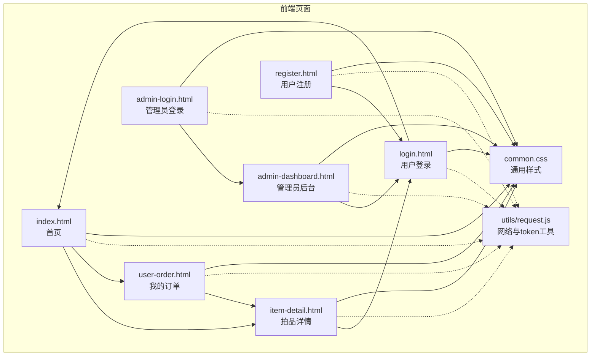
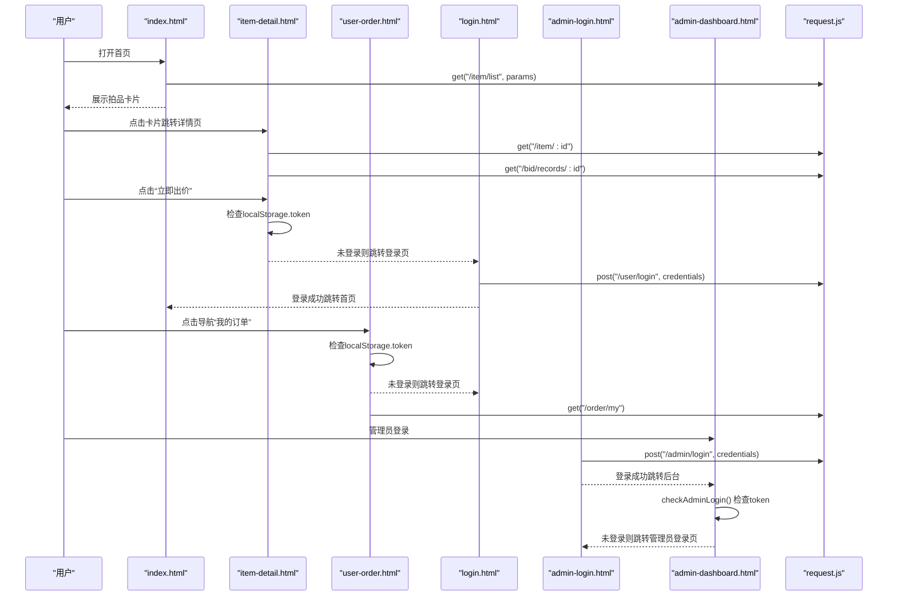
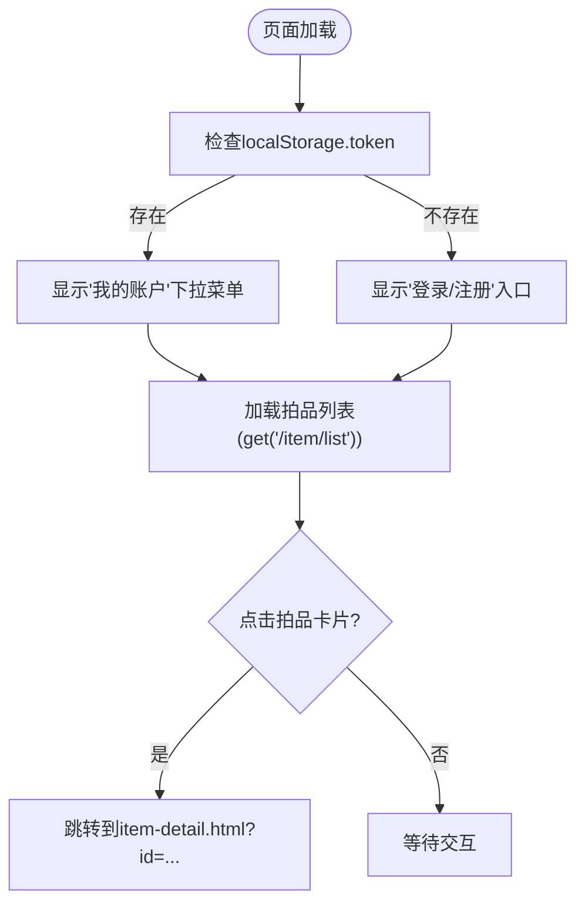
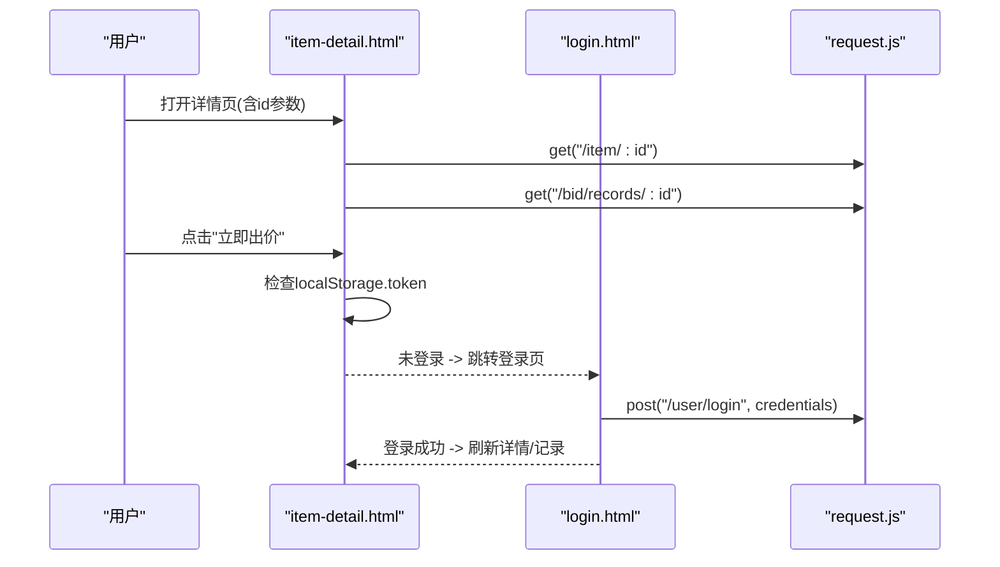
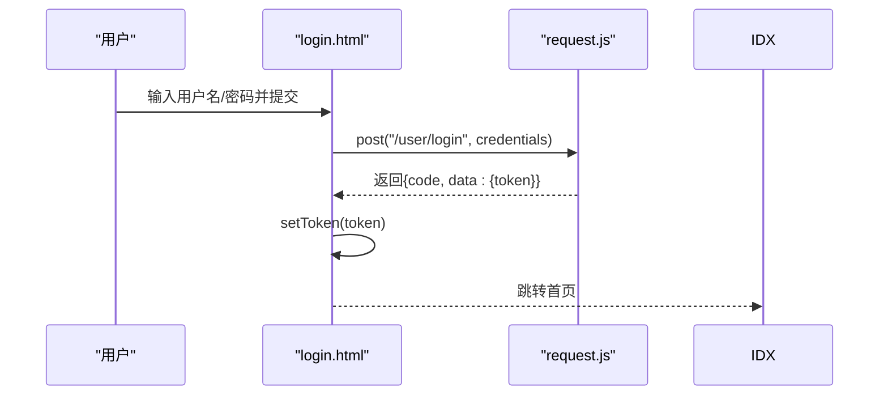
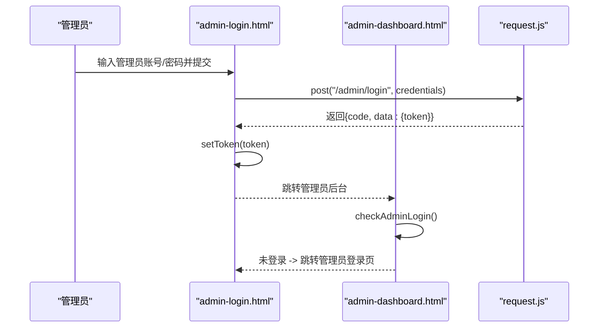
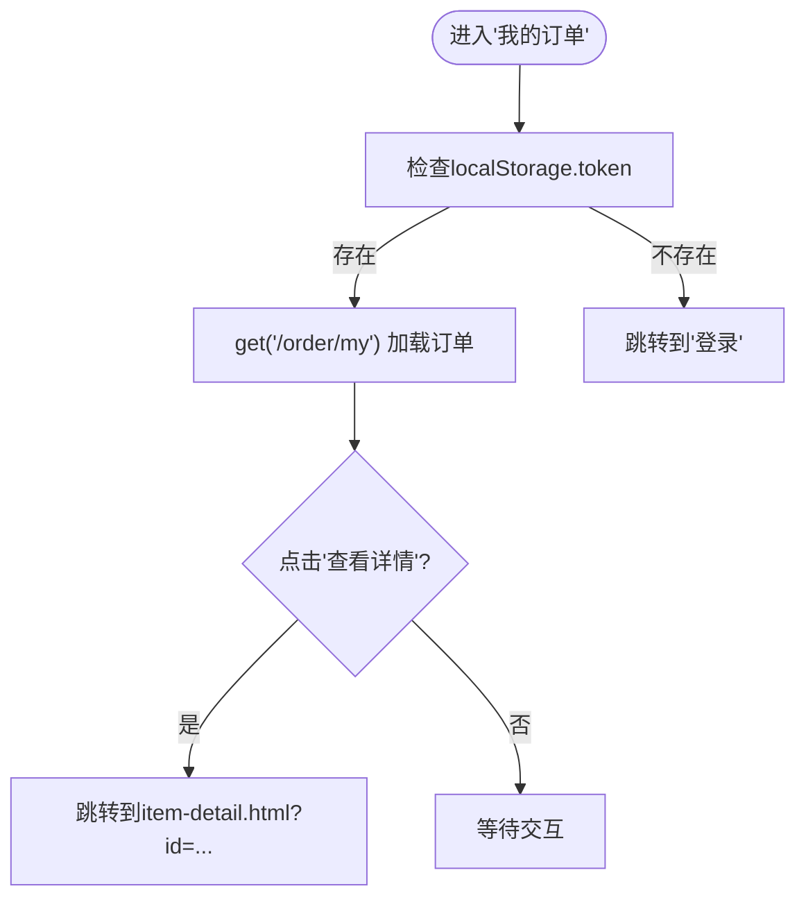
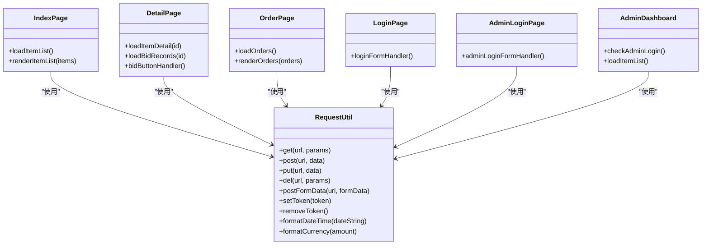
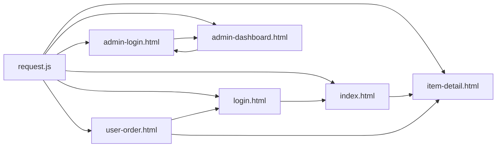

# 前端路由机制

<cite>
**本文引用的文件**
- [index.html](file://html/index.html)
- [item-detail.html](file://html/item-detail.html)
- [login.html](file://html/login.html)
- [admin-login.html](file://html/admin-login.html)
- [admin-dashboard.html](file://html/admin-dashboard.html)
- [user-order.html](file://html/user-order.html)
- [register.html](file://html/register.html)
- [request.js](file://html/utils/request.js)
- [common.css](file://html/common.css)
</cite>

## 目录
1. [引言](#引言)
2. [项目结构](#项目结构)
3. [核心组件](#核心组件)
4. [架构总览](#架构总览)
5. [详细组件分析](#详细组件分析)
6. [依赖关系分析](#依赖关系分析)
7. [性能考虑](#性能考虑)
8. [故障排查指南](#故障排查指南)
9. [结论](#结论)

## 引言
本文件聚焦于前端静态页面间的跳转逻辑与路由控制机制，围绕以下目标展开：
- 用户通过首页浏览拍品，点击卡片跳转至拍品详情页；
- 未登录用户访问受保护页面时重定向至登录页；
- 登录成功后根据角色跳转至首页或管理员后台；
- 用户可在导航中访问“我的订单”页面；
- 页面间通过超链接、按钮事件和 JavaScript 进行跳转；
- 通过 localStorage 中的 token 判断用户登录状态，控制页面访问权限。

## 项目结构
前端页面位于 html 目录，采用静态 HTML + Bootstrap + 自定义 JS 的轻量架构。工具层封装在 utils/request.js 中，提供统一的网络请求与 token 管理能力。

图表来源
- [index.html](file://html/index.html#L1-L120)
- [item-detail.html](file://html/item-detail.html#L1-L120)
- [user-order.html](file://html/user-order.html#L1-L120)
- [login.html](file://html/login.html#L1-L99)
- [admin-login.html](file://html/admin-login.html#L1-L84)
- [admin-dashboard.html](file://html/admin-dashboard.html#L1-L120)
- [register.html](file://html/register.html#L1-L107)
- [request.js](file://html/utils/request.js#L1-L131)
- [common.css](file://html/common.css#L1-L175)

章节来源
- [index.html](file://html/index.html#L1-L120)
- [request.js](file://html/utils/request.js#L1-L131)

## 核心组件
- 导航栏动态渲染与登录状态检测：首页、详情页、订单页均在页面加载时检查 localStorage 中的 token，并据此切换导航项（登录/注册、我的账户/退出登录等）。
- 跳转方式：
  - 超链接：首页拍品卡片、详情页返回按钮、导航中的“拍品列表/我的订单”等。
  - 按钮事件：详情页“立即出价”、订单页“查看详情/立即付款”、后台“退出登录”等。
  - JavaScript：登录成功后的页面跳转、退出登录清除 token 并跳转、后台访问前的登录校验。
- 权限控制：用户订单页与管理员后台页在进入时检查 token，未登录则跳转至对应登录页。

章节来源
- [index.html](file://html/index.html#L20-L70)
- [item-detail.html](file://html/item-detail.html#L20-L70)
- [user-order.html](file://html/user-order.html#L30-L75)
- [admin-dashboard.html](file://html/admin-dashboard.html#L200-L290)
- [login.html](file://html/login.html#L60-L99)
- [admin-login.html](file://html/admin-login.html#L45-L84)

## 架构总览
前端采用“静态页面 + 工具模块”的组织方式，页面间通过超链接与 JavaScript 事件驱动跳转；工具模块统一处理网络请求与 token 传递，保障跨页面的一致性。

图表来源
- [index.html](file://html/index.html#L160-L260)
- [item-detail.html](file://html/item-detail.html#L147-L210)
- [user-order.html](file://html/user-order.html#L110-L140)
- [login.html](file://html/login.html#L60-L99)
- [admin-login.html](file://html/admin-login.html#L45-L84)
- [admin-dashboard.html](file://html/admin-dashboard.html#L269-L320)
- [request.js](file://html/utils/request.js#L32-L110)

## 详细组件分析

### 首页 index.html
- 跳转逻辑
  - 拍品卡片底部按钮通过超链接跳转至详情页，并附带拍品 id 参数。
  - 导航栏根据 token 动态显示“我的账户/退出登录”或“登录/注册”。
- 权限控制
  - 通过 DOMContentLoaded 事件触发 checkLoginStatus，无需 token 时导航显示登录/注册入口。
- 数据加载
  - 使用工具模块 get 发起分页查询，渲染拍品卡片并绑定分页与搜索事件。

图表来源
- [index.html](file://html/index.html#L20-L70)
- [index.html](file://html/index.html#L260-L320)
- [index.html](file://html/index.html#L320-L420)

章节来源
- [index.html](file://html/index.html#L20-L70)
- [index.html](file://html/index.html#L260-L320)
- [index.html](file://html/index.html#L320-L420)

### 拍品详情 item-detail.html
- 跳转逻辑
  - 返回按钮通过超链接回到首页。
  - 导航栏根据 token 显示“我的订单/退出登录”或“登录/注册”。
  - 出价按钮事件：若未登录则跳转登录页；登录后调用后端接口并刷新详情与记录。
- 权限控制
  - 出价前检查 token，未登录直接跳转登录页。
- 数据加载
  - 通过 URL 查询参数获取拍品 id，分别加载详情与竞拍记录。

图表来源
- [item-detail.html](file://html/item-detail.html#L147-L210)
- [item-detail.html](file://html/item-detail.html#L308-L351)
- [login.html](file://html/login.html#L60-L99)
- [request.js](file://html/utils/request.js#L32-L61)

章节来源
- [item-detail.html](file://html/item-detail.html#L147-L210)
- [item-detail.html](file://html/item-detail.html#L308-L351)

### 用户登录 login.html
- 跳转逻辑
  - 提交表单后调用后端登录接口，成功后保存 token 并跳转首页。
- 权限控制
  - 详情页出价流程会间接依赖此处登录成功后的 token。

图表来源
- [login.html](file://html/login.html#L60-L99)
- [request.js](file://html/utils/request.js#L107-L116)

章节来源
- [login.html](file://html/login.html#L60-L99)
- [request.js](file://html/utils/request.js#L107-L116)

### 管理员登录 admin-login.html 与管理员后台 admin-dashboard.html
- 跳转逻辑
  - 管理员登录成功后保存 token 并跳转管理员后台。
  - 管理员后台在页面加载时检查 token，未登录则跳转管理员登录页。
- 权限控制
  - 后台通过独立的 checkAdminLogin 方法进行登录校验。

图表来源
- [admin-login.html](file://html/admin-login.html#L45-L84)
- [admin-dashboard.html](file://html/admin-dashboard.html#L269-L320)
- [request.js](file://html/utils/request.js#L107-L116)

章节来源
- [admin-login.html](file://html/admin-login.html#L45-L84)
- [admin-dashboard.html](file://html/admin-dashboard.html#L269-L320)

### 我的订单 user-order.html
- 跳转逻辑
  - 导航栏根据 token 显示“我的订单/退出登录”或“登录/注册”。
  - 订单列表页在进入时检查 token，未登录则跳转登录页。
  - “查看详情”按钮通过超链接跳转至拍品详情页。
- 数据加载
  - 通过工具模块 get 请求用户订单列表。

图表来源
- [user-order.html](file://html/user-order.html#L110-L140)
- [user-order.html](file://html/user-order.html#L240-L249)

章节来源
- [user-order.html](file://html/user-order.html#L110-L140)
- [user-order.html](file://html/user-order.html#L240-L249)

### 注册 register.html
- 跳转逻辑
  - 注册成功后跳转登录页，便于用户快速登录。

章节来源
- [register.html](file://html/register.html#L60-L105)

### 工具模块 request.js
- 统一网络请求：get/post/put/del/postFormData，自动在请求头中携带 token。
- token 管理：getToken/setToken/removeToken，供各页面读写 localStorage。
- 日期与货币格式化：formatDateTime/formatCurrency，供页面渲染使用。

图表来源
- [request.js](file://html/utils/request.js#L32-L131)
- [index.html](file://html/index.html#L160-L260)
- [item-detail.html](file://html/item-detail.html#L147-L210)
- [user-order.html](file://html/user-order.html#L110-L140)
- [login.html](file://html/login.html#L60-L99)
- [admin-login.html](file://html/admin-login.html#L45-L84)
- [admin-dashboard.html](file://html/admin-dashboard.html#L269-L320)

章节来源
- [request.js](file://html/utils/request.js#L1-L131)

## 依赖关系分析
- 页面对工具模块的依赖：所有页面通过 ES 模块 import 使用 request.js，确保网络请求与 token 传递的一致性。
- 页面间跳转依赖：
  - 首页与详情页之间通过超链接与 URL 参数传递 id。
  - 订单页与详情页之间通过超链接传递 id。
  - 登录成功后根据角色跳转首页或管理员后台。
- 权限控制依赖：
  - localStorage.token 作为全局登录状态标识，贯穿所有页面的导航与访问控制。

图表来源
- [request.js](file://html/utils/request.js#L1-L131)
- [index.html](file://html/index.html#L1-L120)
- [item-detail.html](file://html/item-detail.html#L1-L120)
- [user-order.html](file://html/user-order.html#L1-L120)
- [login.html](file://html/login.html#L1-L99)
- [admin-login.html](file://html/admin-login.html#L1-L84)
- [admin-dashboard.html](file://html/admin-dashboard.html#L1-L120)

章节来源
- [request.js](file://html/utils/request.js#L1-L131)
- [index.html](file://html/index.html#L1-L120)
- [item-detail.html](file://html/item-detail.html#L1-L120)
- [user-order.html](file://html/user-order.html#L1-L120)
- [login.html](file://html/login.html#L1-L99)
- [admin-login.html](file://html/admin-login.html#L1-L84)
- [admin-dashboard.html](file://html/admin-dashboard.html#L1-L120)

## 性能考虑
- 首屏渲染：首页与详情页均采用懒加载与骨架屏提示，减少空白等待感。
- 分页与搜索：首页支持每页条数切换与关键词/价格范围筛选，避免一次性加载大量数据。
- 本地缓存：利用 localStorage 存储 token，减少重复登录成本。
- 请求合并：工具模块统一封装 fetch，避免重复代码与错误处理遗漏。

## 故障排查指南
- 登录后仍被重定向到登录页
  - 检查登录页提交后是否正确调用 setToken 并跳转首页。
  - 确认浏览器 localStorage 中是否存在 token。
- 详情页“立即出价”无效
  - 检查出价按钮事件是否触发 token 校验与跳转逻辑。
  - 确认后端接口返回的最低出价金额是否正确设置。
- 订单页无法加载
  - 检查进入订单页时是否执行了 token 校验与跳转。
  - 确认 get('/order/my') 是否返回期望数据结构。
- 管理员后台无法访问
  - 检查 admin-dashboard 页面的 checkAdminLogin 是否被调用。
  - 确认 admin-login 成功后是否保存了 token 并跳转后台。

章节来源
- [login.html](file://html/login.html#L60-L99)
- [item-detail.html](file://html/item-detail.html#L308-L351)
- [user-order.html](file://html/user-order.html#L110-L140)
- [admin-dashboard.html](file://html/admin-dashboard.html#L269-L320)

## 结论
本项目通过“静态页面 + 工具模块”的方式实现了清晰的前端路由与权限控制：
- 页面间跳转以超链接为主，辅以按钮事件与 JavaScript 控制；
- 通过 localStorage.token 统一判定登录状态，实现导航动态切换与访问控制；
- 工具模块集中处理网络请求与 token，保证跨页面一致性与可维护性；
- 首页、详情页、订单页、登录页与管理员后台形成完整的用户旅程闭环。