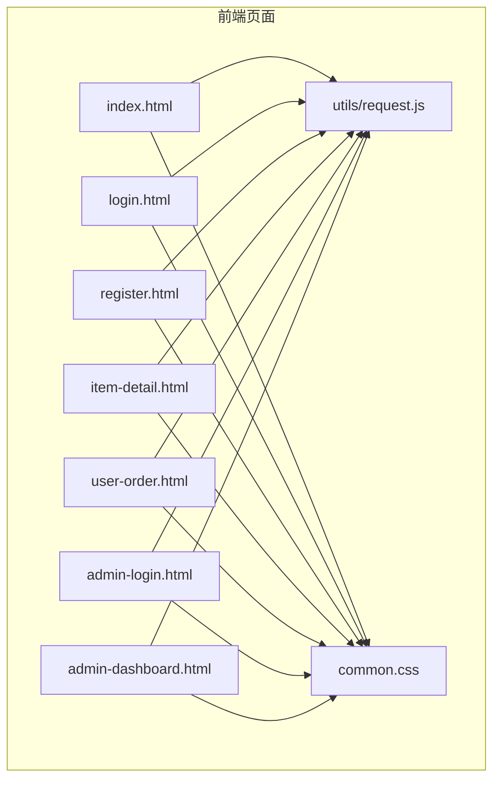
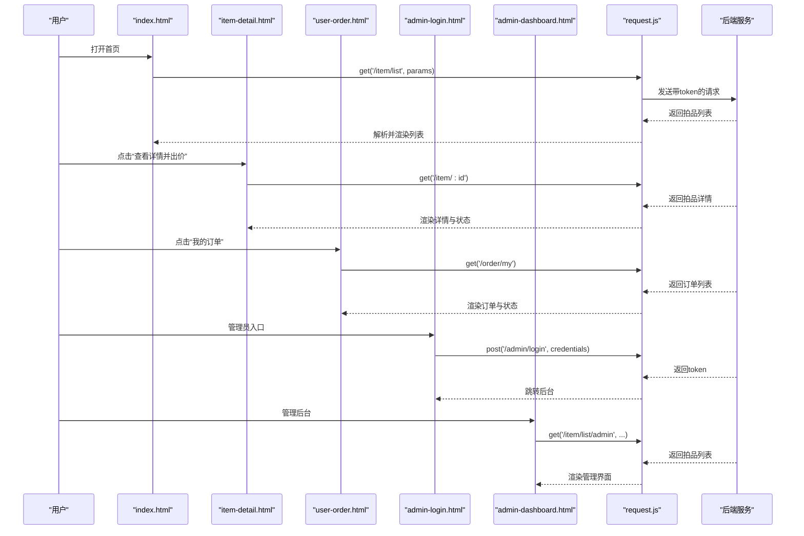
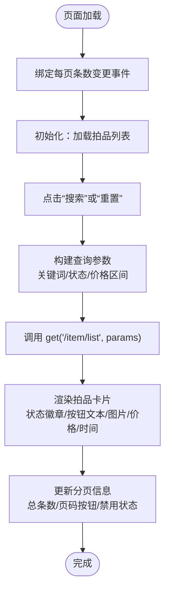
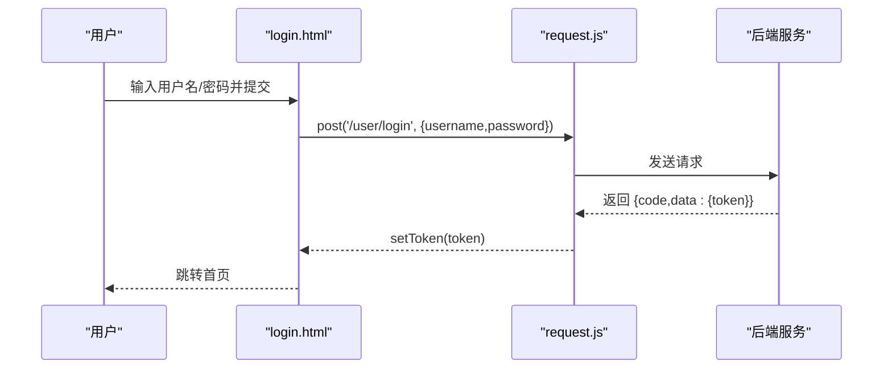
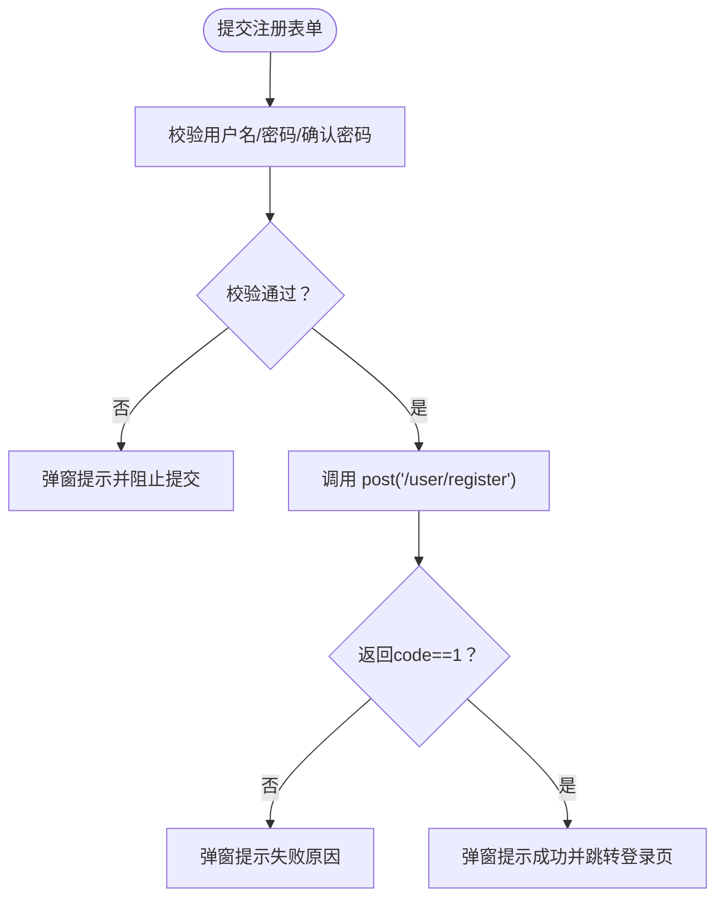
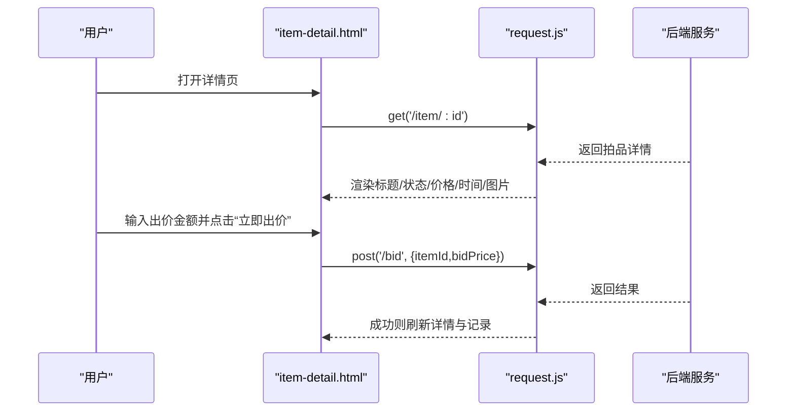
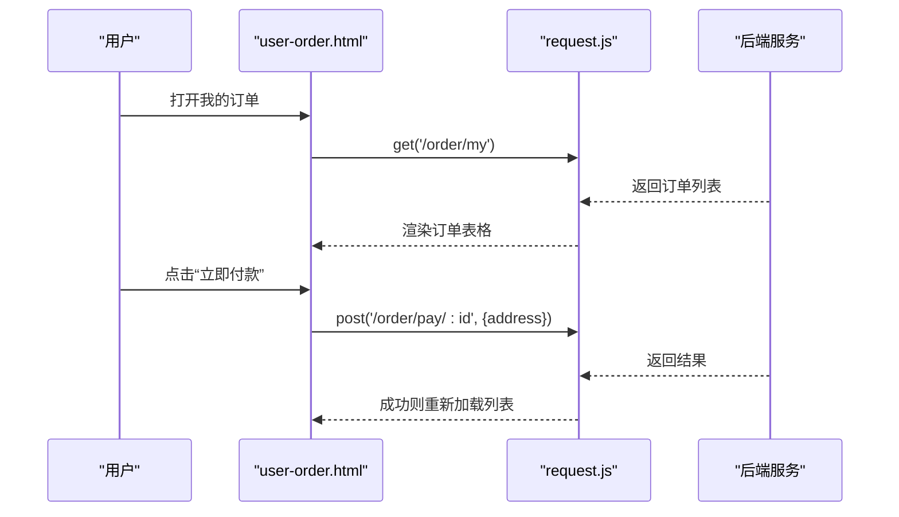
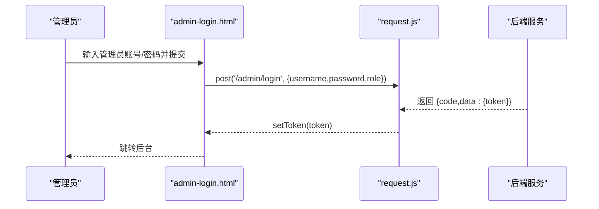
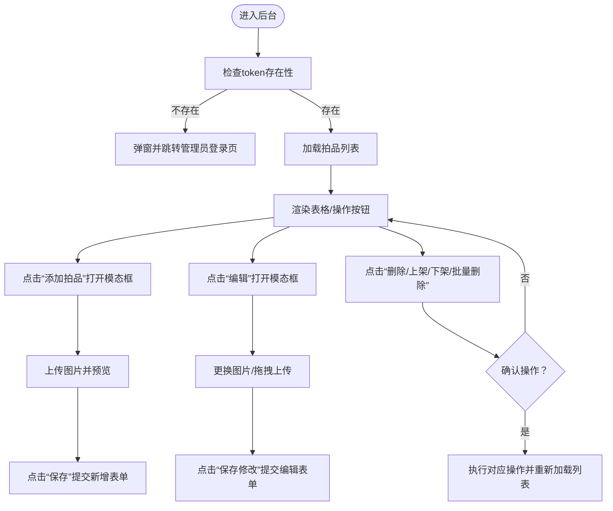
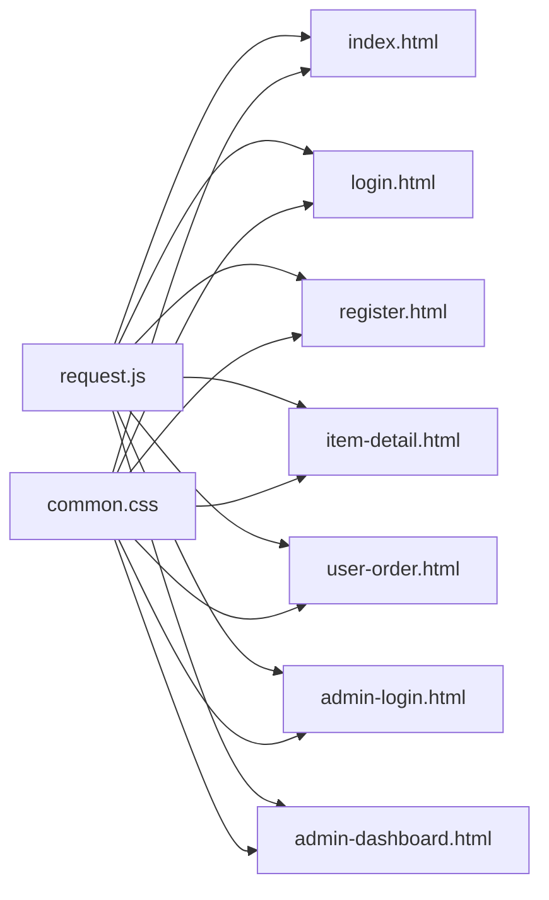

# 页面结构

<cite>
**本文引用的文件**
- [index.html](file://html/index.html)
- [login.html](file://html/login.html)
- [register.html](file://html/register.html)
- [item-detail.html](file://html/item-detail.html)
- [user-order.html](file://html/user-order.html)
- [admin-login.html](file://html/admin-login.html)
- [admin-dashboard.html](file://html/admin-dashboard.html)
- [common.css](file://html/common.css)
- [request.js](file://html/utils/request.js)
</cite>

## 目录
1. [引言](#引言)
2. [项目结构](#项目结构)
3. [核心组件](#核心组件)
4. [架构总览](#架构总览)
5. [详细组件分析](#详细组件分析)
6. [依赖关系分析](#依赖关系分析)
7. [性能考虑](#性能考虑)
8. [故障排查指南](#故障排查指南)
9. [结论](#结论)

## 引言
本文件面向前端页面结构与样式设计，围绕以下目标展开：
- 解释 index.html 作为用户首页展示拍品列表与搜索筛选、分页与交互；
- 解释 login.html 与 register.html 的用户登录与注册界面；
- 解释 item-detail.html 的拍品详情展示与出价流程；
- 解释 user-order.html 的用户订单历史查看与支付流程；
- 解释 admin-login.html 与 admin-dashboard.html 的管理员登录与后台管理界面；
- 分析 common.css 中的全局样式规则，说明布局、字体、按钮样式等统一视觉规范；
- 结合实际页面代码，解释 HTML 结构与 CSS 样式的协同工作方式，确保响应式布局与一致的用户体验。

## 项目结构
前端页面位于 html 目录，采用模块化的组织方式：
- 页面文件：index.html、login.html、register.html、item-detail.html、user-order.html、admin-login.html、admin-dashboard.html
- 公共样式：common.css
- 请求封装：utils/request.js（统一处理 token、超时、JSON/文本响应、日期与货币格式化）

图表来源
- [index.html](file://html/index.html#L1-L426)
- [login.html](file://html/login.html#L1-L99)
- [register.html](file://html/register.html#L1-L107)
- [item-detail.html](file://html/item-detail.html#L1-L364)
- [user-order.html](file://html/user-order.html#L1-L251)
- [admin-login.html](file://html/admin-login.html#L1-L84)
- [admin-dashboard.html](file://html/admin-dashboard.html#L1-L835)
- [common.css](file://html/common.css#L1-L175)
- [request.js](file://html/utils/request.js#L1-L131)

章节来源
- [index.html](file://html/index.html#L1-L426)
- [login.html](file://html/login.html#L1-L99)
- [register.html](file://html/register.html#L1-L107)
- [item-detail.html](file://html/item-detail.html#L1-L364)
- [user-order.html](file://html/user-order.html#L1-L251)
- [admin-login.html](file://html/admin-login.html#L1-L84)
- [admin-dashboard.html](file://html/admin-dashboard.html#L1-L835)
- [common.css](file://html/common.css#L1-L175)
- [request.js](file://html/utils/request.js#L1-L131)

## 核心组件
- 导航栏与登录状态切换：所有页面均包含导航栏，根据本地 token 动态渲染“我的账户”下拉菜单或“登录/注册”入口，并提供退出登录跳转。
- 列表与详情页：首页展示拍品卡片列表，支持关键词、状态、价格区间筛选与分页；详情页展示拍品信息、当前/最高价、时间范围、图片与竞拍记录，支持出价。
- 订单页：展示用户订单列表，支持“立即付款”与“查看详情”。
- 管理后台：管理员登录后进入后台，可对拍品进行增删改、上架/下架、批量删除与图片上传。
- 公共样式：统一导航栏背景、卡片阴影、按钮主题色、表单容器、竞拍按钮与订单状态标签样式。
- 请求封装：统一的 GET/POST/PUT/DELETE 与 FormData 上传方法，自动在请求头中携带 token，提供日期与货币格式化工具。

章节来源
- [index.html](file://html/index.html#L14-L111)
- [item-detail.html](file://html/item-detail.html#L73-L142)
- [user-order.html](file://html/user-order.html#L77-L108)
- [admin-dashboard.html](file://html/admin-dashboard.html#L31-L93)
- [common.css](file://html/common.css#L19-L175)
- [request.js](file://html/utils/request.js#L32-L131)

## 架构总览
前端页面通过 Bootstrap 提供响应式布局与组件，借助 utils/request.js 进行统一的网络请求与 token 管理。页面间通过链接跳转与 URL 参数传递（如 item-detail.html?id=...）实现导航与数据联动。

图表来源
- [index.html](file://html/index.html#L160-L220)
- [item-detail.html](file://html/item-detail.html#L147-L179)
- [user-order.html](file://html/user-order.html#L112-L147)
- [admin-login.html](file://html/admin-login.html#L47-L82)
- [admin-dashboard.html](file://html/admin-dashboard.html#L269-L378)
- [request.js](file://html/utils/request.js#L32-L105)

## 详细组件分析

### 首页 index.html：拍品列表与搜索筛选
- 导航栏：根据是否存在 token 动态显示“我的账户”下拉菜单或“登录/注册”入口；退出登录会清除 token 并跳转登录页。
- 搜索筛选区：支持关键词、状态（未开始/竞拍中/已结束）、最低/最高价格筛选；重置按钮清空条件并回到第一页。
- 列表渲染：根据拍品状态动态设置徽章与按钮文本；图片为空时显示占位提示；货币与时间通过工具函数格式化。
- 分页控制：支持每页条数切换、上一页/下一页、页码按钮、跳转至指定页；页码按钮最多显示5个，自动计算起止页。
- 数据加载：通过 get('/item/list', {page, pageSize, ...}) 获取数据，失败时显示错误提示。

图表来源
- [index.html](file://html/index.html#L160-L220)
- [index.html](file://html/index.html#L222-L311)
- [index.html](file://html/index.html#L300-L386)
- [index.html](file://html/index.html#L387-L424)

章节来源
- [index.html](file://html/index.html#L14-L111)
- [index.html](file://html/index.html#L160-L220)
- [index.html](file://html/index.html#L222-L311)
- [index.html](file://html/index.html#L300-L386)
- [index.html](file://html/index.html#L387-L424)

### 登录页 login.html：用户登录界面
- 导航栏：突出当前页面为“登录”，并提供“管理员入口”跳转。
- 表单：用户名、密码必填；提交前校验非空；调用 post('/user/login') 获取 token 并保存；成功后跳转首页。
- 错误处理：失败弹窗提示，异常捕获统一提示。

图表来源
- [login.html](file://html/login.html#L63-L97)
- [request.js](file://html/utils/request.js#L49-L61)

章节来源
- [login.html](file://html/login.html#L13-L59)
- [login.html](file://html/login.html#L63-L97)
- [request.js](file://html/utils/request.js#L49-L61)

### 注册页 register.html：用户注册界面
- 导航栏：突出当前页面为“注册”，并提供“管理员入口”跳转。
- 表单：用户名、密码、确认密码；提交前校验用户名非空、两次密码一致且长度≥6；调用 post('/user/register') 成功后跳转登录页。
- 错误处理：失败弹窗提示，异常捕获统一提示。

图表来源
- [register.html](file://html/register.html#L63-L105)
- [request.js](file://html/utils/request.js#L49-L61)

章节来源
- [register.html](file://html/register.html#L13-L59)
- [register.html](file://html/register.html#L63-L105)
- [request.js](file://html/utils/request.js#L49-L61)

### 拍品详情页 item-detail.html：详情与出价
- 导航栏：根据 token 显示“我的账户”下拉菜单或“登录/注册”入口；退出登录跳转登录页。
- 详情渲染：根据状态设置徽章与标题；货币与时间通过工具函数格式化；图片为空则隐藏图片区域。
- 出价功能：仅在“竞拍中”状态下启用输入与按钮；最小出价金额为当前最高价+10；提交后重新加载详情与记录。
- 竞拍记录：表格展示时间、用户、金额，毫秒时间戳格式化为日期时间。

图表来源
- [item-detail.html](file://html/item-detail.html#L147-L179)
- [item-detail.html](file://html/item-detail.html#L308-L351)
- [request.js](file://html/utils/request.js#L49-L61)

章节来源
- [item-detail.html](file://html/item-detail.html#L73-L142)
- [item-detail.html](file://html/item-detail.html#L147-L252)
- [item-detail.html](file://html/item-detail.html#L254-L307)
- [item-detail.html](file://html/item-detail.html#L308-L351)
- [request.js](file://html/utils/request.js#L49-L61)

### 订单页 user-order.html：订单历史与支付
- 导航栏：根据 token 显示“我的账户”下拉菜单或“登录/注册”入口；退出登录跳转登录页。
- 订单列表：表格展示订单ID、拍品名称、成交价格、状态、更新时间与操作；状态映射“待付款/已完成/未知”。
- 支付流程：点击“立即付款”调用 post('/order/pay/:id')；点击“查看详情”跳转拍品详情页。
- 未登录拦截：若无 token，弹窗提示并跳转登录页。

图表来源
- [user-order.html](file://html/user-order.html#L112-L147)
- [user-order.html](file://html/user-order.html#L213-L231)
- [request.js](file://html/utils/request.js#L49-L61)

章节来源
- [user-order.html](file://html/user-order.html#L14-L67)
- [user-order.html](file://html/user-order.html#L77-L108)
- [user-order.html](file://html/user-order.html#L112-L211)
- [user-order.html](file://html/user-order.html#L213-L249)
- [request.js](file://html/utils/request.js#L49-L61)

### 管理员登录页 admin-login.html：管理员入口
- 导航栏：提供“用户登录/注册/管理员入口”导航。
- 表单：管理员账号与密码必填；提交后调用 post('/admin/login') 获取 token 并保存，成功后跳转后台。
- 错误处理：失败弹窗提示，异常捕获统一提示。

图表来源
- [admin-login.html](file://html/admin-login.html#L47-L82)
- [request.js](file://html/utils/request.js#L49-L61)

章节来源
- [admin-login.html](file://html/admin-login.html#L13-L43)
- [admin-login.html](file://html/admin-login.html#L47-L82)
- [request.js](file://html/utils/request.js#L49-L61)

### 管理后台 admin-dashboard.html：拍品管理
- 导航栏：固定顶部，提供“退出登录”按钮；退出登录清除 token 并跳转用户登录页。
- 侧边栏：管理菜单（当前聚焦“拍品管理”）。
- 主内容区：拍品列表表格，支持全选、编辑、删除、上架/下架、批量删除。
- 添加/编辑拍品：模态框表单，支持拖拽/点击上传图片，预览与删除；编辑时保留原图 URL。
- 图片上传：使用 postFormData('/admin/common/upload')，自动携带 token；上传成功后将 URL 写入隐藏字段并显示预览。
- 数据加载：get('/item/list/admin', {page,pageSize}) 获取所有拍品；失败时显示错误提示。

图表来源
- [admin-dashboard.html](file://html/admin-dashboard.html#L12-L29)
- [admin-dashboard.html](file://html/admin-dashboard.html#L31-L93)
- [admin-dashboard.html](file://html/admin-dashboard.html#L95-L178)
- [admin-dashboard.html](file://html/admin-dashboard.html#L180-L265)
- [admin-dashboard.html](file://html/admin-dashboard.html#L269-L378)
- [admin-dashboard.html](file://html/admin-dashboard.html#L360-L460)
- [admin-dashboard.html](file://html/admin-dashboard.html#L511-L610)
- [admin-dashboard.html](file://html/admin-dashboard.html#L611-L700)
- [admin-dashboard.html](file://html/admin-dashboard.html#L694-L744)
- [admin-dashboard.html](file://html/admin-dashboard.html#L745-L778)
- [request.js](file://html/utils/request.js#L94-L105)

章节来源
- [admin-dashboard.html](file://html/admin-dashboard.html#L12-L29)
- [admin-dashboard.html](file://html/admin-dashboard.html#L31-L93)
- [admin-dashboard.html](file://html/admin-dashboard.html#L95-L178)
- [admin-dashboard.html](file://html/admin-dashboard.html#L180-L265)
- [admin-dashboard.html](file://html/admin-dashboard.html#L269-L378)
- [admin-dashboard.html](file://html/admin-dashboard.html#L360-L460)
- [admin-dashboard.html](file://html/admin-dashboard.html#L511-L610)
- [admin-dashboard.html](file://html/admin-dashboard.html#L611-L700)
- [admin-dashboard.html](file://html/admin-dashboard.html#L694-L744)
- [admin-dashboard.html](file://html/admin-dashboard.html#L745-L778)
- [request.js](file://html/utils/request.js#L94-L105)

### 公共样式 common.css：统一视觉规范
- 基础排版：统一字体、容器最大宽度、背景色。
- 导航栏：深色背景、白色品牌与链接、悬停高亮色。
- 卡片：无边框阴影、悬停提升效果；图片容器固定高度、居中裁剪；卡片主体自适应高度；底部自动推到底部。
- 按钮：主题色（蓝色、橙色、红色）与悬停变色；竞拍按钮宽屏适配。
- 表单：居中容器、圆角与阴影；标题居中。
- 管理后台：侧边栏深色背景与链接悬停；内容区背景与最小高度；固定顶部导航占用空间。
- 订单状态标签：待付款与已完成状态色块与文字颜色。

章节来源
- [common.css](file://html/common.css#L1-L175)

## 依赖关系分析
- 页面与请求封装：各页面通过 import 方式引入 request.js，统一发起 get/post/put/del/postFormData 请求，并携带 token。
- 页面与样式：各页面均引入 common.css，保证导航栏、卡片、按钮、表单、后台布局与状态标签的一致性。
- 页面间导航：首页与详情页通过链接与 URL 参数关联；订单页与详情页通过“查看详情”按钮跳转；管理员入口与后台通过登录页跳转。

图表来源
- [request.js](file://html/utils/request.js#L32-L105)
- [index.html](file://html/index.html#L10-L11)
- [login.html](file://html/login.html#L8-L11)
- [register.html](file://html/register.html#L8-L11)
- [item-detail.html](file://html/item-detail.html#L8-L11)
- [user-order.html](file://html/user-order.html#L7-L11)
- [admin-login.html](file://html/admin-login.html#L8-L11)
- [admin-dashboard.html](file://html/admin-dashboard.html#L7-L11)
- [common.css](file://html/common.css#L1-L175)

章节来源
- [request.js](file://html/utils/request.js#L32-L105)
- [index.html](file://html/index.html#L10-L11)
- [login.html](file://html/login.html#L8-L11)
- [register.html](file://html/register.html#L8-L11)
- [item-detail.html](file://html/item-detail.html#L8-L11)
- [user-order.html](file://html/user-order.html#L7-L11)
- [admin-login.html](file://html/admin-login.html#L8-L11)
- [admin-dashboard.html](file://html/admin-dashboard.html#L7-L11)
- [common.css](file://html/common.css#L1-L175)

## 性能考虑
- 列表分页：首页使用分页参数避免一次性加载大量数据，减少 DOM 渲染压力。
- 懒加载与占位：列表与详情页在加载中显示加载指示与提示，提升感知性能。
- 本地缓存：利用 localStorage 存储 token，减少重复登录成本。
- 样式复用：公共样式集中管理，避免重复定义，降低样式体积与维护成本。
- 响应式布局：Bootstrap 提供移动端适配，配合 common.css 的容器与卡片布局，确保在不同设备上的一致体验。

## 故障排查指南
- 登录/注册失败：检查用户名与密码是否为空、确认密码是否一致、密码长度是否满足要求；查看浏览器控制台错误信息。
- 详情页缺少拍品ID：确认链接是否包含 id 参数；检查 URL 查询字符串。
- 出价失败：确认已登录、出价金额是否大于等于最低出价、网络请求是否成功；查看后端返回的错误消息。
- 订单页未登录：页面会在加载时检查 token，若缺失会跳转登录页；确认登录成功后刷新页面。
- 管理员登录失败：确认账号与密码正确、角色参数是否正确；检查后台接口返回的错误消息。
- 图片上传失败：确认文件类型与大小限制、网络连接正常；查看上传接口返回的错误消息。

章节来源
- [login.html](file://html/login.html#L63-L97)
- [register.html](file://html/register.html#L63-L105)
- [item-detail.html](file://html/item-detail.html#L308-L351)
- [user-order.html](file://html/user-order.html#L112-L147)
- [admin-login.html](file://html/admin-login.html#L47-L82)
- [admin-dashboard.html](file://html/admin-dashboard.html#L511-L610)

## 结论
本项目的前端页面以统一的导航与样式为基础，围绕用户浏览拍品、下单支付、管理员后台管理等核心业务场景构建。通过 request.js 封装统一的网络请求与 token 管理，结合 Bootstrap 的响应式布局与 common.css 的视觉规范，实现了清晰的页面结构、一致的用户体验与良好的可维护性。后续可在图片上传、错误提示国际化、分页算法优化等方面进一步完善。