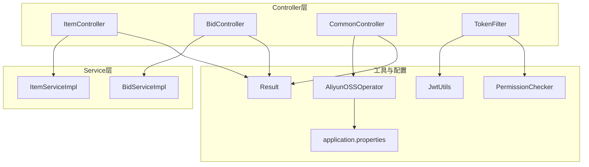
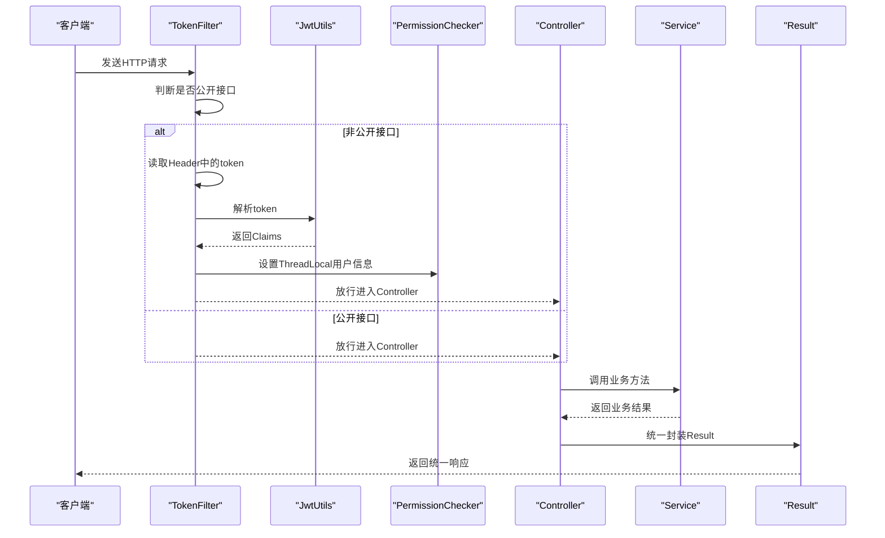
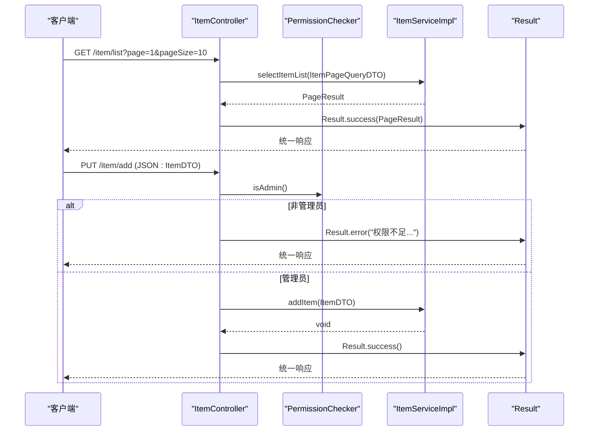
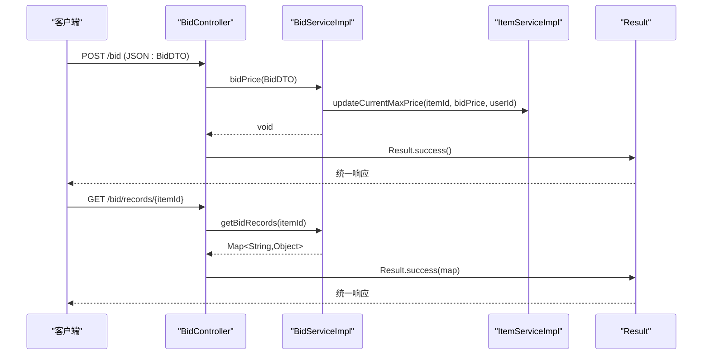
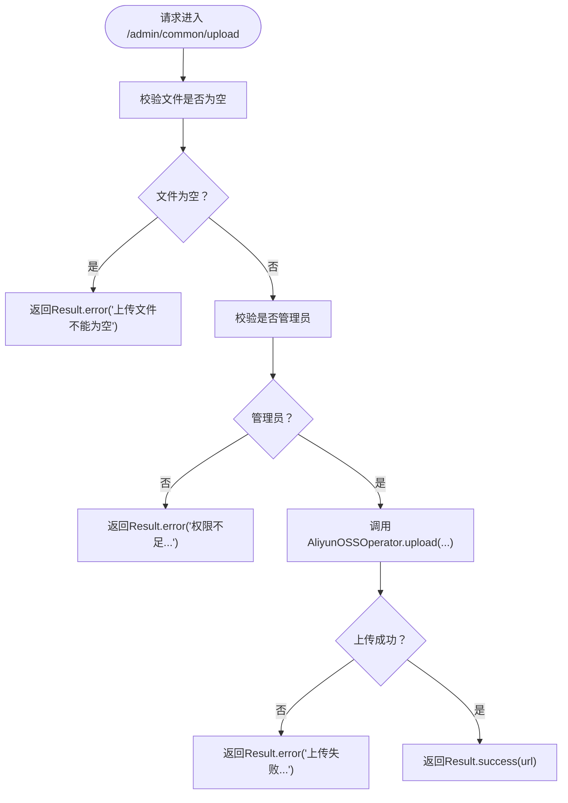
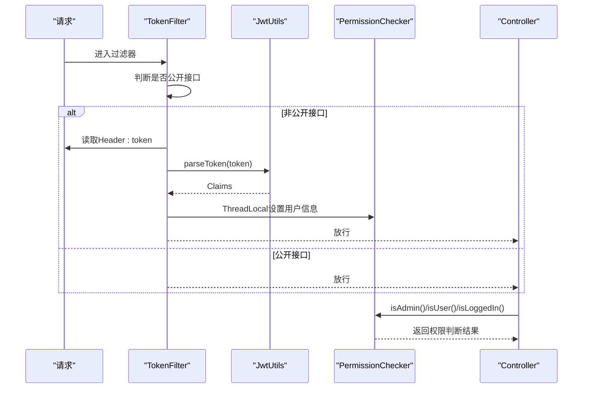
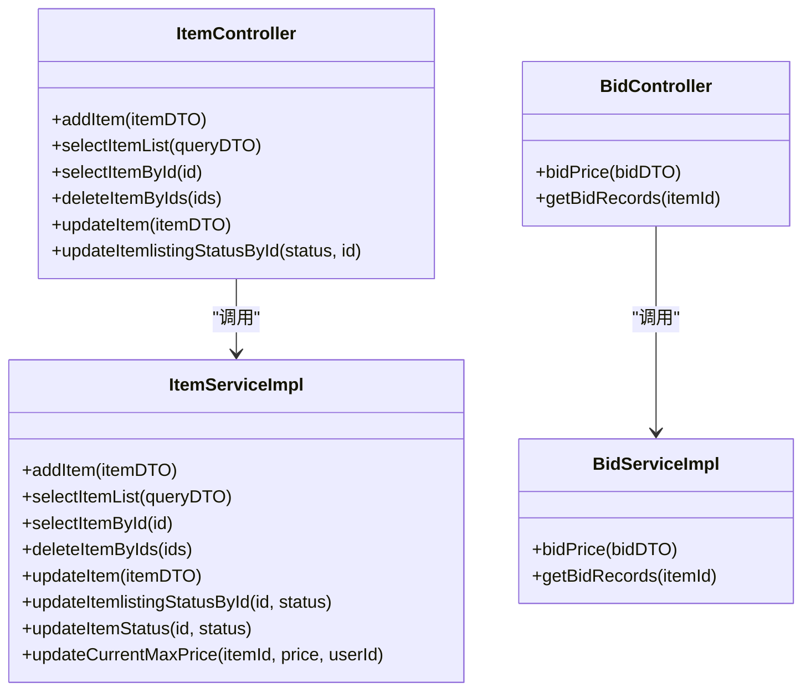
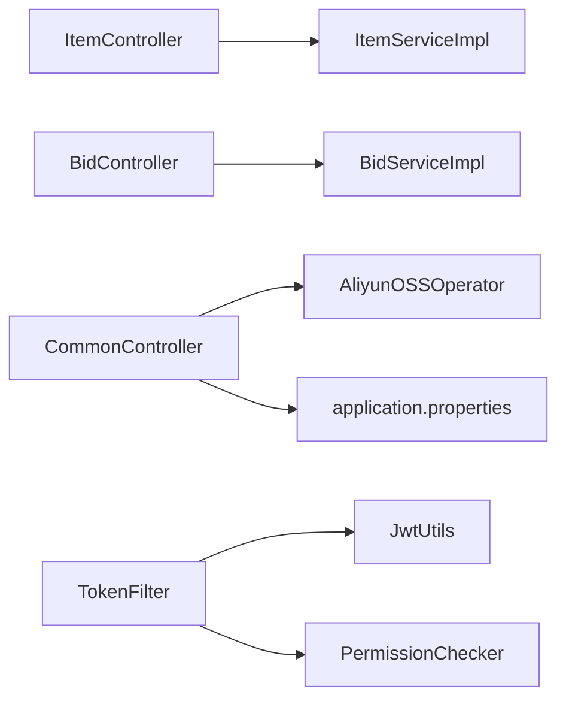

# Controller层设计

<cite>
**本文引用的文件**
- [ItemController.java](file://src/main/java/com/qkl/auctionsystem/controller/ItemController.java)
- [BidController.java](file://src/main/java/com/qkl/auctionsystem/controller/BidController.java)
- [CommonController.java](file://src/main/java/com/qkl/auctionsystem/controller/CommonController.java)
- [TokenFilter.java](file://src/main/java/com/qkl/auctionsystem/filter/TokenFilter.java)
- [Result.java](file://src/main/java/com/qkl/auctionsystem/result/Result.java)
- [AliyunOSSOperator.java](file://src/main/java/com/qkl/auctionsystem/utils/AliyunOSSOperator.java)
- [JwtUtils.java](file://src/main/java/com/qkl/auctionsystem/utils/JwtUtils.java)
- [PermissionChecker.java](file://src/main/java/com/qkl/auctionsystem/utils/PermissionChecker.java)
- [ItemServiceImpl.java](file://src/main/java/com/qkl/auctionsystem/service/impl/ItemServiceImpl.java)
- [BidServiceImpl.java](file://src/main/java/com/qkl/auctionsystem/service/impl/BidServiceImpl.java)
- [ItemPageQueryDTO.java](file://src/main/java/com/qkl/auctionsystem/pojo/dto/ItemPageQueryDTO.java)
- [BidDTO.java](file://src/main/java/com/qkl/auctionsystem/pojo/dto/BidDTO.java)
- [application.properties](file://src/main/resources/application.properties)
</cite>

## 目录
1. [引言](#引言)
2. [项目结构](#项目结构)
3. [核心组件](#核心组件)
4. [架构总览](#架构总览)
5. [详细组件分析](#详细组件分析)
6. [依赖关系分析](#依赖关系分析)
7. [性能考虑](#性能考虑)
8. [故障排查指南](#故障排查指南)
9. [结论](#结论)
10. [附录](#附录)

## 引言
本文件聚焦于本项目的Controller层，系统性阐述Spring Boot中RESTful API的设计与实现要点，包括：
- 如何通过@RequestMapping、@PostMapping、@GetMapping、@PutMapping、@DeleteMapping等注解组织请求映射；
- 如何使用@RequestBody接收JSON参数，如何使用@RequestParam、@PathVariable接收路径与查询参数；
- 如何统一返回Result封装对象，确保前后端交互的一致性；
- 结合ItemController的分页查询接口与BidController的出价接口，展示请求映射、参数校验、异常处理的完整流程；
- 解释TokenFilter如何与Controller协作完成JWT权限验证；
- Controller层如何调用Service层接口实现业务逻辑解耦；
- CommonController中文件上传接口与阿里云OSS的集成方式。

## 项目结构
Controller层位于包com.qkl.auctionsystem.controller，主要包含以下控制器：
- ItemController：拍品相关接口（新增、分页查询、详情查询、批量删除、更新、上下架状态变更）
- BidController：出价与竞拍记录查询接口
- CommonController：管理员文件上传接口（对接阿里云OSS）
- TokenFilter：基于JWT的全局过滤器，负责鉴权与用户信息透传
- Result：统一响应封装
- DTO：请求参数载体（如ItemPageQueryDTO、BidDTO）

图表来源
- [ItemController.java](file://src/main/java/com/qkl/auctionsystem/controller/ItemController.java#L1-L86)
- [BidController.java](file://src/main/java/com/qkl/auctionsystem/controller/BidController.java#L1-L47)
- [CommonController.java](file://src/main/java/com/qkl/auctionsystem/controller/CommonController.java#L1-L51)
- [TokenFilter.java](file://src/main/java/com/qkl/auctionsystem/filter/TokenFilter.java#L1-L141)
- [Result.java](file://src/main/java/com/qkl/auctionsystem/result/Result.java#L1-L39)
- [JwtUtils.java](file://src/main/java/com/qkl/auctionsystem/utils/JwtUtils.java#L1-L36)
- [PermissionChecker.java](file://src/main/java/com/qkl/auctionsystem/utils/PermissionChecker.java#L1-L36)
- [AliyunOSSOperator.java](file://src/main/java/com/qkl/auctionsystem/utils/AliyunOSSOperator.java#L1-L69)
- [application.properties](file://src/main/resources/application.properties#L1-L20)

章节来源
- [ItemController.java](file://src/main/java/com/qkl/auctionsystem/controller/ItemController.java#L1-L86)
- [BidController.java](file://src/main/java/com/qkl/auctionsystem/controller/BidController.java#L1-L47)
- [CommonController.java](file://src/main/java/com/qkl/auctionsystem/controller/CommonController.java#L1-L51)
- [TokenFilter.java](file://src/main/java/com/qkl/auctionsystem/filter/TokenFilter.java#L1-L141)
- [Result.java](file://src/main/java/com/qkl/auctionsystem/result/Result.java#L1-L39)
- [application.properties](file://src/main/resources/application.properties#L1-L20)

## 核心组件
- 统一响应封装Result：提供success与error静态工厂方法，约定code=1表示成功，其他为失败；msg承载错误信息，data承载业务数据。
- 请求映射注解：@RestController、@RequestMapping、@PostMapping、@GetMapping、@PutMapping、@DeleteMapping、@CrossOrigin等。
- 参数绑定：@RequestBody接收JSON体，@RequestParam接收查询参数，@PathVariable接收路径变量。
- 权限控制：TokenFilter拦截请求，解析JWT，将用户ID与角色存入ThreadLocal，供PermissionChecker判断是否管理员或已登录。
- 文件上传：CommonController对接阿里云OSS，使用AliyunOSSOperator完成上传并返回可访问URL。

章节来源
- [Result.java](file://src/main/java/com/qkl/auctionsystem/result/Result.java#L1-L39)
- [TokenFilter.java](file://src/main/java/com/qkl/auctionsystem/filter/TokenFilter.java#L1-L141)
- [PermissionChecker.java](file://src/main/java/com/qkl/auctionsystem/utils/PermissionChecker.java#L1-L36)
- [CommonController.java](file://src/main/java/com/qkl/auctionsystem/controller/CommonController.java#L1-L51)
- [AliyunOSSOperator.java](file://src/main/java/com/qkl/auctionsystem/utils/AliyunOSSOperator.java#L1-L69)

## 架构总览
Controller层通过REST接口对外暴露功能，内部仅做参数校验、日志记录与调用Service层，返回统一Result对象。TokenFilter在进入Controller前完成JWT鉴权与用户信息透传，避免Controller重复处理鉴权逻辑。

图表来源
- [TokenFilter.java](file://src/main/java/com/qkl/auctionsystem/filter/TokenFilter.java#L1-L141)
- [JwtUtils.java](file://src/main/java/com/qkl/auctionsystem/utils/JwtUtils.java#L1-L36)
- [PermissionChecker.java](file://src/main/java/com/qkl/auctionsystem/utils/PermissionChecker.java#L1-L36)
- [ItemController.java](file://src/main/java/com/qkl/auctionsystem/controller/ItemController.java#L1-L86)
- [BidController.java](file://src/main/java/com/qkl/auctionsystem/controller/BidController.java#L1-L47)
- [CommonController.java](file://src/main/java/com/qkl/auctionsystem/controller/CommonController.java#L1-L51)

## 详细组件分析

### ItemController：拍品管理与分页查询
- 请求映射
  - 新增拍品：PUT /item/add，需要管理员权限
  - 分页查询（普通用户）：GET /item/list，支持分页参数
  - 分页查询（管理员）：GET /item/list/admin，支持分页参数
  - 拍品详情：GET /item/{itemId}
  - 批量删除：DELETE /item?ids=1,2,3，需要管理员权限
  - 更新拍品：PUT /item/update，需要管理员权限
  - 更新上架状态：PUT /item/{listingStatus}，需要管理员权限
- 参数绑定
  - @RequestBody ItemDTO：接收JSON体参数
  - @RequestParam("ids") ArrayList<Long> ids：接收查询参数ids
  - @PathVariable Long itemId：接收路径变量itemId
  - ItemPageQueryDTO：作为查询条件载体，包含page、pageSize、title、MinPrice、MaxPrice、status等字段
- 统一返回
  - 所有接口均返回Result<T>，成功时code=1，失败时code=0并携带msg
- 权限控制
  - 通过PermissionChecker.isAdmin()判断当前用户是否为管理员，非管理员直接返回Result.error
- 业务调用
  - 调用ItemService完成新增、分页查询、详情查询、批量删除、更新、状态变更等操作

图表来源
- [ItemController.java](file://src/main/java/com/qkl/auctionsystem/controller/ItemController.java#L1-L86)
- [ItemServiceImpl.java](file://src/main/java/com/qkl/auctionsystem/service/impl/ItemServiceImpl.java#L1-L182)
- [ItemPageQueryDTO.java](file://src/main/java/com/qkl/auctionsystem/pojo/dto/ItemPageQueryDTO.java#L1-L19)
- [PermissionChecker.java](file://src/main/java/com/qkl/auctionsystem/utils/PermissionChecker.java#L1-L36)
- [Result.java](file://src/main/java/com/qkl/auctionsystem/result/Result.java#L1-L39)

章节来源
- [ItemController.java](file://src/main/java/com/qkl/auctionsystem/controller/ItemController.java#L1-L86)
- [ItemServiceImpl.java](file://src/main/java/com/qkl/auctionsystem/service/impl/ItemServiceImpl.java#L1-L182)
- [ItemPageQueryDTO.java](file://src/main/java/com/qkl/auctionsystem/pojo/dto/ItemPageQueryDTO.java#L1-L19)
- [PermissionChecker.java](file://src/main/java/com/qkl/auctionsystem/utils/PermissionChecker.java#L1-L36)
- [Result.java](file://src/main/java/com/qkl/auctionsystem/result/Result.java#L1-L39)

### BidController：出价与竞拍记录查询
- 请求映射
  - 出价接口：POST /bid，提交BidDTO
  - 查询竞拍记录：GET /bid/records/{itemId}
- 参数绑定
  - @RequestBody BidDTO：包含itemId与bidPrice
  - @PathVariable Long itemId：拍品ID
- 统一返回
  - 出价成功返回Result.success()；查询返回Result.success(Map<String,Object>)，其中包含data字段为竞拍记录列表
- 业务调用
  - 调用BidService完成出价与记录查询；出价时通过TokenFilter.getCurrentUserId()获取当前用户ID

图表来源
- [BidController.java](file://src/main/java/com/qkl/auctionsystem/controller/BidController.java#L1-L47)
- [BidServiceImpl.java](file://src/main/java/com/qkl/auctionsystem/service/impl/BidServiceImpl.java#L1-L75)
- [ItemServiceImpl.java](file://src/main/java/com/qkl/auctionsystem/service/impl/ItemServiceImpl.java#L1-L182)
- [BidDTO.java](file://src/main/java/com/qkl/auctionsystem/pojo/dto/BidDTO.java#L1-L10)
- [Result.java](file://src/main/java/com/qkl/auctionsystem/result/Result.java#L1-L39)

章节来源
- [BidController.java](file://src/main/java/com/qkl/auctionsystem/controller/BidController.java#L1-L47)
- [BidServiceImpl.java](file://src/main/java/com/qkl/auctionsystem/service/impl/BidServiceImpl.java#L1-L75)
- [ItemServiceImpl.java](file://src/main/java/com/qkl/auctionsystem/service/impl/ItemServiceImpl.java#L1-L182)
- [BidDTO.java](file://src/main/java/com/qkl/auctionsystem/pojo/dto/BidDTO.java#L1-L10)
- [Result.java](file://src/main/java/com/qkl/auctionsystem/result/Result.java#L1-L39)

### CommonController：管理员文件上传（阿里云OSS）
- 请求映射
  - 上传接口：POST /admin/common/upload
- 参数绑定
  - MultipartFile file：前端上传的文件
- 权限控制
  - 通过PermissionChecker.isAdmin()判断当前用户是否为管理员，非管理员直接返回Result.error
- 业务集成
  - 调用AliyunOSSOperator.upload(byte[], filename)完成上传，返回OSS可访问URL
- 统一返回
  - 成功返回Result.success(url)，失败返回Result.error(msg)

图表来源
- [CommonController.java](file://src/main/java/com/qkl/auctionsystem/controller/CommonController.java#L1-L51)
- [AliyunOSSOperator.java](file://src/main/java/com/qkl/auctionsystem/utils/AliyunOSSOperator.java#L1-L69)
- [PermissionChecker.java](file://src/main/java/com/qkl/auctionsystem/utils/PermissionChecker.java#L1-L36)
- [Result.java](file://src/main/java/com/qkl/auctionsystem/result/Result.java#L1-L39)

章节来源
- [CommonController.java](file://src/main/java/com/qkl/auctionsystem/controller/CommonController.java#L1-L51)
- [AliyunOSSOperator.java](file://src/main/java/com/qkl/auctionsystem/utils/AliyunOSSOperator.java#L1-L69)
- [PermissionChecker.java](file://src/main/java/com/qkl/auctionsystem/utils/PermissionChecker.java#L1-L36)
- [Result.java](file://src/main/java/com/qkl/auctionsystem/result/Result.java#L1-L39)

### TokenFilter与Controller协作：JWT权限验证
- 拦截范围：拦截所有请求（urlPatterns="/*"）
- 公开接口：对登录/注册、拍品列表、拍品详情、竞拍记录查询等接口放行，无需token
- 鉴权流程：
  - 从Header读取token，若缺失则返回401并Result.error
  - 使用JwtUtils.parseToken解析token，失败则返回401并Result.error
  - 解析成功后，从Claims提取用户ID与角色，放入ThreadLocal
  - 放行请求，finally阶段清除ThreadLocal，避免内存泄漏
- Controller侧配合：
  - 通过PermissionChecker.isAdmin()/isUser()/isLoggedIn()判断权限
  - 在需要管理员权限的接口中，先调用PermissionChecker.isAdmin()进行判定

图表来源
- [TokenFilter.java](file://src/main/java/com/qkl/auctionsystem/filter/TokenFilter.java#L1-L141)
- [JwtUtils.java](file://src/main/java/com/qkl/auctionsystem/utils/JwtUtils.java#L1-L36)
- [PermissionChecker.java](file://src/main/java/com/qkl/auctionsystem/utils/PermissionChecker.java#L1-L36)
- [ItemController.java](file://src/main/java/com/qkl/auctionsystem/controller/ItemController.java#L1-L86)
- [CommonController.java](file://src/main/java/com/qkl/auctionsystem/controller/CommonController.java#L1-L51)

章节来源
- [TokenFilter.java](file://src/main/java/com/qkl/auctionsystem/filter/TokenFilter.java#L1-L141)
- [JwtUtils.java](file://src/main/java/com/qkl/auctionsystem/utils/JwtUtils.java#L1-L36)
- [PermissionChecker.java](file://src/main/java/com/qkl/auctionsystem/utils/PermissionChecker.java#L1-L36)
- [ItemController.java](file://src/main/java/com/qkl/auctionsystem/controller/ItemController.java#L1-L86)
- [CommonController.java](file://src/main/java/com/qkl/auctionsystem/controller/CommonController.java#L1-L51)

### Controller层调用Service层：业务解耦
- ItemController与BidController均通过@Autowired注入对应Service接口，调用其业务方法，不直接操作Mapper，实现表现层与业务层解耦
- ItemServiceImpl与BidServiceImpl分别封装了拍品管理与出价相关的复杂逻辑，包括分页、状态更新、订单生成、竞拍记录持久化等

图表来源
- [ItemController.java](file://src/main/java/com/qkl/auctionsystem/controller/ItemController.java#L1-L86)
- [BidController.java](file://src/main/java/com/qkl/auctionsystem/controller/BidController.java#L1-L47)
- [ItemServiceImpl.java](file://src/main/java/com/qkl/auctionsystem/service/impl/ItemServiceImpl.java#L1-L182)
- [BidServiceImpl.java](file://src/main/java/com/qkl/auctionsystem/service/impl/BidServiceImpl.java#L1-L75)

章节来源
- [ItemController.java](file://src/main/java/com/qkl/auctionsystem/controller/ItemController.java#L1-L86)
- [BidController.java](file://src/main/java/com/qkl/auctionsystem/controller/BidController.java#L1-L47)
- [ItemServiceImpl.java](file://src/main/java/com/qkl/auctionsystem/service/impl/ItemServiceImpl.java#L1-L182)
- [BidServiceImpl.java](file://src/main/java/com/qkl/auctionsystem/service/impl/BidServiceImpl.java#L1-L75)

## 依赖关系分析
- Controller依赖Service接口，Service依赖Mapper与实体模型
- TokenFilter依赖JwtUtils与PermissionChecker，通过ThreadLocal向下传递用户信息
- CommonController依赖AliyunOSSOperator，后者依赖application.properties中的OSS配置

图表来源
- [ItemController.java](file://src/main/java/com/qkl/auctionsystem/controller/ItemController.java#L1-L86)
- [BidController.java](file://src/main/java/com/qkl/auctionsystem/controller/BidController.java#L1-L47)
- [CommonController.java](file://src/main/java/com/qkl/auctionsystem/controller/CommonController.java#L1-L51)
- [TokenFilter.java](file://src/main/java/com/qkl/auctionsystem/filter/TokenFilter.java#L1-L141)
- [JwtUtils.java](file://src/main/java/com/qkl/auctionsystem/utils/JwtUtils.java#L1-L36)
- [PermissionChecker.java](file://src/main/java/com/qkl/auctionsystem/utils/PermissionChecker.java#L1-L36)
- [AliyunOSSOperator.java](file://src/main/java/com/qkl/auctionsystem/utils/AliyunOSSOperator.java#L1-L69)
- [application.properties](file://src/main/resources/application.properties#L1-L20)

章节来源
- [ItemController.java](file://src/main/java/com/qkl/auctionsystem/controller/ItemController.java#L1-L86)
- [BidController.java](file://src/main/java/com/qkl/auctionsystem/controller/BidController.java#L1-L47)
- [CommonController.java](file://src/main/java/com/qkl/auctionsystem/controller/CommonController.java#L1-L51)
- [TokenFilter.java](file://src/main/java/com/qkl/auctionsystem/filter/TokenFilter.java#L1-L141)
- [JwtUtils.java](file://src/main/java/com/qkl/auctionsystem/utils/JwtUtils.java#L1-L36)
- [PermissionChecker.java](file://src/main/java/com/qkl/auctionsystem/utils/PermissionChecker.java#L1-L36)
- [AliyunOSSOperator.java](file://src/main/java/com/qkl/auctionsystem/utils/AliyunOSSOperator.java#L1-L69)
- [application.properties](file://src/main/resources/application.properties#L1-L20)

## 性能考虑
- 分页查询：ItemServiceImpl使用PageHelper进行分页，建议合理设置page与pageSize，避免一次性返回大量数据
- 并发与事务：出价接口涉及竞拍记录插入与最高价更新，建议在Service层使用合适的事务边界，保证一致性
- 文件上传：AliyunOSSOperator每次上传新建OSSClient并在finally中shutdown，注意在高并发场景下可能产生连接开销，可考虑引入连接池或复用客户端策略
- 日志与监控：Controller与Service层均使用日志记录关键流程，建议结合监控系统追踪慢请求与异常

## 故障排查指南
- 401未授权
  - 现象：返回Result.error("未授权，请先登录")或("令牌非法，请重新登录")
  - 排查：确认请求头是否包含正确的token；检查Jwt签名密钥与过期时间；确认TokenFilter是否正确解析Claims
- 权限不足
  - 现象：返回Result.error("权限不足，只有管理员才能...")或("权限不足，只有管理员才能上传文件")
  - 排查：确认当前用户角色是否为管理员；检查TokenFilter是否正确设置ThreadLocal；确认PermissionChecker判断逻辑
- 文件上传失败
  - 现象：返回Result.error("文件上传失败: ...")
  - 排查：确认application.properties中OSS配置项是否正确；检查AliyunOSSOperator上传逻辑与网络连通性；查看OSS凭证来源（配置文件vs环境变量）
- 出价异常
  - 现象：抛出运行时异常（如数据库出价记录失败）
  - 排查：检查BidServiceImpl中竞拍记录插入与最高价更新的事务边界；核对itemId与bidPrice是否有效

章节来源
- [TokenFilter.java](file://src/main/java/com/qkl/auctionsystem/filter/TokenFilter.java#L1-L141)
- [PermissionChecker.java](file://src/main/java/com/qkl/auctionsystem/utils/PermissionChecker.java#L1-L36)
- [CommonController.java](file://src/main/java/com/qkl/auctionsystem/controller/CommonController.java#L1-L51)
- [AliyunOSSOperator.java](file://src/main/java/com/qkl/auctionsystem/utils/AliyunOSSOperator.java#L1-L69)
- [BidServiceImpl.java](file://src/main/java/com/qkl/auctionsystem/service/impl/BidServiceImpl.java#L1-L75)

## 结论
本项目的Controller层通过清晰的REST接口设计、统一的Result封装、完善的权限控制与与Service层的解耦协作，实现了稳定可靠的业务能力。TokenFilter与JwtUtils、PermissionChecker共同构建了基于JWT的鉴权体系，既保证了安全性，又降低了Controller层的鉴权复杂度。CommonController对接阿里云OSS，展示了Controller层与第三方服务的集成方式。建议在高并发场景下进一步优化文件上传与事务处理策略，并完善异常与监控机制。

## 附录
- 统一响应结构
  - code：1表示成功，0及其它数字表示失败
  - msg：错误信息或成功提示
  - data：业务数据（如分页结果、实体对象、上传URL等）
- 公共接口白名单
  - 登录/注册：/user/register、/user/login、/admin/login
  - 拍品浏览：/item/list、/item/{itemId}
  - 竞拍记录：/bid/records/{itemId}

章节来源
- [Result.java](file://src/main/java/com/qkl/auctionsystem/result/Result.java#L1-L39)
- [TokenFilter.java](file://src/main/java/com/qkl/auctionsystem/filter/TokenFilter.java#L1-L141)