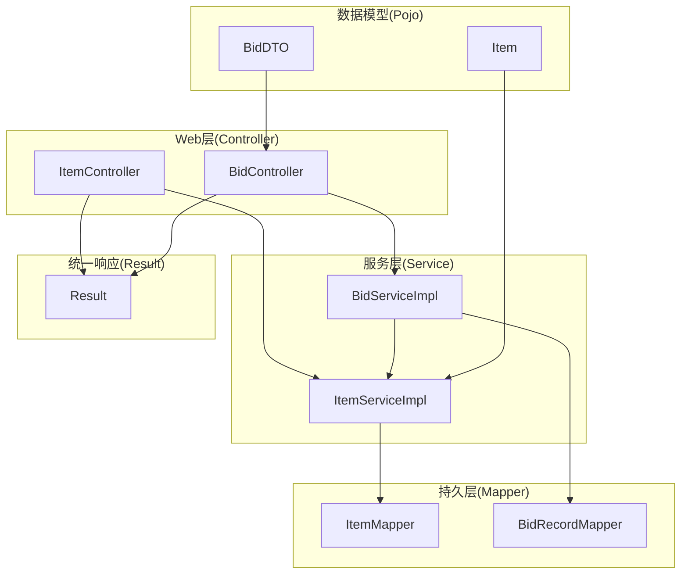
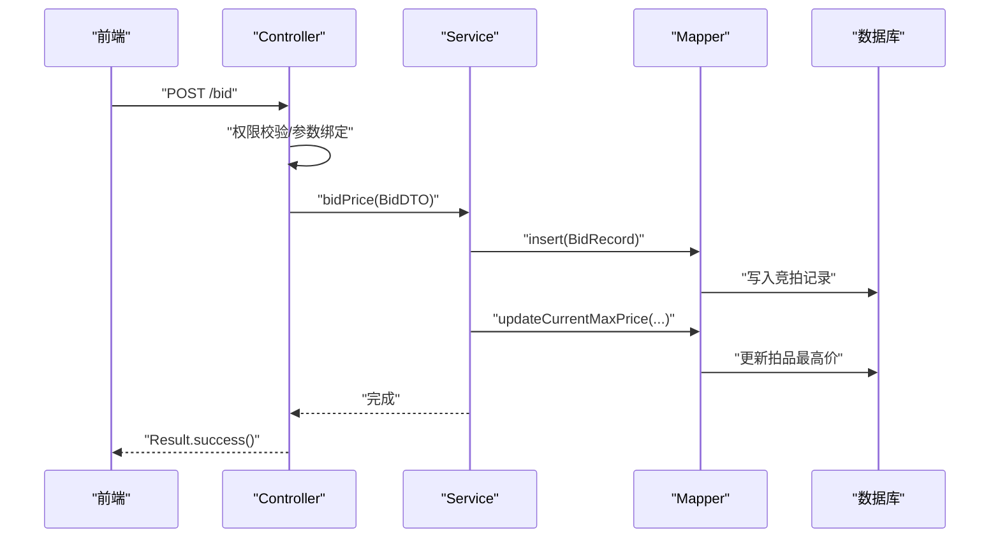
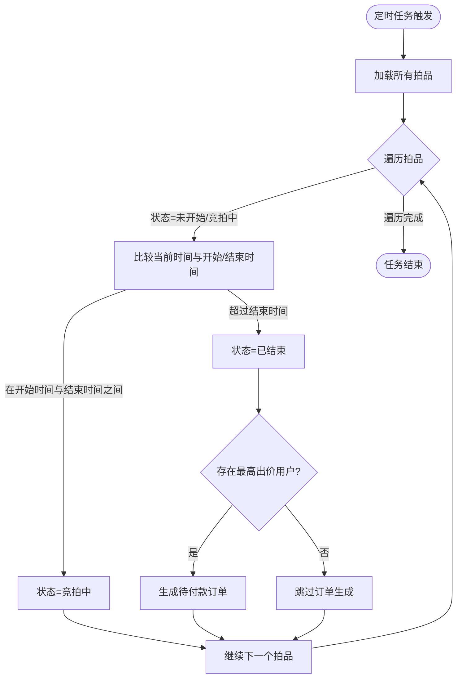
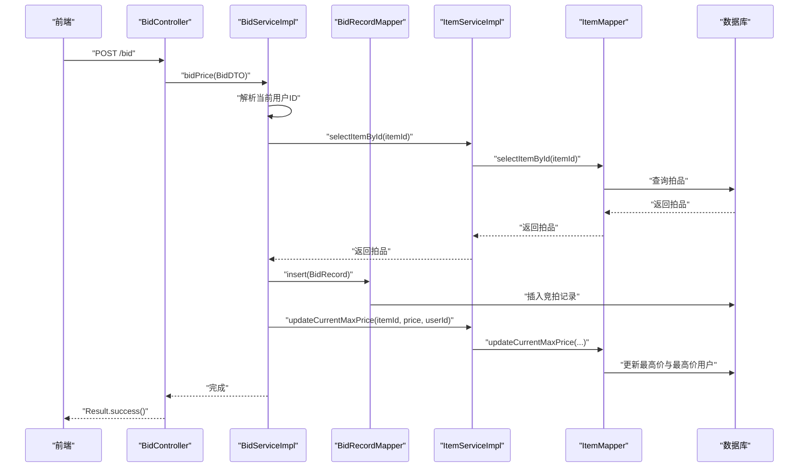
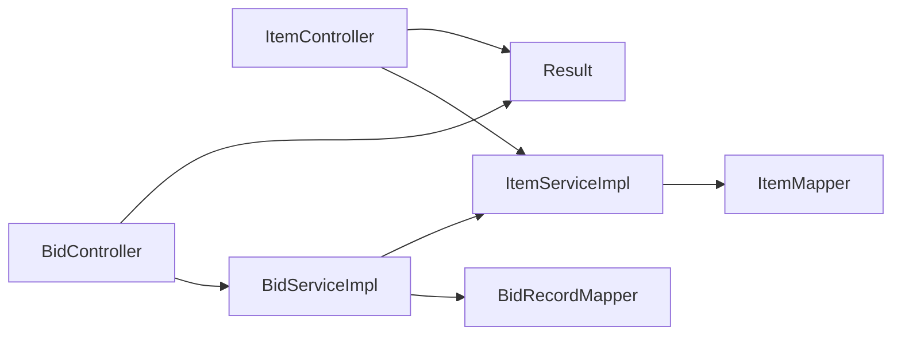

# MVC架构设计

<cite>
**本文引用的文件**
- [AuctionSystemApplication.java](file://src/main/java/com/qkl/auctionsystem/AuctionSystemApplication.java)
- [application.properties](file://src/main/resources/application.properties)
- [ItemController.java](file://src/main/java/com/qkl/auctionsystem/controller/ItemController.java)
- [BidController.java](file://src/main/java/com/qkl/auctionsystem/controller/BidController.java)
- [ItemServiceImpl.java](file://src/main/java/com/qkl/auctionsystem/service/impl/ItemServiceImpl.java)
- [BidServiceImpl.java](file://src/main/java/com/qkl/auctionsystem/service/impl/BidServiceImpl.java)
- [ItemMapper.java](file://src/main/java/com/qkl/auctionsystem/mapper/ItemMapper.java)
- [BidRecordMapper.java](file://src/main/java/com/qkl/auctionsystem/mapper/BidRecordMapper.java)
- [Result.java](file://src/main/java/com/qkl/auctionsystem/result/Result.java)
- [BidDTO.java](file://src/main/java/com/qkl/auctionsystem/pojo/dto/BidDTO.java)
- [Item.java](file://src/main/java/com/qkl/auctionsystem/pojo/entity/Item.java)
- [JwtUtils.java](file://src/main/java/com/qkl/auctionsystem/utils/JwtUtils.java)
- [TokenFilter.java](file://src/main/java/com/qkl/auctionsystem/filter/TokenFilter.java)
- [pom.xml](file://pom.xml)
</cite>

## 目录
1. [引言](#引言)
2. [项目结构](#项目结构)
3. [核心组件](#核心组件)
4. [架构总览](#架构总览)
5. [详细组件分析](#详细组件分析)
6. [依赖关系分析](#依赖关系分析)
7. [性能考量](#性能考量)
8. [故障排查指南](#故障排查指南)
9. [结论](#结论)

## 引言
本文件围绕本项目的MVC架构展开，重点说明Spring Boot实现的前后端分离设计。控制器层通过统一的Result响应体返回接口结果；服务层封装业务逻辑（如拍品状态变更、竞拍出价校验、订单生成等）；持久层通过MyBatis与数据库交互。文档将以ItemController到ItemService再到ItemMapper的调用链为主线，辅以BidController到BidService再到BidRecordMapper的完整请求处理流程，帮助读者理解MVC模式如何提升代码可维护性以及各层之间的松耦合设计原则。

## 项目结构
项目采用标准的Spring Boot多模块分层组织：
- controller：负责接收HTTP请求、参数绑定、权限校验、统一返回Result
- service：封装业务逻辑、事务边界、跨表操作、定时任务
- mapper：基于MyBatis接口定义SQL映射方法
- pojo：数据传输对象与实体类
- result：统一响应包装
- utils：工具类（JWT、权限检查、OSS等）
- resources：配置文件与MyBatis映射XML

图表来源
- [ItemController.java](file://src/main/java/com/qkl/auctionsystem/controller/ItemController.java#L1-L86)
- [BidController.java](file://src/main/java/com/qkl/auctionsystem/controller/BidController.java#L1-L47)
- [ItemServiceImpl.java](file://src/main/java/com/qkl/auctionsystem/service/impl/ItemServiceImpl.java#L1-L182)
- [BidServiceImpl.java](file://src/main/java/com/qkl/auctionsystem/service/impl/BidServiceImpl.java#L1-L75)
- [ItemMapper.java](file://src/main/java/com/qkl/auctionsystem/mapper/ItemMapper.java#L1-L35)
- [BidRecordMapper.java](file://src/main/java/com/qkl/auctionsystem/mapper/BidRecordMapper.java#L1-L19)
- [Result.java](file://src/main/java/com/qkl/auctionsystem/result/Result.java#L1-L39)
- [BidDTO.java](file://src/main/java/com/qkl/auctionsystem/pojo/dto/BidDTO.java#L1-L10)
- [Item.java](file://src/main/java/com/qkl/auctionsystem/pojo/entity/Item.java#L1-L34)

章节来源
- [AuctionSystemApplication.java](file://src/main/java/com/qkl/auctionsystem/AuctionSystemApplication.java#L1-L18)
- [application.properties](file://src/main/resources/application.properties#L1-L20)
- [pom.xml](file://pom.xml#L1-L129)

## 核心组件
- 控制器层：提供REST接口，负责参数接收、权限校验、日志记录与统一返回Result
- 服务层：封装业务规则、跨表操作、定时任务、异常处理策略
- 持久层：MyBatis Mapper接口，面向SQL的DAO层
- 统一响应：Result<T>统一封装code/msg/data，前端无需关心内部异常细节
- 数据模型：DTO用于接口入参/出参，Entity用于数据库映射

章节来源
- [ItemController.java](file://src/main/java/com/qkl/auctionsystem/controller/ItemController.java#L1-L86)
- [BidController.java](file://src/main/java/com/qkl/auctionsystem/controller/BidController.java#L1-L47)
- [Result.java](file://src/main/java/com/qkl/auctionsystem/result/Result.java#L1-L39)
- [ItemServiceImpl.java](file://src/main/java/com/qkl/auctionsystem/service/impl/ItemServiceImpl.java#L1-L182)
- [BidServiceImpl.java](file://src/main/java/com/qkl/auctionsystem/service/impl/BidServiceImpl.java#L1-L75)
- [ItemMapper.java](file://src/main/java/com/qkl/auctionsystem/mapper/ItemMapper.java#L1-L35)
- [BidRecordMapper.java](file://src/main/java/com/qkl/auctionsystem/mapper/BidRecordMapper.java#L1-L19)

## 架构总览
本项目采用经典的MVC分层架构，配合Spring Boot自动装配与MyBatis集成，形成清晰的职责边界：
- 前端通过HTTP请求访问后端REST接口
- Controller仅做“薄壳”：参数绑定、权限校验、调用Service、封装Result
- Service专注业务：状态机推进、订单生成、跨表一致性处理
- Mapper专注数据访问：SQL映射、分页、批量操作
- 统一响应Result保证前后端契约稳定

图表来源
- [BidController.java](file://src/main/java/com/qkl/auctionsystem/controller/BidController.java#L1-L47)
- [BidServiceImpl.java](file://src/main/java/com/qkl/auctionsystem/service/impl/BidServiceImpl.java#L1-L75)
- [BidRecordMapper.java](file://src/main/java/com/qkl/auctionsystem/mapper/BidRecordMapper.java#L1-L19)
- [ItemServiceImpl.java](file://src/main/java/com/qkl/auctionsystem/service/impl/ItemServiceImpl.java#L1-L182)

## 详细组件分析

### ItemController：拍品管理与状态控制
- 负责拍品的增删改查、分页查询、状态更新等REST接口
- 统一使用Result封装返回值，简化前端处理
- 权限校验：管理员相关操作需通过PermissionChecker判断
- 日志记录：每个接口入口均记录请求参数，便于审计与排障

章节来源
- [ItemController.java](file://src/main/java/com/qkl/auctionsystem/controller/ItemController.java#L1-L86)

### ItemServiceImpl：拍品业务与定时任务
- 业务能力
  - 新增拍品：设置初始状态、默认上架状态、创建/更新时间
  - 分页查询：集成PageHelper实现分页
  - 删除/修改拍品：前置校验上架状态，避免破坏业务一致性
  - 更新拍品状态：支持手动更新与定时任务自动推进
  - 更新最高出价：与BidService协作，确保价格与用户一致性
- 订单生成：当拍品结束且存在最高出价用户时，生成待付款订单
- 定时任务：每分钟扫描拍品状态，自动推进“未开始/竞拍中/已结束”，并在结束时触发订单生成

图表来源
- [ItemServiceImpl.java](file://src/main/java/com/qkl/auctionsystem/service/impl/ItemServiceImpl.java#L107-L182)

章节来源
- [ItemServiceImpl.java](file://src/main/java/com/qkl/auctionsystem/service/impl/ItemServiceImpl.java#L1-L182)

### ItemMapper：拍品数据访问
- 提供拍品新增、分页查询、按ID查询、批量删除、状态更新、最高价更新、上架状态更新等方法
- 支持管理员视角的分页查询
- 与PageHelper配合实现分页

章节来源
- [ItemMapper.java](file://src/main/java/com/qkl/auctionsystem/mapper/ItemMapper.java#L1-L35)

### BidController：竞拍出价与记录查询
- 出价接口：接收BidDTO，调用BidService完成出价与最高价更新
- 记录查询：按拍品ID查询竞拍历史，返回包含时间戳、价格、用户ID的结构化数据

章节来源
- [BidController.java](file://src/main/java/com/qkl/auctionsystem/controller/BidController.java#L1-L47)

### BidServiceImpl：竞拍业务与跨表一致性
- 出价流程
  - 从TokenFilter解析当前用户ID
  - 读取拍品信息，构造BidRecord并入库
  - 调用ItemService.updateCurrentMaxPrice更新拍品最高价与最高价用户
- 记录查询：从BidRecordMapper查询并转换为DTO列表，封装为Map返回
- 异常处理：数据库写入失败时抛出运行时异常，交由全局异常处理机制统一返回

图表来源
- [BidController.java](file://src/main/java/com/qkl/auctionsystem/controller/BidController.java#L1-L47)
- [BidServiceImpl.java](file://src/main/java/com/qkl/auctionsystem/service/impl/BidServiceImpl.java#L1-L75)
- [BidRecordMapper.java](file://src/main/java/com/qkl/auctionsystem/mapper/BidRecordMapper.java#L1-L19)
- [ItemServiceImpl.java](file://src/main/java/com/qkl/auctionsystem/service/impl/ItemServiceImpl.java#L1-L182)

章节来源
- [BidServiceImpl.java](file://src/main/java/com/qkl/auctionsystem/service/impl/BidServiceImpl.java#L1-L75)
- [BidDTO.java](file://src/main/java/com/qkl/auctionsystem/pojo/dto/BidDTO.java#L1-L10)
- [Item.java](file://src/main/java/com/qkl/auctionsystem/pojo/entity/Item.java#L1-L34)

### 统一响应Result：前后端契约
- Result<T>提供success()/success(object)/error(msg)静态工厂方法
- code=1表示成功，0或其他数字表示失败；msg承载错误信息
- 所有Controller均通过Result封装返回，保证前端一致的响应结构

章节来源
- [Result.java](file://src/main/java/com/qkl/auctionsystem/result/Result.java#L1-L39)
- [ItemController.java](file://src/main/java/com/qkl/auctionsystem/controller/ItemController.java#L1-L86)
- [BidController.java](file://src/main/java/com/qkl/auctionsystem/controller/BidController.java#L1-L47)

### 认证与权限：JWT与TokenFilter
- JWT工具：生成与解析JWT令牌，携带用户标识
- TokenFilter：过滤器中解析JWT，提取当前用户ID，供业务层使用
- 在BidServiceImpl中通过TokenFilter.getCurrentUserId()获取当前用户

章节来源
- [JwtUtils.java](file://src/main/java/com/qkl/auctionsystem/utils/JwtUtils.java#L1-L36)
- [TokenFilter.java](file://src/main/java/com/qkl/auctionsystem/filter/TokenFilter.java#L1-L200)
- [BidServiceImpl.java](file://src/main/java/com/qkl/auctionsystem/service/impl/BidServiceImpl.java#L1-L75)

## 依赖关系分析
- 控制器依赖服务接口，不直接依赖具体实现，体现面向接口编程
- 服务实现依赖Mapper接口，通过注入方式获得数据访问能力
- Mapper接口由MyBatis扫描并生成动态代理，执行SQL
- 统一响应Result被所有控制器复用，降低重复代码
- Spring Boot自动装配与MyBatis配置位于application.properties与pom.xml

图表来源
- [ItemController.java](file://src/main/java/com/qkl/auctionsystem/controller/ItemController.java#L1-L86)
- [BidController.java](file://src/main/java/com/qkl/auctionsystem/controller/BidController.java#L1-L47)
- [ItemServiceImpl.java](file://src/main/java/com/qkl/auctionsystem/service/impl/ItemServiceImpl.java#L1-L182)
- [BidServiceImpl.java](file://src/main/java/com/qkl/auctionsystem/service/impl/BidServiceImpl.java#L1-L75)
- [ItemMapper.java](file://src/main/java/com/qkl/auctionsystem/mapper/ItemMapper.java#L1-L35)
- [BidRecordMapper.java](file://src/main/java/com/qkl/auctionsystem/mapper/BidRecordMapper.java#L1-L19)
- [Result.java](file://src/main/java/com/qkl/auctionsystem/result/Result.java#L1-L39)

章节来源
- [application.properties](file://src/main/resources/application.properties#L1-L20)
- [pom.xml](file://pom.xml#L1-L129)

## 性能考量
- 分页优化：ItemServiceImpl使用PageHelper进行分页查询，避免一次性加载大量数据
- 定时任务：ItemServiceImpl的定时任务每分钟执行一次，建议根据业务量评估频率
- 数据库写入：出价流程先写入竞拍记录，再更新拍品最高价，注意事务边界与锁策略
- 缓存建议：对于高频查询的拍品详情、竞拍记录可引入Redis缓存，减少数据库压力
- 并发控制：高并发场景下建议对拍品最高价更新加乐观锁或分布式锁

## 故障排查指南
- 统一异常处理：建议在全局异常处理器中捕获运行时异常，统一返回Result.error(msg)，避免泄露内部异常栈
- 日志定位：Controller与Service均记录关键参数与执行路径，优先查看日志定位问题
- 数据一致性：出价失败时检查BidRecordMapper.insert是否成功，以及ItemMapper.updateCurrentMaxPrice是否执行
- 权限问题：管理员操作失败时检查PermissionChecker与TokenFilter的用户身份解析
- 定时任务：若拍品状态未更新或订单未生成，检查定时任务是否启用与执行日志

章节来源
- [Result.java](file://src/main/java/com/qkl/auctionsystem/result/Result.java#L1-L39)
- [ItemServiceImpl.java](file://src/main/java/com/qkl/auctionsystem/service/impl/ItemServiceImpl.java#L1-L182)
- [BidServiceImpl.java](file://src/main/java/com/qkl/auctionsystem/service/impl/BidServiceImpl.java#L1-L75)

## 结论
本项目通过清晰的MVC分层与统一响应机制，实现了前后端分离的稳定架构。Controller层专注于接口与契约，Service层封装复杂业务与跨表一致性，Mapper层专注数据访问。ItemController到ItemService再到ItemMapper的调用链体现了良好的职责划分；BidController到BidService再到BidRecordMapper的完整流程展示了业务闭环与数据一致性保障。MVC模式提升了代码可维护性与可扩展性，同时通过松耦合设计降低了模块间的相互影响。