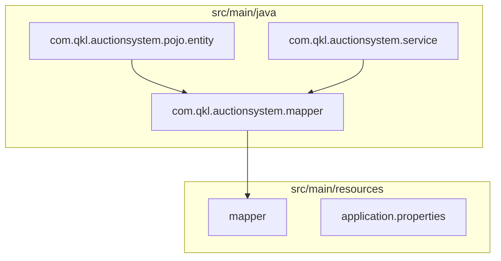
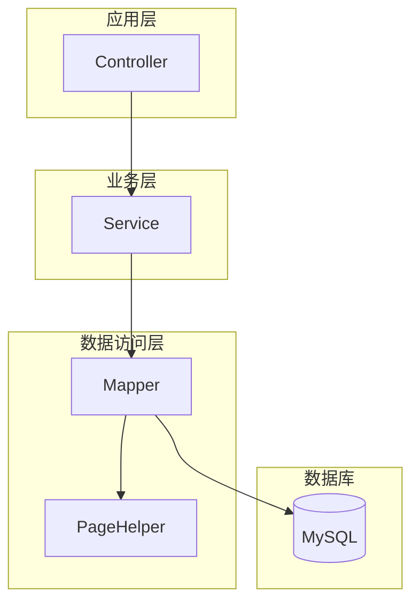
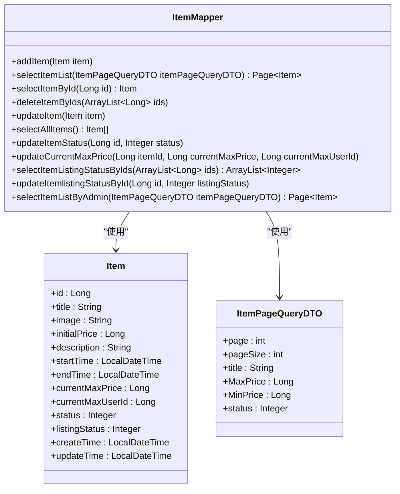
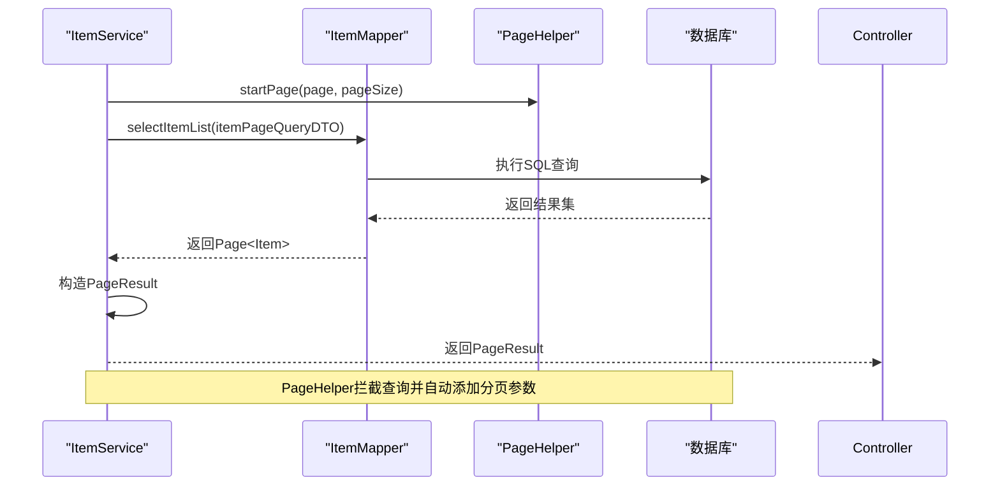
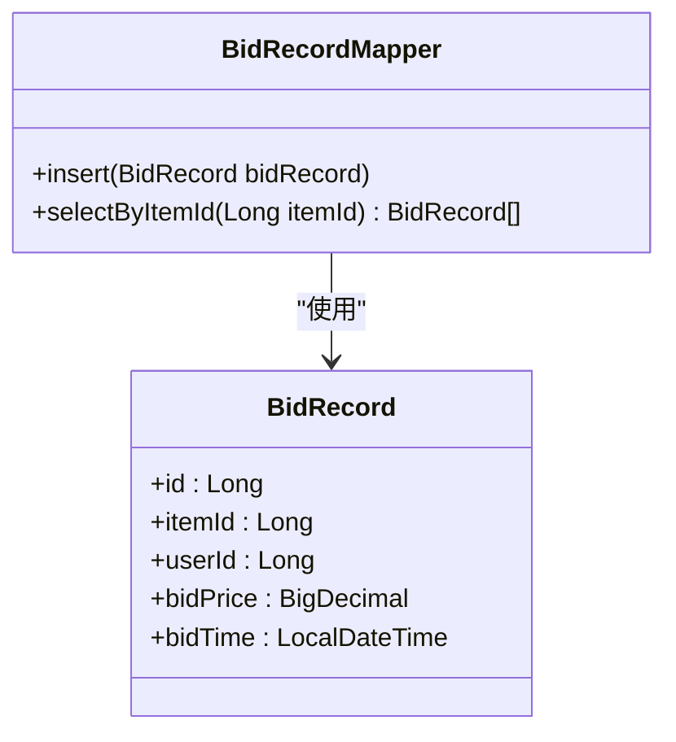
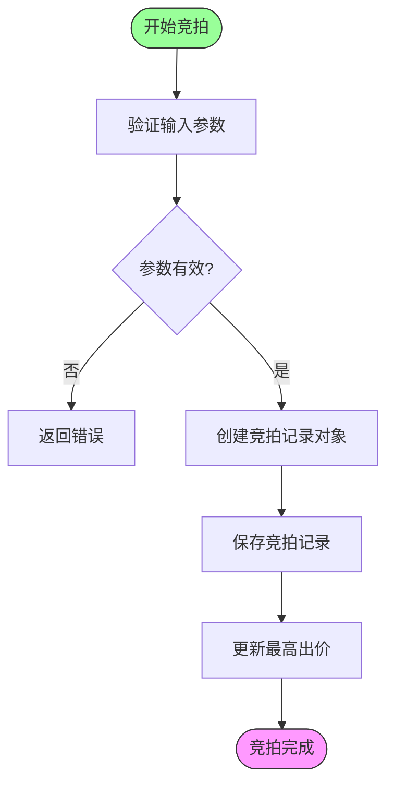
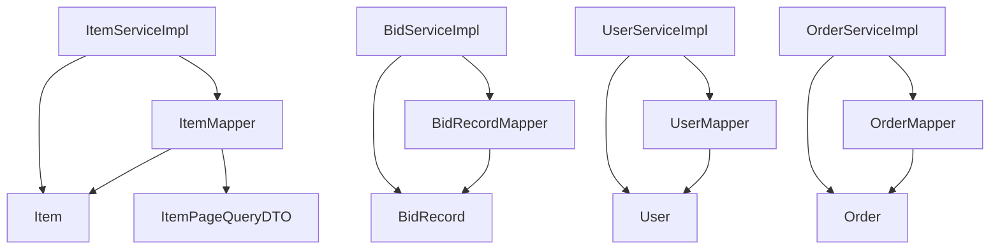

# Mapper层设计

<cite>
**本文档引用的文件**
- [ItemMapper.java](file://src/main/java/com/qkl/auctionsystem/mapper/ItemMapper.java)
- [BidRecordMapper.java](file://src/main/java/com/qkl/auctionsystem/mapper/BidRecordMapper.java)
- [ItemMapper.xml](file://src/main/resources/mapper/ItemMapper.xml)
- [BidRecordMapper.java](file://src/main/java/com/qkl/auctionsystem/mapper/BidRecordMapper.java)
- [application.properties](file://src/main/resources/application.properties)
- [PageResult.java](file://src/main/java/com/qkl/auctionsystem/result/PageResult.java)
- [Item.java](file://src/main/java/com/qkl/auctionsystem/pojo/entity/Item.java)
- [BidRecord.java](file://src/main/java/com/qkl/auctionsystem/pojo/entity/BidRecord.java)
- [ItemPageQueryDTO.java](file://src/main/java/com/qkl/auctionsystem/pojo/dto/ItemPageQueryDTO.java)
- [pom.xml](file://pom.xml)
- [ItemServiceImpl.java](file://src/main/java/com/qkl/auctionsystem/service/impl/ItemServiceImpl.java)
- [BidServiceImpl.java](file://src/main/java/com/qkl/auctionsystem/service/impl/BidServiceImpl.java)
</cite>

## 目录
1. [引言](#引言)
2. [项目结构](#项目结构)
3. [核心组件](#核心组件)
4. [架构概述](#架构概述)
5. [详细组件分析](#详细组件分析)
6. [依赖分析](#依赖分析)
7. [性能考虑](#性能考虑)
8. [故障排除指南](#故障排除指南)
9. [结论](#结论)

## 引言
本文档全面阐述了拍卖系统中Mapper层的设计与实现，重点聚焦于MyBatis框架在项目中的实际应用。文档详细说明了Java接口与XML映射文件的绑定机制，@Mapper注解如何启用接口扫描，以及XML中<select>、<insert>等标签的使用规范。通过分析ItemMapper中的分页查询SQL和BidRecordMapper中的最新出价查询语句，深入探讨了复杂查询的实现方式。同时，文档解释了PageHelper分页插件如何与Mapper方法协同工作以返回PageResult对象，并提供了动态SQL（如<where>、<if>）在条件查询中的应用实例。最后，文档阐述了数据库字段与Java实体类（如Item、BidRecord）之间的属性映射关系及驼峰命名自动转换机制。

## 项目结构
本项目采用典型的Spring Boot分层架构，Mapper层位于`src/main/java/com/qkl/auctionsystem/mapper`包中，包含多个数据访问接口。每个Mapper接口对应一个XML映射文件，位于`src/main/resources/mapper`目录下。这种结构实现了数据访问逻辑与业务逻辑的分离，提高了代码的可维护性和可测试性。

**图示来源**
- [ItemMapper.java](file://src/main/java/com/qkl/auctionsystem/mapper/ItemMapper.java)
- [ItemMapper.xml](file://src/main/resources/mapper/ItemMapper.xml)
- [Item.java](file://src/main/java/com/qkl/auctionsystem/pojo/entity/Item.java)

**本节来源**
- [ItemMapper.java](file://src/main/java/com/qkl/auctionsystem/mapper/ItemMapper.java)
- [ItemMapper.xml](file://src/main/resources/mapper/ItemMapper.xml)

## 核心组件
Mapper层的核心组件包括ItemMapper、BidRecordMapper、UserMapper和OrderMapper四个接口，分别负责拍品、竞拍记录、用户和订单的数据访问操作。这些接口通过MyBatis框架与数据库进行交互，实现了数据的增删改查功能。其中，ItemMapper和BidRecordMapper是本系统中最复杂的两个Mapper，包含了分页查询、动态SQL和复杂条件查询等高级功能。

**本节来源**
- [ItemMapper.java](file://src/main/java/com/qkl/auctionsystem/mapper/ItemMapper.java)
- [BidRecordMapper.java](file://src/main/java/com/qkl/auctionsystem/mapper/BidRecordMapper.java)
- [UserMapper.java](file://src/main/java/com/qkl/auctionsystem/mapper/UserMapper.java)
- [OrderMapper.java](file://src/main/java/com/qkl/auctionsystem/mapper/OrderMapper.java)

## 架构概述
本系统的数据访问架构基于Spring Boot + MyBatis + PageHelper的技术栈。MyBatis作为持久层框架，通过XML配置文件或注解方式定义SQL语句，实现了Java对象与数据库记录的映射。PageHelper插件提供了强大的分页功能，简化了分页查询的实现。整个架构通过@Mapper注解自动扫描Mapper接口，由Spring容器管理其生命周期。

**图示来源**
- [pom.xml](file://pom.xml)
- [application.properties](file://src/main/resources/application.properties)
- [ItemServiceImpl.java](file://src/main/java/com/qkl/auctionsystem/service/impl/ItemServiceImpl.java)

## 详细组件分析

### ItemMapper分析
ItemMapper接口定义了拍品相关的所有数据访问方法，包括添加拍品、查询拍品列表、删除拍品等。该Mapper充分利用了MyBatis的动态SQL功能，通过<if>标签实现条件查询，通过<trim>标签智能处理SQL语句的逗号分隔问题。

#### 类图

**图示来源**
- [ItemMapper.java](file://src/main/java/com/qkl/auctionsystem/mapper/ItemMapper.java)
- [Item.java](file://src/main/java/com/qkl/auctionsystem/pojo/entity/Item.java)
- [ItemPageQueryDTO.java](file://src/main/java/com/qkl/auctionsystem/pojo/dto/ItemPageQueryDTO.java)

#### 分页查询流程

**图示来源**
- [ItemServiceImpl.java](file://src/main/java/com/qkl/auctionsystem/service/impl/ItemServiceImpl.java)
- [ItemMapper.java](file://src/main/java/com/qkl/auctionsystem/mapper/ItemMapper.java)
- [ItemMapper.xml](file://src/main/resources/mapper/ItemMapper.xml)

**本节来源**
- [ItemMapper.java](file://src/main/java/com/qkl/auctionsystem/mapper/ItemMapper.java)
- [ItemMapper.xml](file://src/main/resources/mapper/ItemMapper.xml)
- [ItemServiceImpl.java](file://src/main/java/com/qkl/auctionsystem/service/impl/ItemServiceImpl.java)

### BidRecordMapper分析
BidRecordMapper接口相对简单，主要负责竞拍记录的插入和查询操作。与ItemMapper不同，BidRecordMapper采用了注解方式定义SQL语句，展示了MyBatis的另一种使用方式。

#### 类图

**图示来源**
- [BidRecordMapper.java](file://src/main/java/com/qkl/auctionsystem/mapper/BidRecordMapper.java)
- [BidRecord.java](file://src/main/java/com/qkl/auctionsystem/pojo/entity/BidRecord.java)

#### 竞拍流程

**图示来源**
- [BidServiceImpl.java](file://src/main/java/com/qkl/auctionsystem/service/impl/BidServiceImpl.java)
- [BidRecordMapper.java](file://src/main/java/com/qkl/auctionsystem/mapper/BidRecordMapper.java)

**本节来源**
- [BidRecordMapper.java](file://src/main/java/com/qkl/auctionsystem/mapper/BidRecordMapper.java)
- [BidServiceImpl.java](file://src/main/java/com/qkl/auctionsystem/service/impl/BidServiceImpl.java)

## 依赖分析
Mapper层的依赖关系清晰明了，各Mapper接口独立负责特定实体的数据访问，通过Spring的依赖注入机制被Service层组件引用。这种设计遵循了单一职责原则，降低了组件间的耦合度。

**图示来源**
- [pom.xml](file://pom.xml)
- [ItemMapper.java](file://src/main/java/com/qkl/auctionsystem/mapper/ItemMapper.java)
- [BidRecordMapper.java](file://src/main/java/com/qkl/auctionsystem/mapper/BidRecordMapper.java)
- [ItemServiceImpl.java](file://src/main/java/com/qkl/auctionsystem/service/impl/ItemServiceImpl.java)
- [BidServiceImpl.java](file://src/main/java/com/qkl/auctionsystem/service/impl/BidServiceImpl.java)

**本节来源**
- [pom.xml](file://pom.xml)
- [ItemMapper.java](file://src/main/java/com/qkl/auctionsystem/mapper/ItemMapper.java)
- [BidRecordMapper.java](file://src/main/java/com/qkl/auctionsystem/mapper/BidRecordMapper.java)

## 性能考虑
在Mapper层的设计中，充分考虑了性能优化。通过使用PageHelper分页插件，避免了全表查询带来的性能问题。在SQL语句设计上，合理使用索引字段作为查询条件，如拍品标题的模糊查询和价格范围查询。同时，通过<set>标签实现的动态更新语句，只更新实际修改的字段，减少了数据库的I/O操作。

## 故障排除指南
当Mapper层出现问题时，可按照以下步骤进行排查：
1. 检查Mapper接口是否被@Mapper注解标记
2. 确认XML映射文件的namespace是否与Mapper接口的全限定名一致
3. 验证SQL语句中的参数名称是否与DTO或实体类的属性名匹配
4. 检查application.properties中mybatis.mapper-locations配置是否正确
5. 确认PageHelper插件是否已正确引入和配置

**本节来源**
- [application.properties](file://src/main/resources/application.properties)
- [pom.xml](file://pom.xml)
- [ItemMapper.java](file://src/main/java/com/qkl/auctionsystem/mapper/ItemMapper.java)
- [ItemMapper.xml](file://src/main/resources/mapper/ItemMapper.xml)

## 结论
本系统的Mapper层设计合理，充分利用了MyBatis框架的特性，实现了数据访问的灵活性和高效性。通过XML配置和注解两种方式的结合使用，既保证了复杂SQL的可读性，又简化了简单操作的实现。PageHelper分页插件的集成，极大地简化了分页功能的开发。整体设计遵循了良好的分层架构原则，为系统的稳定运行提供了坚实的基础。