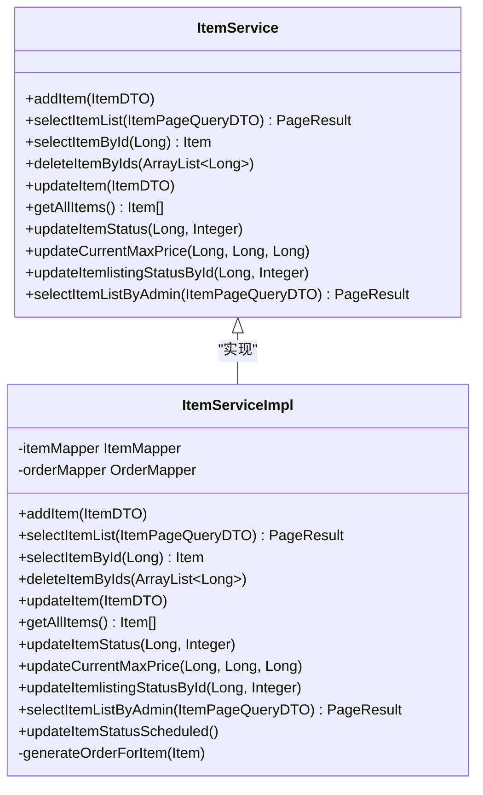
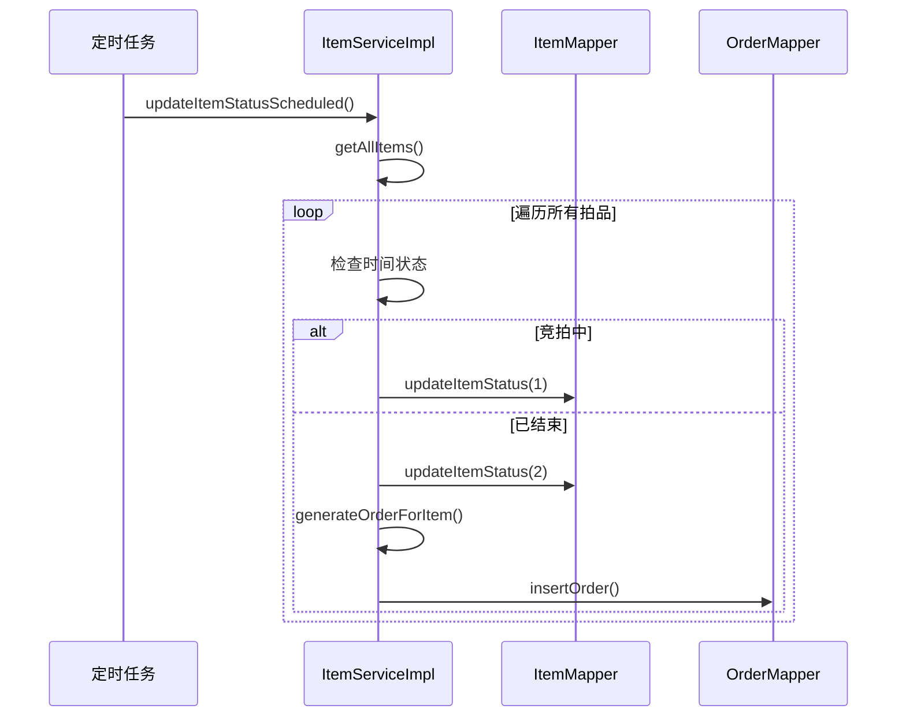
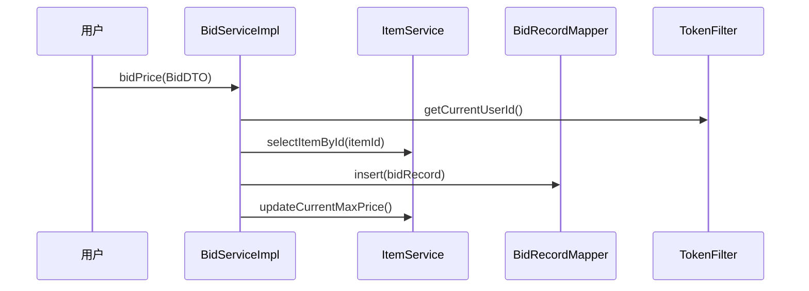
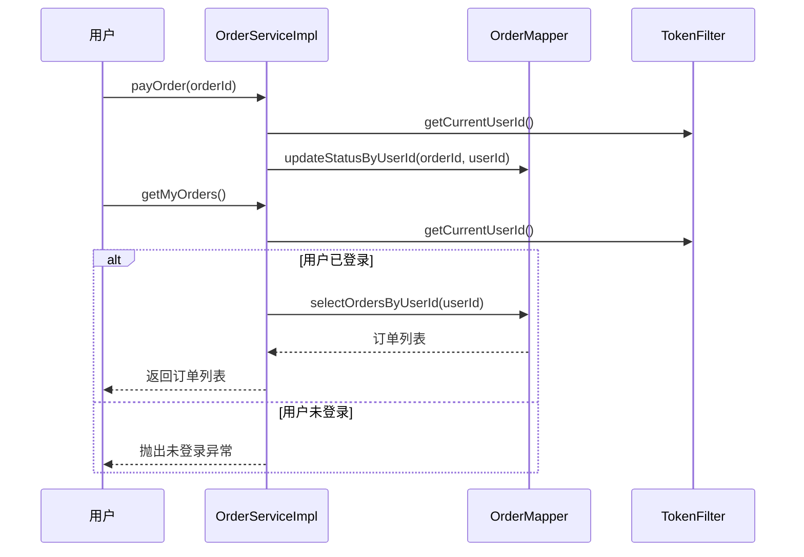
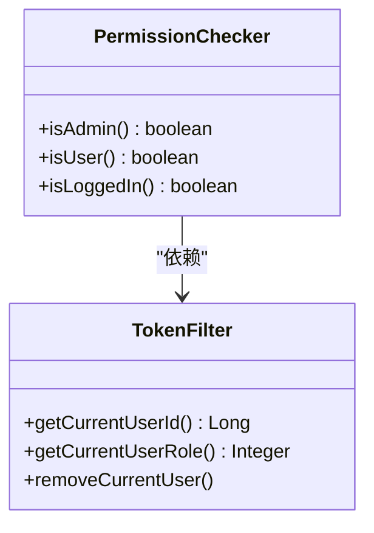
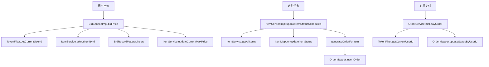

# Service层设计

<cite>
**本文档引用的文件**  
- [ItemServiceImpl.java](file://src/main/java/com/qkl/auctionsystem/service/impl/ItemServiceImpl.java)
- [BidServiceImpl.java](file://src/main/java/com/qkl/auctionsystem/service/impl/BidServiceImpl.java)
- [OrderServiceImpl.java](file://src/main/java/com/qkl/auctionsystem/service/impl/OrderServiceImpl.java)
- [ItemService.java](file://src/main/java/com/qkl/auctionsystem/service/ItemService.java)
- [BidService.java](file://src/main/java/com/qkl/auctionsystem/service/BidService.java)
- [OrderService.java](file://src/main/java/com/qkl/auctionsystem/service/OrderService.java)
- [PermissionChecker.java](file://src/main/java/com/qkl/auctionsystem/utils/PermissionChecker.java)
- [ItemMapper.java](file://src/main/java/com/qkl/auctionsystem/mapper/ItemMapper.java)
- [BidRecordMapper.java](file://src/main/java/com/qkl/auctionsystem/mapper/BidRecordMapper.java)
- [OrderMapper.java](file://src/main/java/com/qkl/auctionsystem/mapper/OrderMapper.java)
- [ItemController.java](file://src/main/java/com/qkl/auctionsystem/controller/ItemController.java)
- [TokenFilter.java](file://src/main/java/com/qkl/auctionsystem/filter/TokenFilter.java)
</cite>

## 目录
1. [引言](#引言)
2. [服务接口与实现分离设计](#服务接口与实现分离设计)
3. [ItemService实现分析](#itemservice实现分析)
4. [BidService实现分析](#bidservice实现分析)
5. [OrderService实现分析](#orderservice实现分析)
6. [事务管理与数据一致性](#事务管理与数据一致性)
7. [权限校验机制](#权限校验机制)
8. [定时任务与状态管理](#定时任务与状态管理)
9. [服务层调用流程图](#服务层调用流程图)
10. [总结](#总结)

## 引言
本文档深入分析拍卖系统中Service层的设计与实现，重点阐述业务逻辑的封装机制与服务接口抽象。文档详细说明了`ItemServiceImpl`如何实现拍品状态变更、竞拍时间校验、最高出价更新等核心逻辑，`BidServiceImpl`如何执行出价合法性检查与竞拍记录写入，以及`OrderServiceImpl`如何在定时任务触发时自动生成订单。结合Spring的`@Service`注解和事务管理机制，解释关键操作的数据一致性保障。同时，文档说明了接口与实现类分离的设计优势，以及`PermissionChecker`工具在Service层进行管理员权限校验的应用场景。

## 服务接口与实现分离设计
系统采用接口与实现分离的设计模式，将业务逻辑定义与具体实现解耦。每个服务都有对应的接口定义和实现类，这种设计具有以下优势：

- **降低耦合度**：控制器层通过接口调用服务，不依赖具体实现，便于替换和扩展
- **支持多态性**：可以为同一接口提供多种实现，满足不同业务场景
- **便于单元测试**：可以通过Mock实现接口进行测试，无需依赖具体实现
- **符合开闭原则**：对扩展开放，对修改关闭



**图表来源**  
- [ItemService.java](file://src/main/java/com/qkl/auctionsystem/service/ItemService.java)
- [ItemServiceImpl.java](file://src/main/java/com/qkl/auctionsystem/service/impl/ItemServiceImpl.java)

**本节来源**  
- [ItemService.java](file://src/main/java/com/qkl/auctionsystem/service/ItemService.java)
- [ItemServiceImpl.java](file://src/main/java/com/qkl/auctionsystem/service/impl/ItemServiceImpl.java)

## ItemService实现分析
`ItemServiceImpl`类实现了拍品管理的核心业务逻辑，包括拍品的增删改查、状态管理以及定时任务处理。

### 拍品状态管理
`ItemServiceImpl`通过`updateItemStatusScheduled`方法实现拍品状态的自动更新。该方法被配置为定时任务，每分钟执行一次，根据当前时间与拍品的开始时间和结束时间比较，自动更新拍品状态：

- **状态0**：未开始（当前时间 < 开始时间）
- **状态1**：竞拍中（开始时间 ≤ 当前时间 ≤ 结束时间）
- **状态2**：已结束（当前时间 > 结束时间）

当拍品状态变为"已结束"时，系统会自动调用`generateOrderForItem`方法为最高出价用户生成订单。

### 最高出价更新
`updateCurrentMaxPrice`方法用于更新拍品的最高出价信息。该方法接收拍品ID、最高出价金额和最高出价用户ID作为参数，通过`ItemMapper`更新数据库中的对应记录。此方法在用户出价成功后被调用，确保拍品信息的实时性。

### 拍品删除校验
在删除拍品前，`deleteItemByIds`方法会先检查拍品的上架状态。如果拍品已上架（listingStatus=1），则抛出异常阻止删除操作，确保业务规则的完整性。



**图表来源**  
- [ItemServiceImpl.java](file://src/main/java/com/qkl/auctionsystem/service/impl/ItemServiceImpl.java)
- [ItemMapper.java](file://src/main/java/com/qkl/auctionsystem/mapper/ItemMapper.java)
- [OrderMapper.java](file://src/main/java/com/qkl/auctionsystem/mapper/OrderMapper.java)

**本节来源**  
- [ItemServiceImpl.java](file://src/main/java/com/qkl/auctionsystem/service/impl/ItemServiceImpl.java)

## BidService实现分析
`BidServiceImpl`类负责处理用户出价相关的业务逻辑，确保出价过程的合法性和数据一致性。

### 出价流程
`bidPrice`方法实现了完整的出价流程：
1. 通过`TokenFilter.getCurrentUserId()`获取当前登录用户ID
2. 调用`ItemService.selectItemById()`获取拍品信息
3. 创建`BidRecord`竞拍记录对象
4. 调用`BidRecordMapper.insert()`将竞拍记录保存到数据库
5. 调用`ItemService.updateCurrentMaxPrice()`更新拍品的最高出价信息

### 异常处理
在出价过程中，系统使用try-catch块捕获可能的异常。如果数据库操作失败，会抛出运行时异常并包含详细的错误信息，便于问题排查。

### 竞拍记录查询
`getBidRecords`方法用于查询指定拍品的所有竞拍记录。该方法从数据库获取原始记录后，会将其转换为DTO对象，并将时间戳转换为毫秒值，便于前端展示。



**图表来源**  
- [BidServiceImpl.java](file://src/main/java/com/qkl/auctionsystem/service/impl/BidServiceImpl.java)
- [ItemService.java](file://src/main/java/com/qkl/auctionsystem/service/ItemService.java)
- [BidRecordMapper.java](file://src/main/java/com/qkl/auctionsystem/mapper/BidRecordMapper.java)

**本节来源**  
- [BidServiceImpl.java](file://src/main/java/com/qkl/auctionsystem/service/impl/BidServiceImpl.java)

## OrderService实现分析
`OrderServiceImpl`类负责订单相关的业务逻辑，包括订单支付和订单查询。

### 订单支付
`payOrder`方法处理订单支付逻辑。该方法接收订单ID作为参数，通过`TokenFilter.getCurrentUserId()`获取当前用户ID，然后调用`OrderMapper.updateStatusByUserId()`更新订单状态。这种设计确保了用户只能支付自己的订单，增强了系统的安全性。

### 订单查询
`getMyOrders`方法用于查询当前用户的订单列表。在查询前，方法会检查用户是否已登录，如果未登录则抛出异常。查询结果通过`OrderMapper.selectOrdersByUserId()`从数据库获取。



**图表来源**  
- [OrderServiceImpl.java](file://src/main/java/com/qkl/auctionsystem/service/impl/OrderServiceImpl.java)
- [OrderMapper.java](file://src/main/java/com/qkl/auctionsystem/mapper/OrderMapper.java)

**本节来源**  
- [OrderServiceImpl.java](file://src/main/java/com/qkl/auctionsystem/service/impl/OrderServiceImpl.java)

## 事务管理与数据一致性
系统通过Spring的声明式事务管理确保关键操作的数据一致性。虽然代码中未显式使用`@Transactional`注解，但以下操作通过业务逻辑设计保证了数据完整性：

1. **出价操作**：先保存竞拍记录，再更新最高出价。如果更新最高出价失败，整个操作会因异常而终止，保持数据一致性。
2. **订单生成**：在拍品状态更新为"已结束"后，立即生成订单。通过try-catch块捕获异常，确保订单生成失败时能记录错误日志。
3. **状态变更**：所有状态变更操作都通过Mapper接口直接更新数据库，确保状态的实时性和一致性。

对于需要强一致性的场景，建议在关键方法上添加`@Transactional`注解，将相关数据库操作纳入同一事务中。

**本节来源**  
- [ItemServiceImpl.java](file://src/main/java/com/qkl/auctionsystem/service/impl/ItemServiceImpl.java)
- [BidServiceImpl.java](file://src/main/java/com/qkl/auctionsystem/service/impl/BidServiceImpl.java)

## 权限校验机制
系统通过`PermissionChecker`工具类在Service层进行权限校验，确保只有授权用户才能执行特定操作。

### PermissionChecker设计
`PermissionChecker`是一个静态工具类，提供以下权限检查方法：
- `isAdmin()`：检查当前用户是否为管理员（role=0）
- `isUser()`：检查当前用户是否为普通用户（role=1）
- `isLoggedIn()`：检查用户是否已登录

这些方法通过`TokenFilter.getCurrentUserRole()`获取当前用户角色信息，实现权限判断。

### 权限校验应用
虽然`PermissionChecker`主要在控制器层使用，但其设计支持在Service层进行权限校验。例如，可以在`ItemServiceImpl`的敏感操作前添加权限检查：

```java
if (!PermissionChecker.isAdmin()) {
    throw new SecurityException("权限不足");
}
```

这种设计模式确保了业务逻辑层的安全性，防止未经授权的访问。



**图表来源**  
- [PermissionChecker.java](file://src/main/java/com/qkl/auctionsystem/utils/PermissionChecker.java)
- [TokenFilter.java](file://src/main/java/com/qkl/auctionsystem/filter/TokenFilter.java)

**本节来源**  
- [PermissionChecker.java](file://src/main/java/com/qkl/auctionsystem/utils/PermissionChecker.java)

## 定时任务与状态管理
系统通过Spring的定时任务功能实现拍品状态的自动管理。

### 定时任务配置
`updateItemStatusScheduled`方法使用`@Scheduled(cron = "0 * * * * ?")`注解，配置为每分钟执行一次。该任务负责检查所有拍品的状态，并根据时间规则自动更新。

### 状态转换逻辑
任务执行时，系统会：
1. 获取所有拍品列表
2. 遍历每个拍品，比较当前时间与拍品的开始时间和结束时间
3. 根据时间关系更新拍品状态
4. 当拍品状态变为"已结束"时，自动生成订单

这种设计避免了手动状态管理的繁琐，确保了拍品生命周期的自动化管理。

**本节来源**  
- [ItemServiceImpl.java](file://src/main/java/com/qkl/auctionsystem/service/impl/ItemServiceImpl.java)

## 服务层调用流程图
以下是系统核心业务流程的服务层调用关系：



**图表来源**  
- [BidServiceImpl.java](file://src/main/java/com/qkl/auctionsystem/service/impl/BidServiceImpl.java)
- [ItemServiceImpl.java](file://src/main/java/com/qkl/auctionsystem/service/impl/ItemServiceImpl.java)
- [OrderServiceImpl.java](file://src/main/java/com/qkl/auctionsystem/service/impl/OrderServiceImpl.java)

## 总结
本系统Service层设计体现了良好的分层架构和业务逻辑封装。通过接口与实现分离的设计模式，系统实现了高内聚、低耦合的架构目标。`ItemServiceImpl`、`BidServiceImpl`和`OrderServiceImpl`三个核心服务类分别负责拍品管理、出价处理和订单管理，职责清晰明确。

系统通过定时任务实现了拍品状态的自动化管理，确保了业务流程的顺畅执行。权限校验机制贯穿整个服务层，保障了系统的安全性。虽然当前事务管理较为基础，但通过合理的异常处理和业务逻辑设计，仍然保证了关键操作的数据一致性。

建议未来可以：
1. 在关键业务方法上添加`@Transactional`注解，增强数据一致性保障
2. 将`PermissionChecker`的权限校验更多地应用到Service层，增强业务逻辑的安全性
3. 考虑引入缓存机制，减少数据库查询压力，提高系统性能

整体而言，该Service层设计合理，业务逻辑清晰，为系统的稳定运行提供了坚实的基础。