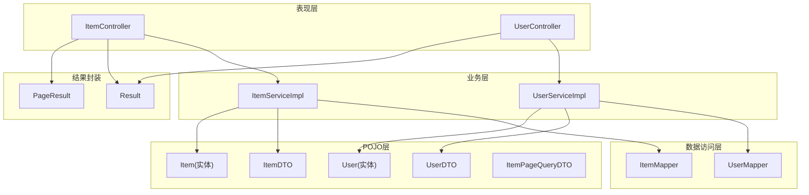
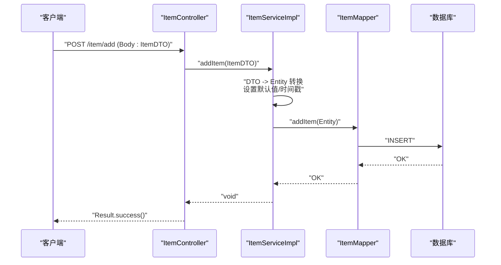
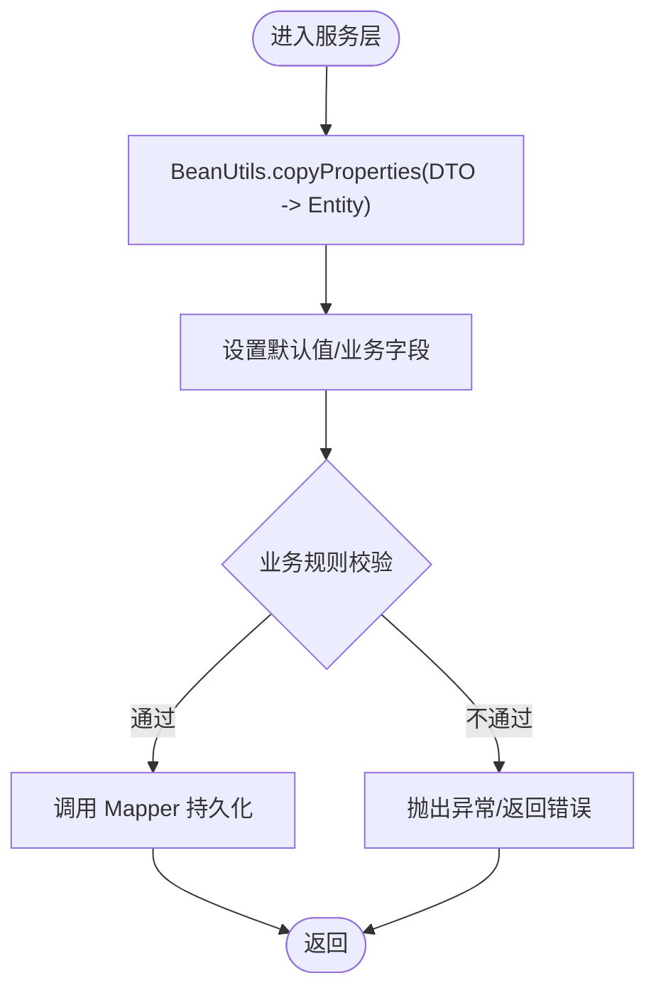
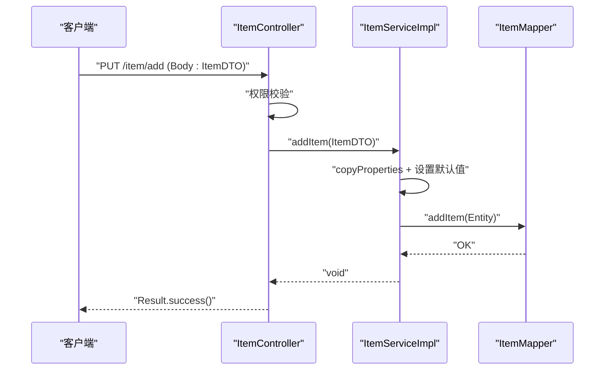
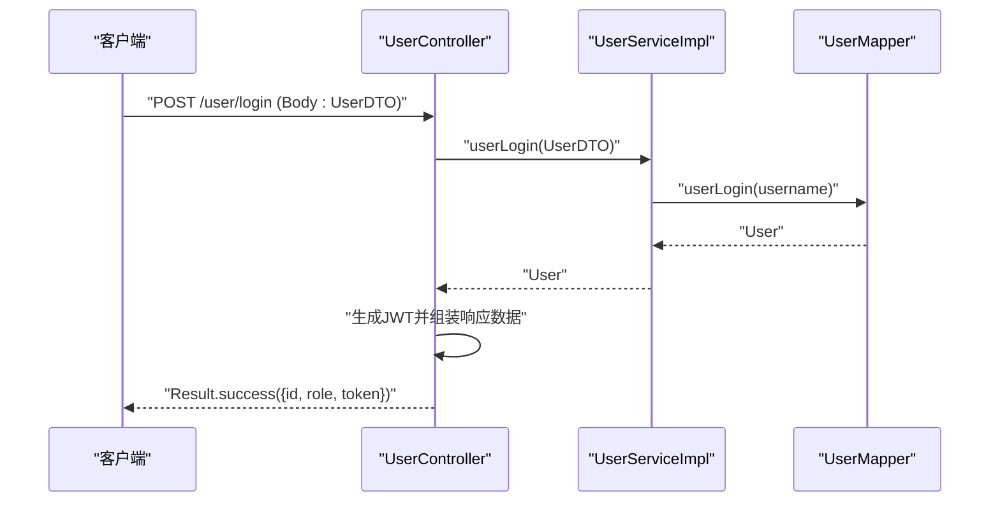
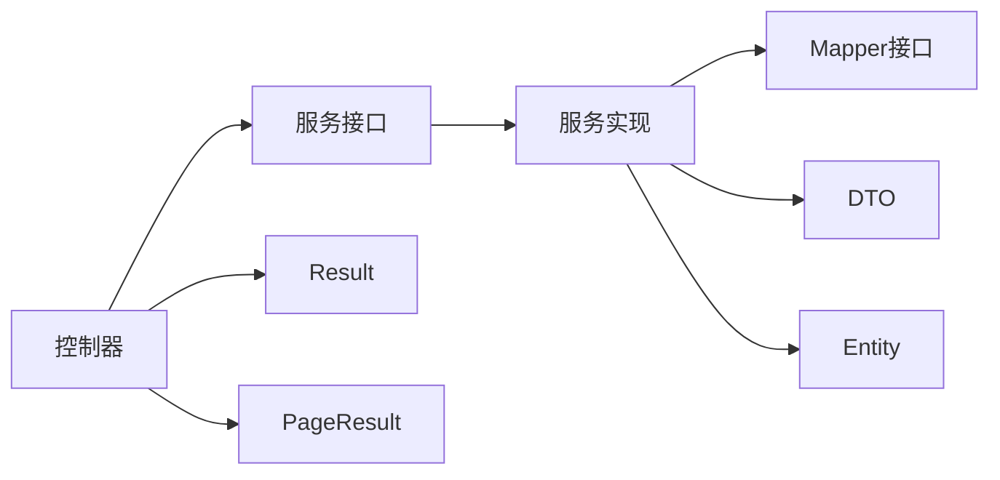

# 分层设计规范

<cite>
**本文引用的文件**
- [AuctionSystemApplication.java](file://src/main/java/com/qkl/auctionsystem/AuctionSystemApplication.java)
- [pom.xml](file://pom.xml)
- [ItemController.java](file://src/main/java/com/qkl/auctionsystem/controller/ItemController.java)
- [UserController.java](file://src/main/java/com/qkl/auctionsystem/controller/UserController.java)
- [ItemServiceImpl.java](file://src/main/java/com/qkl/auctionsystem/service/impl/ItemServiceImpl.java)
- [UserServiceImpl.java](file://src/main/java/com/qkl/auctionsystem/service/impl/UserServiceImpl.java)
- [UserMapper.java](file://src/main/java/com/qkl/auctionsystem/mapper/UserMapper.java)
- [ItemMapper.java](file://src/main/java/com/qkl/auctionsystem/mapper/ItemMapper.java)
- [User.java](file://src/main/java/com/qkl/auctionsystem/pojo/entity/User.java)
- [Item.java](file://src/main/java/com/qkl/auctionsystem/pojo/entity/Item.java)
- [UserDTO.java](file://src/main/java/com/qkl/auctionsystem/pojo/dto/UserDTO.java)
- [ItemDTO.java](file://src/main/java/com/qkl/auctionsystem/pojo/dto/ItemDTO.java)
- [ItemPageQueryDTO.java](file://src/main/java/com/qkl/auctionsystem/pojo/dto/ItemPageQueryDTO.java)
- [Result.java](file://src/main/java/com/qkl/auctionsystem/result/Result.java)
- [PageResult.java](file://src/main/java/com/qkl/auctionsystem/result/PageResult.java)
</cite>

## 目录
1. [引言](#引言)
2. [项目结构](#项目结构)
3. [核心组件](#核心组件)
4. [架构总览](#架构总览)
5. [详细组件分析](#详细组件分析)
6. [依赖关系分析](#依赖关系分析)
7. [性能考量](#性能考量)
8. [故障排查指南](#故障排查指南)
9. [结论](#结论)
10. [附录](#附录)

## 引言
本文件围绕拍卖系统项目的分层设计进行系统化梳理，重点阐释 POJO 层中实体（Entity）与数据传输对象（DTO）的职责边界：实体用于映射数据库表结构，DTO 用于接收前端参数或封装响应数据；同时说明统一响应包装类 Result 与分页结果 PageResult 的设计目标与使用方式，并通过 ItemDTO 与 UserDTO 在新增拍品与登录响应中的具体用法，展示 DTO 与 Entity 之间的转换逻辑与最佳实践。文档还总结了分层设计带来的优势（降低耦合、提升可测试性、支持接口版本兼容），并提供面向开发者的可视化流程图与参考路径，帮助快速定位实现细节。

## 项目结构
项目采用典型的后端分层架构：
- 控制器层（Controller）：对外暴露 REST 接口，负责请求参数接收、鉴权与统一响应包装。
- 业务服务层（Service）：编排领域逻辑，负责 DTO 与 Entity 的转换、业务规则校验与调用 Mapper。
- 数据访问层（Mapper）：基于 MyBatis 执行 SQL，与数据库交互。
- POJO 层（POJO）：包含实体（entity）与数据传输对象（dto），分别承担持久化与传输职责。
- 结果封装层（result）：统一返回格式（Result）与分页结果（PageResult）。
- 应用入口与配置：Spring Boot 启动类与 Maven 依赖管理。

图表来源
- [ItemController.java](file://src/main/java/com/qkl/auctionsystem/controller/ItemController.java#L1-L86)
- [UserController.java](file://src/main/java/com/qkl/auctionsystem/controller/UserController.java#L1-L49)
- [ItemServiceImpl.java](file://src/main/java/com/qkl/auctionsystem/service/impl/ItemServiceImpl.java#L1-L182)
- [UserServiceImpl.java](file://src/main/java/com/qkl/auctionsystem/service/impl/UserServiceImpl.java#L1-L59)
- [ItemMapper.java](file://src/main/java/com/qkl/auctionsystem/mapper/ItemMapper.java#L1-L200)
- [UserMapper.java](file://src/main/java/com/qkl/auctionsystem/mapper/UserMapper.java#L1-L13)
- [Item.java](file://src/main/java/com/qkl/auctionsystem/pojo/entity/Item.java#L1-L34)
- [User.java](file://src/main/java/com/qkl/auctionsystem/pojo/entity/User.java#L1-L26)
- [ItemDTO.java](file://src/main/java/com/qkl/auctionsystem/pojo/dto/ItemDTO.java#L1-L16)
- [UserDTO.java](file://src/main/java/com/qkl/auctionsystem/pojo/dto/UserDTO.java#L1-L12)
- [ItemPageQueryDTO.java](file://src/main/java/com/qkl/auctionsystem/pojo/dto/ItemPageQueryDTO.java#L1-L19)
- [Result.java](file://src/main/java/com/qkl/auctionsystem/result/Result.java#L1-L39)
- [PageResult.java](file://src/main/java/com/qkl/auctionsystem/result/PageResult.java#L1-L23)

章节来源
- [AuctionSystemApplication.java](file://src/main/java/com/qkl/auctionsystem/AuctionSystemApplication.java#L1-L18)
- [pom.xml](file://pom.xml#L1-L129)

## 核心组件
- 实体（Entity）：承载数据库字段与序列化格式控制，例如用户与拍品实体均包含基础字段与时间格式化注解，用于持久化与 JSON 序列化的一致性。
- DTO：面向接口契约的数据载体，例如用户登录/注册 DTO 仅包含必要字段，拍品新增/更新 DTO 包含拍品相关字段；分页查询 DTO 提供分页与筛选条件。
- 统一响应（Result）：提供成功/失败的统一返回结构，约定 code、msg、data 字段，便于前端统一处理。
- 分页结果（PageResult）：封装 total 与 records，简化分页查询的响应结构。

章节来源
- [User.java](file://src/main/java/com/qkl/auctionsystem/pojo/entity/User.java#L1-L26)
- [Item.java](file://src/main/java/com/qkl/auctionsystem/pojo/entity/Item.java#L1-L34)
- [UserDTO.java](file://src/main/java/com/qkl/auctionsystem/pojo/dto/UserDTO.java#L1-L12)
- [ItemDTO.java](file://src/main/java/com/qkl/auctionsystem/pojo/dto/ItemDTO.java#L1-L16)
- [ItemPageQueryDTO.java](file://src/main/java/com/qkl/auctionsystem/pojo/dto/ItemPageQueryDTO.java#L1-L19)
- [Result.java](file://src/main/java/com/qkl/auctionsystem/result/Result.java#L1-L39)
- [PageResult.java](file://src/main/java/com/qkl/auctionsystem/result/PageResult.java#L1-L23)

## 架构总览
从控制器到服务再到 Mapper 的调用链路清晰，遵循“控制器只负责参数接收与统一返回”的原则；服务层负责 DTO 与 Entity 的转换、业务规则校验与调用 Mapper；Mapper 负责与数据库交互。统一响应 Result 与 PageResult 保证前后端交互的一致性。

图表来源
- [ItemController.java](file://src/main/java/com/qkl/auctionsystem/controller/ItemController.java#L24-L34)
- [ItemServiceImpl.java](file://src/main/java/com/qkl/auctionsystem/service/impl/ItemServiceImpl.java#L33-L43)
- [ItemMapper.java](file://src/main/java/com/qkl/auctionsystem/mapper/ItemMapper.java#L1-L200)
- [Result.java](file://src/main/java/com/qkl/auctionsystem/result/Result.java#L1-L39)

## 详细组件分析

### POJO 层：实体与 DTO 的职责划分
- 实体（Entity）
  - 用于映射数据库表结构，包含持久化所需字段与时间格式化策略，避免直接暴露给前端。
  - 示例：用户实体包含 id、用户名、密码、角色与创建/更新时间等字段；拍品实体包含标题、图片、起始/结束时间、状态、上架状态等。
- DTO
  - 用于接收前端参数或封装响应数据，字段按接口契约最小化设计，避免泄露敏感信息。
  - 示例：用户登录/注册 DTO 仅包含用户名与密码；拍品新增/更新 DTO 包含标题、图片、起始/结束时间、初始价格等；分页查询 DTO 包含页码、页大小与筛选条件。

章节来源
- [User.java](file://src/main/java/com/qkl/auctionsystem/pojo/entity/User.java#L1-L26)
- [Item.java](file://src/main/java/com/qkl/auctionsystem/pojo/entity/Item.java#L1-L34)
- [UserDTO.java](file://src/main/java/com/qkl/auctionsystem/pojo/dto/UserDTO.java#L1-L12)
- [ItemDTO.java](file://src/main/java/com/qkl/auctionsystem/pojo/dto/ItemDTO.java#L1-L16)
- [ItemPageQueryDTO.java](file://src/main/java/com/qkl/auctionsystem/pojo/dto/ItemPageQueryDTO.java#L1-L19)

### 统一响应格式：Result 与 PageResult
- Result
  - 统一返回结构，包含 code、msg、data；提供 success()/success(T)/error(String) 便捷方法，确保前后端交互一致。
- PageResult
  - 分页结果封装，包含 total 与 records，简化分页查询响应结构。

章节来源
- [Result.java](file://src/main/java/com/qkl/auctionsystem/result/Result.java#L1-L39)
- [PageResult.java](file://src/main/java/com/qkl/auctionsystem/result/PageResult.java#L1-L23)

### DTO 与 Entity 的转换逻辑
- 转换策略
  - 使用 BeanUtils.copyProperties 进行字段复制，减少样板代码。
  - 在服务层设置默认值（如拍品状态、上架状态、时间戳）与业务规则（如拍品上架状态下禁止修改）。
- 典型场景
  - 新增拍品：ItemController 接收 ItemDTO，ItemServiceImpl 转换为 Item 并设置默认值后调用 Mapper。
  - 用户注册：UserServiceImpl 将 UserDTO 复制为 User，设置角色与时间戳后调用 Mapper。
  - 登录响应：UserController 调用 UserService 返回 User 实体，组装包含 token、用户角色等信息的 Map，通过 Result.success 返回。

图表来源
- [ItemServiceImpl.java](file://src/main/java/com/qkl/auctionsystem/service/impl/ItemServiceImpl.java#L33-L43)
- [UserServiceImpl.java](file://src/main/java/com/qkl/auctionsystem/service/impl/UserServiceImpl.java#L18-L26)
- [UserMapper.java](file://src/main/java/com/qkl/auctionsystem/mapper/UserMapper.java#L1-L13)
- [ItemMapper.java](file://src/main/java/com/qkl/auctionsystem/mapper/ItemMapper.java#L1-L200)

章节来源
- [ItemServiceImpl.java](file://src/main/java/com/qkl/auctionsystem/service/impl/ItemServiceImpl.java#L33-L43)
- [UserServiceImpl.java](file://src/main/java/com/qkl/auctionsystem/service/impl/UserServiceImpl.java#L18-L26)

### 典型接口用例

#### ItemDTO 用于新增拍品接口的参数封装
- 控制器接收 ItemDTO，进行权限校验后调用服务层。
- 服务层将 ItemDTO 转换为 Item，设置默认状态与时间戳，再调用 Mapper 插入数据库。
- 返回 Result.success() 统一响应。

图表来源
- [ItemController.java](file://src/main/java/com/qkl/auctionsystem/controller/ItemController.java#L24-L34)
- [ItemServiceImpl.java](file://src/main/java/com/qkl/auctionsystem/service/impl/ItemServiceImpl.java#L33-L43)
- [Result.java](file://src/main/java/com/qkl/auctionsystem/result/Result.java#L1-L39)

章节来源
- [ItemController.java](file://src/main/java/com/qkl/auctionsystem/controller/ItemController.java#L24-L34)
- [ItemServiceImpl.java](file://src/main/java/com/qkl/auctionsystem/service/impl/ItemServiceImpl.java#L33-L43)

#### UserDTO 用于登录响应数据传输
- 控制器接收 UserDTO，调用服务层进行登录校验，返回 User 实体。
- 控制器生成 JWT 令牌，组装包含用户 ID、角色与 token 的 Map。
- 使用 Result.success(Map) 返回统一响应。

图表来源
- [UserController.java](file://src/main/java/com/qkl/auctionsystem/controller/UserController.java#L30-L49)
- [UserServiceImpl.java](file://src/main/java/com/qkl/auctionsystem/service/impl/UserServiceImpl.java#L28-L40)
- [UserMapper.java](file://src/main/java/com/qkl/auctionsystem/mapper/UserMapper.java#L1-L13)
- [Result.java](file://src/main/java/com/qkl/auctionsystem/result/Result.java#L1-L39)

章节来源
- [UserController.java](file://src/main/java/com/qkl/auctionsystem/controller/UserController.java#L30-L49)
- [UserServiceImpl.java](file://src/main/java/com/qkl/auctionsystem/service/impl/UserServiceImpl.java#L28-L40)

### 分层设计的优势
- 降低耦合
  - 控制器仅依赖服务接口，服务仅依赖 Mapper 接口，实体与 DTO 作为数据载体隔离于业务逻辑之外。
- 提升可测试性
  - 通过接口抽象与依赖注入，便于单元测试替换实现与 Mock 数据。
- 支持接口版本兼容
  - DTO 可独立演进，不影响实体与 Mapper 的内部实现；Result 与 PageResult 统一返回结构，便于前端适配。

章节来源
- [ItemController.java](file://src/main/java/com/qkl/auctionsystem/controller/ItemController.java#L1-L86)
- [ItemServiceImpl.java](file://src/main/java/com/qkl/auctionsystem/service/impl/ItemServiceImpl.java#L1-L182)
- [UserServiceImpl.java](file://src/main/java/com/qkl/auctionsystem/service/impl/UserServiceImpl.java#L1-L59)
- [Result.java](file://src/main/java/com/qkl/auctionsystem/result/Result.java#L1-L39)
- [PageResult.java](file://src/main/java/com/qkl/auctionsystem/result/PageResult.java#L1-L23)

## 依赖关系分析
- 控制器依赖服务接口，服务实现依赖 Mapper 接口与 POJO（DTO/Entity）。
- 统一响应 Result 与 PageResult 被控制器广泛使用，形成一致的返回风格。
- Spring Boot 启动类启用调度与 Servlet 组件扫描，支撑定时任务与过滤器等能力。

图表来源
- [ItemController.java](file://src/main/java/com/qkl/auctionsystem/controller/ItemController.java#L1-L86)
- [UserController.java](file://src/main/java/com/qkl/auctionsystem/controller/UserController.java#L1-L49)
- [ItemServiceImpl.java](file://src/main/java/com/qkl/auctionsystem/service/impl/ItemServiceImpl.java#L1-L182)
- [UserServiceImpl.java](file://src/main/java/com/qkl/auctionsystem/service/impl/UserServiceImpl.java#L1-L59)
- [Result.java](file://src/main/java/com/qkl/auctionsystem/result/Result.java#L1-L39)
- [PageResult.java](file://src/main/java/com/qkl/auctionsystem/result/PageResult.java#L1-L23)

章节来源
- [AuctionSystemApplication.java](file://src/main/java/com/qkl/auctionsystem/AuctionSystemApplication.java#L1-L18)
- [pom.xml](file://pom.xml#L1-L129)

## 性能考量
- DTO/Entity 转换成本低，建议在服务层集中处理，避免在 Mapper 层重复转换。
- 分页查询使用 PageHelper，注意合理设置页码与页大小，避免超大分页导致数据库压力。
- 统一响应 Result 与 PageResult 仅做结构封装，不引入额外计算开销。
- 定时任务按分钟级执行拍品状态更新，建议结合数据库索引优化查询性能。

## 故障排查指南
- 登录失败
  - 检查用户名是否存在与密码是否匹配；确认服务层异常抛出与控制器返回的错误信息。
- 权限不足
  - 检查控制器中权限校验逻辑与返回的错误响应。
- 拍品状态异常
  - 检查定时任务是否正确触发，以及状态更新逻辑与订单生成分支。
- 响应格式不一致
  - 确认控制器是否使用 Result.success()/error() 与 PageResult 封装。

章节来源
- [UserServiceImpl.java](file://src/main/java/com/qkl/auctionsystem/service/impl/UserServiceImpl.java#L28-L57)
- [ItemController.java](file://src/main/java/com/qkl/auctionsystem/controller/ItemController.java#L24-L34)
- [ItemServiceImpl.java](file://src/main/java/com/qkl/auctionsystem/service/impl/ItemServiceImpl.java#L108-L182)
- [Result.java](file://src/main/java/com/qkl/auctionsystem/result/Result.java#L1-L39)

## 结论
本项目通过清晰的分层设计与严格的 POJO 层职责划分，实现了前后端交互的一致性与可维护性。DTO 与 Entity 的分离使接口契约与持久化模型解耦，Result 与 PageResult 的统一返回结构提升了前端处理效率。服务层集中处理 DTO/Entity 转换与业务规则，既降低了耦合又增强了可测试性，为后续接口版本演进与功能扩展提供了良好基础。

## 附录
- 关键实现参考路径
  - 新增拍品：[ItemController.java](file://src/main/java/com/qkl/auctionsystem/controller/ItemController.java#L24-L34)、[ItemServiceImpl.java](file://src/main/java/com/qkl/auctionsystem/service/impl/ItemServiceImpl.java#L33-L43)
  - 用户登录响应：[UserController.java](file://src/main/java/com/qkl/auctionsystem/controller/UserController.java#L30-L49)、[UserServiceImpl.java](file://src/main/java/com/qkl/auctionsystem/service/impl/UserServiceImpl.java#L28-L40)
  - 统一响应：[Result.java](file://src/main/java/com/qkl/auctionsystem/result/Result.java#L1-L39)、[PageResult.java](file://src/main/java/com/qkl/auctionsystem/result/PageResult.java#L1-L23)
  - DTO/Entity 转换：[ItemServiceImpl.java](file://src/main/java/com/qkl/auctionsystem/service/impl/ItemServiceImpl.java#L33-L43)、[UserServiceImpl.java](file://src/main/java/com/qkl/auctionsystem/service/impl/UserServiceImpl.java#L18-L26)