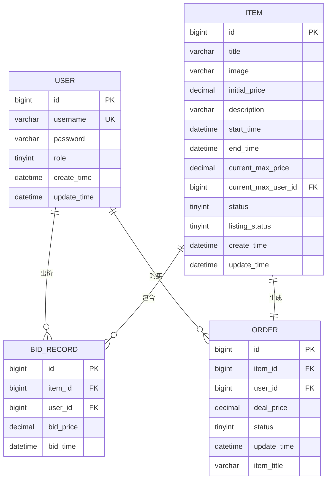
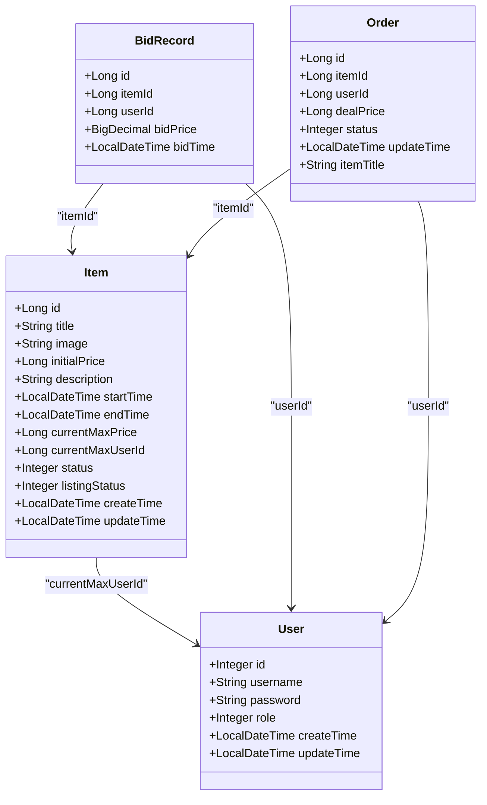

# 实体模型

<cite>
**本文档引用的文件**  
- [User.java](file://src/main/java/com/qkl/auctionsystem/pojo/entity/User.java)
- [Item.java](file://src/main/java/com/qkl/auctionsystem/pojo/entity/Item.java)
- [BidRecord.java](file://src/main/java/com/qkl/auctionsystem/pojo/entity/BidRecord.java)
- [Order.java](file://src/main/java/com/qkl/auctionsystem/pojo/entity/Order.java)
- [ItemMapper.xml](file://src/main/resources/mapper/ItemMapper.xml)
- [OrderMapper.xml](file://src/main/resources/mapper/OrderMapper.xml)
- [UserMapper.xml](file://src/main/resources/mapper/UserMapper.xml)
- [auction_database.sql](file://auction_database.sql)
</cite>

## 目录
1. [引言](#引言)
2. [实体模型概述](#实体模型概述)
3. [核心实体类详解](#核心实体类详解)
4. [实体与数据库表映射关系](#实体与数据库表映射关系)
5. [MyBatis映射文件与字段对应示例](#mybatis映射文件与字段对应示例)
6. [Lombok注解使用说明](#lombok注解使用说明)
7. [实体设计原则](#实体设计原则)
8. [实体间关系分析](#实体间关系分析)
9. [结论](#结论)

## 引言
本文档详细说明拍卖系统中POJO层的实体模型（Entity），重点阐述各实体类与数据库表的映射关系、字段含义及其在MVC架构中的角色。通过分析User、Item、BidRecord、Order等核心实体，揭示其属性定义、业务语义及相互关联，并结合MyBatis映射配置和Lombok注解使用方式，全面展示实体层的设计与实现。

## 实体模型概述
实体模型（Entity）是系统中用于表示持久化数据的核心Java类，直接映射数据库表结构，承担数据载体的角色。它们位于`com.qkl.auctionsystem.pojo.entity`包下，作为MyBatis操作数据库的基本单位，在Service层与Mapper层之间传递数据。实体类不直接暴露给前端，而是通过DTO进行转换，确保接口安全与解耦。

**Section sources**  
- [User.java](file://src/main/java/com/qkl/auctionsystem/pojo/entity/User.java)
- [Item.java](file://src/main/java/com/qkl/auctionsystem/pojo/entity/Item.java)

## 核心实体类详解

### User实体
`User`类表示系统用户，包含用户基本信息：
- `id`：用户唯一标识
- `username`：用户名，用于登录
- `password`：加密后的密码
- `role`：角色标识（0管理员，1普通用户）
- `createTime`/`updateTime`：创建与更新时间

该实体对应数据库`user`表，是用户认证与权限控制的基础。

### Item实体
`Item`类表示拍卖商品，关键字段包括：
- `id`：拍品ID
- `title`：拍品名称
- `image`：图片URL
- `initialPrice`：起拍价
- `description`：描述信息
- `startTime`/`endTime`：拍卖起止时间
- `currentMaxPrice`/`currentMaxUserId`：当前最高出价及用户
- `status`：拍卖状态（0未开始，1竞拍中，2已结束）
- `listingStatus`：上架状态（0下架，1上架）

此实体是拍卖业务的核心，驱动竞拍流程。

### BidRecord实体
`BidRecord`类记录每次出价行为：
- `id`：记录ID
- `itemId`：关联拍品
- `userId`：出价用户
- `bidPrice`：出价金额
- `bidTime`：出价时间

每条记录代表一次有效的出价操作，构成拍卖历史。

### Order实体
`Order`类表示拍卖成功后的交易订单：
- `id`：订单ID
- `itemId`：关联拍品
- `userId`：买家ID
- `dealPrice`：成交价
- `status`：订单状态（0待付款，1已完成）
- `updateTime`：更新时间
- `itemTitle`：拍品名称（冗余字段，便于前端展示）

订单在拍卖结束后由系统自动生成。

**Section sources**  
- [User.java](file://src/main/java/com/qkl/auctionsystem/pojo/entity/User.java#L1-L26)
- [Item.java](file://src/main/java/com/qkl/auctionsystem/pojo/entity/Item.java#L1-L34)
- [BidRecord.java](file://src/main/java/com/qkl/auctionsystem/pojo/entity/BidRecord.java#L1-L19)
- [Order.java](file://src/main/java/com/qkl/auctionsystem/pojo/entity/Order.java#L1-L24)

## 实体与数据库表映射关系
实体类通过字段名与数据库列名一一对应，遵循驼峰命名转下划线的默认规则。例如：
- `User` → `user`表
- `Item` → `auction_item`表
- `BidRecord` → `auction_record`表
- `Order` → `auction_order`表

所有实体均无显式使用`@TableName`等注解，依赖MyBatis默认映射策略完成表名匹配。



**Diagram sources**  
- [User.java](file://src/main/java/com/qkl/auctionsystem/pojo/entity/User.java)
- [Item.java](file://src/main/java/com/qkl/auctionsystem/pojo/entity/Item.java)
- [BidRecord.java](file://src/main/java/com/qkl/auctionsystem/pojo/entity/BidRecord.java)
- [Order.java](file://src/main/java/com/qkl/auctionsystem/pojo/entity/Order.java)
- [auction_database.sql](file://auction_database.sql)

## MyBatis映射文件与字段对应示例
以`ItemMapper.xml`为例，`addItem`操作展示了实体字段与SQL语句的映射：

```xml
<insert id="addItem">
    insert into auction_item
    <trim prefix="(" suffix=")" suffixOverrides=",">
        <if test="id != null">id,</if>
        <if test="title != null">title,</if>
        <if test="image != null">image,</if>
        <if test="initialPrice != null">initial_price,</if>
        ...
    </trim>
    values
    <trim prefix="(" suffix=")" suffixOverrides=",">
        <if test="id != null">#{id},</if>
        <if test="title != null">#{title},</if>
        <if test="image != null">#{image},</if>
        <if test="initialPrice != null">#{initialPrice},</if>
        ...
    </trim>
</insert>
```

其中`initialPrice`字段映射为数据库列`initial_price`，体现了驼峰到下划线的自动转换。类似地，`OrderMapper.xml`中的查询语句通过`AS`关键字将`i.title`映射为`itemTitle`字段。

**Section sources**  
- [ItemMapper.xml](file://src/main/resources/mapper/ItemMapper.xml#L6-L38)
- [OrderMapper.xml](file://src/main/resources/mapper/OrderMapper.xml#L10)

## Lombok注解使用说明
所有实体类均使用Lombok简化代码：
- `@Data`：自动生成getter、setter、toString、equals、hashCode
- `@NoArgsConstructor`：生成无参构造函数
- `@AllArgsConstructor`：生成全参构造函数
- `@Builder`：提供构建者模式支持（如User、Item、Order）

这些注解显著减少了样板代码，提升开发效率，同时保持类的可读性。

**Section sources**  
- [User.java](file://src/main/java/com/qkl/auctionsystem/pojo/entity/User.java#L11-L14)
- [Item.java](file://src/main/java/com/qkl/auctionsystem/pojo/entity/Item.java#L11-L14)

## 实体设计原则
1. **字段同步**：实体属性与数据库表结构严格一致，确保ORM正确映射。
2. **安全隔离**：不直接用于前端交互，通过DTO过滤敏感字段（如密码）。
3. **职责单一**：仅作为数据载体，不含业务逻辑。
4. **时间格式化**：使用`@JsonFormat`统一日期输出格式。
5. **避免暴露**：不暴露密码等敏感信息，由Service层处理加密。

这些原则保障了数据层的稳定性与安全性。

**Section sources**  
- [User.java](file://src/main/java/com/qkl/auctionsystem/pojo/entity/User.java#L21-L24)
- [Order.java](file://src/main/java/com/qkl/auctionsystem/pojo/entity/Order.java#L21)

## 实体间关系分析
实体间通过外键建立关联：
- **用户与拍品**：`Item.currentMaxUserId`指向`User.id`，表示当前最高出价者
- **拍品与竞拍记录**：`BidRecord.itemId`关联`Item.id`，形成一对多关系
- **竞拍成功与订单生成**：当拍卖结束，系统根据最高出价生成`Order`，关联`Item`与`User`

这些关系支撑了完整的拍卖业务流程。



**Diagram sources**  
- [User.java](file://src/main/java/com/qkl/auctionsystem/pojo/entity/User.java)
- [Item.java](file://src/main/java/com/qkl/auctionsystem/pojo/entity/Item.java)
- [BidRecord.java](file://src/main/java/com/qkl/auctionsystem/pojo/entity/BidRecord.java)
- [Order.java](file://src/main/java/com/qkl/auctionsystem/pojo/entity/Order.java)

## 结论
实体模型作为系统数据持久化的基石，精确映射数据库结构，承载核心业务数据。通过Lombok简化代码、MyBatis实现ORM映射，并遵循安全设计原则，确保了数据层的高效与可靠。各实体间的关联关系完整表达了拍卖业务逻辑，为上层服务提供了坚实的数据支持。