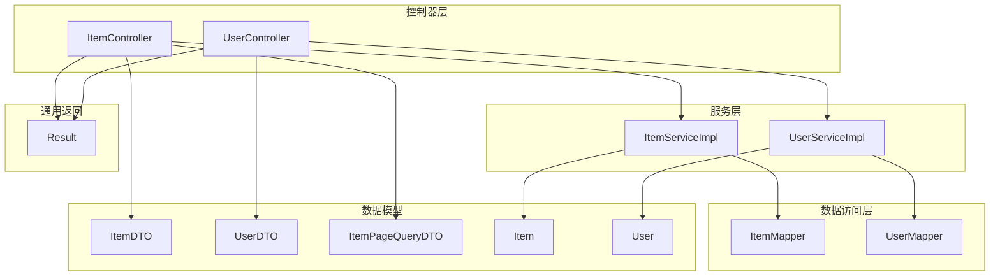
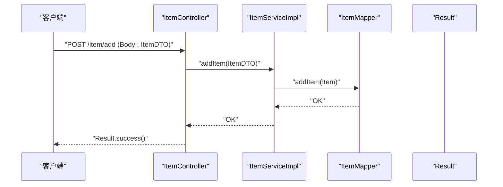
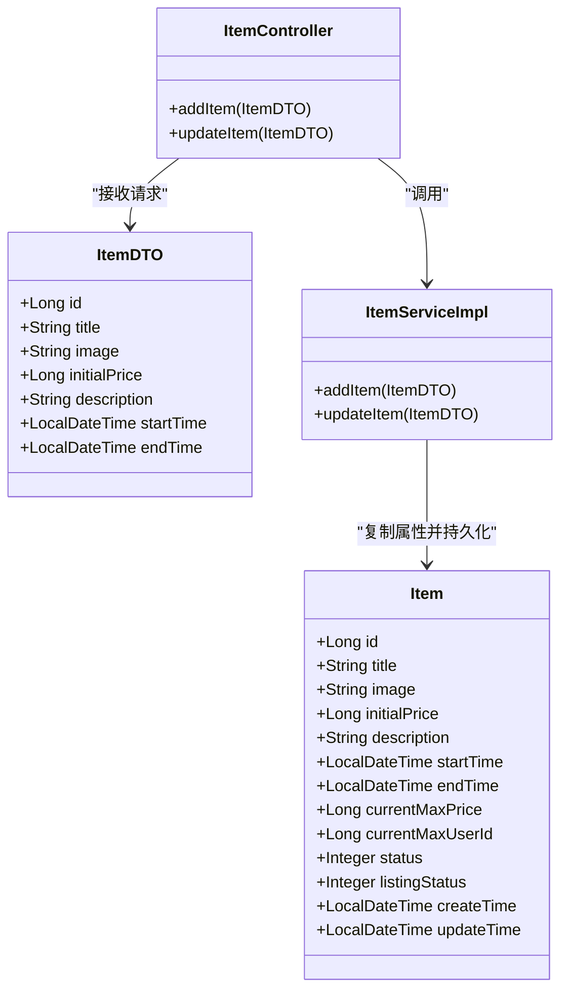
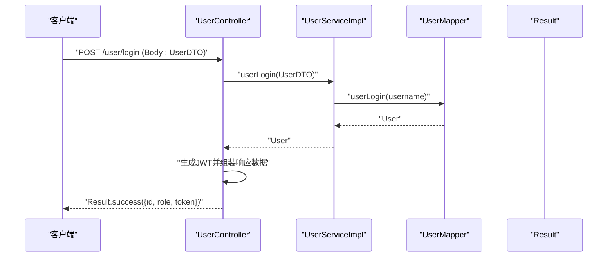
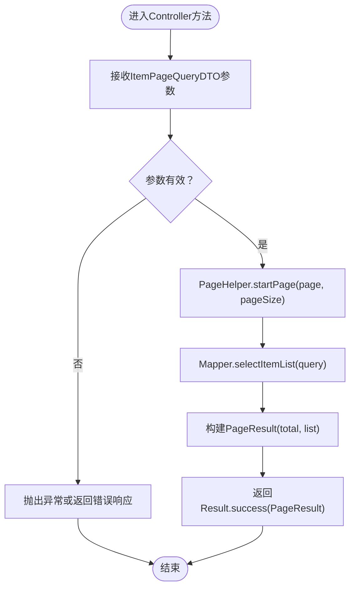
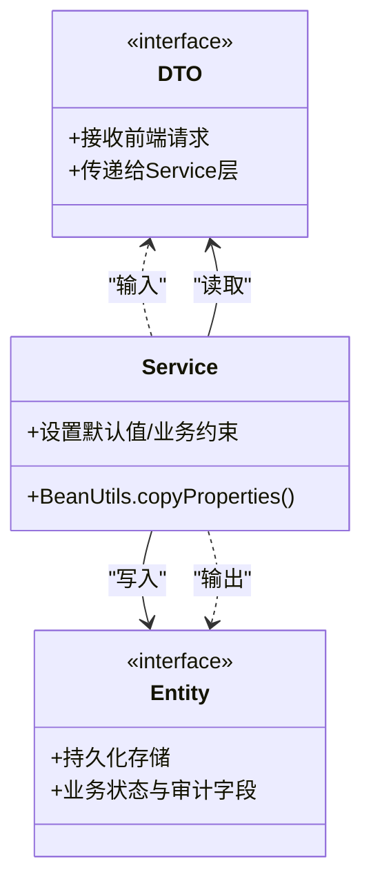
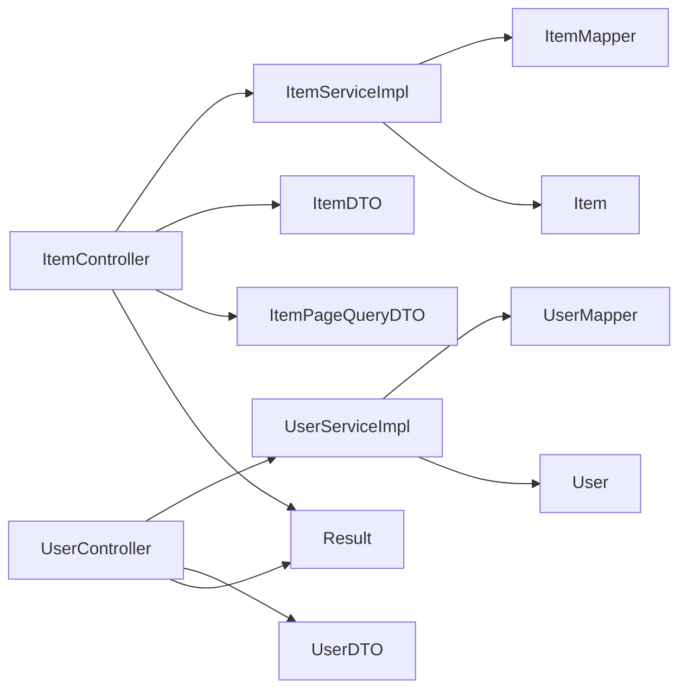

# 数据传输对象

<cite>
**本文引用的文件**
- [ItemDTO.java](file://src/main/java/com/qkl/auctionsystem/pojo/dto/ItemDTO.java)
- [UserDTO.java](file://src/main/java/com/qkl/auctionsystem/pojo/dto/UserDTO.java)
- [ItemPageQueryDTO.java](file://src/main/java/com/qkl/auctionsystem/pojo/dto/ItemPageQueryDTO.java)
- [ItemController.java](file://src/main/java/com/qkl/auctionsystem/controller/ItemController.java)
- [UserController.java](file://src/main/java/com/qkl/auctionsystem/controller/UserController.java)
- [ItemServiceImpl.java](file://src/main/java/com/qkl/auctionsystem/service/impl/ItemServiceImpl.java)
- [UserServiceImpl.java](file://src/main/java/com/qkl/auctionsystem/service/impl/UserServiceImpl.java)
- [Item.java](file://src/main/java/com/qkl/auctionsystem/pojo/entity/Item.java)
- [User.java](file://src/main/java/com/qkl/auctionsystem/pojo/entity/User.java)
- [Result.java](file://src/main/java/com/qkl/auctionsystem/result/Result.java)
- [application.properties](file://src/main/resources/application.properties)
</cite>

## 目录
1. [引言](#引言)
2. [项目结构](#项目结构)
3. [核心组件](#核心组件)
4. [架构总览](#架构总览)
5. [详细组件分析](#详细组件分析)
6. [依赖关系分析](#依赖关系分析)
7. [性能考量](#性能考量)
8. [故障排查指南](#故障排查指南)
9. [结论](#结论)
10. [附录](#附录)

## 引言
本文件聚焦于数据传输对象（DTO）在前后端交互中的核心作用，系统阐述DTO如何隔离前端请求参数与后端实体模型，并通过具体示例说明以下三类DTO的职责与用法：
- ItemDTO：封装新增/修改拍品的请求参数
- UserDTO：用于登录接口的响应数据输出载体
- ItemPageQueryDTO：支持分页查询条件传递

同时，文档将对比DTO与Entity的差异与转换机制，给出在Controller方法签名中的实际使用场景，并总结DTO设计的最佳实践（字段校验注解、避免过度包装、命名规范等）。

## 项目结构
本项目采用按层次划分的结构：控制器层（Controller）、服务层（Service）、持久层（Mapper）、实体与DTO层（Entity/DTO）、通用返回体（Result）以及配置文件（application.properties）。DTO位于pojo/dto目录，与实体（pojo/entity）并列，明确区分“对外传输”和“持久化存储”的数据形态。

图表来源
- [ItemController.java](file://src/main/java/com/qkl/auctionsystem/controller/ItemController.java#L1-L86)
- [UserController.java](file://src/main/java/com/qkl/auctionsystem/controller/UserController.java#L1-L49)
- [ItemServiceImpl.java](file://src/main/java/com/qkl/auctionsystem/service/impl/ItemServiceImpl.java#L1-L182)
- [UserServiceImpl.java](file://src/main/java/com/qkl/auctionsystem/service/impl/UserServiceImpl.java#L1-L59)
- [ItemDTO.java](file://src/main/java/com/qkl/auctionsystem/pojo/dto/ItemDTO.java#L1-L16)
- [UserDTO.java](file://src/main/java/com/qkl/auctionsystem/pojo/dto/UserDTO.java#L1-L12)
- [ItemPageQueryDTO.java](file://src/main/java/com/qkl/auctionsystem/pojo/dto/ItemPageQueryDTO.java#L1-L19)
- [Item.java](file://src/main/java/com/qkl/auctionsystem/pojo/entity/Item.java#L1-L34)
- [User.java](file://src/main/java/com/qkl/auctionsystem/pojo/entity/User.java#L1-L26)
- [Result.java](file://src/main/java/com/qkl/auctionsystem/result/Result.java#L1-L39)

章节来源
- [application.properties](file://src/main/resources/application.properties#L1-L20)

## 核心组件
- ItemDTO：用于拍品新增/修改的请求载荷，包含标题、图片、起始价格、描述、起止时间等字段，便于Controller接收并传入Service层。
- UserDTO：用于用户注册/登录的请求载荷，包含用户名、密码、角色等；登录成功后通过Result返回用户ID、角色与JWT令牌。
- ItemPageQueryDTO：用于分页查询拍品列表的条件载体，包含页码、页大小、标题、价格区间、状态等筛选条件。

章节来源
- [ItemDTO.java](file://src/main/java/com/qkl/auctionsystem/pojo/dto/ItemDTO.java#L1-L16)
- [UserDTO.java](file://src/main/java/com/qkl/auctionsystem/pojo/dto/UserDTO.java#L1-L12)
- [ItemPageQueryDTO.java](file://src/main/java/com/qkl/auctionsystem/pojo/dto/ItemPageQueryDTO.java#L1-L19)

## 架构总览
DTO在整体架构中的定位是“边界层对象”，负责：
- 隔离前端请求参数与后端实体模型，避免直接暴露数据库字段与业务细节
- 统一对外接口的数据结构，便于版本演进与契约稳定
- 在Controller与Service之间传递轻量、稳定的参数与结果

图表来源
- [ItemController.java](file://src/main/java/com/qkl/auctionsystem/controller/ItemController.java#L24-L34)
- [ItemServiceImpl.java](file://src/main/java/com/qkl/auctionsystem/service/impl/ItemServiceImpl.java#L33-L43)
- [Result.java](file://src/main/java/com/qkl/auctionsystem/result/Result.java#L18-L36)

## 详细组件分析

### ItemDTO：拍品新增/修改请求参数封装
- 职责：承载拍品新增/修改所需的最小必要字段，便于Controller接收并传递给Service层。
- 字段设计：包含拍品标题、图片URL、初始价格、描述、起止时间等，满足拍品生命周期管理所需的关键信息。
- 使用场景：
  - Controller方法签名接收ItemDTO作为@RequestBody参数
  - Service层通过BeanUtils复制属性到实体Item，再调用Mapper持久化
- 与Entity的关系：DTO仅承载传输所需字段，Entity包含更多业务字段（如状态、上架状态、创建/更新时间等），二者通过拷贝策略分离关注点。

图表来源
- [ItemDTO.java](file://src/main/java/com/qkl/auctionsystem/pojo/dto/ItemDTO.java#L1-L16)
- [Item.java](file://src/main/java/com/qkl/auctionsystem/pojo/entity/Item.java#L1-L34)
- [ItemController.java](file://src/main/java/com/qkl/auctionsystem/controller/ItemController.java#L24-L34)
- [ItemServiceImpl.java](file://src/main/java/com/qkl/auctionsystem/service/impl/ItemServiceImpl.java#L33-L78)

章节来源
- [ItemDTO.java](file://src/main/java/com/qkl/auctionsystem/pojo/dto/ItemDTO.java#L1-L16)
- [ItemController.java](file://src/main/java/com/qkl/auctionsystem/controller/ItemController.java#L24-L34)
- [ItemServiceImpl.java](file://src/main/java/com/qkl/auctionsystem/service/impl/ItemServiceImpl.java#L33-L78)
- [Item.java](file://src/main/java/com/qkl/auctionsystem/pojo/entity/Item.java#L1-L34)

### UserDTO：登录接口响应数据载体
- 职责：承载用户登录/注册的请求参数；登录成功后通过Result返回用户ID、角色与JWT令牌，形成统一响应格式。
- 字段设计：包含用户名、密码、角色等，便于登录校验与权限控制。
- 使用场景：
  - Controller方法签名接收UserDTO作为@RequestBody参数
  - Service层完成认证逻辑后返回User实体，Controller基于User生成JWT并封装到Result.data中返回

图表来源
- [UserController.java](file://src/main/java/com/qkl/auctionsystem/controller/UserController.java#L30-L48)
- [UserServiceImpl.java](file://src/main/java/com/qkl/auctionsystem/service/impl/UserServiceImpl.java#L29-L40)
- [Result.java](file://src/main/java/com/qkl/auctionsystem/result/Result.java#L18-L36)

章节来源
- [UserDTO.java](file://src/main/java/com/qkl/auctionsystem/pojo/dto/UserDTO.java#L1-L12)
- [UserController.java](file://src/main/java/com/qkl/auctionsystem/controller/UserController.java#L30-L48)
- [UserServiceImpl.java](file://src/main/java/com/qkl/auctionsystem/service/impl/UserServiceImpl.java#L29-L40)
- [User.java](file://src/main/java/com/qkl/auctionsystem/pojo/entity/User.java#L1-L26)

### ItemPageQueryDTO：分页查询条件传递
- 职责：承载拍品列表查询的分页与筛选条件，包括页码、页大小、标题关键字、价格区间、状态等。
- 使用场景：
  - Controller方法签名接收ItemPageQueryDTO作为参数
  - Service层使用PageHelper开启分页，调用Mapper执行查询并返回PageResult

图表来源
- [ItemController.java](file://src/main/java/com/qkl/auctionsystem/controller/ItemController.java#L36-L41)
- [ItemServiceImpl.java](file://src/main/java/com/qkl/auctionsystem/service/impl/ItemServiceImpl.java#L45-L50)
- [ItemPageQueryDTO.java](file://src/main/java/com/qkl/auctionsystem/pojo/dto/ItemPageQueryDTO.java#L1-L19)

章节来源
- [ItemPageQueryDTO.java](file://src/main/java/com/qkl/auctionsystem/pojo/dto/ItemPageQueryDTO.java#L1-L19)
- [ItemController.java](file://src/main/java/com/qkl/auctionsystem/controller/ItemController.java#L36-L41)
- [ItemServiceImpl.java](file://src/main/java/com/qkl/auctionsystem/service/impl/ItemServiceImpl.java#L45-L50)

### DTO与Entity的区别与转换机制
- 区别：
  - DTO：面向接口与传输，字段精简、命名贴近前端/接口契约
  - Entity：面向持久化与业务，字段更丰富，包含状态、审计字段等
- 转换机制：
  - 通过BeanUtils.copyProperties在Service层将DTO属性复制到Entity
  - 对于新增场景，Service层还会设置默认值（如状态、上架状态、创建/更新时间）
  - 对于修改场景，Service层先查询实体，再判断业务约束（如上架状态）后再复制更新

图表来源
- [ItemServiceImpl.java](file://src/main/java/com/qkl/auctionsystem/service/impl/ItemServiceImpl.java#L33-L78)
- [UserServiceImpl.java](file://src/main/java/com/qkl/auctionsystem/service/impl/UserServiceImpl.java#L19-L26)
- [Item.java](file://src/main/java/com/qkl/auctionsystem/pojo/entity/Item.java#L1-L34)
- [User.java](file://src/main/java/com/qkl/auctionsystem/pojo/entity/User.java#L1-L26)

章节来源
- [ItemServiceImpl.java](file://src/main/java/com/qkl/auctionsystem/service/impl/ItemServiceImpl.java#L33-L78)
- [UserServiceImpl.java](file://src/main/java/com/qkl/auctionsystem/service/impl/UserServiceImpl.java#L19-L26)

### Controller方法签名中的DTO使用场景
- ItemController：
  - 新增拍品：@PutMapping("/add") 接收@RequestBody ItemDTO
  - 修改拍品：@PutMapping("update") 接收@RequestBody ItemDTO
  - 分页查询：@GetMapping("/list") 接收ItemPageQueryDTO
  - 管理员分页查询：@GetMapping("/list/admin") 接收ItemPageQueryDTO
- UserController：
  - 用户注册：@PostMapping("/register") 接收@RequestBody UserDTO
  - 用户登录：@PostMapping("/login") 接收@RequestBody UserDTO，并返回Result.success(data)

章节来源
- [ItemController.java](file://src/main/java/com/qkl/auctionsystem/controller/ItemController.java#L24-L86)
- [UserController.java](file://src/main/java/com/qkl/auctionsystem/controller/UserController.java#L23-L48)

## 依赖关系分析
- 控制器依赖服务层接口，服务层依赖Mapper与实体
- DTO与Entity分别被控制器与服务层使用，形成清晰的边界
- Result作为统一返回体贯穿各层，保证响应格式一致

图表来源
- [ItemController.java](file://src/main/java/com/qkl/auctionsystem/controller/ItemController.java#L1-L86)
- [UserController.java](file://src/main/java/com/qkl/auctionsystem/controller/UserController.java#L1-L49)
- [ItemServiceImpl.java](file://src/main/java/com/qkl/auctionsystem/service/impl/ItemServiceImpl.java#L1-L182)
- [UserServiceImpl.java](file://src/main/java/com/qkl/auctionsystem/service/impl/UserServiceImpl.java#L1-L59)
- [Result.java](file://src/main/java/com/qkl/auctionsystem/result/Result.java#L1-L39)

章节来源
- [ItemController.java](file://src/main/java/com/qkl/auctionsystem/controller/ItemController.java#L1-L86)
- [UserController.java](file://src/main/java/com/qkl/auctionsystem/controller/UserController.java#L1-L49)
- [ItemServiceImpl.java](file://src/main/java/com/qkl/auctionsystem/service/impl/ItemServiceImpl.java#L1-L182)
- [UserServiceImpl.java](file://src/main/java/com/qkl/auctionsystem/service/impl/UserServiceImpl.java#L1-L59)
- [Result.java](file://src/main/java/com/qkl/auctionsystem/result/Result.java#L1-L39)

## 性能考量
- 分页查询：通过PageHelper在Service层开启分页，避免一次性加载全量数据，降低网络与内存压力
- 属性拷贝：BeanUtils.copyProperties在小体量DTO上开销可忽略，但应避免在高频路径中重复创建大量临时对象
- 响应体统一：Result统一返回结构，减少序列化与反序列化歧义，提升前后端协作效率

## 故障排查指南
- 权限不足：ItemController对新增/删除/修改拍品操作均进行管理员权限校验，若返回权限不足，请确认TokenFilter与权限判定逻辑
- 上架状态限制：Service层在修改拍品前会检查listingStatus，若已上架则拒绝修改，需先下架再修改
- 登录失败：UserServiceImpl在登录时校验用户是否存在、密码是否正确及角色是否匹配，异常信息会通过Result.error返回

章节来源
- [ItemController.java](file://src/main/java/com/qkl/auctionsystem/controller/ItemController.java#L24-L34)
- [ItemServiceImpl.java](file://src/main/java/com/qkl/auctionsystem/service/impl/ItemServiceImpl.java#L58-L78)
- [UserServiceImpl.java](file://src/main/java/com/qkl/auctionsystem/service/impl/UserServiceImpl.java#L29-L40)

## 结论
DTO在本项目中承担了“边界层对象”的关键职责，通过隔离前端请求参数与后端实体模型，实现了清晰的分层与稳定的接口契约。ItemDTO、UserDTO、ItemPageQueryDTO分别服务于拍品管理、用户登录与分页查询三大核心场景。配合BeanUtils属性拷贝与统一Result返回体，系统在可维护性、扩展性与性能方面均表现良好。

## 附录
- DTO设计最佳实践
  - 字段校验注解：建议在DTO上增加字段校验注解（如@NotBlank、@NotNull、@Min、@Max等），以在Controller层尽早拦截非法参数
  - 避免过度包装：仅暴露必要的字段，不将数据库字段与业务细节直接透传给前端
  - 命名规范：遵循前后端约定的命名风格，DTO字段命名贴近接口契约，避免与实体字段强耦合
  - 版本兼容：当接口升级时，优先新增字段并保持向后兼容，避免破坏现有DTO结构