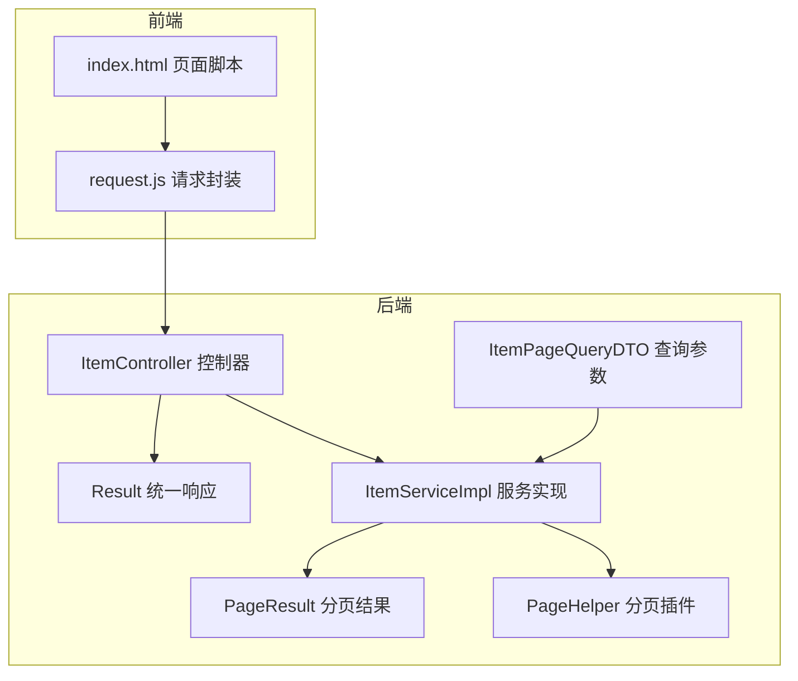
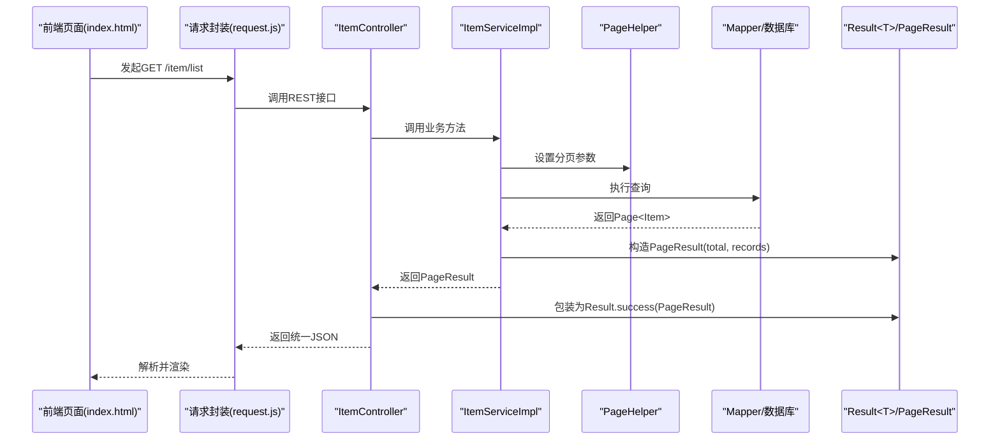
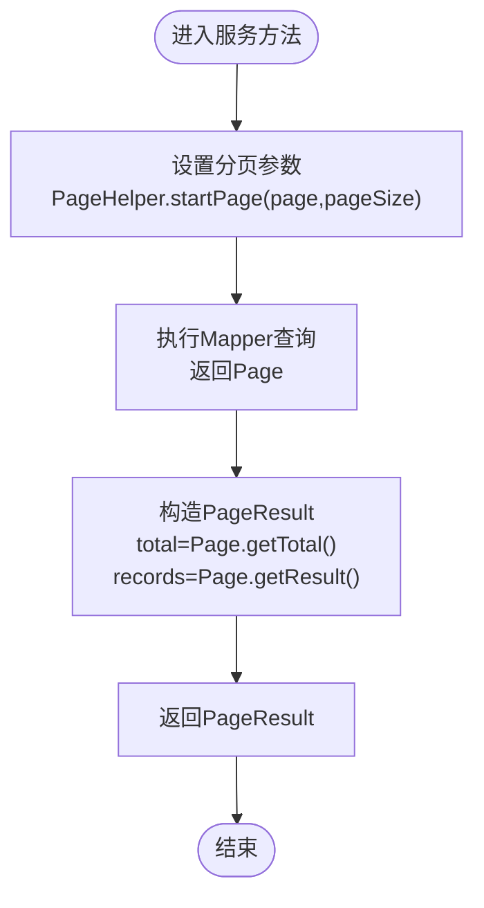
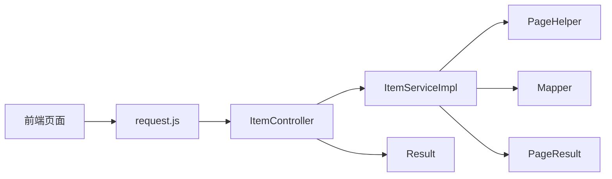

# 统一响应格式

<cite>
**本文引用的文件**
- [Result.java](file://src/main/java/com/qkl/auctionsystem/result/Result.java)
- [PageResult.java](file://src/main/java/com/qkl/auctionsystem/result/PageResult.java)
- [ItemController.java](file://src/main/java/com/qkl/auctionsystem/controller/ItemController.java)
- [ItemServiceImpl.java](file://src/main/java/com/qkl/auctionsystem/service/impl/ItemServiceImpl.java)
- [ItemPageQueryDTO.java](file://src/main/java/com/qkl/auctionsystem/pojo/dto/ItemPageQueryDTO.java)
- [pom.xml](file://pom.xml)
- [request.js](file://html/utils/request.js)
- [index.html](file://html/index.html)
</cite>

## 目录
1. [引言](#引言)
2. [项目结构](#项目结构)
3. [核心组件](#核心组件)
4. [架构总览](#架构总览)
5. [详细组件分析](#详细组件分析)
6. [依赖关系分析](#依赖关系分析)
7. [性能考量](#性能考量)
8. [故障排查指南](#故障排查指南)
9. [结论](#结论)
10. [附录](#附录)

## 引言
本文件围绕“统一响应格式”展开，系统性解析后端Result<T>与PageResult两大核心类的设计理念与应用方式，阐明其如何通过一致的响应结构（code、msg、data、total、records）保障所有API接口的可预测性与易用性；同时结合分页查询与PageHelper插件的协同机制，给出完整的Controller返回示例与调用链路，并总结统一响应格式对前后端协作、异常处理与开发效率的积极影响。

## 项目结构
后端采用Spring Boot工程，统一响应位于result包，控制器位于controller包，服务层位于service.impl包，分页查询通过PageHelper插件实现，前端通过utils/request.js封装fetch请求并消费统一响应。

图示来源
- [Result.java](file://src/main/java/com/qkl/auctionsystem/result/Result.java#L1-L39)
- [PageResult.java](file://src/main/java/com/qkl/auctionsystem/result/PageResult.java#L1-L23)
- [ItemController.java](file://src/main/java/com/qkl/auctionsystem/controller/ItemController.java#L1-L86)
- [ItemServiceImpl.java](file://src/main/java/com/qkl/auctionsystem/service/impl/ItemServiceImpl.java#L1-L182)
- [ItemPageQueryDTO.java](file://src/main/java/com/qkl/auctionsystem/pojo/dto/ItemPageQueryDTO.java#L1-L19)
- [pom.xml](file://pom.xml#L91-L96)
- [request.js](file://html/utils/request.js#L1-L131)
- [index.html](file://html/index.html#L114-L377)

章节来源
- [Result.java](file://src/main/java/com/qkl/auctionsystem/result/Result.java#L1-L39)
- [PageResult.java](file://src/main/java/com/qkl/auctionsystem/result/PageResult.java#L1-L23)
- [ItemController.java](file://src/main/java/com/qkl/auctionsystem/controller/ItemController.java#L1-L86)
- [ItemServiceImpl.java](file://src/main/java/com/qkl/auctionsystem/service/impl/ItemServiceImpl.java#L1-L182)
- [ItemPageQueryDTO.java](file://src/main/java/com/qkl/auctionsystem/pojo/dto/ItemPageQueryDTO.java#L1-L19)
- [pom.xml](file://pom.xml#L91-L96)
- [request.js](file://html/utils/request.js#L1-L131)
- [index.html](file://html/index.html#L114-L377)

## 核心组件
- Result<T>：统一响应载体，包含code（成功=1，失败=0及其它）、msg（错误信息）、data（泛型数据）。提供静态工厂方法：
  - success()：无参成功返回，仅设置code=1
  - success(T object)：带数据的成功返回，设置code=1与data
  - error(String msg)：失败返回，设置code=0与msg
- PageResult：分页结果载体，包含total（总记录数）与records（当前页数据集合），配合PageHelper使用。

章节来源
- [Result.java](file://src/main/java/com/qkl/auctionsystem/result/Result.java#L1-L39)
- [PageResult.java](file://src/main/java/com/qkl/auctionsystem/result/PageResult.java#L1-L23)

## 架构总览
统一响应格式贯穿“控制器 -> 服务层 -> 数据访问 -> 返回统一结构”的全链路，确保前端始终以一致的数据结构进行处理，降低适配成本与错误率。

图示来源
- [ItemController.java](file://src/main/java/com/qkl/auctionsystem/controller/ItemController.java#L36-L41)
- [ItemServiceImpl.java](file://src/main/java/com/qkl/auctionsystem/service/impl/ItemServiceImpl.java#L46-L50)
- [pom.xml](file://pom.xml#L91-L96)
- [request.js](file://html/utils/request.js#L32-L61)
- [index.html](file://html/index.html#L114-L377)

## 详细组件分析

### Result<T> 类设计与工厂方法
- 设计要点
  - 泛型封装：通过<T>承载任意类型数据，便于在不同接口间复用统一结构
  - 成功/失败标识：code=1表示成功，0及其它数字表示失败，语义清晰
  - 错误信息：msg用于传递错误原因，便于前端提示与日志定位
- 静态工厂方法
  - success()：适用于无需返回额外数据的场景（如删除、更新、添加成功）
  - success(T object)：适用于需要返回具体数据的场景（如单条详情、分页结果）
  - error(String msg)：适用于权限不足、参数校验失败等错误场景
- 使用建议
  - 成功路径优先使用success()或success(data)，避免冗余字段
  - 失败路径统一使用error(msg)，保证错误信息一致可读
  - 结合权限校验与业务异常，形成“先校验、再调用、最后包装”的流程

章节来源
- [Result.java](file://src/main/java/com/qkl/auctionsystem/result/Result.java#L1-L39)

### PageResult 分页结果模型
- 字段说明
  - total：总记录数，用于前端计算页数与分页导航
  - records：当前页数据集合，通常为实体列表
- 与PageHelper的协作
  - 服务层在查询前调用PageHelper.startPage(page, pageSize)
  - Mapper执行查询后返回Page<T>，服务层取total与result构造PageResult
  - 控制器接收PageResult并用Result.success()统一封装返回

章节来源
- [PageResult.java](file://src/main/java/com/qkl/auctionsystem/result/PageResult.java#L1-L23)
- [ItemServiceImpl.java](file://src/main/java/com/qkl/auctionsystem/service/impl/ItemServiceImpl.java#L46-L50)
- [ItemServiceImpl.java](file://src/main/java/com/qkl/auctionsystem/service/impl/ItemServiceImpl.java#L100-L105)
- [pom.xml](file://pom.xml#L91-L96)

### 分页查询参数模型 ItemPageQueryDTO
- 字段说明
  - page/pageSize：分页参数
  - title/MinPrice/MaxPrice/status：查询过滤条件
- 作用
  - 作为服务层查询入口的参数载体，驱动PageHelper与Mapper查询

章节来源
- [ItemPageQueryDTO.java](file://src/main/java/com/qkl/auctionsystem/pojo/dto/ItemPageQueryDTO.java#L1-L19)

### 控制器返回示例：ItemController 中的统一响应
- 典型场景
  - 列表查询：selectItemList/selectItemListByAdmin
    - 服务层返回PageResult
    - 控制器使用Result.success(pageResult)统一封装
  - 单条详情：selectItemById
    - 服务层返回实体，控制器使用Result.success(entity)
  - 权限控制：添加/删除/修改
    - 权限不足时直接返回Result.error(msg)
- 调用链路
  - 控制器 -> 服务层 -> PageHelper -> Mapper -> PageResult -> Result.success(PageResult)

章节来源
- [ItemController.java](file://src/main/java/com/qkl/auctionsystem/controller/ItemController.java#L36-L41)
- [ItemController.java](file://src/main/java/com/qkl/auctionsystem/controller/ItemController.java#L43-L48)
- [ItemController.java](file://src/main/java/com/qkl/auctionsystem/controller/ItemController.java#L50-L55)
- [ItemController.java](file://src/main/java/com/qkl/auctionsystem/controller/ItemController.java#L24-L34)
- [ItemController.java](file://src/main/java/com/qkl/auctionsystem/controller/ItemController.java#L56-L66)
- [ItemController.java](file://src/main/java/com/qkl/auctionsystem/controller/ItemController.java#L68-L78)
- [ItemController.java](file://src/main/java/com/qkl/auctionsystem/controller/ItemController.java#L80-L86)

### 分页查询算法流程（服务层）

图示来源
- [ItemServiceImpl.java](file://src/main/java/com/qkl/auctionsystem/service/impl/ItemServiceImpl.java#L46-L50)
- [ItemServiceImpl.java](file://src/main/java/com/qkl/auctionsystem/service/impl/ItemServiceImpl.java#L100-L105)

## 依赖关系分析
- 组件耦合
  - 控制器依赖服务层与Result/PageResult
  - 服务层依赖PageHelper与Mapper
  - 前端依赖request.js与统一响应结构
- 外部依赖
  - PageHelper分页插件通过Maven引入，用于简化分页查询
- 潜在风险
  - 若服务层未正确设置分页参数，可能导致total与records不一致
  - 若控制器未使用Result统一包装，会破坏前后端契约

图示来源
- [ItemController.java](file://src/main/java/com/qkl/auctionsystem/controller/ItemController.java#L1-L86)
- [ItemServiceImpl.java](file://src/main/java/com/qkl/auctionsystem/service/impl/ItemServiceImpl.java#L1-L182)
- [pom.xml](file://pom.xml#L91-L96)
- [request.js](file://html/utils/request.js#L1-L131)

章节来源
- [ItemController.java](file://src/main/java/com/qkl/auctionsystem/controller/ItemController.java#L1-L86)
- [ItemServiceImpl.java](file://src/main/java/com/qkl/auctionsystem/service/impl/ItemServiceImpl.java#L1-L182)
- [pom.xml](file://pom.xml#L91-L96)
- [request.js](file://html/utils/request.js#L1-L131)

## 性能考量
- 分页查询优化
  - 合理设置page与pageSize，避免过大页导致内存压力
  - 使用PageHelper进行物理分页，减少一次性加载大量数据
- 响应体积控制
  - 仅在需要时返回data，避免冗余字段
  - 对敏感字段进行脱敏或不在响应中暴露
- 前端渲染优化
  - 基于total与records动态渲染分页控件，减少重复请求
  - 使用懒加载与虚拟滚动优化长列表展示

## 故障排查指南
- 常见问题
  - 响应结构不一致：检查控制器是否统一使用Result.success()/error()
  - 分页数据异常：确认服务层是否正确调用PageHelper.startPage()并传入正确的page与pageSize
  - 权限不足：确认权限校验逻辑与Result.error()返回是否生效
- 排查步骤
  - 后端：在控制器与服务层打印关键参数与返回值，核对total与records
  - 前端：在request.js中打印响应结构，确认字段名与类型
  - 分页：在index.html中验证分页按钮与total显示逻辑

章节来源
- [ItemController.java](file://src/main/java/com/qkl/auctionsystem/controller/ItemController.java#L24-L34)
- [ItemController.java](file://src/main/java/com/qkl/auctionsystem/controller/ItemController.java#L56-L66)
- [ItemServiceImpl.java](file://src/main/java/com/qkl/auctionsystem/service/impl/ItemServiceImpl.java#L46-L50)
- [request.js](file://html/utils/request.js#L18-L30)
- [index.html](file://html/index.html#L114-L377)

## 结论
统一响应格式通过Result<T>与PageResult实现了“结构一致、语义明确、易于扩展”的接口契约，显著降低了前后端对接复杂度，提升了接口可预测性与可维护性。结合PageHelper的分页能力，系统在大数据量场景下仍能保持良好的性能与用户体验。建议在后续迭代中持续遵循该规范，确保新增接口的一致性与稳定性。

## 附录
- 统一响应字段说明
  - code：1表示成功，0及其它数字表示失败
  - msg：错误信息（失败时必填）
  - data：成功时返回的具体数据（可为空）
  - total：分页总记录数
  - records：当前页数据集合
- 前端消费建议
  - 基于code判断成功与否，msg用于提示
  - 基于total与records渲染分页控件
  - 对敏感字段进行脱敏处理