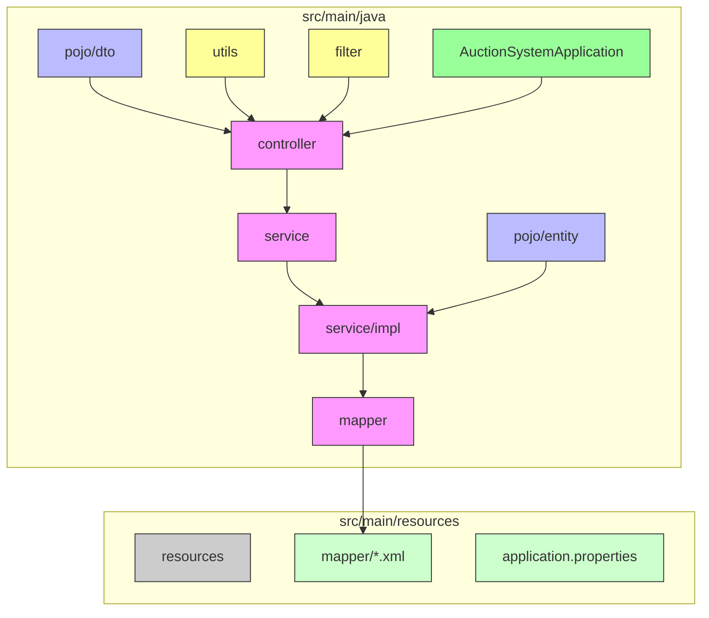
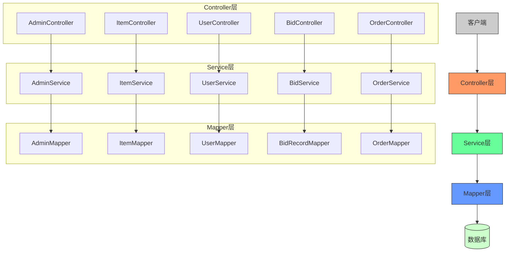
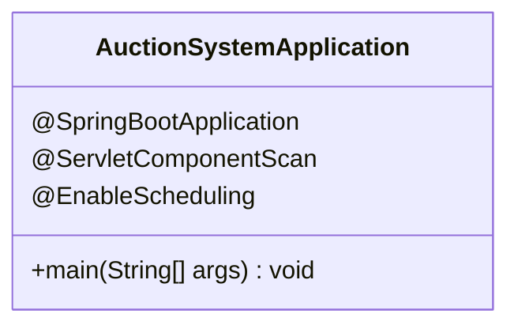
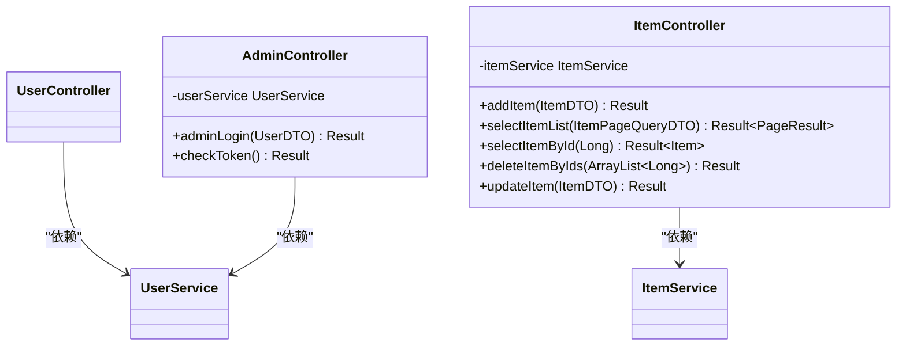
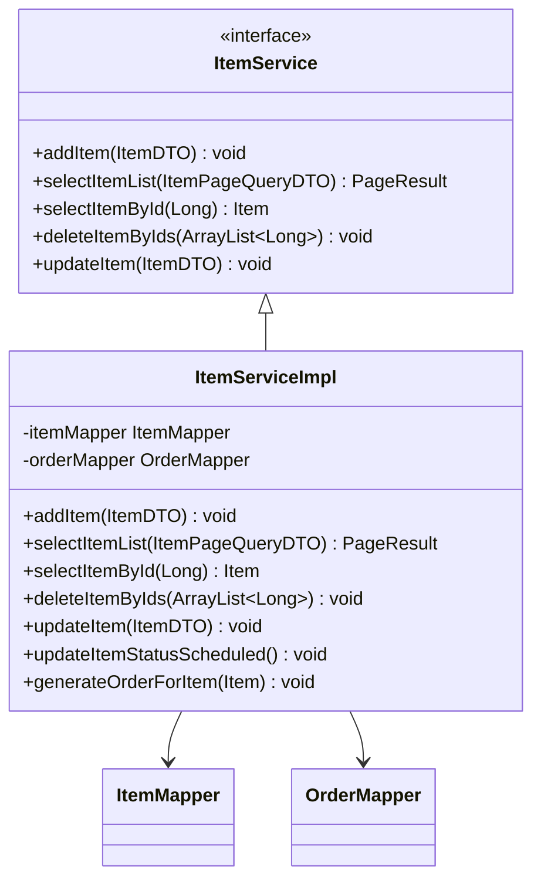
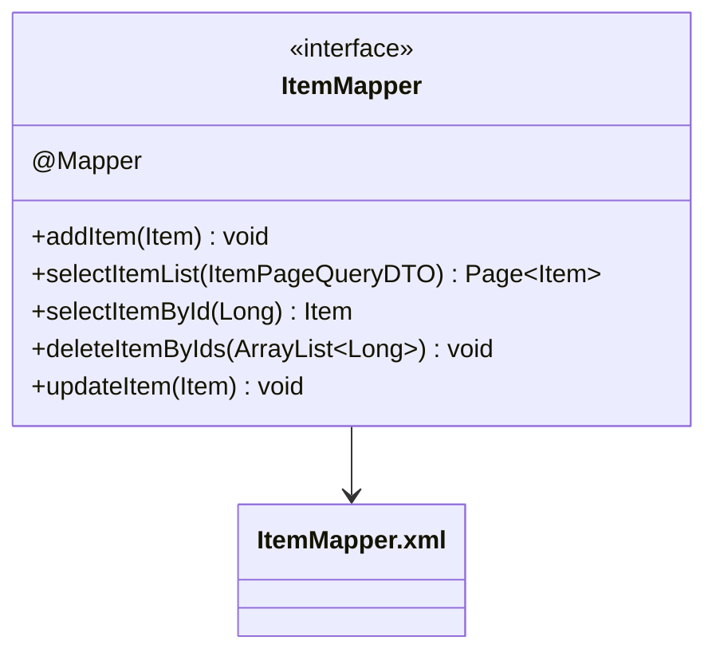
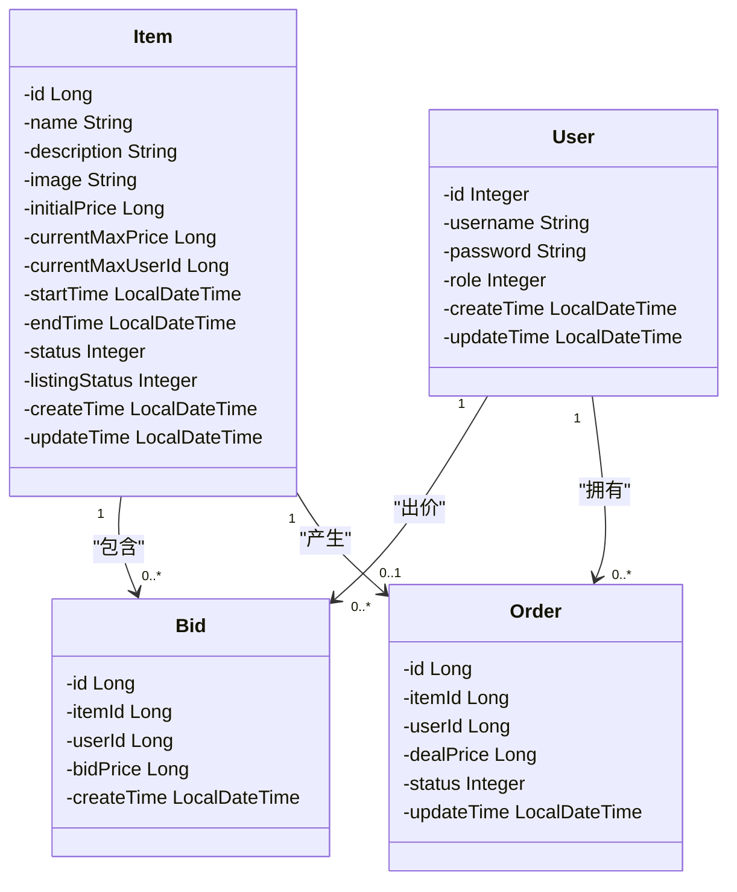
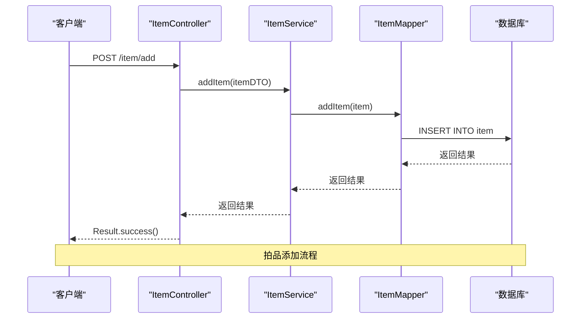
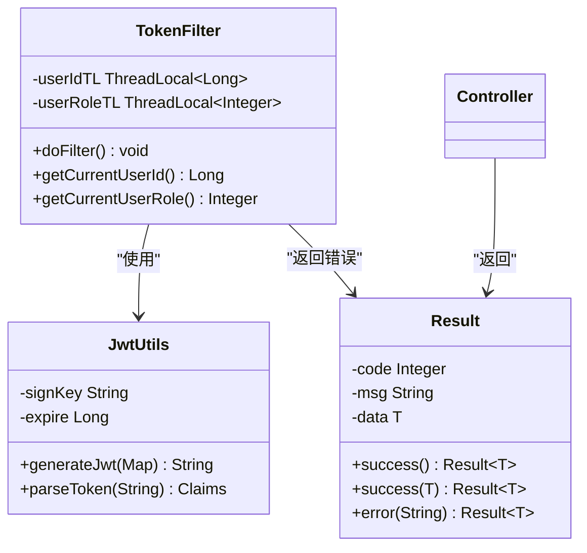
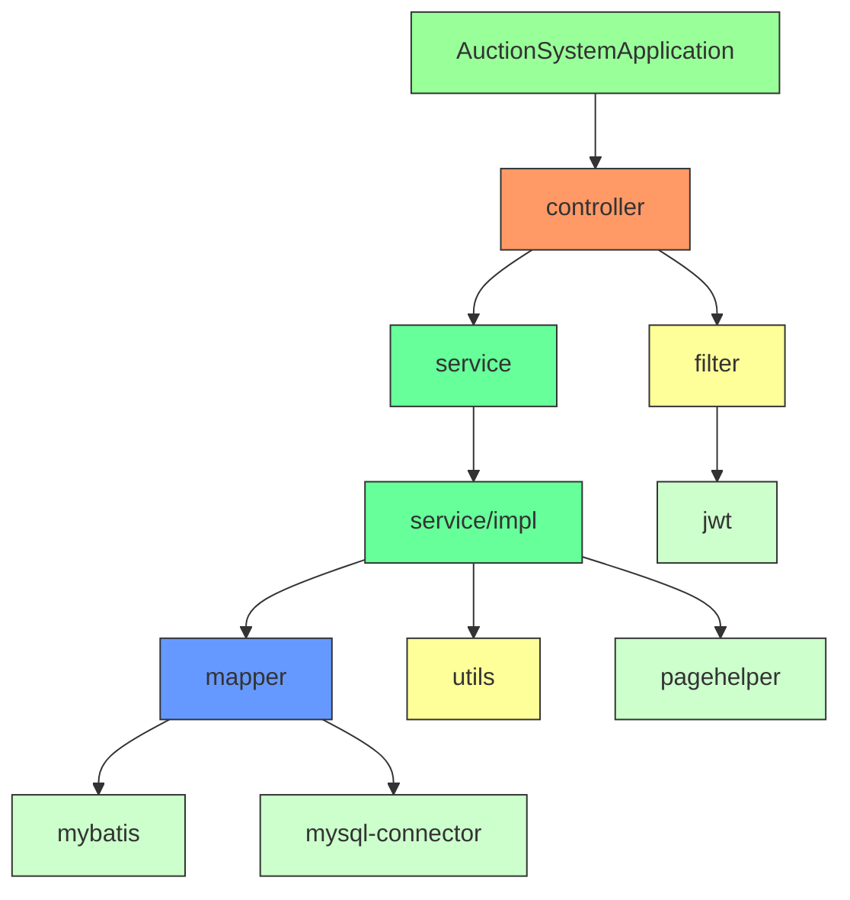

# 后端架构

<cite>
**本文档引用的文件**  
- [AuctionSystemApplication.java](file://src/main/java/com/qkl/auctionsystem/AuctionSystemApplication.java)
- [AdminController.java](file://src/main/java/com/qkl/auctionsystem/controller/AdminController.java)
- [ItemController.java](file://src/main/java/com/qkl/auctionsystem/controller/ItemController.java)
- [UserController.java](file://src/main/java/com/qkl/auctionsystem/controller/UserController.java)
- [BidController.java](file://src/main/java/com/qkl/auctionsystem/controller/BidController.java)
- [OrderController.java](file://src/main/java/com/qkl/auctionsystem/controller/OrderController.java)
- [ItemServiceImpl.java](file://src/main/java/com/qkl/auctionsystem/service/impl/ItemServiceImpl.java)
- [UserServiceImpl.java](file://src/main/java/com/qkl/auctionsystem/service/impl/UserServiceImpl.java)
- [BidServiceImpl.java](file://src/main/java/com/qkl/auctionsystem/service/impl/BidServiceImpl.java)
- [OrderServiceImpl.java](file://src/main/java/com/qkl/auctionsystem/service/impl/OrderServiceImpl.java)
- [ItemMapper.java](file://src/main/java/com/qkl/auctionsystem/mapper/ItemMapper.java)
- [UserMapper.java](file://src/main/java/com/qkl/auctionsystem/mapper/UserMapper.java)
- [BidRecordMapper.java](file://src/main/java/com/qkl/auctionsystem/mapper/BidRecordMapper.java)
- [OrderMapper.java](file://src/main/java/com/qkl/auctionsystem/mapper/OrderMapper.java)
- [Item.java](file://src/main/java/com/qkl/auctionsystem/pojo/entity/Item.java)
- [User.java](file://src/main/java/com/qkl/auctionsystem/pojo/entity/User.java)
- [Bid.java](file://src/main/java/com/qkl/auctionsystem/pojo/entity/Bid.java)
- [Order.java](file://src/main/java/com/qkl/auctionsystem/pojo/entity/Order.java)
- [Result.java](file://src/main/java/com/qkl/auctionsystem/result/Result.java)
- [PageResult.java](file://src/main/java/com/qkl/auctionsystem/result/PageResult.java)
- [TokenFilter.java](file://src/main/java/com/qkl/auctionsystem/filter/TokenFilter.java)
- [JwtUtils.java](file://src/main/java/com/qkl/auctionsystem/utils/JwtUtils.java)
- [application.properties](file://src/main/resources/application.properties)
- [pom.xml](file://pom.xml)
</cite>

## 目录
1. [简介](#简介)
2. [项目结构](#项目结构)
3. [核心组件](#核心组件)
4. [架构概览](#架构概览)
5. [详细组件分析](#详细组件分析)
6. [依赖分析](#依赖分析)
7. [性能考虑](#性能考虑)
8. [故障排除指南](#故障排除指南)
9. [结论](#结论)

## 简介
本项目是一个基于Spring Boot的拍卖系统后端应用，采用标准的MVC分层架构设计。系统实现了用户注册登录、拍品管理、竞拍处理、订单生成等核心功能。通过JWT实现身份认证与权限控制，使用MyBatis作为持久层框架操作MySQL数据库，并通过PageHelper实现分页功能。系统架构清晰，各层职责分明，具有良好的可扩展性与可测试性。

## 项目结构

**图示来源**  
- [AuctionSystemApplication.java](file://src/main/java/com/qkl/auctionsystem/AuctionSystemApplication.java)
- [controller](file://src/main/java/com/qkl/auctionsystem/controller/)
- [service](file://src/main/java/com/qkl/auctionsystem/service/)
- [mapper](file://src/main/java/com/qkl/auctionsystem/mapper/)
- [pojo](file://src/main/java/com/qkl/auctionsystem/pojo/)
- [application.properties](file://src/main/resources/application.properties)

**本节来源**  
- [AuctionSystemApplication.java](file://src/main/java/com/qkl/auctionsystem/AuctionSystemApplication.java)
- [project_structure](file://project_structure)

## 核心组件

系统采用典型的Spring Boot MVC三层架构：Controller层处理HTTP请求，Service层实现业务逻辑，Mapper层负责数据持久化。通过依赖注入（@Autowired）建立各层之间的调用关系，使用Result类统一API响应格式。

**本节来源**  
- [AuctionSystemApplication.java](file://src/main/java/com/qkl/auctionsystem/AuctionSystemApplication.java)
- [Result.java](file://src/main/java/com/qkl/auctionsystem/result/Result.java)
- [ItemController.java](file://src/main/java/com/qkl/auctionsystem/controller/ItemController.java)
- [ItemServiceImpl.java](file://src/main/java/com/qkl/auctionsystem/service/impl/ItemServiceImpl.java)
- [ItemMapper.java](file://src/main/java/com/qkl/auctionsystem/mapper/ItemMapper.java)

## 架构概览

**图示来源**  
- [AuctionSystemApplication.java](file://src/main/java/com/qkl/auctionsystem/AuctionSystemApplication.java)
- [controller](file://src/main/java/com/qkl/auctionsystem/controller/)
- [service](file://src/main/java/com/qkl/auctionsystem/service/)
- [mapper](file://src/main/java/com/qkl/auctionsystem/mapper/)

**本节来源**  
- [AuctionSystemApplication.java](file://src/main/java/com/qkl/auctionsystem/AuctionSystemApplication.java)
- [controller](file://src/main/java/com/qkl/auctionsystem/controller/)
- [service](file://src/main/java/com/qkl/auctionsystem/service/)
- [mapper](file://src/main/java/com/qkl/auctionsystem/mapper/)

## 详细组件分析

### 启动类分析

**图示来源**  
- [AuctionSystemApplication.java](file://src/main/java/com/qkl/auctionsystem/AuctionSystemApplication.java#L1-L18)

**本节来源**  
- [AuctionSystemApplication.java](file://src/main/java/com/qkl/auctionsystem/AuctionSystemApplication.java#L1-L18)

### 控制器层分析

**图示来源**  
- [AdminController.java](file://src/main/java/com/qkl/auctionsystem/controller/AdminController.java#L1-L73)
- [ItemController.java](file://src/main/java/com/qkl/auctionsystem/controller/ItemController.java#L1-L86)

**本节来源**  
- [AdminController.java](file://src/main/java/com/qkl/auctionsystem/controller/AdminController.java#L1-L73)
- [ItemController.java](file://src/main/java/com/qkl/auctionsystem/controller/ItemController.java#L1-L86)
- [UserController.java](file://src/main/java/com/qkl/auctionsystem/controller/UserController.java)
- [BidController.java](file://src/main/java/com/qkl/auctionsystem/controller/BidController.java)
- [OrderController.java](file://src/main/java/com/qkl/auctionsystem/controller/OrderController.java)

### 服务层分析

**图示来源**  
- [ItemService.java](file://src/main/java/com/qkl/auctionsystem/service/ItemService.java#L1-L33)
- [ItemServiceImpl.java](file://src/main/java/com/qkl/auctionsystem/service/impl/ItemServiceImpl.java#L1-L182)

**本节来源**  
- [ItemService.java](file://src/main/java/com/qkl/auctionsystem/service/ItemService.java#L1-L33)
- [ItemServiceImpl.java](file://src/main/java/com/qkl/auctionsystem/service/impl/ItemServiceImpl.java#L1-L182)
- [UserServiceImpl.java](file://src/main/java/com/qkl/auctionsystem/service/impl/UserServiceImpl.java#L1-L59)
- [BidServiceImpl.java](file://src/main/java/com/qkl/auctionsystem/service/impl/BidServiceImpl.java)
- [OrderServiceImpl.java](file://src/main/java/com/qkl/auctionsystem/service/impl/OrderServiceImpl.java)

### 数据访问层分析

**图示来源**  
- [ItemMapper.java](file://src/main/java/com/qkl/auctionsystem/mapper/ItemMapper.java#L1-L35)
- [ItemMapper.xml](file://src/main/resources/mapper/ItemMapper.xml)

**本节来源**  
- [ItemMapper.java](file://src/main/java/com/qkl/auctionsystem/mapper/ItemMapper.java#L1-L35)
- [UserMapper.java](file://src/main/java/com/qkl/auctionsystem/mapper/UserMapper.java#L1-L13)
- [BidRecordMapper.java](file://src/main/java/com/qkl/auctionsystem/mapper/BidRecordMapper.java)
- [OrderMapper.java](file://src/main/java/com/qkl/auctionsystem/mapper/OrderMapper.java)

### 领域模型分析

**图示来源**  
- [Item.java](file://src/main/java/com/qkl/auctionsystem/pojo/entity/Item.java)
- [User.java](file://src/main/java/com/qkl/auctionsystem/pojo/entity/User.java)
- [Bid.java](file://src/main/java/com/qkl/auctionsystem/pojo/entity/Bid.java)
- [Order.java](file://src/main/java/com/qkl/auctionsystem/pojo/entity/Order.java)

**本节来源**  
- [Item.java](file://src/main/java/com/qkl/auctionsystem/pojo/entity/Item.java)
- [User.java](file://src/main/java/com/qkl/auctionsystem/pojo/entity/User.java)
- [Bid.java](file://src/main/java/com/qkl/auctionsystem/pojo/entity/Bid.java)
- [Order.java](file://src/main/java/com/qkl/auctionsystem/pojo/entity/Order.java)

### 调用链路分析

**图示来源**  
- [ItemController.java](file://src/main/java/com/qkl/auctionsystem/controller/ItemController.java#L24-L34)
- [ItemServiceImpl.java](file://src/main/java/com/qkl/auctionsystem/service/impl/ItemServiceImpl.java#L33-L43)
- [ItemMapper.java](file://src/main/java/com/qkl/auctionsystem/mapper/ItemMapper.java#L14)

**本节来源**  
- [ItemController.java](file://src/main/java/com/qkl/auctionsystem/controller/ItemController.java#L24-L34)
- [ItemServiceImpl.java](file://src/main/java/com/qkl/auctionsystem/service/impl/ItemServiceImpl.java#L33-L43)
- [ItemMapper.java](file://src/main/java/com/qkl/auctionsystem/mapper/ItemMapper.java#L14)

### 安全与工具组件分析

**图示来源**  
- [TokenFilter.java](file://src/main/java/com/qkl/auctionsystem/filter/TokenFilter.java#L1-L141)
- [JwtUtils.java](file://src/main/java/com/qkl/auctionsystem/utils/JwtUtils.java#L1-L36)
- [Result.java](file://src/main/java/com/qkl/auctionsystem/result/Result.java#L1-L39)

**本节来源**  
- [TokenFilter.java](file://src/main/java/com/qkl/auctionsystem/filter/TokenFilter.java#L1-L141)
- [JwtUtils.java](file://src/main/java/com/qkl/auctionsystem/utils/JwtUtils.java#L1-L36)
- [Result.java](file://src/main/java/com/qkl/auctionsystem/result/Result.java#L1-L39)
- [PageResult.java](file://src/main/java/com/qkl/auctionsystem/result/PageResult.java)

## 依赖分析

**图示来源**  
- [pom.xml](file://pom.xml#L1-L129)
- [AuctionSystemApplication.java](file://src/main/java/com/qkl/auctionsystem/AuctionSystemApplication.java)

**本节来源**  
- [pom.xml](file://pom.xml#L1-L129)
- [application.properties](file://src/main/resources/application.properties#L1-L20)
- [AuctionSystemApplication.java](file://src/main/java/com/qkl/auctionsystem/AuctionSystemApplication.java)

## 性能考虑
系统通过PageHelper实现了高效的分页查询，避免了全表扫描带来的性能问题。定时任务每分钟执行一次拍品状态更新，合理控制了执行频率。使用ThreadLocal在过滤器中保存用户信息，避免了重复解析JWT令牌，提升了请求处理效率。MyBatis的映射配置启用了驼峰命名转换，减少了手动字段映射的开销。

## 故障排除指南
常见问题包括JWT令牌失效、数据库连接失败、权限不足等。可通过查看日志中的错误信息定位问题，检查application.properties中的数据库配置是否正确，确认JWT密钥是否匹配，验证请求头中是否包含有效的token。对于分页查询问题，需确保前端传递了正确的页码和页面大小参数。

## 结论
该拍卖系统后端架构设计合理，遵循了Spring Boot最佳实践。MVC分层清晰，依赖注入使用得当，代码可读性和可维护性高。通过JWT实现安全认证，MyBatis简化数据操作，PageHelper提供分页支持，构成了一个完整且高效的技术栈。系统具备良好的扩展性，便于后续添加新功能模块。