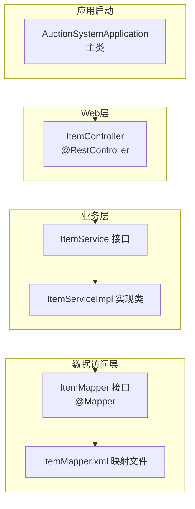
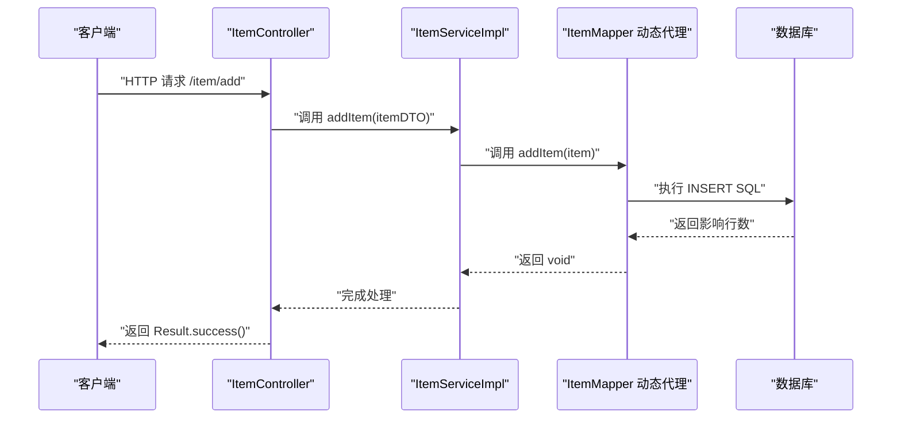
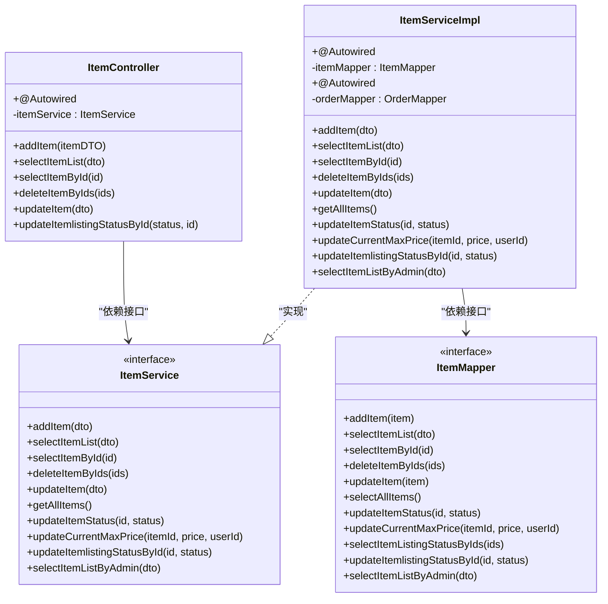
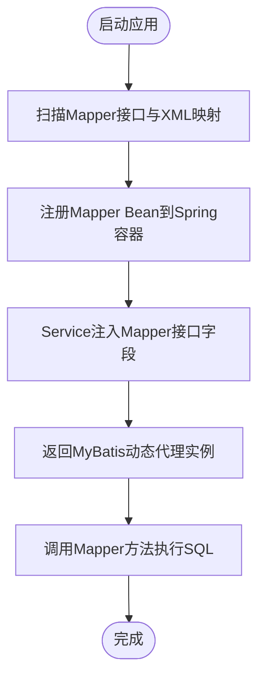
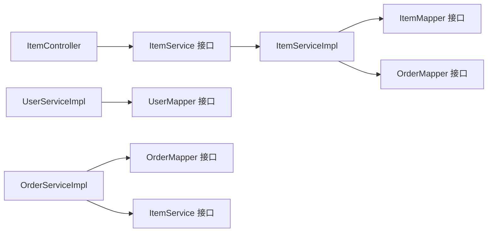
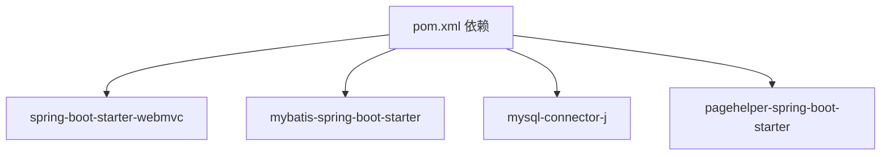

# 依赖注入机制

<cite>
**本文引用的文件**
- [AuctionSystemApplication.java](file://src/main/java/com/qkl/auctionsystem/AuctionSystemApplication.java)
- [application.properties](file://src/main/resources/application.properties)
- [ItemController.java](file://src/main/java/com/qkl/auctionsystem/controller/ItemController.java)
- [ItemService.java](file://src/main/java/com/qkl/auctionsystem/service/ItemService.java)
- [ItemServiceImpl.java](file://src/main/java/com/qkl/auctionsystem/service/impl/ItemServiceImpl.java)
- [ItemMapper.java](file://src/main/java/com/qkl/auctionsystem/mapper/ItemMapper.java)
- [ItemMapper.xml](file://src/main/resources/mapper/ItemMapper.xml)
- [UserServiceImpl.java](file://src/main/java/com/qkl/auctionsystem/service/impl/UserServiceImpl.java)
- [UserMapper.java](file://src/main/java/com/qkl/auctionsystem/mapper/UserMapper.java)
- [OrderServiceImpl.java](file://src/main/java/com/qkl/auctionsystem/service/impl/OrderServiceImpl.java)
- [pom.xml](file://pom.xml)
</cite>

## 目录
1. [引言](#引言)
2. [项目结构](#项目结构)
3. [核心组件](#核心组件)
4. [架构总览](#架构总览)
5. [详细组件分析](#详细组件分析)
6. [依赖关系分析](#依赖关系分析)
7. [性能考量](#性能考量)
8. [故障排查指南](#故障排查指南)
9. [结论](#结论)
10. [附录](#附录)

## 引言
本文件围绕Spring IoC容器中的依赖注入实现方式进行深入解析，重点以ItemController对ItemService的@Autowired注入为例，说明Spring在运行时如何提供代理实现；同时阐述ItemServiceImpl中@Autowired注入ItemMapper接口的底层原理，包括MyBatis动态代理生成Mapper实例的过程。文档强调基于接口编程的优势（解耦、可测试性、扩展性），并通过三层架构（Controller→Service→Mapper）之间的依赖关系，解释Spring如何通过类型匹配完成Bean的自动装配。

## 项目结构
项目采用标准的Spring Boot多模块结构，按功能域划分：
- controller：Web层控制器，负责HTTP请求入口与响应封装
- service：业务服务层，包含接口与实现类
- mapper：数据访问层，定义Mapper接口并配合XML映射文件
- resources：配置与映射文件，如application.properties与MyBatis的XML映射
- 其他工具类与实体类位于pojo、result等包中

图表来源
- [AuctionSystemApplication.java](file://src/main/java/com/qkl/auctionsystem/AuctionSystemApplication.java#L1-L17)
- [ItemController.java](file://src/main/java/com/qkl/auctionsystem/controller/ItemController.java#L1-L86)
- [ItemService.java](file://src/main/java/com/qkl/auctionsystem/service/ItemService.java#L1-L33)
- [ItemServiceImpl.java](file://src/main/java/com/qkl/auctionsystem/service/impl/ItemServiceImpl.java#L1-L182)
- [ItemMapper.java](file://src/main/java/com/qkl/auctionsystem/mapper/ItemMapper.java#L1-L35)
- [ItemMapper.xml](file://src/main/resources/mapper/ItemMapper.xml#L1-L109)

章节来源
- [AuctionSystemApplication.java](file://src/main/java/com/qkl/auctionsystem/AuctionSystemApplication.java#L1-L17)
- [application.properties](file://src/main/resources/application.properties#L1-L20)

## 核心组件
- 控制器层：ItemController通过@Autowired注入ItemService，对外暴露REST接口，调用Service完成业务逻辑。
- 服务层：ItemService定义业务契约，ItemServiceImpl实现具体逻辑，并通过@Autowired注入ItemMapper与OrderMapper。
- 数据访问层：ItemMapper声明DAO方法，MyBatis通过扫描与XML映射生成动态代理实例；ItemMapper.xml提供SQL映射。

章节来源
- [ItemController.java](file://src/main/java/com/qkl/auctionsystem/controller/ItemController.java#L1-L86)
- [ItemService.java](file://src/main/java/com/qkl/auctionsystem/service/ItemService.java#L1-L33)
- [ItemServiceImpl.java](file://src/main/java/com/qkl/auctionsystem/service/impl/ItemServiceImpl.java#L1-L182)
- [ItemMapper.java](file://src/main/java/com/qkl/auctionsystem/mapper/ItemMapper.java#L1-L35)
- [ItemMapper.xml](file://src/main/resources/mapper/ItemMapper.xml#L1-L109)

## 架构总览
三层架构（Controller→Service→Mapper）通过接口编程实现松耦合，Spring IoC负责Bean生命周期与依赖注入，MyBatis负责Mapper接口的动态代理生成与SQL执行。

图表来源
- [ItemController.java](file://src/main/java/com/qkl/auctionsystem/controller/ItemController.java#L1-L86)
- [ItemServiceImpl.java](file://src/main/java/com/qkl/auctionsystem/service/impl/ItemServiceImpl.java#L1-L182)
- [ItemMapper.java](file://src/main/java/com/qkl/auctionsystem/mapper/ItemMapper.java#L1-L35)
- [ItemMapper.xml](file://src/main/resources/mapper/ItemMapper.xml#L1-L109)

## 详细组件分析

### 基于接口编程的优势
- 解耦：Controller仅依赖ItemService接口，不关心具体实现；Service仅依赖Mapper接口，不直接依赖数据库实现细节。
- 可测试性：可通过Mock替换Service或Mapper，隔离单元测试。
- 扩展性：新增实现类无需改动调用方；引入新的Mapper接口不影响既有业务流程。

章节来源
- [ItemController.java](file://src/main/java/com/qkl/auctionsystem/controller/ItemController.java#L1-L86)
- [ItemService.java](file://src/main/java/com/qkl/auctionsystem/service/ItemService.java#L1-L33)
- [ItemServiceImpl.java](file://src/main/java/com/qkl/auctionsystem/service/impl/ItemServiceImpl.java#L1-L182)
- [ItemMapper.java](file://src/main/java/com/qkl/auctionsystem/mapper/ItemMapper.java#L1-L35)

### Spring IoC中的依赖注入与类型匹配
- 自动装配触发点：在ItemController中使用@Autowired注入ItemService字段；在ItemServiceImpl中使用@Autowired注入ItemMapper与OrderMapper字段。
- 类型匹配策略：Spring根据字段声明的接口类型进行匹配，优先选择唯一且兼容的Bean；若存在多个候选，需通过限定符或命名区分。
- 运行时代理提供：Spring容器在启动时扫描@Component/@Service/@Mapper等注解，注册Bean定义；当需要注入时，容器通过反射创建实例或返回已存在的单例，并在必要时生成JDK/CGLIB代理以支持事务、AOP等功能。

图表来源
- [ItemController.java](file://src/main/java/com/qkl/auctionsystem/controller/ItemController.java#L1-L86)
- [ItemService.java](file://src/main/java/com/qkl/auctionsystem/service/ItemService.java#L1-L33)
- [ItemServiceImpl.java](file://src/main/java/com/qkl/auctionsystem/service/impl/ItemServiceImpl.java#L1-L182)
- [ItemMapper.java](file://src/main/java/com/qkl/auctionsystem/mapper/ItemMapper.java#L1-L35)

章节来源
- [ItemController.java](file://src/main/java/com/qkl/auctionsystem/controller/ItemController.java#L1-L86)
- [ItemServiceImpl.java](file://src/main/java/com/qkl/auctionsystem/service/impl/ItemServiceImpl.java#L1-L182)

### Spring如何在运行时提供代理实现
- Bean注册：Spring Boot通过@SpringBootApplication扫描组件，@Service、@Mapper等注解被识别为候选Bean。
- 注入时机：容器在实例化阶段解析@Autowired，依据类型匹配找到对应Bean；若目标为接口，Spring会返回MyBatis为其生成的动态代理实例。
- 代理类型：对于实现了接口的Mapper，默认使用JDK动态代理；若需要增强（如事务），Spring可能使用CGLIB代理。

章节来源
- [AuctionSystemApplication.java](file://src/main/java/com/qkl/auctionsystem/AuctionSystemApplication.java#L1-L17)
- [ItemMapper.java](file://src/main/java/com/qkl/auctionsystem/mapper/ItemMapper.java#L1-L35)

### ItemServiceImpl中@Autowired注入ItemMapper的底层原理
- MyBatis扫描与注册：通过application.properties中mybatis.mapper-locations配置，MyBatis扫描mapper目录下的XML文件，并结合Mapper接口生成对应的Mapper实例。
- 动态代理生成：MyBatis为每个Mapper接口生成动态代理，代理对象持有SqlSession，调用接口方法时根据namespace与方法名定位XML中的SQL语句并执行。
- Spring与MyBatis集成：Spring容器管理Service Bean，Service中的@Autowired通过Spring的IoC完成注入；此时注入的是MyBatis生成的Mapper动态代理实例。

图表来源
- [application.properties](file://src/main/resources/application.properties#L1-L20)
- [ItemMapper.java](file://src/main/java/com/qkl/auctionsystem/mapper/ItemMapper.java#L1-L35)
- [ItemMapper.xml](file://src/main/resources/mapper/ItemMapper.xml#L1-L109)
- [ItemServiceImpl.java](file://src/main/java/com/qkl/auctionsystem/service/impl/ItemServiceImpl.java#L1-L182)

章节来源
- [application.properties](file://src/main/resources/application.properties#L1-L20)
- [ItemMapper.xml](file://src/main/resources/mapper/ItemMapper.xml#L1-L109)
- [ItemServiceImpl.java](file://src/main/java/com/qkl/auctionsystem/service/impl/ItemServiceImpl.java#L1-L182)

### 三层架构依赖关系与类型匹配示例
- Controller→Service：ItemController依赖ItemService接口，Spring按类型匹配到ItemServiceImpl。
- Service→Mapper：ItemServiceImpl依赖ItemMapper与OrderMapper接口，Spring按类型匹配到MyBatis生成的动态代理实例。
- 其他示例：UserServiceImpl依赖UserMapper；OrderServiceImpl依赖OrderMapper与ItemService，体现跨层依赖。

图表来源
- [ItemController.java](file://src/main/java/com/qkl/auctionsystem/controller/ItemController.java#L1-L86)
- [ItemService.java](file://src/main/java/com/qkl/auctionsystem/service/ItemService.java#L1-L33)
- [ItemServiceImpl.java](file://src/main/java/com/qkl/auctionsystem/service/impl/ItemServiceImpl.java#L1-L182)
- [UserServiceImpl.java](file://src/main/java/com/qkl/auctionsystem/service/impl/UserServiceImpl.java#L1-L42)
- [OrderServiceImpl.java](file://src/main/java/com/qkl/auctionsystem/service/impl/OrderServiceImpl.java#L1-L43)

章节来源
- [UserServiceImpl.java](file://src/main/java/com/qkl/auctionsystem/service/impl/UserServiceImpl.java#L1-L42)
- [OrderServiceImpl.java](file://src/main/java/com/qkl/auctionsystem/service/impl/OrderServiceImpl.java#L1-L43)

## 依赖关系分析
- 外部依赖：Spring Boot Web、MyBatis Starter、MySQL驱动、PageHelper等。
- 启动配置：application.properties中配置数据源与MyBatis映射路径；AuctionSystemApplication通过@EnableScheduling、@ServletComponentScan、@SpringBootApplication启用调度与组件扫描。

图表来源
- [pom.xml](file://pom.xml#L1-L129)

章节来源
- [pom.xml](file://pom.xml#L1-L129)
- [application.properties](file://src/main/resources/application.properties#L1-L20)
- [AuctionSystemApplication.java](file://src/main/java/com/qkl/auctionsystem/AuctionSystemApplication.java#L1-L17)

## 性能考量
- Mapper动态代理开销：MyBatis动态代理在方法调用时进行SQL解析与参数绑定，通常开销较小；建议避免在高频热点路径中过度嵌套Mapper调用。
- 分页与查询：ItemServiceImpl使用PageHelper进行分页，合理设置页码与大小，避免一次性加载大量数据。
- 事务与连接池：确保数据源配置合理，避免长事务与连接泄漏；必要时在Service层开启事务控制。

[本节为通用指导，不涉及具体文件分析]

## 故障排查指南
- 注入失败（NoSuchBeanDefinitionException）：确认被注入接口是否被正确扫描（@Service/@Mapper），以及是否存在多个同类型候选Bean而未指定名称。
- Mapper未生效：检查application.properties中mybatis.mapper-locations配置是否指向正确的XML路径，Mapper接口是否标注@Mapper且命名空间与XML一致。
- SQL映射异常：核对ItemMapper.xml中namespace与接口全限定名一致，方法名与XML中id一致，参数类型与XML占位符匹配。
- 启动异常：检查数据库连接配置（URL、用户名、密码、驱动类名）是否正确。

章节来源
- [application.properties](file://src/main/resources/application.properties#L1-L20)
- [ItemMapper.xml](file://src/main/resources/mapper/ItemMapper.xml#L1-L109)
- [ItemMapper.java](file://src/main/java/com/qkl/auctionsystem/mapper/ItemMapper.java#L1-L35)

## 结论
通过基于接口编程与Spring IoC的自动装配，系统实现了清晰的三层职责分离与低耦合设计。Spring在运行时为接口注入MyBatis动态代理实例，使Service层能够以统一的接口风格访问数据层，既保证了可测试性与扩展性，也简化了跨层依赖的管理。理解类型匹配与代理生成机制有助于在复杂场景中快速定位问题并优化性能。

[本节为总结性内容，不涉及具体文件分析]

## 附录
- 关键配置项参考
  - 数据源与MyBatis映射：见application.properties
  - Maven依赖：见pom.xml
- 示例调用链参考
  - 控制器到服务：ItemController → ItemServiceImpl
  - 服务到Mapper：ItemServiceImpl → ItemMapper（动态代理）
  - 跨层依赖：OrderServiceImpl → ItemService（接口）

[本节为补充信息，不涉及具体文件分析]