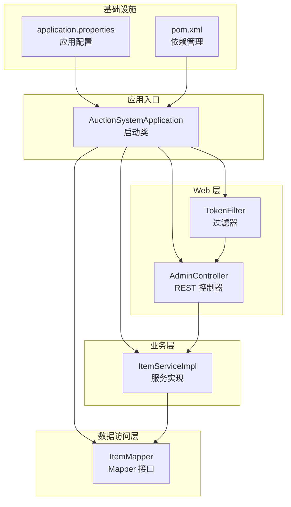
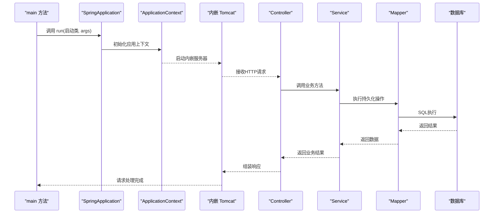
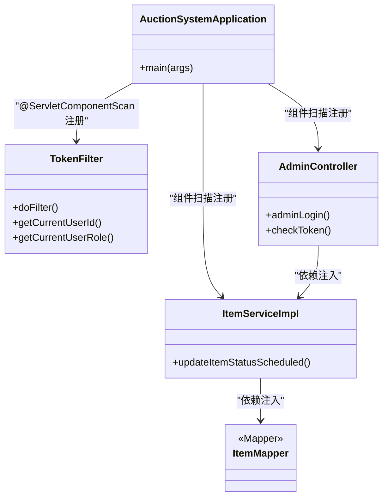
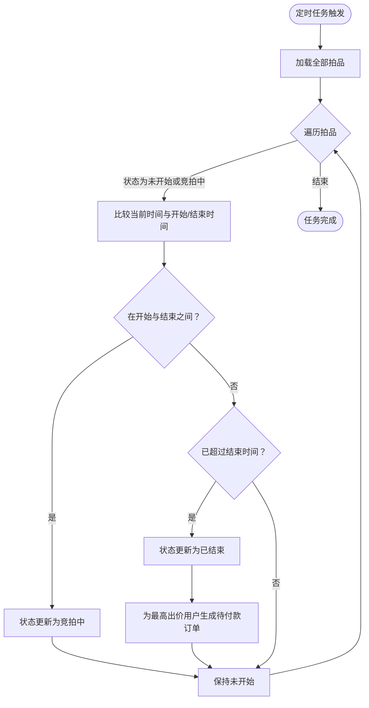
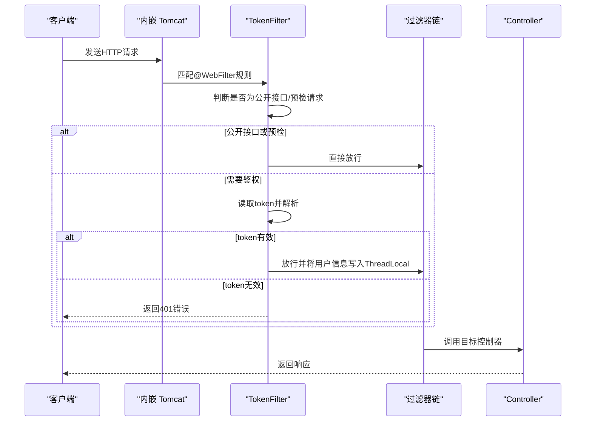
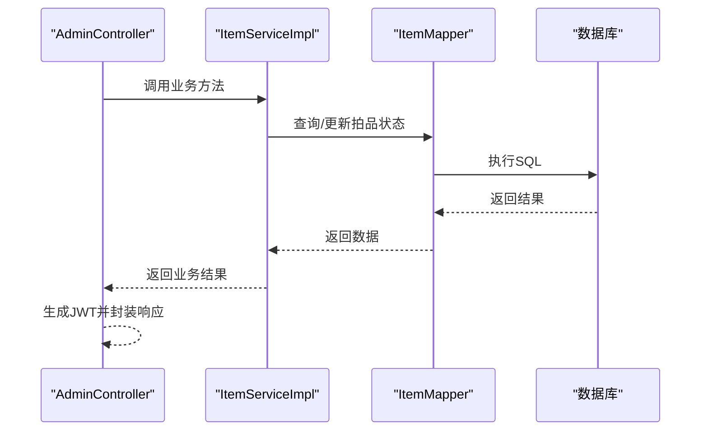
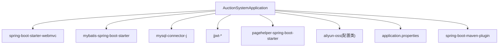

# 应用启动机制

<cite>
**本文引用的文件**
- [AuctionSystemApplication.java](file://src/main/java/com/qkl/auctionsystem/AuctionSystemApplication.java)
- [TokenFilter.java](file://src/main/java/com/qkl/auctionsystem/filter/TokenFilter.java)
- [ItemServiceImpl.java](file://src/main/java/com/qkl/auctionsystem/service/impl/ItemServiceImpl.java)
- [ItemMapper.java](file://src/main/java/com/qkl/auctionsystem/mapper/ItemMapper.java)
- [AdminController.java](file://src/main/java/com/qkl/auctionsystem/controller/AdminController.java)
- [JwtUtils.java](file://src/main/java/com/qkl/auctionsystem/utils/JwtUtils.java)
- [application.properties](file://src/main/resources/application.properties)
- [pom.xml](file://pom.xml)
</cite>

## 目录
1. [引言](#引言)
2. [项目结构](#项目结构)
3. [核心组件](#核心组件)
4. [架构总览](#架构总览)
5. [详细组件分析](#详细组件分析)
6. [依赖关系分析](#依赖关系分析)
7. [性能考量](#性能考量)
8. [故障排查指南](#故障排查指南)
9. [结论](#结论)

## 引言
本文件围绕 AuctionSystemApplication 启动类展开，系统性阐述其如何通过 @SpringBootApplication 实现自动配置、组件扫描与配置类加载；@EnableScheduling 如何启用定时任务支持，使系统每分钟自动检查拍品状态并更新；main 方法中 SpringApplication.run() 的执行流程，包括上下文初始化、Bean 工厂构建、内嵌 Tomcat 启动等关键步骤；以及 Spring 容器启动时对 Controller、Service、Mapper 等组件的注册过程，并说明 @ServletComponentScan 在过滤器注册中的作用。

## 项目结构
- 启动类位于 com.qkl.auctionsystem 包下，采用标准 Spring Boot 结构。
- 控制层、服务层、持久层、工具类、过滤器、实体与 DTO、MyBatis 映射文件等按功能模块组织。
- 配置文件 application.properties 提供端口、数据库连接、MyBatis 映射位置、阿里云 OSS 参数等基础配置。
- pom.xml 引入 web、MyBatis、MySQL、JWT、PageHelper 等依赖，支撑 Web MVC、数据库访问、鉴权与分页能力。

图表来源
- [AuctionSystemApplication.java](file://src/main/java/com/qkl/auctionsystem/AuctionSystemApplication.java#L1-L17)
- [AdminController.java](file://src/main/java/com/qkl/auctionsystem/controller/AdminController.java#L1-L73)
- [ItemServiceImpl.java](file://src/main/java/com/qkl/auctionsystem/service/impl/ItemServiceImpl.java#L1-L182)
- [ItemMapper.java](file://src/main/java/com/qkl/auctionsystem/mapper/ItemMapper.java#L1-L35)
- [TokenFilter.java](file://src/main/java/com/qkl/auctionsystem/filter/TokenFilter.java#L1-L141)
- [application.properties](file://src/main/resources/application.properties#L1-L20)
- [pom.xml](file://pom.xml#L1-L129)

章节来源
- [AuctionSystemApplication.java](file://src/main/java/com/qkl/auctionsystem/AuctionSystemApplication.java#L1-L17)
- [application.properties](file://src/main/resources/application.properties#L1-L20)
- [pom.xml](file://pom.xml#L1-L129)

## 核心组件
- 启动类与注解组合
  - @SpringBootApplication：整合自动配置、组件扫描与配置类加载，通常会扫描启动类所在包及其子包下的组件。
  - @EnableScheduling：开启基于注解的定时任务支持，配合 @Scheduled 使用。
  - @ServletComponentScan：启用对@WebServlet、@WebFilter、@WebListener等Servlet规范注解的扫描与注册。
- 定时任务
  - ItemServiceImpl 中定义了基于 cron 表达式的定时任务，每分钟检查拍品状态并更新，必要时生成订单。
- 过滤器
  - TokenFilter 基于 @WebFilter 注解声明，拦截所有请求，进行跨域预检放行、公开接口放行、JWT 令牌校验与用户信息透传。
- 配置
  - application.properties 提供端口、上下文路径、数据库连接、MyBatis 映射位置、阿里云 OSS 参数等。

章节来源
- [AuctionSystemApplication.java](file://src/main/java/com/qkl/auctionsystem/AuctionSystemApplication.java#L1-L17)
- [ItemServiceImpl.java](file://src/main/java/com/qkl/auctionsystem/service/impl/ItemServiceImpl.java#L108-L147)
- [TokenFilter.java](file://src/main/java/com/qkl/auctionsystem/filter/TokenFilter.java#L1-L141)
- [application.properties](file://src/main/resources/application.properties#L1-L20)

## 架构总览
下图展示了应用启动后，从 main 方法到 Web 请求处理、定时任务调度、数据库访问的整体交互。

图表来源
- [AuctionSystemApplication.java](file://src/main/java/com/qkl/auctionsystem/AuctionSystemApplication.java#L13-L15)
- [AdminController.java](file://src/main/java/com/qkl/auctionsystem/controller/AdminController.java#L1-L73)
- [ItemServiceImpl.java](file://src/main/java/com/qkl/auctionsystem/service/impl/ItemServiceImpl.java#L1-L182)
- [ItemMapper.java](file://src/main/java/com/qkl/auctionsystem/mapper/ItemMapper.java#L1-L35)
- [application.properties](file://src/main/resources/application.properties#L1-L20)

## 详细组件分析

### 启动类与自动配置、组件扫描、配置类加载
- @SpringBootApplication 的作用
  - 自动配置：根据类路径与依赖推断并应用合适的自动配置，如 Web MVC、MyBatis、数据源等。
  - 组件扫描：默认扫描启动类所在包及其子包下的组件（@Component、@Service、@Repository、@Controller 等）。
  - 配置类加载：允许通过 @ImportResource 或 @Import 导入额外配置类。
- @EnableScheduling
  - 开启基于注解的定时任务，需要在启动类或配置类上启用，以便容器识别 @Scheduled 方法。
- @ServletComponentScan
  - 启用对 @WebFilter、@WebServlet、@WebListener 的扫描与注册，使 TokenFilter 能被内嵌服务器识别并生效。
- main 方法执行流程
  - SpringApplication.run(...) 是应用启动的核心入口，负责：
    - 创建并刷新 ApplicationContext（含 BeanDefinition 注册、Bean 工厂构建、生命周期回调等）。
    - 启动内嵌 Web 服务器（默认 Tomcat），绑定端口与上下文路径。
    - 触发 ApplicationRunner/CommandLineRunner 等启动后钩子（如有）。
  - 对 Controller、Service、Mapper 等组件的注册：
    - @Controller、@RestController：通过组件扫描注册为 Web 控制器。
    - @Service：注册为业务服务 Bean。
    - @Mapper：通过 MyBatis Starter 注册为 Mapper Bean（接口级）。
    - @WebFilter：通过 @ServletComponentScan 注册为过滤器，拦截请求。

图表来源
- [AuctionSystemApplication.java](file://src/main/java/com/qkl/auctionsystem/AuctionSystemApplication.java#L1-L17)
- [TokenFilter.java](file://src/main/java/com/qkl/auctionsystem/filter/TokenFilter.java#L1-L141)
- [AdminController.java](file://src/main/java/com/qkl/auctionsystem/controller/AdminController.java#L1-L73)
- [ItemServiceImpl.java](file://src/main/java/com/qkl/auctionsystem/service/impl/ItemServiceImpl.java#L1-L182)
- [ItemMapper.java](file://src/main/java/com/qkl/auctionsystem/mapper/ItemMapper.java#L1-L35)

章节来源
- [AuctionSystemApplication.java](file://src/main/java/com/qkl/auctionsystem/AuctionSystemApplication.java#L1-L17)
- [TokenFilter.java](file://src/main/java/com/qkl/auctionsystem/filter/TokenFilter.java#L1-L141)
- [AdminController.java](file://src/main/java/com/qkl/auctionsystem/controller/AdminController.java#L1-L73)
- [ItemServiceImpl.java](file://src/main/java/com/qkl/auctionsystem/service/impl/ItemServiceImpl.java#L108-L147)
- [ItemMapper.java](file://src/main/java/com/qkl/auctionsystem/mapper/ItemMapper.java#L1-L35)

### 定时任务：拍品状态每分钟检查与更新
- 触发条件
  - @EnableScheduling 开启定时任务支持；ItemServiceImpl 中的 updateItemStatusScheduled() 使用 @Scheduled(cron = "0 * * * * ?") 指定每分钟执行一次。
- 执行逻辑
  - 获取全部拍品列表，遍历判断当前时间与拍品开始/结束时间的关系：
    - 若处于开始时间与结束时间之间且状态不为“竞拍中”，则更新为“竞拍中”。
    - 若当前时间已超过结束时间且状态不为“已结束”，则更新为“已结束”，并尝试为最高出价用户生成待付款订单。
- 关键点
  - 仅对状态为“未开始”或“竞拍中”的拍品进行处理，避免重复更新。
  - 订单生成异常会被捕获并记录日志，不影响整体定时任务执行。

图表来源
- [ItemServiceImpl.java](file://src/main/java/com/qkl/auctionsystem/service/impl/ItemServiceImpl.java#L108-L147)

章节来源
- [ItemServiceImpl.java](file://src/main/java/com/qkl/auctionsystem/service/impl/ItemServiceImpl.java#L108-L147)

### 过滤器注册：@ServletComponentScan 的作用
- TokenFilter 使用 @WebFilter(urlPatterns = "/*") 声明拦截所有请求。
- @ServletComponentScan 注解位于启动类，确保内嵌 Tomcat 能扫描到 TokenFilter 并将其注册为过滤器。
- 过滤器职责
  - 放行 OPTIONS 预检请求；
  - 对公开接口（如登录、注册、拍品列表、拍品详情、出价记录）直接放行；
  - 对非公开接口进行 JWT 令牌校验，解析用户身份并存入 ThreadLocal，便于后续业务使用；
  - 最终调用 filterChain.doFilter 并在 finally 中清理 ThreadLocal，防止内存泄漏。

图表来源
- [TokenFilter.java](file://src/main/java/com/qkl/auctionsystem/filter/TokenFilter.java#L1-L141)
- [AuctionSystemApplication.java](file://src/main/java/com/qkl/auctionsystem/AuctionSystemApplication.java#L1-L17)

章节来源
- [TokenFilter.java](file://src/main/java/com/qkl/auctionsystem/filter/TokenFilter.java#L1-L141)
- [AuctionSystemApplication.java](file://src/main/java/com/qkl/auctionsystem/AuctionSystemApplication.java#L1-L17)

### Controller、Service、Mapper 的注册与交互
- 组件注册
  - @RestController：注册为 Web 控制器，映射请求路径。
  - @Service：注册为业务服务 Bean，供控制器或其他服务注入。
  - @Mapper：注册为 Mapper Bean（接口级），MyBatis Starter 自动处理。
- 交互流程
  - 控制器接收请求，调用服务层方法；
  - 服务层执行业务逻辑，必要时访问 Mapper；
  - Mapper 通过 MyBatis 执行 SQL，返回结果；
  - 控制器组装响应返回给客户端。

图表来源
- [AdminController.java](file://src/main/java/com/qkl/auctionsystem/controller/AdminController.java#L1-L73)
- [ItemServiceImpl.java](file://src/main/java/com/qkl/auctionsystem/service/impl/ItemServiceImpl.java#L1-L182)
- [ItemMapper.java](file://src/main/java/com/qkl/auctionsystem/mapper/ItemMapper.java#L1-L35)

章节来源
- [AdminController.java](file://src/main/java/com/qkl/auctionsystem/controller/AdminController.java#L1-L73)
- [ItemServiceImpl.java](file://src/main/java/com/qkl/auctionsystem/service/impl/ItemServiceImpl.java#L1-L182)
- [ItemMapper.java](file://src/main/java/com/qkl/auctionsystem/mapper/ItemMapper.java#L1-L35)

## 依赖关系分析
- 启动类与外部依赖
  - spring-boot-starter-webmvc：提供 Web MVC 能力与内嵌 Tomcat。
  - mybatis-spring-boot-starter：集成 MyBatis，简化 Mapper 与 SQL Session 的配置。
  - mysql-connector-j：MySQL 驱动，配合数据源配置使用。
  - jjwt-*：JWT 令牌生成与解析能力。
  - pagehelper-spring-boot-starter：分页查询支持。
- 配置文件与运行参数
  - application.properties 指定 server.port、server.servlet.context-path、数据库连接、MyBatis 映射位置等。
- Maven 插件
  - spring-boot-maven-plugin：打包可执行 jar，支持启动类与依赖打包。

图表来源
- [pom.xml](file://pom.xml#L33-L97)
- [application.properties](file://src/main/resources/application.properties#L1-L20)

章节来源
- [pom.xml](file://pom.xml#L33-L97)
- [application.properties](file://src/main/resources/application.properties#L1-L20)

## 性能考量
- 定时任务复杂度
  - 每分钟遍历全部拍品，时间复杂度近似 O(N)，其中 N 为拍品总数。若拍品数量较大，建议：
    - 优化数据库索引（按状态、开始/结束时间建立索引）；
    - 分批处理或按状态筛选减少扫描范围；
    - 考虑异步化或消息队列驱动的状态变更。
- 过滤器链开销
  - TokenFilter 对每个请求进行简单判断与解析，开销较低；注意避免在 doFilter 中执行重逻辑。
- 数据库访问
  - Mapper 层尽量使用批量操作与合理 SQL，避免 N+1 查询；结合 PageHelper 进行分页。

[本节为通用指导，不直接分析具体文件]

## 故障排查指南
- 启动失败
  - 检查 application.properties 中端口占用、数据库连接参数是否正确。
  - 确认 pom.xml 中依赖版本兼容，特别是 Spring Boot 与 MyBatis 版本。
- 定时任务未执行
  - 确认 @EnableScheduling 已启用，且 @Scheduled 方法可见（非私有、非静态）。
  - 检查 cron 表达式是否符合预期。
- 过滤器不生效
  - 确认 @ServletComponentScan 已在启动类上启用，且 @WebFilter 注解正确配置。
  - 检查请求路径是否匹配 urlPatterns。
- JWT 问题
  - 校验签名密钥与过期时间设置，确保前后端一致。
  - 检查请求头 token 是否正确传递。

章节来源
- [application.properties](file://src/main/resources/application.properties#L1-L20)
- [pom.xml](file://pom.xml#L33-L97)
- [TokenFilter.java](file://src/main/java/com/qkl/auctionsystem/filter/TokenFilter.java#L1-L141)
- [JwtUtils.java](file://src/main/java/com/qkl/auctionsystem/utils/JwtUtils.java#L1-L36)

## 结论
AuctionSystemApplication 通过 @SpringBootApplication、@EnableScheduling、@ServletComponentScan 等注解，实现了自动配置、组件扫描与过滤器注册。main 方法中的 SpringApplication.run(...) 完成上下文初始化、Bean 工厂构建与内嵌 Tomcat 启动。系统在启动后，Controller、Service、Mapper 等组件协同工作，配合 TokenFilter 的统一鉴权与定时任务的状态检查，形成完整的 Web 应用运行机制。建议在高并发与大数据量场景下进一步优化数据库访问与定时任务策略，以提升整体性能与稳定性。