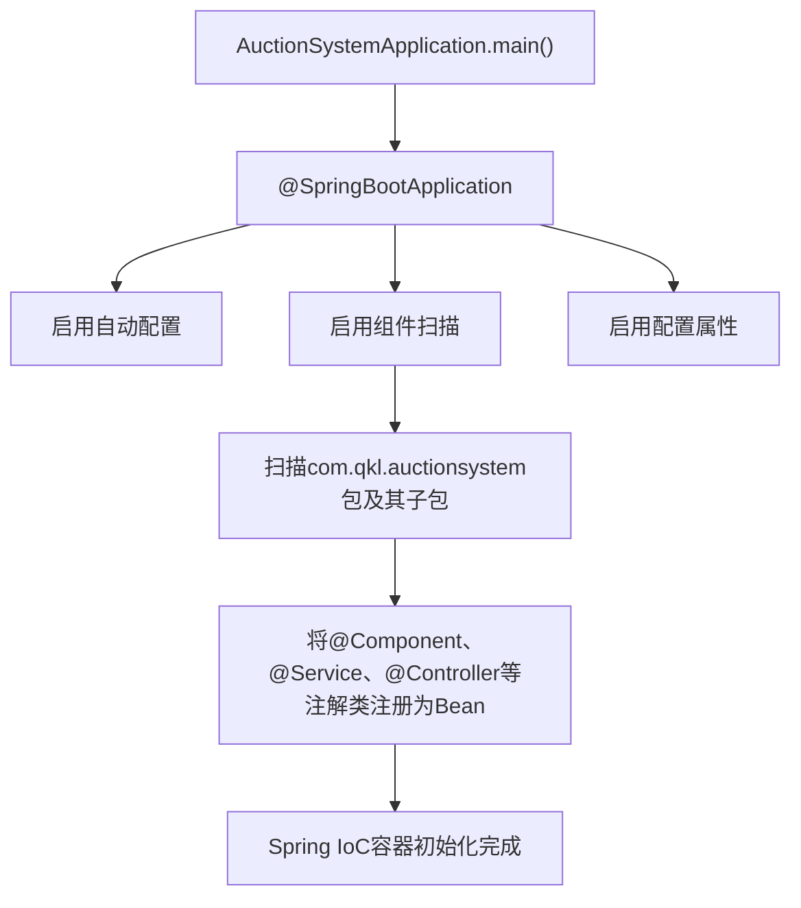
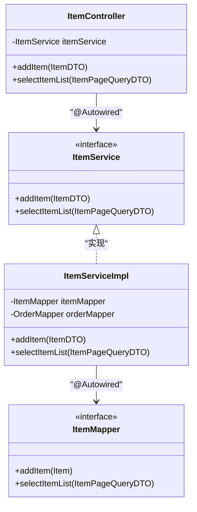
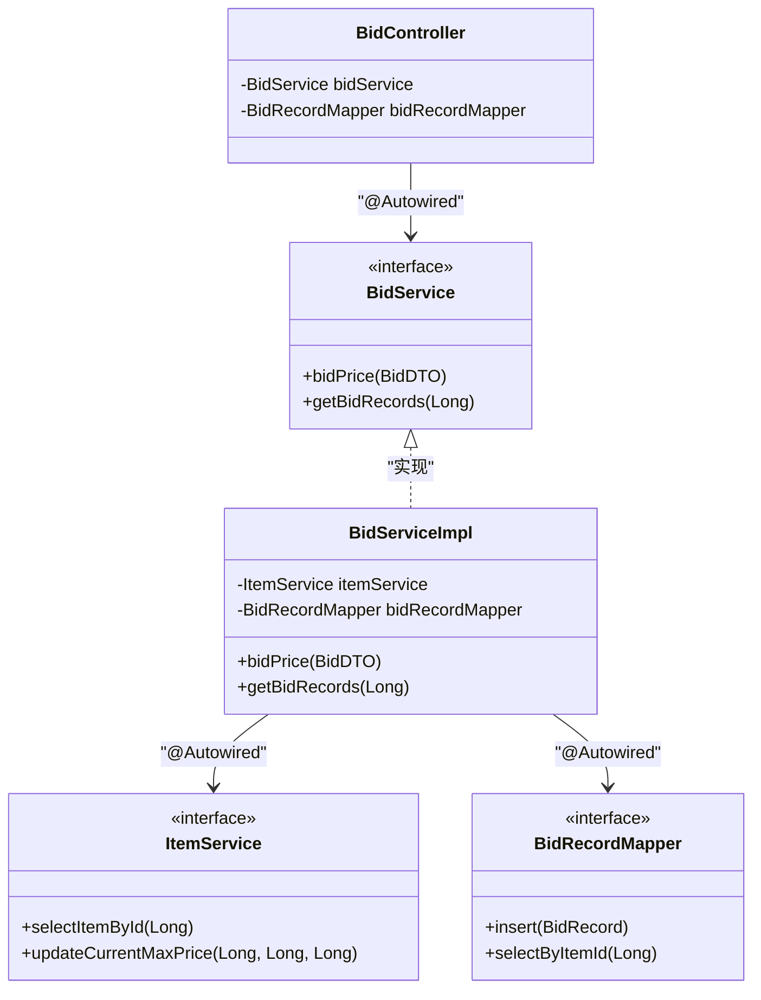
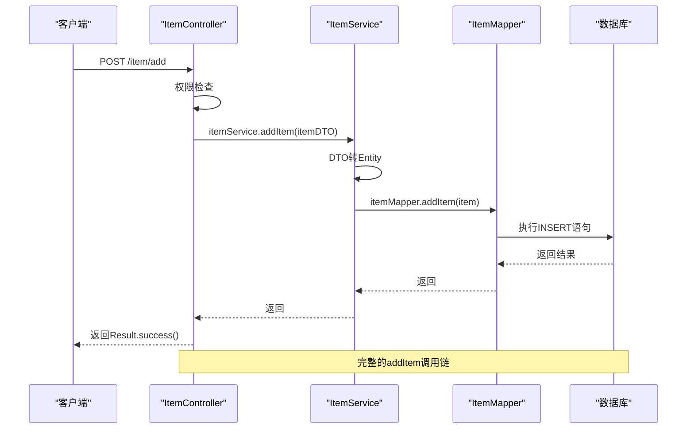
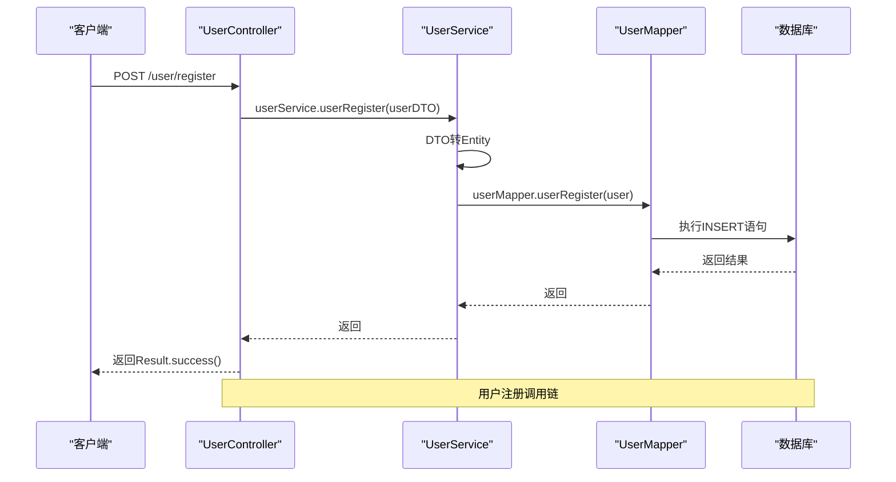
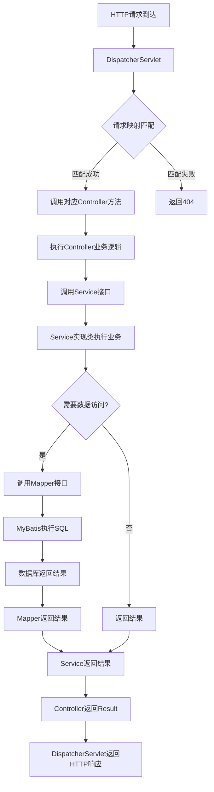
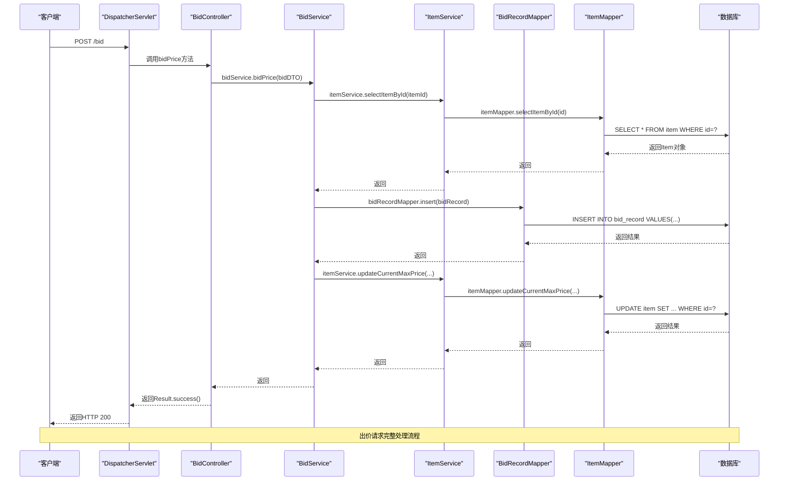
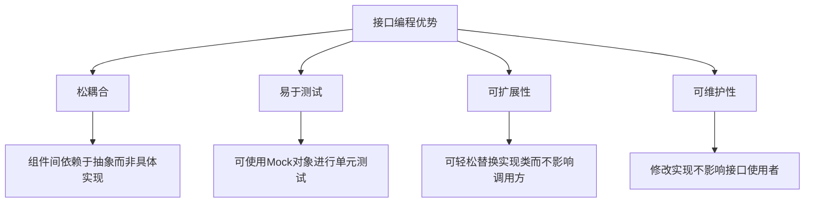

# 组件依赖与调用关系

<cite>
**本文档引用的文件**
- [AuctionSystemApplication.java](file://src/main/java/com/qkl/auctionsystem/AuctionSystemApplication.java)
- [ItemController.java](file://src/main/java/com/qkl/auctionsystem/controller/ItemController.java)
- [ItemService.java](file://src/main/java/com/qkl/auctionsystem/service/ItemService.java)
- [ItemServiceImpl.java](file://src/main/java/com/qkl/auctionsystem/service/impl/ItemServiceImpl.java)
- [ItemMapper.java](file://src/main/java/com/qkl/auctionsystem/mapper/ItemMapper.java)
- [BidController.java](file://src/main/java/com/qkl/auctionsystem/controller/BidController.java)
- [BidServiceImpl.java](file://src/main/java/com/qkl/auctionsystem/service/impl/BidServiceImpl.java)
- [UserController.java](file://src/main/java/com/qkl/auctionsystem/controller/UserController.java)
- [UserServiceImpl.java](file://src/main/java/com/qkl/auctionsystem/service/impl/UserServiceImpl.java)
- [UserMapper.java](file://src/main/java/com/qkl/auctionsystem/mapper/UserMapper.java)
- [application.properties](file://src/main/resources/application.properties)
- [pom.xml](file://pom.xml)
</cite>

## 目录
1. [引言](#引言)
2. [Spring IoC容器与Bean管理](#spring-ioc容器与bean管理)
3. [组件依赖关系分析](#组件依赖关系分析)
4. [核心调用链分析](#核心调用链分析)
5. [HTTP请求流转过程](#http请求流转过程)
6. [接口编程与依赖倒置原则](#接口编程与依赖倒置原则)
7. [总结](#总结)

## 引言
本项目是一个基于Spring Boot的拍卖系统，采用典型的分层架构设计，包含Controller、Service、Mapper三层。系统通过Spring IoC容器管理组件生命周期和依赖关系，实现了松耦合、高内聚的设计目标。本文档将深入分析系统中各组件间的依赖注入机制和调用关系，重点阐述从HTTP请求到数据库操作的完整执行链路。

## Spring IoC容器与Bean管理

### 启动类与组件扫描
`AuctionSystemApplication`作为Spring Boot应用的启动类，通过`@SpringBootApplication`注解启用自动配置、组件扫描和配置属性功能。该注解组合了`@ComponentScan`，会自动扫描主类所在包及其子包下的所有组件（如`@Controller`、`@Service`、`@Repository`等），并将它们注册为Spring容器中的Bean。



**图示来源**
- [AuctionSystemApplication.java](file://src/main/java/com/qkl/auctionsystem/AuctionSystemApplication.java#L10)

**本节来源**
- [AuctionSystemApplication.java](file://src/main/java/com/qkl/auctionsystem/AuctionSystemApplication.java#L1-L17)

## 组件依赖关系分析

### 控制层依赖注入
控制器组件（如`ItemController`）通过`@Autowired`注解注入服务接口实例，实现了控制层与业务逻辑层的解耦。这种基于接口的依赖注入方式使得系统具有良好的可扩展性和可测试性。



**图示来源**
- [ItemController.java](file://src/main/java/com/qkl/auctionsystem/controller/ItemController.java#L21-L22)
- [ItemService.java](file://src/main/java/com/qkl/auctionsystem/service/ItemService.java#L13)
- [ItemServiceImpl.java](file://src/main/java/com/qkl/auctionsystem/service/impl/ItemServiceImpl.java#L27-L31)
- [ItemMapper.java](file://src/main/java/com/qkl/auctionsystem/mapper/ItemMapper.java#L13)

### 服务层依赖注入
服务实现类（如`ItemServiceImpl`）通过`@Autowired`注入Mapper接口，完成数据访问操作。同时，某些服务类还依赖其他服务类，如`BidServiceImpl`依赖`ItemService`来获取拍品信息并更新最高出价。



**图示来源**
- [BidController.java](file://src/main/java/com/qkl/auctionsystem/controller/BidController.java#L23-L27)
- [BidService.java](file://src/main/java/com/qkl/auctionsystem/service/BidService.java#L8)
- [BidServiceImpl.java](file://src/main/java/com/qkl/auctionsystem/service/impl/BidServiceImpl.java#L23-L27)
- [ItemService.java](file://src/main/java/com/qkl/auctionsystem/service/ItemService.java#L18)

**本节来源**
- [ItemController.java](file://src/main/java/com/qkl/auctionsystem/controller/ItemController.java#L21-L22)
- [ItemServiceImpl.java](file://src/main/java/com/qkl/auctionsystem/service/impl/ItemServiceImpl.java#L27-L31)
- [BidController.java](file://src/main/java/com/qkl/auctionsystem/controller/BidController.java#L23-L27)
- [BidServiceImpl.java](file://src/main/java/com/qkl/auctionsystem/service/impl/BidServiceImpl.java#L23-L27)

## 核心调用链分析

### addItem调用链分析
以`ItemController.addItem()`方法为例，展示从控制器到数据访问层的完整调用链：



**图示来源**
- [ItemController.java](file://src/main/java/com/qkl/auctionsystem/controller/ItemController.java#L25-L33)
- [ItemServiceImpl.java](file://src/main/java/com/qkl/auctionsystem/service/impl/ItemServiceImpl.java#L34-L43)
- [ItemMapper.java](file://src/main/java/com/qkl/auctionsystem/mapper/ItemMapper.java#L14)

### 用户注册调用链分析
用户注册流程展示了服务层如何通过Mapper访问数据库：



**图示来源**
- [UserController.java](file://src/main/java/com/qkl/auctionsystem/controller/UserController.java#L24-L27)
- [UserServiceImpl.java](file://src/main/java/com/qkl/auctionsystem/service/impl/UserServiceImpl.java#L19-L25)
- [UserMapper.java](file://src/main/java/com/qkl/auctionsystem/mapper/UserMapper.java#L9)

**本节来源**
- [ItemController.java](file://src/main/java/com/qkl/auctionsystem/controller/ItemController.java#L25-L33)
- [ItemServiceImpl.java](file://src/main/java/com/qkl/auctionsystem/service/impl/ItemServiceImpl.java#L34-L43)
- [ItemMapper.java](file://src/main/java/com/qkl/auctionsystem/mapper/ItemMapper.java#L14)
- [UserController.java](file://src/main/java/com/qkl/auctionsystem/controller/UserController.java#L24-L27)
- [UserServiceImpl.java](file://src/main/java/com/qkl/auctionsystem/service/impl/UserServiceImpl.java#L19-L25)
- [UserMapper.java](file://src/main/java/com/qkl/auctionsystem/mapper/UserMapper.java#L9)

## HTTP请求流转过程

### 请求处理流程
当客户端发起HTTP请求时，请求在各组件间的流转过程如下：



**图示来源**
- [ItemController.java](file://src/main/java/com/qkl/auctionsystem/controller/ItemController.java#L16-L20)
- [ItemServiceImpl.java](file://src/main/java/com/qkl/auctionsystem/service/impl/ItemServiceImpl.java#L23-L24)
- [ItemMapper.java](file://src/main/java/com/qkl/auctionsystem/mapper/ItemMapper.java#L13)

### 出价请求处理示例
以用户出价请求为例，展示完整的请求处理流程：



**图示来源**
- [BidController.java](file://src/main/java/com/qkl/auctionsystem/controller/BidController.java#L29-L34)
- [BidServiceImpl.java](file://src/main/java/com/qkl/auctionsystem/service/impl/BidServiceImpl.java#L30-L52)
- [ItemService.java](file://src/main/java/com/qkl/auctionsystem/service/ItemService.java#L18-L28)
- [ItemMapper.java](file://src/main/java/com/qkl/auctionsystem/mapper/ItemMapper.java#L18-L28)

**本节来源**
- [BidController.java](file://src/main/java/com/qkl/auctionsystem/controller/BidController.java#L29-L34)
- [BidServiceImpl.java](file://src/main/java/com/qkl/auctionsystem/service/impl/BidServiceImpl.java#L30-L52)
- [ItemService.java](file://src/main/java/com/qkl/auctionsystem/service/ItemService.java#L18-L28)
- [ItemMapper.java](file://src/main/java/com/qkl/auctionsystem/mapper/ItemMapper.java#L18-L28)

## 接口编程与依赖倒置原则

### 接口编程优势
本系统广泛采用接口编程，各层之间通过接口进行通信，而非直接依赖具体实现类。这种设计带来了以下优势：



### 依赖倒置原则应用
系统严格遵循依赖倒置原则（DIP），高层模块不依赖低层模块，两者都依赖于抽象：

```mermaid
classDiagram
class HighLevelModule {
-Abstraction abstraction
}
class Abstraction {
<<interface>>
+operation()
}
class LowLevelModule {
+operation()
}
HighLevelModule --> Abstraction : "依赖"
LowLevelModule --> Abstraction : "实现"
note right of HighLevelModule
高层模块如Controller
依赖于抽象接口
end
note right of LowLevelModule
低层模块如Mapper实现
实现抽象接口
end
```

在本项目中：
- 高层模块：`ItemController`、`BidController`
- 抽象接口：`ItemService`、`BidService`、`ItemMapper`
- 低层模块：`ItemServiceImpl`、`BidServiceImpl`

**图示来源**
- [ItemController.java](file://src/main/java/com/qkl/auctionsystem/controller/ItemController.java#L21)
- [ItemService.java](file://src/main/java/com/qkl/auctionsystem/service/ItemService.java#L13)
- [ItemServiceImpl.java](file://src/main/java/com/qkl/auctionsystem/service/impl/ItemServiceImpl.java#L25)

**本节来源**
- [ItemController.java](file://src/main/java/com/qkl/auctionsystem/controller/ItemController.java#L21)
- [ItemService.java](file://src/main/java/com/qkl/auctionsystem/service/ItemService.java#L13)
- [ItemServiceImpl.java](file://src/main/java/com/qkl/auctionsystem/service/impl/ItemServiceImpl.java#L25)

## 总结
本系统通过Spring IoC容器实现了组件的自动扫描和依赖注入，构建了一个层次清晰、职责分明的分层架构。Controller层通过@Autowired注入Service接口，Service层注入Mapper接口，形成了完整的依赖链。系统采用接口编程和依赖倒置原则，提高了代码的可测试性、可扩展性和可维护性。从HTTP请求到数据库操作的完整调用链清晰明了，体现了Spring Boot框架在构建企业级应用中的强大能力。