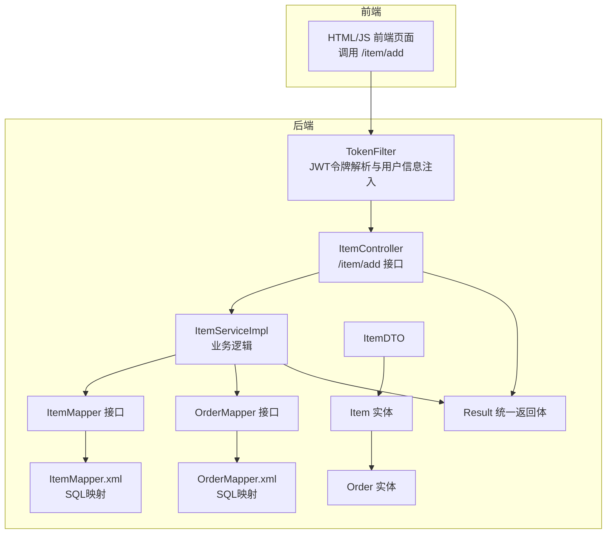
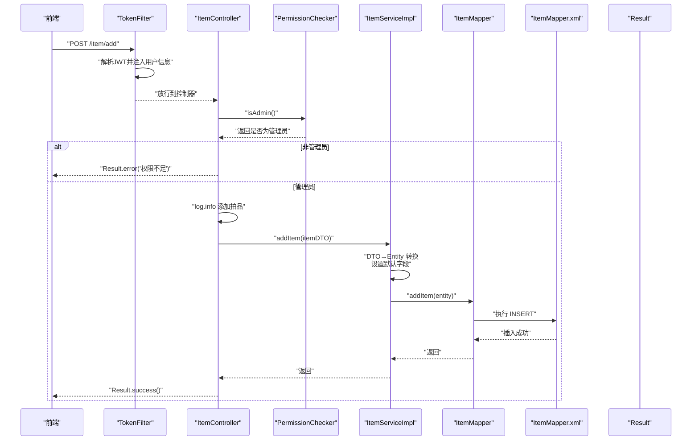
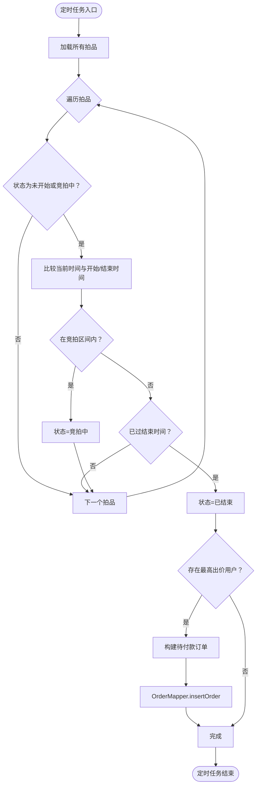
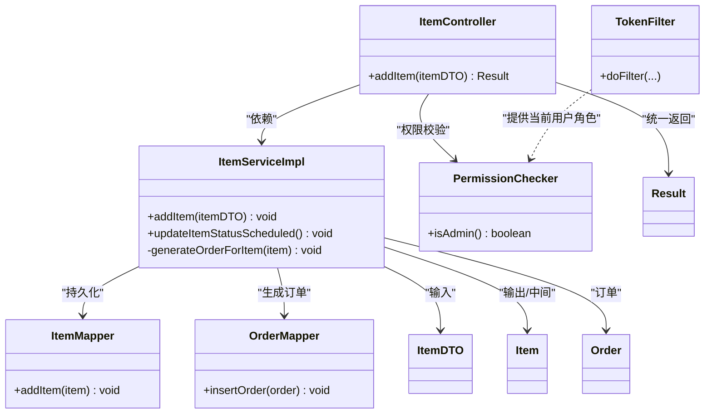
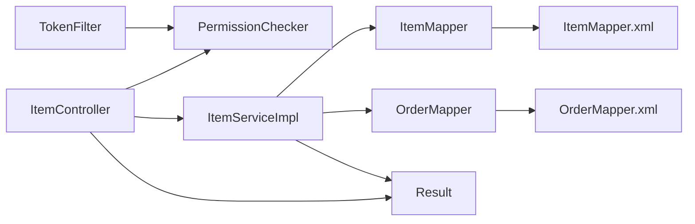

# 组件调用链路

<cite>
**本文引用的文件**
- [ItemController.java](file://src/main/java/com/qkl/auctionsystem/controller/ItemController.java)
- [ItemServiceImpl.java](file://src/main/java/com/qkl/auctionsystem/service/impl/ItemServiceImpl.java)
- [ItemMapper.java](file://src/main/java/com/qkl/auctionsystem/mapper/ItemMapper.java)
- [ItemMapper.xml](file://src/main/resources/mapper/ItemMapper.xml)
- [PermissionChecker.java](file://src/main/java/com/qkl/auctionsystem/utils/PermissionChecker.java)
- [TokenFilter.java](file://src/main/java/com/qkl/auctionsystem/filter/TokenFilter.java)
- [ItemDTO.java](file://src/main/java/com/qkl/auctionsystem/pojo/dto/ItemDTO.java)
- [Item.java](file://src/main/java/com/qkl/auctionsystem/pojo/entity/Item.java)
- [OrderMapper.java](file://src/main/java/com/qkl/auctionsystem/mapper/OrderMapper.java)
- [OrderMapper.xml](file://src/main/resources/mapper/OrderMapper.xml)
- [Order.java](file://src/main/java/com/qkl/auctionsystem/pojo/entity/Order.java)
- [Result.java](file://src/main/java/com/qkl/auctionsystem/result/Result.java)
</cite>

## 目录
1. [引言](#引言)
2. [项目结构](#项目结构)
3. [核心组件](#核心组件)
4. [架构总览](#架构总览)
5. [详细组件分析](#详细组件分析)
6. [依赖关系分析](#依赖关系分析)
7. [性能考量](#性能考量)
8. [故障排查指南](#故障排查指南)
9. [结论](#结论)

## 引言
本文件围绕“用户添加拍品”这一典型业务场景，完整梳理从HTTP请求到数据库操作的调用链路，覆盖以下要点：
- 前端调用 addItem 接口
- 控制层接收请求并进行权限校验
- 业务层执行数据转换与持久化
- 数据访问层执行SQL插入
- 日志记录与异常传播路径
- 定时任务 updateItemStatusScheduled 如何触发订单生成（跨服务协作）

## 项目结构
系统采用分层架构：控制层（Controller）、业务层（Service）、数据访问层（Mapper/MyBatis XML）、实体与DTO模型、统一返回体与过滤器。

图表来源
- [ItemController.java](file://src/main/java/com/qkl/auctionsystem/controller/ItemController.java#L24-L34)
- [ItemServiceImpl.java](file://src/main/java/com/qkl/auctionsystem/service/impl/ItemServiceImpl.java#L33-L43)
- [ItemMapper.java](file://src/main/java/com/qkl/auctionsystem/mapper/ItemMapper.java#L12-L14)
- [ItemMapper.xml](file://src/main/resources/mapper/ItemMapper.xml#L6-L39)
- [OrderMapper.java](file://src/main/java/com/qkl/auctionsystem/mapper/OrderMapper.java#L12-L14)
- [OrderMapper.xml](file://src/main/resources/mapper/OrderMapper.xml#L6-L15)
- [ItemDTO.java](file://src/main/java/com/qkl/auctionsystem/pojo/dto/ItemDTO.java#L1-L16)
- [Item.java](file://src/main/java/com/qkl/auctionsystem/pojo/entity/Item.java#L1-L34)
- [Order.java](file://src/main/java/com/qkl/auctionsystem/pojo/entity/Order.java#L1-L24)
- [Result.java](file://src/main/java/com/qkl/auctionsystem/result/Result.java#L1-L39)

章节来源
- [ItemController.java](file://src/main/java/com/qkl/auctionsystem/controller/ItemController.java#L1-L86)
- [ItemServiceImpl.java](file://src/main/java/com/qkl/auctionsystem/service/impl/ItemServiceImpl.java#L1-L182)
- [ItemMapper.java](file://src/main/java/com/qkl/auctionsystem/mapper/ItemMapper.java#L1-L35)
- [ItemMapper.xml](file://src/main/resources/mapper/ItemMapper.xml#L1-L109)
- [OrderMapper.java](file://src/main/java/com/qkl/auctionsystem/mapper/OrderMapper.java#L1-L19)
- [OrderMapper.xml](file://src/main/resources/mapper/OrderMapper.xml#L1-L15)
- [ItemDTO.java](file://src/main/java/com/qkl/auctionsystem/pojo/dto/ItemDTO.java#L1-L16)
- [Item.java](file://src/main/java/com/qkl/auctionsystem/pojo/entity/Item.java#L1-L34)
- [Order.java](file://src/main/java/com/qkl/auctionsystem/pojo/entity/Order.java#L1-L24)
- [Result.java](file://src/main/java/com/qkl/auctionsystem/result/Result.java#L1-L39)

## 核心组件
- 控制层：提供 /item/add 接口，负责接收请求、记录日志、进行权限校验，并调用业务层。
- 业务层：负责数据转换（DTO→Entity）、设置默认字段、调用数据访问层执行持久化；包含定时任务，按时间规则更新拍品状态并在结束后生成订单。
- 数据访问层：通过 MyBatis 映射 SQL，执行插入、查询、更新等操作。
- 权限与认证：基于 JWT 的 TokenFilter 在过滤阶段解析令牌并将用户信息注入到线程上下文，供 PermissionChecker 使用。
- 统一返回体：Result 提供统一的成功/失败响应格式。

章节来源
- [ItemController.java](file://src/main/java/com/qkl/auctionsystem/controller/ItemController.java#L24-L34)
- [ItemServiceImpl.java](file://src/main/java/com/qkl/auctionsystem/service/impl/ItemServiceImpl.java#L33-L43)
- [TokenFilter.java](file://src/main/java/com/qkl/auctionsystem/filter/TokenFilter.java#L56-L127)
- [PermissionChecker.java](file://src/main/java/com/qkl/auctionsystem/utils/PermissionChecker.java#L15-L18)
- [Result.java](file://src/main/java/com/qkl/auctionsystem/result/Result.java#L18-L36)

## 架构总览
下面以时序图形式展示“添加拍品”的完整调用链路，包括权限校验、日志记录、DTO→Entity转换、SQL插入以及异常传播路径。

图表来源
- [ItemController.java](file://src/main/java/com/qkl/auctionsystem/controller/ItemController.java#L24-L34)
- [PermissionChecker.java](file://src/main/java/com/qkl/auctionsystem/utils/PermissionChecker.java#L15-L18)
- [ItemServiceImpl.java](file://src/main/java/com/qkl/auctionsystem/service/impl/ItemServiceImpl.java#L33-L43)
- [ItemMapper.java](file://src/main/java/com/qkl/auctionsystem/mapper/ItemMapper.java#L12-L14)
- [ItemMapper.xml](file://src/main/resources/mapper/ItemMapper.xml#L6-L39)
- [Result.java](file://src/main/java/com/qkl/auctionsystem/result/Result.java#L18-L36)

## 详细组件分析

### 控制层：ItemController.addItem
- 责任边界：接收 /item/add 请求，进行权限校验，记录日志，调用业务层，封装统一返回。
- 关键点：
  - 权限校验：调用 PermissionChecker.isAdmin()，非管理员直接返回错误。
  - 日志：记录请求参数与操作行为。
  - 返回：使用 Result.success() 返回统一结构。

章节来源
- [ItemController.java](file://src/main/java/com/qkl/auctionsystem/controller/ItemController.java#L24-L34)

### 权限校验：PermissionChecker.isAdmin
- 依赖 TokenFilter 中存储的当前用户角色，判断是否为管理员（role==0）。
- 该工具类被控制器直接调用，确保仅管理员可执行添加拍品等敏感操作。

章节来源
- [PermissionChecker.java](file://src/main/java/com/qkl/auctionsystem/utils/PermissionChecker.java#L15-L18)
- [TokenFilter.java](file://src/main/java/com/qkl/auctionsystem/filter/TokenFilter.java#L27-L45)

### 业务层：ItemServiceImpl.addItem
- 数据转换：将 ItemDTO 复制到 Item 实体，设置创建/更新时间为当前时间，初始最高价为初始价格，状态默认为“未开始”，上架状态默认为“下架中”。
- 持久化：调用 ItemMapper.addItem 执行插入。
- 日志：记录操作信息，便于审计与排障。

章节来源
- [ItemServiceImpl.java](file://src/main/java/com/qkl/auctionsystem/service/impl/ItemServiceImpl.java#L33-L43)
- [ItemDTO.java](file://src/main/java/com/qkl/auctionsystem/pojo/dto/ItemDTO.java#L1-L16)
- [Item.java](file://src/main/java/com/qkl/auctionsystem/pojo/entity/Item.java#L1-L34)

### 数据访问层：ItemMapper.addItem 与 ItemMapper.xml
- 接口方法：addItem(Item item)
- XML映射：根据实体字段动态拼接列名与值，执行 INSERT。
- 复杂度：单条插入，时间复杂度 O(1)，空间复杂度 O(1)。

章节来源
- [ItemMapper.java](file://src/main/java/com/qkl/auctionsystem/mapper/ItemMapper.java#L12-L14)
- [ItemMapper.xml](file://src/main/resources/mapper/ItemMapper.xml#L6-L39)

### 定时任务：updateItemStatusScheduled 与订单生成
- 触发条件：每分钟执行一次（cron 表达式定义于 Scheduled 注解）。
- 逻辑流程：
  - 获取所有拍品，遍历判断当前时间与拍品开始/结束时间的关系。
  - 若处于竞拍区间则将状态置为“竞拍中”；若已结束则置为“已结束”，并尝试生成订单。
- 订单生成：
  - 若存在最高出价用户且最高价有效，则构建 Order 对象（状态为待付款），调用 OrderMapper.insertOrder 写入数据库。
  - 异常捕获：对订单生成过程中的异常进行日志记录与包装，避免中断定时任务。

图表来源
- [ItemServiceImpl.java](file://src/main/java/com/qkl/auctionsystem/service/impl/ItemServiceImpl.java#L114-L181)
- [OrderMapper.java](file://src/main/java/com/qkl/auctionsystem/mapper/OrderMapper.java#L12-L14)
- [OrderMapper.xml](file://src/main/resources/mapper/OrderMapper.xml#L6-L15)
- [Order.java](file://src/main/java/com/qkl/auctionsystem/pojo/entity/Order.java#L1-L24)

章节来源
- [ItemServiceImpl.java](file://src/main/java/com/qkl/auctionsystem/service/impl/ItemServiceImpl.java#L114-L181)
- [OrderMapper.java](file://src/main/java/com/qkl/auctionsystem/mapper/OrderMapper.java#L12-L14)
- [OrderMapper.xml](file://src/main/resources/mapper/OrderMapper.xml#L6-L15)
- [Order.java](file://src/main/java/com/qkl/auctionsystem/pojo/entity/Order.java#L1-L24)

### 类关系图（代码级）

图表来源
- [ItemController.java](file://src/main/java/com/qkl/auctionsystem/controller/ItemController.java#L24-L34)
- [ItemServiceImpl.java](file://src/main/java/com/qkl/auctionsystem/service/impl/ItemServiceImpl.java#L33-L43)
- [ItemMapper.java](file://src/main/java/com/qkl/auctionsystem/mapper/ItemMapper.java#L12-L14)
- [OrderMapper.java](file://src/main/java/com/qkl/auctionsystem/mapper/OrderMapper.java#L12-L14)
- [ItemDTO.java](file://src/main/java/com/qkl/auctionsystem/pojo/dto/ItemDTO.java#L1-L16)
- [Item.java](file://src/main/java/com/qkl/auctionsystem/pojo/entity/Item.java#L1-L34)
- [Order.java](file://src/main/java/com/qkl/auctionsystem/pojo/entity/Order.java#L1-L24)
- [PermissionChecker.java](file://src/main/java/com/qkl/auctionsystem/utils/PermissionChecker.java#L15-L18)
- [TokenFilter.java](file://src/main/java/com/qkl/auctionsystem/filter/TokenFilter.java#L56-L127)
- [Result.java](file://src/main/java/com/qkl/auctionsystem/result/Result.java#L18-L36)

## 依赖关系分析
- 控制层依赖业务层接口与权限工具类；业务层依赖数据访问层接口；数据访问层依赖 MyBatis XML 映射。
- TokenFilter 通过 ThreadLocal 注入当前用户信息，PermissionChecker 读取该信息进行权限判断。
- 定时任务在业务层内部，不直接暴露 HTTP 接口，但会调用 OrderMapper 生成订单，体现跨服务协作（业务层作为协调者）。

图表来源
- [TokenFilter.java](file://src/main/java/com/qkl/auctionsystem/filter/TokenFilter.java#L56-L127)
- [PermissionChecker.java](file://src/main/java/com/qkl/auctionsystem/utils/PermissionChecker.java#L15-L18)
- [ItemController.java](file://src/main/java/com/qkl/auctionsystem/controller/ItemController.java#L24-L34)
- [ItemServiceImpl.java](file://src/main/java/com/qkl/auctionsystem/service/impl/ItemServiceImpl.java#L33-L43)
- [ItemMapper.java](file://src/main/java/com/qkl/auctionsystem/mapper/ItemMapper.java#L12-L14)
- [OrderMapper.java](file://src/main/java/com/qkl/auctionsystem/mapper/OrderMapper.java#L12-L14)
- [ItemMapper.xml](file://src/main/resources/mapper/ItemMapper.xml#L6-L39)
- [OrderMapper.xml](file://src/main/resources/mapper/OrderMapper.xml#L6-L15)
- [Result.java](file://src/main/java/com/qkl/auctionsystem/result/Result.java#L18-L36)

## 性能考量
- 插入操作：单条插入，无索引冲突风险，性能稳定。
- 查询与分页：列表查询使用 PageHelper 分页，注意合理设置页码与页大小，避免超大结果集。
- 定时任务：每分钟扫描全量拍品，建议在拍品数量较大时考虑优化策略（如按状态/时间范围筛选、增加索引、异步化订单生成）。
- 日志：INFO 级别日志对性能影响较小，但应避免在高频路径打印大量对象内容。

## 故障排查指南
- 权限不足
  - 现象：返回错误提示“权限不足，只有管理员才能添加拍品”。
  - 排查：确认 TokenFilter 是否正确解析 JWT 并注入用户角色；确认 PermissionChecker 读取的角色是否为管理员。
  - 章节来源
    - [ItemController.java](file://src/main/java/com/qkl/auctionsystem/controller/ItemController.java#L24-L34)
    - [PermissionChecker.java](file://src/main/java/com/qkl/auctionsystem/utils/PermissionChecker.java#L15-L18)
    - [TokenFilter.java](file://src/main/java/com/qkl/auctionsystem/filter/TokenFilter.java#L56-L127)

- 订单生成失败
  - 现象：定时任务结束后日志记录订单生成失败，或抛出运行时异常。
  - 排查：检查 OrderMapper.insertOrder 的 SQL 与表结构一致性；确认当前拍品存在最高出价用户与最高价；查看异常堆栈定位具体原因。
  - 章节来源
    - [ItemServiceImpl.java](file://src/main/java/com/qkl/auctionsystem/service/impl/ItemServiceImpl.java#L153-L181)
    - [OrderMapper.java](file://src/main/java/com/qkl/auctionsystem/mapper/OrderMapper.java#L12-L14)
    - [OrderMapper.xml](file://src/main/resources/mapper/OrderMapper.xml#L6-L15)

- 插入失败
  - 现象：日志提示插入失败或数据库约束异常。
  - 排查：核对 ItemMapper.xml 中列名与值映射是否与实体一致；检查数据库表结构与字段类型；确认必填字段是否为空。
  - 章节来源
    - [ItemMapper.xml](file://src/main/resources/mapper/ItemMapper.xml#L6-L39)
    - [Item.java](file://src/main/java/com/qkl/auctionsystem/pojo/entity/Item.java#L1-L34)

## 结论
- “添加拍品”链路清晰：前端→TokenFilter→Controller→PermissionChecker→Service→Mapper→XML→数据库。
- DTO→Entity 转换与默认字段设置在业务层完成，保证了数据一致性与可维护性。
- 定时任务在拍品结束后自动触发订单生成，体现了业务层对跨模块协作的封装。
- 建议在高并发与大数据量场景下，进一步优化分页查询、索引设计与定时任务扫描范围，提升整体性能与稳定性。