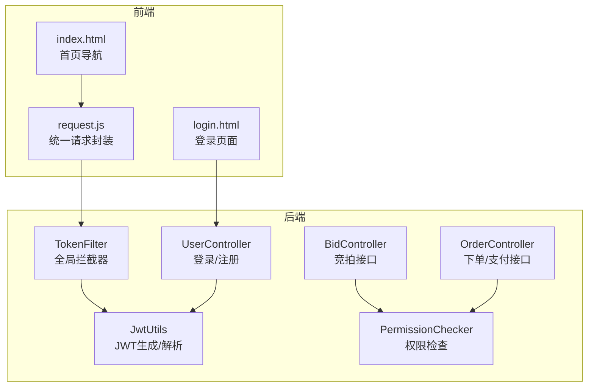
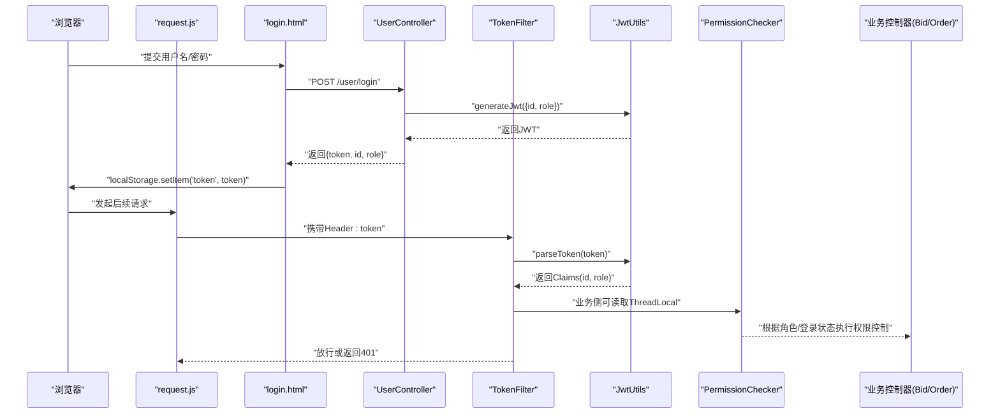
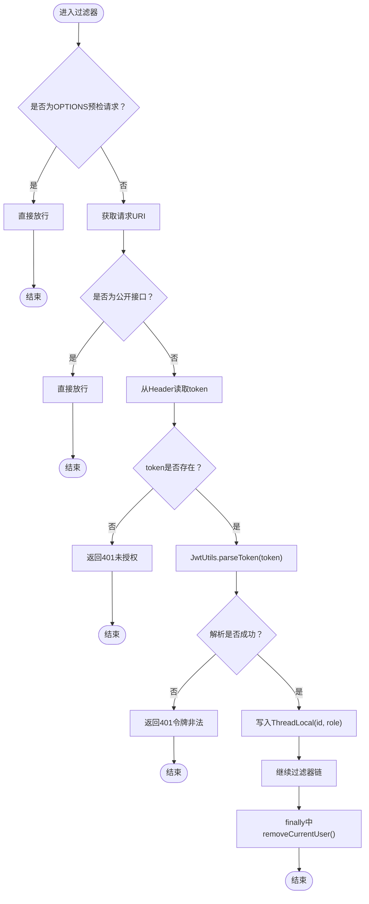
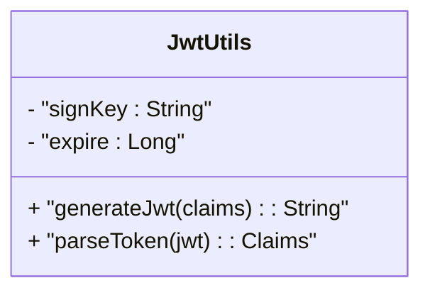
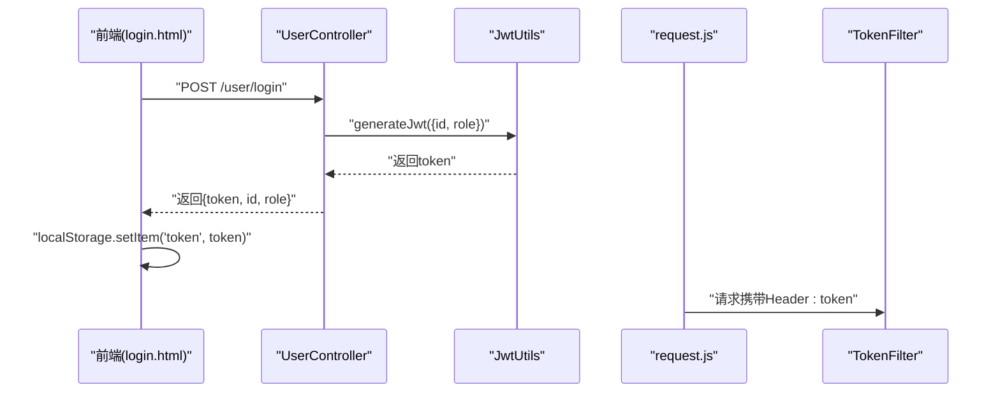
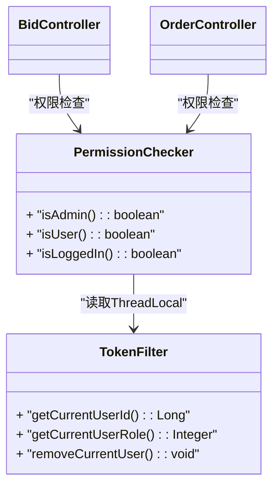
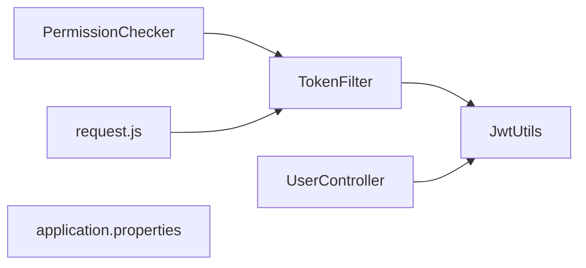

# JWT认证机制

<cite>
**本文引用的文件**
- [TokenFilter.java](file://src/main/java/com/qkl/auctionsystem/filter/TokenFilter.java)
- [JwtUtils.java](file://src/main/java/com/qkl/auctionsystem/utils/JwtUtils.java)
- [UserController.java](file://src/main/java/com/qkl/auctionsystem/controller/UserController.java)
- [PermissionChecker.java](file://src/main/java/com/qkl/auctionsystem/utils/PermissionChecker.java)
- [BidController.java](file://src/main/java/com/qkl/auctionsystem/controller/BidController.java)
- [OrderController.java](file://src/main/java/com/qkl/auctionsystem/controller/OrderController.java)
- [request.js](file://html/utils/request.js)
- [login.html](file://html/login.html)
- [index.html](file://html/index.html)
- [application.properties](file://src/main/resources/application.properties)
</cite>

## 目录
1. [简介](#简介)
2. [项目结构](#项目结构)
3. [核心组件](#核心组件)
4. [架构总览](#架构总览)
5. [详细组件分析](#详细组件分析)
6. [依赖关系分析](#依赖关系分析)
7. [性能考量](#性能考量)
8. [故障排查指南](#故障排查指南)
9. [结论](#结论)
10. [附录](#附录)

## 简介
本文件系统化记录 AuctionSystem 中基于 JWT 的身份认证实现，重点说明：
- TokenFilter 如何通过@WebFilter拦截所有请求，解析HTTP头部的token字段，并调用JwtUtils进行令牌验证；
- JwtUtils 使用 HS256 算法与预设 signKey 生成与解析 JWT 令牌，包含 claims（用户ID、角色）的封装与提取，以及 43200000 毫秒（12小时）的过期策略；
- 用户登录成功后如何生成 Token，前端如何在后续请求中携带 Token；
- TokenFilter 对非公开接口（竞拍、下单等）的强制校验流程；
- ThreadLocal 在请求链路中传递用户信息（ID、Role）的作用，以及在 finally 中调用 removeCurrentUser() 清理 ThreadLocal 防止内存泄漏；
- Token 被篡改或过期时的错误处理流程；
- OPTIONS 预检请求的放行机制以支持 CORS。

## 项目结构
围绕认证的关键模块分布如下：
- 过滤器层：TokenFilter 实现全局请求拦截与令牌校验
- 工具层：JwtUtils 提供 JWT 的生成与解析
- 控制器层：UserController 负责登录并签发 Token；其他业务控制器（如 BidController、OrderController）在需要鉴权的场景下可配合权限检查工具
- 前端层：request.js 统一封装请求，自动在请求头添加 token；login.html 展示登录流程并存储返回的 token

图表来源
- [TokenFilter.java](file://src/main/java/com/qkl/auctionsystem/filter/TokenFilter.java#L1-L141)
- [JwtUtils.java](file://src/main/java/com/qkl/auctionsystem/utils/JwtUtils.java#L1-L36)
- [UserController.java](file://src/main/java/com/qkl/auctionsystem/controller/UserController.java#L1-L49)
- [BidController.java](file://src/main/java/com/qkl/auctionsystem/controller/BidController.java#L1-L47)
- [OrderController.java](file://src/main/java/com/qkl/auctionsystem/controller/OrderController.java#L1-L43)
- [PermissionChecker.java](file://src/main/java/com/qkl/auctionsystem/utils/PermissionChecker.java#L1-L36)
- [request.js](file://html/utils/request.js#L1-L131)
- [login.html](file://html/login.html#L59-L99)
- [index.html](file://html/index.html#L1-L200)

章节来源
- [TokenFilter.java](file://src/main/java/com/qkl/auctionsystem/filter/TokenFilter.java#L1-L141)
- [JwtUtils.java](file://src/main/java/com/qkl/auctionsystem/utils/JwtUtils.java#L1-L36)
- [UserController.java](file://src/main/java/com/qkl/auctionsystem/controller/UserController.java#L1-L49)
- [BidController.java](file://src/main/java/com/qkl/auctionsystem/controller/BidController.java#L1-L47)
- [OrderController.java](file://src/main/java/com/qkl/auctionsystem/controller/OrderController.java#L1-L43)
- [PermissionChecker.java](file://src/main/java/com/qkl/auctionsystem/utils/PermissionChecker.java#L1-L36)
- [request.js](file://html/utils/request.js#L1-L131)
- [login.html](file://html/login.html#L59-L99)
- [index.html](file://html/index.html#L1-L200)

## 核心组件
- TokenFilter：全局拦截器，负责：
  - 放行 OPTIONS 预检请求（CORS）
  - 识别公开接口（无需 Token）
  - 从请求头读取 token 并调用 JwtUtils 解析
  - 将用户ID与角色写入 ThreadLocal，供后续业务使用
  - finally 中清理 ThreadLocal，避免内存泄漏
- JwtUtils：JWT 工具类，提供：
  - HS256 签名算法与固定 signKey
  - 生成带过期时间（12小时）的 JWT
  - 解析 JWT 并返回 Claims
- UserController：登录成功后构造 claims（id、role），调用 JwtUtils 生成 token 并返回给前端
- PermissionChecker：基于 ThreadLocal 的角色/登录状态检查工具
- request.js：前端统一请求封装，自动在请求头添加 token 字段
- login.html：登录成功后将 token 写入 localStorage，并跳转首页

章节来源
- [TokenFilter.java](file://src/main/java/com/qkl/auctionsystem/filter/TokenFilter.java#L1-L141)
- [JwtUtils.java](file://src/main/java/com/qkl/auctionsystem/utils/JwtUtils.java#L1-L36)
- [UserController.java](file://src/main/java/com/qkl/auctionsystem/controller/UserController.java#L1-L49)
- [PermissionChecker.java](file://src/main/java/com/qkl/auctionsystem/utils/PermissionChecker.java#L1-L36)
- [request.js](file://html/utils/request.js#L1-L131)
- [login.html](file://html/login.html#L59-L99)

## 架构总览
下图展示从浏览器到后端的完整认证链路，包括登录签发 Token、后续请求携带 Token、过滤器校验、业务控制器使用 ThreadLocal 传递用户信息、权限检查工具读取 ThreadLocal，以及错误处理与 CORS 放行。

图表来源
- [request.js](file://html/utils/request.js#L1-L131)
- [login.html](file://html/login.html#L59-L99)
- [UserController.java](file://src/main/java/com/qkl/auctionsystem/controller/UserController.java#L1-L49)
- [TokenFilter.java](file://src/main/java/com/qkl/auctionsystem/filter/TokenFilter.java#L1-L141)
- [JwtUtils.java](file://src/main/java/com/qkl/auctionsystem/utils/JwtUtils.java#L1-L36)
- [PermissionChecker.java](file://src/main/java/com/qkl/auctionsystem/utils/PermissionChecker.java#L1-L36)
- [BidController.java](file://src/main/java/com/qkl/auctionsystem/controller/BidController.java#L1-L47)
- [OrderController.java](file://src/main/java/com/qkl/auctionsystem/controller/OrderController.java#L1-L43)

## 详细组件分析

### TokenFilter：全局拦截与令牌校验
- 拦截范围：通过@WebFilter(urlPatterns="/*")拦截所有请求
- CORS 放行：对 OPTIONS 方法直接放行
- 公开接口判定：对注册、登录、管理员登录、拍品列表、拍品详情、竞拍记录等接口放行
- 令牌提取与校验：从请求头读取 token，调用 JwtUtils.parseToken 解析；解析失败返回 401
- ThreadLocal 传递：将 claims 中的 id、role 写入 ThreadLocal，供业务使用
- 清理策略：finally 中调用 removeCurrentUser() 清理 ThreadLocal，防止内存泄漏

图表来源
- [TokenFilter.java](file://src/main/java/com/qkl/auctionsystem/filter/TokenFilter.java#L1-L141)
- [JwtUtils.java](file://src/main/java/com/qkl/auctionsystem/utils/JwtUtils.java#L1-L36)

章节来源
- [TokenFilter.java](file://src/main/java/com/qkl/auctionsystem/filter/TokenFilter.java#L1-L141)

### JwtUtils：HS256签名与过期策略
- 签名算法：HS256
- 密钥：固定 signKey（位于工具类内部）
- 过期时间：43200000 毫秒（12小时）
- 生成流程：将自定义 claims（如 id、role）加入构建器，设置过期时间并签名 compact
- 解析流程：设置签名密钥，解析 JWS，返回 Claims

图表来源
- [JwtUtils.java](file://src/main/java/com/qkl/auctionsystem/utils/JwtUtils.java#L1-L36)

章节来源
- [JwtUtils.java](file://src/main/java/com/qkl/auctionsystem/utils/JwtUtils.java#L1-L36)

### 登录与前端携带 Token
- 登录签发：UserController 在用户登录成功后构造 claims（id、role），调用 JwtUtils.generateJwt 生成 token，并连同 id、role 一起返回给前端
- 前端存储：login.html 接收返回数据后，将 token 写入 localStorage
- 后续请求：request.js 统一在请求头添加 token 字段，确保后续接口调用均携带令牌

图表来源
- [UserController.java](file://src/main/java/com/qkl/auctionsystem/controller/UserController.java#L1-L49)
- [JwtUtils.java](file://src/main/java/com/qkl/auctionsystem/utils/JwtUtils.java#L1-L36)
- [request.js](file://html/utils/request.js#L1-L131)
- [login.html](file://html/login.html#L59-L99)

章节来源
- [UserController.java](file://src/main/java/com/qkl/auctionsystem/controller/UserController.java#L1-L49)
- [request.js](file://html/utils/request.js#L1-L131)
- [login.html](file://html/login.html#L59-L99)

### ThreadLocal 传递用户信息与权限检查
- TokenFilter 在解析出 Claims 后，将 id、role 写入 ThreadLocal，供业务使用
- PermissionChecker 通过读取 ThreadLocal 的当前用户角色/登录状态，判断是否为管理员、普通用户或已登录
- 业务控制器（如 BidController、OrderController）可在需要时调用 PermissionChecker 或直接读取 ThreadLocal 的用户信息

图表来源
- [TokenFilter.java](file://src/main/java/com/qkl/auctionsystem/filter/TokenFilter.java#L1-L141)
- [PermissionChecker.java](file://src/main/java/com/qkl/auctionsystem/utils/PermissionChecker.java#L1-L36)
- [BidController.java](file://src/main/java/com/qkl/auctionsystem/controller/BidController.java#L1-L47)
- [OrderController.java](file://src/main/java/com/qkl/auctionsystem/controller/OrderController.java#L1-L43)

章节来源
- [TokenFilter.java](file://src/main/java/com/qkl/auctionsystem/filter/TokenFilter.java#L1-L141)
- [PermissionChecker.java](file://src/main/java/com/qkl/auctionsystem/utils/PermissionChecker.java#L1-L36)
- [BidController.java](file://src/main/java/com/qkl/auctionsystem/controller/BidController.java#L1-L47)
- [OrderController.java](file://src/main/java/com/qkl/auctionsystem/controller/OrderController.java#L1-L43)

### 非公开接口的强制校验与业务使用
- 非公开接口（例如竞拍、下单等）在 TokenFilter 中不会被放行，必须携带有效 token 才能继续
- 业务控制器在需要时可通过 PermissionChecker 或直接读取 ThreadLocal 的用户信息，实现角色/权限控制
- 对于公开接口（如拍品列表、拍品详情、竞拍记录等），TokenFilter 不做校验，便于匿名浏览

章节来源
- [TokenFilter.java](file://src/main/java/com/qkl/auctionsystem/filter/TokenFilter.java#L1-L141)
- [BidController.java](file://src/main/java/com/qkl/auctionsystem/controller/BidController.java#L1-L47)
- [OrderController.java](file://src/main/java/com/qkl/auctionsystem/controller/OrderController.java#L1-L43)

### CORS 预检请求放行机制
- 对于 OPTIONS 预检请求，TokenFilter 直接放行，不进行任何令牌校验，保证跨域请求的正常建立

章节来源
- [TokenFilter.java](file://src/main/java/com/qkl/auctionsystem/filter/TokenFilter.java#L1-L141)

## 依赖关系分析
- TokenFilter 依赖 JwtUtils 进行令牌解析
- UserController 依赖 JwtUtils 生成 token
- PermissionChecker 依赖 TokenFilter 的 ThreadLocal 提供的角色/登录状态
- 前端 request.js 依赖浏览器 localStorage 存储 token，并在每次请求头中携带 token
- 应用上下文配置：application.properties 设置了服务端口与上下文路径，影响前端 BASE_URL 与后端路由前缀

图表来源
- [TokenFilter.java](file://src/main/java/com/qkl/auctionsystem/filter/TokenFilter.java#L1-L141)
- [JwtUtils.java](file://src/main/java/com/qkl/auctionsystem/utils/JwtUtils.java#L1-L36)
- [UserController.java](file://src/main/java/com/qkl/auctionsystem/controller/UserController.java#L1-L49)
- [PermissionChecker.java](file://src/main/java/com/qkl/auctionsystem/utils/PermissionChecker.java#L1-L36)
- [request.js](file://html/utils/request.js#L1-L131)
- [application.properties](file://src/main/resources/application.properties#L1-L20)

章节来源
- [application.properties](file://src/main/resources/application.properties#L1-L20)

## 性能考量
- TokenFilter 仅在非公开接口进行解析与校验，且解析成本较低，整体对性能影响有限
- ThreadLocal 仅在线程内存储用户信息，生命周期短，避免了频繁序列化/反序列化带来的开销
- 建议：
  - 保持 signKey 安全存储，避免泄露
  - 合理设置过期时间，平衡安全与用户体验
  - 对热点接口可考虑缓存部分非敏感信息，减少重复解析

## 故障排查指南
- 未携带 token：返回 401 未授权
- token 缺失或为空：返回 401 未授权
- token 非法或解析异常：返回 401 令牌非法
- token 过期：解析抛出异常，返回 401 令牌非法
- CORS 预检失败：确认 OPTIONS 请求是否被正确放行
- 前端未携带 token：检查 request.js 是否正确读取 localStorage 并写入 Header
- 角色/登录状态判断异常：确认 TokenFilter 是否已将 id、role 写入 ThreadLocal，且 finally 中已移除

章节来源
- [TokenFilter.java](file://src/main/java/com/qkl/auctionsystem/filter/TokenFilter.java#L1-L141)
- [request.js](file://html/utils/request.js#L1-L131)

## 结论
AuctionSystem 的 JWT 认证方案通过 TokenFilter 全局拦截、JwtUtils 统一签名与解析、前端 request.js 自动携带 token，实现了简洁可靠的无状态认证。配合 ThreadLocal 在请求链路中传递用户信息与 PermissionChecker 的权限判断，既满足了业务需求，又具备良好的扩展性与安全性。同时，对 OPTIONS 预检请求的放行保障了 CORS 的正常使用。

## 附录
- 关键实现位置参考：
  - TokenFilter：[TokenFilter.java](file://src/main/java/com/qkl/auctionsystem/filter/TokenFilter.java#L1-L141)
  - JwtUtils：[JwtUtils.java](file://src/main/java/com/qkl/auctionsystem/utils/JwtUtils.java#L1-L36)
  - 登录与签发：[UserController.java](file://src/main/java/com/qkl/auctionsystem/controller/UserController.java#L1-L49)
  - 前端请求封装与 token 携带：[request.js](file://html/utils/request.js#L1-L131)
  - 登录页面与 token 存储：[login.html](file://html/login.html#L59-L99)
  - 首页导航与登录状态检测：[index.html](file://html/index.html#L1-L200)
  - 应用配置（端口/上下文）：[application.properties](file://src/main/resources/application.properties#L1-L20)