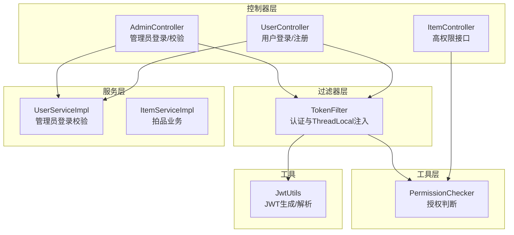
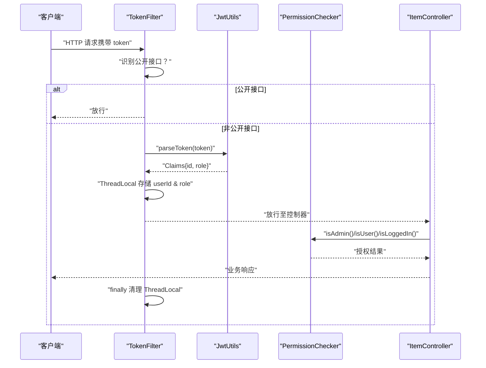
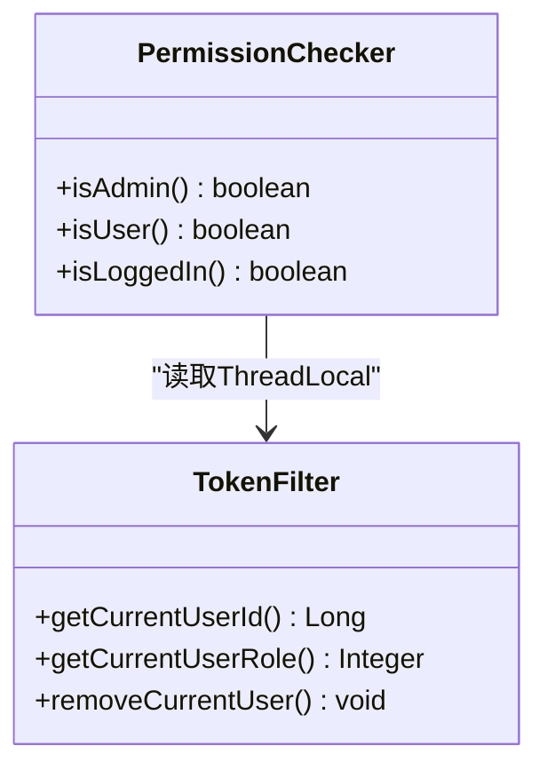
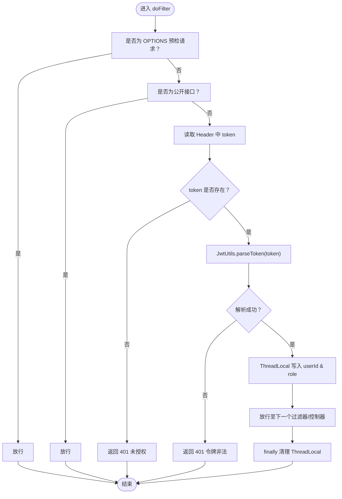
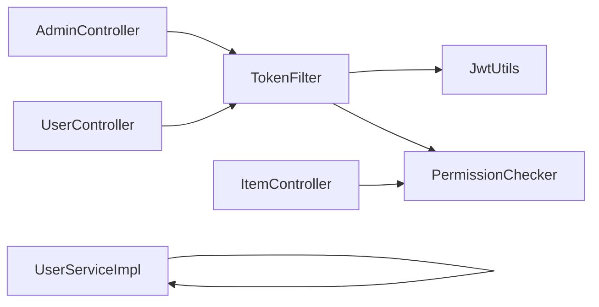

# 基于角色的权限控制

<cite>
**本文引用的文件**
- [PermissionChecker.java](file://src/main/java/com/qkl/auctionsystem/utils/PermissionChecker.java)
- [TokenFilter.java](file://src/main/java/com/qkl/auctionsystem/filter/TokenFilter.java)
- [ItemController.java](file://src/main/java/com/qkl/auctionsystem/controller/ItemController.java)
- [AdminController.java](file://src/main/java/com/qkl/auctionsystem/controller/AdminController.java)
- [UserController.java](file://src/main/java/com/qkl/auctionsystem/controller/UserController.java)
- [说明.md](file://说明.md)
- [JwtUtils.java](file://src/main/java/com/qkl/auctionsystem/utils/JwtUtils.java)
- [UserServiceImpl.java](file://src/main/java/com/qkl/auctionsystem/service/impl/UserServiceImpl.java)
- [ItemServiceImpl.java](file://src/main/java/com/qkl/auctionsystem/service/impl/ItemServiceImpl.java)
</cite>

## 目录
1. [引言](#引言)
2. [项目结构](#项目结构)
3. [核心组件](#核心组件)
4. [架构总览](#架构总览)
5. [详细组件分析](#详细组件分析)
6. [依赖关系分析](#依赖关系分析)
7. [性能考量](#性能考量)
8. [故障排查指南](#故障排查指南)
9. [结论](#结论)
10. [附录](#附录)

## 引言
本文件围绕 AuctionSystem 的细粒度权限控制设计展开，重点阐述 PermissionChecker 工具类如何借助 TokenFilter 中存储在 ThreadLocal 的用户角色信息（role），通过 isAdmin()、isUser()、isLoggedIn() 等静态方法实现角色判断逻辑。结合说明.md 中的权限规则，系统通过“认证 + 授权”的两阶段控制，确保只有管理员（role=0）能够执行高权限操作（如添加/修改/删除拍品），而普通用户（role=1）仅能访问开放接口与自身相关接口。文档还提供 Controller 层调用 PermissionChecker 的示例路径与 TokenFilter 协同工作流程，并讨论该设计的简洁性与局限性及扩展方向。

## 项目结构
- 权限控制相关核心文件：
  - 过滤器：TokenFilter（负责认证与上下文注入）
  - 工具类：PermissionChecker（负责授权判断）
  - 控制器：ItemController（高权限接口）、AdminController（管理员登录/校验）、UserController（用户登录/注册）
  - 工具：JwtUtils（JWT 生成与解析）
  - 服务：UserServiceImpl（管理员登录校验）、ItemServiceImpl（拍品业务）
- 权限规则来源：说明.md 中对角色权限校验的约束与接口定义

图表来源
- [TokenFilter.java](file://src/main/java/com/qkl/auctionsystem/filter/TokenFilter.java#L1-L141)
- [PermissionChecker.java](file://src/main/java/com/qkl/auctionsystem/utils/PermissionChecker.java#L1-L36)
- [ItemController.java](file://src/main/java/com/qkl/auctionsystem/controller/ItemController.java#L1-L86)
- [AdminController.java](file://src/main/java/com/qkl/auctionsystem/controller/AdminController.java#L1-L73)
- [UserController.java](file://src/main/java/com/qkl/auctionsystem/controller/UserController.java#L1-L49)
- [JwtUtils.java](file://src/main/java/com/qkl/auctionsystem/utils/JwtUtils.java#L1-L36)
- [UserServiceImpl.java](file://src/main/java/com/qkl/auctionsystem/service/impl/UserServiceImpl.java#L1-L59)
- [ItemServiceImpl.java](file://src/main/java/com/qkl/auctionsystem/service/impl/ItemServiceImpl.java#L1-L182)

章节来源
- [说明.md](file://说明.md#L98-L103)

## 核心组件
- TokenFilter：全局过滤器，拦截所有请求，识别公开接口后放行；对非公开接口进行 JWT 校验，解析 claims 中的用户ID与角色，写入 ThreadLocal，并在 finally 中清理，防止内存泄漏。
- PermissionChecker：静态工具类，封装 isAdmin()/isUser()/isLoggedIn() 三个判断方法，底层统一读取 TokenFilter 中的 ThreadLocal 数据，实现轻量授权。
- ItemController：集中承载高权限接口（添加/修改/删除拍品），在每个方法入口处调用 PermissionChecker.isAdmin() 进行授权校验。
- AdminController：管理员登录接口，生成包含 role=0 的 JWT；提供 token 校验接口，内部直接读取 TokenFilter 中的 ThreadLocal 以返回当前用户信息。
- UserController：用户登录接口，生成包含 role=1 的 JWT；用户注册接口默认角色为1。
- JwtUtils：JWT 生成与解析工具，为 TokenFilter 与控制器生成/解析令牌提供支撑。
- UserServiceImpl：管理员登录时校验角色必须为0，确保只有管理员能获取管理员令牌。

章节来源
- [TokenFilter.java](file://src/main/java/com/qkl/auctionsystem/filter/TokenFilter.java#L1-L141)
- [PermissionChecker.java](file://src/main/java/com/qkl/auctionsystem/utils/PermissionChecker.java#L1-L36)
- [ItemController.java](file://src/main/java/com/qkl/auctionsystem/controller/ItemController.java#L1-L86)
- [AdminController.java](file://src/main/java/com/qkl/auctionsystem/controller/AdminController.java#L1-L73)
- [UserController.java](file://src/main/java/com/qkl/auctionsystem/controller/UserController.java#L1-L49)
- [JwtUtils.java](file://src/main/java/com/qkl/auctionsystem/utils/JwtUtils.java#L1-L36)
- [UserServiceImpl.java](file://src/main/java/com/qkl/auctionsystem/service/impl/UserServiceImpl.java#L1-L59)

## 架构总览
整体采用“过滤器认证 + 工具类授权”的分层设计：
- 认证阶段：TokenFilter 在 doFilter 中完成 CORS 预检放行、公开接口放行、JWT 校验、claims 解析、ThreadLocal 注入与 finally 清理。
- 授权阶段：各业务 Controller 在关键接口入口调用 PermissionChecker，依据 ThreadLocal 中的角色信息决定是否放行。
- 令牌内容：JwtUtils 生成的 JWT 中包含 id 与 role，分别对应用户ID与角色，供后续授权判断使用。

图表来源
- [TokenFilter.java](file://src/main/java/com/qkl/auctionsystem/filter/TokenFilter.java#L55-L127)
- [JwtUtils.java](file://src/main/java/com/qkl/auctionsystem/utils/JwtUtils.java#L26-L36)
- [PermissionChecker.java](file://src/main/java/com/qkl/auctionsystem/utils/PermissionChecker.java#L11-L36)
- [ItemController.java](file://src/main/java/com/qkl/auctionsystem/controller/ItemController.java#L24-L34)

## 详细组件分析

### PermissionChecker 工具类
- 设计要点
  - 三个静态方法：isAdmin()、isUser()、isLoggedIn()，均从 TokenFilter.getCurrentUserId()/getCurrentUserRole() 读取 ThreadLocal 数据，避免在业务层重复解析 JWT。
  - 逻辑简单明确：isAdmin() 要求 role=0；isUser() 要求 role=1；isLoggedIn() 要求 userId 非空。
- 适用场景
  - 高权限接口前置校验：如拍品的添加/修改/删除。
  - 低权限接口（如出价、订单查询）通常仅需登录校验，可使用 isLoggedIn()。
- 错误处理
  - 若 ThreadLocal 未设置或为空，相应判断会返回 false 或 null，业务侧应按需返回“权限不足”或“未登录”。

图表来源
- [PermissionChecker.java](file://src/main/java/com/qkl/auctionsystem/utils/PermissionChecker.java#L11-L36)
- [TokenFilter.java](file://src/main/java/com/qkl/auctionsystem/filter/TokenFilter.java#L23-L45)

章节来源
- [PermissionChecker.java](file://src/main/java/com/qkl/auctionsystem/utils/PermissionChecker.java#L11-L36)

### TokenFilter 过滤器
- 认证流程
  - 放行 OPTIONS 预检请求。
  - 识别公开接口（如登录/注册、拍品列表、拍品详情、竞拍记录等），不进行 token 校验。
  - 非公开接口要求携带 token，解析失败或缺失时返回 401。
  - 解析成功后，从 claims 中提取 id 与 role，写入 ThreadLocal。
  - finally 中移除 ThreadLocal，避免线程复用导致的数据残留。
- 与控制器协作
  - 控制器通过 PermissionChecker 间接使用 ThreadLocal 中的用户信息。
  - 管理员接口（如 /admin/check-token）直接读取 ThreadLocal 返回当前用户信息。

图表来源
- [TokenFilter.java](file://src/main/java/com/qkl/auctionsystem/filter/TokenFilter.java#L55-L127)
- [JwtUtils.java](file://src/main/java/com/qkl/auctionsystem/utils/JwtUtils.java#L26-L36)

章节来源
- [TokenFilter.java](file://src/main/java/com/qkl/auctionsystem/filter/TokenFilter.java#L55-L127)

### Controller 层调用 PermissionChecker 的示例
- 添加拍品
  - 调用路径：ItemController.addItem(...) -> PermissionChecker.isAdmin()
  - 若返回 false，直接返回“权限不足”
  - 参考路径：[ItemController.addItem(...)](file://src/main/java/com/qkl/auctionsystem/controller/ItemController.java#L24-L34)
- 删除拍品
  - 调用路径：ItemController.deleteItemByIds(...) -> PermissionChecker.isAdmin()
  - 若返回 false，直接返回“权限不足”
  - 参考路径：[ItemController.deleteItemByIds(...)](file://src/main/java/com/qkl/auctionsystem/controller/ItemController.java#L56-L66)
- 修改拍品
  - 调用路径：ItemController.updateItem(...) -> PermissionChecker.isAdmin()
  - 若返回 false，直接返回“权限不足”
  - 参考路径：[ItemController.updateItem(...)](file://src/main/java/com/qkl/auctionsystem/controller/ItemController.java#L68-L78)
- 管理员登录/校验
  - AdminController.adminLogin(...) 生成包含 role=0 的 JWT
  - AdminController.checkToken(...) 直接读取 TokenFilter 中的 ThreadLocal 返回当前用户信息
  - 参考路径：
    - [AdminController.adminLogin(...)](file://src/main/java/com/qkl/auctionsystem/controller/AdminController.java#L30-L51)
    - [AdminController.checkToken(...)](file://src/main/java/com/qkl/auctionsystem/controller/AdminController.java#L57-L72)

章节来源
- [ItemController.java](file://src/main/java/com/qkl/auctionsystem/controller/ItemController.java#L24-L34)
- [ItemController.java](file://src/main/java/com/qkl/auctionsystem/controller/ItemController.java#L56-L66)
- [ItemController.java](file://src/main/java/com/qkl/auctionsystem/controller/ItemController.java#L68-L78)
- [AdminController.java](file://src/main/java/com/qkl/auctionsystem/controller/AdminController.java#L30-L51)
- [AdminController.java](file://src/main/java/com/qkl/auctionsystem/controller/AdminController.java#L57-L72)

### 与说明.md 权限规则的对照
- 角色与权限
  - role=0：管理员，具备添加/修改/删除拍品等高权限能力。
  - role=1：普通用户，仅能访问开放接口与自身相关接口。
- 接口与权限
  - 添加/修改/删除拍品：需要 role=0。
  - 出价、订单相关接口：仅需登录（role=0/1 均可）。
- 实现依据
  - 说明.md 明确“添加/修改拍品接口额外校验 role=0”，这与 ItemController 中对 PermissionChecker.isAdmin() 的调用一致。
  - 说明.md 明确“出价、订单相关接口仅校验登录”，这与 PermissionChecker.isLoggedIn() 的使用场景一致。

章节来源
- [说明.md](file://说明.md#L98-L103)
- [ItemController.java](file://src/main/java/com/qkl/auctionsystem/controller/ItemController.java#L24-L34)
- [ItemController.java](file://src/main/java/com/qkl/auctionsystem/controller/ItemController.java#L56-L66)
- [ItemController.java](file://src/main/java/com/qkl/auctionsystem/controller/ItemController.java#L68-L78)

### 令牌生成与角色绑定
- 用户登录：UserController.userLogin(...) 生成 JWT，claims 中包含 id 与 role=1。
- 管理员登录：AdminController.adminLogin(...) 生成 JWT，claims 中包含 id 与 role=0。
- 管理员登录校验：UserServiceImpl.adminLogin(...) 校验用户角色必须为 0。
- 令牌解析：TokenFilter.doFilter(...) 使用 JwtUtils.parseToken(...) 解析 claims 并写入 ThreadLocal。

章节来源
- [UserController.java](file://src/main/java/com/qkl/auctionsystem/controller/UserController.java#L30-L48)
- [AdminController.java](file://src/main/java/com/qkl/auctionsystem/controller/AdminController.java#L30-L51)
- [UserServiceImpl.java](file://src/main/java/com/qkl/auctionsystem/service/impl/UserServiceImpl.java#L42-L57)
- [JwtUtils.java](file://src/main/java/com/qkl/auctionsystem/utils/JwtUtils.java#L18-L36)
- [TokenFilter.java](file://src/main/java/com/qkl/auctionsystem/filter/TokenFilter.java#L96-L109)

## 依赖关系分析
- 组件耦合
  - ItemController 依赖 PermissionChecker 进行授权判断，耦合点清晰，职责单一。
  - PermissionChecker 依赖 TokenFilter 的 ThreadLocal 接口，形成“工具类-过滤器”的轻量依赖。
  - TokenFilter 依赖 JwtUtils 进行令牌解析，依赖 Result 进行统一响应。
- 可能的循环依赖
  - 当前结构无循环依赖：过滤器 -> 工具类 -> 控制器，方向单向。
- 外部依赖
  - JWT 库（io.jsonwebtoken）用于签名与解析。
  - Spring MVC 用于控制器映射与过滤器配置。

图表来源
- [TokenFilter.java](file://src/main/java/com/qkl/auctionsystem/filter/TokenFilter.java#L1-L141)
- [JwtUtils.java](file://src/main/java/com/qkl/auctionsystem/utils/JwtUtils.java#L1-L36)
- [PermissionChecker.java](file://src/main/java/com/qkl/auctionsystem/utils/PermissionChecker.java#L1-L36)
- [ItemController.java](file://src/main/java/com/qkl/auctionsystem/controller/ItemController.java#L1-L86)
- [AdminController.java](file://src/main/java/com/qkl/auctionsystem/controller/AdminController.java#L1-L73)
- [UserController.java](file://src/main/java/com/qkl/auctionsystem/controller/UserController.java#L1-L49)
- [UserServiceImpl.java](file://src/main/java/com/qkl/auctionsystem/service/impl/UserServiceImpl.java#L1-L59)

## 性能考量
- ThreadLocal 的使用避免了重复解析 JWT，减少 CPU 开销。
- 过滤器仅在非公开接口进行 JWT 校验，公开接口零成本放行，降低总体延迟。
- finally 清理 ThreadLocal 防止线程池复用导致的数据泄漏，提升稳定性。
- 建议
  - 对高频接口可考虑缓存部分授权结果（如短期缓存 role），但需注意并发与一致性。
  - 对令牌过期策略与刷新机制进行统一规划，避免频繁登录影响用户体验。

## 故障排查指南
- 401 未授权
  - 现象：返回 401，提示“未授权，请先登录”。
  - 排查：确认请求头是否携带 token；确认 token 是否过期或被篡改。
  - 参考路径：[TokenFilter.doFilter(...)](file://src/main/java/com/qkl/auctionsystem/filter/TokenFilter.java#L85-L94)
- 401 令牌非法
  - 现象：返回 401，提示“令牌非法，请重新登录”。
  - 排查：确认签名密钥一致；确认 token 未被中间人篡改。
  - 参考路径：[TokenFilter.doFilter(...)](file://src/main/java/com/qkl/auctionsystem/filter/TokenFilter.java#L110-L117)
- 权限不足
  - 现象：返回“权限不足，只有管理员才能...”。
  - 排查：确认当前用户是否为管理员（role=0）；确认控制器是否正确调用 PermissionChecker.isAdmin()。
  - 参考路径：
    - [ItemController.addItem(...)](file://src/main/java/com/qkl/auctionsystem/controller/ItemController.java#L24-L34)
    - [ItemController.deleteItemByIds(...)](file://src/main/java/com/qkl/auctionsystem/controller/ItemController.java#L56-L66)
    - [ItemController.updateItem(...)](file://src/main/java/com/qkl/auctionsystem/controller/ItemController.java#L68-L78)
- ThreadLocal 未设置
  - 现象：PermissionChecker 判断为未登录或非管理员。
  - 排查：确认请求是否经过 TokenFilter；确认是否在 finally 前被提前返回；确认公开接口是否正确放行。
  - 参考路径：[TokenFilter.doFilter(...)](file://src/main/java/com/qkl/auctionsystem/filter/TokenFilter.java#L119-L127)

章节来源
- [TokenFilter.java](file://src/main/java/com/qkl/auctionsystem/filter/TokenFilter.java#L85-L127)
- [ItemController.java](file://src/main/java/com/qkl/auctionsystem/controller/ItemController.java#L24-L34)
- [ItemController.java](file://src/main/java/com/qkl/auctionsystem/controller/ItemController.java#L56-L66)
- [ItemController.java](file://src/main/java/com/qkl/auctionsystem/controller/ItemController.java#L68-L78)

## 结论
该权限控制设计以“过滤器认证 + 工具类授权”为核心，结构简洁、职责清晰：
- TokenFilter 负责统一认证与上下文注入，避免业务层重复逻辑；
- PermissionChecker 提供轻量授权判断，便于在控制器层快速落地；
- 说明.md 的权限规则与代码实现高度一致，确保管理员专属接口仅管理员可访问。
局限性方面，当前为基于角色的粗粒度控制，未引入基于资源的细粒度权限（如 RBAC）。建议未来扩展：
- 引入权限注解与 AOP 切面，统一拦截与授权；
- 建立权限矩阵（资源+动作+角色），支持动态授权；
- 引入权限缓存与审计日志，提升性能与可追溯性。

## 附录
- 术语
  - ThreadLocal：线程本地存储，用于在一次请求生命周期内跨组件共享用户上下文。
  - JWT：JSON Web Token，包含用户身份与角色信息，用于前后端无状态认证。
- 最佳实践
  - 在所有需要登录的接口统一使用 PermissionChecker.isLoggedIn() 进行登录校验；
  - 在需要管理员权限的接口统一使用 PermissionChecker.isAdmin() 进行授权校验；
  - 对公开接口严格定义，避免误放行导致安全风险；
  - 对令牌有效期与刷新策略进行统一规划，平衡安全与体验。