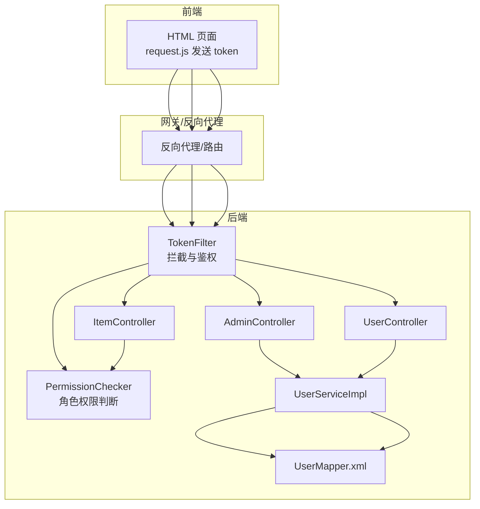
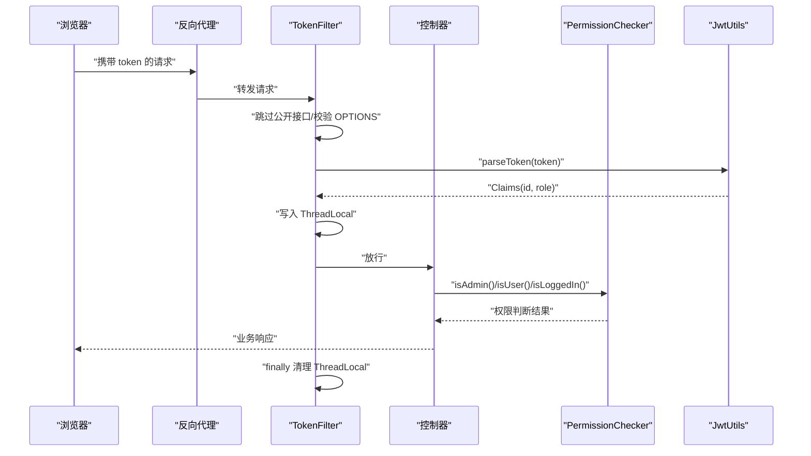
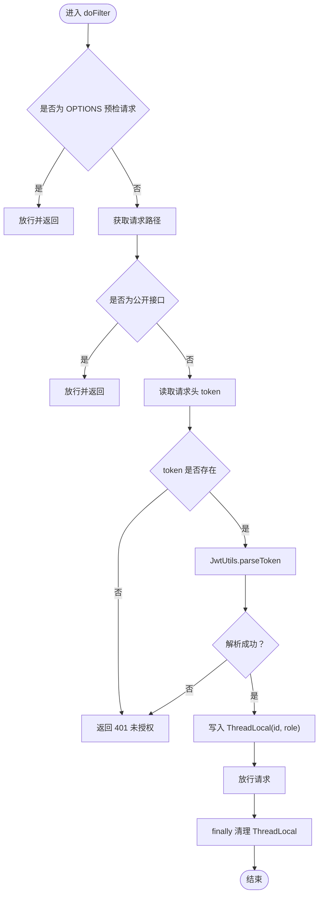
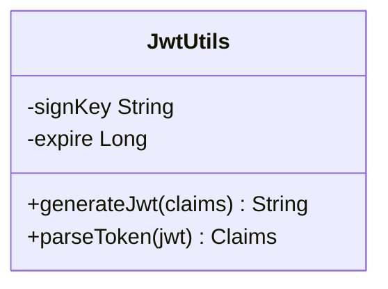
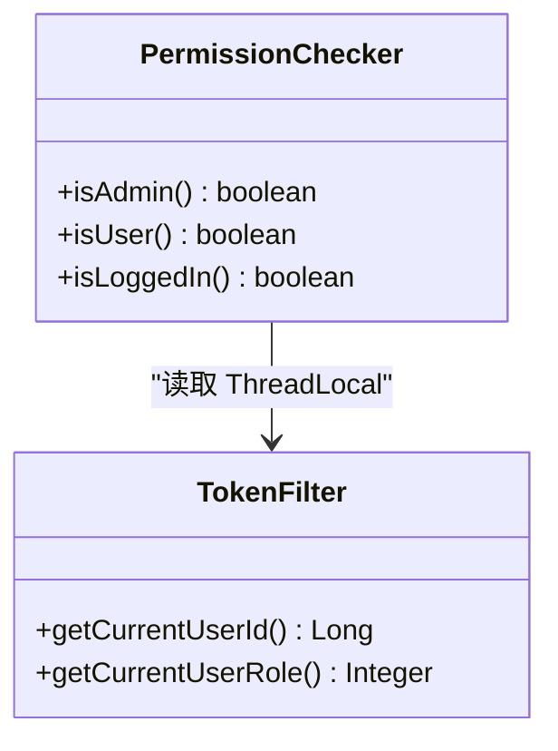
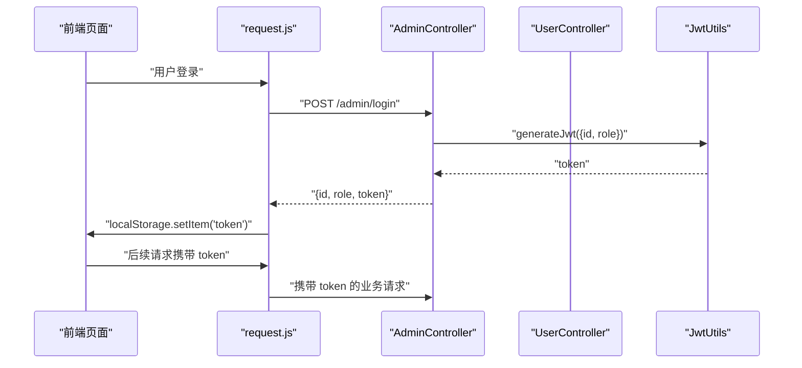
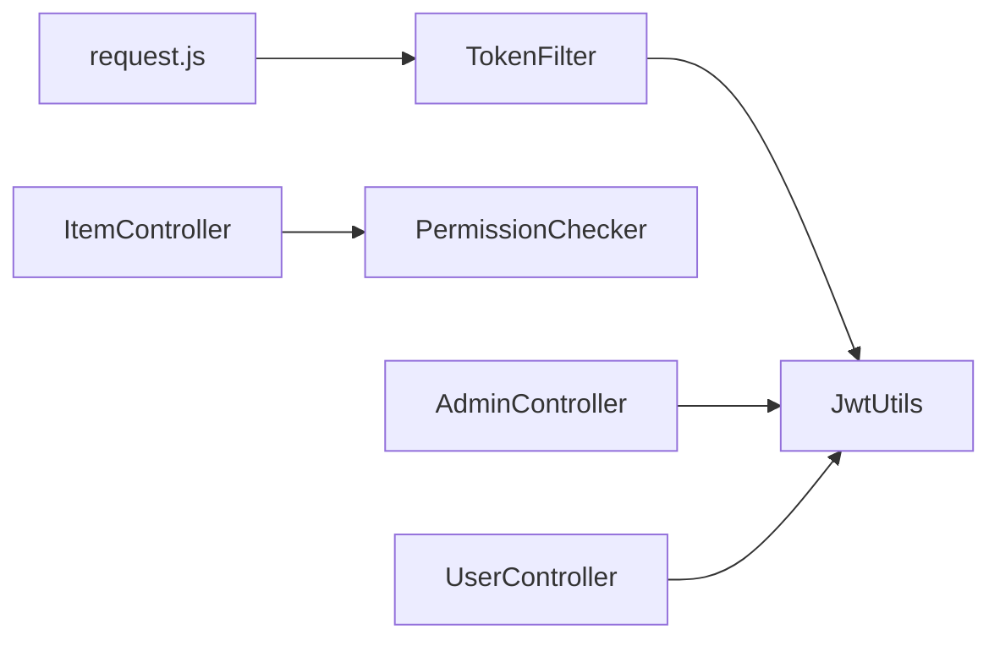

# 安全设计

<cite>
**本文引用的文件**
- [TokenFilter.java](file://src/main/java/com/qkl/auctionsystem/filter/TokenFilter.java)
- [JwtUtils.java](file://src/main/java/com/qkl/auctionsystem/utils/JwtUtils.java)
- [PermissionChecker.java](file://src/main/java/com/qkl/auctionsystem/utils/PermissionChecker.java)
- [AdminController.java](file://src/main/java/com/qkl/auctionsystem/controller/AdminController.java)
- [UserController.java](file://src/main/java/com/qkl/auctionsystem/controller/UserController.java)
- [ItemController.java](file://src/main/java/com/qkl/auctionsystem/controller/ItemController.java)
- [UserServiceImpl.java](file://src/main/java/com/qkl/auctionsystem/service/impl/UserServiceImpl.java)
- [UserMapper.xml](file://src/main/resources/mapper/UserMapper.xml)
- [说明.md](file://说明.md)
- [request.js](file://html/utils/request.js)
</cite>

## 目录
1. [引言](#引言)
2. [项目结构](#项目结构)
3. [核心组件](#核心组件)
4. [架构总览](#架构总览)
5. [详细组件分析](#详细组件分析)
6. [依赖关系分析](#依赖关系分析)
7. [性能与安全特性](#性能与安全特性)
8. [故障排查指南](#故障排查指南)
9. [结论](#结论)
10. [附录](#附录)

## 引言
本文件系统化梳理 AuctionSystem 的安全架构设计，重点覆盖：
- 基于 JWT 的身份认证机制：TokenFilter 如何拦截请求、解析 Token、验证签名有效性，并将用户信息存入 ThreadLocal；JwtUtils 工具类如何生成与解析 Token。
- PermissionChecker 如何基于用户角色（role）实现细粒度权限控制，防止普通用户访问管理员接口。
- 敏感数据（如密码）的加密存储策略现状与改进建议。
- 结合说明.md 中的权限校验规则，解释接口级访问控制逻辑。
- 提供生产级安全加固建议（如 Token 过期策略、防重放攻击等）。

## 项目结构
后端采用 Spring MVC + MyBatis 架构，安全相关代码集中在过滤器、工具类与控制器中：
- 过滤器层：TokenFilter 实现全局请求拦截与鉴权。
- 工具类层：JwtUtils 负责 Token 的签发与解析；PermissionChecker 提供角色级权限判断。
- 控制器层：各业务控制器在需要管理员权限的接口处调用 PermissionChecker 进行二次校验。
- 数据访问层：UserMapper.xml 负责用户注册与登录查询；UserServiceImpl 执行业务逻辑与基础校验。

图表来源
- [TokenFilter.java](file://src/main/java/com/qkl/auctionsystem/filter/TokenFilter.java#L1-L141)
- [PermissionChecker.java](file://src/main/java/com/qkl/auctionsystem/utils/PermissionChecker.java#L1-L36)
- [AdminController.java](file://src/main/java/com/qkl/auctionsystem/controller/AdminController.java#L1-L73)
- [UserController.java](file://src/main/java/com/qkl/auctionsystem/controller/UserController.java#L1-L49)
- [ItemController.java](file://src/main/java/com/qkl/auctionsystem/controller/ItemController.java#L1-L86)
- [UserServiceImpl.java](file://src/main/java/com/qkl/auctionsystem/service/impl/UserServiceImpl.java#L1-L59)
- [UserMapper.xml](file://src/main/resources/mapper/UserMapper.xml#L1-L11)
- [request.js](file://html/utils/request.js#L1-L131)

章节来源
- [TokenFilter.java](file://src/main/java/com/qkl/auctionsystem/filter/TokenFilter.java#L1-L141)
- [JwtUtils.java](file://src/main/java/com/qkl/auctionsystem/utils/JwtUtils.java#L1-L36)
- [PermissionChecker.java](file://src/main/java/com/qkl/auctionsystem/utils/PermissionChecker.java#L1-L36)
- [说明.md](file://说明.md#L1-L112)

## 核心组件
- TokenFilter：全局过滤器，拦截所有请求，跳过公开接口，对非公开接口进行 Token 校验，解析 Claims 并将 userId 与 role 写入 ThreadLocal，最后在 finally 中清理，避免内存泄漏。
- JwtUtils：封装 JWT 的签发与解析，使用对称密钥 HS256 签名，设置固定过期时间。
- PermissionChecker：静态工具类，基于 TokenFilter 中的 ThreadLocal 读取当前用户角色，提供 isAdmin/isUser/isLoggedIn 三种判断。
- 控制器层：在涉及管理员操作的接口（如拍品新增/修改/删除）调用 PermissionChecker 进行二次校验，拒绝非管理员访问。

章节来源
- [TokenFilter.java](file://src/main/java/com/qkl/auctionsystem/filter/TokenFilter.java#L1-L141)
- [JwtUtils.java](file://src/main/java/com/qkl/auctionsystem/utils/JwtUtils.java#L1-L36)
- [PermissionChecker.java](file://src/main/java/com/qkl/auctionsystem/utils/PermissionChecker.java#L1-L36)
- [ItemController.java](file://src/main/java/com/qkl/auctionsystem/controller/ItemController.java#L1-L86)

## 架构总览
下图展示从浏览器到后端的典型请求链路，以及鉴权与权限控制的关键节点。

图表来源
- [TokenFilter.java](file://src/main/java/com/qkl/auctionsystem/filter/TokenFilter.java#L1-L141)
- [PermissionChecker.java](file://src/main/java/com/qkl/auctionsystem/utils/PermissionChecker.java#L1-L36)
- [JwtUtils.java](file://src/main/java/com/qkl/auctionsystem/utils/JwtUtils.java#L1-L36)
- [ItemController.java](file://src/main/java/com/qkl/auctionsystem/controller/ItemController.java#L1-L86)
- [request.js](file://html/utils/request.js#L1-L131)

## 详细组件分析

### TokenFilter：请求拦截与鉴权
- 拦截范围：对所有请求生效，但跳过公开接口与 CORS 预检请求。
- 公开接口判定：包括用户注册、用户登录、管理员登录、拍品列表、拍品详情、竞拍记录查询等。
- Token 校验流程：
  - 从请求头读取 token；
  - 若缺失或为空，返回 401；
  - 调用 JwtUtils.parseToken 解析并验证签名；
  - 解析成功后，从 Claims 中提取 id 与 role，写入 ThreadLocal；
  - 放行请求并在 finally 中移除 ThreadLocal，防止内存泄漏。
- 错误处理：解析异常或未登录均返回 401，并以统一 Result 格式返回错误信息。

图表来源
- [TokenFilter.java](file://src/main/java/com/qkl/auctionsystem/filter/TokenFilter.java#L1-L141)
- [JwtUtils.java](file://src/main/java/com/qkl/auctionsystem/utils/JwtUtils.java#L1-L36)

章节来源
- [TokenFilter.java](file://src/main/java/com/qkl/auctionsystem/filter/TokenFilter.java#L1-L141)

### JwtUtils：Token 生成与解析
- 签发：将用户 id 与 role 作为 Claims，使用 HS256 对称算法与固定密钥签发，设置固定过期时间。
- 解析：使用相同密钥与算法解析并校验签名，返回 Claims。
- 作用域：被控制器在登录成功后生成 Token，并被过滤器用于解析与校验。

图表来源
- [JwtUtils.java](file://src/main/java/com/qkl/auctionsystem/utils/JwtUtils.java#L1-L36)
- [UserController.java](file://src/main/java/com/qkl/auctionsystem/controller/UserController.java#L1-L49)
- [AdminController.java](file://src/main/java/com/qkl/auctionsystem/controller/AdminController.java#L1-L73)

章节来源
- [JwtUtils.java](file://src/main/java/com/qkl/auctionsystem/utils/JwtUtils.java#L1-L36)
- [UserController.java](file://src/main/java/com/qkl/auctionsystem/controller/UserController.java#L1-L49)
- [AdminController.java](file://src/main/java/com/qkl/auctionsystem/controller/AdminController.java#L1-L73)

### PermissionChecker：角色级权限控制
- 提供 isAdmin/isUser/isLoggedIn 三个静态方法，基于 TokenFilter 中的 ThreadLocal 读取当前用户角色与用户 ID。
- 在拍品管理相关接口（新增、修改、删除）中，控制器调用 PermissionChecker.isAdmin() 进行二次校验，非管理员直接返回权限不足。

图表来源
- [PermissionChecker.java](file://src/main/java/com/qkl/auctionsystem/utils/PermissionChecker.java#L1-L36)
- [TokenFilter.java](file://src/main/java/com/qkl/auctionsystem/filter/TokenFilter.java#L1-L141)
- [ItemController.java](file://src/main/java/com/qkl/auctionsystem/controller/ItemController.java#L1-L86)

章节来源
- [PermissionChecker.java](file://src/main/java/com/qkl/auctionsystem/utils/PermissionChecker.java#L1-L36)
- [ItemController.java](file://src/main/java/com/qkl/auctionsystem/controller/ItemController.java#L1-L86)

### 登录与 Token 注入：前端与后端协作
- 前端：request.js 统一在请求头中携带 token，登录成功后将服务端返回的 token 存入 localStorage。
- 后端：UserController 与 AdminController 在登录成功后生成 JWT，Claims 中包含 id 与 role，返回给前端。

图表来源
- [request.js](file://html/utils/request.js#L1-L131)
- [AdminController.java](file://src/main/java/com/qkl/auctionsystem/controller/AdminController.java#L1-L73)
- [UserController.java](file://src/main/java/com/qkl/auctionsystem/controller/UserController.java#L1-L49)
- [JwtUtils.java](file://src/main/java/com/qkl/auctionsystem/utils/JwtUtils.java#L1-L36)

章节来源
- [request.js](file://html/utils/request.js#L1-L131)
- [UserController.java](file://src/main/java/com/qkl/auctionsystem/controller/UserController.java#L1-L49)
- [AdminController.java](file://src/main/java/com/qkl/auctionsystem/controller/AdminController.java#L1-L73)

### 接口级访问控制逻辑（基于说明.md）
- 登录/注册与公开接口：无需登录即可访问，TokenFilter 直接放行。
- 管理员专属接口：拍品新增/修改/删除等，需管理员角色（role=0）。
- 普通用户接口：出价、订单相关接口仅要求已登录（role=0/1 均可）。
- 说明文档明确了“所有需登录的接口先校验 token 有效性，解析出 userId 和 role；添加/修改拍品接口额外校验 role=0”。

章节来源
- [说明.md](file://说明.md#L98-L103)
- [ItemController.java](file://src/main/java/com/qkl/auctionsystem/controller/ItemController.java#L1-L86)
- [TokenFilter.java](file://src/main/java/com/qkl/auctionsystem/filter/TokenFilter.java#L1-L141)

### 敏感数据加密存储策略
- 现状：UserMapper.xml 直接将明文密码写入数据库；UserServiceImpl 在登录时进行明文比对。
- 风险：明文密码存储违反生产安全最佳实践，易被泄露。
- 建议改进：
  - 使用强哈希算法（如 BCrypt、SCrypt 或 Argon2）对密码进行加盐哈希存储；
  - 登录时使用哈希比对，而非明文比较；
  - 为用户密码设置复杂度策略与定期更换提醒；
  - 对数据库连接启用 TLS，限制最小权限账户访问。

章节来源
- [UserMapper.xml](file://src/main/resources/mapper/UserMapper.xml#L1-L11)
- [UserServiceImpl.java](file://src/main/java/com/qkl/auctionsystem/service/impl/UserServiceImpl.java#L1-L59)

## 依赖关系分析
- TokenFilter 依赖 JwtUtils 进行 Token 解析；依赖 PermissionChecker 进行角色判断（间接）。
- 控制器在需要管理员权限的接口中直接依赖 PermissionChecker。
- 登录接口依赖 JwtUtils 生成 Token，并将 id 与 role 写入 Claims。
- 前端通过 request.js 统一注入 token，后端通过过滤器统一校验。

图表来源
- [TokenFilter.java](file://src/main/java/com/qkl/auctionsystem/filter/TokenFilter.java#L1-L141)
- [JwtUtils.java](file://src/main/java/com/qkl/auctionsystem/utils/JwtUtils.java#L1-L36)
- [PermissionChecker.java](file://src/main/java/com/qkl/auctionsystem/utils/PermissionChecker.java#L1-L36)
- [ItemController.java](file://src/main/java/com/qkl/auctionsystem/controller/ItemController.java#L1-L86)
- [AdminController.java](file://src/main/java/com/qkl/auctionsystem/controller/AdminController.java#L1-L73)
- [UserController.java](file://src/main/java/com/qkl/auctionsystem/controller/UserController.java#L1-L49)
- [request.js](file://html/utils/request.js#L1-L131)

章节来源
- [TokenFilter.java](file://src/main/java/com/qkl/auctionsystem/filter/TokenFilter.java#L1-L141)
- [PermissionChecker.java](file://src/main/java/com/qkl/auctionsystem/utils/PermissionChecker.java#L1-L36)
- [JwtUtils.java](file://src/main/java/com/qkl/auctionsystem/utils/JwtUtils.java#L1-L36)
- [ItemController.java](file://src/main/java/com/qkl/auctionsystem/controller/ItemController.java#L1-L86)
- [request.js](file://html/utils/request.js#L1-L131)

## 性能与安全特性
- 性能
  - TokenFilter 仅在非公开接口与非 OPTIONS 请求时进行解析，避免对公开接口造成额外开销。
  - ThreadLocal 在 finally 中清理，降低内存泄漏风险。
- 安全性
  - 使用对称密钥 HS256 签名，密钥集中管理，避免硬编码在客户端。
  - Token 过期时间固定，建议结合刷新 Token 机制与短期会话策略。
  - 前端统一通过请求头携带 token，减少 Cookie 相关风险。
  - 建议引入黑名单/撤销机制（如 Redis 存储已注销 token），配合短 Token 与长刷新 Token。

[本节为通用指导，不直接分析具体文件]

## 故障排查指南
- 401 未授权
  - 检查前端是否正确将 token 写入 localStorage 并在请求头中携带；
  - 检查 TokenFilter 是否正确解析 Claims；
  - 检查 JwtUtils 的签名密钥与过期时间配置。
- 权限不足
  - 确认登录时 Claims 中 role 是否正确写入；
  - 检查控制器是否在对应接口调用了 PermissionChecker.isAdmin()。
- 密码问题
  - 现状为明文存储与明文比对，应尽快迁移至哈希存储与哈希比对。

章节来源
- [TokenFilter.java](file://src/main/java/com/qkl/auctionsystem/filter/TokenFilter.java#L1-L141)
- [PermissionChecker.java](file://src/main/java/com/qkl/auctionsystem/utils/PermissionChecker.java#L1-L36)
- [JwtUtils.java](file://src/main/java/com/qkl/auctionsystem/utils/JwtUtils.java#L1-L36)
- [request.js](file://html/utils/request.js#L1-L131)

## 结论
AuctionSystem 的安全架构以 TokenFilter 为核心，结合 JwtUtils 与 PermissionChecker 实现了基本的身份认证与角色级权限控制。公开接口与非公开接口清晰分离，ThreadLocal 的使用保证了上下文信息在请求生命周期内的可用性。但当前仍存在密码明文存储与明文比对的风险，建议尽快引入强哈希与加盐策略，并完善 Token 过期与撤销机制，以达到生产级安全水平。

[本节为总结，不直接分析具体文件]

## 附录

### 接口级访问控制清单（基于说明.md）
- 公开接口：无需登录
  - 用户注册、用户登录、管理员登录、拍品列表、拍品详情、竞拍记录查询
- 管理员接口：需管理员角色（role=0）
  - 拍品新增、拍品修改、拍品删除、管理员拍品列表
- 普通用户接口：需已登录（role=0/1 均可）
  - 出价、订单相关接口

章节来源
- [说明.md](file://说明.md#L62-L103)
- [ItemController.java](file://src/main/java/com/qkl/auctionsystem/controller/ItemController.java#L1-L86)