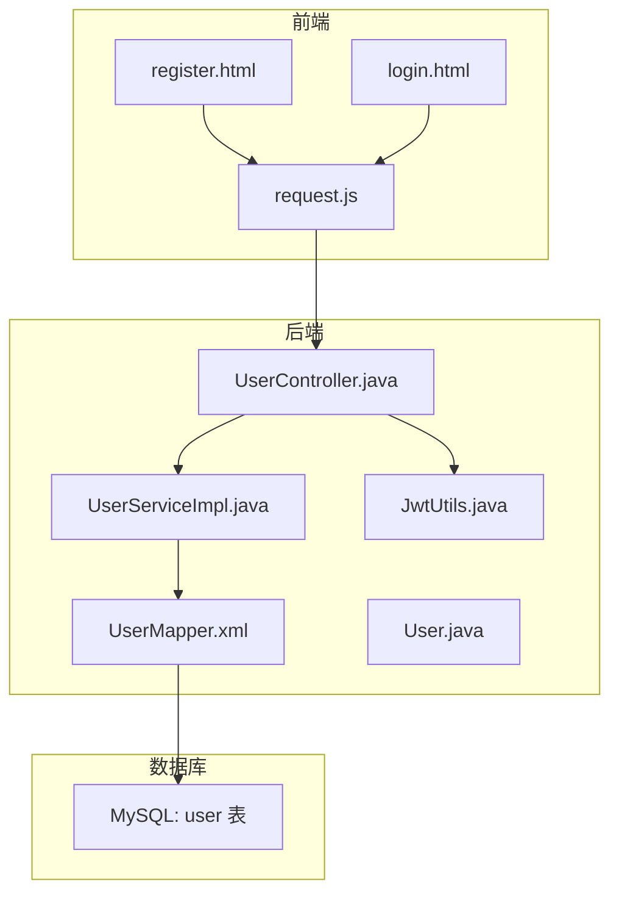
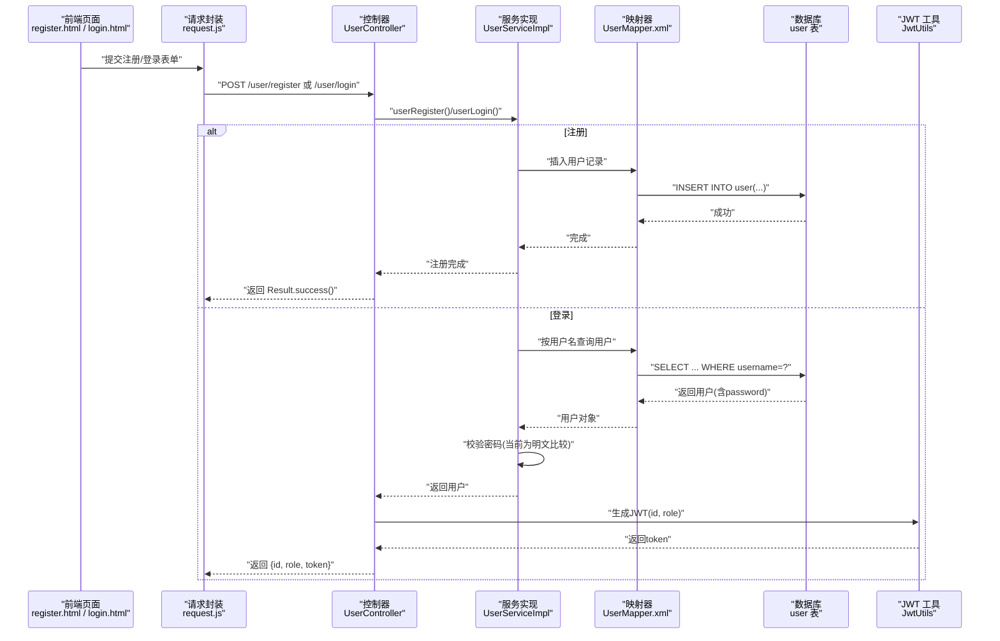
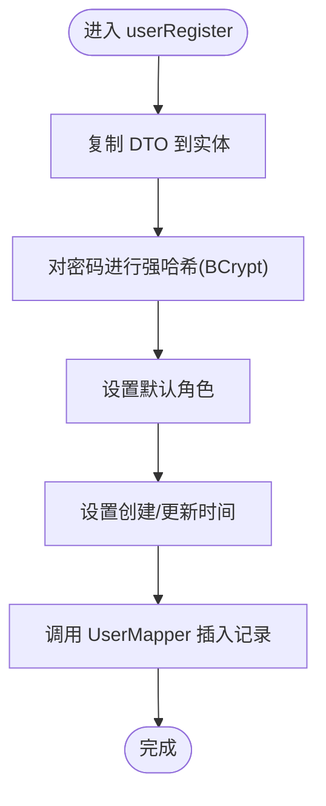
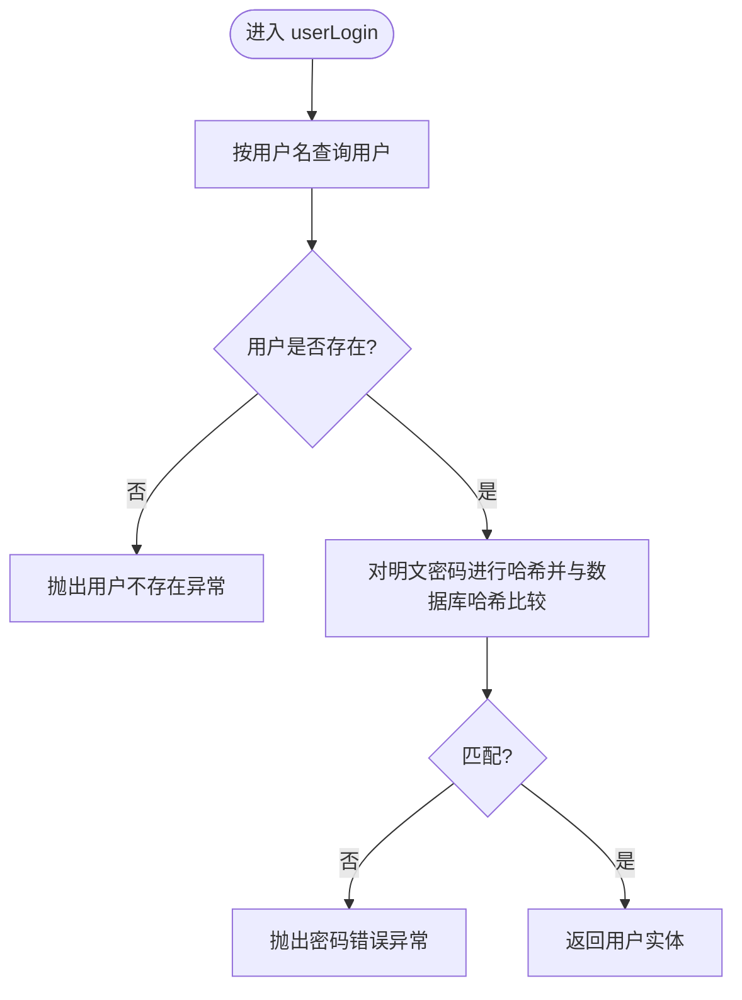
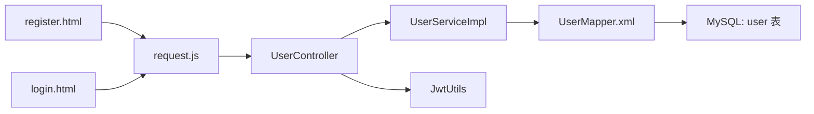

# 敏感数据保护

<cite>
**本文引用的文件**
- [auction_database.sql](file://auction_database.sql)
- [application.properties](file://application.properties)
- [UserController.java](file://src/main/java/com/qkl/auctionsystem/controller/UserController.java)
- [UserService.java](file://src/main/java/com/qkl/auctionsystem/service/UserService.java)
- [UserServiceImpl.java](file://src/main/java/com/qkl/auctionsystem/service/impl/UserServiceImpl.java)
- [UserMapper.xml](file://src/main/resources/mapper/UserMapper.xml)
- [User.java](file://src/main/java/com/qkl/auctionsystem/pojo/entity/User.java)
- [JwtUtils.java](file://src/main/java/com/qkl/auctionsystem/utils/JwtUtils.java)
- [request.js](file://html/utils/request.js)
- [register.html](file://html/register.html)
- [login.html](file://html/login.html)
</cite>

## 目录
1. [引言](#引言)
2. [项目结构](#项目结构)
3. [核心组件](#核心组件)
4. [架构总览](#架构总览)
5. [详细组件分析](#详细组件分析)
6. [依赖关系分析](#依赖关系分析)
7. [性能考量](#性能考量)
8. [故障排查指南](#故障排查指南)
9. [结论](#结论)
10. [附录](#附录)

## 引言
本文件聚焦 AuctionSystem 对敏感数据（尤其是用户密码）的安全处理策略。当前代码未直接展示密码加密逻辑，但基于数据库表结构与业务流程，可推断出密码应采用强哈希算法（如 BCrypt）进行单向加密后再存储；同时，前端传输应通过 HTTPS 保障传输安全。本文结合 auction_database.sql 的表结构，指出密码字段设计为 VARCHAR(255) 可满足哈希值长度需求；并提供在 UserController 中集成密码加密的伪代码示例与实现建议，强调开发人员必须落实该安全措施。此外，JWT 不承载敏感信息，仅携带 ID 和 Role，有助于降低令牌泄露风险。

## 项目结构
围绕用户注册与登录流程的关键文件组织如下：
- 前端
  - HTML 页面：register.html、login.html
  - 工具脚本：html/utils/request.js
- 后端
  - 控制层：UserController.java
  - 服务层：UserService.java、UserServiceImpl.java
  - 数据访问层：UserMapper.xml
  - 实体模型：User.java
  - 安全工具：JwtUtils.java
  - 数据库脚本：auction_database.sql
  - 应用配置：application.properties

图表来源
- [UserController.java](file://src/main/java/com/qkl/auctionsystem/controller/UserController.java#L1-L49)
- [UserServiceImpl.java](file://src/main/java/com/qkl/auctionsystem/service/impl/UserServiceImpl.java#L1-L59)
- [UserMapper.xml](file://src/main/resources/mapper/UserMapper.xml#L1-L11)
- [User.java](file://src/main/java/com/qkl/auctionsystem/pojo/entity/User.java#L1-L26)
- [JwtUtils.java](file://src/main/java/com/qkl/auctionsystem/utils/JwtUtils.java#L1-L36)
- [request.js](file://html/utils/request.js#L1-L131)
- [register.html](file://html/register.html#L1-L107)
- [login.html](file://html/login.html#L1-L99)

章节来源
- [application.properties](file://src/main/resources/application.properties#L1-L20)

## 核心组件
- 用户控制器 UserController：负责接收注册与登录请求，生成 JWT 并返回用户信息。
- 用户服务 UserServiceImpl：执行注册与登录校验逻辑，当前存在明文比对问题，需改为哈希验证。
- 用户映射 UserMapper：封装 SQL 插入与查询操作。
- 用户实体 User：承载用户字段（含 password）。
- JWT 工具 JwtUtils：生成与解析令牌，仅包含 id 与 role。
- 前端请求封装 request.js：统一发起 HTTP 请求并在请求头中携带 token。
- 前端页面 register.html 与 login.html：收集用户输入并调用后端接口。

章节来源
- [UserController.java](file://src/main/java/com/qkl/auctionsystem/controller/UserController.java#L1-L49)
- [UserService.java](file://src/main/java/com/qkl/auctionsystem/service/UserService.java#L1-L14)
- [UserServiceImpl.java](file://src/main/java/com/qkl/auctionsystem/service/impl/UserServiceImpl.java#L1-L59)
- [UserMapper.xml](file://src/main/resources/mapper/UserMapper.xml#L1-L11)
- [User.java](file://src/main/java/com/qkl/auctionsystem/pojo/entity/User.java#L1-L26)
- [JwtUtils.java](file://src/main/java/com/qkl/auctionsystem/utils/JwtUtils.java#L1-L36)
- [request.js](file://html/utils/request.js#L1-L131)
- [register.html](file://html/register.html#L1-L107)
- [login.html](file://html/login.html#L1-L99)

## 架构总览
用户注册与登录的整体流程如下：

图表来源
- [UserController.java](file://src/main/java/com/qkl/auctionsystem/controller/UserController.java#L1-L49)
- [UserServiceImpl.java](file://src/main/java/com/qkl/auctionsystem/service/impl/UserServiceImpl.java#L1-L59)
- [UserMapper.xml](file://src/main/resources/mapper/UserMapper.xml#L1-L11)
- [JwtUtils.java](file://src/main/java/com/qkl/auctionsystem/utils/JwtUtils.java#L1-L36)
- [request.js](file://html/utils/request.js#L1-L131)
- [register.html](file://html/register.html#L1-L107)
- [login.html](file://html/login.html#L1-L99)

## 详细组件分析

### 数据库与密码字段设计
- 表结构要点
  - user 表包含 id、username、password、role、create_time、update_time 等字段。
  - password 字段类型为 VARCHAR(128)，当前脚本中插入了 BCrypt 样例哈希值，表明设计意图是存储哈希而非明文。
- 安全建议
  - 为兼容更长的哈希值（如 bcrypt 255 字符），建议将 password 字段调整为 VARCHAR(255)。
  - 保持唯一索引 username，避免重复注册。

章节来源
- [auction_database.sql](file://auction_database.sql#L13-L23)

### 前端传输安全
- 当前前端通过 request.js 发起请求，默认使用相对路径，配合后端反向代理访问。
- 传输安全建议
  - 在生产环境中，必须启用 HTTPS，确保注册与登录过程中的密码在网络传输中不被窃听或篡改。
  - 建议在 request.js 中显式检查协议，或通过部署层强制 HTTPS。

章节来源
- [request.js](file://html/utils/request.js#L1-L131)
- [application.properties](file://src/main/resources/application.properties#L1-L20)

### 用户注册流程与密码处理
- 现状
  - UserController 接收注册请求并调用 UserService.userRegister。
  - UserServiceImpl 将 DTO 复制到实体并直接写入数据库，未进行密码哈希处理。
  - UserMapper.xml 执行 INSERT，将 password 写入 user 表。
- 风险
  - 若未对密码进行哈希，数据库一旦泄露，攻击者可直接获取明文密码，造成严重安全后果。
- 改进建议
  - 在 UserServiceImpl.userRegister 中，对 userDTO.getPassword() 进行强哈希（推荐 BCrypt），并将哈希后的值赋给 user.setPassword()，再持久化。
  - 保持前端 register.html 仅传递明文密码至后端，由后端完成加密。

图表来源
- [UserServiceImpl.java](file://src/main/java/com/qkl/auctionsystem/service/impl/UserServiceImpl.java#L1-L59)
- [UserMapper.xml](file://src/main/resources/mapper/UserMapper.xml#L1-L11)

章节来源
- [UserController.java](file://src/main/java/com/qkl/auctionsystem/controller/UserController.java#L1-L49)
- [UserServiceImpl.java](file://src/main/java/com/qkl/auctionsystem/service/impl/UserServiceImpl.java#L1-L59)
- [UserMapper.xml](file://src/main/resources/mapper/UserMapper.xml#L1-L11)

### 用户登录流程与密码校验
- 现状
  - UserController 接收登录请求，调用 UserService.userLogin。
  - UserServiceImpl 查询用户并进行明文比较：if (!user.getPassword().equals(password))。
  - 登录成功后生成 JWT，包含 id 与 role。
- 风险
  - 明文比较存在逻辑缺陷，且若数据库中存储的是明文，将导致密码泄露。
- 改进建议
  - 将明文比较替换为哈希验证：对前端传入的明文密码进行哈希并与数据库中存储的哈希值比较。
  - 保持 JWT 不包含敏感信息，仅携带 id 与 role，降低令牌泄露风险。

图表来源
- [UserServiceImpl.java](file://src/main/java/com/qkl/auctionsystem/service/impl/UserServiceImpl.java#L1-L59)
- [UserController.java](file://src/main/java/com/qkl/auctionsystem/controller/UserController.java#L1-L49)

章节来源
- [UserServiceImpl.java](file://src/main/java/com/qkl/auctionsystem/service/impl/UserServiceImpl.java#L1-L59)
- [UserController.java](file://src/main/java/com/qkl/auctionsystem/controller/UserController.java#L1-L49)

### JWT 设计与令牌管理
- 当前实现
  - UserController 在登录成功后，将用户 id 与 role 写入 JWT claims，并生成 token 返回给前端。
  - request.js 在后续请求中通过请求头携带 token，便于鉴权。
- 安全建议
  - JWT 不应包含敏感信息（如密码、身份证等），仅包含最小必要信息（id、role）。
  - 建议设置合理的过期时间与签名密钥管理策略，避免密钥泄露。

章节来源
- [UserController.java](file://src/main/java/com/qkl/auctionsystem/controller/UserController.java#L1-L49)
- [JwtUtils.java](file://src/main/java/com/qkl/auctionsystem/utils/JwtUtils.java#L1-L36)
- [request.js](file://html/utils/request.js#L1-L131)

### 前端页面与请求封装
- register.html
  - 收集用户名与密码，进行前端基础校验（长度、一致性），然后调用后端注册接口。
- login.html
  - 收集用户名与密码，调用后端登录接口；登录成功后将 token 写入本地存储。
- request.js
  - 统一封装 GET/POST/PUT/DELETE/FormData 提交，自动在请求头中携带 token，支持超时与内容类型处理。

章节来源
- [register.html](file://html/register.html#L1-L107)
- [login.html](file://html/login.html#L1-L99)
- [request.js](file://html/utils/request.js#L1-L131)

## 依赖关系分析
- 控制层依赖服务层，服务层依赖映射器，映射器依赖数据库。
- 控制层在登录成功后依赖 JWT 工具生成令牌。
- 前端页面依赖 request.js 发起请求，request.js 依赖浏览器 fetch API。

图表来源
- [UserController.java](file://src/main/java/com/qkl/auctionsystem/controller/UserController.java#L1-L49)
- [UserServiceImpl.java](file://src/main/java/com/qkl/auctionsystem/service/impl/UserServiceImpl.java#L1-L59)
- [UserMapper.xml](file://src/main/resources/mapper/UserMapper.xml#L1-L11)
- [JwtUtils.java](file://src/main/java/com/qkl/auctionsystem/utils/JwtUtils.java#L1-L36)
- [request.js](file://html/utils/request.js#L1-L131)
- [register.html](file://html/register.html#L1-L107)
- [login.html](file://html/login.html#L1-L99)

## 性能考量
- 密码哈希成本
  - BCrypt 等算法具有较高的计算成本，应在服务层异步或批处理场景中合理安排，避免阻塞主线程。
- 数据库索引
  - username 唯一索引有利于快速定位用户，减少查询开销。
- JWT 体积
  - JWT 仅包含 id 与 role，体积小，对网络传输影响有限。

## 故障排查指南
- 注册失败
  - 检查 UserServiceImpl 是否正确执行密码哈希与实体赋值。
  - 确认 UserMapper.xml 的插入语句是否正确映射字段。
- 登录失败
  - 检查 UserServiceImpl 的密码哈希验证逻辑是否实现。
  - 确认数据库中 password 字段是否为哈希值。
- 令牌无效
  - 检查 JwtUtils 的签名密钥与过期时间配置。
  - 确认 request.js 是否在请求头中携带 token。

章节来源
- [UserServiceImpl.java](file://src/main/java/com/qkl/auctionsystem/service/impl/UserServiceImpl.java#L1-L59)
- [UserMapper.xml](file://src/main/resources/mapper/UserMapper.xml#L1-L11)
- [JwtUtils.java](file://src/main/java/com/qkl/auctionsystem/utils/JwtUtils.java#L1-L36)
- [request.js](file://html/utils/request.js#L1-L131)

## 结论
- 当前代码在密码处理上存在明文存储与校验的风险，必须通过强哈希（如 BCrypt）进行改造。
- 建议将 user 表 password 字段调整为 VARCHAR(255)，以适配更长的哈希值。
- 前端传输应通过 HTTPS 保障安全；JWT 不包含敏感信息，仅携带 id 与 role。
- 开发人员必须在 UserController 与 UserService 层面落实密码加密与哈希校验，确保数据库安全与业务健壮性。

## 附录

### 实施建议与伪代码示例
以下为在 UserController 与 UserService 中集成密码加密的伪代码示例（仅作实现指导，非现有代码）：
- 在注册流程中
  - UserController 接收 userDTO
  - UserService.userRegister：对 userDTO.getPassword() 进行强哈希，得到哈希值后赋给 user.setPassword()，再持久化
- 在登录流程中
  - UserService.userLogin：按用户名查询用户
  - 使用强哈希对前端传入的明文密码进行哈希，与数据库中存储的哈希值比较
  - 登录成功后生成 JWT，包含 id 与 role

章节来源
- [UserController.java](file://src/main/java/com/qkl/auctionsystem/controller/UserController.java#L1-L49)
- [UserServiceImpl.java](file://src/main/java/com/qkl/auctionsystem/service/impl/UserServiceImpl.java#L1-L59)
- [UserMapper.xml](file://src/main/resources/mapper/UserMapper.xml#L1-L11)
- [auction_database.sql](file://auction_database.sql#L13-L23)