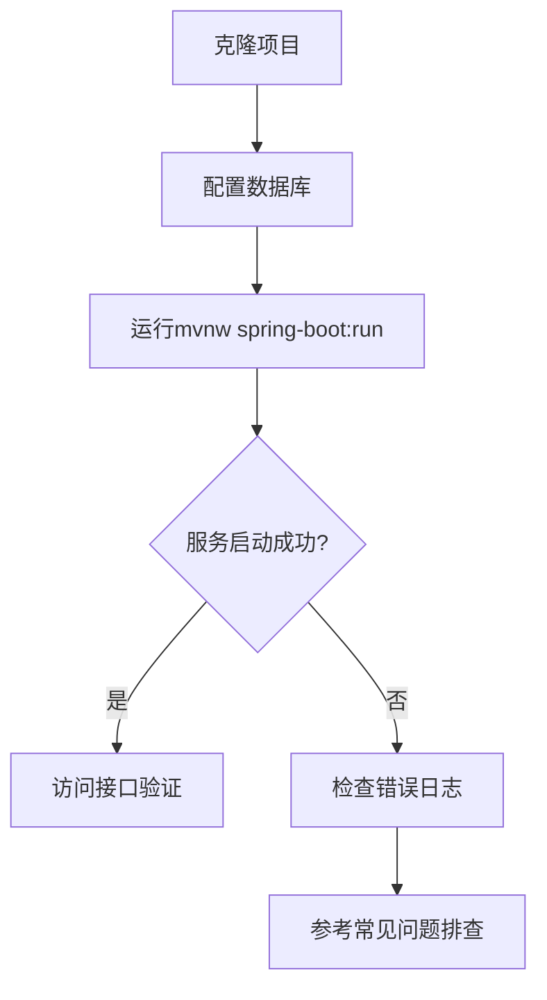
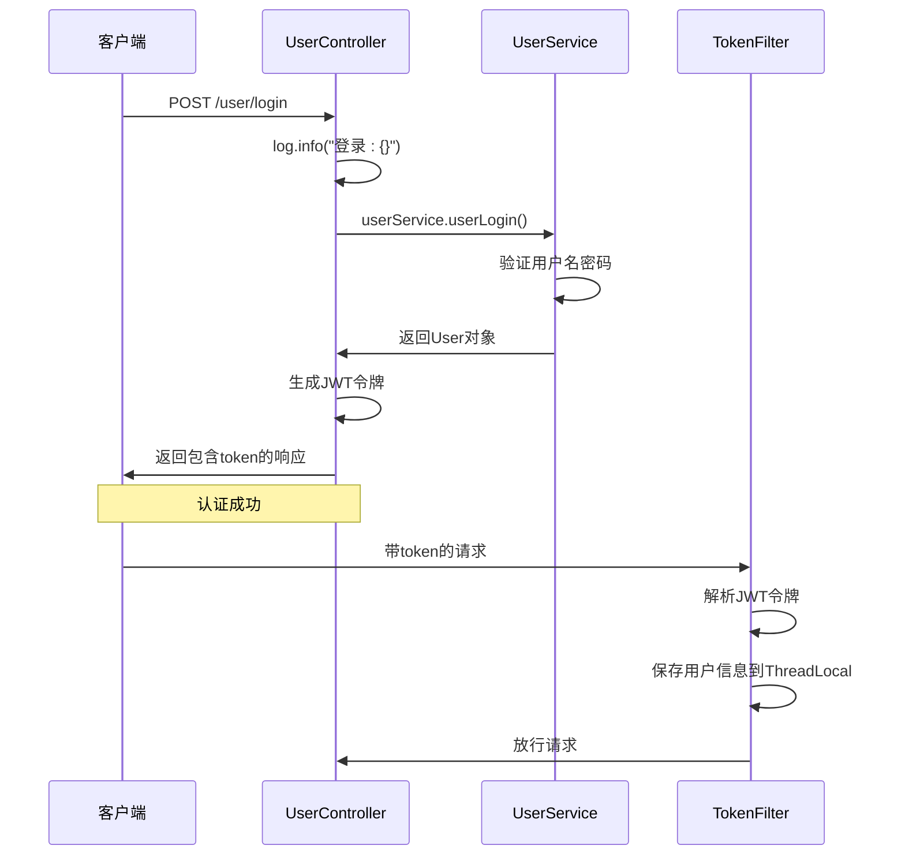

# 开发者指南

<cite>
**本文档中引用的文件**   
- [pom.xml](file://pom.xml)
- [application.properties](file://src/main/resources/application.properties)
- [AuctionSystemApplication.java](file://src/main/java/com/qkl/auctionsystem/AuctionSystemApplication.java)
- [AuctionSystemApplicationTests.java](file://src/test/java/com/qkl/auctionsystem/AuctionSystemApplicationTests.java)
- [auction_database.sql](file://auction_database.sql)
- [UserController.java](file://src/main/java/com/qkl/auctionsystem/controller/UserController.java)
- [AdminController.java](file://src/main/java/com/qkl/auctionsystem/controller/AdminController.java)
- [TokenFilter.java](file://src/main/java/com/qkl/auctionsystem/filter/TokenFilter.java)
- [User.java](file://src/main/java/com/qkl/auctionsystem/pojo/entity/User.java)
- [UserDTO.java](file://src/main/java/com/qkl/auctionsystem/pojo/dto/UserDTO.java)
- [Result.java](file://src/main/java/com/qkl/auctionsystem/result/Result.java)
- [JwtUtils.java](file://src/main/java/com/qkl/auctionsystem/utils/JwtUtils.java)
- [mvnw](file://mvnw)
- [mvnw.cmd](file://mvnw.cmd)
</cite>

## 目录
1. [简介](#简介)
2. [开发环境搭建](#开发环境搭建)
3. [项目编译与运行](#项目编译与运行)
4. [单元测试验证](#单元测试验证)
5. [接口调试与日志查看](#接口调试与日志查看)
6. [代码结构速查表](#代码结构速查表)
7. [开发规范建议](#开发规范建议)
8. [常见问题排查](#常见问题排查)

## 简介
本指南旨在为新加入的开发者提供一份实用的入门指导，帮助您在30分钟内完成本地开发环境的搭建并成功运行拍卖系统。文档涵盖了从环境配置到代码调试的完整流程，确保您能够快速上手并开始开发工作。

## 开发环境搭建
为确保项目顺利运行，请按照以下步骤安装必要的开发工具和依赖：

### 1. JDK 17 安装
- 下载并安装 JDK 17（推荐使用 OpenJDK 或 Oracle JDK）
- 配置环境变量 `JAVA_HOME` 指向 JDK 安装目录
- 将 `%JAVA_HOME%\bin` 添加到系统 `PATH` 变量中
- 验证安装：在命令行执行 `java -version` 和 `javac -version`，确认输出版本为 17

### 2. MySQL 安装与配置
- 下载并安装 MySQL 8.0 或更高版本
- 启动 MySQL 服务
- 使用以下命令创建数据库并导入初始数据：
```bash
mysql -u root -p < auction_database.sql
```
- 数据库连接信息已在 `application.properties` 中预配置：
  - URL: `jdbc:mysql://localhost:8864/auction`
  - 用户名: `auction`
  - 密码: `hibhcKtWHy5BaRyM`

### 3. IDE 安装
推荐使用 IntelliJ IDEA 或 Eclipse：
- **IntelliJ IDEA**：下载社区版或专业版，安装后导入 Maven 项目
- **Eclipse**：安装最新版本，通过 "Import → Existing Maven Projects" 导入项目

### 4. Maven 安装（可选）
项目已包含 Maven Wrapper（mvnw），可直接使用。若需独立安装：
- 下载 Maven 3.8+ 版本
- 配置 `MAVEN_HOME` 环境变量
- 将 `%MAVEN_HOME%\bin` 添加到 `PATH`

**Section sources**
- [pom.xml](file://pom.xml#L30)
- [application.properties](file://src/main/resources/application.properties#L5-L8)
- [auction_database.sql](file://auction_database.sql#L1-L78)

## 项目编译与运行
完成环境搭建后，按照以下步骤编译并运行项目：

### 1. 克隆项目
```bash
git clone https://github.com/your-repo/auction-system.git
cd auction-system
```

### 2. 使用 Maven Wrapper 编译运行
项目根目录包含 `mvnw`（Linux/Mac）和 `mvnw.cmd`（Windows）脚本，可自动下载并使用正确版本的 Maven：

**Windows:**
```bash
mvnw.cmd spring-boot:run
```

**Linux/Mac:**
```bash
./mvnw spring-boot:run
```

### 3. 使用本地 Maven 运行
如果您已安装 Maven，也可使用以下命令：
```bash
mvn spring-boot:run
```

### 4. 项目启动验证
- 服务默认启动在 `http://localhost:8081/auction`
- 检查控制台输出是否包含 "Started AuctionSystemApplication" 字样
- 访问 `http://localhost:8081/auction/user/login` 应返回 405 错误（需要 POST 请求），表明服务已正常启动



**Diagram sources**
- [mvnw](file://mvnw)
- [mvnw.cmd](file://mvnw.cmd)
- [AuctionSystemApplication.java](file://src/main/java/com/qkl/auctionsystem/AuctionSystemApplication.java#L13-L15)

**Section sources**
- [pom.xml](file://pom.xml)
- [AuctionSystemApplication.java](file://src/main/java/com/qkl/auctionsystem/AuctionSystemApplication.java)
- [mvnw](file://mvnw)
- [mvnw.cmd](file://mvnw.cmd)

## 单元测试验证
为确保项目基本功能正常，建议运行内置的单元测试：

### 1. 运行单元测试
使用 Maven 命令运行测试：
```bash
# 使用Maven Wrapper
./mvnw test

# 或使用本地Maven
mvn test
```

### 2. 测试类说明
`AuctionSystemApplicationTests.java` 是 Spring Boot 的基础测试类，主要验证应用上下文能否正常加载：

```java
@SpringBootTest
class AuctionSystemApplicationTests {
    @Test
    void contextLoads() {
    }
}
```

### 3. 预期结果
- 测试应显示 "BUILD SUCCESS"
- `contextLoads()` 测试通过，表明 Spring 应用上下文能够正确初始化
- 此测试验证了配置文件、Bean 注入等基础功能的正确性

**Section sources**
- [AuctionSystemApplicationTests.java](file://src/test/java/com/qkl/auctionsystem/AuctionSystemApplicationTests.java)
- [pom.xml](file://pom.xml#L53-L57)

## 接口调试与日志查看
掌握接口调试和日志分析是开发过程中的关键技能。

### 1. 调试 Controller 接口
#### 使用 IntelliJ IDEA 调试
1. 在目标 Controller 方法上设置断点（如 `UserController.userLogin`）
2. 启动应用时选择 "Debug" 模式
3. 发送请求触发断点
4. 查看变量值、调用栈等调试信息

#### 使用 Postman 测试接口
- **用户登录**：POST `http://localhost:8081/auction/user/login`
```json
{
    "username": "user",
    "password": "user123"
}
```
- **管理员登录**：POST `http://localhost:8081/auction/admin/login`
```json
{
    "username": "admin",
    "password": "admin123"
}
```

### 2. 日志查看
项目使用 SLF4J + Logback 日志框架，关键日志信息包括：

- **请求日志**：在 `UserController` 和 `AdminController` 中使用 `@Slf4j` 注解记录请求信息
- **Token 验证日志**：`TokenFilter` 记录 token 解析过程
- **错误日志**：异常情况下的详细错误信息

日志输出示例：
```
INFO  c.q.a.c.UserController - 登录:{username='user', password='user123'}
INFO  c.q.a.f.TokenFilter - 接收到的token: eyJhbGciOiJIUzI1NiJ9...
INFO  c.q.a.f.TokenFilter - 解析出的claims: {id=2, role=1, exp=1731123456}
```



**Diagram sources**
- [UserController.java](file://src/main/java/com/qkl/auctionsystem/controller/UserController.java#L30-L48)
- [TokenFilter.java](file://src/main/java/com/qkl/auctionsystem/filter/TokenFilter.java#L55-L127)
- [JwtUtils.java](file://src/main/java/com/qkl/auctionsystem/utils/JwtUtils.java)

**Section sources**
- [UserController.java](file://src/main/java/com/qkl/auctionsystem/controller/UserController.java)
- [TokenFilter.java](file://src/main/java/com/qkl/auctionsystem/filter/TokenFilter.java)
- [JwtUtils.java](file://src/main/java/com/qkl/auctionsystem/utils/JwtUtils.java)

## 代码结构速查表
为帮助开发者快速定位核心类，以下是项目的主要代码结构：

### 1. 核心包结构
| 包路径 | 功能说明 |
|-------|--------|
| `com.qkl.auctionsystem.controller` | RESTful 控制器，处理 HTTP 请求 |
| `com.qkl.auctionsystem.service` | 业务逻辑层，实现核心业务功能 |
| `com.qkl.auctionsystem.mapper` | MyBatis 映射接口，数据库操作 |
| `com.qkl.auctionsystem.pojo.entity` | 实体类，对应数据库表结构 |
| `com.qkl.auctionsystem.pojo.dto` | 数据传输对象，用于接口参数和返回值 |
| `com.qkl.auctionsystem.result` | 统一返回结果封装 |
| `com.qkl.auctionsystem.utils` | 工具类，如 JWT 工具 |
| `com.qkl.auctionsystem.filter` | 过滤器，如 Token 验证 |

### 2. 关键类速查
| 类名 | 路径 | 主要功能 |
|------|------|---------|
| `AuctionSystemApplication` | src/main/java/com/qkl/auctionsystem/ | Spring Boot 主启动类 |
| `UserController` | src/main/java/com/qkl/auctionsystem/controller/ | 用户相关接口（注册、登录） |
| `AdminController` | src/main/java/com/qkl/auctionsystem/controller/ | 管理员相关接口 |
| `ItemController` | src/main/java/com/qkl/auctionsystem/controller/ | 拍品相关接口 |
| `BidController` | src/main/java/com/qkl/auctionsystem/controller/ | 竞拍相关接口 |
| `OrderController` | src/main/java/com/qkl/auctionsystem/controller/ | 订单相关接口 |
| `User` | src/main/java/com/qkl/auctionsystem/pojo/entity/ | 用户实体类 |
| `Item` | src/main/java/com/qkl/auctionsystem/pojo/entity/ | 拍品实体类 |
| `UserDTO` | src/main/java/com/qkl/auctionsystem/pojo/dto/ | 用户数据传输对象 |
| `Result` | src/main/java/com/qkl/auctionsystem/result/ | 统一返回结果封装 |
| `JwtUtils` | src/main/java/com/qkl/auctionsystem/utils/ | JWT 令牌生成与解析 |
| `TokenFilter` | src/main/java/com/qkl/auctionsystem/filter/ | Token 验证过滤器 |

### 3. 数据库表对应关系
| 实体类 | 数据库表 | 说明 |
|-------|--------|------|
| `User` | `user` | 用户表 |
| `Item` | `auction_item` | 拍品表 |
| `BidRecord` | `auction_record` | 竞拍记录表 |
| `Order` | `auction_order` | 订单表 |

**Section sources**
- [AuctionSystemApplication.java](file://src/main/java/com/qkl/auctionsystem/AuctionSystemApplication.java)
- [UserController.java](file://src/main/java/com/qkl/auctionsystem/controller/UserController.java)
- [AdminController.java](file://src/main/java/com/qkl/auctionsystem/controller/AdminController.java)
- [User.java](file://src/main/java/com/qkl/auctionsystem/pojo/entity/User.java)
- [UserDTO.java](file://src/main/java/com/qkl/auctionsystem/pojo/dto/UserDTO.java)
- [Result.java](file://src/main/java/com/qkl/auctionsystem/result/Result.java)

## 开发规范建议
为保持代码风格统一和可维护性，请遵循以下开发规范：

### 1. 使用 Lombok 注解
项目已集成 Lombok，避免编写冗余的 getter/setter、构造函数等样板代码：

- `@Data`：自动生成 getter、setter、toString、equals、hashCode
- `@Builder`：生成建造者模式代码
- `@NoArgsConstructor` 和 `@AllArgsConstructor`：生成无参和全参构造函数
- `@Slf4j`：自动生成日志对象 `log`

```java
@Data
@Builder
@NoArgsConstructor
@AllArgsConstructor
public class User {
    private Integer id;
    private String username;
    private String password;
    private Integer role;
}
```

### 2. RESTful 命名约定
遵循 RESTful API 设计规范：

| 操作 | HTTP 方法 | 路径示例 | 说明 |
|------|----------|---------|------|
| 查询列表 | GET | `/item/list` | 获取拍品列表 |
| 查询详情 | GET | `/item/{id}` | 根据ID获取拍品详情 |
| 创建资源 | POST | `/item` | 创建新拍品 |
| 更新资源 | PUT | `/item/{id}` | 更新拍品信息 |
| 删除资源 | DELETE | `/item/{id}` | 删除拍品 |

### 3. 统一返回结果
所有接口返回值都应封装在 `Result<T>` 类中：
- 成功：`Result.success(data)`
- 失败：`Result.error("错误信息")`

### 4. 异常处理
- 使用 `@ControllerAdvice` 全局处理异常
- 自定义业务异常类
- 记录详细的错误日志

### 5. 安全规范
- 敏感信息（如密码）不应在日志中明文输出
- Token 验证通过 `TokenFilter` 统一处理
- 管理员接口需验证角色权限

**Section sources**
- [pom.xml](file://pom.xml#L49-L52)
- [User.java](file://src/main/java/com/qkl/auctionsystem/pojo/entity/User.java#L11-L15)
- [UserController.java](file://src/main/java/com/qkl/auctionsystem/controller/UserController.java#L15-L19)
- [Result.java](file://src/main/java/com/qkl/auctionsystem/result/Result.java)

## 常见问题排查
### 1. 数据库连接失败
**症状**：启动时抛出 `SQLException` 或连接超时
**解决方案**：
- 确认 MySQL 服务已启动
- 检查 `application.properties` 中的数据库配置
- 验证用户名和密码是否正确
- 确认数据库 `auction` 是否已创建并导入数据

### 2. 端口占用
**症状**：`Web server failed to start.Port 8081 was already in use`
**解决方案**：
- 修改 `application.properties` 中的 `server.port`
- 或终止占用 8081 端口的进程

### 3. Maven 依赖下载失败
**症状**：`Could not resolve dependencies`
**解决方案**：
- 检查网络连接
- 配置 Maven 镜像源（如阿里云）
- 删除本地仓库中对应的依赖重新下载

### 4. Token 验证失败
**症状**：返回 "未授权，请先登录" 或 "令牌非法"
**解决方案**：
- 确认登录接口返回的 token 是否正确
- 检查请求头中是否包含 `token` 字段
- 验证 token 是否已过期（默认有效期 12 小时）

### 5. 接口 404 错误
**症状**：访问接口返回 404
**解决方案**：
- 确认 `server.servlet.context-path=/auction`
- 完整路径应为 `http://localhost:8081/auction/user/login`
- 检查 Controller 的 `@RequestMapping` 注解

**Section sources**
- [application.properties](file://src/main/resources/application.properties#L2-L3)
- [TokenFilter.java](file://src/main/java/com/qkl/auctionsystem/filter/TokenFilter.java)
- [pom.xml](file://pom.xml)