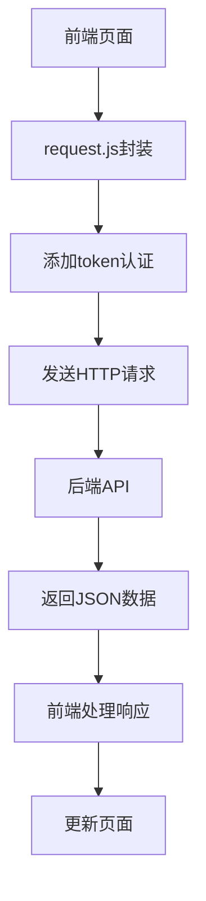
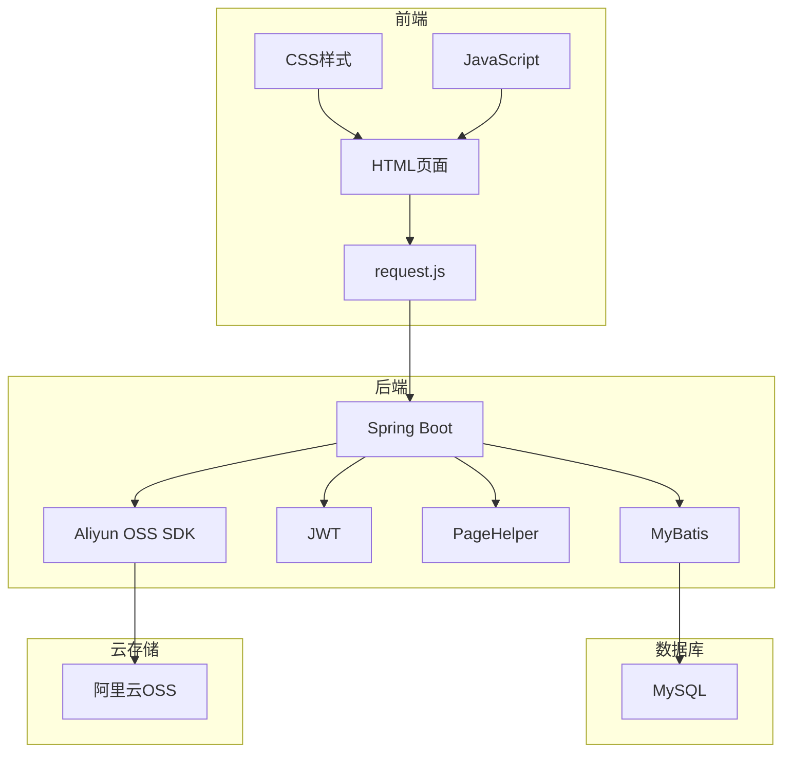

# 技术栈

<cite>
**本文档中引用的文件**  
- [pom.xml](file://pom.xml)
- [AuctionSystemApplication.java](file://src/main/java/com/qkl/auctionsystem/AuctionSystemApplication.java)
- [application.properties](file://src/main/resources/application.properties)
- [JwtUtils.java](file://src/main/java/com/qkl/auctionsystem/utils/JwtUtils.java)
- [TokenFilter.java](file://src/main/java/com/qkl/auctionsystem/filter/TokenFilter.java)
- [AliyunOSSOperator.java](file://src/main/java/com/qkl/auctionsystem/utils/AliyunOSSOperator.java)
- [AliyunOSSProperties.java](file://src/main/java/com/qkl/auctionsystem/properties/AliyunOSSProperties.java)
- [request.js](file://html/utils/request.js)
- [auction_database.sql](file://auction_database.sql)
- [UserController.java](file://src/main/java/com/qkl/auctionsystem/controller/UserController.java)
- [ItemController.java](file://src/main/java/com/qkl/auctionsystem/controller/ItemController.java)
- [User.java](file://src/main/java/com/qkl/auctionsystem/pojo/entity/User.java)
- [UserServiceImpl.java](file://src/main/java/com/qkl/auctionsystem/service/impl/UserServiceImpl.java)
- [PageResult.java](file://src/main/java/com/qkl/auctionsystem/result/PageResult.java)
</cite>

## 目录
1. [技术栈概览](#技术栈概览)
2. [后端技术栈](#后端技术栈)
3. [前端技术栈](#前端技术栈)
4. [技术选型与系统需求匹配](#技术选型与系统需求匹配)
5. [系统架构图](#系统架构图)

## 技术栈概览

本拍卖系统采用前后端分离架构，后端基于Spring Boot 4.0.1构建，使用MyBatis 4.0.0作为ORM框架，MySQL作为持久化数据库。系统通过JWT实现无状态认证，使用阿里云OSS SDK处理图片上传，并通过PageHelper实现分页功能。前端采用原生HTML+JS+CSS实现静态页面交互，通过request.js封装API调用。Java 17作为基础语言支持，Lombok用于简化Java实体类代码。

**Section sources**
- [pom.xml](file://pom.xml#L1-L129)
- [AuctionSystemApplication.java](file://src/main/java/com/qkl/auctionsystem/AuctionSystemApplication.java#L1-L18)

## 后端技术栈

### Spring Boot 4.0.1
作为后端框架的基础支撑，Spring Boot 4.0.1提供了自动配置、起步依赖和嵌入式服务器等特性，简化了Spring应用的搭建和开发过程。通过`@SpringBootApplication`注解启用自动配置和组件扫描，快速构建RESTful API服务。

**Section sources**
- [pom.xml](file://pom.xml#L5-L9)
- [AuctionSystemApplication.java](file://src/main/java/com/qkl/auctionsystem/AuctionSystemApplication.java#L10-L15)

### MyBatis 4.0.0
用于ORM映射，将Java对象与数据库记录进行映射。在`pom.xml`中引入`mybatis-spring-boot-starter`依赖，并在`application.properties`中配置`mybatis.mapper-locations`和`mybatis.type-aliases-package`等属性，实现SQL映射文件的自动扫描和类型别名注册。

**Section sources**
- [pom.xml](file://pom.xml#L37-L41)
- [application.properties](file://src/main/resources/application.properties#L10-L13)

### MySQL数据库
作为持久化数据库，存储用户、拍品、竞拍记录和订单等核心数据。在`application.properties`中配置JDBC连接参数，包括URL、用户名、密码和驱动类名。数据库设计包含用户表、拍品表、竞拍记录表和订单表，满足拍卖系统的核心业务需求。

**Section sources**
- [pom.xml](file://pom.xml#L43-L47)
- [application.properties](file://src/main/resources/application.properties#L5-L8)
- [auction_database.sql](file://auction_database.sql#L1-L78)

### JWT认证
使用`jjwt-api`、`jjwt-impl`和`jjwt-jackson`三个依赖（版本0.11.5）实现无状态认证。`JwtUtils.java`工具类封装了JWT令牌的生成和解析功能，使用HS256算法和预设密钥进行签名。`TokenFilter.java`过滤器拦截所有请求，验证JWT令牌的合法性，并将用户信息存储在ThreadLocal中供后续使用。

**Section sources**
- [pom.xml](file://pom.xml#L65-L82)
- [JwtUtils.java](file://src/main/java/com/qkl/auctionsystem/utils/JwtUtils.java#L1-L36)
- [TokenFilter.java](file://src/main/java/com/qkl/auctionsystem/filter/TokenFilter.java#L1-L141)

### 阿里云OSS
使用阿里云OSS SDK（版本3.17.0）处理图片上传。`AliyunOSSProperties.java`配置类存储OSS的endpoint、bucket名称、区域和访问密钥等信息。`AliyunOSSOperator.java`工具类封装了文件上传功能，生成唯一的文件名并返回访问URL。

**Section sources**
- [pom.xml](file://pom.xml#L84-L89)
- [application.properties](file://src/main/resources/application.properties#L16-L20)
- [AliyunOSSProperties.java](file://src/main/java/com/qkl/auctionsystem/properties/AliyunOSSProperties.java)
- [AliyunOSSOperator.java](file://src/main/java/com/qkl/auctionsystem/utils/AliyunOSSOperator.java#L1-L69)

### PageHelper分页
使用PageHelper 1.4.6提供分页支持。在`pom.xml`中引入`pagehelper-spring-boot-starter`依赖，自动配置分页插件。`PageResult.java`封装分页结果，包含总记录数和数据列表。在服务层使用PageHelper.startPage()方法实现分页查询。

**Section sources**
- [pom.xml](file://pom.xml#L91-L96)
- [PageResult.java](file://src/main/java/com/qkl/auctionsystem/result/PageResult.java)

### Lombok
用于简化Java实体类代码，通过注解自动生成getter、setter、toString等方法。在`pom.xml`中引入`lombok`依赖，并在实体类上使用`@Data`、`@Builder`、`@NoArgsConstructor`和`@AllArgsConstructor`等注解。

**Section sources**
- [pom.xml](file://pom.xml#L49-L52)
- [User.java](file://src/main/java/com/qkl/auctionsystem/pojo/entity/User.java#L1-L26)

### Java 17
在`pom.xml`的properties部分指定`<java.version>17</java.version>`，启用Java 17的语言特性。Java 17作为长期支持版本，提供了更好的性能、安全性和语言特性，如密封类、模式匹配等。

**Section sources**
- [pom.xml](file://pom.xml#L30-L31)

## 前端技术栈

### 原生HTML+JS+CSS
前端采用原生HTML+JS+CSS实现静态页面交互，包含登录、注册、首页、拍品详情、用户订单和管理员仪表盘等页面。通过CSS实现页面样式和布局，通过JavaScript实现动态交互逻辑。

**Section sources**
- [html](file://html)

### request.js API封装
`request.js`文件封装了fetch请求，统一处理前后端通信。定义了get、post、put、del和postFormData等方法，在请求头中携带token实现认证。BASE_URL配置为相对路径，通过反向代理访问后端API。

**Diagram sources**
- [request.js](file://html/utils/request.js#L1-L131)

## 技术选型与系统需求匹配

### 安全性
- **JWT无状态认证**：使用JWT实现无状态认证，避免会话固定攻击，令牌包含用户ID和角色信息，通过HS256算法签名防止篡改。
- **权限控制**：`TokenFilter.java`过滤器拦截所有请求，验证令牌合法性，并通过`PermissionChecker.java`工具类检查用户角色，确保只有管理员才能执行敏感操作。
- **密码安全**：虽然当前实现中密码未加密存储，但系统设计预留了加密接口，可轻松集成BCrypt等密码加密算法。

**Section sources**
- [JwtUtils.java](file://src/main/java/com/qkl/auctionsystem/utils/JwtUtils.java#L1-L36)
- [TokenFilter.java](file://src/main/java/com/qkl/auctionsystem/filter/TokenFilter.java#L1-L141)
- [PermissionChecker.java](file://src/main/java/com/qkl/auctionsystem/utils/PermissionChecker.java#L1-L36)

### 实时性
- **RESTful API**：基于Spring Boot的RESTful API提供实时数据交互，前端通过request.js封装的HTTP请求实时获取拍品列表、竞拍记录等数据。
- **竞拍状态更新**：拍品表包含状态字段（未开始、竞拍中、已结束），通过定时任务或事件驱动机制实时更新竞拍状态。

**Section sources**
- [ItemController.java](file://src/main/java/com/qkl/auctionsystem/controller/ItemController.java#L1-L86)
- [auction_database.sql](file://auction_database.sql#L26-L45)

### 可维护性
- **分层架构**：采用典型的MVC分层架构，controller、service、mapper、pojo等包结构清晰，职责分明，便于维护和扩展。
- **配置外化**：数据库、OSS等配置信息外化到`application.properties`文件中，便于环境切换和配置管理。
- **统一返回结果**：`Result.java`封装统一的API返回格式，包含code、msg和data字段，便于前端统一处理响应。

**Section sources**
- [UserController.java](file://src/main/java/com/qkl/auctionsystem/controller/UserController.java#L1-L49)
- [UserServiceImpl.java](file://src/main/java/com/qkl/auctionsystem/service/impl/UserServiceImpl.java#L1-L59)
- [Result.java](file://src/main/java/com/qkl/auctionsystem/result/Result.java#L1-L39)

## 系统架构图

**Diagram sources**
- [pom.xml](file://pom.xml#L1-L129)
- [AuctionSystemApplication.java](file://src/main/java/com/qkl/auctionsystem/AuctionSystemApplication.java#L1-L18)
- [request.js](file://html/utils/request.js#L1-L131)