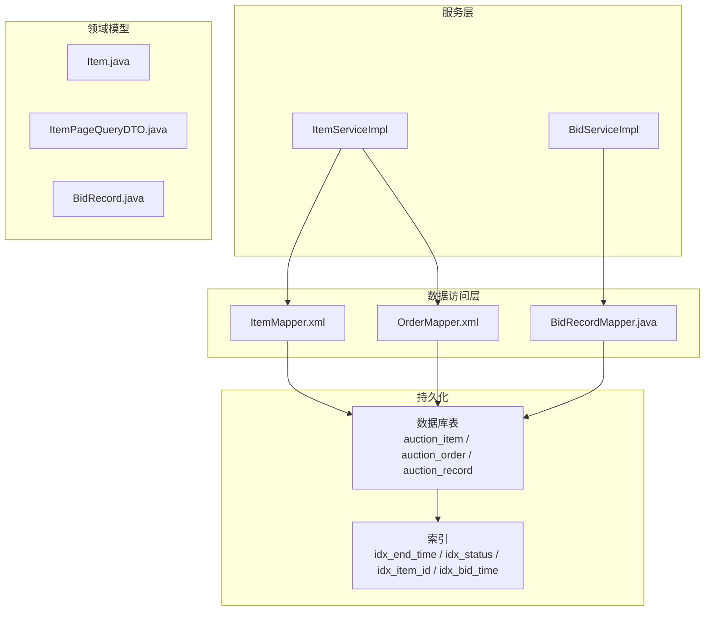
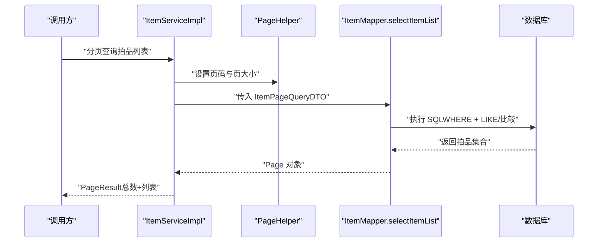
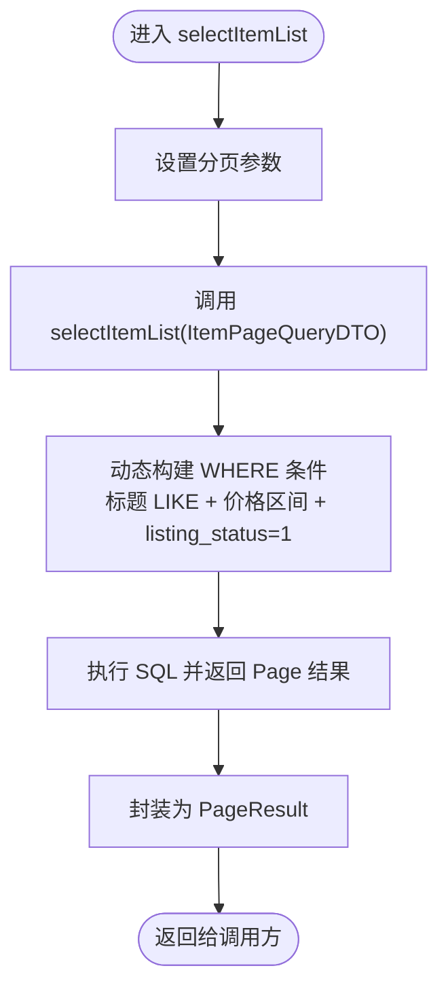
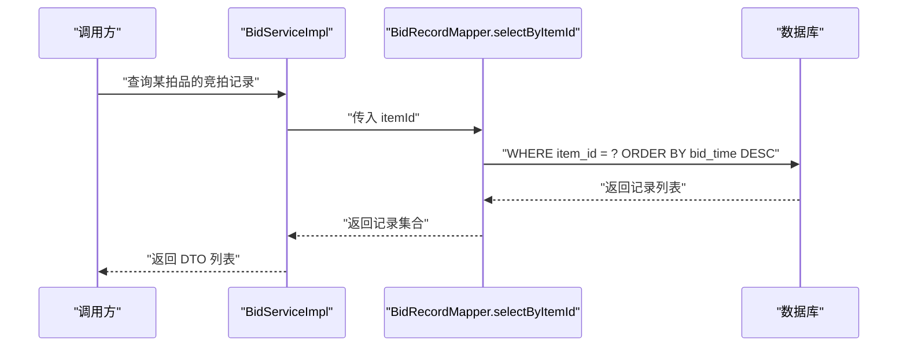
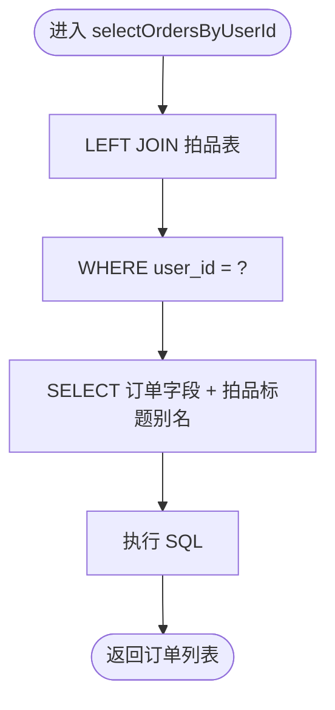
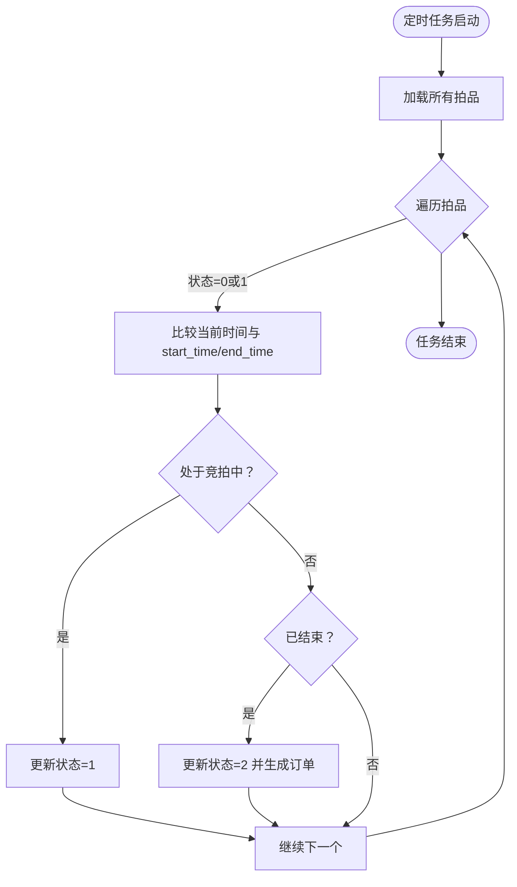
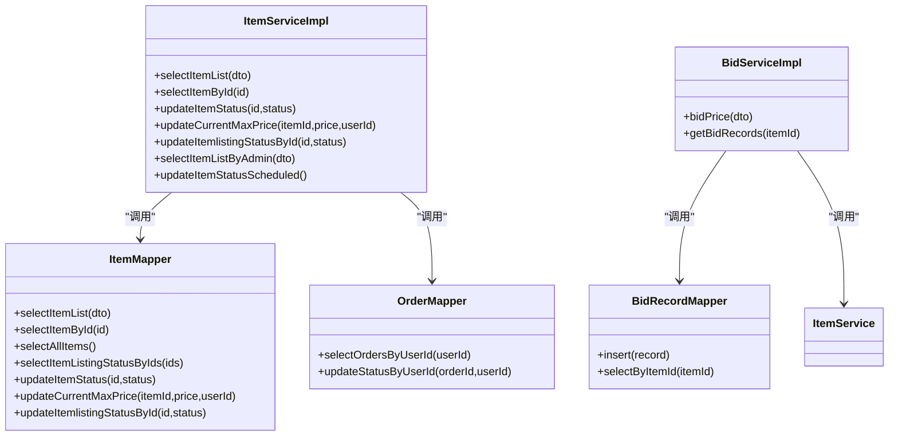

# 典型查询模式

<cite>
**本文引用的文件**
- [ItemMapper.xml](file://src/main/resources/mapper/ItemMapper.xml)
- [ItemServiceImpl.java](file://src/main/java/com/qkl/auctionsystem/service/impl/ItemServiceImpl.java)
- [OrderMapper.xml](file://src/main/resources/mapper/OrderMapper.xml)
- [BidRecordMapper.java](file://src/main/java/com/qkl/auctionsystem/mapper/BidRecordMapper.java)
- [BidServiceImpl.java](file://src/main/java/com/qkl/auctionsystem/service/impl/BidServiceImpl.java)
- [ItemPageQueryDTO.java](file://src/main/java/com/qkl/auctionsystem/pojo/dto/ItemPageQueryDTO.java)
- [Item.java](file://src/main/java/com/qkl/auctionsystem/pojo/entity/Item.java)
- [auction_database.sql](file://auction_database.sql)
</cite>

## 目录
1. [简介](#简介)
2. [项目结构](#项目结构)
3. [核心组件](#核心组件)
4. [架构总览](#架构总览)
5. [详细组件分析](#详细组件分析)
6. [依赖关系分析](#依赖关系分析)
7. [性能考量](#性能考量)
8. [故障排查指南](#故障排查指南)
9. [结论](#结论)

## 简介
本文件聚焦于系统中的典型数据库查询模式，结合 MyBatis Mapper 文件与 Service 实现类，总结以下四类常见 SQL 查询场景：
- 分页查询“上架中”的拍品列表（支持标题模糊匹配、价格区间过滤）
- 获取特定拍品的竞拍记录（按出价时间倒序）
- 查询用户个人订单历史（含拍品标题）
- 定时任务中查找状态需更新的拍品（基于结束时间与当前时间比较）

同时，文档解释 WHERE 条件、JOIN 操作、ORDER BY 和 LIMIT 的使用策略，并结合数据库索引设计（如 idx_end_time、idx_status）进行性能优化建议与慢查询诊断思路。

## 项目结构
围绕查询模式涉及的关键模块如下：
- Mapper 层：ItemMapper.xml、OrderMapper.xml、BidRecordMapper.java
- Service 层：ItemServiceImpl.java、BidServiceImpl.java
- DTO/Entity：ItemPageQueryDTO.java、Item.java、BidRecord.java
- 数据库脚本：auction_database.sql（包含表结构与索引）

图表来源
- [ItemServiceImpl.java](file://src/main/java/com/qkl/auctionsystem/service/impl/ItemServiceImpl.java#L45-L105)
- [ItemMapper.xml](file://src/main/resources/mapper/ItemMapper.xml#L41-L50)
- [OrderMapper.xml](file://src/main/resources/mapper/OrderMapper.xml#L9-L14)
- [BidRecordMapper.java](file://src/main/java/com/qkl/auctionsystem/mapper/BidRecordMapper.java#L14-L18)
- [ItemPageQueryDTO.java](file://src/main/java/com/qkl/auctionsystem/pojo/dto/ItemPageQueryDTO.java#L1-L19)
- [Item.java](file://src/main/java/com/qkl/auctionsystem/pojo/entity/Item.java#L1-L34)
- [auction_database.sql](file://auction_database.sql#L25-L72)

章节来源
- [ItemMapper.xml](file://src/main/resources/mapper/ItemMapper.xml#L41-L50)
- [OrderMapper.xml](file://src/main/resources/mapper/OrderMapper.xml#L9-L14)
- [BidRecordMapper.java](file://src/main/java/com/qkl/auctionsystem/mapper/BidRecordMapper.java#L14-L18)
- [ItemServiceImpl.java](file://src/main/java/com/qkl/auctionsystem/service/impl/ItemServiceImpl.java#L45-L105)
- [ItemPageQueryDTO.java](file://src/main/java/com/qkl/auctionsystem/pojo/dto/ItemPageQueryDTO.java#L1-L19)
- [Item.java](file://src/main/java/com/qkl/auctionsystem/pojo/entity/Item.java#L1-L34)
- [auction_database.sql](file://auction_database.sql#L25-L72)

## 核心组件
- 拍品查询（分页、筛选）：通过 ItemMapper.xml 的 selectItemList 与 Service 层分页器 PageHelper 配合，实现标题模糊匹配、价格区间过滤与固定 listing_status=1 的上架状态筛选。
- 竞拍记录查询（按时间倒序）：通过 BidRecordMapper.java 的 selectByItemId，按 bid_time DESC 排序返回记录。
- 用户订单历史查询（含拍品标题）：通过 OrderMapper.xml 的 selectOrdersByUserId，使用 LEFT JOIN 连接拍品表以返回拍品标题字段。
- 定时任务状态更新：ItemServiceImpl 中的定时任务扫描所有拍品，依据结束时间与当前时间比较，更新状态并生成订单。

章节来源
- [ItemMapper.xml](file://src/main/resources/mapper/ItemMapper.xml#L41-L50)
- [ItemServiceImpl.java](file://src/main/java/com/qkl/auctionsystem/service/impl/ItemServiceImpl.java#L45-L105)
- [BidRecordMapper.java](file://src/main/java/com/qkl/auctionsystem/mapper/BidRecordMapper.java#L14-L18)
- [OrderMapper.xml](file://src/main/resources/mapper/OrderMapper.xml#L9-L14)
- [ItemServiceImpl.java](file://src/main/java/com/qkl/auctionsystem/service/impl/ItemServiceImpl.java#L107-L147)

## 架构总览
下面以序列图展示“分页查询上架中的拍品列表”流程，体现请求从 Service 到 Mapper 再到数据库的调用链路。

图表来源
- [ItemServiceImpl.java](file://src/main/java/com/qkl/auctionsystem/service/impl/ItemServiceImpl.java#L45-L50)
- [ItemMapper.xml](file://src/main/resources/mapper/ItemMapper.xml#L41-L50)
- [ItemPageQueryDTO.java](file://src/main/java/com/qkl/auctionsystem/pojo/dto/ItemPageQueryDTO.java#L1-L19)

## 详细组件分析

### 场景一：分页查询“上架中”的拍品列表（带标题模糊与价格区间过滤）
- 查询入口：Service 方法 selectItemList 调用 PageHelper.startPage 启动分页，随后调用 ItemMapper.selectItemList 并封装为 PageResult 返回。
- SQL 关键点：
  - WHERE 条件：标题模糊匹配（LIKE），价格区间比较（>=、<=），固定 listing_status=1（仅上架中拍品）。
  - 动态拼接：MyBatis <where> 与 <if> 标签根据 DTO 字段动态拼接条件。
- 性能要点：
  - 建议对 status、listing_status、start_time、end_time 建立索引，以减少全表扫描。
  - 若频繁按标题检索，可考虑全文索引或优化 LIKE 匹配策略（如前缀索引）。

图表来源
- [ItemServiceImpl.java](file://src/main/java/com/qkl/auctionsystem/service/impl/ItemServiceImpl.java#L45-L50)
- [ItemMapper.xml](file://src/main/resources/mapper/ItemMapper.xml#L41-L50)
- [ItemPageQueryDTO.java](file://src/main/java/com/qkl/auctionsystem/pojo/dto/ItemPageQueryDTO.java#L1-L19)

章节来源
- [ItemServiceImpl.java](file://src/main/java/com/qkl/auctionsystem/service/impl/ItemServiceImpl.java#L45-L50)
- [ItemMapper.xml](file://src/main/resources/mapper/ItemMapper.xml#L41-L50)
- [ItemPageQueryDTO.java](file://src/main/java/com/qkl/auctionsystem/pojo/dto/ItemPageQueryDTO.java#L1-L19)

### 场景二：获取特定拍品的竞拍记录（按出价时间倒序）
- 查询入口：Service 方法 getBidRecords 调用 BidRecordMapper.selectByItemId，按 bid_time DESC 排序返回。
- SQL 关键点：
  - WHERE 条件：item_id 等值过滤。
  - ORDER BY：bid_time DESC，确保最新出价排在前面。
- 性能要点：
  - 建议对 auction_record 的 item_id、bid_time 建立复合索引，提升排序与过滤效率。
  - 若记录量极大，可考虑分页或限制返回条数。

图表来源
- [BidServiceImpl.java](file://src/main/java/com/qkl/auctionsystem/service/impl/BidServiceImpl.java#L56-L74)
- [BidRecordMapper.java](file://src/main/java/com/qkl/auctionsystem/mapper/BidRecordMapper.java#L14-L18)

章节来源
- [BidServiceImpl.java](file://src/main/java/com/qkl/auctionsystem/service/impl/BidServiceImpl.java#L56-L74)
- [BidRecordMapper.java](file://src/main/java/com/qkl/auctionsystem/mapper/BidRecordMapper.java#L14-L18)

### 场景三：查询用户个人订单历史（含拍品标题）
- 查询入口：OrderMapper.xml 的 selectOrdersByUserId，使用 LEFT JOIN 连接 auction_item，返回订单及拍品标题。
- SQL 关键点：
  - JOIN：LEFT JOIN auction_item on o.item_id = i.id。
  - WHERE：user_id 等值过滤。
  - SELECT：返回订单字段与拍品标题别名（item_title）。
- 性能要点：
  - 建议对 auction_order 的 user_id、status 建立索引；对 auction_item 的 id 建主键索引（已存在）。

图表来源
- [OrderMapper.xml](file://src/main/resources/mapper/OrderMapper.xml#L9-L14)

章节来源
- [OrderMapper.xml](file://src/main/resources/mapper/OrderMapper.xml#L9-L14)

### 场景四：定时任务中查找状态需更新的拍品（结束时间 < 当前时间 且 status=1）
- 触发方式：Spring 定时任务（每分钟执行一次）。
- 处理逻辑：
  - 遍历所有拍品，若当前时间处于 start_time 与 end_time 之间且状态为 0，则更新为 1（竞拍中）。
  - 若当前时间超过 end_time，则更新为 2（已结束），并生成订单。
- SQL 关键点：
  - 该场景主要在内存中判断时间，不直接执行 SQL；但生成订单时会调用 OrderMapper.insertOrder。
- 性能要点：
  - 扫描全表可能成为瓶颈，建议：
    - 仅扫描状态为 0 或 1 的拍品；
    - 增加索引以加速 end_time 与 status 的过滤；
    - 考虑分批处理或延迟队列异步化。

图表来源
- [ItemServiceImpl.java](file://src/main/java/com/qkl/auctionsystem/service/impl/ItemServiceImpl.java#L107-L147)

章节来源
- [ItemServiceImpl.java](file://src/main/java/com/qkl/auctionsystem/service/impl/ItemServiceImpl.java#L107-L147)

## 依赖关系分析
- ItemServiceImpl 依赖 ItemMapper、OrderMapper，负责业务编排与分页控制。
- BidServiceImpl 依赖 BidRecordMapper 与 ItemService，负责出价与记录查询。
- Mapper 与实体类一一对应，遵循 MyBatis 映射约定。

图表来源
- [ItemServiceImpl.java](file://src/main/java/com/qkl/auctionsystem/service/impl/ItemServiceImpl.java#L45-L105)
- [ItemMapper.xml](file://src/main/resources/mapper/ItemMapper.xml#L41-L50)
- [OrderMapper.xml](file://src/main/resources/mapper/OrderMapper.xml#L9-L14)
- [BidRecordMapper.java](file://src/main/java/com/qkl/auctionsystem/mapper/BidRecordMapper.java#L14-L18)
- [BidServiceImpl.java](file://src/main/java/com/qkl/auctionsystem/service/impl/BidServiceImpl.java#L56-L74)

章节来源
- [ItemServiceImpl.java](file://src/main/java/com/qkl/auctionsystem/service/impl/ItemServiceImpl.java#L45-L105)
- [BidServiceImpl.java](file://src/main/java/com/qkl/auctionsystem/service/impl/BidServiceImpl.java#L56-L74)

## 性能考量
- 索引设计与覆盖
  - 拍品表（auction_item）：
    - idx_end_time：用于定时任务与竞拍结束判断（结束时间比较）。
    - idx_status：用于快速筛选状态（未开始/竞拍中/已结束）。
    - idx_listing_status：用于筛选上架/下架状态。
    - idx_start_time：用于竞拍开始判断。
  - 竞拍记录表（auction_record）：
    - idx_item_id：用于按拍品查询记录。
    - idx_bid_time：用于按时间排序。
  - 订单表（auction_order）：
    - idx_user_id：用于按用户查询订单。
    - idx_status：用于按状态查询订单。
- WHERE 条件与索引选择性
  - LIKE '%keyword%' 不走索引，建议：
    - 优先使用前缀匹配或全文索引；
    - 或者在标题字段上建立前缀索引（如前 20 字符）。
  - 等值过滤（=、IN）优先于范围过滤（>, <, BETWEEN）。
- ORDER BY 与 LIMIT
  - ORDER BY bid_time DESC 与 LIMIT 组合时，确保有合适的索引避免临时表与文件排序。
  - 分页查询建议使用“延迟游标”或“基于索引的分页”，避免深层分页导致的性能问题。
- 定时任务优化
  - 当前实现扫描全表，建议：
    - 仅扫描状态为 0 或 1 的拍品；
    - 基于 end_time 与当前时间的范围扫描；
    - 引入批量处理与异步化，降低锁竞争与阻塞风险。

章节来源
- [auction_database.sql](file://auction_database.sql#L25-L72)
- [ItemServiceImpl.java](file://src/main/java/com/qkl/auctionsystem/service/impl/ItemServiceImpl.java#L107-L147)
- [ItemMapper.xml](file://src/main/resources/mapper/ItemMapper.xml#L41-L50)
- [BidRecordMapper.java](file://src/main/java/com/qkl/auctionsystem/mapper/BidRecordMapper.java#L14-L18)
- [OrderMapper.xml](file://src/main/resources/mapper/OrderMapper.xml#L9-L14)

## 故障排查指南
- 分页查询无结果或结果异常
  - 检查 ItemPageQueryDTO 的字段是否正确传入（page、pageSize、title、minPrice、maxPrice、status）。
  - 确认 listing_status 固定为 1 的条件是否符合预期。
- 竞拍记录排序异常
  - 确认 bid_time 字段是否正确写入与查询；
  - 检查数据库时间与时区配置，避免排序错乱。
- 订单历史缺少拍品标题
  - 确认 LEFT JOIN 条件与别名字段一致；
  - 检查拍品是否存在或已被删除导致关联为空。
- 定时任务未触发或状态未更新
  - 检查 Spring 定时任务注解与调度配置；
  - 查看日志输出，确认任务执行路径与异常堆栈；
  - 若拍品数量大，评估全表扫描带来的性能影响。

章节来源
- [ItemServiceImpl.java](file://src/main/java/com/qkl/auctionsystem/service/impl/ItemServiceImpl.java#L107-L147)
- [OrderMapper.xml](file://src/main/resources/mapper/OrderMapper.xml#L9-L14)
- [BidRecordMapper.java](file://src/main/java/com/qkl/auctionsystem/mapper/BidRecordMapper.java#L14-L18)

## 结论
本文梳理了系统中四类典型查询场景及其对应的 SQL 设计与索引优化策略。通过合理使用 WHERE、JOIN、ORDER BY 与 LIMIT，并结合数据库索引与分页机制，可在保证功能正确性的前提下显著提升查询性能。针对定时任务的全表扫描问题，建议引入范围扫描与异步化策略，以降低系统负载与潜在的锁竞争风险。