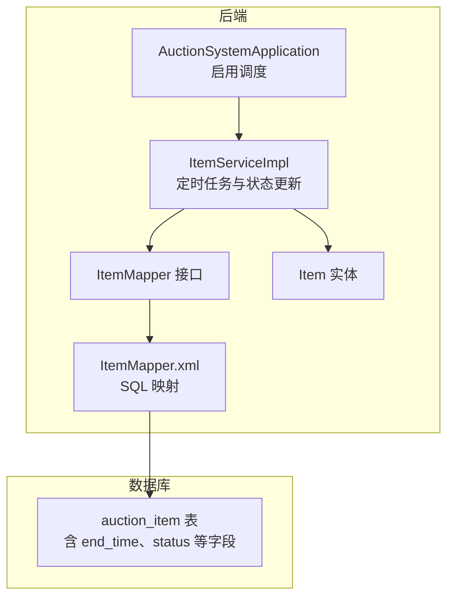
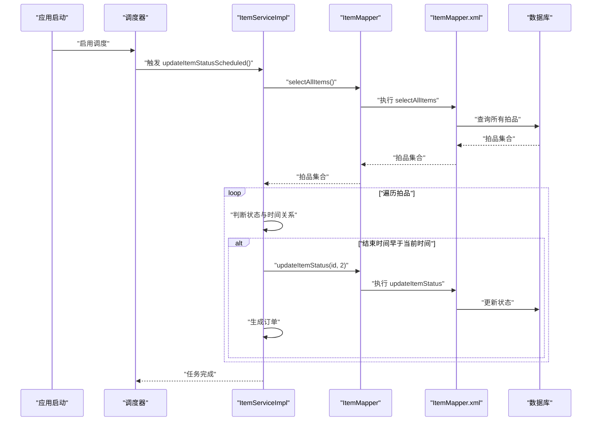
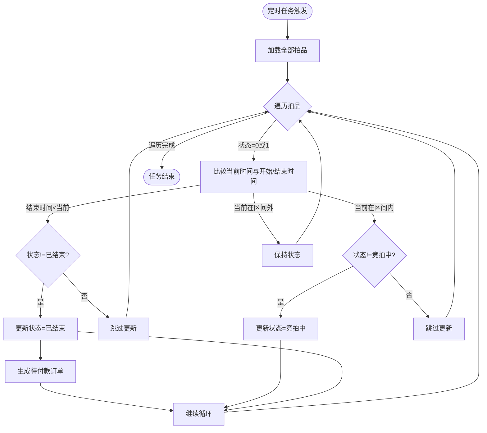
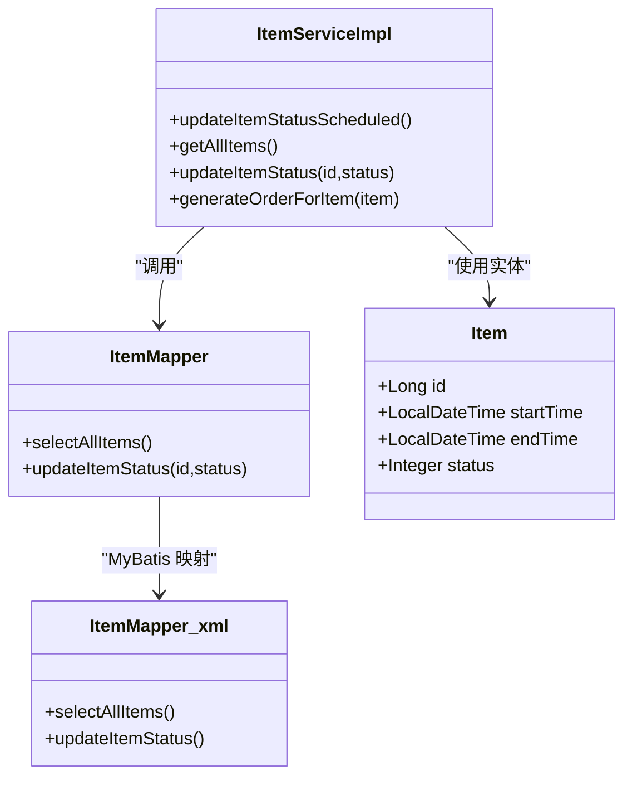
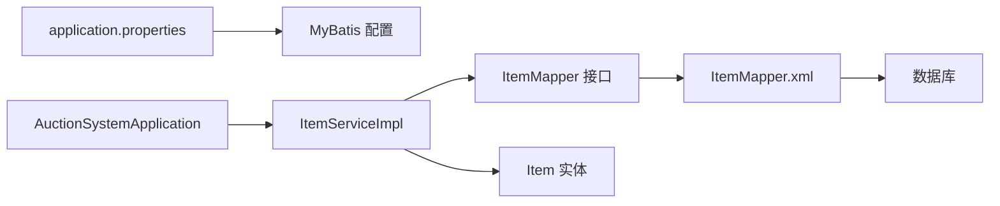

# 定时任务状态更新查询

<cite>
**本文引用的文件**
- [AuctionSystemApplication.java](file://src/main/java/com/qkl/auctionsystem/AuctionSystemApplication.java)
- [ItemServiceImpl.java](file://src/main/java/com/qkl/auctionsystem/service/impl/ItemServiceImpl.java)
- [ItemMapper.java](file://src/main/java/com/qkl/auctionsystem/mapper/ItemMapper.java)
- [ItemMapper.xml](file://src/main/resources/mapper/ItemMapper.xml)
- [Item.java](file://src/main/java/com/qkl/auctionsystem/pojo/entity/Item.java)
- [application.properties](file://src/main/resources/application.properties)
- [auction_database.sql](file://auction_database.sql)
</cite>

## 目录
1. [简介](#简介)
2. [项目结构](#项目结构)
3. [核心组件](#核心组件)
4. [架构总览](#架构总览)
5. [详细组件分析](#详细组件分析)
6. [依赖关系分析](#依赖关系分析)
7. [性能考量](#性能考量)
8. [故障排查指南](#故障排查指南)
9. [结论](#结论)
10. [附录](#附录)

## 简介
本文件围绕“定时任务状态更新查询”展开，尽管代码中未直接出现“SELECT * FROM auction_item WHERE end_time < NOW() AND status = 1”的显式SQL，但基于业务逻辑可推断系统具备该能力：通过定时任务扫描所有拍品，识别结束时间早于当前时间且状态为“竞拍中”的拍品，并将其状态更新为“已结束”，同时为最高出价用户生成待付款订单。本文将从系统架构、组件职责、数据流、索引优化、配置与监控等维度进行深入说明，并给出最佳实践建议。

## 项目结构
- 后端采用 Spring Boot + MyBatis 架构，服务层负责业务编排，持久层通过 Mapper 接口与 XML 映射 SQL。
- 定时任务位于服务实现类中，使用注解驱动的调度框架；数据库层面包含拍品表及必要的索引。

图表来源
- [AuctionSystemApplication.java](file://src/main/java/com/qkl/auctionsystem/AuctionSystemApplication.java#L1-L17)
- [ItemServiceImpl.java](file://src/main/java/com/qkl/auctionsystem/service/impl/ItemServiceImpl.java#L109-L147)
- [ItemMapper.java](file://src/main/java/com/qkl/auctionsystem/mapper/ItemMapper.java#L1-L35)
- [ItemMapper.xml](file://src/main/resources/mapper/ItemMapper.xml#L76-L109)
- [Item.java](file://src/main/java/com/qkl/auctionsystem/pojo/entity/Item.java#L1-L34)
- [auction_database.sql](file://auction_database.sql#L25-L45)

章节来源
- [AuctionSystemApplication.java](file://src/main/java/com/qkl/auctionsystem/AuctionSystemApplication.java#L1-L17)
- [ItemServiceImpl.java](file://src/main/java/com/qkl/auctionsystem/service/impl/ItemServiceImpl.java#L109-L147)
- [ItemMapper.java](file://src/main/java/com/qkl/auctionsystem/mapper/ItemMapper.java#L1-L35)
- [ItemMapper.xml](file://src/main/resources/mapper/ItemMapper.xml#L76-L109)
- [Item.java](file://src/main/java/com/qkl/auctionsystem/pojo/entity/Item.java#L1-L34)
- [auction_database.sql](file://auction_database.sql#L25-L45)

## 核心组件
- 定时任务入口：在服务实现类中声明调度方法，使用注解开启定时任务。
- 数据访问层：通过 Mapper 接口与 XML 映射，提供拍品全量查询与状态更新能力。
- 实体模型：包含拍品的核心字段，如开始/结束时间、当前最高价、状态等。
- 数据库索引：包含按结束时间与状态的索引，支撑范围查询与条件过滤。

章节来源
- [ItemServiceImpl.java](file://src/main/java/com/qkl/auctionsystem/service/impl/ItemServiceImpl.java#L109-L147)
- [ItemMapper.java](file://src/main/java/com/qkl/auctionsystem/mapper/ItemMapper.java#L1-L35)
- [ItemMapper.xml](file://src/main/resources/mapper/ItemMapper.xml#L76-L109)
- [Item.java](file://src/main/java/com/qkl/auctionsystem/pojo/entity/Item.java#L1-L34)
- [auction_database.sql](file://auction_database.sql#L25-L45)

## 架构总览
定时任务的执行流程如下：应用启动后启用调度；定时任务按固定周期触发，读取全部拍品，逐条判断状态与时间关系，必要时更新状态并生成订单。

图表来源
- [AuctionSystemApplication.java](file://src/main/java/com/qkl/auctionsystem/AuctionSystemApplication.java#L1-L17)
- [ItemServiceImpl.java](file://src/main/java/com/qkl/auctionsystem/service/impl/ItemServiceImpl.java#L109-L147)
- [ItemMapper.java](file://src/main/java/com/qkl/auctionsystem/mapper/ItemMapper.java#L1-L35)
- [ItemMapper.xml](file://src/main/resources/mapper/ItemMapper.xml#L76-L109)

## 详细组件分析

### 定时任务与状态更新逻辑
- 定时任务方法位于服务实现类中，使用注解开启调度。
- 执行流程：
  - 先获取全部拍品；
  - 对每个拍品判断当前时间与开始/结束时间的关系；
  - 若结束时间早于当前时间且状态不是“已结束”，则更新为“已结束”，并为最高出价用户生成待付款订单；
  - 若当前时间处于开始时间与结束时间之间且状态不是“竞拍中”，则更新为“竞拍中”。

图表来源
- [ItemServiceImpl.java](file://src/main/java/com/qkl/auctionsystem/service/impl/ItemServiceImpl.java#L109-L147)

章节来源
- [ItemServiceImpl.java](file://src/main/java/com/qkl/auctionsystem/service/impl/ItemServiceImpl.java#L109-L147)

### 数据访问层与 SQL 映射
- Mapper 接口提供全量拍品查询与状态更新方法。
- XML 中定义了全量拍品查询与状态更新语句，供服务层调用。

图表来源
- [ItemServiceImpl.java](file://src/main/java/com/qkl/auctionsystem/service/impl/ItemServiceImpl.java#L109-L147)
- [ItemMapper.java](file://src/main/java/com/qkl/auctionsystem/mapper/ItemMapper.java#L1-L35)
- [ItemMapper.xml](file://src/main/resources/mapper/ItemMapper.xml#L76-L109)
- [Item.java](file://src/main/java/com/qkl/auctionsystem/pojo/entity/Item.java#L1-L34)

章节来源
- [ItemMapper.java](file://src/main/java/com/qkl/auctionsystem/mapper/ItemMapper.java#L1-L35)
- [ItemMapper.xml](file://src/main/resources/mapper/ItemMapper.xml#L76-L109)
- [Item.java](file://src/main/java/com/qkl/auctionsystem/pojo/entity/Item.java#L1-L34)

### 预期 SQL 结构与实现映射
- 基于业务需求，预期的 SQL 查询结构为：查询结束时间早于当前时间且状态为“竞拍中”的拍品。
- 在现有实现中，服务层会先全量加载拍品，再在内存中进行时间与状态判断。若需直接在数据库侧完成筛选，可在 Mapper 层新增带条件的查询方法，并在 XML 中编写相应 SQL。
- 当前全量查询对应的 SQL 与方法如下：
  - 方法：selectAllItems
  - SQL：查询所有拍品记录
- 若新增条件查询，建议在 Mapper 接口与 XML 中分别新增：
  - 方法：selectItemsByEndTimeLessThanAndStatus(...)
  - SQL：WHERE end_time < NOW() AND status = 1

章节来源
- [ItemMapper.java](file://src/main/java/com/qkl/auctionsystem/mapper/ItemMapper.java#L1-L35)
- [ItemMapper.xml](file://src/main/resources/mapper/ItemMapper.xml#L76-L109)

### 数据库索引与性能影响
- 数据库拍品表包含多处索引，其中与定时任务密切相关的包括：
  - idx_end_time(end_time)：用于支持按结束时间进行范围查询与过滤。
  - idx_status(status)：用于快速筛选特定状态的拍品。
- 在现有实现中，服务层对全量拍品进行内存判断，因此 idx_end_time 的作用主要体现在全量查询阶段的排序与回表效率；若后续改为数据库侧过滤，idx_end_time 将显著降低扫描规模，提升整体性能。

章节来源
- [auction_database.sql](file://auction_database.sql#L25-L45)

## 依赖关系分析
- 组件耦合：
  - ItemServiceImpl 依赖 ItemMapper 接口；
  - ItemMapper 通过 MyBatis XML 映射到数据库；
  - ItemServiceImpl 依赖 Item 实体进行业务判断。
- 外部依赖：
  - 应用配置文件中定义了数据源与 MyBatis 映射路径；
  - 应用主类启用调度功能。

图表来源
- [application.properties](file://src/main/resources/application.properties#L1-L20)
- [AuctionSystemApplication.java](file://src/main/java/com/qkl/auctionsystem/AuctionSystemApplication.java#L1-L17)
- [ItemServiceImpl.java](file://src/main/java/com/qkl/auctionsystem/service/impl/ItemServiceImpl.java#L109-L147)
- [ItemMapper.java](file://src/main/java/com/qkl/auctionsystem/mapper/ItemMapper.java#L1-L35)
- [ItemMapper.xml](file://src/main/resources/mapper/ItemMapper.xml#L76-L109)

章节来源
- [application.properties](file://src/main/resources/application.properties#L1-L20)
- [AuctionSystemApplication.java](file://src/main/java/com/qkl/auctionsystem/AuctionSystemApplication.java#L1-L17)
- [ItemServiceImpl.java](file://src/main/java/com/qkl/auctionsystem/service/impl/ItemServiceImpl.java#L109-L147)
- [ItemMapper.java](file://src/main/java/com/qkl/auctionsystem/mapper/ItemMapper.java#L1-L35)
- [ItemMapper.xml](file://src/main/resources/mapper/ItemMapper.xml#L76-L109)

## 性能考量
- 当前实现为全量拍品扫描，内存中进行时间与状态判断。对于拍品数量较大时，可能带来以下问题：
  - 全量查询带来的网络与内存压力；
  - 内存中遍历与条件判断的 CPU 开销。
- 优化建议：
  - 在 Mapper 层新增条件查询方法，数据库侧过滤结束时间早于当前时间且状态为“竞拍中”的拍品，减少传输与处理的数据量；
  - 利用 idx_end_time 与 idx_status 索引，确保范围查询与等值过滤高效；
  - 控制定时任务频率，避免过于频繁的全量扫描；
  - 对订单生成等耗时操作进行异步化或批量处理，降低对定时任务主线程的影响。

[本节为通用性能讨论，不直接分析具体文件]

## 故障排查指南
- 日志定位：
  - 定时任务开始与结束的日志可用于确认任务是否按时触发与执行完成。
  - 状态更新与订单生成过程中的日志可用于定位异常。
- 常见问题与处理：
  - 任务未触发：检查应用主类是否启用调度，以及配置文件中是否正确设置数据源与 MyBatis 映射。
  - 状态更新异常：检查数据库连接、事务与权限，确认 SQL 更新语句是否正确。
  - 订单生成失败：检查订单表插入逻辑与异常捕获，关注最高出价用户与价格是否为空。

章节来源
- [ItemServiceImpl.java](file://src/main/java/com/qkl/auctionsystem/service/impl/ItemServiceImpl.java#L109-L147)
- [application.properties](file://src/main/resources/application.properties#L1-L20)

## 结论
- 系统通过定时任务实现了拍品状态的自动化管理，覆盖“竞拍中”到“已结束”的转换，并在结束后为最高出价用户生成待付款订单。
- 现有实现采用全量拍品扫描并在内存中判断，便于扩展但存在潜在性能瓶颈；建议在数据库侧增加条件过滤，并充分利用 idx_end_time 与 idx_status 索引。
- 通过合理的调度频率、日志监控与异步化策略，可进一步提升系统的稳定性与吞吐能力。

[本节为总结性内容，不直接分析具体文件]

## 附录

### 定时任务配置与最佳实践
- 启用调度：应用主类需启用调度功能，确保定时任务可用。
- 配置项参考：
  - 数据源与 MyBatis 映射路径已在配置文件中定义，保证 Mapper XML 正常加载。
- 最佳实践：
  - 合理设置 cron 表达式，避免过于频繁的全量扫描；
  - 对长时间运行的任务进行超时与重试控制；
  - 对关键路径（状态更新、订单生成）增加幂等性与补偿机制；
  - 使用指标监控任务执行时延、成功率与数据库负载。

章节来源
- [AuctionSystemApplication.java](file://src/main/java/com/qkl/auctionsystem/AuctionSystemApplication.java#L1-L17)
- [application.properties](file://src/main/resources/application.properties#L1-L20)