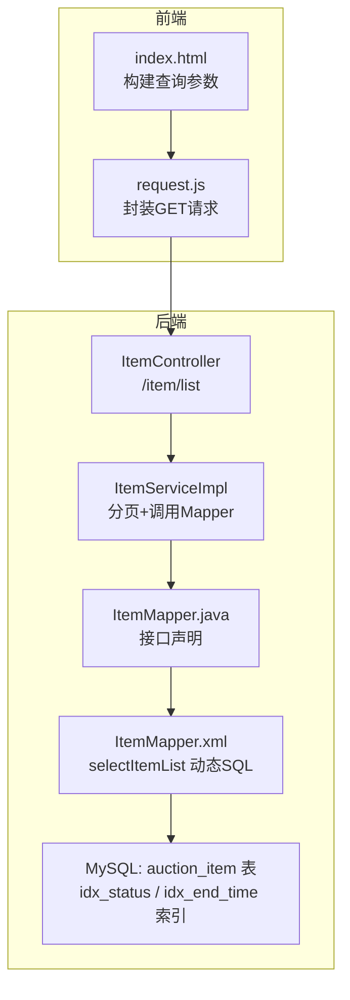
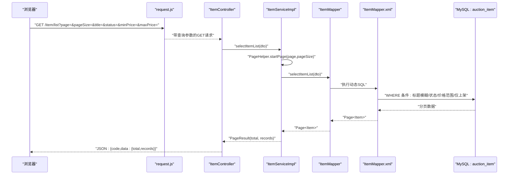
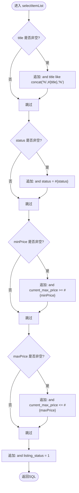
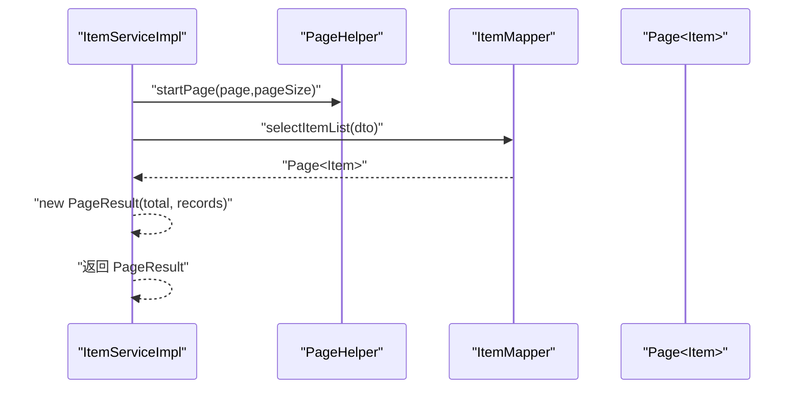
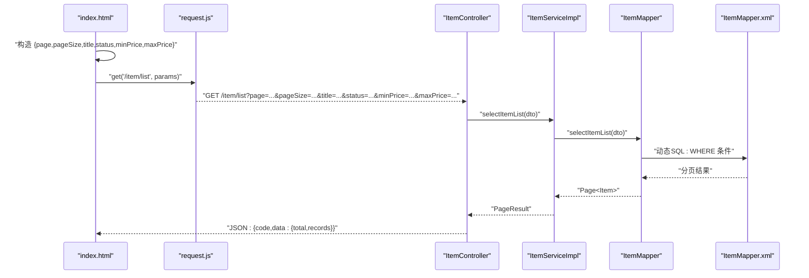
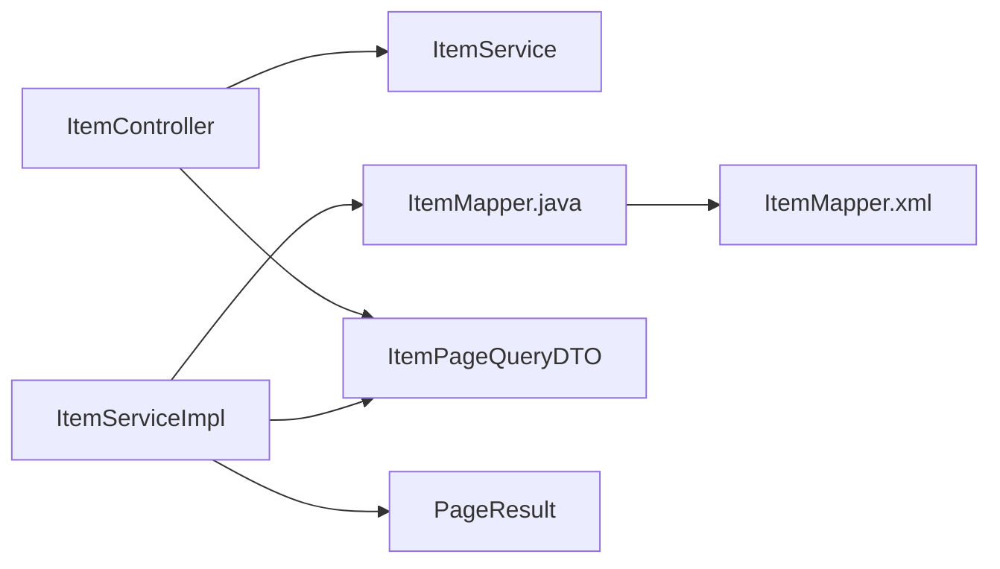

# 拍品列表分页查询

<cite>
**本文引用的文件**
- [ItemMapper.xml](file://src/main/resources/mapper/ItemMapper.xml)
- [ItemMapper.java](file://src/main/java/com/qkl/auctionsystem/mapper/ItemMapper.java)
- [ItemServiceImpl.java](file://src/main/java/com/qkl/auctionsystem/service/impl/ItemServiceImpl.java)
- [ItemService.java](file://src/main/java/com/qkl/auctionsystem/service/ItemService.java)
- [ItemController.java](file://src/main/java/com/qkl/auctionsystem/controller/ItemController.java)
- [ItemPageQueryDTO.java](file://src/main/java/com/qkl/auctionsystem/pojo/dto/ItemPageQueryDTO.java)
- [PageResult.java](file://src/main/java/com/qkl/auctionsystem/result/PageResult.java)
- [auction_database.sql](file://auction_database.sql)
- [request.js](file://html/utils/request.js)
- [index.html](file://html/index.html)
</cite>

## 目录
1. [简介](#简介)
2. [项目结构](#项目结构)
3. [核心组件](#核心组件)
4. [架构总览](#架构总览)
5. [详细组件分析](#详细组件分析)
6. [依赖分析](#依赖分析)
7. [性能考量](#性能考量)
8. [故障排查指南](#故障排查指南)
9. [结论](#结论)
10. [附录](#附录)

## 简介
本文件围绕“拍品列表分页查询”展开，重点解析以下内容：
- MyBatis 映射文件 ItemMapper.xml 中的 selectItemList 查询语句及其动态 WHERE 条件（标题模糊搜索、状态过滤、价格范围筛选、仅显示上架中 listing_status=1 的拍品）。
- 结合 PageHelper 分页插件，说明在 ItemServiceImpl 中如何实现分页逻辑。
- 提供前端请求参数与后端查询的映射关系，并给出实际 SQL 执行示例。
- 分析 idx_end_time 和 idx_status 索引对查询性能的影响。
- 总结可能的慢查询场景与优化建议。

## 项目结构
拍品列表分页查询涉及的模块与文件如下：
- 控制层：ItemController 提供 /item/list 接口，接收前端分页参数并返回 PageResult。
- 服务层：ItemServiceImpl 使用 PageHelper 开启分页，调用 ItemMapper.selectItemList 执行查询。
- 数据访问层：ItemMapper.java 声明方法；ItemMapper.xml 实现 selectItemList 的动态 SQL。
- DTO/模型：ItemPageQueryDTO 封装分页与筛选参数；PageResult 封装分页结果。
- 数据库：auction_item 表包含 idx_status、idx_end_time 等索引。

图表来源
- [ItemController.java](file://src/main/java/com/qkl/auctionsystem/controller/ItemController.java#L36-L41)
- [ItemServiceImpl.java](file://src/main/java/com/qkl/auctionsystem/service/impl/ItemServiceImpl.java#L46-L50)
- [ItemMapper.java](file://src/main/java/com/qkl/auctionsystem/mapper/ItemMapper.java#L16-L16)
- [ItemMapper.xml](file://src/main/resources/mapper/ItemMapper.xml#L41-L50)
- [auction_database.sql](file://auction_database.sql#L25-L45)

章节来源
- [ItemController.java](file://src/main/java/com/qkl/auctionsystem/controller/ItemController.java#L36-L41)
- [ItemServiceImpl.java](file://src/main/java/com/qkl/auctionsystem/service/impl/ItemServiceImpl.java#L46-L50)
- [ItemMapper.java](file://src/main/java/com/qkl/auctionsystem/mapper/ItemMapper.java#L16-L16)
- [ItemMapper.xml](file://src/main/resources/mapper/ItemMapper.xml#L41-L50)
- [auction_database.sql](file://auction_database.sql#L25-L45)

## 核心组件
- ItemMapper.xml 的 selectItemList：动态拼接 WHERE 条件，包含标题模糊匹配、状态过滤、价格范围过滤，且强制 listing_status=1。
- ItemServiceImpl 的 selectItemList：使用 PageHelper.startPage 设置当前页与每页大小，随后调用 Mapper 执行查询并封装 PageResult。
- ItemController 的 /item/list：接收前端 GET 请求参数，调用服务层并返回结果。
- ItemPageQueryDTO：承载 page、pageSize、title、status、minPrice、maxPrice 等查询参数。
- PageResult：封装 total 与 records，作为分页结果返回给前端。

章节来源
- [ItemMapper.xml](file://src/main/resources/mapper/ItemMapper.xml#L41-L50)
- [ItemServiceImpl.java](file://src/main/java/com/qkl/auctionsystem/service/impl/ItemServiceImpl.java#L46-L50)
- [ItemController.java](file://src/main/java/com/qkl/auctionsystem/controller/ItemController.java#L36-L41)
- [ItemPageQueryDTO.java](file://src/main/java/com/qkl/auctionsystem/pojo/dto/ItemPageQueryDTO.java#L1-L19)
- [PageResult.java](file://src/main/java/com/qkl/auctionsystem/result/PageResult.java#L1-L23)

## 架构总览
下面的序列图展示了从前端发起请求到数据库返回分页结果的完整流程。

图表来源
- [request.js](file://html/utils/request.js#L33-L47)
- [ItemController.java](file://src/main/java/com/qkl/auctionsystem/controller/ItemController.java#L36-L41)
- [ItemServiceImpl.java](file://src/main/java/com/qkl/auctionsystem/service/impl/ItemServiceImpl.java#L46-L50)
- [ItemMapper.java](file://src/main/java/com/qkl/auctionsystem/mapper/ItemMapper.java#L16-L16)
- [ItemMapper.xml](file://src/main/resources/mapper/ItemMapper.xml#L41-L50)

## 详细组件分析

### ItemMapper.xml 的 selectItemList 动态 WHERE 条件
- 标题模糊搜索：当传入 title 非空时，追加 title LIKE %title% 的条件。
- 状态过滤：当传入 status 非空时，追加 status = ? 的等值条件。
- 价格范围筛选：当传入 minPrice 或 maxPrice 非空时，分别追加 current_max_price >= ? 与 current_max_price <= ? 的范围条件。
- 仅显示上架中：固定条件 listing_status = 1，确保只返回上架中的拍品。
- 以上条件均位于 <where> 标签内，MyBatis 会自动处理 AND 前缀与多余的 AND/逗号问题。

图表来源
- [ItemMapper.xml](file://src/main/resources/mapper/ItemMapper.xml#L41-L50)

章节来源
- [ItemMapper.xml](file://src/main/resources/mapper/ItemMapper.xml#L41-L50)

### PageHelper 分页插件在 ItemServiceImpl 中的使用
- 在调用 Mapper 前，先调用 PageHelper.startPage(page, pageSize) 设置分页参数。
- 调用 Mapper 的 selectItemList 方法，返回 Page<T> 对象，其中包含 total 与 records。
- 将 Page 的 total 与 result 封装为 PageResult 返回给控制器。

图表来源
- [ItemServiceImpl.java](file://src/main/java/com/qkl/auctionsystem/service/impl/ItemServiceImpl.java#L46-L50)
- [ItemMapper.java](file://src/main/java/com/qkl/auctionsystem/mapper/ItemMapper.java#L16-L16)
- [PageResult.java](file://src/main/java/com/qkl/auctionsystem/result/PageResult.java#L1-L23)

章节来源
- [ItemServiceImpl.java](file://src/main/java/com/qkl/auctionsystem/service/impl/ItemServiceImpl.java#L46-L50)
- [PageResult.java](file://src/main/java/com/qkl/auctionsystem/result/PageResult.java#L1-L23)

### 前端请求参数与后端查询的映射关系
- 前端 index.html 构造查询参数：page、pageSize、可选的 title、status、minPrice、maxPrice。
- request.js 将参数拼接到 /item/list 的查询字符串中。
- ItemController 接收这些参数并封装为 ItemPageQueryDTO，调用 ItemServiceImpl。
- ItemServiceImpl 使用 PageHelper 分页，调用 ItemMapper.selectItemList 执行查询。

图表来源
- [index.html](file://html/index.html#L196-L208)
- [request.js](file://html/utils/request.js#L33-L47)
- [ItemController.java](file://src/main/java/com/qkl/auctionsystem/controller/ItemController.java#L36-L41)
- [ItemServiceImpl.java](file://src/main/java/com/qkl/auctionsystem/service/impl/ItemServiceImpl.java#L46-L50)
- [ItemMapper.xml](file://src/main/resources/mapper/ItemMapper.xml#L41-L50)

章节来源
- [index.html](file://html/index.html#L196-L208)
- [request.js](file://html/utils/request.js#L33-L47)
- [ItemController.java](file://src/main/java/com/qkl/auctionsystem/controller/ItemController.java#L36-L41)
- [ItemServiceImpl.java](file://src/main/java/com/qkl/auctionsystem/service/impl/ItemServiceImpl.java#L46-L50)
- [ItemMapper.xml](file://src/main/resources/mapper/ItemMapper.xml#L41-L50)

### 实际 SQL 执行示例
以下示例展示不同筛选条件下生成的 SQL 片段与最终 SQL 的组合方式（不直接展示具体 SQL 内容，仅说明生成逻辑）：
- 仅分页：生成基础 SELECT 语句，追加 listing_status=1，最终由 PageHelper 包裹 LIMIT。
- 标题模糊：追加 title LIKE %keyword%。
- 状态过滤：追加 status=?。
- 价格范围：追加 current_max_price >= minPrice 与 current_max_price <= maxPrice。
- 多条件组合：WHERE 条件按顺序拼接，MyBatis 自动处理 AND 前缀与多余逗号。

章节来源
- [ItemMapper.xml](file://src/main/resources/mapper/ItemMapper.xml#L41-L50)

### 数据库索引与查询性能分析
- 表结构与索引：auction_item 表包含 idx_status、idx_end_time 等索引，有助于加速状态与时间相关的查询。
- 本查询的动态 WHERE 条件中：
  - listing_status=1 固定条件，通常能利用 idx_listing_status（若存在）。
  - title LIKE %keyword% 无法使用前缀索引，可能回退全表扫描或使用覆盖索引策略。
  - status 等值条件可利用 idx_status。
  - price 范围条件 current_max_price BETWEEN min/max 可利用索引（若存在合适索引）。
- 建议：
  - 若频繁按 status+current_max_price 过滤，可考虑复合索引 (status, current_max_price)。
  - 若频繁按 end_time 过滤，可利用 idx_end_time。
  - 对于标题模糊搜索，可评估全文索引或前缀索引策略，减少回表成本。

章节来源
- [auction_database.sql](file://auction_database.sql#L25-L45)
- [ItemMapper.xml](file://src/main/resources/mapper/ItemMapper.xml#L41-L50)

## 依赖分析
- 控制器依赖服务层接口，服务层依赖 Mapper 接口，Mapper 接口对应 XML 映射文件。
- ItemPageQueryDTO 作为参数载体贯穿控制器、服务层与 Mapper。
- PageHelper 作为分页工具，作用于服务层调用 Mapper 的上下文。

图表来源
- [ItemController.java](file://src/main/java/com/qkl/auctionsystem/controller/ItemController.java#L36-L41)
- [ItemService.java](file://src/main/java/com/qkl/auctionsystem/service/ItemService.java#L16-L16)
- [ItemServiceImpl.java](file://src/main/java/com/qkl/auctionsystem/service/impl/ItemServiceImpl.java#L46-L50)
- [ItemMapper.java](file://src/main/java/com/qkl/auctionsystem/mapper/ItemMapper.java#L16-L16)
- [ItemMapper.xml](file://src/main/resources/mapper/ItemMapper.xml#L41-L50)
- [ItemPageQueryDTO.java](file://src/main/java/com/qkl/auctionsystem/pojo/dto/ItemPageQueryDTO.java#L1-L19)
- [PageResult.java](file://src/main/java/com/qkl/auctionsystem/result/PageResult.java#L1-L23)

章节来源
- [ItemController.java](file://src/main/java/com/qkl/auctionsystem/controller/ItemController.java#L36-L41)
- [ItemService.java](file://src/main/java/com/qkl/auctionsystem/service/ItemService.java#L16-L16)
- [ItemServiceImpl.java](file://src/main/java/com/qkl/auctionsystem/service/impl/ItemServiceImpl.java#L46-L50)
- [ItemMapper.java](file://src/main/java/com/qkl/auctionsystem/mapper/ItemMapper.java#L16-L16)
- [ItemMapper.xml](file://src/main/resources/mapper/ItemMapper.xml#L41-L50)
- [ItemPageQueryDTO.java](file://src/main/java/com/qkl/auctionsystem/pojo/dto/ItemPageQueryDTO.java#L1-L19)
- [PageResult.java](file://src/main/java/com/qkl/auctionsystem/result/PageResult.java#L1-L23)

## 性能考量
- 索引利用：
  - listing_status=1 的等值条件可利用 idx_listing_status（若存在）。
  - status 等值条件可利用 idx_status。
  - end_time 列上的 idx_end_time 有利于基于时间的筛选。
- LIKE %keyword% 的模糊匹配通常无法使用前缀索引，建议：
  - 评估是否可改用前缀匹配或全文索引。
  - 控制模糊词长度，避免过多回表。
- 价格范围查询：
  - 若频繁按 status+price 组合过滤，建议复合索引 (status, current_max_price)。
- 分页开销：
  - PageHelper 会在 SQL 上追加 LIMIT/OFFSET，注意大数据量下的 OFFSET 性能。
  - 可采用“基于游标”的分页策略（如按主键 ID 大于某值分页），降低 OFFSET 开销。
- 查询缓存：
  - 对稳定不变的拍品列表可考虑缓存热门筛选组合的结果，减少数据库压力。

[本节为通用性能指导，不直接分析具体文件]

## 故障排查指南
- 常见问题与定位：
  - 分页结果为空：确认 page、pageSize 是否正确传入；检查 listing_status=1 是否导致过滤过严。
  - 模糊搜索无效：确认 title 参数是否传入；LIKE %keyword% 不支持前缀索引。
  - 价格范围无结果：确认 minPrice/maxPrice 是否传入；注意 decimal 精度与单位。
  - 状态过滤异常：确认 status 是否为 0/1/2 的有效枚举值。
- 日志与调试：
  - ItemController 与 ItemServiceImpl 中包含日志输出，可在相应位置查看请求参数与执行结果。
  - 前端 request.js 统一处理响应，可在控制台查看网络请求与返回体。
- 错误处理：
  - 服务层与控制器均返回 Result 格式，前端根据 code 判断是否成功。

章节来源
- [ItemController.java](file://src/main/java/com/qkl/auctionsystem/controller/ItemController.java#L36-L41)
- [ItemServiceImpl.java](file://src/main/java/com/qkl/auctionsystem/service/impl/ItemServiceImpl.java#L46-L50)
- [request.js](file://html/utils/request.js#L33-L47)

## 结论
- selectItemList 的动态 WHERE 条件清晰地实现了标题模糊搜索、状态过滤、价格范围筛选，并强制仅返回上架中的拍品。
- PageHelper 在服务层统一开启分页，配合 MyBatis 的动态 SQL，形成简洁高效的分页查询链路。
- 前端通过 request.js 统一发起 GET 请求，将 page、pageSize 与可选筛选参数传至后端。
- 数据库层面的索引（idx_status、idx_end_time 等）对查询性能至关重要，建议结合业务场景优化复合索引与查询模式。

[本节为总结性内容，不直接分析具体文件]

## 附录
- 前端参数映射：
  - page -> page
  - pageSize -> pageSize
  - title -> title
  - status -> status
  - minPrice -> minPrice
  - maxPrice -> maxPrice
- 后端参数封装：
  - ItemPageQueryDTO 承载上述字段，作为 selectItemList 的入参。
- 返回结果：
  - PageResult 封装 total 与 records，供前端渲染分页控件与列表。

章节来源
- [ItemPageQueryDTO.java](file://src/main/java/com/qkl/auctionsystem/pojo/dto/ItemPageQueryDTO.java#L1-L19)
- [PageResult.java](file://src/main/java/com/qkl/auctionsystem/result/PageResult.java#L1-L23)
- [index.html](file://html/index.html#L196-L208)
- [request.js](file://html/utils/request.js#L33-L47)