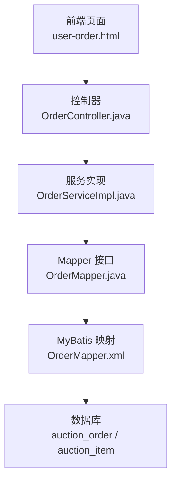
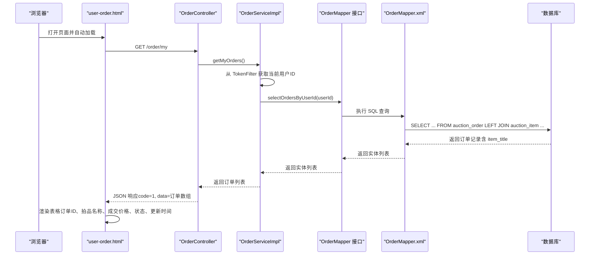
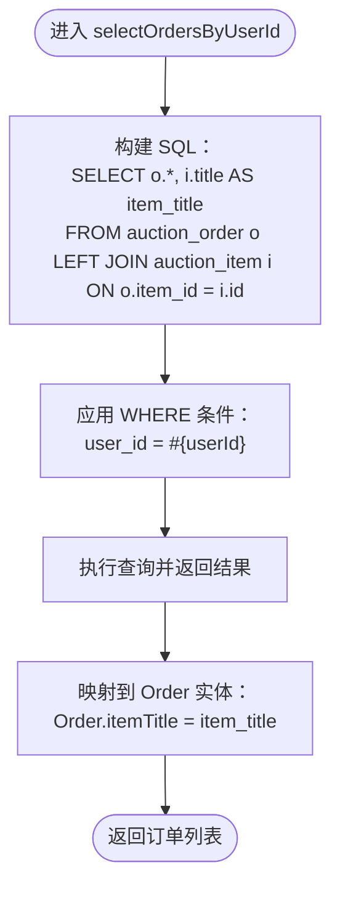
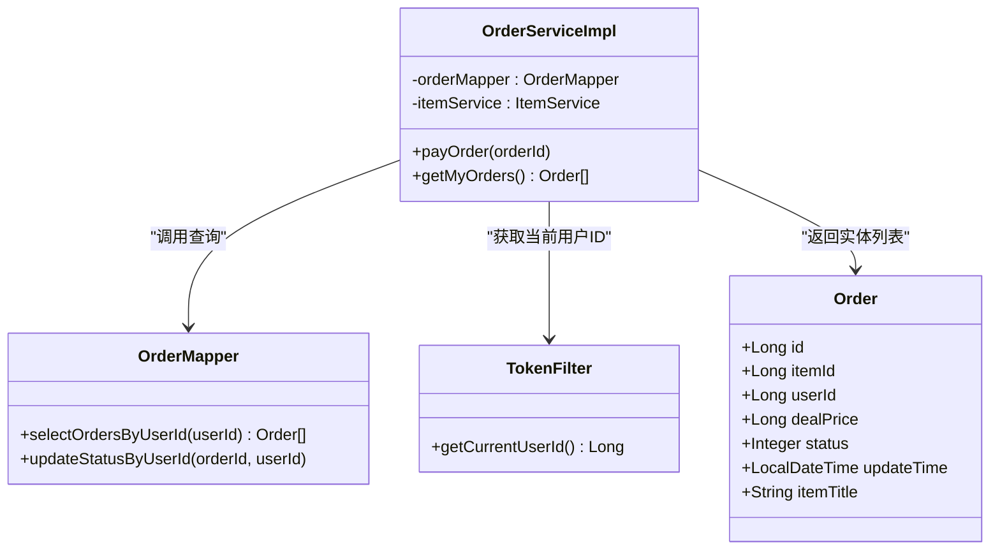
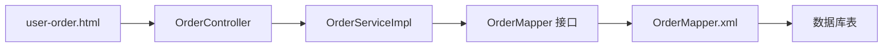

# 用户订单历史查询

<cite>
**本文引用的文件**
- [OrderMapper.xml](file://src/main/resources/mapper/OrderMapper.xml)
- [OrderMapper.java](file://src/main/java/com/qkl/auctionsystem/mapper/OrderMapper.java)
- [OrderServiceImpl.java](file://src/main/java/com/qkl/auctionsystem/service/impl/OrderServiceImpl.java)
- [OrderController.java](file://src/main/java/com/qkl/auctionsystem/controller/OrderController.java)
- [user-order.html](file://html/user-order.html)
- [TokenFilter.java](file://src/main/java/com/qkl/auctionsystem/filter/TokenFilter.java)
- [Order.java](file://src/main/java/com/qkl/auctionsystem/pojo/entity/Order.java)
- [auction_database.sql](file://auction_database.sql)
</cite>

## 目录
1. [简介](#简介)
2. [项目结构](#项目结构)
3. [核心组件](#核心组件)
4. [架构总览](#架构总览)
5. [详细组件分析](#详细组件分析)
6. [依赖关系分析](#依赖关系分析)
7. [性能考量](#性能考量)
8. [故障排查指南](#故障排查指南)
9. [结论](#结论)

## 简介
本文件围绕“用户订单历史查询”展开，重点分析 MyBatis 映射文件 OrderMapper.xml 中的 selectOrdersByUserId 查询，解释其 LEFT JOIN 操作如何将 auction_order 表与 auction_item 表连接，从而在查询结果中携带拍品标题（item_title），并通过 WHERE 条件按 user_id 过滤，确保用户仅能看到自己的订单。同时，文档说明该查询在前端页面 user-order.html 的数据支撑作用，以及在 OrderServiceImpl 中如何通过 TokenFilter 提取当前用户 ID 并调用该查询；最后给出 JOIN 性能优化建议及索引策略。

## 项目结构
与用户订单历史查询直接相关的模块与文件如下：
- 前端页面：html/user-order.html
- 后端控制器：controller/OrderController.java
- 业务服务：service/impl/OrderServiceImpl.java
- 数据访问层接口：mapper/OrderMapper.java
- MyBatis 映射：mapper/OrderMapper.xml
- 实体类：pojo/entity/Order.java
- 过滤器（鉴权与用户上下文）：filter/TokenFilter.java
- 数据库建表脚本：auction_database.sql

图表来源
- [OrderController.java](file://src/main/java/com/qkl/auctionsystem/controller/OrderController.java#L1-L43)
- [OrderServiceImpl.java](file://src/main/java/com/qkl/auctionsystem/service/impl/OrderServiceImpl.java#L1-L43)
- [OrderMapper.java](file://src/main/java/com/qkl/auctionsystem/mapper/OrderMapper.java#L1-L19)
- [OrderMapper.xml](file://src/main/resources/mapper/OrderMapper.xml#L1-L15)
- [auction_database.sql](file://auction_database.sql#L60-L72)

章节来源
- [OrderController.java](file://src/main/java/com/qkl/auctionsystem/controller/OrderController.java#L1-L43)
- [OrderServiceImpl.java](file://src/main/java/com/qkl/auctionsystem/service/impl/OrderServiceImpl.java#L1-L43)
- [OrderMapper.java](file://src/main/java/com/qkl/auctionsystem/mapper/OrderMapper.java#L1-L19)
- [OrderMapper.xml](file://src/main/resources/mapper/OrderMapper.xml#L1-L15)
- [user-order.html](file://html/user-order.html#L1-L251)
- [TokenFilter.java](file://src/main/java/com/qkl/auctionsystem/filter/TokenFilter.java#L1-L141)
- [Order.java](file://src/main/java/com/qkl/auctionsystem/pojo/entity/Order.java#L1-L24)
- [auction_database.sql](file://auction_database.sql#L60-L72)

## 核心组件
- MyBatis 查询映射：selectOrdersByUserId 负责从 auction_order 表左连接 auction_item 表，按 user_id 过滤，返回包含 item_title 的订单集合。
- Mapper 接口：定义 selectOrdersByUserId 方法签名，供服务层调用。
- 服务实现：OrderServiceImpl 在 getMyOrders 中从 TokenFilter 获取当前用户 ID，校验登录状态后调用 Mapper 查询。
- 控制器：OrderController 对外暴露 /order/my 接口，返回当前用户的订单列表。
- 前端页面：user-order.html 通过 GET /order/my 获取数据并渲染表格，展示订单 ID、拍品名称、成交价格、状态、更新时间等。

章节来源
- [OrderMapper.xml](file://src/main/resources/mapper/OrderMapper.xml#L9-L14)
- [OrderMapper.java](file://src/main/java/com/qkl/auctionsystem/mapper/OrderMapper.java#L16-L16)
- [OrderServiceImpl.java](file://src/main/java/com/qkl/auctionsystem/service/impl/OrderServiceImpl.java#L28-L42)
- [OrderController.java](file://src/main/java/com/qkl/auctionsystem/controller/OrderController.java#L33-L42)
- [user-order.html](file://html/user-order.html#L130-L197)
- [Order.java](file://src/main/java/com/qkl/auctionsystem/pojo/entity/Order.java#L16-L24)

## 架构总览
下面的序列图展示了“用户订单历史查询”的完整调用链路，从浏览器发起请求到数据库返回数据，再到前端渲染：

图表来源
- [user-order.html](file://html/user-order.html#L130-L197)
- [OrderController.java](file://src/main/java/com/qkl/auctionsystem/controller/OrderController.java#L33-L42)
- [OrderServiceImpl.java](file://src/main/java/com/qkl/auctionsystem/service/impl/OrderServiceImpl.java#L28-L42)
- [OrderMapper.java](file://src/main/java/com/qkl/auctionsystem/mapper/OrderMapper.java#L16-L16)
- [OrderMapper.xml](file://src/main/resources/mapper/OrderMapper.xml#L9-L14)
- [TokenFilter.java](file://src/main/java/com/qkl/auctionsystem/filter/TokenFilter.java#L27-L29)

## 详细组件分析

### MyBatis 查询：selectOrdersByUserId
- 查询语义
  - 从 auction_order 表（别名 o）左连接 auction_item 表（别名 i），连接条件为 o.item_id = i.id。
  - 使用列别名 i.title 作为 item_title，使查询结果具备拍品标题字段，便于前端直接展示。
  - WHERE 条件限定 user_id = #{userId}，确保用户只能看到自己的订单。
- 返回类型
  - resultType 指向 Order 实体类，其中包含 itemTitle 字段，用于承载拍品标题。
- 关联数据处理
  - 由于使用 LEFT JOIN，即使某些订单对应的拍品已被删除或不存在，仍会返回订单记录，item_title 可能为空；但根据业务规则，正常情况下应保证 auction_item 存在。

图表来源
- [OrderMapper.xml](file://src/main/resources/mapper/OrderMapper.xml#L9-L14)
- [Order.java](file://src/main/java/com/qkl/auctionsystem/pojo/entity/Order.java#L16-L24)

章节来源
- [OrderMapper.xml](file://src/main/resources/mapper/OrderMapper.xml#L9-L14)
- [Order.java](file://src/main/java/com/qkl/auctionsystem/pojo/entity/Order.java#L16-L24)

### 服务层：OrderServiceImpl.getMyOrders
- 登录校验
  - 通过 TokenFilter.getCurrentUserId() 获取当前用户 ID，若为空则抛出运行时异常提示未登录。
- 查询调用
  - 调用 OrderMapper.selectOrdersByUserId(userId)，捕获异常并包装为统一异常信息。
- 关联数据
  - 查询结果直接包含 itemTitle 字段，无需额外二次查询拍品标题。

图表来源
- [OrderServiceImpl.java](file://src/main/java/com/qkl/auctionsystem/service/impl/OrderServiceImpl.java#L1-L43)
- [OrderMapper.java](file://src/main/java/com/qkl/auctionsystem/mapper/OrderMapper.java#L1-L19)
- [TokenFilter.java](file://src/main/java/com/qkl/auctionsystem/filter/TokenFilter.java#L27-L29)
- [Order.java](file://src/main/java/com/qkl/auctionsystem/pojo/entity/Order.java#L1-L24)

章节来源
- [OrderServiceImpl.java](file://src/main/java/com/qkl/auctionsystem/service/impl/OrderServiceImpl.java#L28-L42)
- [TokenFilter.java](file://src/main/java/com/qkl/auctionsystem/filter/TokenFilter.java#L27-L29)
- [OrderMapper.java](file://src/main/java/com/qkl/auctionsystem/mapper/OrderMapper.java#L16-L16)

### 控制器：OrderController.getMyOrders
- 接口定义
  - GET /order/my 返回 Result<List<Order>>，内部调用服务层 getMyOrders。
- 错误处理
  - 服务层抛出的异常会被统一包装为 Result.error，前端可据此提示用户。

章节来源
- [OrderController.java](file://src/main/java/com/qkl/auctionsystem/controller/OrderController.java#L33-L42)

### 前端页面：user-order.html
- 数据加载
  - 页面加载完成后检查本地 token，若未登录则跳转登录页；否则调用 GET /order/my 获取订单数据。
- 渲染逻辑
  - 遍历返回的订单数组，将每个订单的 itemTitle、dealPrice、status、updateTime 等字段渲染到表格中。
  - 根据 status 值映射为中文状态文本并设置样式。
- 交互
  - 支持“立即付款”和“查看详情”按钮，分别触发支付或跳转拍品详情。

章节来源
- [user-order.html](file://html/user-order.html#L130-L197)

## 依赖关系分析
- 组件耦合
  - 前端仅依赖后端 /order/my 接口，耦合度低。
  - 后端控制器依赖服务层；服务层依赖 Mapper 接口；Mapper 接口由 MyBatis 映射文件实现。
- 安全性
  - 通过 TokenFilter 在过滤器阶段解析 JWT，将用户 ID 注入到当前线程上下文，服务层直接读取，避免在每个服务方法中重复解析 token。
- 数据一致性
  - 查询使用 LEFT JOIN，若 auction_item 缺失，itemTitle 可能为空；建议在业务层对空值进行兜底处理或在数据库层面约束 item_id 不为空。

图表来源
- [user-order.html](file://html/user-order.html#L130-L197)
- [OrderController.java](file://src/main/java/com/qkl/auctionsystem/controller/OrderController.java#L33-L42)
- [OrderServiceImpl.java](file://src/main/java/com/qkl/auctionsystem/service/impl/OrderServiceImpl.java#L28-L42)
- [OrderMapper.java](file://src/main/java/com/qkl/auctionsystem/mapper/OrderMapper.java#L16-L16)
- [OrderMapper.xml](file://src/main/resources/mapper/OrderMapper.xml#L9-L14)

## 性能考量
- JOIN 类型与数据量
  - 当前使用 LEFT JOIN，若 auction_order 数量较大而 auction_item 中部分 item_id 缺失，可能产生较多空值记录，影响前端渲染与网络传输。
- 索引建议
  - 在 auction_order.user_id 上建立索引（数据库脚本中已存在 idx_user_id），用于 WHERE 过滤。
  - 在 auction_order.item_id 上建立索引（数据库脚本中已存在 uk_item_id，但注意其为唯一索引，需确认是否满足业务需求；如允许重复且需频繁按 item_id 过滤，建议改为普通索引）。
  - 在 auction_item.id 上保持主键索引，以支持 JOIN 匹配。
- 查询优化建议
  - 若订单量巨大，可在 ORDER BY 子句中按 update_time 或 id 倒序分页，减少一次性返回的数据量。
  - 前端可采用懒加载或虚拟滚动渲染长列表，降低 DOM 压力。
  - 对 item_title 字段仅在必要时返回，避免冗余列传输。
- 安全与隔离
  - WHERE 条件 user_id 已确保用户只能看到自己的订单，无需额外权限控制。

章节来源
- [OrderMapper.xml](file://src/main/resources/mapper/OrderMapper.xml#L9-L14)
- [auction_database.sql](file://auction_database.sql#L60-L72)

## 故障排查指南
- 未登录或 token 无效
  - 现象：前端提示未授权或跳转登录页。
  - 原因：TokenFilter 拦截器未检测到有效 token 或解析失败。
  - 处理：检查请求头 token 是否正确，确认 JWT 未过期。
- 查询不到订单
  - 现象：页面显示“暂无订单数据”。
  - 原因：当前用户确实无订单，或 auction_item 中对应记录缺失导致 itemTitle 为空。
  - 处理：确认 auction_order 中 user_id 与当前用户一致；检查 auction_item 是否存在对应记录。
- 服务异常
  - 现象：后端抛出“查询订单失败”异常。
  - 原因：数据库连接异常、SQL 执行异常或 Mapper 映射问题。
  - 处理：查看服务层异常捕获日志，定位具体异常原因并修复。

章节来源
- [TokenFilter.java](file://src/main/java/com/qkl/auctionsystem/filter/TokenFilter.java#L85-L117)
- [OrderServiceImpl.java](file://src/main/java/com/qkl/auctionsystem/service/impl/OrderServiceImpl.java#L33-L41)
- [OrderController.java](file://src/main/java/com/qkl/auctionsystem/controller/OrderController.java#L33-L42)
- [user-order.html](file://html/user-order.html#L130-L197)

## 结论
selectOrdersByUserId 通过 LEFT JOIN 将订单与拍品标题关联，结合 WHERE user_id 过滤，实现了“用户只能查询自己的订单”的安全边界。服务层通过 TokenFilter 获取当前用户 ID，控制器对外暴露 /order/my 接口，前端页面负责数据渲染与交互。为提升性能与稳定性，建议在 user_id 和 item_id 字段上完善索引策略，并在业务层对空值进行友好兜底，同时考虑分页与前端渲染优化。