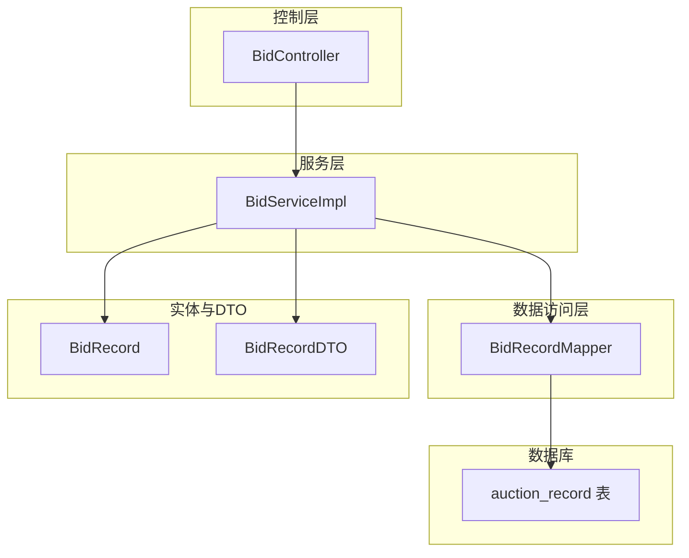
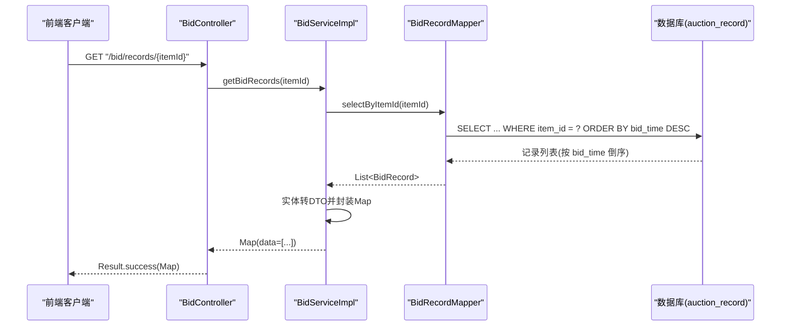
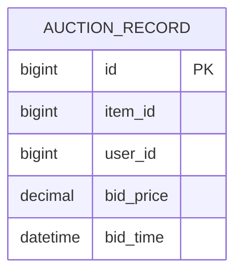
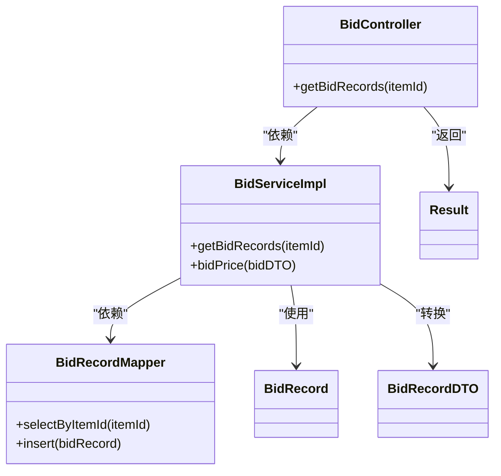

# 竞拍记录查询

<cite>
**本文引用的文件**
- [BidRecordMapper.java](file://src/main/java/com/qkl/auctionsystem/mapper/BidRecordMapper.java)
- [BidServiceImpl.java](file://src/main/java/com/qkl/auctionsystem/service/impl/BidServiceImpl.java)
- [BidController.java](file://src/main/java/com/qkl/auctionsystem/controller/BidController.java)
- [BidRecord.java](file://src/main/java/com/qkl/auctionsystem/pojo/entity/BidRecord.java)
- [BidRecordDTO.java](file://src/main/java/com/qkl/auctionsystem/pojo/dto/BidRecordDTO.java)
- [Result.java](file://src/main/java/com/qkl/auctionsystem/result/Result.java)
- [ItemMapper.xml](file://src/main/resources/mapper/ItemMapper.xml)
- [auction_database.sql](file://auction_database.sql)
</cite>

## 目录
1. [简介](#简介)
2. [项目结构](#项目结构)
3. [核心组件](#核心组件)
4. [架构总览](#架构总览)
5. [详细组件分析](#详细组件分析)
6. [依赖关系分析](#依赖关系分析)
7. [性能考量与索引建议](#性能考量与索引建议)
8. [API 调用示例与返回结构](#api-调用示例与返回结构)
9. [故障排查指南](#故障排查指南)
10. [结论](#结论)

## 简介
本文件围绕竞拍记录查询展开，重点解析 BidRecordMapper 中的 selectByItemId 方法：通过 item_id 进行关联查询，并按出价时间 bid_time 倒序排列，确保最新出价显示在最前。文档还说明该查询在竞拍详情页面的应用场景，以及在 BidServiceImpl 中如何处理并返回数据；同时分析 ORDER BY bid_time DESC 对性能的影响，并建议为 bid_time 字段建立索引以优化排序性能。最后提供 API 调用示例与返回数据结构说明，帮助开发者快速获取特定拍品的完整出价历史。

## 项目结构
与竞拍记录查询直接相关的模块包括：
- 控制层：BidController 提供对外接口，负责接收请求并返回统一结果包装
- 服务层：BidServiceImpl 实现业务逻辑，调用 Mapper 完成查询与数据转换
- 数据访问层：BidRecordMapper 定义 SQL 查询，使用 MyBatis 注解映射
- 实体与 DTO：BidRecord 映射数据库记录，BidRecordDTO 作为对外传输对象
- 数据库：auction_record 表包含 item_id、user_id、bid_price、bid_time 等字段，并已建立相关索引

图表来源
- [BidController.java](file://src/main/java/com/qkl/auctionsystem/controller/BidController.java#L1-L47)
- [BidServiceImpl.java](file://src/main/java/com/qkl/auctionsystem/service/impl/BidServiceImpl.java#L1-L75)
- [BidRecordMapper.java](file://src/main/java/com/qkl/auctionsystem/mapper/BidRecordMapper.java#L1-L19)
- [BidRecord.java](file://src/main/java/com/qkl/auctionsystem/pojo/entity/BidRecord.java#L1-L19)
- [BidRecordDTO.java](file://src/main/java/com/qkl/auctionsystem/pojo/dto/BidRecordDTO.java#L1-L29)
- [auction_database.sql](file://auction_database.sql#L47-L58)

章节来源
- [BidController.java](file://src/main/java/com/qkl/auctionsystem/controller/BidController.java#L1-L47)
- [BidServiceImpl.java](file://src/main/java/com/qkl/auctionsystem/service/impl/BidServiceImpl.java#L1-L75)
- [BidRecordMapper.java](file://src/main/java/com/qkl/auctionsystem/mapper/BidRecordMapper.java#L1-L19)
- [auction_database.sql](file://auction_database.sql#L47-L58)

## 核心组件
- BidRecordMapper：定义了 selectByItemId 查询方法，按 item_id 过滤并按 bid_time 倒序返回记录列表
- BidServiceImpl：调用 Mapper 获取记录，进行实体到 DTO 的转换，封装为 Map 返回
- BidController：提供 /bid/records/{itemId} 接口，返回统一 Result 包装
- BidRecord：实体类，映射 auction_record 表字段
- BidRecordDTO：对外传输对象，包含 bidTime（毫秒时间戳）、userId、bidPrice
- Result：统一响应包装类，包含 code、msg、data 字段

章节来源
- [BidRecordMapper.java](file://src/main/java/com/qkl/auctionsystem/mapper/BidRecordMapper.java#L1-L19)
- [BidServiceImpl.java](file://src/main/java/com/qkl/auctionsystem/service/impl/BidServiceImpl.java#L55-L75)
- [BidController.java](file://src/main/java/com/qkl/auctionsystem/controller/BidController.java#L36-L47)
- [BidRecord.java](file://src/main/java/com/qkl/auctionsystem/pojo/entity/BidRecord.java#L1-L19)
- [BidRecordDTO.java](file://src/main/java/com/qkl/auctionsystem/pojo/dto/BidRecordDTO.java#L1-L29)
- [Result.java](file://src/main/java/com/qkl/auctionsystem/result/Result.java#L1-L39)

## 架构总览
下面的时序图展示了从竞拍详情页面发起请求到返回完整出价历史的关键流程。

图表来源
- [BidController.java](file://src/main/java/com/qkl/auctionsystem/controller/BidController.java#L36-L47)
- [BidServiceImpl.java](file://src/main/java/com/qkl/auctionsystem/service/impl/BidServiceImpl.java#L55-L75)
- [BidRecordMapper.java](file://src/main/java/com/qkl/auctionsystem/mapper/BidRecordMapper.java#L17-L18)
- [auction_database.sql](file://auction_database.sql#L47-L58)

## 详细组件分析

### 数据模型与表结构
- 竞拍记录表 auction_record 包含以下关键字段：
  - item_id：关联拍品 ID
  - user_id：出价用户 ID
  - bid_price：出价金额
  - bid_time：出价时间
- 已建立索引：
  - idx_item_id：加速按拍品过滤
  - idx_user_id：加速按用户过滤
  - idx_bid_time：加速按时间排序

图表来源
- [auction_database.sql](file://auction_database.sql#L47-L58)

章节来源
- [auction_database.sql](file://auction_database.sql#L47-L58)

### SQL 查询解析：selectByItemId
- 查询目标：根据 item_id 过滤竞拍记录
- 排序规则：ORDER BY bid_time DESC，使最新出价排在最前
- 返回字段：id、item_id、user_id、bid_price、bid_time（使用 MyBatis 结果映射为实体属性）

该 SQL 在以下文件中定义：
- [BidRecordMapper.java](file://src/main/java/com/qkl/auctionsystem/mapper/BidRecordMapper.java#L17-L18)

章节来源
- [BidRecordMapper.java](file://src/main/java/com/qkl/auctionsystem/mapper/BidRecordMapper.java#L17-L18)

### 服务层处理：BidServiceImpl.getBidRecords
- 调用 Mapper 获取记录列表
- 将实体 BidRecord 转换为 DTO BidRecordDTO
- 时间字段转换：将 LocalDateTime 转换为毫秒时间戳
- 金额字段转换：将 BigDecimal 转换为 Long（以“分”为单位）
- 封装为 Map 并返回

该方法位于：
- [BidServiceImpl.java](file://src/main/java/com/qkl/auctionsystem/service/impl/BidServiceImpl.java#L55-L75)

章节来源
- [BidServiceImpl.java](file://src/main/java/com/qkl/auctionsystem/service/impl/BidServiceImpl.java#L55-L75)

### 控制层接口：BidController.getBidRecords
- 提供 REST 接口 GET /bid/records/{itemId}
- 日志记录请求参数
- 调用服务层并返回统一 Result.success 包装

该接口位于：
- [BidController.java](file://src/main/java/com/qkl/auctionsystem/controller/BidController.java#L36-L47)

章节来源
- [BidController.java](file://src/main/java/com/qkl/auctionsystem/controller/BidController.java#L36-L47)

### 实体与 DTO 映射
- 实体 BidRecord：包含 id、itemId、userId、bidPrice、bidTime
- DTO BidRecordDTO：包含 bidTime（毫秒时间戳）、userId、bidPrice

映射逻辑参考：
- [BidRecord.java](file://src/main/java/com/qkl/auctionsystem/pojo/entity/BidRecord.java#L1-L19)
- [BidRecordDTO.java](file://src/main/java/com/qkl/auctionsystem/pojo/dto/BidRecordDTO.java#L1-L29)
- [BidServiceImpl.java](file://src/main/java/com/qkl/auctionsystem/service/impl/BidServiceImpl.java#L60-L68)

章节来源
- [BidRecord.java](file://src/main/java/com/qkl/auctionsystem/pojo/entity/BidRecord.java#L1-L19)
- [BidRecordDTO.java](file://src/main/java/com/qkl/auctionsystem/pojo/dto/BidRecordDTO.java#L1-L29)
- [BidServiceImpl.java](file://src/main/java/com/qkl/auctionsystem/service/impl/BidServiceImpl.java#L60-L68)

### 竞拍详情页面应用场景
- 当用户进入某拍品详情页时，前端调用 /bid/records/{itemId} 获取该拍品的完整出价历史
- 服务端按 bid_time 倒序返回，确保最新出价在顶部展示
- 前端可据此渲染“出价时间线”，便于用户了解竞拍动态

章节来源
- [BidController.java](file://src/main/java/com/qkl/auctionsystem/controller/BidController.java#L36-L47)
- [BidServiceImpl.java](file://src/main/java/com/qkl/auctionsystem/service/impl/BidServiceImpl.java#L55-L75)
- [auction_database.sql](file://auction_database.sql#L47-L58)

## 依赖关系分析
- 控制层依赖服务层
- 服务层依赖数据访问层与实体/DTO
- 数据访问层依赖数据库表结构
- 统一返回包装由 Result 提供

图表来源
- [BidController.java](file://src/main/java/com/qkl/auctionsystem/controller/BidController.java#L1-L47)
- [BidServiceImpl.java](file://src/main/java/com/qkl/auctionsystem/service/impl/BidServiceImpl.java#L1-L75)
- [BidRecordMapper.java](file://src/main/java/com/qkl/auctionsystem/mapper/BidRecordMapper.java#L1-L19)
- [BidRecord.java](file://src/main/java/com/qkl/auctionsystem/pojo/entity/BidRecord.java#L1-L19)
- [BidRecordDTO.java](file://src/main/java/com/qkl/auctionsystem/pojo/dto/BidRecordDTO.java#L1-L29)
- [Result.java](file://src/main/java/com/qkl/auctionsystem/result/Result.java#L1-L39)

章节来源
- [BidController.java](file://src/main/java/com/qkl/auctionsystem/controller/BidController.java#L1-L47)
- [BidServiceImpl.java](file://src/main/java/com/qkl/auctionsystem/service/impl/BidServiceImpl.java#L1-L75)
- [BidRecordMapper.java](file://src/main/java/com/qkl/auctionsystem/mapper/BidRecordMapper.java#L1-L19)
- [Result.java](file://src/main/java/com/qkl/auctionsystem/result/Result.java#L1-L39)

## 性能考量与索引建议
- ORDER BY bid_time DESC 的影响：
  - 若未建立索引，数据库需对匹配的记录进行排序，可能导致全表扫描或临时文件排序，影响性能
  - 当记录量较大时，排序成本会显著上升
- 现状与建议：
  - 数据库表已建立 idx_bid_time 索引，有助于加速按 bid_time 排序
  - 建议在高并发场景下结合 item_id 索引使用复合索引策略（例如按 item_id + bid_time 的组合排序），进一步减少回表与排序开销
- 其他优化方向：
  - 分页查询：当前实现返回全部记录，建议引入分页（page/pageSize）以降低单次响应数据量
  - 缓存：对热门拍品的最近 N 条记录进行缓存，减少数据库压力
  - 监控：对慢查询进行监控与分析，持续优化

章节来源
- [auction_database.sql](file://auction_database.sql#L47-L58)
- [BidRecordMapper.java](file://src/main/java/com/qkl/auctionsystem/mapper/BidRecordMapper.java#L17-L18)

## API 调用示例与返回结构
- 接口地址：GET /bid/records/{itemId}
- 请求参数：
  - 路径参数 itemId：拍品 ID
- 返回结构：
  - Result.success(data)
  - data：数组，元素为对象，包含
    - bidTime：毫秒时间戳
    - userId：出价用户 ID
    - bidPrice：出价金额（Long，单位为“分”）

示例调用路径参考：
- [BidController.java](file://src/main/java/com/qkl/auctionsystem/controller/BidController.java#L36-L47)

返回结构说明：
- [Result.java](file://src/main/java/com/qkl/auctionsystem/result/Result.java#L1-L39)
- [BidRecordDTO.java](file://src/main/java/com/qkl/auctionsystem/pojo/dto/BidRecordDTO.java#L1-L29)
- [BidServiceImpl.java](file://src/main/java/com/qkl/auctionsystem/service/impl/BidServiceImpl.java#L55-L75)

章节来源
- [BidController.java](file://src/main/java/com/qkl/auctionsystem/controller/BidController.java#L36-L47)
- [Result.java](file://src/main/java/com/qkl/auctionsystem/result/Result.java#L1-L39)
- [BidRecordDTO.java](file://src/main/java/com/qkl/auctionsystem/pojo/dto/BidRecordDTO.java#L1-L29)
- [BidServiceImpl.java](file://src/main/java/com/qkl/auctionsystem/service/impl/BidServiceImpl.java#L55-L75)

## 故障排查指南
- 常见问题与定位思路：
  - 查询无结果：确认 itemId 是否正确、是否存在对应记录
  - 排序异常：检查 bid_time 字段是否为空或不一致；确认索引是否生效
  - 性能问题：关注慢查询日志，评估是否需要分页或缓存
  - 数据类型不一致：确认前端期望的 bidPrice 单位（分）与后端转换逻辑一致
- 参考实现位置：
  - 查询入口与返回包装：[BidController.java](file://src/main/java/com/qkl/auctionsystem/controller/BidController.java#L36-L47)
  - 查询与转换逻辑：[BidServiceImpl.java](file://src/main/java/com/qkl/auctionsystem/service/impl/BidServiceImpl.java#L55-L75)
  - SQL 定义与排序：[BidRecordMapper.java](file://src/main/java/com/qkl/auctionsystem/mapper/BidRecordMapper.java#L17-L18)
  - 表结构与索引：[auction_database.sql](file://auction_database.sql#L47-L58)

章节来源
- [BidController.java](file://src/main/java/com/qkl/auctionsystem/controller/BidController.java#L36-L47)
- [BidServiceImpl.java](file://src/main/java/com/qkl/auctionsystem/service/impl/BidServiceImpl.java#L55-L75)
- [BidRecordMapper.java](file://src/main/java/com/qkl/auctionsystem/mapper/BidRecordMapper.java#L17-L18)
- [auction_database.sql](file://auction_database.sql#L47-L58)

## 结论
- selectByItemId 通过 item_id 过滤并按 bid_time 倒序返回，满足竞拍详情页“最新出价优先”的展示需求
- 服务层完成实体到 DTO 的转换与封装，控制层统一返回 Result，形成清晰的分层架构
- 数据库已具备 bid_time 索引，有利于排序性能；建议在高并发场景下引入分页与缓存策略
- 开发者可通过 /bid/records/{itemId} 快速获取特定拍品的完整出价历史，返回结构明确，便于前端集成