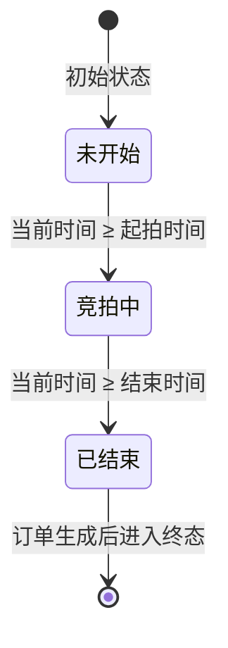

# 数据库设计

<cite>
**本文档引用的文件**  
- [auction_database.sql](file://auction_database.sql)
- [说明.md](file://说明.md)
- [User.java](file://src/main/java/com/qkl/auctionsystem/pojo/entity/User.java)
- [Item.java](file://src/main/java/com/qkl/auctionsystem/pojo/entity/Item.java)
- [BidRecord.java](file://src/main/java/com/qkl/auctionsystem/pojo/entity/BidRecord.java)
- [Order.java](file://src/main/java/com/qkl/auctionsystem/pojo/entity/Order.java)
- [ItemMapper.xml](file://src/main/resources/mapper/ItemMapper.xml)
- [OrderMapper.xml](file://src/main/resources/mapper/OrderMapper.xml)
- [ItemServiceImpl.java](file://src/main/java/com/qkl/auctionsystem/service/impl/ItemServiceImpl.java)
- [BidServiceImpl.java](file://src/main/java/com/qkl/auctionsystem/service/impl/BidServiceImpl.java)
</cite>

## 目录
1. [引言](#引言)
2. [核心表结构说明](#核心表结构说明)
   - [用户表（user）](#用户表user)
   - [拍品表（auction_item）](#拍品表auction_item)
   - [竞拍记录表（auction_record）](#竞拍记录表auction_record)
   - [订单表（auction_order）](#订单表auction_order)
3. [实体关系图（ER图）](#实体关系图er图)
4. [状态字段流转逻辑](#状态字段流转逻辑)
5. [数据一致性验证](#数据一致性验证)
6. [典型查询SQL示例](#典型查询sql示例)
7. [结论](#结论)

## 引言
本文档基于 `auction_database.sql` 脚本和 Java 实体类，详细描述拍卖系统中的四张核心数据库表：用户表（user）、拍品表（auction_item）、竞拍记录表（auction_record）和订单表（auction_order）。通过字段级说明、ER图展示、状态流转分析以及典型SQL查询示例，帮助开发者全面理解系统的数据模型与访问模式。

**文档来源**
- [auction_database.sql](file://auction_database.sql)
- [说明.md](file://说明.md)

## 核心表结构说明

### 用户表（user）
存储系统用户信息，包括普通用户和管理员。

| 字段名 | 类型 | 约束 | 索引 | 业务含义 |
|--------|------|------|------|----------|
| id | BIGINT | 主键，自增 | PRIMARY KEY | 用户唯一标识 |
| username | VARCHAR(50) | NOT NULL，UNIQUE | uk_username | 登录用户名，唯一 |
| password | VARCHAR(128) | NOT NULL | 无 | 加密后的密码 |
| role | TINYINT | NOT NULL，默认值1 | 无 | 角色：0-管理员，1-普通用户 |
| create_time | DATETIME | NOT NULL，默认CURRENT_TIMESTAMP | 无 | 创建时间 |
| update_time | DATETIME | NOT NULL，默认CURRENT_TIMESTAMP ON UPDATE CURRENT_TIMESTAMP | 无 | 最后更新时间 |

**业务规则**：
- 用户注册时默认角色为普通用户（role=1）
- 管理员通过专用接口登录（role=0）
- 密码需加密存储（如BCrypt）

**Section sources**
- [auction_database.sql](file://auction_database.sql#L14-L23)
- [User.java](file://src/main/java/com/qkl/auctionsystem/pojo/entity/User.java)

### 拍品表（auction_item）
存储拍卖物品的基本信息及状态。

| 字段名 | 类型 | 约束 | 索引 | 业务含义 |
|--------|------|------|------|----------|
| id | BIGINT | 主键，自增 | PRIMARY KEY | 拍品唯一标识 |
| title | VARCHAR(100) | NOT NULL | 无 | 拍品名称 |
| image | VARCHAR(255) | 可为空 | 无 | 拍品图片URL |
| initial_price | DECIMAL(10,2) | NOT NULL | 无 | 起拍价（单位：元） |
| description | VARCHAR(500) | 可为空 | 无 | 拍品描述 |
| start_time | DATETIME | NOT NULL | idx_start_time | 起拍时间 |
| end_time | DATETIME | NOT NULL | idx_end_time | 结束时间 |
| current_max_price | DECIMAL(10,2) | NOT NULL，默认0.00 | 无 | 当前最高出价 |
| current_max_user_id | BIGINT | 可为空 | 无 | 当前最高出价用户ID |
| status | TINYINT | NOT NULL，默认0 | idx_status | 状态：0-未开始，1-竞拍中，2-已结束 |
| listing_status | TINYINT | NOT NULL，默认1 | idx_listing_status | 上架状态：0-下架，1-上架 |
| create_time | DATETIME | NOT NULL，默认CURRENT_TIMESTAMP | 无 | 创建时间 |
| update_time | DATETIME | NOT NULL，默认CURRENT_TIMESTAMP ON UPDATE CURRENT_TIMESTAMP | 无 | 最后更新时间 |

**业务规则**：
- 添加拍品时，`current_max_price` 初始化为 `initial_price`
- `status` 由定时任务自动更新
- `listing_status` 控制是否可被普通用户查看

**Section sources**
- [auction_database.sql](file://auction_database.sql#L26-L45)
- [Item.java](file://src/main/java/com/qkl/auctionsystem/pojo/entity/Item.java)

### 竞拍记录表（auction_record）
记录用户的每一次出价行为。

| 字段名 | 类型 | 约束 | 索引 | 业务含义 |
|--------|------|------|------|----------|
| id | BIGINT | 主键，自增 | PRIMARY KEY | 记录唯一标识 |
| item_id | BIGINT | NOT NULL | idx_item_id | 关联的拍品ID |
| user_id | BIGINT | NOT NULL | idx_user_id | 出价用户ID |
| bid_price | DECIMAL(10,2) | NOT NULL | 无 | 出价金额（元） |
| bid_time | DATETIME | NOT NULL，默认CURRENT_TIMESTAMP | idx_bid_time | 出价时间 |

**业务规则**：
- 每次出价都会插入一条新记录
- 出价成功后同步更新 `auction_item` 表中的 `current_max_price` 和 `current_max_user_id`
- 所有出价记录实时上链，确保不可篡改

**Section sources**
- [auction_database.sql](file://auction_database.sql#L47-L58)
- [BidRecord.java](file://src/main/java/com/qkl/auctionsystem/pojo/entity/BidRecord.java)

### 订单表（auction_order）
存储拍卖成交后的订单信息。

| 字段名 | 类型 | 约束 | 索引 | 业务含义 |
|--------|------|------|------|----------|
| id | BIGINT | 主键，自增 | PRIMARY KEY | 订单唯一标识 |
| item_id | BIGINT | NOT NULL | uk_item_id（唯一索引） | 关联的拍品ID |
| user_id | BIGINT | NOT NULL | idx_user_id | 买家ID |
| deal_price | DECIMAL(10,2) | NOT NULL | 无 | 成交价格（等于最终最高价） |
| status | TINYINT | NOT NULL，默认0 | idx_status | 状态：0-待付款，1-已完成 |
| update_time | DATETIME | NOT NULL，默认CURRENT_TIMESTAMP ON UPDATE CURRENT_TIMESTAMP | 无 | 最后更新时间 |

**业务规则**：
- 拍品状态变为“已结束”（status=2）且存在最高出价用户时，自动生成订单
- 每件拍品最多生成一个订单（由 `uk_item_id` 唯一索引保证）
- 用户完成付款后，订单状态更新为“已完成”

**Section sources**
- [auction_database.sql](file://auction_database.sql#L60-L72)
- [Order.java](file://src/main/java/com/qkl/auctionsystem/pojo/entity/Order.java)

## 实体关系图（ER图）

```mermaid
erDiagram
    user {
        bigint id PK
        varchar(50) username UK
        varchar(128) password
        tinyint role
        datetime create_time
        datetime update_time
    }
    auction_item {
        bigint id PK
        varchar(100) title
        varchar(255) image
        decimal(10,2) initial_price
        varchar(500) description
        datetime start_time
        datetime end_time
        decimal(10,2) current_max_price
        bigint current_max_user_id FK
        tinyint status
        tinyint listing_status
        datetime create_time
        datetime update_time
    }
    auction_record {
        bigint id PK
        bigint item_id FK
        bigint user_id FK
        decimal(10,2) bid_price
        datetime bid_time
    }
    auction_order {
        bigint id PK
        bigint item_id FK UK
        bigint user_id FK
        decimal(10,2) deal_price
        tinyint status
        datetime update_time
    }
    user ||--o{ auction_item : "创建"
    user ||--o{ auction_record : "出价"
    user ||--o{ auction_order : "购买"
    auction_item ||--o{ auction_record : "包含"
    auction_item ||--|| auction_order : "一对一"
```

**Diagram sources**
- [auction_database.sql](file://auction_database.sql#L14-L72)
- [说明.md](file://说明.md#L6-L50)

## 状态字段流转逻辑

### status 字段（拍品状态）
表示拍品的生命周期状态，由定时任务自动更新。



**流转规则**：
- **未开始（0）**：初始状态，尚未到达 `start_time`
- **竞拍中（1）**：当前时间在 `start_time` 和 `end_time` 之间
- **已结束（2）**：当前时间超过 `end_time`，系统自动关闭竞拍并生成订单

**触发机制**：
- 定时任务每分钟执行一次 `updateItemStatusScheduled()` 方法
- 根据当前时间与 `start_time`/`end_time` 比较自动更新状态

**Section sources**
- [ItemServiceImpl.java](file://src/main/java/com/qkl/auctionsystem/service/impl/ItemServiceImpl.java#L114-L147)
- [说明.md](file://说明.md#L104-L108)

### listing_status 字段（上架状态）
表示拍品是否对外展示。

| 值 | 含义 | 可操作 |
|----|------|--------|
| 0 | 下架 | 管理员可修改、删除 |
| 1 | 上架 | 用户可见，不可修改 |

**业务规则**：
- 新增拍品默认为下架状态（0）
- 只有下架状态的拍品才能被修改或删除
- 上架后用户可在列表页查看

**Section sources**
- [ItemServiceImpl.java](file://src/main/java/com/qkl/auctionsystem/service/impl/ItemServiceImpl.java#L41)
- [ItemController.java](file://src/main/java/com/qkl/auctionsystem/controller/ItemController.java#L80-L85)

## 数据一致性验证

根据 `说明.md` 中的设计文档，系统通过以下机制保障数据一致性：

1. **唯一性约束**
   - `user.username` 唯一索引防止重复注册
   - `auction_order.item_id` 唯一索引确保每件拍品最多生成一个订单

2. **状态校验**
   - 修改/删除拍品前检查 `listing_status = 0`
   - 出价前校验拍品状态为“竞拍中”

3. **事务性操作**
   - 出价操作包含两个步骤：插入竞拍记录 + 更新最高出价
   - 虽然未显式使用事务注解，但依赖数据库外键和业务逻辑保证一致性

4. **定时任务补偿**
   - 每分钟检查拍品状态，避免因系统异常导致状态停滞
   - 拍品结束后自动触发订单生成，防止遗漏

**Section sources**
- [说明.md](file://说明.md#L98-L112)
- [ItemServiceImpl.java](file://src/main/java/com/qkl/auctionsystem/service/impl/ItemServiceImpl.java#L114-L182)

## 典型查询SQL示例

### 1. 查询所有进行中的拍品
```sql
SELECT * FROM auction_item 
WHERE status = 1 AND listing_status = 1;
```

### 2. 查询某拍品的所有竞拍记录（按时间倒序）
```sql
SELECT * FROM auction_record 
WHERE item_id = ? 
ORDER BY bid_time DESC;
```

### 3. 查询用户的所有待付款订单
```sql
SELECT o.*, i.title as item_title 
FROM auction_order o 
LEFT JOIN auction_item i ON o.item_id = i.id 
WHERE o.user_id = ? AND o.status = 0;
```

### 4. 更新拍品最高出价（带价格比较）
```sql
UPDATE auction_item 
SET current_max_price = ?, current_max_user_id = ? 
WHERE id = ? AND (current_max_price IS NULL OR current_max_price < ?);
```

### 5. 生成订单（仅当无订单时）
```sql
INSERT INTO auction_order (item_id, user_id, deal_price, status) 
VALUES (?, ?, ?, 0);
-- 注意：uk_item_id 唯一索引防止重复插入
```

**Section sources**
- [ItemMapper.xml](file://src/main/resources/mapper/ItemMapper.xml)
- [OrderMapper.xml](file://src/main/resources/mapper/OrderMapper.xml)

## 结论
本系统数据库设计合理，四张核心表结构清晰，关系明确。通过 `status` 和 `listing_status` 双状态机控制拍品生命周期，结合定时任务实现自动化状态流转。数据一致性通过唯一索引、业务校验和定时补偿机制共同保障。建议未来可引入分布式事务或消息队列进一步提升可靠性。