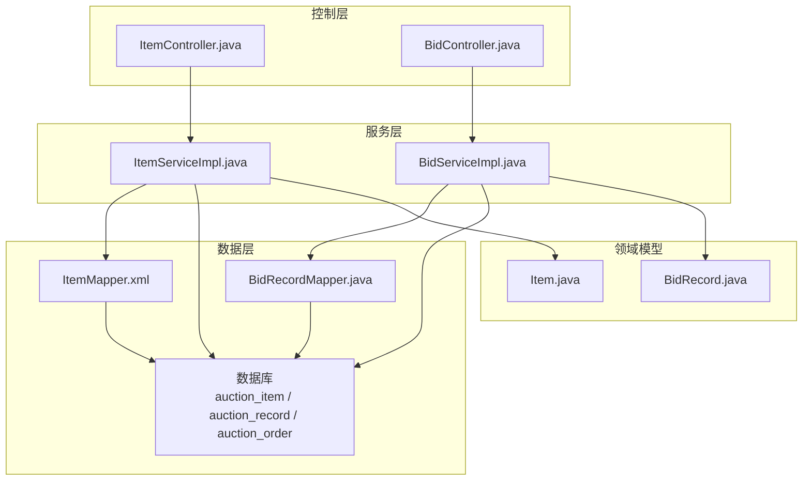
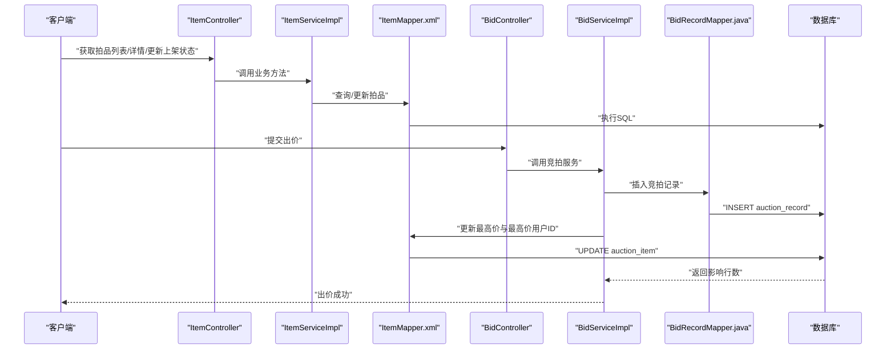
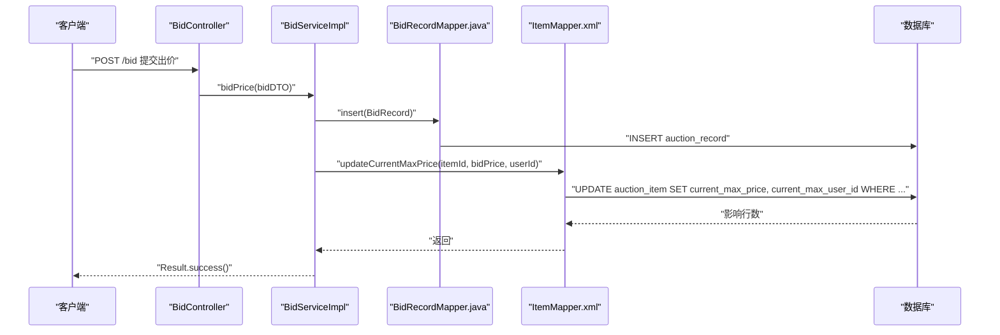
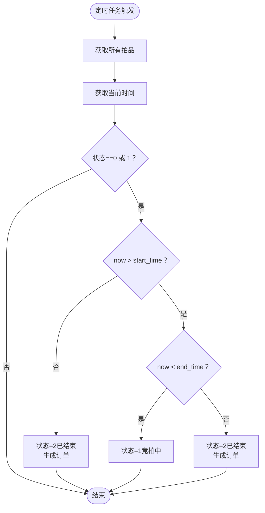
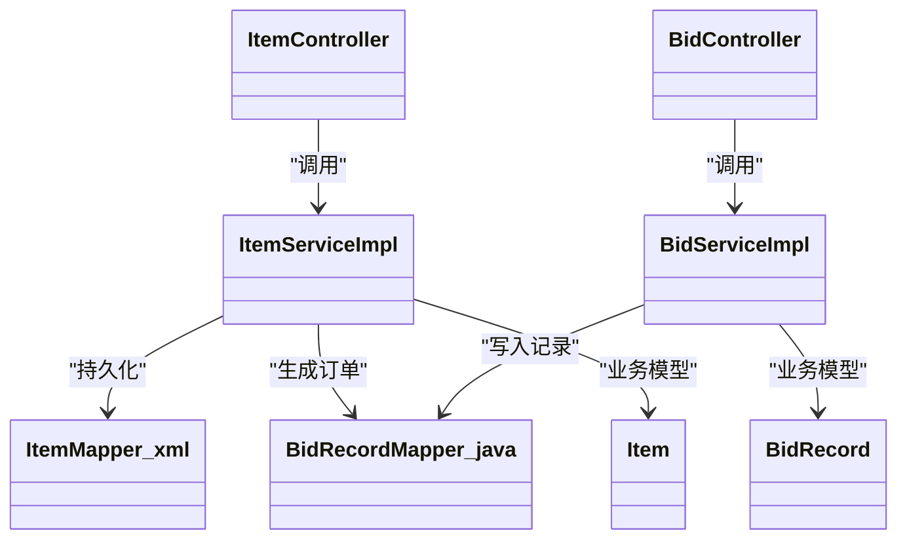

# 拍品表（auction_item）

<cite>
**本文引用的文件**
- [auction_database.sql](file://auction_database.sql)
- [Item.java](file://src/main/java/com/qkl/auctionsystem/pojo/entity/Item.java)
- [ItemMapper.xml](file://src/main/resources/mapper/ItemMapper.xml)
- [ItemController.java](file://src/main/java/com/qkl/auctionsystem/controller/ItemController.java)
- [ItemServiceImpl.java](file://src/main/java/com/qkl/auctionsystem/service/impl/ItemServiceImpl.java)
- [BidController.java](file://src/main/java/com/qkl/auctionsystem/controller/BidController.java)
- [BidServiceImpl.java](file://src/main/java/com/qkl/auctionsystem/service/impl/BidServiceImpl.java)
- [BidRecordMapper.java](file://src/main/java/com/qkl/auctionsystem/mapper/BidRecordMapper.java)
- [BidRecord.java](file://src/main/java/com/qkl/auctionsystem/pojo/entity/BidRecord.java)
</cite>

## 目录
1. [简介](#简介)
2. [项目结构](#项目结构)
3. [核心组件](#核心组件)
4. [架构总览](#架构总览)
5. [详细组件分析](#详细组件分析)
6. [依赖分析](#依赖分析)
7. [性能考虑](#性能考虑)
8. [故障排查指南](#故障排查指南)
9. [结论](#结论)
10. [附录](#附录)

## 简介
本文件系统性解析拍卖系统中的拍品表（auction_item），围绕建表语句与Java实体类的字段映射、业务字段含义与使用场景、竞拍过程中的动态更新机制（current_max_price、current_max_user_id）、状态流转（status）与定时任务交互、上下架控制（listing_status）对前端展示的影响，以及复合索引设计意图进行深入说明。同时提供建表语句与实体类的完整对照，并结合控制器与服务层说明该表在拍品管理功能中的核心地位。

## 项目结构
拍品相关的核心文件分布如下：
- 数据库脚本：包含拍品表、竞拍记录表、订单表等DDL定义
- 实体类：Item.java、BidRecord.java
- 映射层：ItemMapper.xml
- 控制器与服务：ItemController.java、ItemServiceImpl.java
- 竞拍流程：BidController.java、BidServiceImpl.java、BidRecordMapper.java

图表来源
- [ItemMapper.xml](file://src/main/resources/mapper/ItemMapper.xml#L1-L109)
- [ItemController.java](file://src/main/java/com/qkl/auctionsystem/controller/ItemController.java#L1-L86)
- [ItemServiceImpl.java](file://src/main/java/com/qkl/auctionsystem/service/impl/ItemServiceImpl.java#L1-L182)
- [BidController.java](file://src/main/java/com/qkl/auctionsystem/controller/BidController.java#L1-L47)
- [BidServiceImpl.java](file://src/main/java/com/qkl/auctionsystem/service/impl/BidServiceImpl.java#L1-L75)
- [BidRecordMapper.java](file://src/main/java/com/qkl/auctionsystem/mapper/BidRecordMapper.java#L1-L19)
- [Item.java](file://src/main/java/com/qkl/auctionsystem/pojo/entity/Item.java#L1-L34)
- [BidRecord.java](file://src/main/java/com/qkl/auctionsystem/pojo/entity/BidRecord.java#L1-L19)

章节来源
- [auction_database.sql](file://auction_database.sql#L25-L45)
- [Item.java](file://src/main/java/com/qkl/auctionsystem/pojo/entity/Item.java#L1-L34)
- [ItemMapper.xml](file://src/main/resources/mapper/ItemMapper.xml#L1-L109)
- [ItemController.java](file://src/main/java/com/qkl/auctionsystem/controller/ItemController.java#L1-L86)
- [ItemServiceImpl.java](file://src/main/java/com/qkl/auctionsystem/service/impl/ItemServiceImpl.java#L1-L182)
- [BidController.java](file://src/main/java/com/qkl/auctionsystem/controller/BidController.java#L1-L47)
- [BidServiceImpl.java](file://src/main/java/com/qkl/auctionsystem/service/impl/BidServiceImpl.java#L1-L75)
- [BidRecordMapper.java](file://src/main/java/com/qkl/auctionsystem/mapper/BidRecordMapper.java#L1-L19)
- [BidRecord.java](file://src/main/java/com/qkl/auctionsystem/pojo/entity/BidRecord.java#L1-L19)

## 核心组件
- 拍品表（auction_item）：承载拍品基本信息、价格、时间窗口、状态与上下架控制
- Item实体类：Java侧字段与数据库字段的映射载体
- ItemMapper：拍品的增删改查、状态更新、最高价更新等SQL映射
- ItemService：拍品管理业务逻辑，含定时任务驱动的状态更新
- BidService：竞拍流程的核心，负责写入竞拍记录并更新最高价
- BidRecordMapper：竞拍记录的持久化接口
- BidRecord实体：竞拍记录的数据模型

章节来源
- [auction_database.sql](file://auction_database.sql#L25-L45)
- [Item.java](file://src/main/java/com/qkl/auctionsystem/pojo/entity/Item.java#L1-L34)
- [ItemMapper.xml](file://src/main/resources/mapper/ItemMapper.xml#L1-L109)
- [ItemServiceImpl.java](file://src/main/java/com/qkl/auctionsystem/service/impl/ItemServiceImpl.java#L1-L182)
- [BidServiceImpl.java](file://src/main/java/com/qkl/auctionsystem/service/impl/BidServiceImpl.java#L1-L75)
- [BidRecordMapper.java](file://src/main/java/com/qkl/auctionsystem/mapper/BidRecordMapper.java#L1-L19)

## 架构总览
拍品管理贯穿“控制层-服务层-映射层-数据层”的分层架构。前端通过ItemController发起拍品管理请求；ItemServiceImpl负责业务编排，包括定时任务驱动的状态更新；ItemMapper负责拍品表的读写；BidServiceImpl在用户出价时写入竞拍记录并调用ItemMapper更新最高价；BidRecordMapper负责竞拍记录的持久化。

图表来源
- [ItemController.java](file://src/main/java/com/qkl/auctionsystem/controller/ItemController.java#L1-L86)
- [ItemServiceImpl.java](file://src/main/java/com/qkl/auctionsystem/service/impl/ItemServiceImpl.java#L1-L182)
- [ItemMapper.xml](file://src/main/resources/mapper/ItemMapper.xml#L1-L109)
- [BidController.java](file://src/main/java/com/qkl/auctionsystem/controller/BidController.java#L1-L47)
- [BidServiceImpl.java](file://src/main/java/com/qkl/auctionsystem/service/impl/BidServiceImpl.java#L1-L75)
- [BidRecordMapper.java](file://src/main/java/com/qkl/auctionsystem/mapper/BidRecordMapper.java#L1-L19)

## 详细组件分析

### 字段对照与业务含义
- 基础信息
  - title：拍品名称，用于前端展示与搜索匹配
  - image：拍品图片URL（单张），用于详情页展示
  - description：拍品描述，辅助信息
- 价格体系
  - initial_price：起拍价（数据库DECIMAL(10,2)，单位：元）
  - current_max_price：当前最高价（数据库DECIMAL(10,2)，默认0.00）
  - current_max_user_id：当前最高出价用户ID（可为空）
- 时间窗口
  - start_time：起拍时间
  - end_time：结束时间
- 状态控制
  - status：拍品状态（0-未开始，1-竞拍中，2-已结束）
  - listing_status：上架状态（0-下架，1-上架）
- 时间戳
  - create_time、update_time：自动维护

字段映射与类型一致性
- 数据库字段与Java实体字段映射关系如下：
  - id -> id
  - title -> title
  - image -> image
  - initial_price -> initialPrice（Long）
  - description -> description
  - start_time -> startTime（LocalDateTime）
  - end_time -> endTime（LocalDateTime）
  - current_max_price -> currentMaxPrice（Long）
  - current_max_user_id -> currentMaxUserId（Long）
  - status -> status（Integer）
  - listing_status -> listingStatus（Integer）
  - create_time -> createTime（LocalDateTime）
  - update_time -> updateTime（LocalDateTime）

精度一致性说明
- 数据库采用DECIMAL(10,2)，表示最多10位数字，其中小数点后2位
- Java实体类中对应字段使用Long类型存储“分”级别的数值，避免浮点误差
- 竞拍服务在写入竞拍记录时使用BigDecimal，保证计算精度
- 在业务层进行“元”到“分”的转换，确保数据库与实体类的精度一致

章节来源
- [auction_database.sql](file://auction_database.sql#L25-L45)
- [Item.java](file://src/main/java/com/qkl/auctionsystem/pojo/entity/Item.java#L1-L34)
- [ItemMapper.xml](file://src/main/resources/mapper/ItemMapper.xml#L1-L109)
- [BidRecord.java](file://src/main/java/com/qkl/auctionsystem/pojo/entity/BidRecord.java#L1-L19)
- [BidServiceImpl.java](file://src/main/java/com/qkl/auctionsystem/service/impl/BidServiceImpl.java#L1-L75)

### 竞拍过程中的动态更新机制
- 出价流程
  - 用户提交出价请求，BidController接收参数
  - BidServiceImpl根据TokenFilter获取当前用户ID
  - 写入竞拍记录表（auction_record），包含item_id、user_id、bid_price、bid_time
  - 调用ItemMapper.updateCurrentMaxPrice，原子性比较并更新current_max_price与current_max_user_id
- 原子性保障
  - SQL中使用条件判断current_max_price是否为空或小于新值，避免并发覆盖
- 结果反馈
  - 成功后返回出价成功，前端可刷新最高价与出价历史

图表来源
- [BidController.java](file://src/main/java/com/qkl/auctionsystem/controller/BidController.java#L1-L47)
- [BidServiceImpl.java](file://src/main/java/com/qkl/auctionsystem/service/impl/BidServiceImpl.java#L1-L75)
- [BidRecordMapper.java](file://src/main/java/com/qkl/auctionsystem/mapper/BidRecordMapper.java#L1-L19)
- [ItemMapper.xml](file://src/main/resources/mapper/ItemMapper.xml#L95-L109)

章节来源
- [BidController.java](file://src/main/java/com/qkl/auctionsystem/controller/BidController.java#L1-L47)
- [BidServiceImpl.java](file://src/main/java/com/qkl/auctionsystem/service/impl/BidServiceImpl.java#L1-L75)
- [ItemMapper.xml](file://src/main/resources/mapper/ItemMapper.xml#L95-L109)

### 状态流转逻辑与定时任务交互
- 状态定义
  - 0：未开始
  - 1：竞拍中
  - 2：已结束
- 流转规则
  - 当前时间在[start_time, end_time)区间内：状态=1（竞拍中）
  - 当前时间>=end_time：状态=2（已结束）
  - 否则：状态=0（未开始）
- 定时任务
  - 每分钟扫描所有拍品，按上述规则更新状态
  - 当状态变为2（已结束）时，尝试为最高出价用户生成待付款订单（订单表字段deal_price=拍品最终最高价）

图表来源
- [ItemServiceImpl.java](file://src/main/java/com/qkl/auctionsystem/service/impl/ItemServiceImpl.java#L107-L182)
- [ItemMapper.xml](file://src/main/resources/mapper/ItemMapper.xml#L95-L109)

章节来源
- [ItemServiceImpl.java](file://src/main/java/com/qkl/auctionsystem/service/impl/ItemServiceImpl.java#L107-L182)

### 上下架控制（listing_status）与前端展示
- listing_status字段
  - 0：下架（不对外展示）
  - 1：上架（对外展示）
- 前端列表查询
  - ItemMapper在查询拍品列表时强制过滤listing_status=1，确保仅展示上架拍品
- 管理端操作
  - 管理员可通过ItemController更新listing_status，实现拍品的上下架控制

章节来源
- [ItemMapper.xml](file://src/main/resources/mapper/ItemMapper.xml#L41-L50)
- [ItemController.java](file://src/main/java/com/qkl/auctionsystem/controller/ItemController.java#L79-L86)

### 复合索引设计意图
- idx_status(status)：支持按状态筛选（如查询“竞拍中”拍品）
- idx_listing_status(listing_status)：支持按上架状态筛选（如查询“已上架”拍品）
- idx_start_time(start_time)：支持按起拍时间范围查询（如“即将开始”）
- idx_end_time(end_time)：支持按结束时间范围查询（如“即将结束”）
- 组合查询优化：在按标题、状态、价格区间查询时，配合WHERE条件与LIKE，提升检索效率

章节来源
- [auction_database.sql](file://auction_database.sql#L41-L45)
- [ItemMapper.xml](file://src/main/resources/mapper/ItemMapper.xml#L41-L50)

### 建表语句与实体类对照
- 数据库字段与Java实体字段一一对应，注意以下差异：
  - 数据库：DECIMAL(10,2) 存储“元”
  - Java：Long 存储“分”，避免浮点误差
  - 时间字段：数据库DATETIME vs Java LocalDateTime
- 竞拍记录表（auction_record）与订单表（auction_order）与拍品表形成完整的拍卖闭环

章节来源
- [auction_database.sql](file://auction_database.sql#L25-L72)
- [Item.java](file://src/main/java/com/qkl/auctionsystem/pojo/entity/Item.java#L1-L34)
- [BidRecord.java](file://src/main/java/com/qkl/auctionsystem/pojo/entity/BidRecord.java#L1-L19)

### 在拍品管理功能中的核心地位
- ItemController：提供拍品新增、列表查询、详情查询、批量删除、修改、更新上架状态等接口
- ItemServiceImpl：负责业务编排、状态定时更新、最高价更新、订单生成
- ItemMapper：提供拍品的增删改查、状态更新、最高价更新、上架状态更新等SQL映射
- 与竞拍流程联动：BidServiceImpl在用户出价时写入竞拍记录并更新最高价，体现拍品表在竞拍中的核心地位

章节来源
- [ItemController.java](file://src/main/java/com/qkl/auctionsystem/controller/ItemController.java#L1-L86)
- [ItemServiceImpl.java](file://src/main/java/com/qkl/auctionsystem/service/impl/ItemServiceImpl.java#L1-L182)
- [ItemMapper.xml](file://src/main/resources/mapper/ItemMapper.xml#L1-L109)
- [BidServiceImpl.java](file://src/main/java/com/qkl/auctionsystem/service/impl/BidServiceImpl.java#L1-L75)

## 依赖分析
- 控制层依赖服务层，服务层依赖映射层，映射层依赖数据库
- ItemServiceImpl依赖ItemMapper与OrderMapper（生成订单）
- BidServiceImpl依赖ItemService与BidRecordMapper
- Item与BidRecord实体分别映射拍品表与竞拍记录表

图表来源
- [ItemController.java](file://src/main/java/com/qkl/auctionsystem/controller/ItemController.java#L1-L86)
- [ItemServiceImpl.java](file://src/main/java/com/qkl/auctionsystem/service/impl/ItemServiceImpl.java#L1-L182)
- [ItemMapper.xml](file://src/main/resources/mapper/ItemMapper.xml#L1-L109)
- [BidController.java](file://src/main/java/com/qkl/auctionsystem/controller/BidController.java#L1-L47)
- [BidServiceImpl.java](file://src/main/java/com/qkl/auctionsystem/service/impl/BidServiceImpl.java#L1-L75)
- [BidRecordMapper.java](file://src/main/java/com/qkl/auctionsystem/mapper/BidRecordMapper.java#L1-L19)
- [Item.java](file://src/main/java/com/qkl/auctionsystem/pojo/entity/Item.java#L1-L34)
- [BidRecord.java](file://src/main/java/com/qkl/auctionsystem/pojo/entity/BidRecord.java#L1-L19)

章节来源
- [ItemController.java](file://src/main/java/com/qkl/auctionsystem/controller/ItemController.java#L1-L86)
- [ItemServiceImpl.java](file://src/main/java/com/qkl/auctionsystem/service/impl/ItemServiceImpl.java#L1-L182)
- [ItemMapper.xml](file://src/main/resources/mapper/ItemMapper.xml#L1-L109)
- [BidController.java](file://src/main/java/com/qkl/auctionsystem/controller/BidController.java#L1-L47)
- [BidServiceImpl.java](file://src/main/java/com/qkl/auctionsystem/service/impl/BidServiceImpl.java#L1-L75)
- [BidRecordMapper.java](file://src/main/java/com/qkl/auctionsystem/mapper/BidRecordMapper.java#L1-L19)
- [Item.java](file://src/main/java/com/qkl/auctionsystem/pojo/entity/Item.java#L1-L34)
- [BidRecord.java](file://src/main/java/com/qkl/auctionsystem/pojo/entity/BidRecord.java#L1-L19)

## 性能考虑
- 索引策略
  - idx_status、idx_listing_status、idx_start_time、idx_end_time用于常见查询场景
  - 建议在高并发环境下对热点字段建立合适的索引组合，避免全表扫描
- 并发更新
  - 最高价更新使用条件比较，避免ABA问题；建议在数据库层面启用事务隔离级别，确保一致性
- 分页查询
  - 列表查询使用分页插件，合理设置页码与页大小，降低单次查询负载
- 定时任务
  - 每分钟扫描一次拍品，建议在高峰期评估扫描频率，避免对数据库造成压力

[本节为通用性能建议，无需特定文件来源]

## 故障排查指南
- 出价失败
  - 检查竞拍记录是否成功写入，确认bid_price与bid_time是否正确
  - 检查ItemMapper.updateCurrentMaxPrice是否命中更新（影响行数应>0）
- 状态未更新
  - 检查定时任务是否启动（@Scheduled注解生效）
  - 检查当前时间与start_time、end_time的关系
- 上架状态异常
  - 确认ItemMapper查询列表时强制过滤listing_status=1
  - 管理员更新listing_status后，前端是否及时刷新

章节来源
- [ItemMapper.xml](file://src/main/resources/mapper/ItemMapper.xml#L41-L50)
- [ItemServiceImpl.java](file://src/main/java/com/qkl/auctionsystem/service/impl/ItemServiceImpl.java#L107-L182)
- [BidServiceImpl.java](file://src/main/java/com/qkl/auctionsystem/service/impl/BidServiceImpl.java#L1-L75)

## 结论
拍品表（auction_item）是拍卖系统的核心数据表，承载了拍品的基本信息、价格、时间窗口、状态与上下架控制。通过数据库DECIMAL(10,2)与Java实体类Long“分”级存储的配合，确保了价格精度与一致性。竞拍流程通过竞拍记录表与拍品表的协同，实现了最高价的原子性更新。定时任务驱动的状态机使拍品生命周期管理自动化，而复合索引与分页查询提升了整体性能。ItemController与ItemServiceImpl共同构成了拍品管理功能的中枢，串联起前后端与数据层。

[本节为总结性内容，无需特定文件来源]

## 附录
- 建表语句关键字段摘要
  - 主键：id
  - 业务字段：title、image、initial_price、description、start_time、end_time、current_max_price、current_max_user_id、status、listing_status
  - 索引：idx_status、idx_listing_status、idx_start_time、idx_end_time
- 实体类字段摘要
  - id、title、image、initialPrice、description、startTime、endTime、currentMaxPrice、currentMaxUserId、status、listingStatus、createTime、updateTime

章节来源
- [auction_database.sql](file://auction_database.sql#L25-L45)
- [Item.java](file://src/main/java/com/qkl/auctionsystem/pojo/entity/Item.java#L1-L34)