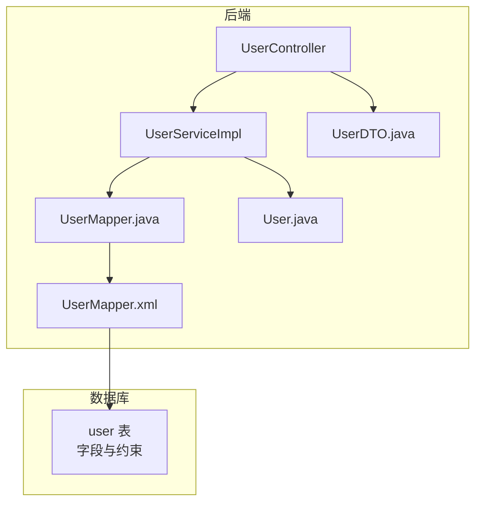
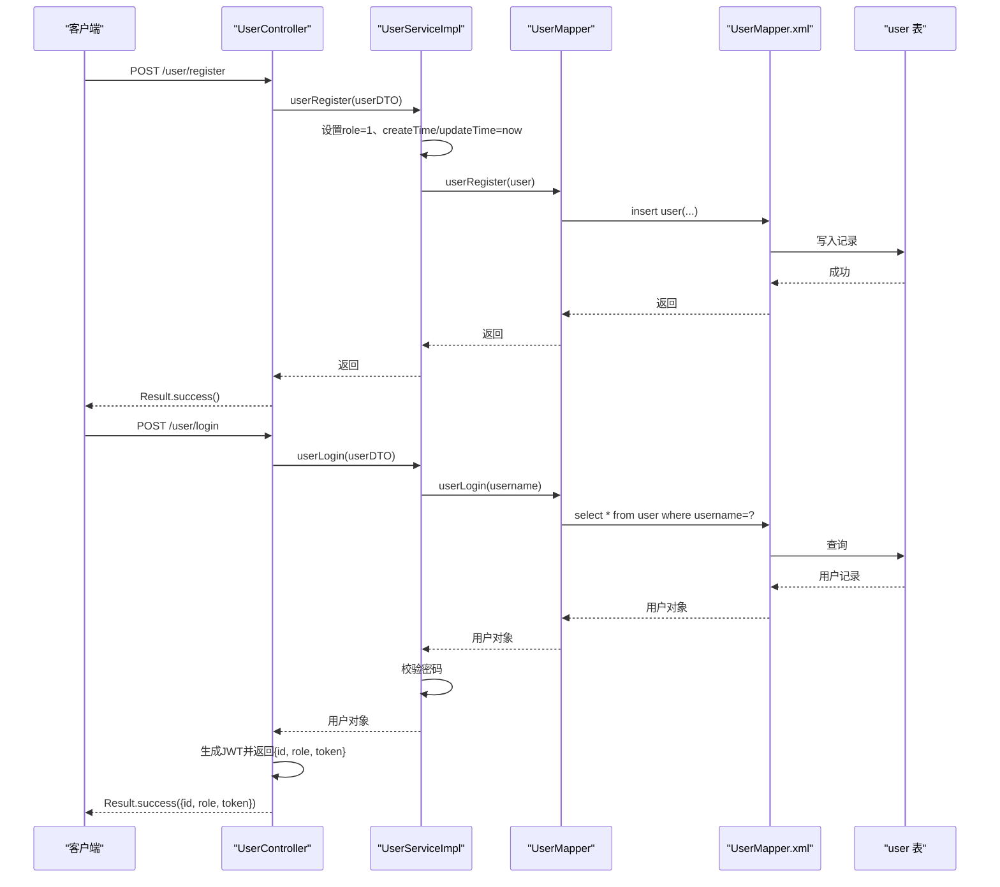
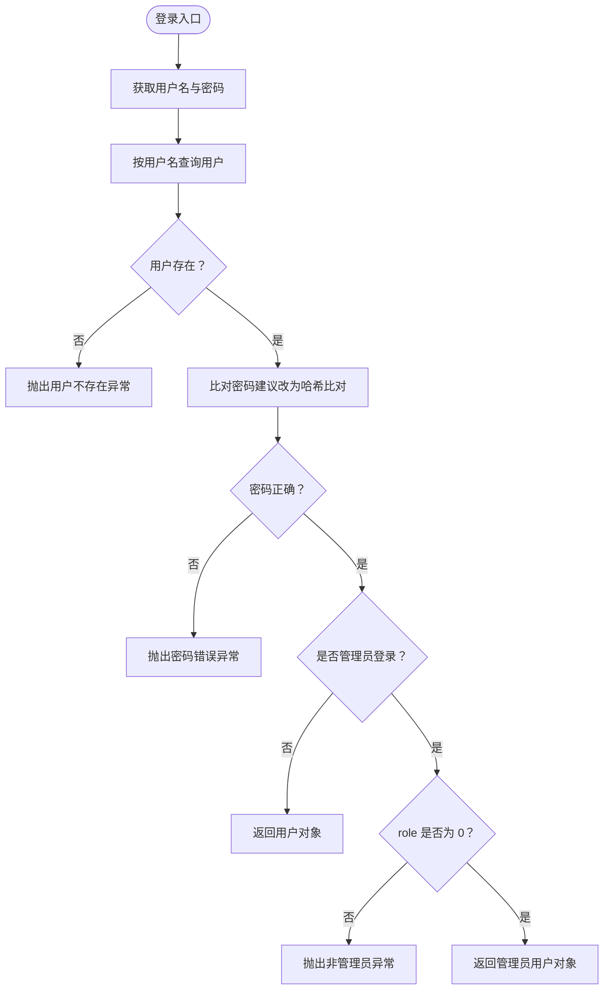
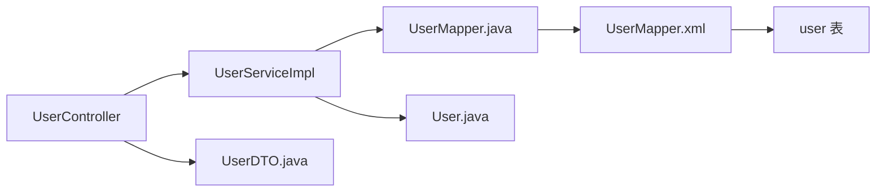

# 用户表（user）

<cite>
**本文引用的文件**
- [auction_database.sql](file://auction_database.sql)
- [User.java](file://src/main/java/com/qkl/auctionsystem/pojo/entity/User.java)
- [UserDTO.java](file://src/main/java/com/qkl/auctionsystem/pojo/dto/UserDTO.java)
- [UserMapper.java](file://src/main/java/com/qkl/auctionsystem/mapper/UserMapper.java)
- [UserMapper.xml](file://src/main/resources/mapper/UserMapper.xml)
- [UserService.java](file://src/main/java/com/qkl/auctionsystem/service/UserService.java)
- [UserServiceImpl.java](file://src/main/java/com/qkl/auctionsystem/service/impl/UserServiceImpl.java)
- [UserController.java](file://src/main/java/com/qkl/auctionsystem/controller/UserController.java)
</cite>

## 目录
1. [简介](#简介)
2. [项目结构](#项目结构)
3. [核心组件](#核心组件)
4. [架构总览](#架构总览)
5. [详细组件分析](#详细组件分析)
6. [依赖分析](#依赖分析)
7. [性能考虑](#性能考虑)
8. [故障排查指南](#故障排查指南)
9. [结论](#结论)
10. [附录](#附录)

## 简介
本文件围绕用户表（user）提供系统化、可操作的技术文档，覆盖以下要点：
- 字段定义与约束：主键/唯一键、非空、默认值、索引及业务语义
- 关键字段详解：username 唯一性、password 加密存储、role 角色权限（0-管理员，1-普通用户）、create_time 与 update_time 的时间戳行为
- ORM 映射一致性：Long 与 BIGINT、String 与 VARCHAR 的映射核对
- 核心流程映射：用户注册、登录、权限校验在数据库与代码层的对应关系
- 对照示例：建表语句与实体类/DTO/Mapper 的字段映射路径

## 项目结构
用户表位于数据库脚本中，对应的 Java 实体与 MyBatis 映射如下：
- 数据库：user 表定义与约束
- 实体类：User（字段类型与时间类型）
- DTO：UserDTO（传输层字段）
- Mapper 接口与 XML：注册与登录查询
- Service 层：注册时设置默认角色与时间戳；登录时进行用户名存在性与密码比对；管理员登录时校验角色
- Controller 层：对外提供注册与登录接口，登录后签发 JWT 并返回用户角色

图表来源
- [auction_database.sql](file://auction_database.sql#L13-L23)
- [UserMapper.xml](file://src/main/resources/mapper/UserMapper.xml#L1-L11)
- [UserMapper.java](file://src/main/java/com/qkl/auctionsystem/mapper/UserMapper.java#L1-L13)
- [User.java](file://src/main/java/com/qkl/auctionsystem/pojo/entity/User.java#L1-L26)
- [UserDTO.java](file://src/main/java/com/qkl/auctionsystem/pojo/dto/UserDTO.java#L1-L12)
- [UserController.java](file://src/main/java/com/qkl/auctionsystem/controller/UserController.java#L1-L49)
- [UserServiceImpl.java](file://src/main/java/com/qkl/auctionsystem/service/impl/UserServiceImpl.java#L1-L59)

章节来源
- [auction_database.sql](file://auction_database.sql#L13-L23)
- [User.java](file://src/main/java/com/qkl/auctionsystem/pojo/entity/User.java#L1-L26)
- [UserDTO.java](file://src/main/java/com/qkl/auctionsystem/pojo/dto/UserDTO.java#L1-L12)
- [UserMapper.java](file://src/main/java/com/qkl/auctionsystem/mapper/UserMapper.java#L1-L13)
- [UserMapper.xml](file://src/main/resources/mapper/UserMapper.xml#L1-L11)
- [UserController.java](file://src/main/java/com/qkl/auctionsystem/controller/UserController.java#L1-L49)
- [UserServiceImpl.java](file://src/main/java/com/qkl/auctionsystem/service/impl/UserServiceImpl.java#L1-L59)

## 核心组件
- 数据库表 user
  - 主键：id（BIGINT 自增）
  - 唯一键：username（唯一）
  - 非空字段：username、password、role、create_time、update_time
  - 默认值：role 默认 1（普通用户），create_time、update_time 默认当前时间
  - 时间戳：update_time 支持自动更新
  - 字符集：utf8mb4
- 实体类 User
  - 字段：id（Integer）、username（String）、password（String）、role（Integer）、createTime/updateTime（LocalDateTime）
- DTO UserDTO
  - 字段：id（Integer）、username（String）、password（String）、role（Integer）
- Mapper
  - 注册插入：username、password、role、create_time、update_time
  - 登录查询：按 username 查询
- Service
  - 注册：设置默认 role=1，设置 createTime/updateTime 为当前时间
  - 登录：按用户名查询并比对密码；管理员登录额外校验 role=0
- Controller
  - 提供注册与登录接口，登录成功签发 JWT 并返回用户角色

章节来源
- [auction_database.sql](file://auction_database.sql#L13-L23)
- [User.java](file://src/main/java/com/qkl/auctionsystem/pojo/entity/User.java#L1-L26)
- [UserDTO.java](file://src/main/java/com/qkl/auctionsystem/pojo/dto/UserDTO.java#L1-L12)
- [UserMapper.java](file://src/main/java/com/qkl/auctionsystem/mapper/UserMapper.java#L1-L13)
- [UserMapper.xml](file://src/main/resources/mapper/UserMapper.xml#L1-L11)
- [UserServiceImpl.java](file://src/main/java/com/qkl/auctionsystem/service/impl/UserServiceImpl.java#L1-L59)
- [UserController.java](file://src/main/java/com/qkl/auctionsystem/controller/UserController.java#L1-L49)

## 架构总览
用户表贯穿“控制器-服务-映射-数据库”的调用链路，关键流程如下：
- 注册：Controller 接收 DTO -> Service 设置默认角色与时间 -> Mapper 执行插入 -> 数据库写入
- 登录：Controller 接收 DTO -> Service 查询用户 -> 比对密码 -> 返回用户并签发 JWT

图表来源
- [UserMapper.xml](file://src/main/resources/mapper/UserMapper.xml#L1-L11)
- [UserMapper.java](file://src/main/java/com/qkl/auctionsystem/mapper/UserMapper.java#L1-L13)
- [UserServiceImpl.java](file://src/main/java/com/qkl/auctionsystem/service/impl/UserServiceImpl.java#L1-L59)
- [UserController.java](file://src/main/java/com/qkl/auctionsystem/controller/UserController.java#L1-L49)
- [auction_database.sql](file://auction_database.sql#L13-L23)

## 详细组件分析

### 字段定义与约束（数据库层面）
- id
  - 类型：BIGINT
  - 约束：主键、自增
  - 业务语义：用户唯一标识
- username
  - 类型：VARCHAR(50)
  - 约束：NOT NULL、UNIQUE（uk_username）
  - 业务语义：登录名与用户标识，唯一性由数据库约束保证
- password
  - 类型：VARCHAR(128)
  - 约束：NOT NULL
  - 业务语义：存储加密后的密码（示例脚本中使用了 bcrypt 样式哈希）
- role
  - 类型：TINYINT
  - 约束：NOT NULL，默认 1
  - 业务语义：0-管理员，1-普通用户
- create_time
  - 类型：DATETIME
  - 约束：NOT NULL，默认 CURRENT_TIMESTAMP
  - 业务语义：记录创建时间
- update_time
  - 类型：DATETIME
  - 约束：NOT NULL，默认 CURRENT_TIMESTAMP，ON UPDATE CURRENT_TIMESTAMP
  - 业务语义：记录最后更新时间，自动维护

章节来源
- [auction_database.sql](file://auction_database.sql#L13-L23)

### 实体类与 DTO 字段映射（ORM 一致性）
- User.java（实体类）
  - id：Integer
  - username：String
  - password：String
  - role：Integer
  - createTime：LocalDateTime
  - updateTime：LocalDateTime
- UserDTO.java（传输层）
  - id：Integer
  - username：String
  - password：String
  - role：Integer
- 映射关系核对
  - 数据库 BIGINT 与 Java Integer：不一致
  - 数据库 VARCHAR(n) 与 Java String：一致
  - 数据库 TINYINT 与 Java Integer：一致
  - 数据库 DATETIME 与 Java LocalDateTime：一致
- 建议
  - 将实体类 id 改为 Long，与数据库 BIGINT 对齐，避免溢出与类型不匹配风险

章节来源
- [User.java](file://src/main/java/com/qkl/auctionsystem/pojo/entity/User.java#L1-L26)
- [UserDTO.java](file://src/main/java/com/qkl/auctionsystem/pojo/dto/UserDTO.java#L1-L12)
- [auction_database.sql](file://auction_database.sql#L13-L23)

### Mapper 映射与 SQL
- 注册插入
  - XML 中插入字段：username、password、role、create_time、update_time
  - 与 Service 注入逻辑一致：role=1，create_time/update_time=now
- 登录查询
  - XML 中按 username 查询
  - Service 中根据用户名获取用户并比对密码

章节来源
- [UserMapper.xml](file://src/main/resources/mapper/UserMapper.xml#L1-L11)
- [UserMapper.java](file://src/main/java/com/qkl/auctionsystem/mapper/UserMapper.java#L1-L13)
- [UserServiceImpl.java](file://src/main/java/com/qkl/auctionsystem/service/impl/UserServiceImpl.java#L1-L59)

### 关键字段业务语义与安全要求

#### username 唯一性约束
- 数据库层面：uk_username 唯一键，防止重复用户名
- 业务层面：作为登录凭据与用户标识，必须唯一
- 建议：注册前先校验用户名是否存在，避免插入失败

章节来源
- [auction_database.sql](file://auction_database.sql#L13-L23)

#### password 加密存储要求
- 数据库层面：password 字段长度 128，满足常见哈希算法输出长度
- 业务层面：示例脚本中使用了 bcrypt 样式哈希，建议生产环境统一采用强哈希（如 bcrypt、scrypt 或 Argon2）
- 当前 Service 登录逻辑直接比对明文密码，存在安全风险，应改为“哈希比对”
  - 修改点：登录时对输入密码进行哈希，再与数据库存储的哈希比较
  - 建议：引入密码编码器（如 Spring Security 的 DelegatingPasswordEncoder）

章节来源
- [auction_database.sql](file://auction_database.sql#L74-L78)
- [UserServiceImpl.java](file://src/main/java/com/qkl/auctionsystem/service/impl/UserServiceImpl.java#L1-L59)

#### role 角色权限控制
- 数据库默认值：1（普通用户）
- 登录校验：普通用户登录与管理员登录分别走不同分支
- 管理员登录额外校验：role 必须为 0
- 建议：在权限校验中间件或拦截器中统一读取 token 中的 role，进行细粒度授权

章节来源
- [auction_database.sql](file://auction_database.sql#L13-L23)
- [UserServiceImpl.java](file://src/main/java/com/qkl/auctionsystem/service/impl/UserServiceImpl.java#L1-L59)
- [UserController.java](file://src/main/java/com/qkl/auctionsystem/controller/UserController.java#L1-L49)

#### create_time 与 update_time 时间戳行为
- create_time：注册时由 Service 设置为当前时间
- update_time：数据库默认 CURRENT_TIMESTAMP，且支持 ON UPDATE CURRENT_TIMESTAMP
- 建议：注册时显式设置 update_time 也为当前时间，保持一致性

章节来源
- [UserMapper.xml](file://src/main/resources/mapper/UserMapper.xml#L1-L11)
- [UserServiceImpl.java](file://src/main/java/com/qkl/auctionsystem/service/impl/UserServiceImpl.java#L1-L59)
- [auction_database.sql](file://auction_database.sql#L13-L23)

### 核心流程映射与对照示例

#### 建表语句与实体类/DTO/Mapper 对照
- 建表语句（user 表）
  - 字段：id（BIGINT）、username（VARCHAR(50)）、password（VARCHAR(128)）、role（TINYINT）、create_time（DATETIME）、update_time（DATETIME）
  - 约束：主键、uk_username、默认值、自动更新
- 实体类 User.java
  - 字段：id（Integer）、username（String）、password（String）、role（Integer）、createTime/updateTime（LocalDateTime）
- DTO UserDTO.java
  - 字段：id（Integer）、username（String）、password（String）、role（Integer）
- Mapper
  - 注册插入：username、password、role、create_time、update_time
  - 登录查询：username

章节来源
- [auction_database.sql](file://auction_database.sql#L13-L23)
- [User.java](file://src/main/java/com/qkl/auctionsystem/pojo/entity/User.java#L1-L26)
- [UserDTO.java](file://src/main/java/com/qkl/auctionsystem/pojo/dto/UserDTO.java#L1-L12)
- [UserMapper.xml](file://src/main/resources/mapper/UserMapper.xml#L1-L11)

#### 用户注册流程
- 流程要点
  - Controller 接收注册请求
  - Service 复制 DTO 到实体，设置默认 role=1，设置 createTime/updateTime=now
  - Mapper 执行插入，写入数据库
- 关键路径
  - [UserController.userRegister](file://src/main/java/com/qkl/auctionsystem/controller/UserController.java#L23-L28)
  - [UserServiceImpl.userRegister](file://src/main/java/com/qkl/auctionsystem/service/impl/UserServiceImpl.java#L19-L26)
  - [UserMapper.userRegister](file://src/main/java/com/qkl/auctionsystem/mapper/UserMapper.java#L9-L11)
  - [UserMapper.xml.insert user(...)](file://src/main/resources/mapper/UserMapper.xml#L5-L7)
  - [auction_database.sql.create table user](file://auction_database.sql#L13-L23)

#### 用户登录流程
- 流程要点
  - Controller 接收登录请求
  - Service 按 username 查询用户，若不存在抛错
  - 比对密码（当前实现为明文比对，建议改为哈希比对）
  - 返回用户并签发 JWT，包含 id 与 role
- 关键路径
  - [UserController.userLogin](file://src/main/java/com/qkl/auctionsystem/controller/UserController.java#L30-L49)
  - [UserServiceImpl.userLogin](file://src/main/java/com/qkl/auctionsystem/service/impl/UserServiceImpl.java#L29-L40)
  - [UserMapper.userLogin](file://src/main/java/com/qkl/auctionsystem/mapper/UserMapper.java#L11-L11)
  - [UserMapper.xml.select user where username](file://src/main/resources/mapper/UserMapper.xml#L8-L10)
  - [auction_database.sql.create table user](file://auction_database.sql#L13-L23)

#### 管理员登录流程
- 流程要点
  - 在普通登录基础上，额外校验 role==0
- 关键路径
  - [UserServiceImpl.adminLogin](file://src/main/java/com/qkl/auctionsystem/service/impl/UserServiceImpl.java#L42-L58)

图表来源
- [UserServiceImpl.java](file://src/main/java/com/qkl/auctionsystem/service/impl/UserServiceImpl.java#L29-L58)
- [UserMapper.xml](file://src/main/resources/mapper/UserMapper.xml#L8-L10)

## 依赖分析
- 组件耦合
  - Controller 依赖 Service
  - Service 依赖 Mapper 接口
  - Mapper 通过 XML 映射到数据库 user 表
- 关键依赖链
  - UserController -> UserServiceImpl -> UserMapper -> UserMapper.xml -> user 表
- 可能的循环依赖
  - 无循环依赖，职责清晰（Controller/Service/Mapper/Entity/DTO）

图表来源
- [UserController.java](file://src/main/java/com/qkl/auctionsystem/controller/UserController.java#L1-L49)
- [UserServiceImpl.java](file://src/main/java/com/qkl/auctionsystem/service/impl/UserServiceImpl.java#L1-L59)
- [UserMapper.java](file://src/main/java/com/qkl/auctionsystem/mapper/UserMapper.java#L1-L13)
- [UserMapper.xml](file://src/main/resources/mapper/UserMapper.xml#L1-L11)
- [User.java](file://src/main/java/com/qkl/auctionsystem/pojo/entity/User.java#L1-L26)
- [UserDTO.java](file://src/main/java/com/qkl/auctionsystem/pojo/dto/UserDTO.java#L1-L12)

## 性能考虑
- 唯一键 uk_username：保障用户名唯一性，避免重复注册
- create_time/update_time：数据库自动维护，减少应用层开销
- 建议
  - 登录查询仅按 username 匹配，建议在 username 上建立索引（数据库已通过唯一键提供索引）
  - 密码字段长度足够容纳主流哈希算法输出
  - 注册与登录均为单表查询，性能瓶颈主要在密码比对与网络往返

## 故障排查指南
- 注册失败（用户名重复）
  - 现象：插入 uk_username 冲突
  - 排查：确认用户名是否已存在；检查唯一键约束
  - 参考：[auction_database.sql.uk_username](file://auction_database.sql#L21-L23)
- 登录失败（用户不存在）
  - 现象：查询不到用户
  - 排查：确认用户名是否正确；检查登录 SQL
  - 参考：[UserMapper.xml.userLogin](file://src/main/resources/mapper/UserMapper.xml#L8-L10)
- 登录失败（密码错误）
  - 现象：密码不匹配
  - 排查：当前实现为明文比对，建议改为哈希比对
  - 参考：[UserServiceImpl.userLogin](file://src/main/java/com/qkl/auctionsystem/service/impl/UserServiceImpl.java#L32-L40)
- 管理员登录失败（非管理员）
  - 现象：role 不为 0
  - 排查：确认用户角色；检查管理员登录逻辑
  - 参考：[UserServiceImpl.adminLogin](file://src/main/java/com/qkl/auctionsystem/service/impl/UserServiceImpl.java#L42-L58)
- 类型不一致导致的异常
  - 现象：数据库 BIGINT 与 Java Integer 不一致
  - 排查：将实体类 id 改为 Long，避免溢出与类型转换问题
  - 参考：[User.java.id 类型](file://src/main/java/com/qkl/auctionsystem/pojo/entity/User.java#L16-L16)

章节来源
- [auction_database.sql](file://auction_database.sql#L13-L23)
- [UserMapper.xml](file://src/main/resources/mapper/UserMapper.xml#L1-L11)
- [UserServiceImpl.java](file://src/main/java/com/qkl/auctionsystem/service/impl/UserServiceImpl.java#L1-L59)
- [User.java](file://src/main/java/com/qkl/auctionsystem/pojo/entity/User.java#L1-L26)

## 结论
- 用户表设计满足基本业务需求：唯一用户名、角色区分、时间戳维护
- 存在的安全与类型一致性问题需尽快修复：密码应采用哈希存储与比对；实体类 id 应与数据库 BIGINT 对齐
- 核心流程（注册、登录、管理员登录）在数据库与代码层均有清晰映射，便于扩展与维护

## 附录

### 建表语句与实体类/DTO/Mapper 字段对照表
- 字段对照
  - id：数据库 BIGINT vs 实体 Integer（建议改为 Long）
  - username：数据库 VARCHAR(50) vs 实体/DTO String
  - password：数据库 VARCHAR(128) vs 实体/DTO String
  - role：数据库 TINYINT vs 实体/DTO Integer
  - create_time/update_time：数据库 DATETIME vs 实体 LocalDateTime
- 对照路径
  - [auction_database.sql.user 表定义](file://auction_database.sql#L13-L23)
  - [User.java 字段定义](file://src/main/java/com/qkl/auctionsystem/pojo/entity/User.java#L1-L26)
  - [UserDTO.java 字段定义](file://src/main/java/com/qkl/auctionsystem/pojo/dto/UserDTO.java#L1-L12)
  - [UserMapper.xml 注册/登录 SQL](file://src/main/resources/mapper/UserMapper.xml#L1-L11)