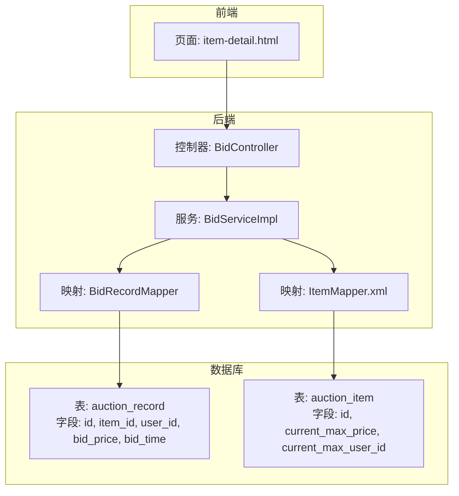
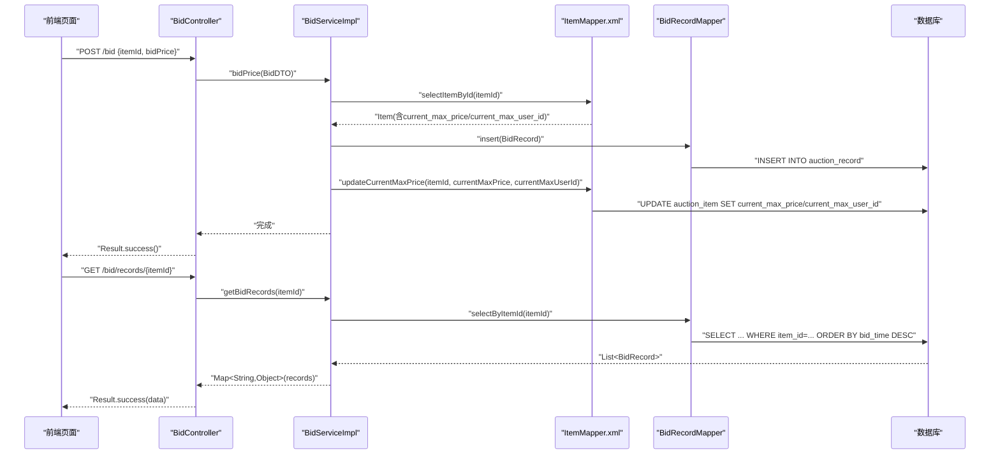
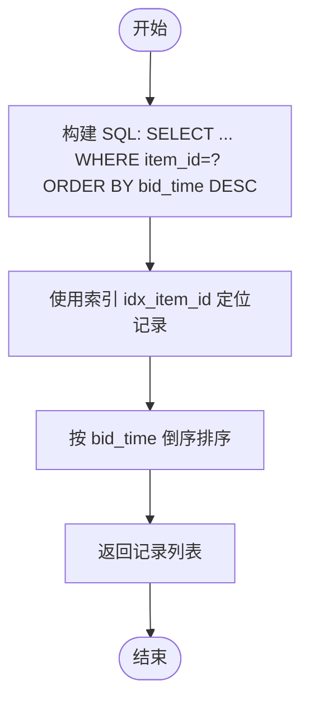
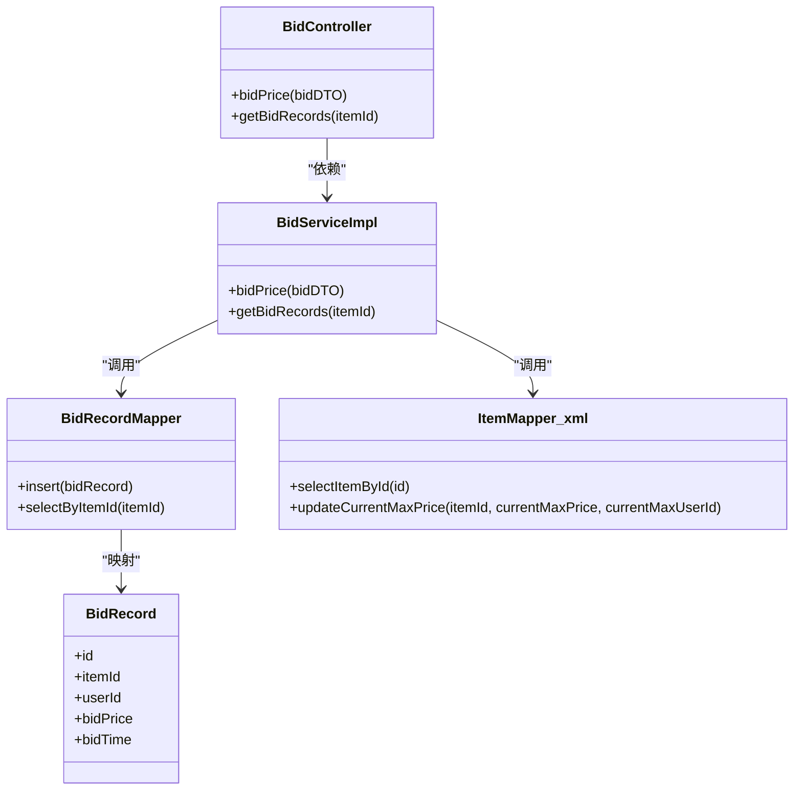

# 竞拍记录表（auction_record）

<cite>
**本文引用的文件**
- [auction_database.sql](file://auction_database.sql)
- [BidRecord.java](file://src/main/java/com/qkl/auctionsystem/pojo/entity/BidRecord.java)
- [BidDTO.java](file://src/main/java/com/qkl/auctionsystem/pojo/dto/BidDTO.java)
- [BidRecordDTO.java](file://src/main/java/com/qkl/auctionsystem/pojo/dto/BidRecordDTO.java)
- [BidController.java](file://src/main/java/com/qkl/auctionsystem/controller/BidController.java)
- [BidServiceImpl.java](file://src/main/java/com/qkl/auctionsystem/service/impl/BidServiceImpl.java)
- [BidRecordMapper.java](file://src/main/java/com/qkl/auctionsystem/mapper/BidRecordMapper.java)
- [ItemMapper.xml](file://src/main/resources/mapper/ItemMapper.xml)
- [item-detail.html](file://html/item-detail.html)
</cite>

## 目录
1. [简介](#简介)
2. [项目结构](#项目结构)
3. [核心组件](#核心组件)
4. [架构总览](#架构总览)
5. [详细组件分析](#详细组件分析)
6. [依赖关系分析](#依赖关系分析)
7. [性能考量](#性能考量)
8. [故障排查指南](#故障排查指南)
9. [结论](#结论)

## 简介
本文件围绕竞拍记录表（auction_record）进行系统化结构与使用说明，重点解释以下内容：
- 字段定义与业务含义：item_id、user_id、bid_price、bid_time 的设计与约束
- 不可变日志的设计原则：所有出价操作均为追加写入，不支持更新或删除
- 索引策略：idx_item_id、idx_user_id、idx_bid_time 在查询与统计中的性能优化作用
- Java 实体映射：BidRecord 中 bid_price 使用 BigDecimal 保证金额精度
- 控制器与服务层协作：BidController、BidServiceImpl 对出价与记录查询的调用链路
- 数据支撑作用：在竞拍逻辑校验（如出价必须高于当前最高价）中的数据来源与一致性保障

## 项目结构
竞拍记录表位于数据库层，配合 MyBatis Mapper 进行持久化；前端通过控制器接口发起出价请求，服务层负责业务校验与数据落库；拍品表维护当前最高价与最高价用户 ID，二者共同构成竞拍逻辑的核心数据支撑。

图表来源
- [auction_database.sql](file://auction_database.sql#L47-L60)
- [BidController.java](file://src/main/java/com/qkl/auctionsystem/controller/BidController.java#L18-L47)
- [BidServiceImpl.java](file://src/main/java/com/qkl/auctionsystem/service/impl/BidServiceImpl.java#L21-L75)
- [BidRecordMapper.java](file://src/main/java/com/qkl/auctionsystem/mapper/BidRecordMapper.java#L1-L19)
- [ItemMapper.xml](file://src/main/resources/mapper/ItemMapper.xml#L95-L109)
- [item-detail.html](file://html/item-detail.html#L312-L351)

章节来源
- [auction_database.sql](file://auction_database.sql#L47-L60)
- [BidController.java](file://src/main/java/com/qkl/auctionsystem/controller/BidController.java#L18-L47)
- [BidServiceImpl.java](file://src/main/java/com/qkl/auctionsystem/service/impl/BidServiceImpl.java#L21-L75)
- [BidRecordMapper.java](file://src/main/java/com/qkl/auctionsystem/mapper/BidRecordMapper.java#L1-L19)
- [ItemMapper.xml](file://src/main/resources/mapper/ItemMapper.xml#L95-L109)
- [item-detail.html](file://html/item-detail.html#L312-L351)

## 核心组件
- 竞拍记录表（auction_record）
  - 主键：id（自增）
  - 外键：item_id 关联拍品表（auction_item），user_id 关联用户表（user）
  - 字段：bid_price（DECIMAL(10,2)，金额精度）、bid_time（DATETIME，默认当前时间）
  - 索引：idx_item_id、idx_user_id、idx_bid_time
- Java 实体类 BidRecord
  - 字段：id、itemId、userId、bidPrice（BigDecimal）、bidTime（LocalDateTime）
- Mapper 接口 BidRecordMapper
  - insert：向 auction_record 插入一条出价记录
  - selectByItemId：按拍品 ID 查询所有出价记录并按时间倒序
- 服务实现 BidServiceImpl
  - bidPrice：接收 BidDTO，构造 BidRecord 并插入；随后更新拍品表的最高价与最高价用户
  - getBidRecords：按拍品 ID 查询记录并转换为 DTO 返回
- 控制器 BidController
  - /bid POST：提交出价
  - /bid/records/{itemId} GET：查询某拍品的历史出价记录

章节来源
- [auction_database.sql](file://auction_database.sql#L47-L60)
- [BidRecord.java](file://src/main/java/com/qkl/auctionsystem/pojo/entity/BidRecord.java#L10-L19)
- [BidRecordMapper.java](file://src/main/java/com/qkl/auctionsystem/mapper/BidRecordMapper.java#L14-L19)
- [BidServiceImpl.java](file://src/main/java/com/qkl/auctionsystem/service/impl/BidServiceImpl.java#L29-L75)
- [BidController.java](file://src/main/java/com/qkl/auctionsystem/controller/BidController.java#L29-L47)

## 架构总览
下面以序列图展示“出价”与“查询记录”的完整流程，体现控制器、服务、映射与数据库之间的交互。

图表来源
- [BidController.java](file://src/main/java/com/qkl/auctionsystem/controller/BidController.java#L29-L47)
- [BidServiceImpl.java](file://src/main/java/com/qkl/auctionsystem/service/impl/BidServiceImpl.java#L29-L75)
- [BidRecordMapper.java](file://src/main/java/com/qkl/auctionsystem/mapper/BidRecordMapper.java#L14-L19)
- [ItemMapper.xml](file://src/main/resources/mapper/ItemMapper.xml#L95-L109)
- [item-detail.html](file://html/item-detail.html#L312-L351)

## 详细组件分析

### 表结构与字段定义
- 主键与自增：id（自增）
- 外键约束
  - item_id：关联拍品表（auction_item）主键，表示该条出价记录对应的拍品
  - user_id：关联用户表（user）主键，表示出价的用户
- 字段语义
  - bid_price：出价金额，采用 DECIMAL(10,2)，保证金额精度
  - bid_time：出价发生的时间戳，默认 CURRENT_TIMESTAMP
- 索引设计
  - idx_item_id：加速按拍品维度查询所有出价记录
  - idx_user_id：加速按用户维度查询历史出价
  - idx_bid_time：辅助按时间排序与范围查询（虽然查询语句已显式 ORDER BY，但索引仍有助于排序性能）

章节来源
- [auction_database.sql](file://auction_database.sql#L47-L60)

### 不可变日志设计原则
- 所有出价操作均以“追加写入”的形式写入 auction_record，不支持对现有记录进行更新或删除
- 这种设计确保了竞拍过程的可审计性与完整性，便于后续复核、统计与对账
- 与拍品表 current_max_price/current_max_user_id 配合，形成“记录不可变 + 最高价原子更新”的双层保障

章节来源
- [auction_database.sql](file://auction_database.sql#L47-L60)
- [ItemMapper.xml](file://src/main/resources/mapper/ItemMapper.xml#L95-L109)

### Java 实体映射与精度保障
- BidRecord.java 定义了与数据库字段一一对应的属性，其中 bidPrice 使用 BigDecimal 类型，避免浮点运算误差
- 前端传入的整数型 bidPrice（Long）在服务层被转换为 BigDecimal 再入库，确保与数据库 DECIMAL(10,2) 的一致性

章节来源
- [BidRecord.java](file://src/main/java/com/qkl/auctionsystem/pojo/entity/BidRecord.java#L10-L19)
- [BidDTO.java](file://src/main/java/com/qkl/auctionsystem/pojo/dto/BidDTO.java#L1-L10)
- [BidServiceImpl.java](file://src/main/java/com/qkl/auctionsystem/service/impl/BidServiceImpl.java#L38-L47)

### 控制器与服务层协作
- BidController
  - POST /bid：接收 BidDTO，调用 BidService.bidPrice 完成出价
  - GET /bid/records/{itemId}：接收拍品 ID，调用 BidService.getBidRecords 返回记录列表
- BidServiceImpl
  - bidPrice：从 TokenFilter 获取当前用户 ID，读取拍品信息，构造 BidRecord 并插入；随后调用 ItemMapper.xml 的 updateCurrentMaxPrice 原子更新最高价与最高价用户
  - getBidRecords：按拍品 ID 查询记录，转换为 BidRecordDTO 列表并封装返回

章节来源
- [BidController.java](file://src/main/java/com/qkl/auctionsystem/controller/BidController.java#L29-L47)
- [BidServiceImpl.java](file://src/main/java/com/qkl/auctionsystem/service/impl/BidServiceImpl.java#L29-L75)
- [ItemMapper.xml](file://src/main/resources/mapper/ItemMapper.xml#L95-L109)

### 竞拍逻辑校验的数据支撑
- 前端在提交出价前会检查输入金额不得低于当前最高价（由页面最小值限制），这与后端的原子更新逻辑相辅相成
- 后端通过 ItemMapper.xml 的 updateCurrentMaxPrice 语句实现“仅当新出价大于当前最高价时才更新”，从而保证竞拍价格单调递增与一致性

章节来源
- [item-detail.html](file://html/item-detail.html#L312-L351)
- [ItemMapper.xml](file://src/main/resources/mapper/ItemMapper.xml#L95-L109)

### 查询流程与索引优化
- 按拍品查询记录：selectByItemId(itemId) 会利用 idx_item_id 快速定位该拍品的所有出价记录，并按 bid_time 倒序返回
- 按用户查询历史：selectByUserId(userId) 可利用 idx_user_id 快速检索某用户的全部出价记录
- 时间排序：查询语句已显式 ORDER BY bid_time DESC，索引 idx_bid_time 可进一步提升排序效率

图表来源
- [BidRecordMapper.java](file://src/main/java/com/qkl/auctionsystem/mapper/BidRecordMapper.java#L17-L19)
- [auction_database.sql](file://auction_database.sql#L47-L60)

## 依赖关系分析
- 控制器依赖服务接口，服务实现依赖 Mapper 接口与 ItemService
- Mapper 接口直接映射到数据库表 auction_record，提供 insert 与按拍品查询的方法
- ItemMapper.xml 提供拍品查询与最高价原子更新能力，是竞拍逻辑的关键支撑

图表来源
- [BidController.java](file://src/main/java/com/qkl/auctionsystem/controller/BidController.java#L18-L47)
- [BidServiceImpl.java](file://src/main/java/com/qkl/auctionsystem/service/impl/BidServiceImpl.java#L21-L75)
- [BidRecordMapper.java](file://src/main/java/com/qkl/auctionsystem/mapper/BidRecordMapper.java#L1-L19)
- [ItemMapper.xml](file://src/main/resources/mapper/ItemMapper.xml#L95-L109)
- [BidRecord.java](file://src/main/java/com/qkl/auctionsystem/pojo/entity/BidRecord.java#L10-L19)

章节来源
- [BidController.java](file://src/main/java/com/qkl/auctionsystem/controller/BidController.java#L18-L47)
- [BidServiceImpl.java](file://src/main/java/com/qkl/auctionsystem/service/impl/BidServiceImpl.java#L21-L75)
- [BidRecordMapper.java](file://src/main/java/com/qkl/auctionsystem/mapper/BidRecordMapper.java#L1-L19)
- [ItemMapper.xml](file://src/main/resources/mapper/ItemMapper.xml#L95-L109)
- [BidRecord.java](file://src/main/java/com/qkl/auctionsystem/pojo/entity/BidRecord.java#L10-L19)

## 性能考量
- 索引选择
  - idx_item_id：用于按拍品维度查询所有出价记录，显著降低扫描成本
  - idx_user_id：用于按用户维度查询历史出价，便于统计用户参与度
  - idx_bid_time：辅助排序与范围查询，提升 ORDER BY 与分页性能
- 写入路径
  - 出价写入仅涉及 INSERT，无 UPDATE/DELETE，满足不可变日志的高吞吐特性
- 读取路径
  - 查询按拍品维度为主，ORDER BY bid_time DESC，索引 idx_item_id + idx_bid_time 组合效果最佳
- 金额精度
  - 数据库存储与 Java 层均使用 DECIMAL/BigDecimal，避免浮点误差，保证财务级准确性

章节来源
- [auction_database.sql](file://auction_database.sql#L47-L60)
- [BidRecordMapper.java](file://src/main/java/com/qkl/auctionsystem/mapper/BidRecordMapper.java#L14-L19)
- [BidServiceImpl.java](file://src/main/java/com/qkl/auctionsystem/service/impl/BidServiceImpl.java#L38-L47)

## 故障排查指南
- 出价失败
  - 检查 TokenFilter 是否正确解析当前用户 ID
  - 检查 ItemService.selectItemById(itemId) 是否能正确返回拍品信息
  - 检查 BidRecordMapper.insert 是否抛出异常
  - 检查 ItemMapper.xml.updateCurrentMaxPrice 的原子更新条件是否命中（新出价必须大于当前最高价）
- 查询记录为空
  - 确认 itemId 是否正确
  - 确认 auction_record 中是否存在对应 item_id 的记录
  - 检查 ORDER BY bid_time DESC 是否符合预期
- 金额不一致
  - 检查前端传入的 bidPrice 是否为整数型 Long，服务层是否正确转换为 BigDecimal
  - 检查数据库 DECIMAL(10,2) 与 Java BigDecimal 的映射是否一致

章节来源
- [BidServiceImpl.java](file://src/main/java/com/qkl/auctionsystem/service/impl/BidServiceImpl.java#L29-L75)
- [ItemMapper.xml](file://src/main/resources/mapper/ItemMapper.xml#L95-L109)
- [BidRecordMapper.java](file://src/main/java/com/qkl/auctionsystem/mapper/BidRecordMapper.java#L14-L19)
- [BidRecord.java](file://src/main/java/com/qkl/auctionsystem/pojo/entity/BidRecord.java#L10-L19)

## 结论
竞拍记录表（auction_record）以“不可变日志”为核心设计理念，通过明确的外键关系、严谨的金额精度控制与完善的索引策略，为竞拍系统的出价、查询与统计提供了可靠的数据基础。配合拍品表的最高价原子更新机制，系统在保证数据一致性的同时，兼顾了性能与可审计性。前端与后端的协同（前端校验 + 后端原子更新）进一步提升了用户体验与业务正确性。