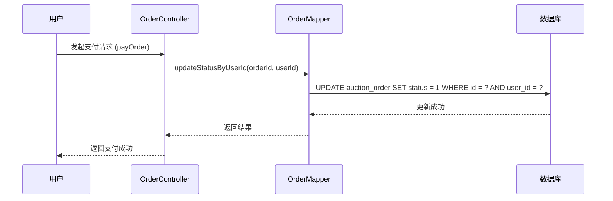

# 表结构详解

<cite>
**本文档引用的文件**  
- [auction_database.sql](file://auction_database.sql)
- [User.java](file://src/main/java/com/qkl/auctionsystem/pojo/entity/User.java)
- [Item.java](file://src/main/java/com/qkl/auctionsystem/pojo/entity/Item.java)
- [BidRecord.java](file://src/main/java/com/qkl/auctionsystem/pojo/entity/BidRecord.java)
- [Order.java](file://src/main/java/com/qkl/auctionsystem/pojo/entity/Order.java)
- [ItemMapper.xml](file://src/main/resources/mapper/ItemMapper.xml)
- [OrderMapper.xml](file://src/main/resources/mapper/OrderMapper.xml)
- [UserMapper.xml](file://src/main/resources/mapper/UserMapper.xml)
- [application.properties](file://src/main/resources/application.properties)
</cite>

## 目录
1. [用户表（user）](#用户表user)
2. [拍品表（auction_item）](#拍品表auction_item)
3. [竞拍记录表（auction_record）](#竞拍记录表auction_record)
4. [订单表（auction_order）](#订单表auction_order)
5. [ORM类型映射分析](#orm类型映射分析)

## 用户表（user）

该表存储系统用户信息，包括普通用户和管理员。

```sql
-- 建表语句（来自 auction_database.sql）
CREATE TABLE user (
    id BIGINT AUTO_INCREMENT COMMENT '用户ID（自增）',
    username VARCHAR(50) NOT NULL COMMENT '用户名（唯一，登录/标识用）',
    password VARCHAR(128) NOT NULL COMMENT '密码（加密存储）',
    role TINYINT NOT NULL DEFAULT 1 COMMENT '角色：0-管理员，1-普通用户（默认1）',
    create_time DATETIME NOT NULL DEFAULT CURRENT_TIMESTAMP COMMENT '创建时间',
    update_time DATETIME NOT NULL DEFAULT CURRENT_TIMESTAMP ON UPDATE CURRENT_TIMESTAMP COMMENT '更新时间',
    PRIMARY KEY (id),
    UNIQUE KEY uk_username (username)
) ENGINE=InnoDB DEFAULT CHARSET=utf8mb4 COLLATE=utf8mb4_unicode_ci COMMENT='用户表';
```

| 字段名 | 数据类型 | 主键 | 外键 | 约束条件 | 索引 | 业务语义 |
|--------|----------|------|------|----------|------|----------|
| id | BIGINT | 是 | 否 | AUTO_INCREMENT | PRIMARY KEY | 用户唯一标识，自增主键 |
| username | VARCHAR(50) | 否 | 否 | NOT NULL, UNIQUE | uk_username | 登录用户名，唯一 |
| password | VARCHAR(128) | 否 | 否 | NOT NULL | 无 | 加密存储的密码（如BCrypt） |
| role | TINYINT | 否 | 否 | NOT NULL, DEFAULT 1 | 无 | 用户角色：0-管理员，1-普通用户 |
| create_time | DATETIME | 否 | 否 | NOT NULL, DEFAULT CURRENT_TIMESTAMP | 无 | 记录创建时间 |
| update_time | DATETIME | 否 | 否 | NOT NULL, DEFAULT CURRENT_TIMESTAMP ON UPDATE CURRENT_TIMESTAMP | 无 | 记录最后更新时间 |

**Java实体类对照（User.java）**
```java
public class User {
    private Integer id; // 数据库为BIGINT，Java使用Integer（可升级为Long）
    private String username;
    private String password;
    private Integer role;
    private LocalDateTime createTime;
    private LocalDateTime updateTime;
}
```

**Section sources**
- [auction_database.sql](file://auction_database.sql#L14-L23)
- [User.java](file://src/main/java/com/qkl/auctionsystem/pojo/entity/User.java#L16-L25)

## 拍品表（auction_item）

该表存储拍卖商品的核心信息，包括价格、时间、状态等。

```sql
-- 建表语句（来自 auction_database.sql）
CREATE TABLE auction_item (
    id BIGINT AUTO_INCREMENT COMMENT '拍品ID（自增）',
    title VARCHAR(100) NOT NULL COMMENT '拍品名称',
    image VARCHAR(255) COMMENT '拍品图片URL（单张）',
    initial_price DECIMAL(10,2) NOT NULL COMMENT '起拍价（单位：元）',
    description VARCHAR(500) COMMENT '拍品描述',
    start_time DATETIME NOT NULL COMMENT '起拍时间',
    end_time DATETIME NOT NULL COMMENT '结束时间',
    current_max_price DECIMAL(10,2) NOT NULL DEFAULT 0.00 COMMENT '当前最高价（默认=起拍价）',
    current_max_user_id BIGINT COMMENT '当前最高出价用户ID（默认null）',
    status TINYINT NOT NULL DEFAULT 0 COMMENT '状态：0-未开始，1-竞拍中，2-已结束',
    listing_status TINYINT NOT NULL DEFAULT 1 COMMENT '上架状态：0-下架，1-上架',
    create_time DATETIME NOT NULL DEFAULT CURRENT_TIMESTAMP COMMENT '创建时间',
    update_time DATETIME NOT NULL DEFAULT CURRENT_TIMESTAMP ON UPDATE CURRENT_TIMESTAMP COMMENT '更新时间',
    PRIMARY KEY (id),
    KEY idx_status (status),
    KEY idx_listing_status (listing_status),
    KEY idx_start_time (start_time),
    KEY idx_end_time (end_time)
) ENGINE=InnoDB DEFAULT CHARSET=utf8mb4 COLLATE=utf8mb4_unicode_ci COMMENT='拍品表';
```

| 字段名 | 数据类型 | 主键 | 外键 | 约束条件 | 索引 | 业务语义 |
|--------|----------|------|------|----------|------|----------|
| id | BIGINT | 是 | 否 | AUTO_INCREMENT | PRIMARY KEY | 拍品唯一标识，自增主键 |
| title | VARCHAR(100) | 否 | 否 | NOT NULL | 无 | 拍卖商品名称 |
| image | VARCHAR(255) | 否 | 否 | 无 | 无 | 拍品图片的URL地址 |
| initial_price | DECIMAL(10,2) | 否 | 否 | NOT NULL | 无 | 起拍价格，单位为元，保留两位小数 |
| description | VARCHAR(500) | 否 | 否 | 无 | 无 | 拍品详细描述 |
| start_time | DATETIME | 否 | 否 | NOT NULL | idx_start_time | 竞拍开始时间 |
| end_time | DATETIME | 否 | 否 | NOT NULL | idx_end_time | 竞拍结束时间 |
| current_max_price | DECIMAL(10,2) | 否 | 否 | NOT NULL, DEFAULT 0.00 | 无 | 当前最高出价，初始为0 |
| current_max_user_id | BIGINT | 否 | 是 | 无 | 无 | 当前最高出价用户的ID（外键关联user.id） |
| status | TINYINT | 否 | 否 | NOT NULL, DEFAULT 0 | idx_status | 拍品状态：0-未开始，1-竞拍中，2-已结束 |
| listing_status | TINYINT | 否 | 否 | NOT NULL, DEFAULT 1 | idx_listing_status | 上架状态：0-下架，1-上架 |
| create_time | DATETIME | 否 | 否 | NOT NULL, DEFAULT CURRENT_TIMESTAMP | 无 | 记录创建时间 |
| update_time | DATETIME | 否 | 否 | NOT NULL, DEFAULT CURRENT_TIMESTAMP ON UPDATE CURRENT_TIMESTAMP | 无 | 记录最后更新时间 |

**状态流转说明**
- `status` 字段控制拍品生命周期：
  - 0：未开始（当前时间 < start_time）
  - 1：竞拍中（start_time ≤ 当前时间 < end_time）
  - 2：已结束（当前时间 ≥ end_time）
- `listing_status` 字段控制商品是否可被用户查看：
  - 0：下架（不显示在列表中）
  - 1：上架（正常展示）

**Java实体类对照（Item.java）**
```java
public class Item {
    private Long id;
    private String title;
    private String image;
    private Long initialPrice; // 数据库为DECIMAL(10,2)，Java使用Long（单位：分）
    private String description;
    private LocalDateTime startTime;
    private LocalDateTime endTime;
    private Long currentMaxPrice; // 数据库为DECIMAL(10,2)，Java使用Long（单位：分）
    private Long currentMaxUserId;
    private Integer status;
    private Integer listingStatus;
    private LocalDateTime createTime;
    private LocalDateTime updateTime;
}
```

**Section sources**
- [auction_database.sql](file://auction_database.sql#L26-L45)
- [Item.java](file://src/main/java/com/qkl/auctionsystem/pojo/entity/Item.java#L16-L34)
- [ItemMapper.xml](file://src/main/resources/mapper/ItemMapper.xml#L6-L109)

## 竞拍记录表（auction_record）

该表记录用户的每一次出价行为。

```sql
-- 建表语句（来自 auction_database.sql）
CREATE TABLE auction_record (
    id BIGINT AUTO_INCREMENT COMMENT '记录ID（自增）',
    item_id BIGINT NOT NULL COMMENT '关联拍品ID',
    user_id BIGINT NOT NULL COMMENT '出价用户ID',
    bid_price DECIMAL(10,2) NOT NULL COMMENT '出价金额（元）',
    bid_time DATETIME NOT NULL DEFAULT CURRENT_TIMESTAMP COMMENT '出价时间',
    PRIMARY KEY (id),
    KEY idx_item_id (item_id),
    KEY idx_user_id (user_id),
    KEY idx_bid_time (bid_time)
) ENGINE=InnoDB DEFAULT CHARSET=utf8mb4 COLLATE=utf8mb4_unicode_ci COMMENT='竞拍记录表';
```

| 字段名 | 数据类型 | 主键 | 外键 | 约束条件 | 索引 | 业务语义 |
|--------|----------|------|------|----------|------|----------|
| id | BIGINT | 是 | 否 | AUTO_INCREMENT | PRIMARY KEY | 记录唯一标识，自增主键 |
| item_id | BIGINT | 否 | 是 | NOT NULL | idx_item_id | 关联的拍品ID（外键关联auction_item.id） |
| user_id | BIGINT | 否 | 是 | NOT NULL | idx_user_id | 出价用户ID（外键关联user.id） |
| bid_price | DECIMAL(10,2) | 否 | 否 | NOT NULL | 无 | 出价金额，单位为元，保留两位小数 |
| bid_time | DATETIME | 否 | 否 | NOT NULL, DEFAULT CURRENT_TIMESTAMP | idx_bid_time | 出价发生的时间 |

**Java实体类对照（BidRecord.java）**
```java
public class BidRecord {
    private Long id;
    private Long itemId;
    private Long userId;
    private BigDecimal bidPrice; // 数据库为DECIMAL(10,2)，Java使用BigDecimal精确表示
    private LocalDateTime bidTime;
}
```

**Section sources**
- [auction_database.sql](file://auction_database.sql#L48-L58)
- [BidRecord.java](file://src/main/java/com/qkl/auctionsystem/pojo/entity/BidRecord.java#L14-L19)

## 订单表（auction_order）

该表存储拍卖成功后的订单信息。

```sql
-- 建表语句（来自 auction_database.sql）
CREATE TABLE auction_order (
    id BIGINT AUTO_INCREMENT COMMENT '订单ID',
    item_id BIGINT NOT NULL COMMENT '关联拍品ID',
    user_id BIGINT NOT NULL COMMENT '买家ID',
    deal_price DECIMAL(10,2) NOT NULL COMMENT '成交价格（=拍品最终最高价）',
    status TINYINT NOT NULL DEFAULT 0 COMMENT '状态：0-待付款，1-已完成',
    update_time DATETIME NOT NULL DEFAULT CURRENT_TIMESTAMP ON UPDATE CURRENT_TIMESTAMP COMMENT '更新时间',
    PRIMARY KEY (id),
    UNIQUE KEY uk_item_id (item_id),
    KEY idx_user_id (user_id),
    KEY idx_status (status)
) ENGINE=InnoDB DEFAULT CHARSET=utf8mb4 COLLATE=utf8mb4_unicode_ci COMMENT='订单表';
```

| 字段名 | 数据类型 | 主键 | 外键 | 约束条件 | 索引 | 业务语义 |
|--------|----------|------|------|----------|------|----------|
| id | BIGINT | 是 | 否 | AUTO_INCREMENT | PRIMARY KEY | 订单唯一标识，自增主键 |
| item_id | BIGINT | 否 | 是 | NOT NULL, UNIQUE | uk_item_id | 关联的拍品ID（外键关联auction_item.id），唯一约束确保一个拍品只能生成一个订单 |
| user_id | BIGINT | 否 | 是 | NOT NULL | idx_user_id | 买家用户ID（外键关联user.id） |
| deal_price | DECIMAL(10,2) | 否 | 否 | NOT NULL | 无 | 成交价格，等于拍品的最终最高价 |
| status | TINYINT | 否 | 否 | NOT NULL, DEFAULT 0 | idx_status | 订单状态：0-待付款，1-已完成 |
| update_time | DATETIME | 否 | 否 | NOT NULL, DEFAULT CURRENT_TIMESTAMP ON UPDATE CURRENT_TIMESTAMP | 无 | 记录最后更新时间 |

**状态流转说明**
- `status` 字段控制订单生命周期：
  - 0：待付款（用户需在规定时间内完成支付）
  - 1：已完成（用户已支付，订单完成）

**Java实体类对照（Order.java）**
```java
public class Order {
    private Long id;
    private Long itemId;
    private Long userId;
    private Long dealPrice; // 数据库为DECIMAL(10,2)，Java使用Long（单位：分）
    private Integer status;
    private LocalDateTime updateTime;
    private String itemTitle; // 非数据库字段，用于前端展示
}
```

**订单状态更新流程**


**Diagram sources**
- [OrderMapper.xml](file://src/main/resources/mapper/OrderMapper.xml#L6-L8)
- [OrderController.java](file://src/main/java/com/qkl/auctionsystem/controller/OrderController.java#L26)

**Section sources**
- [auction_database.sql](file://auction_database.sql#L61-L72)
- [Order.java](file://src/main/java/com/qkl/auctionsystem/pojo/entity/Order.java#L16-L24)
- [OrderMapper.xml](file://src/main/resources/mapper/OrderMapper.xml#L6-L15)

## ORM类型映射分析

本系统使用MyBatis进行ORM映射，通过`application.properties`中的配置实现数据库字段与Java实体类的自动映射。

```properties
# application.properties 配置
mybatis.configuration.mapUnderscoreToCamelCase=true
```

该配置启用下划线转驼峰命名，使得数据库字段如 `initial_price` 可自动映射到Java属性 `initialPrice`。

### 关键类型映射对照

| 数据库类型 | Java类型 | 映射说明 | 注意事项 |
|----------|---------|----------|----------|
| BIGINT | Long | 主键、外键、ID字段均使用Long | 保证大数值范围 |
| DECIMAL(10,2) | Long (业务层) | 金额字段在Java中使用Long，单位为"分"，避免浮点数精度问题 | 如 `initialPrice`、`currentMaxPrice`、`dealPrice` |
| DECIMAL(10,2) | BigDecimal (实体层) | 在BidRecord中使用BigDecimal保证精确计算 | 仅在需要精确计算时使用 |
| TINYINT | Integer | 状态字段使用Integer表示枚举值 | 如 `status`、`listing_status`、`role` |
| DATETIME | LocalDateTime | 时间字段使用Java 8时间API | 需配合@JsonFormat注解格式化输出 |
| VARCHAR | String | 字符串字段直接映射 | 注意长度限制 |

### 金额处理策略

系统采用"分"为最小单位存储金额，避免浮点数精度丢失问题：
- 前端输入元 → 乘以100 → 数据库存储分
- 数据库读取分 → 除以100 → 前端显示元

此策略确保了金额计算的精确性，是金融类应用的推荐做法。

**Section sources**
- [application.properties](file://src/main/resources/application.properties#L13)
- [Item.java](file://src/main/java/com/qkl/auctionsystem/pojo/entity/Item.java#L19-L27)
- [Order.java](file://src/main/java/com/qkl/auctionsystem/pojo/entity/Order.java#L19)
- [BidRecord.java](file://src/main/java/com/qkl/auctionsystem/pojo/entity/BidRecord.java#L17)