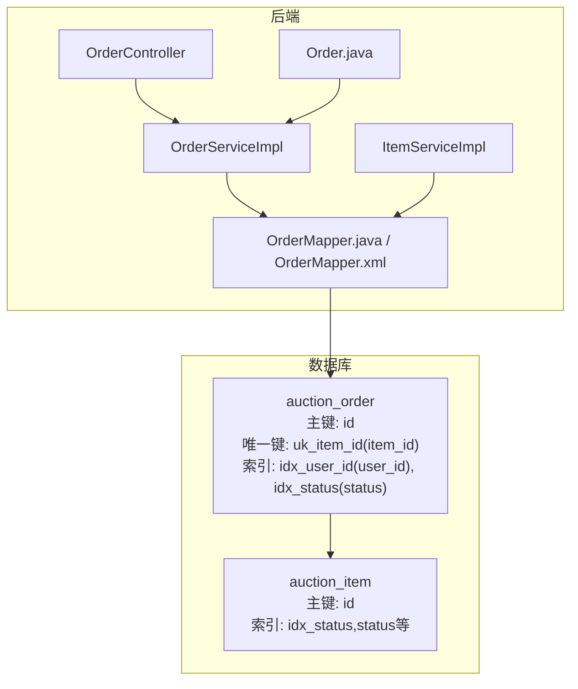
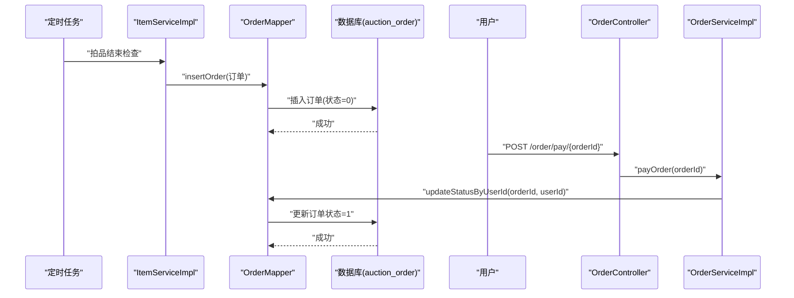
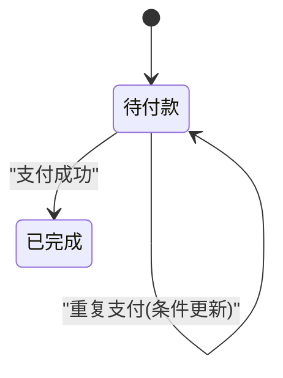
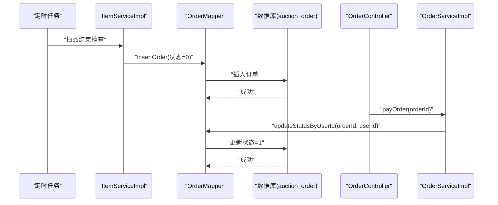
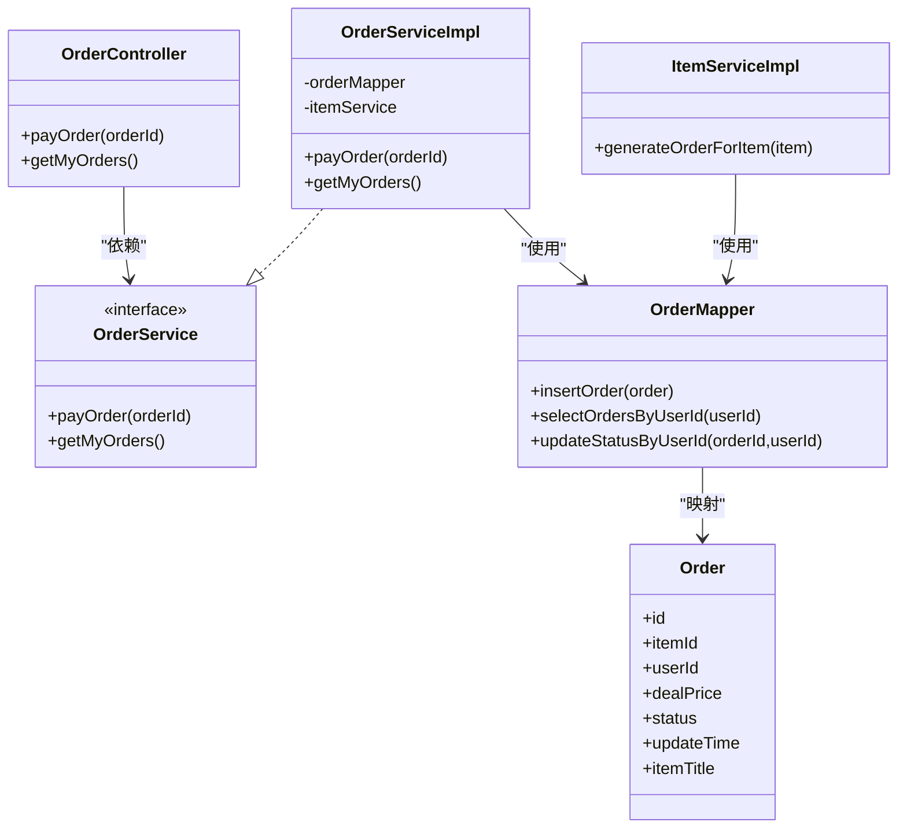

# 订单表（auction_order）

<cite>
**本文引用的文件**
- [auction_database.sql](file://auction_database.sql)
- [Order.java](file://src/main/java/com/qkl/auctionsystem/pojo/entity/Order.java)
- [OrderMapper.java](file://src/main/java/com/qkl/auctionsystem/mapper/OrderMapper.java)
- [OrderMapper.xml](file://src/main/resources/mapper/OrderMapper.xml)
- [OrderController.java](file://src/main/java/com/qkl/auctionsystem/controller/OrderController.java)
- [OrderServiceImpl.java](file://src/main/java/com/qkl/auctionsystem/service/impl/OrderServiceImpl.java)
- [ItemServiceImpl.java](file://src/main/java/com/qkl/auctionsystem/service/impl/ItemServiceImpl.java)
- [Item.java](file://src/main/java/com/qkl/auctionsystem/pojo/entity/Item.java)
</cite>

## 目录
1. [简介](#简介)
2. [项目结构](#项目结构)
3. [核心组件](#核心组件)
4. [架构总览](#架构总览)
5. [详细组件分析](#详细组件分析)
6. [依赖关系分析](#依赖关系分析)
7. [性能考量](#性能考量)
8. [故障排查指南](#故障排查指南)
9. [结论](#结论)

## 简介
本文件系统性梳理拍卖系统中的订单表（auction_order）结构与业务逻辑，重点围绕以下目标展开：
- 字段组成与含义：item_id、user_id、deal_price、status、update_time 等字段的作用与取值范围。
- 关系约束：item_id 与拍品表（auction_item）的关系；user_id 与用户表（user）的关系；uk_item_id 唯一键约束确保同一拍品仅生成一个订单。
- 索引设计：idx_status 在查询“待付款”订单、统计“已完成”订单时的查询效率提升。
- 状态流转：订单状态 0（待付款）到 1（已完成）的流转逻辑及触发条件。
- 实体映射一致性：Order.java 中 deal_price 字段精度与数据库 DECIMAL(10,2) 的一致性说明。
- 核心流程：定时任务触发订单生成、用户支付订单更新状态、与拍品表 status 联动更新的业务规则。

## 项目结构
围绕订单表的相关模块分布如下：
- 数据库层：auction_database.sql 定义了 auction_order 表结构、索引与唯一键约束。
- 映射层：OrderMapper.java 与 OrderMapper.xml 提供订单插入、查询与状态更新能力。
- 服务层：OrderServiceImpl 实现订单支付与查询；ItemServiceImpl 在拍品结束后生成订单。
- 控制器层：OrderController 对外暴露支付与订单列表接口。
- 领域模型：Order.java 定义订单实体属性，包含 deal_price、status、updateTime 等。

图表来源
- [auction_database.sql](file://auction_database.sql#L60-L72)
- [OrderController.java](file://src/main/java/com/qkl/auctionsystem/controller/OrderController.java#L1-L43)
- [OrderServiceImpl.java](file://src/main/java/com/qkl/auctionsystem/service/impl/OrderServiceImpl.java#L1-L43)
- [OrderMapper.java](file://src/main/java/com/qkl/auctionsystem/mapper/OrderMapper.java#L1-L19)
- [OrderMapper.xml](file://src/main/resources/mapper/OrderMapper.xml#L1-L15)
- [ItemServiceImpl.java](file://src/main/java/com/qkl/auctionsystem/service/impl/ItemServiceImpl.java#L150-L182)
- [Order.java](file://src/main/java/com/qkl/auctionsystem/pojo/entity/Order.java#L1-L24)

章节来源
- [auction_database.sql](file://auction_database.sql#L60-L72)
- [OrderController.java](file://src/main/java/com/qkl/auctionsystem/controller/OrderController.java#L1-L43)
- [OrderServiceImpl.java](file://src/main/java/com/qkl/auctionsystem/service/impl/OrderServiceImpl.java#L1-L43)
- [OrderMapper.java](file://src/main/java/com/qkl/auctionsystem/mapper/OrderMapper.java#L1-L19)
- [OrderMapper.xml](file://src/main/resources/mapper/OrderMapper.xml#L1-L15)
- [ItemServiceImpl.java](file://src/main/java/com/qkl/auctionsystem/service/impl/ItemServiceImpl.java#L150-L182)
- [Order.java](file://src/main/java/com/qkl/auctionsystem/pojo/entity/Order.java#L1-L24)

## 核心组件
- 订单表（auction_order）关键字段
  - id：自增主键，唯一标识订单。
  - item_id：关联拍品表（auction_item）的拍品ID，用于定位成交拍品。
  - user_id：买家ID，关联用户表（user）。
  - deal_price：成交价格，单位为分（Long 类型），与拍品最终最高价一致。
  - status：订单状态，0 表示“待付款”，1 表示“已完成”。
  - update_time：记录更新时间，自动维护。
  - item_title：订单查询时通过左连接拍品表返回拍品标题，便于前端展示。
- 约束与索引
  - 主键：id。
  - 唯一键：uk_item_id(item_id)，确保同一拍品仅能生成一条订单，防止重复下单。
  - 索引：idx_user_id(user_id)、idx_status(status)。
- 实体映射一致性
  - 数据库：deal_price 使用 DECIMAL(10,2)，表示最多 10 位数字，其中 2 位小数。
  - Java 实体：Order.dealPrice 使用 Long 类型，表示“分”单位。因此需保证业务侧统一以“分”为最小单位，避免精度不一致导致的误差。

章节来源
- [auction_database.sql](file://auction_database.sql#L60-L72)
- [Order.java](file://src/main/java/com/qkl/auctionsystem/pojo/entity/Order.java#L1-L24)
- [OrderMapper.xml](file://src/main/resources/mapper/OrderMapper.xml#L1-L15)

## 架构总览
订单表在系统中的职责与交互如下：
- 定时任务：拍品结束后，ItemServiceImpl 生成订单（状态 0 待付款），并写入 auction_order。
- 支付流程：用户调用支付接口，OrderController -> OrderServiceImpl -> OrderMapper 将订单状态从 0 更新为 1。
- 查询流程：用户查询个人订单列表，OrderServiceImpl 通过 OrderMapper 查询并返回带拍品标题的订单集合。
- 约束保障：uk_item_id 唯一键确保同一拍品只生成一个订单；idx_status 优化按状态查询的性能。

图表来源
- [ItemServiceImpl.java](file://src/main/java/com/qkl/auctionsystem/service/impl/ItemServiceImpl.java#L150-L182)
- [OrderMapper.java](file://src/main/java/com/qkl/auctionsystem/mapper/OrderMapper.java#L1-L19)
- [OrderMapper.xml](file://src/main/resources/mapper/OrderMapper.xml#L1-L15)
- [OrderController.java](file://src/main/java/com/qkl/auctionsystem/controller/OrderController.java#L1-L43)
- [OrderServiceImpl.java](file://src/main/java/com/qkl/auctionsystem/service/impl/OrderServiceImpl.java#L1-L43)

## 详细组件分析

### 订单表结构与字段解析
- 字段说明
  - id：自增主键，唯一标识每条订单。
  - item_id：外键关联 auction_item.id，表示该订单对应的拍品。
  - user_id：外键关联 user.id，表示该订单的买家。
  - deal_price：成交价格，数据库使用 DECIMAL(10,2)，Java 实体使用 Long（分）。业务需统一以“分”为单位，避免精度损失。
  - status：订单状态，0 表示“待付款”，1 表示“已完成”。该状态由支付流程更新。
  - update_time：记录更新时间，自动维护。
  - item_title：查询时通过左连接拍品表返回拍品标题，便于前端展示。
- 约束与索引
  - 唯一键 uk_item_id(item_id)：确保同一拍品仅生成一条订单，防止重复下单。
  - 索引 idx_user_id(user_id)：加速按用户查询订单。
  - 索引 idx_status(status)：加速按状态查询（如统计“待付款”或“已完成”）。

章节来源
- [auction_database.sql](file://auction_database.sql#L60-L72)
- [OrderMapper.xml](file://src/main/resources/mapper/OrderMapper.xml#L1-L15)
- [Order.java](file://src/main/java/com/qkl/auctionsystem/pojo/entity/Order.java#L1-L24)

### 订单实体与数据类型一致性
- 数据库定义：deal_price DECIMAL(10,2)。
- Java 实体：Order.dealPrice 为 Long。
- 一致性建议
  - 业务层统一以“分”为最小单位，避免浮点运算导致的精度问题。
  - MyBatis 映射时确保 Long 与 DECIMAL(10,2) 的正确转换，避免四舍五入或截断。
  - 前端展示时再换算为“元”。

章节来源
- [auction_database.sql](file://auction_database.sql#L60-L72)
- [Order.java](file://src/main/java/com/qkl/auctionsystem/pojo/entity/Order.java#L1-L24)

### 订单状态与流转逻辑
- 状态定义
  - 0：待付款（由定时任务拍品结束后生成订单时设置）。
  - 1：已完成（用户支付后由支付接口更新）。
- 流转路径
  - 生成：拍品结束且存在最高出价用户时，生成状态为 0 的订单。
  - 支付：用户调用支付接口，服务层校验当前登录用户与订单 user_id 匹配后，将状态更新为 1。
- 事务与并发
  - 支付更新采用“按订单ID+用户ID”的条件更新，避免越权修改他人订单。
  - uk_item_id 唯一键在插入阶段提供幂等保护，防止重复生成订单。

图表来源
- [OrderMapper.xml](file://src/main/resources/mapper/OrderMapper.xml#L1-L15)
- [OrderServiceImpl.java](file://src/main/java/com/qkl/auctionsystem/service/impl/OrderServiceImpl.java#L1-L43)

章节来源
- [OrderMapper.xml](file://src/main/resources/mapper/OrderMapper.xml#L1-L15)
- [OrderServiceImpl.java](file://src/main/java/com/qkl/auctionsystem/service/impl/OrderServiceImpl.java#L1-L43)

### 唯一键约束（uk_item_id）与重复下单防护
- 约束定义：uk_item_id(item_id) 确保同一拍品仅对应一条订单。
- 业务意义：防止拍品多次流拍或异常情况下重复生成订单。
- 实现位置：数据库层定义唯一键；服务层在拍品结束后生成订单时，若已有订单则不会再次插入（由唯一键约束阻止）。

章节来源
- [auction_database.sql](file://auction_database.sql#L60-L72)
- [ItemServiceImpl.java](file://src/main/java/com/qkl/auctionsystem/service/impl/ItemServiceImpl.java#L150-L182)

### 索引设计与查询效率
- idx_status(status)
  - 用途：按状态查询“待付款”或“已完成”订单，支持定时任务扫描与统计。
  - 效率：避免全表扫描，显著降低查询成本。
- idx_user_id(user_id)
  - 用途：按用户查询个人订单列表，提升用户体验。
- 组合查询建议：当同时按 user_id 和 status 过滤时，可考虑复合索引以进一步优化（当前数据库定义为独立索引）。

章节来源
- [auction_database.sql](file://auction_database.sql#L60-L72)
- [OrderMapper.xml](file://src/main/resources/mapper/OrderMapper.xml#L1-L15)

### 核心流程：定时任务生成订单与支付更新
- 定时任务生成订单
  - 触发条件：拍品结束（结束时间到达）且存在最高出价用户。
  - 执行步骤：ItemServiceImpl 生成订单实体（状态 0、deal_price 为最高价、user_id 为最高出价用户），调用 OrderMapper.insertOrder 写入数据库。
  - 幂等保障：uk_item_id 唯一键确保同一拍品仅生成一次订单。
- 用户支付更新状态
  - 接口入口：OrderController.payOrder 接收订单ID。
  - 服务实现：OrderServiceImpl 获取当前登录用户ID，调用 OrderMapper.updateStatusByUserId 条件更新订单状态为 1。
  - 安全性：条件更新同时匹配 orderId 与 userId，防止越权操作。

图表来源
- [ItemServiceImpl.java](file://src/main/java/com/qkl/auctionsystem/service/impl/ItemServiceImpl.java#L150-L182)
- [OrderController.java](file://src/main/java/com/qkl/auctionsystem/controller/OrderController.java#L1-L43)
- [OrderServiceImpl.java](file://src/main/java/com/qkl/auctionsystem/service/impl/OrderServiceImpl.java#L1-L43)
- [OrderMapper.java](file://src/main/java/com/qkl/auctionsystem/mapper/OrderMapper.java#L1-L19)
- [OrderMapper.xml](file://src/main/resources/mapper/OrderMapper.xml#L1-L15)

章节来源
- [ItemServiceImpl.java](file://src/main/java/com/qkl/auctionsystem/service/impl/ItemServiceImpl.java#L150-L182)
- [OrderController.java](file://src/main/java/com/qkl/auctionsystem/controller/OrderController.java#L1-L43)
- [OrderServiceImpl.java](file://src/main/java/com/qkl/auctionsystem/service/impl/OrderServiceImpl.java#L1-L43)
- [OrderMapper.java](file://src/main/java/com/qkl/auctionsystem/mapper/OrderMapper.java#L1-L19)
- [OrderMapper.xml](file://src/main/resources/mapper/OrderMapper.xml#L1-L15)

### 与拍品表 status 的联动更新
- 拍品状态流转
  - 未开始（0）-> 竞拍中（1）-> 已结束（2）。
- 订单生成时机
  - 当拍品状态变为“已结束”且存在最高出价用户时，生成状态为“待付款”的订单。
- 业务规则
  - 若拍品无最高出价用户，则不生成订单。
  - 订单生成后，用户需在规定时间内完成支付，否则可能影响后续流程（如超时处理策略由业务决定）。

章节来源
- [ItemServiceImpl.java](file://src/main/java/com/qkl/auctionsystem/service/impl/ItemServiceImpl.java#L135-L147)
- [Item.java](file://src/main/java/com/qkl/auctionsystem/pojo/entity/Item.java#L1-L34)
- [auction_database.sql](file://auction_database.sql#L25-L45)

## 依赖关系分析
- 组件耦合
  - OrderController 依赖 OrderService 接口。
  - OrderServiceImpl 依赖 OrderMapper 接口与 ItemService（用于业务协作，但订单生成主要由 ItemServiceImpl 调用 OrderMapper）。
  - OrderMapper 同时被 ItemServiceImpl 与 OrderServiceImpl 使用，承担订单的插入与状态更新。
  - 数据库层通过唯一键与索引约束保障数据一致性与查询性能。
- 外部依赖
  - MyBatis 提供 SQL 映射与参数绑定。
  - Spring 注解驱动依赖注入与事务管理。

图表来源
- [OrderController.java](file://src/main/java/com/qkl/auctionsystem/controller/OrderController.java#L1-L43)
- [OrderService.java](file://src/main/java/com/qkl/auctionsystem/service/OrderService.java#L1-L21)
- [OrderServiceImpl.java](file://src/main/java/com/qkl/auctionsystem/service/impl/OrderServiceImpl.java#L1-L43)
- [OrderMapper.java](file://src/main/java/com/qkl/auctionsystem/mapper/OrderMapper.java#L1-L19)
- [ItemServiceImpl.java](file://src/main/java/com/qkl/auctionsystem/service/impl/ItemServiceImpl.java#L150-L182)
- [Order.java](file://src/main/java/com/qkl/auctionsystem/pojo/entity/Order.java#L1-L24)

章节来源
- [OrderController.java](file://src/main/java/com/qkl/auctionsystem/controller/OrderController.java#L1-L43)
- [OrderService.java](file://src/main/java/com/qkl/auctionsystem/service/OrderService.java#L1-L21)
- [OrderServiceImpl.java](file://src/main/java/com/qkl/auctionsystem/service/impl/OrderServiceImpl.java#L1-L43)
- [OrderMapper.java](file://src/main/java/com/qkl/auctionsystem/mapper/OrderMapper.java#L1-L19)
- [ItemServiceImpl.java](file://src/main/java/com/qkl/auctionsystem/service/impl/ItemServiceImpl.java#L150-L182)
- [Order.java](file://src/main/java/com/qkl/auctionsystem/pojo/entity/Order.java#L1-L24)

## 性能考量
- 索引选择
  - idx_status：按状态过滤的查询（如统计“待付款”或“已完成”）应优先使用该索引。
  - idx_user_id：按用户查询订单列表时使用，减少扫描范围。
- 复合索引建议
  - 若存在“按 user_id 且按 status 过滤”的高频查询，可考虑增加复合索引以进一步提升性能。
- 幂等与唯一键
  - uk_item_id 唯一键在插入阶段提供幂等保护，避免重复订单带来的额外写入压力。
- 数据类型与精度
  - deal_price 使用 DECIMAL(10,2) 与 Long（分）的组合，需确保业务层统一以“分”为单位，避免精度问题引发的二次计算与错误。

[本节为通用性能建议，无需特定文件引用]

## 故障排查指南
- 订单无法生成
  - 检查拍品是否已结束且存在最高出价用户。
  - 检查 uk_item_id 唯一键是否已被占用（同一拍品重复生成订单会被拒绝）。
- 支付失败或状态未更新
  - 确认当前登录用户与订单 user_id 是否一致（条件更新会校验 userId）。
  - 检查数据库连接与事务配置，确保 updateStatusByUserId 能正常执行。
- 订单列表为空
  - 确认当前用户是否已登录，服务层会校验用户身份。
  - 检查 idx_user_id 索引是否存在以及查询条件是否命中索引。

章节来源
- [OrderServiceImpl.java](file://src/main/java/com/qkl/auctionsystem/service/impl/OrderServiceImpl.java#L1-L43)
- [OrderMapper.xml](file://src/main/resources/mapper/OrderMapper.xml#L1-L15)
- [ItemServiceImpl.java](file://src/main/java/com/qkl/auctionsystem/service/impl/ItemServiceImpl.java#L150-L182)

## 结论
- 订单表（auction_order）通过 uk_item_id 唯一键与 idx_status、idx_user_id 索引，既保障了业务幂等性，又提升了关键查询的性能。
- 订单状态从“待付款”到“已完成”的流转清晰，支付流程通过条件更新确保安全性与一致性。
- deal_price 的精度映射需统一以“分”为单位，避免因数据类型差异导致的精度问题。
- 定时任务与支付流程协同，确保拍品结束后及时生成订单，并在用户支付后完成状态更新，与拍品表的状态联动形成完整的业务闭环。