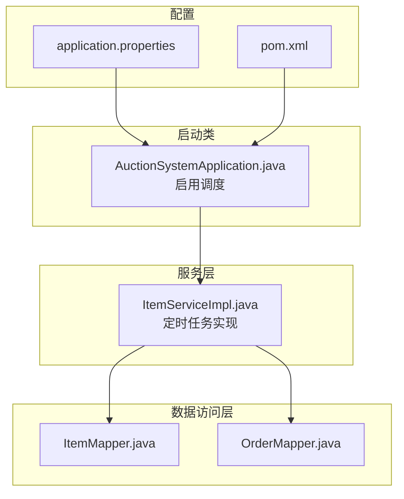
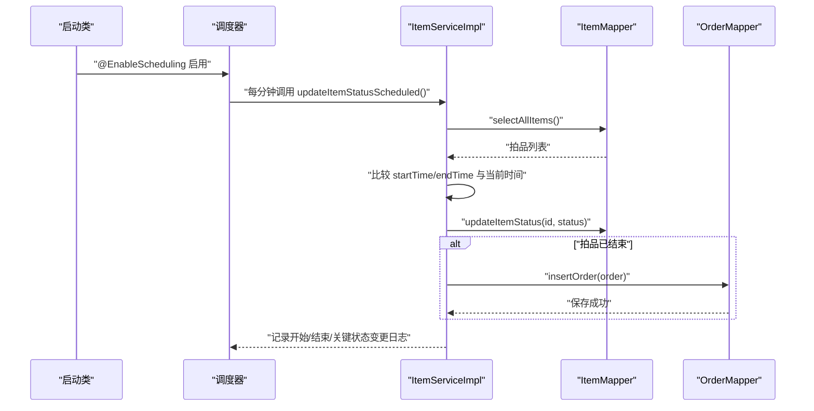
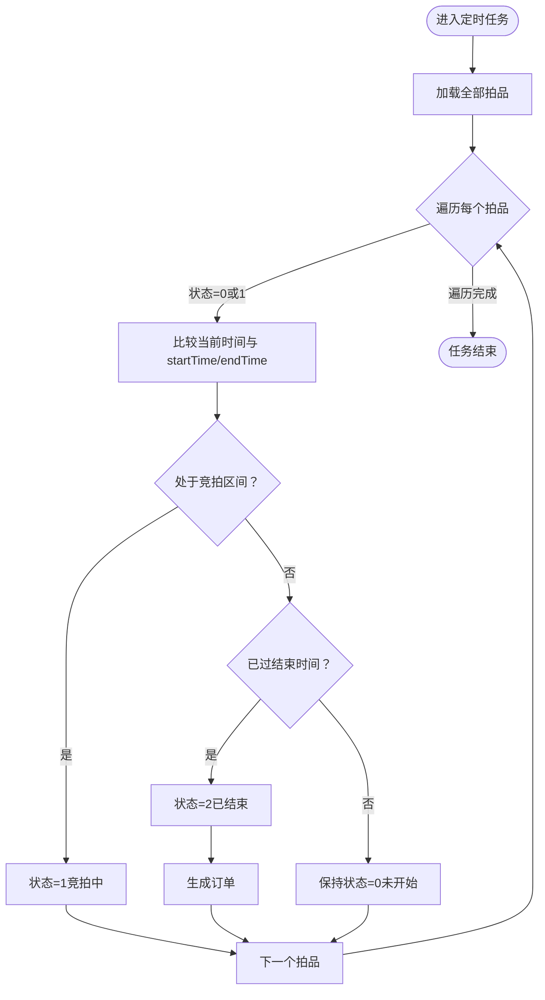
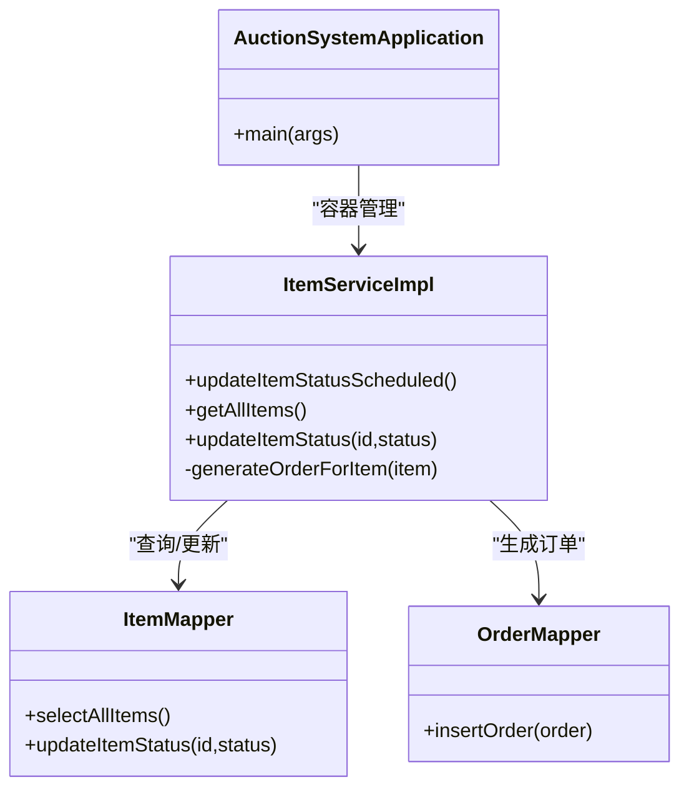

# 定时任务机制

<cite>
**本文引用的文件**
- [AuctionSystemApplication.java](file://src/main/java/com/qkl/auctionsystem/AuctionSystemApplication.java)
- [ItemServiceImpl.java](file://src/main/java/com/qkl/auctionsystem/service/impl/ItemServiceImpl.java)
- [ItemMapper.java](file://src/main/java/com/qkl/auctionsystem/mapper/ItemMapper.java)
- [OrderMapper.java](file://src/main/java/com/qkl/auctionsystem/mapper/OrderMapper.java)
- [application.properties](file://src/main/resources/application.properties)
- [pom.xml](file://pom.xml)
</cite>

## 目录
1. [引言](#引言)
2. [项目结构](#项目结构)
3. [核心组件](#核心组件)
4. [架构总览](#架构总览)
5. [详细组件分析](#详细组件分析)
6. [依赖分析](#依赖分析)
7. [性能考虑](#性能考虑)
8. [故障排查指南](#故障排查指南)
9. [结论](#结论)
10. [附录](#附录)

## 引言
本文件围绕系统中的定时任务机制展开，重点说明拍品状态机的自动流转逻辑与配置方式。文档将解释 @Scheduled 注解的含义与执行周期，阐述任务如何遍历拍品并根据当前时间与拍品起止时间自动更新状态；同时强调任务执行过程中的日志记录策略，便于运维监控。此外，文档指出 Spring 的 @EnableScheduling 已在启动类中启用，且当前任务执行为单线程，避免并发问题，并给出任务执行频率的配置建议及在高并发场景下的性能优化思路（如分批处理、引入分布式任务调度）。

## 项目结构
系统采用 Spring Boot 标准目录组织，定时任务位于服务层实现类中，启动类启用调度功能，数据访问通过 Mapper 接口完成。

图表来源
- [AuctionSystemApplication.java](file://src/main/java/com/qkl/auctionsystem/AuctionSystemApplication.java#L1-L17)
- [ItemServiceImpl.java](file://src/main/java/com/qkl/auctionsystem/service/impl/ItemServiceImpl.java#L107-L147)
- [ItemMapper.java](file://src/main/java/com/qkl/auctionsystem/mapper/ItemMapper.java#L1-L35)
- [OrderMapper.java](file://src/main/java/com/qkl/auctionsystem/mapper/OrderMapper.java#L1-L19)
- [application.properties](file://src/main/resources/application.properties#L1-L20)
- [pom.xml](file://pom.xml#L1-L129)

章节来源
- [AuctionSystemApplication.java](file://src/main/java/com/qkl/auctionsystem/AuctionSystemApplication.java#L1-L17)
- [ItemServiceImpl.java](file://src/main/java/com/qkl/auctionsystem/service/impl/ItemServiceImpl.java#L107-L147)
- [ItemMapper.java](file://src/main/java/com/qkl/auctionsystem/mapper/ItemMapper.java#L1-L35)
- [OrderMapper.java](file://src/main/java/com/qkl/auctionsystem/mapper/OrderMapper.java#L1-L19)
- [application.properties](file://src/main/resources/application.properties#L1-L20)
- [pom.xml](file://pom.xml#L1-L129)

## 核心组件
- 启动类启用调度：在启动类中使用 @EnableScheduling 注解开启 Spring 调度支持，确保被 @Scheduled 标注的方法能够被调度器发现并执行。
- 定时任务实现：在 ItemServiceImpl 中定义了基于 cron 表达式的定时任务，每分钟触发一次，用于检查并更新拍品状态。
- 数据访问层：通过 ItemMapper 查询全部拍品，通过 OrderMapper 在拍品结束后生成订单。
- 日志记录：任务开始、关键状态变更（竞拍中、已结束）、任务完成均输出日志，便于运维监控。

章节来源
- [AuctionSystemApplication.java](file://src/main/java/com/qkl/auctionsystem/AuctionSystemApplication.java#L1-L17)
- [ItemServiceImpl.java](file://src/main/java/com/qkl/auctionsystem/service/impl/ItemServiceImpl.java#L107-L147)
- [ItemMapper.java](file://src/main/java/com/qkl/auctionsystem/mapper/ItemMapper.java#L1-L35)
- [OrderMapper.java](file://src/main/java/com/qkl/auctionsystem/mapper/OrderMapper.java#L1-L19)

## 架构总览
定时任务的执行路径如下：启动类启用调度 -> 定时任务方法被调度器按周期触发 -> 读取全部拍品 -> 比较当前时间与拍品起止时间 -> 更新状态 -> 若结束则生成订单 -> 记录日志。

图表来源
- [AuctionSystemApplication.java](file://src/main/java/com/qkl/auctionsystem/AuctionSystemApplication.java#L1-L17)
- [ItemServiceImpl.java](file://src/main/java/com/qkl/auctionsystem/service/impl/ItemServiceImpl.java#L107-L147)
- [ItemMapper.java](file://src/main/java/com/qkl/auctionsystem/mapper/ItemMapper.java#L1-L35)
- [OrderMapper.java](file://src/main/java/com/qkl/auctionsystem/mapper/OrderMapper.java#L1-L19)

## 详细组件分析

### 定时任务注解与执行周期
- 注解位置与周期：在 ItemServiceImpl 中使用 @Scheduled(cron = "0 * * * * ?") 标注方法，表示每分钟的第 0 秒执行一次，即每分钟触发一次 updateItemStatusScheduled 方法。
- 执行上下文：该方法属于服务层组件，由 Spring 容器管理，调度器在启动后按 cron 规则定期调用。

章节来源
- [ItemServiceImpl.java](file://src/main/java/com/qkl/auctionsystem/service/impl/ItemServiceImpl.java#L107-L116)

### 拍品状态机自动流转逻辑
- 状态定义：系统使用三态模型，0-未开始、1-竞拍中、2-已结束。
- 判断规则：
  - 当前时间在拍品开始时间之后、结束时间之前：若状态不是 1，则更新为 1（竞拍中）。
  - 当前时间在拍品结束时间之后：若状态不是 2，则更新为 2（已结束），并尝试生成订单。
  - 其他情况（当前时间早于开始时间）：保持状态为 0（未开始）。
- 关键分支与边界处理：对状态变更进行幂等判断（仅当状态变化时才更新），避免重复写入。

图表来源
- [ItemServiceImpl.java](file://src/main/java/com/qkl/auctionsystem/service/impl/ItemServiceImpl.java#L114-L147)
- [ItemMapper.java](file://src/main/java/com/qkl/auctionsystem/mapper/ItemMapper.java#L1-L35)
- [OrderMapper.java](file://src/main/java/com/qkl/auctionsystem/mapper/OrderMapper.java#L1-L19)

章节来源
- [ItemServiceImpl.java](file://src/main/java/com/qkl/auctionsystem/service/impl/ItemServiceImpl.java#L114-L147)

### 订单生成逻辑
- 条件触发：仅当拍品结束且存在最高出价用户与最高出价金额时，才会生成待付款订单。
- 数据持久化：通过 OrderMapper 将订单插入数据库，并记录成功/失败日志。
- 失败处理：捕获异常并记录错误日志，防止任务中断。

章节来源
- [ItemServiceImpl.java](file://src/main/java/com/qkl/auctionsystem/service/impl/ItemServiceImpl.java#L149-L181)
- [OrderMapper.java](file://src/main/java/com/qkl/auctionsystem/mapper/OrderMapper.java#L1-L19)

### 日志记录与运维监控
- 开始日志：任务开始时记录“开始执行拍品状态更新定时任务”。
- 关键变更日志：拍品状态从 0 变为 1 或从 1 变为 2 时分别记录对应日志。
- 结束日志：任务完成后记录“拍品状态更新定时任务执行完成”。
- 错误日志：订单生成失败时记录错误日志，便于定位问题。

章节来源
- [ItemServiceImpl.java](file://src/main/java/com/qkl/auctionsystem/service/impl/ItemServiceImpl.java#L114-L147)
- [ItemServiceImpl.java](file://src/main/java/com/qkl/auctionsystem/service/impl/ItemServiceImpl.java#L149-L181)

### 启动类与调度启用
- 启动类：在 AuctionSystemApplication 上使用 @EnableScheduling 启用调度功能，确保容器内所有 @Scheduled 方法生效。
- 应用配置：application.properties 提供基础运行参数（端口、数据库连接、MyBatis 映射等），不包含调度专用属性。
- 依赖声明：pom.xml 引入 Spring Boot Web、MyBatis、分页插件等依赖，未显式声明调度专用依赖，但 Spring Boot 自带调度能力。

章节来源
- [AuctionSystemApplication.java](file://src/main/java/com/qkl/auctionsystem/AuctionSystemApplication.java#L1-L17)
- [application.properties](file://src/main/resources/application.properties#L1-L20)
- [pom.xml](file://pom.xml#L1-L129)

## 依赖分析
- 组件耦合关系：
  - ItemServiceImpl 依赖 ItemMapper 进行拍品查询与状态更新，依赖 OrderMapper 生成订单。
  - 启动类通过 @EnableScheduling 使调度器可用。
- 外部依赖：
  - Spring Boot 提供调度器与容器管理能力。
  - MyBatis 提供数据访问层能力。
  - PageHelper 提供分页支持（与定时任务无直接关系）。

图表来源
- [AuctionSystemApplication.java](file://src/main/java/com/qkl/auctionsystem/AuctionSystemApplication.java#L1-L17)
- [ItemServiceImpl.java](file://src/main/java/com/qkl/auctionsystem/service/impl/ItemServiceImpl.java#L107-L181)
- [ItemMapper.java](file://src/main/java/com/qkl/auctionsystem/mapper/ItemMapper.java#L1-L35)
- [OrderMapper.java](file://src/main/java/com/qkl/auctionsystem/mapper/OrderMapper.java#L1-L19)

章节来源
- [ItemServiceImpl.java](file://src/main/java/com/qkl/auctionsystem/service/impl/ItemServiceImpl.java#L107-L181)
- [ItemMapper.java](file://src/main/java/com/qkl/auctionsystem/mapper/ItemMapper.java#L1-L35)
- [OrderMapper.java](file://src/main/java/com/qkl/auctionsystem/mapper/OrderMapper.java#L1-L19)
- [AuctionSystemApplication.java](file://src/main/java/com/qkl/auctionsystem/AuctionSystemApplication.java#L1-L17)

## 性能考虑
- 当前实现特点：
  - 单线程执行：Spring 默认单线程调度，避免并发更新拍品状态带来的竞争条件。
  - 全量扫描：每分钟遍历全部拍品，适合中小规模拍品数量。
- 性能优化建议（面向高并发场景）：
  - 分批处理：将全量拍品按 ID 或状态分批处理，降低单次查询与循环开销。
  - 增量更新：仅对状态为 0 或 1 且接近结束时间的拍品进行重点检查，减少无效遍历。
  - 并发控制：在多实例部署时，使用分布式锁或分布式任务调度框架（如 Quartz 集群、XXL-Job、Elastic-Job）保证同一拍品只被一个节点处理。
  - 缓存与索引：为拍品的 startTime、endTime 建立索引，提升查询效率；对热点拍品可引入缓存。
  - 异步化：将订单生成等耗时操作异步化，避免阻塞主任务执行。
  - 监控与告警：结合日志与指标（执行耗时、失败率、数据库慢查询）建立告警机制。

[本节为通用性能指导，不直接分析具体文件，故无章节来源]

## 故障排查指南
- 任务未执行：
  - 检查启动类是否添加 @EnableScheduling。
  - 确认方法被 @Scheduled(cron = "0 * * * * ?") 标注且为 public。
- 执行异常：
  - 查看任务开始/结束/关键状态变更日志，定位异常发生点。
  - 订单生成失败时，查看错误日志并核对拍品是否存在最高出价用户与最高出价金额。
- 数据不一致：
  - 检查幂等判断逻辑（仅在状态变化时更新），确认数据库事务与锁策略。
- 性能问题：
  - 关注执行耗时与数据库慢查询日志，评估分批处理与索引优化效果。

章节来源
- [AuctionSystemApplication.java](file://src/main/java/com/qkl/auctionsystem/AuctionSystemApplication.java#L1-L17)
- [ItemServiceImpl.java](file://src/main/java/com/qkl/auctionsystem/service/impl/ItemServiceImpl.java#L114-L147)
- [ItemServiceImpl.java](file://src/main/java/com/qkl/auctionsystem/service/impl/ItemServiceImpl.java#L149-L181)

## 结论
系统通过 @EnableScheduling 启用调度，使用 @Scheduled(cron = "0 * * * * ?") 实现每分钟一次的拍品状态检查与更新。任务在单线程环境下运行，具备幂等性与完善的日志记录，满足基本业务需求。对于大规模拍品与高并发场景，建议采用分批处理、增量更新、分布式任务调度与异步化等手段进一步提升性能与稳定性。

[本节为总结性内容，不直接分析具体文件，故无章节来源]

## 附录
- cron 表达式解析：0 * * * * ? 表示每分钟的第 0 秒触发，即每分钟执行一次。
- 状态机规则：
  - 未开始：当前时间早于开始时间。
  - 竞拍中：当前时间处于开始时间与结束时间之间。
  - 已结束：当前时间晚于结束时间。
- 相关配置与依赖：
  - application.properties：提供数据库与 MyBatis 等基础配置。
  - pom.xml：包含 Spring Boot、MyBatis、分页插件等依赖。

章节来源
- [ItemServiceImpl.java](file://src/main/java/com/qkl/auctionsystem/service/impl/ItemServiceImpl.java#L107-L147)
- [application.properties](file://src/main/resources/application.properties#L1-L20)
- [pom.xml](file://pom.xml#L1-L129)