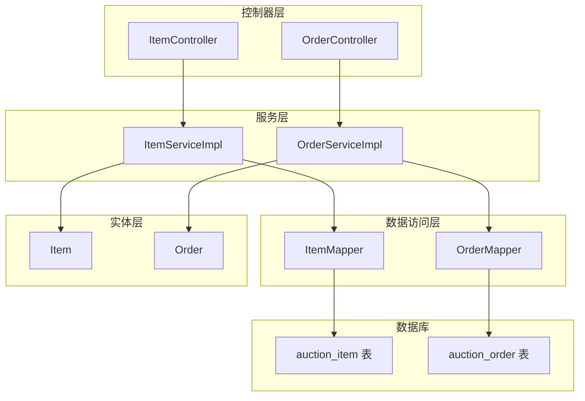
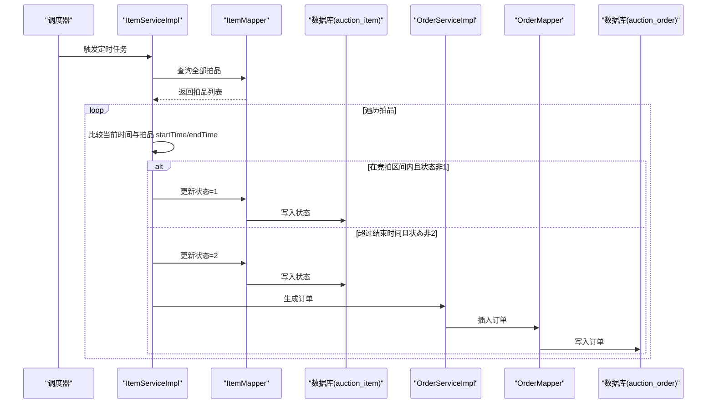
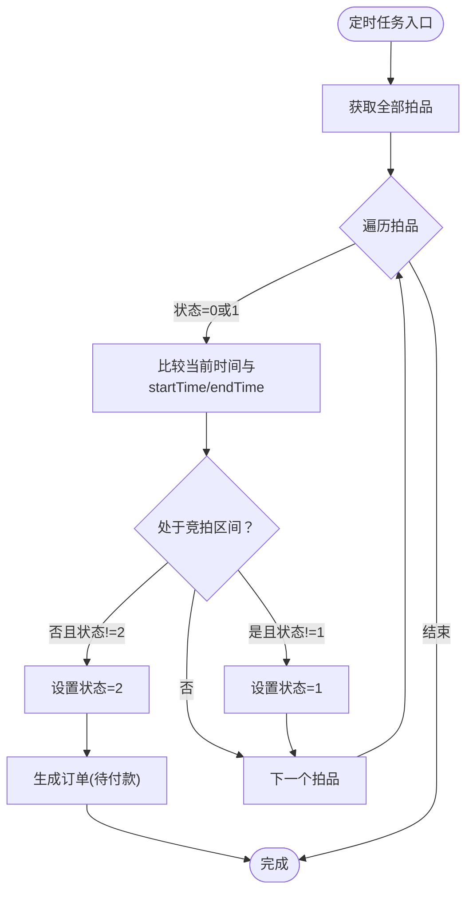
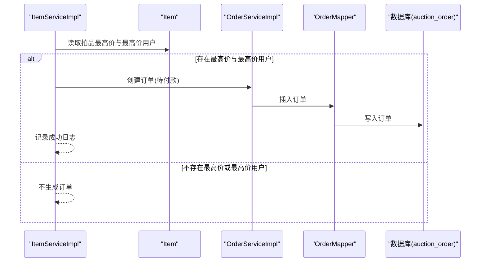
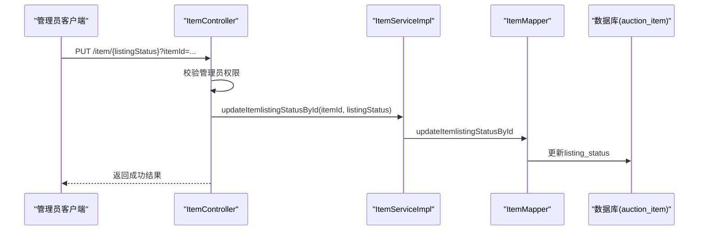
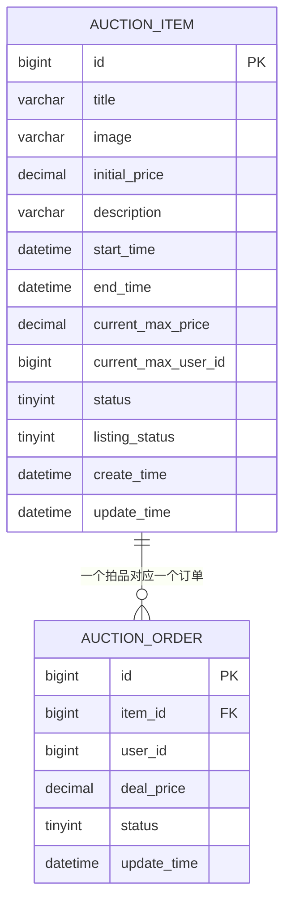
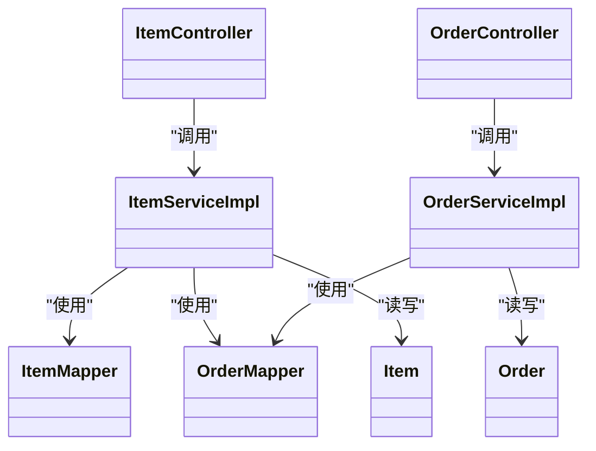
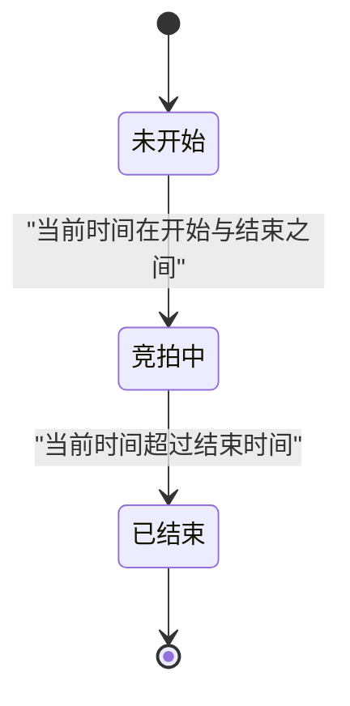

# 拍品状态机

<cite>
**本文引用的文件**
- [Item.java](file://src/main/java/com/qkl/auctionsystem/pojo/entity/Item.java)
- [ItemServiceImpl.java](file://src/main/java/com/qkl/auctionsystem/service/impl/ItemServiceImpl.java)
- [ItemMapper.java](file://src/main/java/com/qkl/auctionsystem/mapper/ItemMapper.java)
- [ItemMapper.xml](file://src/main/resources/mapper/ItemMapper.xml)
- [ItemController.java](file://src/main/java/com/qkl/auctionsystem/controller/ItemController.java)
- [Order.java](file://src/main/java/com/qkl/auctionsystem/pojo/entity/Order.java)
- [OrderServiceImpl.java](file://src/main/java/com/qkl/auctionsystem/service/impl/OrderServiceImpl.java)
- [OrderMapper.java](file://src/main/java/com/qkl/auctionsystem/mapper/OrderMapper.java)
- [OrderController.java](file://src/main/java/com/qkl/auctionsystem/controller/OrderController.java)
- [auction_database.sql](file://auction_database.sql)
</cite>

## 目录
1. [引言](#引言)
2. [项目结构](#项目结构)
3. [核心组件](#核心组件)
4. [架构总览](#架构总览)
5. [详细组件分析](#详细组件分析)
6. [依赖关系分析](#依赖关系分析)
7. [性能考虑](#性能考虑)
8. [故障排查指南](#故障排查指南)
9. [结论](#结论)
10. [附录](#附录)

## 引言
本文件围绕“拍品状态机”的设计与实现进行系统化阐述，重点说明拍品状态字段（status）的三种取值含义：0-未开始、1-竞拍中、2-已结束；以及上架状态（listingStatus）的控制逻辑。结合 ItemServiceImpl 中的定时任务 updateItemStatusScheduled，解释系统如何每分钟自动扫描并更新拍品状态；并给出状态转换规则：依据拍品 startTime 和 endTime 与当前时间的比较，自动从“未开始”转为“竞拍中”，再转为“已结束”。同时说明状态变更的业务影响，尤其是“已结束”状态下触发订单生成的流程。最后提供状态流转图示例，并说明管理员手动干预状态的接口设计。

## 项目结构
拍品状态机涉及的核心模块包括：
- 实体层：Item（拍品实体）
- 数据访问层：ItemMapper、OrderMapper
- 服务层：ItemServiceImpl、OrderServiceImpl
- 控制器层：ItemController、OrderController
- 数据库：auction_item、auction_order 表结构
- 定时任务：ItemServiceImpl 的 updateItemStatusScheduled

图表来源
- [ItemController.java](file://src/main/java/com/qkl/auctionsystem/controller/ItemController.java#L1-L86)
- [OrderController.java](file://src/main/java/com/qkl/auctionsystem/controller/OrderController.java#L1-L43)
- [ItemServiceImpl.java](file://src/main/java/com/qkl/auctionsystem/service/impl/ItemServiceImpl.java#L1-L182)
- [OrderServiceImpl.java](file://src/main/java/com/qkl/auctionsystem/service/impl/OrderServiceImpl.java#L1-L43)
- [ItemMapper.java](file://src/main/java/com/qkl/auctionsystem/mapper/ItemMapper.java#L1-L35)
- [OrderMapper.java](file://src/main/java/com/qkl/auctionsystem/mapper/OrderMapper.java#L1-L19)
- [Item.java](file://src/main/java/com/qkl/auctionsystem/pojo/entity/Item.java#L1-L34)
- [Order.java](file://src/main/java/com/qkl/auctionsystem/pojo/entity/Order.java#L1-L24)
- [ItemMapper.xml](file://src/main/resources/mapper/ItemMapper.xml#L1-L109)
- [auction_database.sql](file://auction_database.sql#L1-L78)

章节来源
- [ItemController.java](file://src/main/java/com/qkl/auctionsystem/controller/ItemController.java#L1-L86)
- [OrderController.java](file://src/main/java/com/qkl/auctionsystem/controller/OrderController.java#L1-L43)
- [ItemServiceImpl.java](file://src/main/java/com/qkl/auctionsystem/service/impl/ItemServiceImpl.java#L1-L182)
- [OrderServiceImpl.java](file://src/main/java/com/qkl/auctionsystem/service/impl/OrderServiceImpl.java#L1-L43)
- [ItemMapper.java](file://src/main/java/com/qkl/auctionsystem/mapper/ItemMapper.java#L1-L35)
- [OrderMapper.java](file://src/main/java/com/qkl/auctionsystem/mapper/OrderMapper.java#L1-L19)
- [Item.java](file://src/main/java/com/qkl/auctionsystem/pojo/entity/Item.java#L1-L34)
- [Order.java](file://src/main/java/com/qkl/auctionsystem/pojo/entity/Order.java#L1-L24)
- [ItemMapper.xml](file://src/main/resources/mapper/ItemMapper.xml#L1-L109)
- [auction_database.sql](file://auction_database.sql#L1-L78)

## 核心组件
- 拍品实体 Item：包含状态字段 status（0-未开始、1-竞拍中、2-已结束）与上架状态 listingStatus（0-下架、1-上架），以及 startTime、endTime 等时间字段。
- ItemServiceImpl：负责拍品状态的定时更新与结束后的订单生成。
- ItemMapper/ItemMapper.xml：提供拍品状态更新、最高价更新、上架状态更新等持久化操作。
- OrderServiceImpl/OrderMapper：负责订单创建与状态更新。
- ItemController：提供管理员端的拍品上架状态更新接口。

章节来源
- [Item.java](file://src/main/java/com/qkl/auctionsystem/pojo/entity/Item.java#L1-L34)
- [ItemServiceImpl.java](file://src/main/java/com/qkl/auctionsystem/service/impl/ItemServiceImpl.java#L1-L182)
- [ItemMapper.java](file://src/main/java/com/qkl/auctionsystem/mapper/ItemMapper.java#L1-L35)
- [ItemMapper.xml](file://src/main/resources/mapper/ItemMapper.xml#L1-L109)
- [OrderServiceImpl.java](file://src/main/java/com/qkl/auctionsystem/service/impl/OrderServiceImpl.java#L1-L43)
- [OrderMapper.java](file://src/main/java/com/qkl/auctionsystem/mapper/OrderMapper.java#L1-L19)
- [ItemController.java](file://src/main/java/com/qkl/auctionsystem/controller/ItemController.java#L1-L86)

## 架构总览
拍品状态机通过定时任务驱动状态流转，结合数据库层面的约束与服务层的业务逻辑，形成闭环的状态管理。管理员可通过接口对拍品的上架状态进行手动干预，从而影响拍品的可见性与可参与竞拍范围。

图表来源
- [ItemServiceImpl.java](file://src/main/java/com/qkl/auctionsystem/service/impl/ItemServiceImpl.java#L107-L182)
- [ItemMapper.java](file://src/main/java/com/qkl/auctionsystem/mapper/ItemMapper.java#L1-L35)
- [ItemMapper.xml](file://src/main/resources/mapper/ItemMapper.xml#L76-L109)
- [OrderServiceImpl.java](file://src/main/java/com/qkl/auctionsystem/service/impl/OrderServiceImpl.java#L1-L43)
- [OrderMapper.java](file://src/main/java/com/qkl/auctionsystem/mapper/OrderMapper.java#L1-L19)

## 详细组件分析

### 拍品状态字段与上架状态
- 状态字段 status
  - 0：未开始
  - 1：竞拍中
  - 2：已结束
- 上架状态 listingStatus
  - 0：下架
  - 1：上架
- 数据库层面，拍品表 auction_item 明确了上述字段的含义与默认值，并建立了索引以支持查询与排序。

章节来源
- [Item.java](file://src/main/java/com/qkl/auctionsystem/pojo/entity/Item.java#L1-L34)
- [auction_database.sql](file://auction_database.sql#L25-L45)

### 定时任务：updateItemStatusScheduled
- 执行周期：每分钟（cron 表达式为“0 * * * * ?”）
- 执行内容：
  - 获取全部拍品
  - 对每个拍品，仅处理状态为 0 或 1 的拍品
  - 若当前时间在 startTime 之后且在 endTime 之前，则将状态更新为 1（竞拍中）
  - 若当前时间超过 endTime，则将状态更新为 2（已结束），并调用订单生成逻辑
- 业务影响：
  - 状态变为 2（已结束）时，系统会为最高出价用户生成一条“待付款”的订单记录，订单状态为 0。

图表来源
- [ItemServiceImpl.java](file://src/main/java/com/qkl/auctionsystem/service/impl/ItemServiceImpl.java#L107-L182)
- [ItemMapper.xml](file://src/main/resources/mapper/ItemMapper.xml#L76-L109)

章节来源
- [ItemServiceImpl.java](file://src/main/java/com/qkl/auctionsystem/service/impl/ItemServiceImpl.java#L107-L182)

### 状态转换规则与边界条件
- 未开始（0）→ 竞拍中（1）：当前时间满足“after(startTime)”且“before(endTime)”
- 竞拍中（1）→ 已结束（2）：当前时间“after(endTime)”
- 边界条件：
  - 当前时间等于 startTime 或 endTime 时不触发状态变更
  - 若拍品状态已是目标状态则跳过更新，避免重复写入
- 上架状态（listingStatus）：
  - 仅当 listingStatus=0 时允许修改拍品基本信息
  - listingStatus=1 时禁止修改拍品信息，但允许删除（需进一步确认）

章节来源
- [ItemServiceImpl.java](file://src/main/java/com/qkl/auctionsystem/service/impl/ItemServiceImpl.java#L114-L147)
- [ItemServiceImpl.java](file://src/main/java/com/qkl/auctionsystem/service/impl/ItemServiceImpl.java#L67-L78)
- [ItemMapper.xml](file://src/main/resources/mapper/ItemMapper.xml#L41-L50)

### 订单生成逻辑（状态=2 时）
- 条件：存在最高出价用户（currentMaxUserId 非空）且最高价（currentMaxPrice）非空
- 动作：构建订单对象（item_id、user_id、deal_price、status=0、update_time），插入数据库
- 失败处理：捕获异常并记录错误日志，抛出运行时异常

图表来源
- [ItemServiceImpl.java](file://src/main/java/com/qkl/auctionsystem/service/impl/ItemServiceImpl.java#L149-L182)
- [OrderServiceImpl.java](file://src/main/java/com/qkl/auctionsystem/service/impl/OrderServiceImpl.java#L1-L43)
- [OrderMapper.java](file://src/main/java/com/qkl/auctionsystem/mapper/OrderMapper.java#L1-L19)

章节来源
- [ItemServiceImpl.java](file://src/main/java/com/qkl/auctionsystem/service/impl/ItemServiceImpl.java#L149-L182)
- [OrderServiceImpl.java](file://src/main/java/com/qkl/auctionsystem/service/impl/OrderServiceImpl.java#L1-L43)
- [OrderMapper.java](file://src/main/java/com/qkl/auctionsystem/mapper/OrderMapper.java#L1-L19)

### 管理员手动干预状态的接口设计
- 接口路径：PUT /item/{listingStatus}
- 参数：itemId（路径变量）、listingStatus（路径变量）
- 权限：仅管理员可调用
- 行为：根据传入的 listingStatus 更新拍品的上架状态（0-下架、1-上架）
- 注意：该接口不直接改变 status 字段，仅控制拍品是否对外展示与参与竞拍

图表来源
- [ItemController.java](file://src/main/java/com/qkl/auctionsystem/controller/ItemController.java#L79-L86)
- [ItemServiceImpl.java](file://src/main/java/com/qkl/auctionsystem/service/impl/ItemServiceImpl.java#L96-L98)
- [ItemMapper.xml](file://src/main/resources/mapper/ItemMapper.xml#L104-L109)

章节来源
- [ItemController.java](file://src/main/java/com/qkl/auctionsystem/controller/ItemController.java#L79-L86)
- [ItemServiceImpl.java](file://src/main/java/com/qkl/auctionsystem/service/impl/ItemServiceImpl.java#L96-L98)
- [ItemMapper.xml](file://src/main/resources/mapper/ItemMapper.xml#L104-L109)

### 数据模型与持久化映射
- Item 实体字段与数据库字段一一对应，包含状态、上架状态、时间戳等
- ItemMapper 提供：
  - 全量拍品查询（selectAllItems）
  - 状态更新（updateItemStatus）
  - 最高价更新（updateCurrentMaxPrice）
  - 上架状态更新（updateItemlistingStatusById）
- OrderMapper 提供订单插入、按用户查询、状态更新等

图表来源
- [Item.java](file://src/main/java/com/qkl/auctionsystem/pojo/entity/Item.java#L1-L34)
- [Order.java](file://src/main/java/com/qkl/auctionsystem/pojo/entity/Order.java#L1-L24)
- [auction_database.sql](file://auction_database.sql#L25-L72)

章节来源
- [Item.java](file://src/main/java/com/qkl/auctionsystem/pojo/entity/Item.java#L1-L34)
- [Order.java](file://src/main/java/com/qkl/auctionsystem/pojo/entity/Order.java#L1-L24)
- [ItemMapper.java](file://src/main/java/com/qkl/auctionsystem/mapper/ItemMapper.java#L1-L35)
- [ItemMapper.xml](file://src/main/resources/mapper/ItemMapper.xml#L1-L109)
- [OrderMapper.java](file://src/main/java/com/qkl/auctionsystem/mapper/OrderMapper.java#L1-L19)
- [auction_database.sql](file://auction_database.sql#L25-L72)

## 依赖关系分析
- 控制器依赖服务层，服务层依赖数据访问层，数据访问层依赖数据库
- ItemServiceImpl 依赖 ItemMapper 与 OrderMapper
- OrderServiceImpl 依赖 OrderMapper 与 ItemService（用于后续扩展）
- ItemController 仅暴露管理员端的 listingStatus 更新接口

图表来源
- [ItemController.java](file://src/main/java/com/qkl/auctionsystem/controller/ItemController.java#L1-L86)
- [ItemServiceImpl.java](file://src/main/java/com/qkl/auctionsystem/service/impl/ItemServiceImpl.java#L1-L182)
- [ItemMapper.java](file://src/main/java/com/qkl/auctionsystem/mapper/ItemMapper.java#L1-L35)
- [OrderController.java](file://src/main/java/com/qkl/auctionsystem/controller/OrderController.java#L1-L43)
- [OrderServiceImpl.java](file://src/main/java/com/qkl/auctionsystem/service/impl/OrderServiceImpl.java#L1-L43)
- [OrderMapper.java](file://src/main/java/com/qkl/auctionsystem/mapper/OrderMapper.java#L1-L19)
- [Item.java](file://src/main/java/com/qkl/auctionsystem/pojo/entity/Item.java#L1-L34)
- [Order.java](file://src/main/java/com/qkl/auctionsystem/pojo/entity/Order.java#L1-L24)

章节来源
- [ItemController.java](file://src/main/java/com/qkl/auctionsystem/controller/ItemController.java#L1-L86)
- [ItemServiceImpl.java](file://src/main/java/com/qkl/auctionsystem/service/impl/ItemServiceImpl.java#L1-L182)
- [ItemMapper.java](file://src/main/java/com/qkl/auctionsystem/mapper/ItemMapper.java#L1-L35)
- [OrderController.java](file://src/main/java/com/qkl/auctionsystem/controller/OrderController.java#L1-L43)
- [OrderServiceImpl.java](file://src/main/java/com/qkl/auctionsystem/service/impl/OrderServiceImpl.java#L1-L43)
- [OrderMapper.java](file://src/main/java/com/qkl/auctionsystem/mapper/OrderMapper.java#L1-L19)
- [Item.java](file://src/main/java/com/qkl/auctionsystem/pojo/entity/Item.java#L1-L34)
- [Order.java](file://src/main/java/com/qkl/auctionsystem/pojo/entity/Order.java#L1-L24)

## 性能考虑
- 定时任务扫描全量拍品：当拍品数量较大时，建议优化为分页扫描或基于状态/时间范围的增量扫描，减少一次性全量查询的压力。
- 数据库索引：auction_item 表已建立 status、listing_status、start_time、end_time 等索引，有助于查询与排序；可进一步评估复合索引策略。
- 并发与幂等：定时任务中对状态的判断（状态非目标值才更新）可避免重复写入；建议在高并发场景下增加行级锁或乐观锁策略，确保状态更新原子性。
- 订单生成：订单插入为单条写入，建议在高并发结束时刻做好异常重试与幂等控制，避免重复订单。

[本节为通用性能建议，不直接分析具体文件]

## 故障排查指南
- 定时任务未执行
  - 检查 Spring 定时任务开关与配置
  - 查看日志中“开始执行拍品状态更新定时任务”与“拍品状态更新定时任务执行完成”的输出
- 状态未按预期切换
  - 核对当前时间与 startTime/endTime 的边界条件（等于边界不切换）
  - 确认拍品状态已在数据库中被正确更新
- 订单未生成
  - 检查是否存在最高出价用户与最高价
  - 查看订单插入异常日志，定位数据库约束或唯一键冲突
- 上架状态无法修改
  - 确认 listingStatus 是否为 0（下架中），否则不允许修改拍品信息
  - 管理员权限校验是否通过

章节来源
- [ItemServiceImpl.java](file://src/main/java/com/qkl/auctionsystem/service/impl/ItemServiceImpl.java#L107-L182)
- [ItemMapper.xml](file://src/main/resources/mapper/ItemMapper.xml#L76-L109)
- [OrderServiceImpl.java](file://src/main/java/com/qkl/auctionsystem/service/impl/OrderServiceImpl.java#L1-L43)

## 结论
拍品状态机通过“未开始→竞拍中→已结束”的三态流转，配合定时任务与数据库约束，实现了自动化、可审计的状态管理。管理员可通过 listingStatus 接口对拍品可见性进行手动干预，不影响竞拍流程本身。状态变为“已结束”时自动触发订单生成，形成完整的业务闭环。建议在大规模场景下优化定时任务扫描策略与数据库索引，提升整体性能与稳定性。

[本节为总结性内容，不直接分析具体文件]

## 附录
- 状态流转图（概念示意）

[本图为概念示意，不对应具体源码文件]