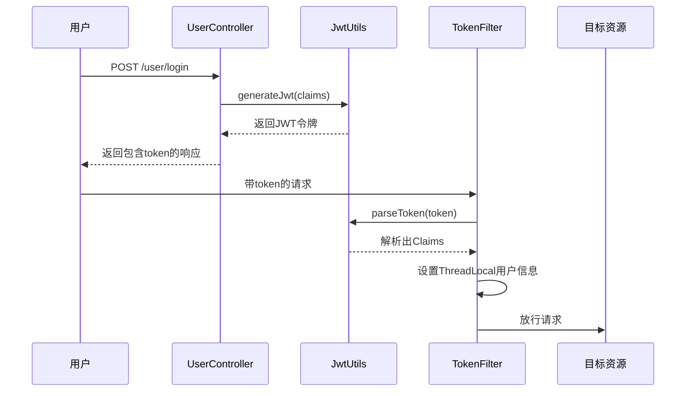
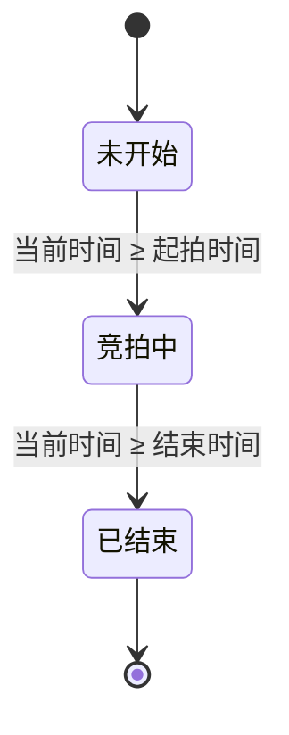
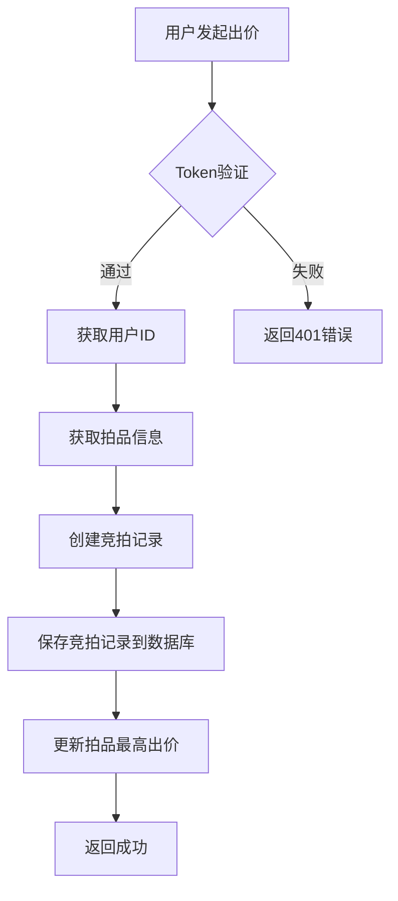
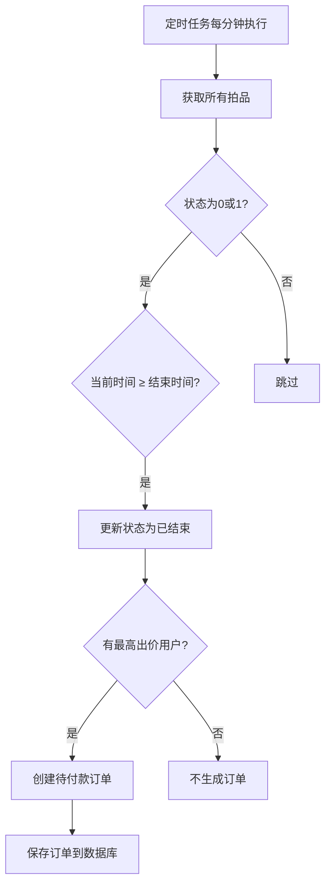
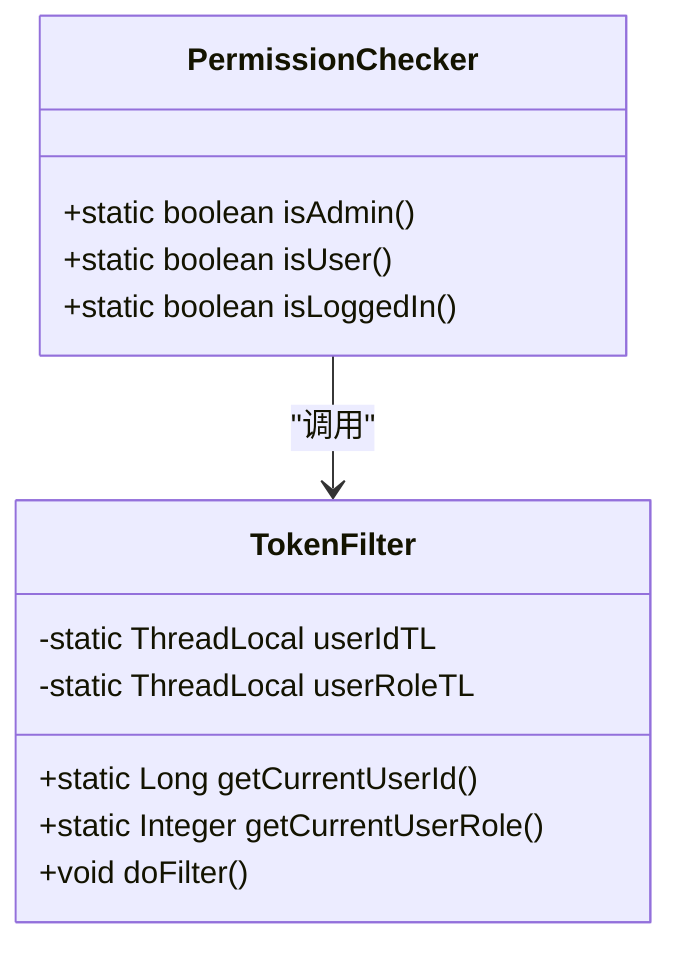

# 核心功能设计

<cite>
**本文档中引用的文件**   
- [JwtUtils.java](file://src/main/java/com/qkl/auctionsystem/utils/JwtUtils.java)
- [PermissionChecker.java](file://src/main/java/com/qkl/auctionsystem/utils/PermissionChecker.java)
- [TokenFilter.java](file://src/main/java/com/qkl/auctionsystem/filter/TokenFilter.java)
- [BidServiceImpl.java](file://src/main/java/com/qkl/auctionsystem/service/impl/BidServiceImpl.java)
- [ItemServiceImpl.java](file://src/main/java/com/qkl/auctionsystem/service/impl/ItemServiceImpl.java)
- [BidController.java](file://src/main/java/com/qkl/auctionsystem/controller/BidController.java)
- [ItemController.java](file://src/main/java/com/qkl/auctionsystem/controller/ItemController.java)
- [BidRecordMapper.java](file://src/main/java/com/qkl/auctionsystem/mapper/BidRecordMapper.java)
- [ItemMapper.java](file://src/main/java/com/qkl/auctionsystem/mapper/ItemMapper.java)
- [Item.java](file://src/main/java/com/qkl/auctionsystem/pojo/entity/Item.java)
- [BidDTO.java](file://src/main/java/com/qkl/auctionsystem/pojo/dto/BidDTO.java)
- [说明.md](file://说明.md)
</cite>

## 目录
1. [用户认证流程](#用户认证流程)
2. [拍品状态机机制](#拍品状态机机制)
3. [竞拍逻辑实现](#竞拍逻辑实现)
4. [订单生成策略](#订单生成策略)
5. [权限控制系统](#权限控制系统)

## 用户认证流程

本系统采用基于JWT（JSON Web Token）的无状态认证机制，实现用户和管理员的登录与身份验证。认证流程包括Token生成与校验两个核心环节。

**图示来源**
- [UserController.java](file://src/main/java/com/qkl/auctionsystem/controller/UserController.java#L30-L49)
- [JwtUtils.java](file://src/main/java/com/qkl/auctionsystem/utils/JwtUtils.java#L18-L35)
- [TokenFilter.java](file://src/main/java/com/qkl/auctionsystem/filter/TokenFilter.java#L55-L126)

**用户认证流程**
- [UserController.java](file://src/main/java/com/qkl/auctionsystem/controller/UserController.java#L30-L49)
- [JwtUtils.java](file://src/main/java/com/qkl/auctionsystem/utils/JwtUtils.java#L18-L35)
- [TokenFilter.java](file://src/main/java/com/qkl/auctionsystem/filter/TokenFilter.java#L55-L126)

## 拍品状态机机制

系统通过定时任务实现拍品状态的自动转换，状态机包含三种状态：未开始（0）、竞拍中（1）和已结束（2）。状态转换由时间驱动，确保业务逻辑的自动化执行。

**图示来源**
- [ItemServiceImpl.java](file://src/main/java/com/qkl/auctionsystem/service/impl/ItemServiceImpl.java#L114-L147)
- [说明.md](file://说明.md#L104-L108)

**拍品状态机机制**
- [ItemServiceImpl.java](file://src/main/java/com/qkl/auctionsystem/service/impl/ItemServiceImpl.java#L114-L147)
- [说明.md](file://说明.md#L104-L108)

## 竞拍逻辑实现

竞拍逻辑是系统的核心业务功能，包括出价校验、最高价更新和竞拍记录保存三个关键步骤。当用户发起出价请求时，系统会执行完整的业务处理流程。

**图示来源**
- [BidController.java](file://src/main/java/com/qkl/auctionsystem/controller/BidController.java#L29-L34)
- [BidServiceImpl.java](file://src/main/java/com/qkl/auctionsystem/service/impl/BidServiceImpl.java#L30-L53)
- [BidRecordMapper.java](file://src/main/java/com/qkl/auctionsystem/mapper/BidRecordMapper.java#L14-L15)

**竞拍逻辑实现**
- [BidController.java](file://src/main/java/com/qkl/auctionsystem/controller/BidController.java#L29-L34)
- [BidServiceImpl.java](file://src/main/java/com/qkl/auctionsystem/service/impl/BidServiceImpl.java#L30-L53)
- [BidRecordMapper.java](file://src/main/java/com/qkl/auctionsystem/mapper/BidRecordMapper.java#L14-L15)

## 订单生成策略

订单生成采用定时任务触发机制，确保在拍品结束后自动创建订单。系统通过去重控制保证每件拍品只生成一次订单，避免重复处理。

**图示来源**
- [ItemServiceImpl.java](file://src/main/java/com/qkl/auctionsystem/service/impl/ItemServiceImpl.java#L114-L182)
- [说明.md](file://说明.md#L108-L109)

**订单生成策略**
- [ItemServiceImpl.java](file://src/main/java/com/qkl/auctionsystem/service/impl/ItemServiceImpl.java#L114-L182)
- [说明.md](file://说明.md#L108-L109)

## 权限控制系统

系统通过`PermissionChecker`工具类和`TokenFilter`过滤器实现细粒度的权限控制。所有需要登录的接口都会经过统一的权限校验，确保操作的安全性。

**图示来源**
- [PermissionChecker.java](file://src/main/java/com/qkl/auctionsystem/utils/PermissionChecker.java#L15-L36)
- [TokenFilter.java](file://src/main/java/com/qkl/auctionsystem/filter/TokenFilter.java#L18-L141)

**权限控制系统**
- [PermissionChecker.java](file://src/main/java/com/qkl/auctionsystem/utils/PermissionChecker.java#L15-L36)
- [TokenFilter.java](file://src/main/java/com/qkl/auctionsystem/filter/TokenFilter.java#L18-L141)