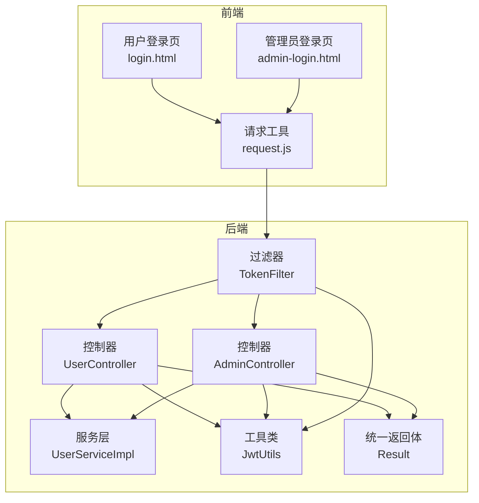
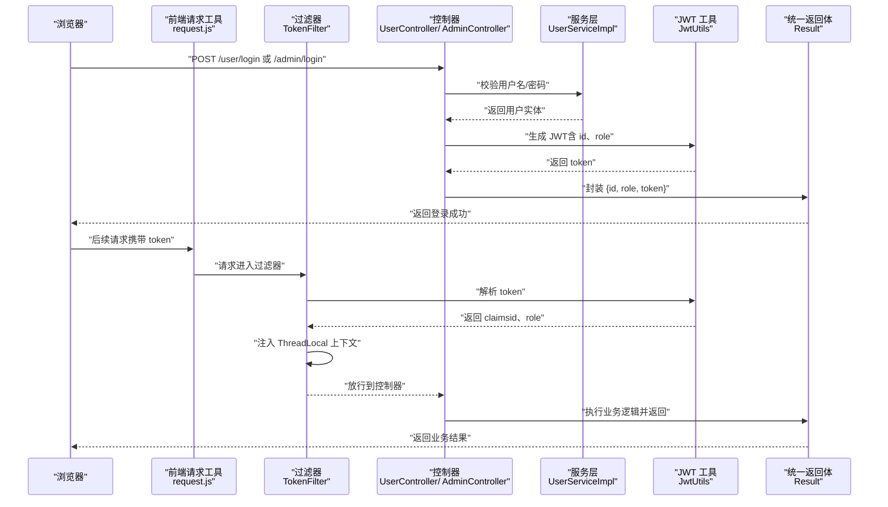
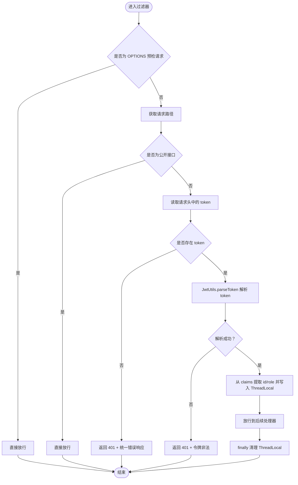
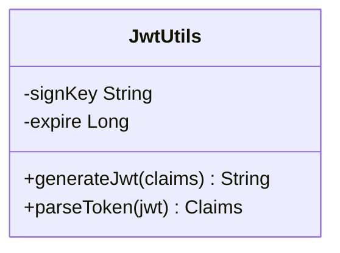
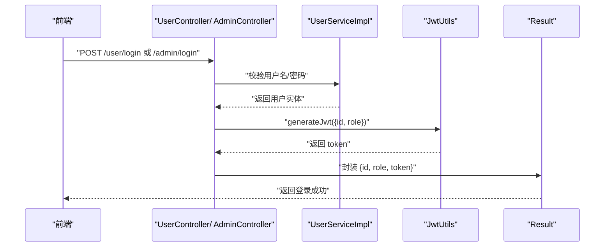
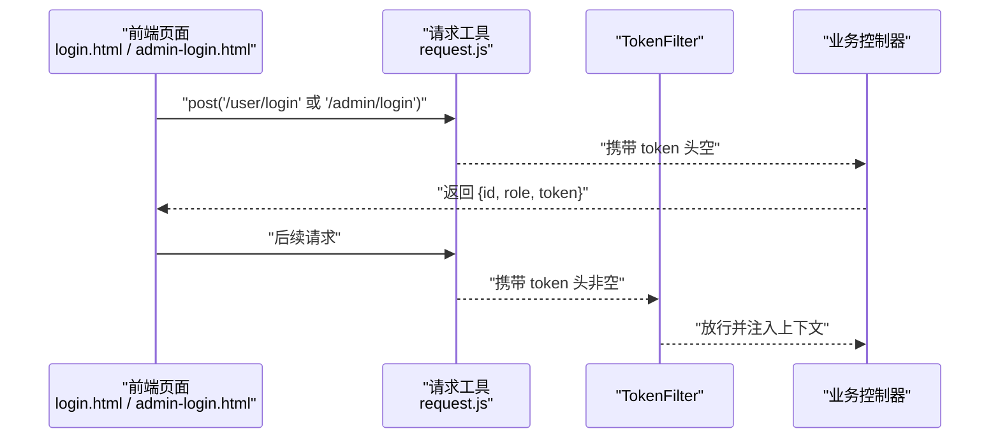
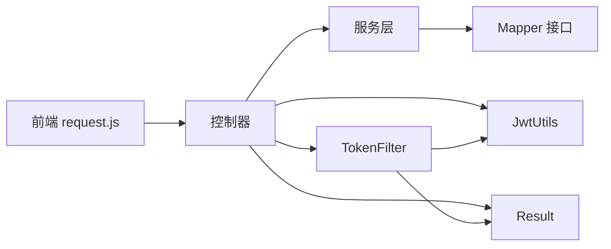

# 用户认证机制

<cite>
**本文引用的文件**
- [TokenFilter.java](file://src/main/java/com/qkl/auctionsystem/filter/TokenFilter.java)
- [JwtUtils.java](file://src/main/java/com/qkl/auctionsystem/utils/JwtUtils.java)
- [UserController.java](file://src/main/java/com/qkl/auctionsystem/controller/UserController.java)
- [AdminController.java](file://src/main/java/com/qkl/auctionsystem/controller/AdminController.java)
- [UserService.java](file://src/main/java/com/qkl/auctionsystem/service/UserService.java)
- [UserServiceImpl.java](file://src/main/java/com/qkl/auctionsystem/service/impl/UserServiceImpl.java)
- [PermissionChecker.java](file://src/main/java/com/qkl/auctionsystem/utils/PermissionChecker.java)
- [Result.java](file://src/main/java/com/qkl/auctionsystem/result/Result.java)
- [request.js](file://html/utils/request.js)
- [login.html](file://html/login.html)
- [admin-login.html](file://html/admin-login.html)
- [application.properties](file://src/main/resources/application.properties)
</cite>

## 目录
1. [简介](#简介)
2. [项目结构](#项目结构)
3. [核心组件](#核心组件)
4. [架构总览](#架构总览)
5. [详细组件分析](#详细组件分析)
6. [依赖关系分析](#依赖关系分析)
7. [性能考量](#性能考量)
8. [故障排查指南](#故障排查指南)
9. [结论](#结论)
10. [附录](#附录)

## 简介
本文件深入解析基于 JWT 的用户认证实现机制，围绕以下主题展开：
- TokenFilter 如何拦截请求并校验 JWT 令牌的有效性
- JwtUtils 如何生成和解析 Token
- 用户登录成功后 Token 的返回流程
- 结合代码说明 Token 的加密方式、过期时间配置、用户身份信息（如 userId）的嵌入与提取过程
- TokenFilter 如何通过 Servlet 过滤器实现全局认证，以及如何防止未登录用户访问受保护资源
- 实际请求示例，展示 Authorization 头的使用方式
- 常见认证失败场景（如 Token 过期、格式错误）的处理策略

## 项目结构
后端采用 Spring Boot + MyBatis，前端使用原生 JavaScript + Bootstrap，认证流程贯穿前后端：
- 前端通过封装的请求工具统一在请求头中携带 token
- 后端通过 Servlet 过滤器进行全局拦截与校验
- 登录成功后，服务端生成 JWT 并返回给前端
- 后续请求由前端自动附加 token，后端解析并注入当前用户上下文

图表来源
- [TokenFilter.java](file://src/main/java/com/qkl/auctionsystem/filter/TokenFilter.java#L1-L141)
- [JwtUtils.java](file://src/main/java/com/qkl/auctionsystem/utils/JwtUtils.java#L1-L36)
- [UserController.java](file://src/main/java/com/qkl/auctionsystem/controller/UserController.java#L1-L49)
- [AdminController.java](file://src/main/java/com/qkl/auctionsystem/controller/AdminController.java#L1-L73)
- [UserServiceImpl.java](file://src/main/java/com/qkl/auctionsystem/service/impl/UserServiceImpl.java#L1-L59)
- [Result.java](file://src/main/java/com/qkl/auctionsystem/result/Result.java#L1-L39)
- [request.js](file://html/utils/request.js#L1-L131)
- [login.html](file://html/login.html#L1-L99)
- [admin-login.html](file://html/admin-login.html#L1-L84)

章节来源
- [application.properties](file://src/main/resources/application.properties#L1-L20)

## 核心组件
- TokenFilter：全局请求拦截器，负责识别公开接口、校验 token、解析用户身份并注入线程上下文
- JwtUtils：JWT 生成与解析工具，包含签名密钥与过期时间配置
- UserController/ AdminController：登录接口，生成 token 并返回统一响应体
- UserServiceImpl：登录业务逻辑，校验用户凭据
- PermissionChecker：基于 TokenFilter 注入的上下文进行权限判断
- Result：统一响应体封装
- request.js：前端请求封装，统一在请求头中携带 token

章节来源
- [TokenFilter.java](file://src/main/java/com/qkl/auctionsystem/filter/TokenFilter.java#L1-L141)
- [JwtUtils.java](file://src/main/java/com/qkl/auctionsystem/utils/JwtUtils.java#L1-L36)
- [UserController.java](file://src/main/java/com/qkl/auctionsystem/controller/UserController.java#L1-L49)
- [AdminController.java](file://src/main/java/com/qkl/auctionsystem/controller/AdminController.java#L1-L73)
- [UserServiceImpl.java](file://src/main/java/com/qkl/auctionsystem/service/impl/UserServiceImpl.java#L1-L59)
- [PermissionChecker.java](file://src/main/java/com/qkl/auctionsystem/utils/PermissionChecker.java#L1-L36)
- [Result.java](file://src/main/java/com/qkl/auctionsystem/result/Result.java#L1-L39)
- [request.js](file://html/utils/request.js#L1-L131)

## 架构总览
下图展示了从浏览器到后端的认证调用链路，包括登录、请求携带 token、过滤器校验与权限检查。

图表来源
- [request.js](file://html/utils/request.js#L1-L131)
- [TokenFilter.java](file://src/main/java/com/qkl/auctionsystem/filter/TokenFilter.java#L1-L141)
- [UserController.java](file://src/main/java/com/qkl/auctionsystem/controller/UserController.java#L1-L49)
- [AdminController.java](file://src/main/java/com/qkl/auctionsystem/controller/AdminController.java#L1-L73)
- [UserServiceImpl.java](file://src/main/java/com/qkl/auctionsystem/service/impl/UserServiceImpl.java#L1-L59)
- [JwtUtils.java](file://src/main/java/com/qkl/auctionsystem/utils/JwtUtils.java#L1-L36)
- [Result.java](file://src/main/java/com/qkl/auctionsystem/result/Result.java#L1-L39)

## 详细组件分析

### TokenFilter：全局认证拦截器
- 拦截范围：通过注解声明拦截所有请求路径
- 预检请求放行：对 OPTIONS 预检请求直接放行
- 公开接口白名单：注册、登录、商品列表、商品详情、出价记录等无需 token
- 认证流程：
  - 从请求头读取 token
  - 若缺失则返回 401 与统一错误响应
  - 使用 JwtUtils 解析 token，解析失败同样返回 401
  - 成功解析后，从 claims 中提取 id 与 role，存入 ThreadLocal
  - 放行请求并在 finally 中清理 ThreadLocal，避免内存泄漏
- 与权限检查配合：PermissionChecker 通过 ThreadLocal 获取当前用户角色进行权限判断

图表来源
- [TokenFilter.java](file://src/main/java/com/qkl/auctionsystem/filter/TokenFilter.java#L1-L141)
- [JwtUtils.java](file://src/main/java/com/qkl/auctionsystem/utils/JwtUtils.java#L1-L36)
- [Result.java](file://src/main/java/com/qkl/auctionsystem/result/Result.java#L1-L39)

章节来源
- [TokenFilter.java](file://src/main/java/com/qkl/auctionsystem/filter/TokenFilter.java#L1-L141)
- [PermissionChecker.java](file://src/main/java/com/qkl/auctionsystem/utils/PermissionChecker.java#L1-L36)

### JwtUtils：JWT 生成与解析
- 加密算法：HS256 对称签名
- 签名密钥：固定常量（建议生产环境从配置中心加载）
- 过期时间：毫秒级配置，当前值约 12 小时
- 生成 Claims：包含用户 id 与 role
- 解析 Claims：基于签名密钥验证并返回负载

图表来源
- [JwtUtils.java](file://src/main/java/com/qkl/auctionsystem/utils/JwtUtils.java#L1-L36)

章节来源
- [JwtUtils.java](file://src/main/java/com/qkl/auctionsystem/utils/JwtUtils.java#L1-L36)

### 登录流程与 Token 返回
- 用户登录：
  - 控制器接收用户名/密码
  - 服务层校验用户凭据，返回用户实体
  - 控制器构造 claims（id、role），调用 JwtUtils 生成 token
  - 返回统一响应体，包含 id、role、token
- 管理员登录：
  - 控制器设置角色为管理员（0），其余流程同上

图表来源
- [UserController.java](file://src/main/java/com/qkl/auctionsystem/controller/UserController.java#L1-L49)
- [AdminController.java](file://src/main/java/com/qkl/auctionsystem/controller/AdminController.java#L1-L73)
- [UserServiceImpl.java](file://src/main/java/com/qkl/auctionsystem/service/impl/UserServiceImpl.java#L1-L59)
- [JwtUtils.java](file://src/main/java/com/qkl/auctionsystem/utils/JwtUtils.java#L1-L36)
- [Result.java](file://src/main/java/com/qkl/auctionsystem/result/Result.java#L1-L39)

章节来源
- [UserController.java](file://src/main/java/com/qkl/auctionsystem/controller/UserController.java#L1-L49)
- [AdminController.java](file://src/main/java/com/qkl/auctionsystem/controller/AdminController.java#L1-L73)
- [UserServiceImpl.java](file://src/main/java/com/qkl/auctionsystem/service/impl/UserServiceImpl.java#L1-L59)

### 前端请求与 Authorization 头
- 前端请求工具在所有请求头中统一添加 token 字段
- 登录成功后，前端将服务端返回的 token 写入本地存储
- 后续请求自动携带 token，后端通过过滤器解析并注入上下文

图表来源
- [login.html](file://html/login.html#L1-L99)
- [admin-login.html](file://html/admin-login.html#L1-L84)
- [request.js](file://html/utils/request.js#L1-L131)
- [TokenFilter.java](file://src/main/java/com/qkl/auctionsystem/filter/TokenFilter.java#L1-L141)

章节来源
- [request.js](file://html/utils/request.js#L1-L131)
- [login.html](file://html/login.html#L1-L99)
- [admin-login.html](file://html/admin-login.html#L1-L84)

### 权限检查与上下文注入
- ThreadLocal 注入：过滤器解析 token 后，将 id 与 role 写入当前线程上下文
- 权限工具：PermissionChecker 通过 ThreadLocal 获取当前用户角色，判断是否为管理员、普通用户或已登录
- 清理策略：过滤器 finally 中移除 ThreadLocal，避免线程复用导致的数据残留

章节来源
- [TokenFilter.java](file://src/main/java/com/qkl/auctionsystem/filter/TokenFilter.java#L1-L141)
- [PermissionChecker.java](file://src/main/java/com/qkl/auctionsystem/utils/PermissionChecker.java#L1-L36)

## 依赖关系分析
- 控制器依赖服务层与 JwtUtils；服务层依赖 Mapper 完成数据库操作
- 过滤器依赖 JwtUtils 与统一返回体 Result
- 前端请求工具依赖浏览器 fetch API 与本地存储

图表来源
- [request.js](file://html/utils/request.js#L1-L131)
- [UserController.java](file://src/main/java/com/qkl/auctionsystem/controller/UserController.java#L1-L49)
- [AdminController.java](file://src/main/java/com/qkl/auctionsystem/controller/AdminController.java#L1-L73)
- [UserServiceImpl.java](file://src/main/java/com/qkl/auctionsystem/service/impl/UserServiceImpl.java#L1-L59)
- [JwtUtils.java](file://src/main/java/com/qkl/auctionsystem/utils/JwtUtils.java#L1-L36)
- [Result.java](file://src/main/java/com/qkl/auctionsystem/result/Result.java#L1-L39)
- [TokenFilter.java](file://src/main/java/com/qkl/auctionsystem/filter/TokenFilter.java#L1-L141)

章节来源
- [UserService.java](file://src/main/java/com/qkl/auctionsystem/service/UserService.java)
- [UserServiceImpl.java](file://src/main/java/com/qkl/auctionsystem/service/impl/UserServiceImpl.java#L1-L59)

## 性能考量
- 过滤器解析成本：每次请求都会解析一次 token，建议在高并发场景下：
  - 使用更高效的签名算法与更短的过期时间以降低重算负担
  - 将签名密钥与过期时间迁移到配置中心，便于动态调整
  - 对热点接口可考虑缓存部分解析结果（需谨慎处理并发与安全）
- 线程上下文：ThreadLocal 在请求结束后及时清理，避免线程池复用导致的内存泄漏
- 响应体序列化：过滤器内部使用 Jackson 序列化统一响应体，注意异常分支的兜底输出

[本节为通用性能建议，不涉及具体文件分析]

## 故障排查指南
- 未携带 token
  - 现象：后端返回 401 且消息提示未授权
  - 排查：确认前端请求头是否正确携带 token；检查登录成功后是否正确写入本地存储
- token 缺失或为空
  - 现象：过滤器判定无 token，直接返回 401
  - 排查：确认登录接口返回的 token 是否存在且非空
- token 非法或签名不匹配
  - 现象：解析异常，返回 401 且消息提示令牌非法
  - 排查：检查签名密钥是否一致、是否被篡改、是否使用了正确的算法
- token 过期
  - 现象：解析抛出过期异常，返回 401
  - 排查：检查过期时间配置；前端应在过期前刷新或重新登录
- CORS 预检失败
  - 现象：OPTIONS 请求被拦截但未放行
  - 排查：确认过滤器对 OPTIONS 的放行逻辑是否生效
- 角色/权限判断失败
  - 现象：权限工具判断为非管理员或非普通用户
  - 排查：确认 claims 中 role 是否正确写入；确认过滤器是否成功注入上下文

章节来源
- [TokenFilter.java](file://src/main/java/com/qkl/auctionsystem/filter/TokenFilter.java#L1-L141)
- [JwtUtils.java](file://src/main/java/com/qkl/auctionsystem/utils/JwtUtils.java#L1-L36)
- [request.js](file://html/utils/request.js#L1-L131)

## 结论
本项目通过 Servlet 过滤器实现了全局认证，结合 JWT 完成了用户身份的无状态校验。TokenFilter 负责拦截与校验，JwtUtils 负责生成与解析，控制器在登录成功后返回 token，前端统一在请求头中携带 token。通过 ThreadLocal 注入当前用户上下文，配合权限工具实现灵活的角色控制。整体设计简洁清晰，具备良好的扩展性与可维护性。

[本节为总结性内容，不涉及具体文件分析]

## 附录

### 关键配置与常量
- 签名密钥：固定常量（建议迁移至配置中心）
- 过期时间：毫秒级配置，当前约为 12 小时
- 请求头字段：token（非标准 Authorization 头，而是自定义头）

章节来源
- [JwtUtils.java](file://src/main/java/com/qkl/auctionsystem/utils/JwtUtils.java#L1-L36)
- [TokenFilter.java](file://src/main/java/com/qkl/auctionsystem/filter/TokenFilter.java#L1-L141)
- [request.js](file://html/utils/request.js#L1-L131)

### 实际请求示例
- 登录请求（用户）
  - 方法：POST
  - 路径：/auction/user/login
  - 请求体：包含用户名与密码
  - 响应体：包含 id、role、token
- 登录请求（管理员）
  - 方法：POST
  - 路径：/auction/admin/login
  - 请求体：包含用户名、密码与角色
  - 响应体：包含 id、role、token
- 后续请求
  - 方法：GET/POST/PUT/DELETE
  - 路径：受保护接口
  - 请求头：token（来自登录响应的 token）
  - 响应体：业务结果或统一错误响应

章节来源
- [login.html](file://html/login.html#L1-L99)
- [admin-login.html](file://html/admin-login.html#L1-L84)
- [request.js](file://html/utils/request.js#L1-L131)
- [application.properties](file://src/main/resources/application.properties#L1-L20)