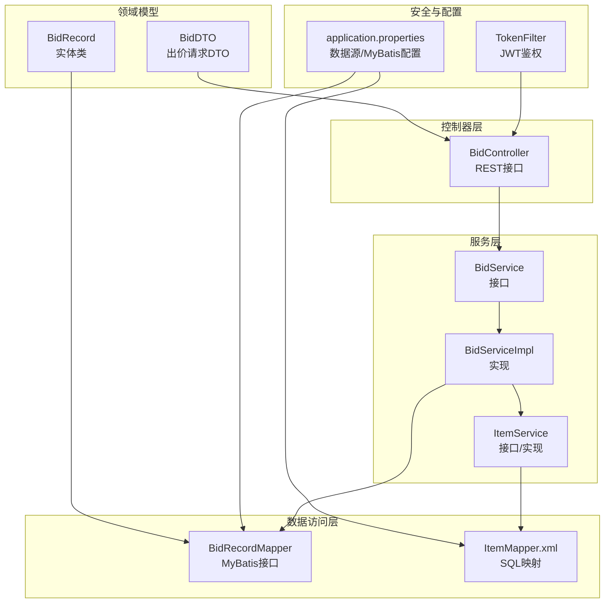
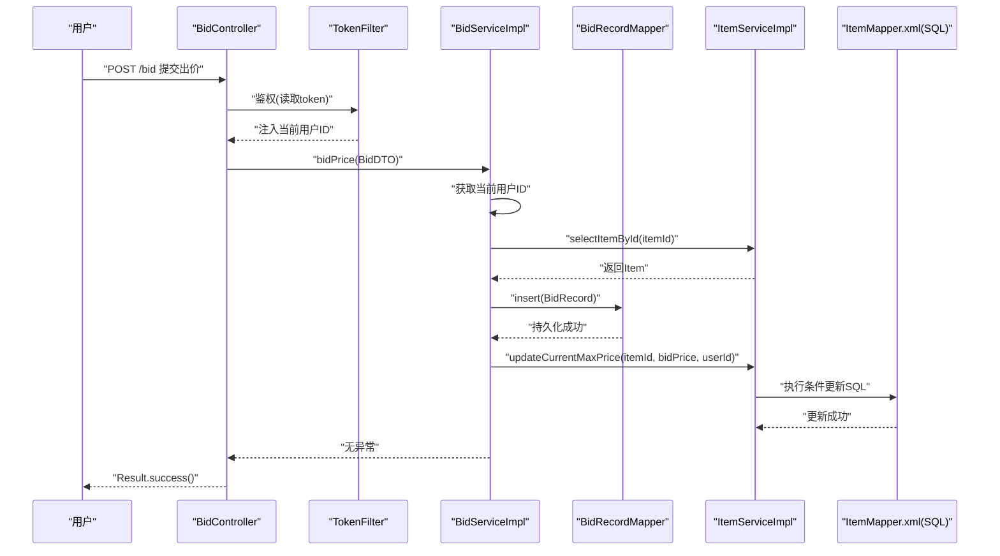
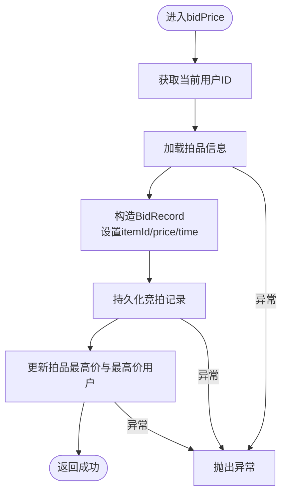
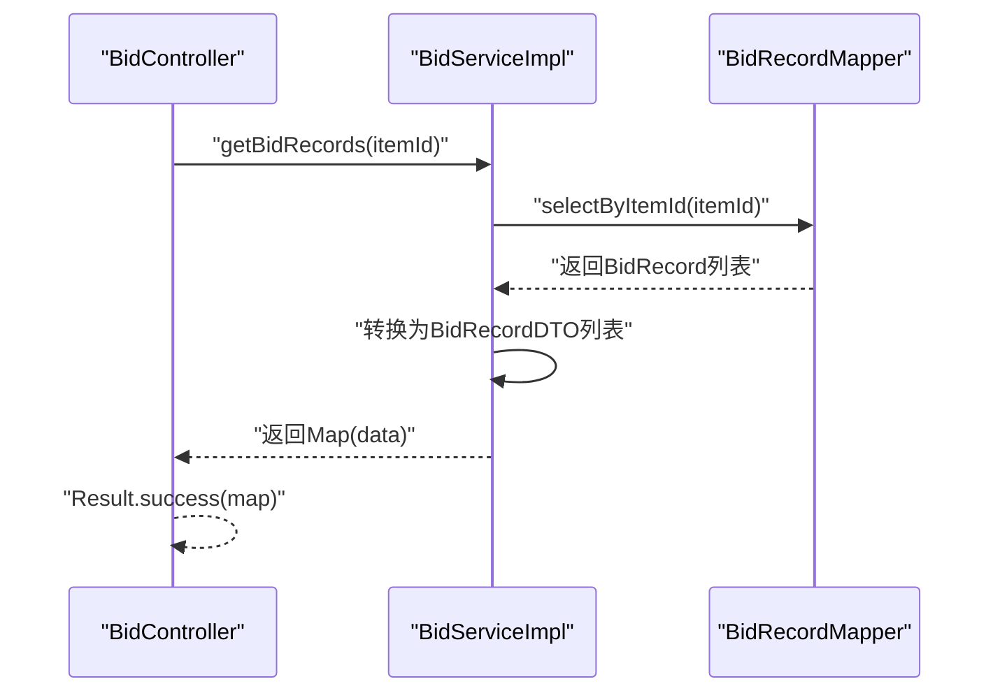
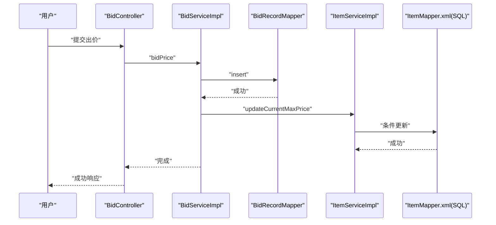
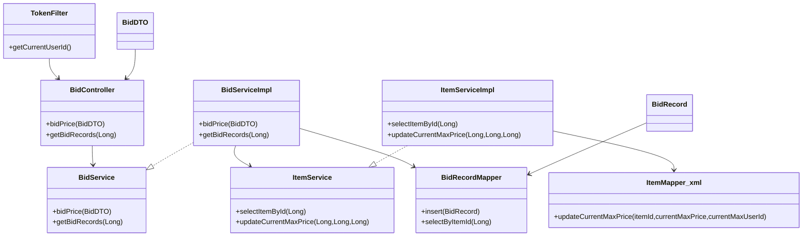

# 竞拍出价逻辑

<cite>
**本文引用的文件**
- [BidServiceImpl.java](file://src/main/java/com/qkl/auctionsystem/service/impl/BidServiceImpl.java)
- [ItemServiceImpl.java](file://src/main/java/com/qkl/auctionsystem/service/impl/ItemServiceImpl.java)
- [BidRecordMapper.java](file://src/main/java/com/qkl/auctionsystem/mapper/BidRecordMapper.java)
- [BidController.java](file://src/main/java/com/qkl/auctionsystem/controller/BidController.java)
- [TokenFilter.java](file://src/main/java/com/qkl/auctionsystem/filter/TokenFilter.java)
- [application.properties](file://src/main/resources/application.properties)
- [ItemMapper.xml](file://src/main/resources/mapper/ItemMapper.xml)
- [BidDTO.java](file://src/main/java/com/qkl/auctionsystem/pojo/dto/BidDTO.java)
- [BidRecord.java](file://src/main/java/com/qkl/auctionsystem/pojo/entity/BidRecord.java)
</cite>

## 目录
1. [引言](#引言)
2. [项目结构](#项目结构)
3. [核心组件](#核心组件)
4. [架构总览](#架构总览)
5. [详细组件分析](#详细组件分析)
6. [依赖关系分析](#依赖关系分析)
7. [性能与一致性考量](#性能与一致性考量)
8. [故障排查指南](#故障排查指南)
9. [结论](#结论)

## 引言
本文件围绕竞拍系统“出价”这一核心业务流程进行深入解析，重点阐述用户提交出价请求后，BidServiceImpl如何通过bidPrice方法完成以下关键步骤：
- 获取当前用户ID（基于JWT令牌解析）
- 校验拍品存在性
- 构造并持久化竞拍记录
- 成功后调用ItemService.updateCurrentMaxPrice更新拍品最高价与最高价用户
- 统一异常处理与回滚策略说明
同时，文档还覆盖历史出价查询接口getBidRecords的实现细节、时间戳与价格精度处理方式，并给出典型出价场景的时序图与常见问题排查建议。

## 项目结构
竞拍系统采用分层架构：控制器层负责HTTP请求入口与响应封装；服务层承载业务逻辑；数据访问层通过MyBatis映射数据库表；过滤器层负责鉴权与用户上下文注入；配置文件集中管理数据源与MyBatis参数。

图表来源
- [BidController.java](file://src/main/java/com/qkl/auctionsystem/controller/BidController.java#L1-L47)
- [BidServiceImpl.java](file://src/main/java/com/qkl/auctionsystem/service/impl/BidServiceImpl.java#L1-L75)
- [ItemServiceImpl.java](file://src/main/java/com/qkl/auctionsystem/service/impl/ItemServiceImpl.java#L1-L182)
- [BidRecordMapper.java](file://src/main/java/com/qkl/auctionsystem/mapper/BidRecordMapper.java#L1-L19)
- [ItemMapper.xml](file://src/main/resources/mapper/ItemMapper.xml#L1-L109)
- [TokenFilter.java](file://src/main/java/com/qkl/auctionsystem/filter/TokenFilter.java#L1-L141)
- [application.properties](file://src/main/resources/application.properties#L1-L20)
- [BidDTO.java](file://src/main/java/com/qkl/auctionsystem/pojo/dto/BidDTO.java#L1-L10)
- [BidRecord.java](file://src/main/java/com/qkl/auctionsystem/pojo/entity/BidRecord.java#L1-L19)

章节来源
- [application.properties](file://src/main/resources/application.properties#L1-L20)

## 核心组件
- 控制器：BidController提供POST /bid提交出价与GET /bid/records/{itemId}查询历史记录两个端点。
- 服务：BidServiceImpl实现bidPrice与getBidRecords；ItemServiceImpl实现拍品查询与最高价更新。
- 数据访问：BidRecordMapper定义插入与按拍品ID查询；ItemMapper.xml提供updateCurrentMaxPrice的条件更新SQL。
- 安全：TokenFilter基于JWT解析用户身份，将用户ID注入到当前线程本地存储，供业务读取。
- 领域模型：BidDTO承载出价请求参数；BidRecord实体包含BigDecimal价格与LocalDateTime时间戳。

章节来源
- [BidController.java](file://src/main/java/com/qkl/auctionsystem/controller/BidController.java#L1-L47)
- [BidServiceImpl.java](file://src/main/java/com/qkl/auctionsystem/service/impl/BidServiceImpl.java#L1-L75)
- [ItemServiceImpl.java](file://src/main/java/com/qkl/auctionsystem/service/impl/ItemServiceImpl.java#L1-L182)
- [BidRecordMapper.java](file://src/main/java/com/qkl/auctionsystem/mapper/BidRecordMapper.java#L1-L19)
- [ItemMapper.xml](file://src/main/resources/mapper/ItemMapper.xml#L1-L109)
- [TokenFilter.java](file://src/main/java/com/qkl/auctionsystem/filter/TokenFilter.java#L1-L141)
- [BidDTO.java](file://src/main/java/com/qkl/auctionsystem/pojo/dto/BidDTO.java#L1-L10)
- [BidRecord.java](file://src/main/java/com/qkl/auctionsystem/pojo/entity/BidRecord.java#L1-L19)

## 架构总览
下图展示一次完整出价请求的端到端流程：前端发起出价请求，经TokenFilter鉴权后进入BidController，再由BidServiceImpl协调ItemService与BidRecordMapper完成持久化与最高价更新。

图表来源
- [BidController.java](file://src/main/java/com/qkl/auctionsystem/controller/BidController.java#L1-L47)
- [TokenFilter.java](file://src/main/java/com/qkl/auctionsystem/filter/TokenFilter.java#L1-L141)
- [BidServiceImpl.java](file://src/main/java/com/qkl/auctionsystem/service/impl/BidServiceImpl.java#L1-L75)
- [ItemServiceImpl.java](file://src/main/java/com/qkl/auctionsystem/service/impl/ItemServiceImpl.java#L1-L182)
- [ItemMapper.xml](file://src/main/resources/mapper/ItemMapper.xml#L1-L109)
- [BidRecordMapper.java](file://src/main/java/com/qkl/auctionsystem/mapper/BidRecordMapper.java#L1-L19)

## 详细组件分析

### 出价主流程：BidServiceImpl.bidPrice
- 用户ID获取：通过TokenFilter.getCurrentUserId()从线程本地存储读取当前用户ID。
- 拍品校验：调用ItemService.selectItemById(itemId)获取拍品，若不存在将抛出异常（由ItemService实现决定）。
- 记录构造与持久化：构造BidRecord对象，设置itemId、userId、bidPrice（使用BigDecimal）、bidTime（当前时间），调用BidRecordMapper.insert持久化。
- 最高价更新：调用ItemService.updateCurrentMaxPrice(itemId, bidPrice, userId)，由ItemMapper.xml的updateCurrentMaxPrice执行条件更新，仅当新价更高时才更新。
- 异常处理：捕获数据库写入异常并抛出运行时异常，便于上层统一处理。

图表来源
- [BidServiceImpl.java](file://src/main/java/com/qkl/auctionsystem/service/impl/BidServiceImpl.java#L1-L75)
- [ItemServiceImpl.java](file://src/main/java/com/qkl/auctionsystem/service/impl/ItemServiceImpl.java#L1-L182)
- [ItemMapper.xml](file://src/main/resources/mapper/ItemMapper.xml#L1-L109)
- [BidRecordMapper.java](file://src/main/java/com/qkl/auctionsystem/mapper/BidRecordMapper.java#L1-L19)

章节来源
- [BidServiceImpl.java](file://src/main/java/com/qkl/auctionsystem/service/impl/BidServiceImpl.java#L1-L75)

### 历史出价查询：BidServiceImpl.getBidRecords
- 数据查询：通过BidRecordMapper.selectByItemId(itemId)按拍品ID查询所有出价记录，按时间倒序排列。
- 结果转换：将BidRecord集合转换为BidRecordDTO列表，其中时间戳转换为毫秒级Unix时间，价格转换为Long类型。
- 返回封装：以Map形式返回"data"字段，供上层Result.success()封装为标准响应。

图表来源
- [BidController.java](file://src/main/java/com/qkl/auctionsystem/controller/BidController.java#L1-L47)
- [BidServiceImpl.java](file://src/main/java/com/qkl/auctionsystem/service/impl/BidServiceImpl.java#L1-L75)
- [BidRecordMapper.java](file://src/main/java/com/qkl/auctionsystem/mapper/BidRecordMapper.java#L1-L19)

章节来源
- [BidServiceImpl.java](file://src/main/java/com/qkl/auctionsystem/service/impl/BidServiceImpl.java#L1-L75)

### 最高价更新的原子性与一致性
- 条件更新：ItemMapper.xml的updateCurrentMaxPrice使用“仅当current_max_price为空或小于新价”时才更新，避免并发情况下被更低价格覆盖。
- 事务边界：当前实现中，BidServiceImpl在单次方法内先后执行插入与更新，但未显式声明事务注解。若需要强一致，建议在服务层对bidPrice方法增加@Transactional，确保插入与更新在同一事务中执行，失败时整体回滚。
- 并发控制：条件更新可降低竞争风险，但在高并发下仍可能出现“最后一名出价者”覆盖前一位的情况。若需严格保证一致性，应结合数据库锁或分布式锁策略。

章节来源
- [ItemServiceImpl.java](file://src/main/java/com/qkl/auctionsystem/service/impl/ItemServiceImpl.java#L1-L182)
- [ItemMapper.xml](file://src/main/resources/mapper/ItemMapper.xml#L1-L109)
- [BidServiceImpl.java](file://src/main/java/com/qkl/auctionsystem/service/impl/BidServiceImpl.java#L1-L75)

### 时间戳与价格精度处理
- 时间戳：BidRecord.bidTime使用LocalDateTime记录出价时刻；查询时转换为毫秒级时间戳以便前端展示。
- 价格精度：BidRecord.bidPrice使用BigDecimal存储，避免浮点误差；在查询转换阶段转为Long类型返回，注意精度损失风险。建议在前端或DTO层统一使用BigDecimal以保持精度。

章节来源
- [BidRecord.java](file://src/main/java/com/qkl/auctionsystem/pojo/entity/BidRecord.java#L1-L19)
- [BidServiceImpl.java](file://src/main/java/com/qkl/auctionsystem/service/impl/BidServiceImpl.java#L1-L75)

### 典型出价场景时序图
- 场景一：正常出价
  - 用户提交出价，TokenFilter鉴权通过，BidController调用BidServiceImpl，持久化竞拍记录并更新最高价。
- 场景二：数据库写入失败
  - 插入或更新任一步骤异常，BidServiceImpl捕获异常并向上抛出，最终由统一异常处理机制返回错误信息。
- 场景三：并发出价
  - 多个用户同时出价，条件更新仅保留更高价格；若出现极端竞争，建议引入更严格的锁策略。

图表来源
- [BidController.java](file://src/main/java/com/qkl/auctionsystem/controller/BidController.java#L1-L47)
- [BidServiceImpl.java](file://src/main/java/com/qkl/auctionsystem/service/impl/BidServiceImpl.java#L1-L75)
- [ItemServiceImpl.java](file://src/main/java/com/qkl/auctionsystem/service/impl/ItemServiceImpl.java#L1-L182)
- [ItemMapper.xml](file://src/main/resources/mapper/ItemMapper.xml#L1-L109)
- [BidRecordMapper.java](file://src/main/java/com/qkl/auctionsystem/mapper/BidRecordMapper.java#L1-L19)

## 依赖关系分析
- 控制器依赖服务接口：BidController持有BidService引用，面向接口编程。
- 服务实现依赖数据访问：BidServiceImpl依赖ItemService与BidRecordMapper；ItemServiceImpl依赖ItemMapper.xml。
- 安全过滤器贯穿请求链路：TokenFilter在请求进入控制器前解析JWT并注入用户ID。
- 配置驱动数据访问：application.properties配置数据源与MyBatis映射路径。

图表来源
- [BidController.java](file://src/main/java/com/qkl/auctionsystem/controller/BidController.java#L1-L47)
- [BidServiceImpl.java](file://src/main/java/com/qkl/auctionsystem/service/impl/BidServiceImpl.java#L1-L75)
- [ItemServiceImpl.java](file://src/main/java/com/qkl/auctionsystem/service/impl/ItemServiceImpl.java#L1-L182)
- [BidRecordMapper.java](file://src/main/java/com/qkl/auctionsystem/mapper/BidRecordMapper.java#L1-L19)
- [ItemMapper.xml](file://src/main/resources/mapper/ItemMapper.xml#L1-L109)
- [TokenFilter.java](file://src/main/java/com/qkl/auctionsystem/filter/TokenFilter.java#L1-L141)
- [BidDTO.java](file://src/main/java/com/qkl/auctionsystem/pojo/dto/BidDTO.java#L1-L10)
- [BidRecord.java](file://src/main/java/com/qkl/auctionsystem/pojo/entity/BidRecord.java#L1-L19)

## 性能与一致性考量
- 性能
  - 数据库层面：BidRecordMapper与ItemMapper均通过MyBatis执行简单SQL，具备良好性能；建议在auction_record表对item_id建立索引以优化查询。
  - 序列化：查询时将时间戳转换为毫秒，避免额外格式化开销。
- 一致性
  - 当前实现未显式开启事务，建议在BidServiceImpl.bidPrice方法上添加@Transactional，确保插入与更新的原子性，失败时整体回滚。
  - 条件更新SQL已在ItemMapper.xml中实现，可有效降低并发覆盖风险。
- 精度与范围
  - BigDecimal用于价格存储，查询转换为Long可能丢失小数部分，建议在DTO层统一使用BigDecimal以避免精度问题。

[本节为通用建议，不直接分析具体文件]

## 故障排查指南
- 未授权/令牌无效
  - 现象：401未授权响应。
  - 排查：确认请求头携带token且符合JWT规范；检查TokenFilter是否正确解析claims；核对application.properties中的密钥与签名算法。
- 数据库写入失败
  - 现象：抛出运行时异常，提示数据库出价记录失败。
  - 排查：检查BidRecordMapper.insert与ItemMapper.xml.updateCurrentMaxPrice的SQL执行情况；确认auction_record与auction_item表结构与字段名一致；查看数据库连接配置。
- 拍品不存在
  - 现象：ItemService.selectItemById抛出异常。
  - 排查：确认itemId有效且拍品状态允许出价；检查ItemMapper.xml的selectItemById查询。
- 并发覆盖
  - 现象：最高价未更新或被更低价格覆盖。
  - 排查：确认ItemMapper.xml的条件更新逻辑；必要时引入分布式锁或在服务层开启事务保证原子性。

章节来源
- [TokenFilter.java](file://src/main/java/com/qkl/auctionsystem/filter/TokenFilter.java#L1-L141)
- [application.properties](file://src/main/resources/application.properties#L1-L20)
- [BidRecordMapper.java](file://src/main/java/com/qkl/auctionsystem/mapper/BidRecordMapper.java#L1-L19)
- [ItemMapper.xml](file://src/main/resources/mapper/ItemMapper.xml#L1-L109)
- [BidServiceImpl.java](file://src/main/java/com/qkl/auctionsystem/service/impl/BidServiceImpl.java#L1-L75)

## 结论
本文件系统梳理了竞拍出价的完整流程：从鉴权、拍品校验、记录持久化到最高价更新，并对事务一致性、时间戳与价格精度、历史查询等关键点进行了深入分析。建议在服务层增加事务注解以确保原子性，同时在DTO层统一使用BigDecimal以避免精度损失。通过上述改进，系统可在高并发场景下保持更高的可靠性与一致性。