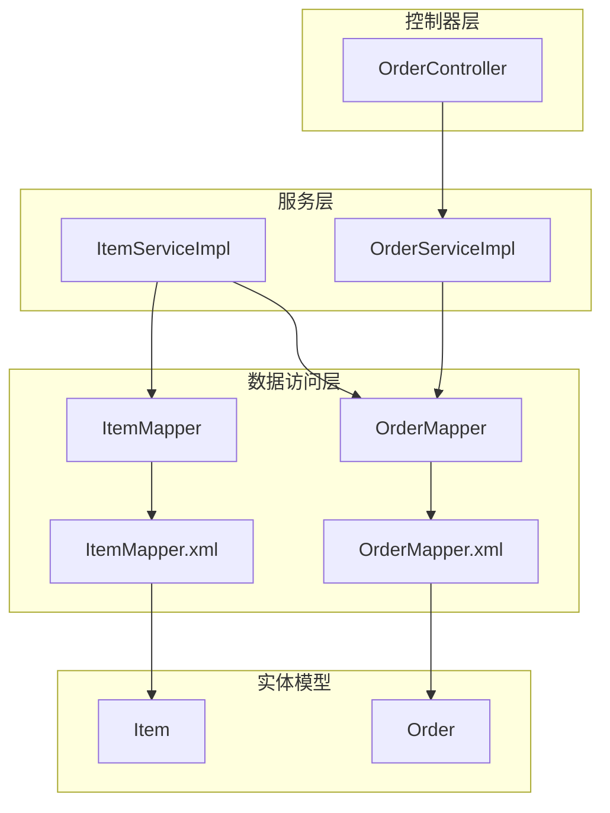
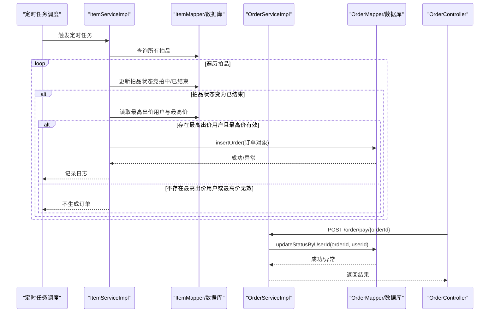
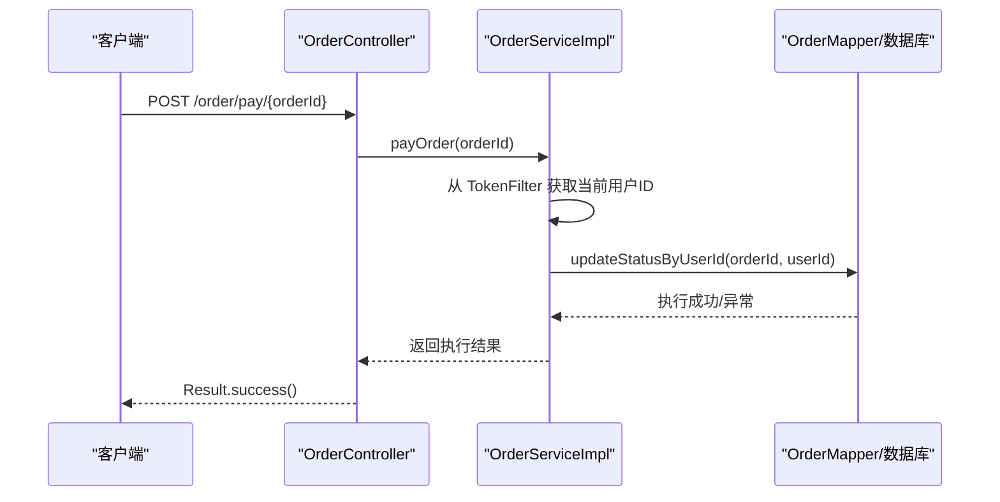
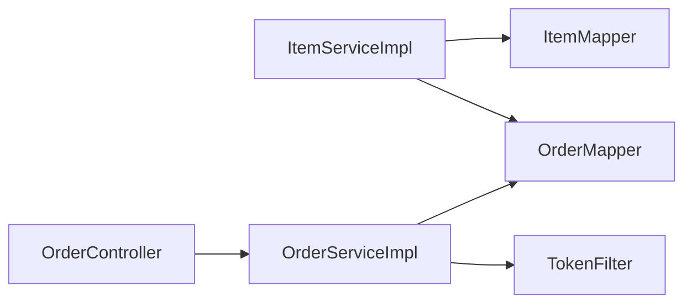

# 订单生成策略

<cite>
**本文引用的文件**
- [ItemServiceImpl.java](file://src/main/java/com/qkl/auctionsystem/service/impl/ItemServiceImpl.java)
- [OrderServiceImpl.java](file://src/main/java/com/qkl/auctionsystem/service/impl/OrderServiceImpl.java)
- [OrderMapper.java](file://src/main/java/com/qkl/auctionsystem/mapper/OrderMapper.java)
- [OrderMapper.xml](file://src/main/resources/mapper/OrderMapper.xml)
- [Order.java](file://src/main/java/com/qkl/auctionsystem/pojo/entity/Order.java)
- [Item.java](file://src/main/java/com/qkl/auctionsystem/pojo/entity/Item.java)
- [ItemMapper.java](file://src/main/java/com/qkl/auctionsystem/mapper/ItemMapper.java)
- [ItemMapper.xml](file://src/main/resources/mapper/ItemMapper.xml)
- [OrderController.java](file://src/main/java/com/qkl/auctionsystem/controller/OrderController.java)
- [TokenFilter.java](file://src/main/java/com/qkl/auctionsystem/filter/TokenFilter.java)
- [auction_database.sql](file://auction_database.sql)
</cite>

## 目录
1. [引言](#引言)
2. [项目结构](#项目结构)
3. [核心组件](#核心组件)
4. [架构总览](#架构总览)
5. [详细组件分析](#详细组件分析)
6. [依赖关系分析](#依赖关系分析)
7. [性能考量](#性能考量)
8. [故障排查指南](#故障排查指南)
9. [结论](#结论)

## 引言
本文件围绕“订单自动生成”的实现策略展开，重点说明以下内容：
- 当拍品状态由“竞拍中”变为“已结束”时，系统如何触发订单生成；
- 订单生成条件：仅当拍品存在最高出价用户且最高价有效时才生成；
- 订单对象的构建过程及字段赋值逻辑；
- 订单通过 OrderMapper.insertOrder 持久化到数据库的流程；
- 生成失败时的日志记录与异常处理；
- 结合 OrderServiceImpl 的 payOrder 方法，说明用户后续如何完成支付，形成完整闭环。

## 项目结构
本项目采用分层架构，主要涉及服务层、数据访问层、控制器层与实体模型。与订单自动生成直接相关的模块包括：
- 服务层：ItemServiceImpl（拍品状态定时检查与订单生成）、OrderServiceImpl（订单支付）
- 数据访问层：ItemMapper、OrderMapper 及对应的 MyBatis 映射文件
- 控制器层：OrderController（对外提供支付接口）
- 实体模型：Item、Order

图表来源
- [OrderController.java](file://src/main/java/com/qkl/auctionsystem/controller/OrderController.java#L1-L43)
- [ItemServiceImpl.java](file://src/main/java/com/qkl/auctionsystem/service/impl/ItemServiceImpl.java#L1-L182)
- [OrderServiceImpl.java](file://src/main/java/com/qkl/auctionsystem/service/impl/OrderServiceImpl.java#L1-L43)
- [ItemMapper.java](file://src/main/java/com/qkl/auctionsystem/mapper/ItemMapper.java#L1-L35)
- [OrderMapper.java](file://src/main/java/com/qkl/auctionsystem/mapper/OrderMapper.java#L1-L19)
- [ItemMapper.xml](file://src/main/resources/mapper/ItemMapper.xml#L1-L109)
- [OrderMapper.xml](file://src/main/resources/mapper/OrderMapper.xml#L1-L15)
- [Item.java](file://src/main/java/com/qkl/auctionsystem/pojo/entity/Item.java#L1-L34)
- [Order.java](file://src/main/java/com/qkl/auctionsystem/pojo/entity/Order.java#L1-L24)

章节来源
- [ItemServiceImpl.java](file://src/main/java/com/qkl/auctionsystem/service/impl/ItemServiceImpl.java#L1-L182)
- [OrderServiceImpl.java](file://src/main/java/com/qkl/auctionsystem/service/impl/OrderServiceImpl.java#L1-L43)
- [OrderMapper.java](file://src/main/java/com/qkl/auctionsystem/mapper/OrderMapper.java#L1-L19)
- [OrderMapper.xml](file://src/main/resources/mapper/OrderMapper.xml#L1-L15)
- [Order.java](file://src/main/java/com/qkl/auctionsystem/pojo/entity/Order.java#L1-L24)
- [Item.java](file://src/main/java/com/qkl/auctionsystem/pojo/entity/Item.java#L1-L34)
- [ItemMapper.java](file://src/main/java/com/qkl/auctionsystem/mapper/ItemMapper.java#L1-L35)
- [ItemMapper.xml](file://src/main/resources/mapper/ItemMapper.xml#L1-L109)
- [OrderController.java](file://src/main/java/com/qkl/auctionsystem/controller/OrderController.java#L1-L43)
- [TokenFilter.java](file://src/main/java/com/qkl/auctionsystem/filter/TokenFilter.java)

## 核心组件
- 拍品状态定时检查与订单生成：由 ItemServiceImpl 的定时任务负责，当拍品结束时间到达后，若存在最高出价用户与最高价，则生成订单。
- 订单持久化：OrderMapper.insertOrder 负责将订单写入数据库。
- 订单支付：OrderServiceImpl.payOrder 负责将订单状态从“待付款”更新为“已完成”，并返回结果给控制器。
- 控制器入口：OrderController 提供 /order/pay/{orderId} 接口，调用 OrderService 完成支付。

章节来源
- [ItemServiceImpl.java](file://src/main/java/com/qkl/auctionsystem/service/impl/ItemServiceImpl.java#L107-L182)
- [OrderMapper.java](file://src/main/java/com/qkl/auctionsystem/mapper/OrderMapper.java#L1-L19)
- [OrderMapper.xml](file://src/main/resources/mapper/OrderMapper.xml#L1-L15)
- [OrderServiceImpl.java](file://src/main/java/com/qkl/auctionsystem/service/impl/OrderServiceImpl.java#L1-L43)
- [OrderController.java](file://src/main/java/com/qkl/auctionsystem/controller/OrderController.java#L1-L43)

## 架构总览
下面以序列图展示“拍品结束→生成订单→用户支付”的完整流程。

图表来源
- [ItemServiceImpl.java](file://src/main/java/com/qkl/auctionsystem/service/impl/ItemServiceImpl.java#L107-L182)
- [OrderServiceImpl.java](file://src/main/java/com/qkl/auctionsystem/service/impl/OrderServiceImpl.java#L1-L43)
- [OrderMapper.xml](file://src/main/resources/mapper/OrderMapper.xml#L1-L15)
- [OrderController.java](file://src/main/java/com/qkl/auctionsystem/controller/OrderController.java#L1-L43)

## 详细组件分析

### 订单生成条件与触发机制
- 条件一：拍品状态由“竞拍中”变为“已结束”。该判断由 ItemServiceImpl 的定时任务完成，遍历所有拍品，依据当前时间与拍品起止时间决定状态变更，并在状态变为“已结束”时触发订单生成。
- 条件二：拍品存在最高出价用户且最高价有效。在生成订单前，系统会检查 Item 的 currentMaxUserId 与 currentMaxPrice 是否非空，只有满足此条件才会创建订单。

章节来源
- [ItemServiceImpl.java](file://src/main/java/com/qkl/auctionsystem/service/impl/ItemServiceImpl.java#L107-L182)
- [Item.java](file://src/main/java/com/qkl/auctionsystem/pojo/entity/Item.java#L1-L34)
- [ItemMapper.xml](file://src/main/resources/mapper/ItemMapper.xml#L95-L108)

### 订单对象构建与字段赋值逻辑
- 字段来源与赋值：
  - itemId：来源于拍品 ID
  - userId：来源于拍品的最高出价用户 ID
  - dealPrice：来源于拍品的最高出价金额
  - status：初始化为 0（待付款）
  - updateTime：初始化为当前时间
- 订单对象通过 Builder 模式构建，随后交由 OrderMapper.insertOrder 写入数据库。

章节来源
- [Order.java](file://src/main/java/com/qkl/auctionsystem/pojo/entity/Order.java#L1-L24)
- [OrderMapper.java](file://src/main/java/com/qkl/auctionsystem/mapper/OrderMapper.java#L1-L19)
- [OrderMapper.xml](file://src/main/resources/mapper/OrderMapper.xml#L1-L15)
- [ItemServiceImpl.java](file://src/main/java/com/qkl/auctionsystem/service/impl/ItemServiceImpl.java#L149-L182)

### 订单持久化流程与异常处理
- 持久化路径：OrderMapper.insertOrder 将订单写入 auction_order 表；MyBatis 映射文件中定义了插入语句，字段与实体属性一一对应。
- 异常处理：
  - 在生成订单过程中，若 insertOrder 抛出异常，系统会记录错误日志并抛出运行时异常，避免静默失败。
  - 对于拍品状态更新阶段的异常，同样记录错误日志，保证可观测性。

章节来源
- [OrderMapper.java](file://src/main/java/com/qkl/auctionsystem/mapper/OrderMapper.java#L1-L19)
- [OrderMapper.xml](file://src/main/resources/mapper/OrderMapper.xml#L1-L15)
- [ItemServiceImpl.java](file://src/main/java/com/qkl/auctionsystem/service/impl/ItemServiceImpl.java#L149-L182)

### 用户支付闭环：从下单到完成支付
- 支付入口：OrderController 提供 /order/pay/{orderId} 接口，接收订单 ID 并调用 OrderService.payOrder。
- 支付实现：OrderServiceImpl 从 TokenFilter 中获取当前登录用户 ID，然后调用 OrderMapper.updateStatusByUserId 将订单状态从 0（待付款）更新为 1（已完成）。
- 响应返回：控制器封装 Result.success() 返回给前端。

图表来源
- [OrderController.java](file://src/main/java/com/qkl/auctionsystem/controller/OrderController.java#L1-L43)
- [OrderServiceImpl.java](file://src/main/java/com/qkl/auctionsystem/service/impl/OrderServiceImpl.java#L1-L43)
- [OrderMapper.xml](file://src/main/resources/mapper/OrderMapper.xml#L1-L15)
- [TokenFilter.java](file://src/main/java/com/qkl/auctionsystem/filter/TokenFilter.java)

章节来源
- [OrderController.java](file://src/main/java/com/qkl/auctionsystem/controller/OrderController.java#L1-L43)
- [OrderServiceImpl.java](file://src/main/java/com/qkl/auctionsystem/service/impl/OrderServiceImpl.java#L1-L43)
- [OrderMapper.xml](file://src/main/resources/mapper/OrderMapper.xml#L1-L15)
- [TokenFilter.java](file://src/main/java/com/qkl/auctionsystem/filter/TokenFilter.java)

### 数据库设计与约束
- 订单表（auction_order）包含主键 id、关联拍品 item_id、买家 user_id、成交价 deal_price、状态 status、更新时间 update_time。
- 订单表对 item_id 设置唯一索引，确保同一拍品仅生成一条订单。
- 状态字段默认 0（待付款），支付完成后更新为 1（已完成）。

章节来源
- [auction_database.sql](file://auction_database.sql#L60-L72)
- [OrderMapper.xml](file://src/main/resources/mapper/OrderMapper.xml#L1-L15)

## 依赖关系分析
- ItemServiceImpl 依赖 ItemMapper 与 OrderMapper，分别用于拍品状态更新与订单持久化。
- OrderServiceImpl 依赖 OrderMapper 与 TokenFilter，用于订单状态更新与用户鉴权。
- OrderController 依赖 OrderService，作为对外支付入口。

图表来源
- [ItemServiceImpl.java](file://src/main/java/com/qkl/auctionsystem/service/impl/ItemServiceImpl.java#L1-L182)
- [OrderServiceImpl.java](file://src/main/java/com/qkl/auctionsystem/service/impl/OrderServiceImpl.java#L1-L43)
- [OrderController.java](file://src/main/java/com/qkl/auctionsystem/controller/OrderController.java#L1-L43)

章节来源
- [ItemServiceImpl.java](file://src/main/java/com/qkl/auctionsystem/service/impl/ItemServiceImpl.java#L1-L182)
- [OrderServiceImpl.java](file://src/main/java/com/qkl/auctionsystem/service/impl/OrderServiceImpl.java#L1-L43)
- [OrderController.java](file://src/main/java/com/qkl/auctionsystem/controller/OrderController.java#L1-L43)

## 性能考量
- 定时任务扫描全量拍品：对于拍品数量较多的场景，建议优化为按时间窗口分页扫描或增加索引以减少全表扫描开销。
- 订单唯一性约束：数据库对 item_id 建立唯一索引，避免重复订单；同时在业务层也应做好幂等控制，防止并发重复生成。
- 日志与异常：生成订单与支付均包含异常捕获与日志记录，便于问题定位与监控告警。

## 故障排查指南
- 订单未生成：
  - 检查拍品状态是否正确变为“已结束”
  - 检查 Item 的 currentMaxUserId 与 currentMaxPrice 是否非空
  - 查看定时任务日志与 insertOrder 异常日志
- 订单已生成但支付失败：
  - 检查 TokenFilter 是否能正确解析当前用户 ID
  - 检查 updateStatusByUserId 的 SQL 是否执行成功
  - 查看 OrderController 返回结果与前端交互
- 数据库层面：
  - 确认 auction_order 表结构与字段类型一致
  - 检查 item_id 唯一索引是否存在冲突

章节来源
- [ItemServiceImpl.java](file://src/main/java/com/qkl/auctionsystem/service/impl/ItemServiceImpl.java#L149-L182)
- [OrderServiceImpl.java](file://src/main/java/com/qkl/auctionsystem/service/impl/OrderServiceImpl.java#L1-L43)
- [OrderMapper.xml](file://src/main/resources/mapper/OrderMapper.xml#L1-L15)
- [TokenFilter.java](file://src/main/java/com/qkl/auctionsystem/filter/TokenFilter.java)

## 结论
本系统通过定时任务自动检测拍品结束状态，并在满足“存在最高出价用户且最高价有效”的前提下，自动生成一条状态为“待付款”的订单。订单对象的字段来源于拍品的最高出价信息，通过 OrderMapper 持久化至数据库。用户可在前端完成支付操作，OrderServiceImpl 将订单状态更新为“已完成”，形成从拍品结束到订单支付的完整闭环。整体流程具备清晰的异常处理与日志记录，便于运维与问题排查。