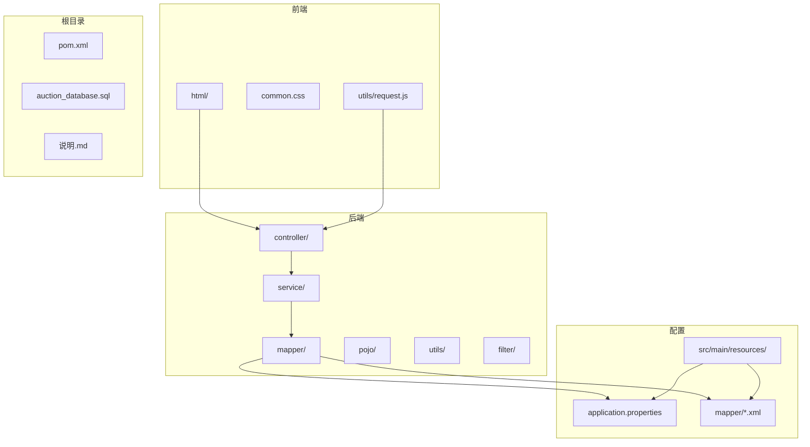
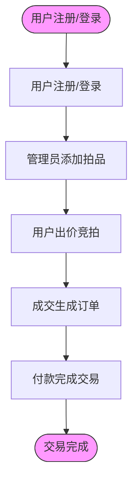
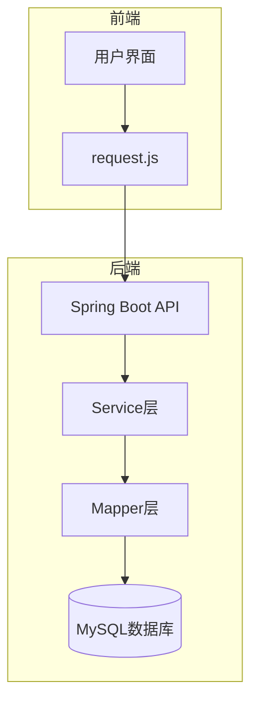
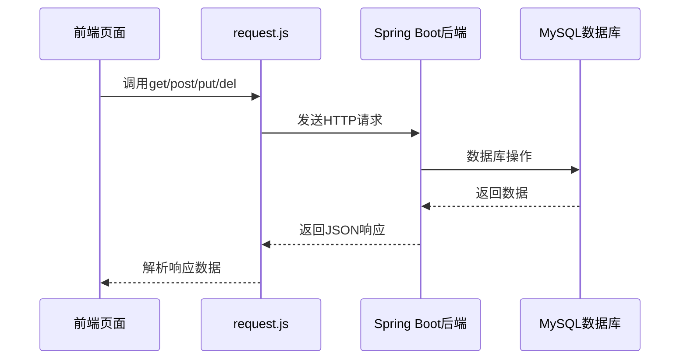
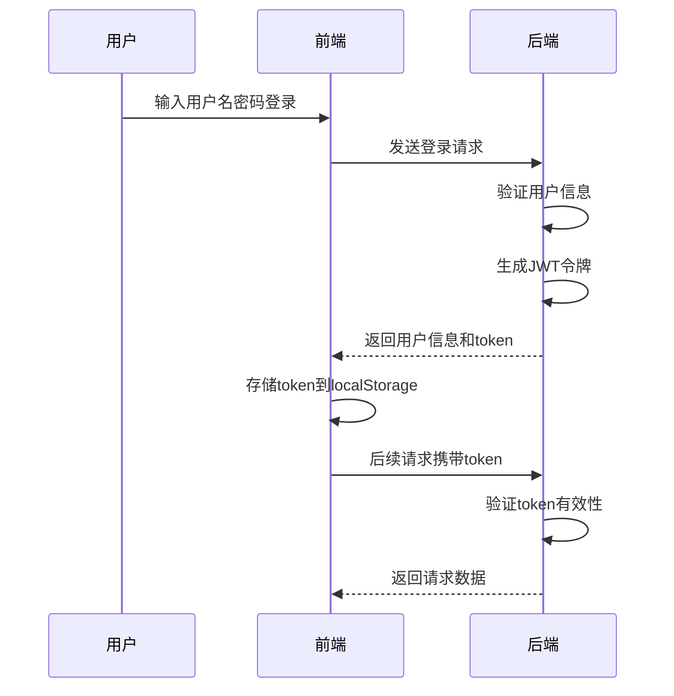
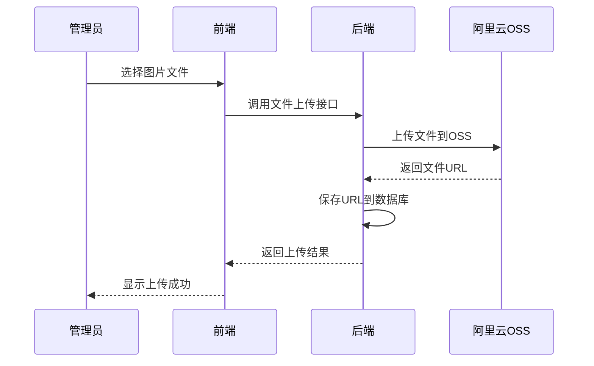
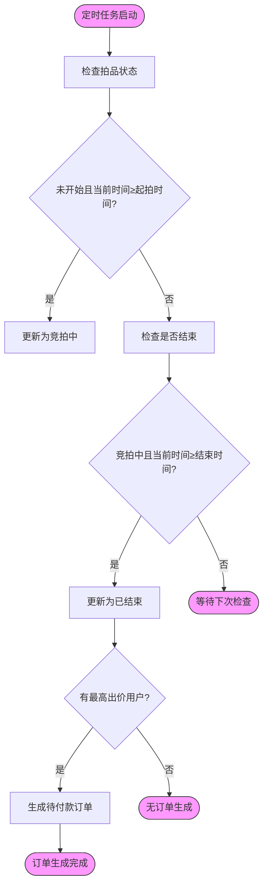
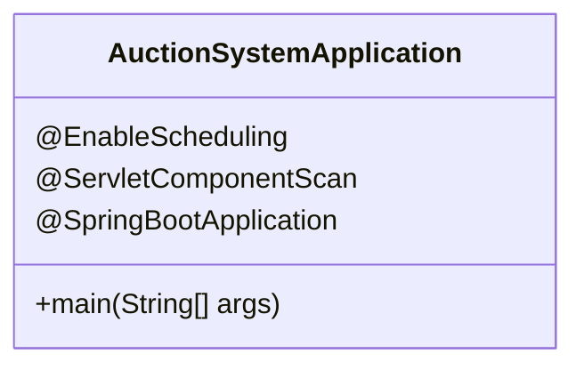
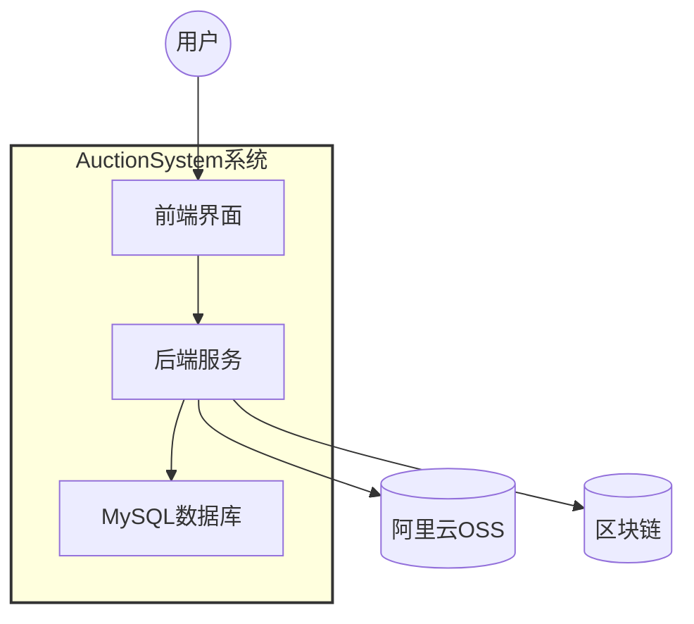

# 系统概述

<cite>
**本文档引用文件**  
- [AuctionSystemApplication.java](file://src/main/java/com/qkl/auctionsystem/AuctionSystemApplication.java)
- [说明.md](file://说明.md)
- [auction_database.sql](file://auction_database.sql)
- [pom.xml](file://pom.xml)
- [application.properties](file://src/main/resources/application.properties)
- [TokenFilter.java](file://src/main/java/com/qkl/auctionsystem/filter/TokenFilter.java)
- [JwtUtils.java](file://src/main/java/com/qkl/auctionsystem/utils/JwtUtils.java)
- [AliyunOSSOperator.java](file://src/main/java/com/qkl/auctionsystem/utils/AliyunOSSOperator.java)
- [UserController.java](file://src/main/java/com/qkl/auctionsystem/controller/UserController.java)
- [ItemController.java](file://src/main/java/com/qkl/auctionsystem/controller/ItemController.java)
- [BidServiceImpl.java](file://src/main/java/com/qkl/auctionsystem/service/impl/BidServiceImpl.java)
- [OrderServiceImpl.java](file://src/main/java/com/qkl/auctionsystem/service/impl/OrderServiceImpl.java)
- [PermissionChecker.java](file://src/main/java/com/qkl/auctionsystem/utils/PermissionChecker.java)
- [request.js](file://html/utils/request.js)
- [index.html](file://html/index.html)
</cite>

## 目录
1. [系统简介](#系统简介)
2. [项目结构](#项目结构)
3. [核心业务流程](#核心业务流程)
4. [技术架构设计](#技术架构设计)
5. [前后端协作机制](#前后端协作机制)
6. [关键特性分析](#关键特性分析)
7. [数据库设计](#数据库设计)
8. [项目启动流程](#项目启动流程)
9. [系统边界与集成点](#系统边界与集成点)
10. [总结](#总结)

## 系统简介

AuctionSystem是一个全栈在线拍卖平台，实现了完整的拍卖业务流程。系统采用前后端分离架构，前端使用HTML5、CSS3和JavaScript构建用户界面，后端基于Spring Boot框架提供RESTful API服务。系统支持用户注册登录、管理员管理拍品、用户出价竞拍、订单生成与付款等核心功能，为用户提供安全可靠的在线拍卖体验。

**本节来源**  
- [说明.md](file://说明.md#L1-L112)

## 项目结构

AuctionSystem项目采用标准的Maven项目结构，分为前端HTML页面、后端Java代码和配置文件三大模块。前端页面位于`html/`目录下，包含用户界面和工具脚本；后端代码位于`src/main/java/com/qkl/auctionsystem/`包中，按照MVC模式组织；配置文件位于`src/main/resources/`目录下。



**图示来源**  
- [项目结构](file://)

**本节来源**  
- [项目结构](file://)

## 核心业务流程

AuctionSystem系统的核心业务流程包括五个关键步骤：用户注册/登录 → 管理员添加拍品 → 用户出价竞拍 → 成交生成订单 → 付款完成交易。这一流程构成了系统的完整业务闭环。



**图示来源**  
- [说明.md](file://说明.md#L3-L4)

**本节来源**  
- [说明.md](file://说明.md#L3-L4)

## 技术架构设计

AuctionSystem采用前后端分离的全栈技术架构。后端基于Spring Boot框架，使用MyBatis作为持久层框架，MySQL作为数据库存储，通过RESTful API与前端交互。前端采用原生HTML/CSS/JavaScript技术栈，通过fetch API与后端通信。



**图示来源**  
- [pom.xml](file://pom.xml#L32-L96)
- [说明.md](file://说明.md#L52-L112)

**本节来源**  
- [pom.xml](file://pom.xml#L32-L96)
- [说明.md](file://说明.md#L52-L112)

## 前后端协作机制

系统前后端通过RESTful API进行协作，前端通过`html/utils/request.js`中的封装函数与后端通信。前端页面通过import方式引入request.js模块，调用get、post、put、del等方法与后端API交互，实现了统一的请求处理机制。



**图示来源**  
- [request.js](file://html/utils/request.js#L1-L131)
- [index.html](file://html/index.html#L162-L424)

**本节来源**  
- [request.js](file://html/utils/request.js#L1-L131)
- [index.html](file://html/index.html#L162-L424)

## 关键特性分析

### JWT身份认证

系统采用JWT（JSON Web Token）实现身份认证机制。用户登录后，后端生成包含用户ID和角色信息的JWT令牌，前端将令牌存储在localStorage中，并在后续请求的header中携带token进行身份验证。



**图示来源**  
- [JwtUtils.java](file://src/main/java/com/qkl/auctionsystem/utils/JwtUtils.java#L1-L36)
- [TokenFilter.java](file://src/main/java/com/qkl/auctionsystem/filter/TokenFilter.java#L1-L141)

**本节来源**  
- [JwtUtils.java](file://src/main/java/com/qkl/auctionsystem/utils/JwtUtils.java#L1-L36)
- [TokenFilter.java](file://src/main/java/com/qkl/auctionsystem/filter/TokenFilter.java#L1-L141)

### 阿里云OSS文件上传

系统集成阿里云OSS实现拍品图片的云端存储。通过`AliyunOSSOperator`工具类封装OSS上传功能，管理员在添加或修改拍品时，可上传图片文件，系统自动将图片存储到OSS并返回访问URL。



**图示来源**  
- [AliyunOSSOperator.java](file://src/main/java/com/qkl/auctionsystem/utils/AliyunOSSOperator.java#L1-L69)
- [application.properties](file://src/main/resources/application.properties#L15-L20)

**本节来源**  
- [AliyunOSSOperator.java](file://src/main/java/com/qkl/auctionsystem/utils/AliyunOSSOperator.java#L1-L69)
- [application.properties](file://src/main/resources/application.properties#L15-L20)

### 定时任务状态更新与订单生成

系统通过定时任务自动更新拍品状态并生成订单。当拍品的起拍时间到达时，状态从"未开始"变为"竞拍中"；当结束时间到达时，状态变为"已结束"，并自动为最高出价用户生成待付款订单。



**图示来源**  
- [说明.md](file://说明.md#L104-L108)
- [ItemController.java](file://src/main/java/com/qkl/auctionsystem/controller/ItemController.java#L24-L86)

**本节来源**  
- [说明.md](file://说明.md#L104-L108)

## 数据库设计

系统数据库设计包含四个核心表：用户表、拍品表、竞拍记录表和订单表。各表之间通过外键关联，形成了完整的数据模型。

```mermaid
erDiagram
    USER {
        bigint id PK
        varchar(50) username UK
        varchar(128) password
        tinyint role
        datetime create_time
        datetime update_time
    }
    AUCTION_ITEM {
        bigint id PK
        varchar(100) title
        varchar(255) image
        decimal(10,2) initial_price
        varchar(500) description
        datetime start_time
        datetime end_time
        decimal(10,2) current_max_price
        bigint current_max_user_id FK
        tinyint status
        tinyint listing_status
        datetime create_time
        datetime update_time
    }
    AUCTION_RECORD {
        bigint id PK
        bigint item_id FK
        bigint user_id FK
        decimal(10,2) bid_price
        datetime bid_time
    }
    AUCTION_ORDER {
        bigint id PK
        bigint item_id FK
        bigint user_id FK
        decimal(10,2) deal_price
        tinyint status
        datetime update_time
    }
    USER ||--o{ AUCTION_ITEM : "创建"
    USER ||--o{ AUCTION_RECORD : "出价"
    USER ||--o{ AUCTION_ORDER : "购买"
    AUCTION_ITEM ||--o{ AUCTION_RECORD : "包含"
    AUCTION_ITEM ||--o{ AUCTION_ORDER : "生成"
```

**图示来源**  
- [auction_database.sql](file://auction_database.sql#L1-L78)
- [说明.md](file://说明.md#L5-L51)

**本节来源**  
- [auction_database.sql](file://auction_database.sql#L1-L78)
- [说明.md](file://说明.md#L5-L51)

## 项目启动流程

系统入口类为`AuctionSystemApplication.java`，使用Spring Boot的`@SpringBootApplication`注解标记。项目启动时，Spring Boot自动配置各项组件，包括Web MVC、MyBatis、数据库连接等，并通过`@EnableScheduling`启用定时任务功能。



**图示来源**  
- [AuctionSystemApplication.java](file://src/main/java/com/qkl/auctionsystem/AuctionSystemApplication.java#L1-L18)

**本节来源**  
- [AuctionSystemApplication.java](file://src/main/java/com/qkl/auctionsystem/AuctionSystemApplication.java#L1-L18)

## 系统边界与集成点

AuctionSystem系统具有清晰的系统边界和多个外部集成点。系统通过RESTful API与前端交互，通过JDBC与MySQL数据库连接，通过SDK与阿里云OSS集成，形成了完整的系统生态。



**图示来源**  
- [pom.xml](file://pom.xml#L65-L82)
- [说明.md](file://说明.md#L110-L112)
- [AliyunOSSOperator.java](file://src/main/java/com/qkl/auctionsystem/utils/AliyunOSSOperator.java#L1-L69)

**本节来源**  
- [pom.xml](file://pom.xml#L65-L82)
- [说明.md](file://说明.md#L110-L112)
- [AliyunOSSOperator.java](file://src/main/java/com/qkl/auctionsystem/utils/AliyunOSSOperator.java#L1-L69)

## 总结

AuctionSystem是一个功能完整的在线拍卖平台，实现了从用户注册到交易完成的完整业务流程。系统采用前后端分离架构，技术选型合理，代码结构清晰。通过JWT实现安全的身份认证，利用阿里云OSS实现高效的文件存储，结合定时任务实现自动化的业务流程管理。系统设计考虑了可扩展性和可维护性，为后续功能迭代提供了良好的基础。