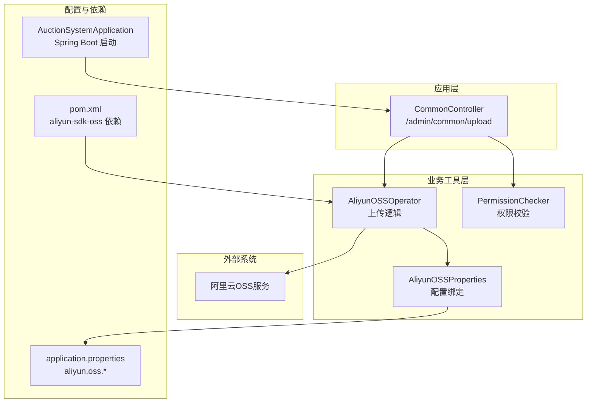
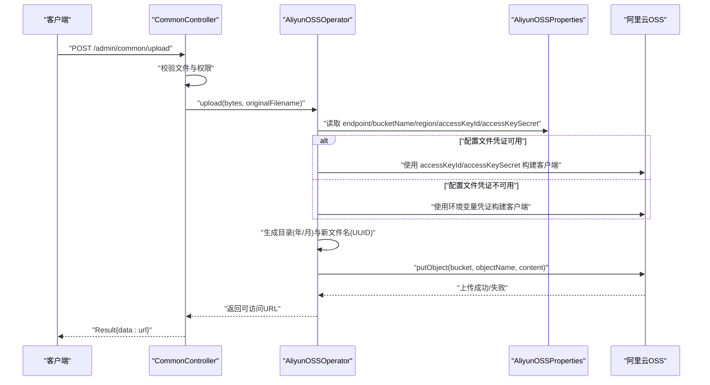
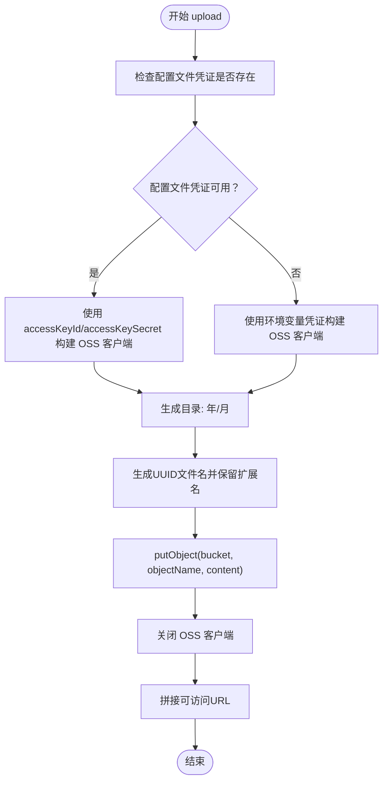
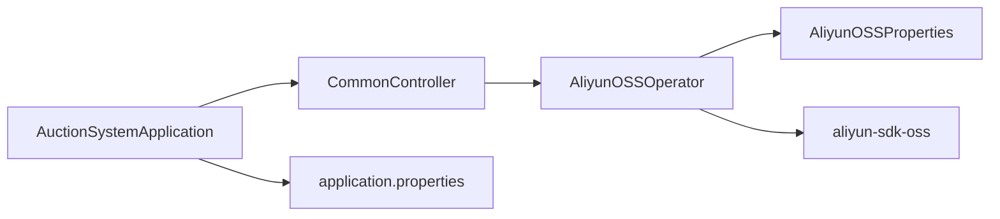

# OSS配置

<cite>
**本文引用的文件**
- [AuctionSystemApplication.java](file://src/main/java/com/qkl/auctionsystem/AuctionSystemApplication.java)
- [AliyunOSSProperties.java](file://src/main/java/com/qkl/auctionsystem/properties/AliyunOSSProperties.java)
- [AliyunOSSOperator.java](file://src/main/java/com/qkl/auctionsystem/utils/AliyunOSSOperator.java)
- [CommonController.java](file://src/main/java/com/qkl/auctionsystem/controller/CommonController.java)
- [application.properties](file://src/main/resources/application.properties)
- [pom.xml](file://pom.xml)
- [PermissionChecker.java](file://src/main/java/com/qkl/auctionsystem/utils/PermissionChecker.java)
</cite>

## 目录
1. [简介](#简介)
2. [项目结构](#项目结构)
3. [核心组件](#核心组件)
4. [架构总览](#架构总览)
5. [详细组件分析](#详细组件分析)
6. [依赖关系分析](#依赖关系分析)
7. [性能与安全考虑](#性能与安全考虑)
8. [故障排查指南](#故障排查指南)
9. [结论](#结论)
10. [附录](#附录)

## 简介
本指南围绕阿里云OSS服务在本项目的配置与使用展开，重点说明：
- 如何在 application.properties 中配置 aliyun.oss.* 关键参数
- AliyunOSSProperties 类如何通过 @ConfigurationProperties 绑定外部配置
- AliyunOSSOperator 工具类如何实现文件上传流程（含凭证优先级、上传路径生成规则）
- 访问凭证安全管理建议（优先使用配置文件而非环境变量）
- 上传失败的常见原因与处理思路
- OSS权限策略配置建议（基于代码行为的合理实践）

## 项目结构
本项目采用 Spring Boot 标准目录组织，OSS 相关代码集中在以下位置：
- 配置绑定类：properties/AliyunOSSProperties.java
- 上传工具类：utils/AliyunOSSOperator.java
- 控制器入口：controller/CommonController.java
- 应用启动类：AuctionSystemApplication.java
- 外部配置：application.properties
- 依赖声明：pom.xml
- 权限检查工具：utils/PermissionChecker.java

图表来源
- [CommonController.java](file://src/main/java/com/qkl/auctionsystem/controller/CommonController.java#L1-L51)
- [AliyunOSSOperator.java](file://src/main/java/com/qkl/auctionsystem/utils/AliyunOSSOperator.java#L1-L69)
- [AliyunOSSProperties.java](file://src/main/java/com/qkl/auctionsystem/properties/AliyunOSSProperties.java#L1-L18)
- [application.properties](file://src/main/resources/application.properties#L1-L20)
- [pom.xml](file://pom.xml#L1-L129)
- [AuctionSystemApplication.java](file://src/main/java/com/qkl/auctionsystem/AuctionSystemApplication.java#L1-L18)

章节来源
- [AuctionSystemApplication.java](file://src/main/java/com/qkl/auctionsystem/AuctionSystemApplication.java#L1-L18)
- [application.properties](file://src/main/resources/application.properties#L1-L20)
- [pom.xml](file://pom.xml#L1-L129)

## 核心组件
- 配置绑定类 AliyunOSSProperties：通过 @ConfigurationProperties(prefix = "aliyun.oss") 将 application.properties 中以 aliyun.oss.* 开头的键值绑定到该类字段，包括 endpoint、bucket-name、region、access-key-id、access-key-secret。
- 上传工具类 AliyunOSSOperator：负责构建 OSS 客户端、选择凭证来源（优先使用配置文件中的 accessKeyId/accessKeySecret，否则回退到环境变量）、生成上传路径（按年/月 分目录）、执行上传并将结果转换为可访问 URL。
- 控制器 CommonController：对外暴露 /admin/common/upload 接口，接收 MultipartFile，调用 AliyunOSSOperator 执行上传，并返回结果。
- 权限检查工具 PermissionChecker：用于限制上传接口仅管理员可用。

章节来源
- [AliyunOSSProperties.java](file://src/main/java/com/qkl/auctionsystem/properties/AliyunOSSProperties.java#L1-L18)
- [AliyunOSSOperator.java](file://src/main/java/com/qkl/auctionsystem/utils/AliyunOSSOperator.java#L1-L69)
- [CommonController.java](file://src/main/java/com/qkl/auctionsystem/controller/CommonController.java#L1-L51)
- [PermissionChecker.java](file://src/main/java/com/qkl/auctionsystem/utils/PermissionChecker.java#L1-L36)

## 架构总览
下图展示了从控制器到 OSS 的调用链路与数据流。

图表来源
- [CommonController.java](file://src/main/java/com/qkl/auctionsystem/controller/CommonController.java#L1-L51)
- [AliyunOSSOperator.java](file://src/main/java/com/qkl/auctionsystem/utils/AliyunOSSOperator.java#L1-L69)
- [AliyunOSSProperties.java](file://src/main/java/com/qkl/auctionsystem/properties/AliyunOSSProperties.java#L1-L18)

## 详细组件分析

### 配置绑定类 AliyunOSSProperties
- 职责：承载 aliyun.oss.* 配置项，供其他组件注入使用。
- 关键点：
  - 使用 @ConfigurationProperties(prefix = "aliyun.oss") 自动绑定 application.properties 中以 aliyun.oss.* 开头的键。
  - 字段包括 endpoint、bucket-name、region、access-key-id、access-key-secret。
- 与 Spring Boot 的集成：该类被标注为 @Component，配合 @ConfigurationProperties 即可在运行时自动装配。

章节来源
- [AliyunOSSProperties.java](file://src/main/java/com/qkl/auctionsystem/properties/AliyunOSSProperties.java#L1-L18)
- [application.properties](file://src/main/resources/application.properties#L15-L20)

### 上传工具类 AliyunOSSOperator
- 凭证选择策略：
  - 优先使用配置文件中的 accessKeyId 与 accessKeySecret；若两者均存在且非空，则直接使用配置文件凭证构建 OSS 客户端。
  - 若配置文件凭证缺失，则回退到环境变量凭证（EnvironmentVariableCredentialsProvider）。
- 上传路径生成规则：
  - 目录：按年/月 两级目录，例如 2024/12。
  - 文件名：使用 UUID 生成唯一文件名，并保留原扩展名。
  - 最终对象名：目录 + "/" + 新文件名。
- 返回 URL 规则：
  - 将 endpoint 的协议部分与 bucket 名组合，拼接为可访问的公网 URL。
- 错误处理：
  - 认证阶段捕获异常并记录日志，抛出统一异常。
  - 上传阶段捕获异常并记录日志，最终关闭 OSS 客户端连接。

图表来源
- [AliyunOSSOperator.java](file://src/main/java/com/qkl/auctionsystem/utils/AliyunOSSOperator.java#L1-L69)

章节来源
- [AliyunOSSOperator.java](file://src/main/java/com/qkl/auctionsystem/utils/AliyunOSSOperator.java#L1-L69)

### 控制器 CommonController
- 路由：/admin/common/upload（POST）
- 功能：
  - 校验上传文件是否为空。
  - 调用 PermissionChecker 判断当前用户是否为管理员。
  - 将 MultipartFile 转换为字节数组后调用 AliyunOSSOperator 执行上传。
  - 捕获异常并返回统一错误信息。
- 输出：Result<String>，包含上传后的可访问 URL。

章节来源
- [CommonController.java](file://src/main/java/com/qkl/auctionsystem/controller/CommonController.java#L1-L51)
- [PermissionChecker.java](file://src/main/java/com/qkl/auctionsystem/utils/PermissionChecker.java#L1-L36)

### 权限检查工具 PermissionChecker
- 提供 isAdmin/isUser/isLoggedIn 等静态方法，基于 TokenFilter 获取当前用户角色与登录状态。
- 在上传接口中用于限制仅管理员可上传。

章节来源
- [PermissionChecker.java](file://src/main/java/com/qkl/auctionsystem/utils/PermissionChecker.java#L1-L36)

## 依赖关系分析
- Maven 依赖：pom.xml 中引入了 aliyun-sdk-oss 依赖，确保 AliyunOSSOperator 可以使用 OSS 客户端能力。
- 运行时装配：AuctionSystemApplication.java 作为 Spring Boot 启动类，扫描组件并加载 application.properties 中的 aliyun.oss.* 配置。

图表来源
- [AuctionSystemApplication.java](file://src/main/java/com/qkl/auctionsystem/AuctionSystemApplication.java#L1-L18)
- [CommonController.java](file://src/main/java/com/qkl/auctionsystem/controller/CommonController.java#L1-L51)
- [AliyunOSSOperator.java](file://src/main/java/com/qkl/auctionsystem/utils/AliyunOSSOperator.java#L1-L69)
- [AliyunOSSProperties.java](file://src/main/java/com/qkl/auctionsystem/properties/AliyunOSSProperties.java#L1-L18)
- [pom.xml](file://pom.xml#L1-L129)
- [application.properties](file://src/main/resources/application.properties#L1-L20)

章节来源
- [pom.xml](file://pom.xml#L1-L129)
- [AuctionSystemApplication.java](file://src/main/java/com/qkl/auctionsystem/AuctionSystemApplication.java#L1-L18)

## 性能与安全考虑
- 凭证管理与安全
  - 代码明确支持两种凭证来源：配置文件与环境变量。当前实现优先使用配置文件中的 accessKeyId/accessKeySecret，若未配置则回退到环境变量。
  - 建议：在生产环境中优先将凭证配置在 application.properties 或受控的配置中心，避免直接依赖环境变量，降低泄露风险。
- 上传路径与命名
  - 采用“年/月”两级目录，有助于按时间维度管理对象，便于后续清理与统计。
  - 使用 UUID 生成文件名，避免重名冲突与覆盖问题。
- 客户端生命周期
  - 上传完成后显式关闭 OSS 客户端，防止资源泄漏。
- 网络与超时
  - 当前实现未设置 OSS 客户端的超时参数。建议在生产环境为 OSSClientBuilder 配置合理的连接与读写超时，以提升稳定性。
- 权限控制
  - 上传接口已通过 PermissionChecker 限制为管理员，建议结合更细粒度的鉴权策略与白名单机制进一步加固。

章节来源
- [AliyunOSSOperator.java](file://src/main/java/com/qkl/auctionsystem/utils/AliyunOSSOperator.java#L1-L69)
- [CommonController.java](file://src/main/java/com/qkl/auctionsystem/controller/CommonController.java#L1-L51)
- [PermissionChecker.java](file://src/main/java/com/qkl/auctionsystem/utils/PermissionChecker.java#L1-L36)

## 故障排查指南
- 认证失败
  - 现象：日志出现“OSS认证失败”，并抛出异常。
  - 可能原因：
    - 配置文件中的 accessKeyId 或 accessKeySecret 为空或不正确。
    - 环境变量凭证未正确设置或权限不足。
    - endpoint、region、bucket-name 不匹配或不存在。
  - 处理建议：
    - 核对 application.properties 中 aliyun.oss.* 配置项。
    - 确认凭证权限范围满足上传需求。
    - 校验 endpoint 与 region 是否一致，bucket 是否存在。
- 上传失败
  - 现象：putObject 抛出异常或返回错误。
  - 可能原因：
    - 对象名包含 Bucket 名称（代码已避免），或路径非法。
    - 网络不稳定或 OSS 服务异常。
    - 客户端未正确关闭导致资源占用。
  - 处理建议：
    - 检查对象名生成逻辑（年/月 + UUID + 原扩展名）。
    - 增加重试与超时配置（建议在 OSSClientBuilder 层面设置）。
    - 确保 finally 中关闭 OSS 客户端。
- 权限不足
  - 现象：返回“权限不足，只有管理员才能上传文件”。
  - 可能原因：当前用户角色非管理员。
  - 处理建议：确认 TokenFilter 中的角色信息与权限策略。

章节来源
- [AliyunOSSOperator.java](file://src/main/java/com/qkl/auctionsystem/utils/AliyunOSSOperator.java#L1-L69)
- [CommonController.java](file://src/main/java/com/qkl/auctionsystem/controller/CommonController.java#L1-L51)
- [PermissionChecker.java](file://src/main/java/com/qkl/auctionsystem/utils/PermissionChecker.java#L1-L36)

## 结论
本项目通过 @ConfigurationProperties 将 aliyun.oss.* 配置绑定到 AliyunOSSProperties，并在 AliyunOSSOperator 中实现了基于配置文件优先的凭证选择策略与“年/月”分目录的上传路径生成规则。结合控制器的权限校验，形成了一个简洁、可控的 OSS 上传流程。建议在生产环境中强化凭证管理与网络超时配置，以提升安全性与稳定性。

## 附录

### application.properties 中的 OSS 配置项说明
- aliyun.oss.endpoint：OSS 服务访问域名（如 https://oss-cn-beijing.aliyuncs.com）。
- aliyun.oss.bucket-name：目标存储空间名称。
- aliyun.oss.region：OSS 所属区域。
- aliyun.oss.access-key-id：访问密钥 ID。
- aliyun.oss.access-key-secret：访问密钥 Secret。

章节来源
- [application.properties](file://src/main/resources/application.properties#L15-L20)

### OSS 权限策略配置建议（基于现有实现的合理实践）
- 上传路径建议：
  - 使用“年/月”两级目录，便于按时间归档与清理。
  - 文件名使用 UUID，避免冲突与覆盖。
- 凭证最小权限原则：
  - 仅授予上传所需权限（如 OSS PutObject），避免过宽权限。
- 网络与安全：
  - 建议开启 HTTPS 访问，避免明文传输。
  - 在 OSS 存储桶层面设置合适的跨域与防盗链策略。

[本节为通用建议，不直接分析具体源码文件]