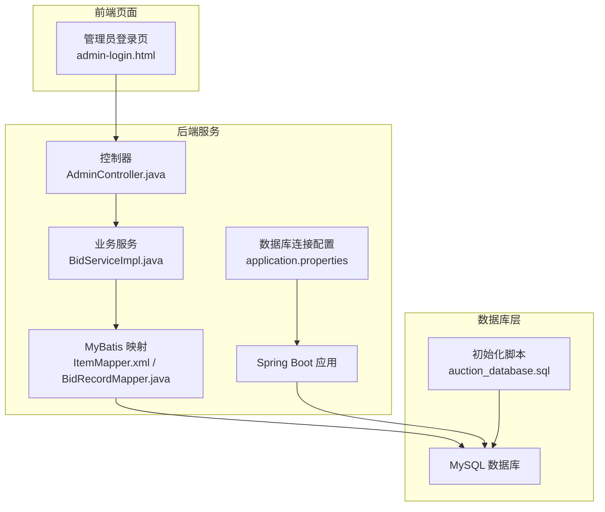
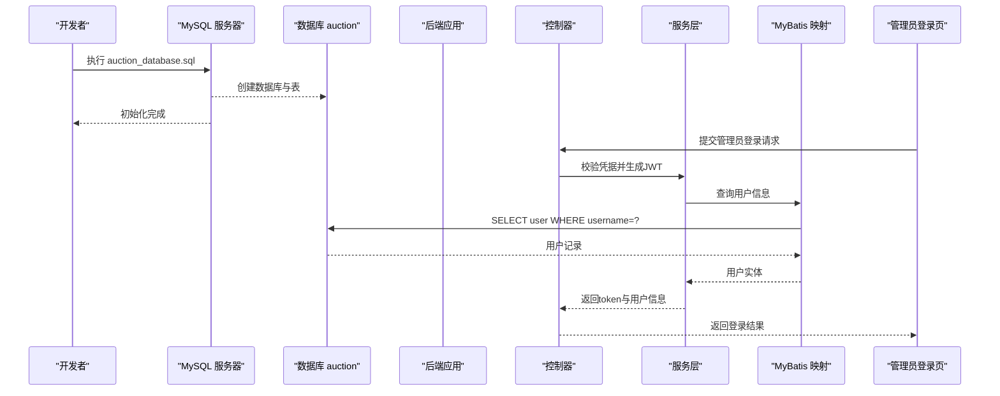
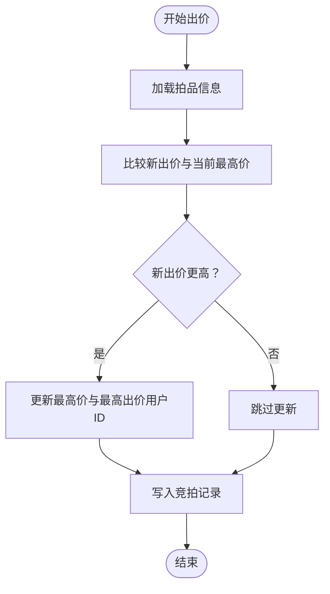
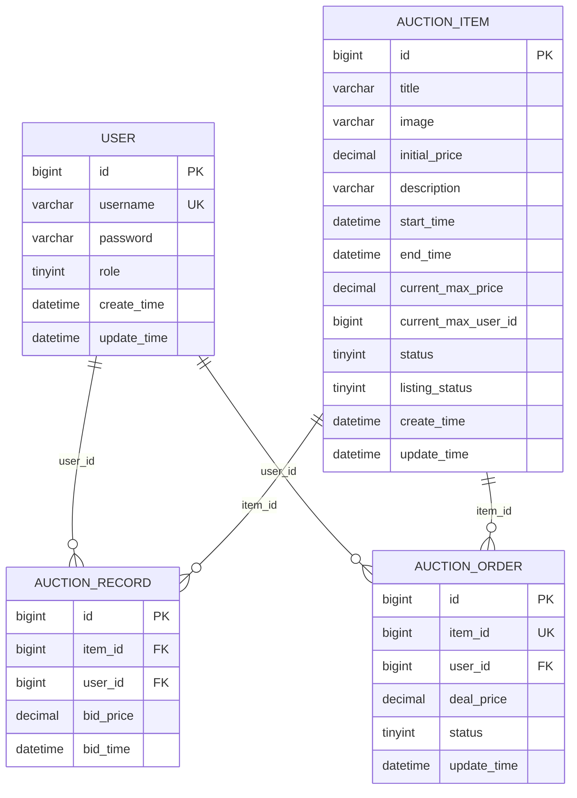

# 数据库初始化

<cite>
**本文引用的文件**
- [auction_database.sql](file://auction_database.sql)
- [application.properties](file://src/main/resources/application.properties)
- [说明.md](file://说明.md)
- [User.java](file://src/main/java/com/qkl/auctionsystem/pojo/entity/User.java)
- [Item.java](file://src/main/java/com/qkl/auctionsystem/pojo/entity/Item.java)
- [ItemMapper.xml](file://src/main/resources/mapper/ItemMapper.xml)
- [BidRecordMapper.java](file://src/main/java/com/qkl/auctionsystem/mapper/BidRecordMapper.java)
- [BidServiceImpl.java](file://src/main/java/com/qkl/auctionsystem/service/impl/BidServiceImpl.java)
- [AdminController.java](file://src/main/java/com/qkl/auctionsystem/controller/AdminController.java)
- [admin-login.html](file://html/admin-login.html)
</cite>

## 目录
1. [简介](#简介)
2. [项目结构](#项目结构)
3. [核心组件](#核心组件)
4. [架构总览](#架构总览)
5. [详细组件分析](#详细组件分析)
6. [依赖分析](#依赖分析)
7. [性能考虑](#性能考虑)
8. [故障排查指南](#故障排查指南)
9. [结论](#结论)
10. [附录](#附录)

## 简介
本指南面向开发者，提供auction_database.sql数据库初始化脚本的完整使用说明与逐行解析。内容涵盖：
- 如何通过MySQL命令行与图形化工具执行脚本
- CREATE DATABASE语句中字符集与排序规则的重要意义
- user、auction_item、auction_record、auction_order四张表的字段含义、主外键关系、索引设计及性能优化目的
- role字段的权限控制逻辑（0管理员/1普通用户）
- current_max_price与current_max_user_id在竞拍逻辑中的作用
- 订单表uk_item_id唯一约束防止重复下单的设计意图
- 初始化后默认管理员与普通用户的登录信息

## 项目结构
该仓库采用前后端分离与后端服务结合的结构，数据库初始化脚本位于根目录，后端通过Spring Boot + MyBatis访问数据库。关键位置如下：
- 数据库初始化脚本：auction_database.sql
- 应用配置（数据库连接）：src/main/resources/application.properties
- 表结构与字段说明：说明.md
- 实体类与Mapper映射：User.java、Item.java、ItemMapper.xml、BidRecordMapper.java
- 竞拍与订单相关服务：BidServiceImpl.java
- 管理员登录控制器：AdminController.java
- 管理员登录前端页面：admin-login.html

图表来源
- [auction_database.sql](file://auction_database.sql#L1-L78)
- [application.properties](file://src/main/resources/application.properties#L1-L20)
- [ItemMapper.xml](file://src/main/resources/mapper/ItemMapper.xml#L1-L29)
- [BidRecordMapper.java](file://src/main/java/com/qkl/auctionsystem/mapper/BidRecordMapper.java#L1-L19)
- [BidServiceImpl.java](file://src/main/java/com/qkl/auctionsystem/service/impl/BidServiceImpl.java#L1-L75)
- [AdminController.java](file://src/main/java/com/qkl/auctionsystem/controller/AdminController.java#L1-L73)
- [admin-login.html](file://html/admin-login.html#L32-L84)

章节来源
- [auction_database.sql](file://auction_database.sql#L1-L78)
- [application.properties](file://src/main/resources/application.properties#L1-L20)
- [说明.md](file://说明.md#L1-L112)

## 核心组件
本节对四张核心表进行深入解析，包括字段语义、主外键关系、索引设计与性能优化目的。

- 用户表 user
  - 字段要点：id（主键）、username（唯一）、password（加密存储）、role（0管理员/1普通用户）、时间戳字段
  - 唯一约束：uk_username(username)
  - 性能与安全：唯一用户名保证登录标识稳定；role字段用于权限控制
  - 参考路径：[字段定义与约束](file://auction_database.sql#L14-L23)

- 拍品表 auction_item
  - 字段要点：id（主键）、标题/描述/图片、起拍价、起止时间、当前最高价与最高出价用户ID、状态与上架状态、时间戳
  - 索引设计：idx_status(status)、idx_listing_status(listing_status)、idx_start_time(start_time)、idx_end_time(end_time)
  - 性能优化目的：加速按状态筛选、按时间范围查询、按上架状态过滤等常见业务场景
  - 参考路径：[拍品表定义与索引](file://auction_database.sql#L26-L45)

- 竞拍记录表 auction_record
  - 字段要点：id（主键）、item_id（外键）、user_id（外键）、bid_price、bid_time
  - 索引设计：idx_item_id(item_id)、idx_user_id(user_id)、idx_bid_time(bid_time)
  - 性能优化目的：支持按拍品维度查询竞拍历史、按用户维度统计出价行为、按时间维度回溯出价序列
  - 参考路径：[竞拍记录表定义与索引](file://auction_database.sql#L48-L58)

- 订单表 auction_order
  - 字段要点：id（主键）、item_id（外键）、user_id（外键）、deal_price（等于拍品最终最高价）、status（0待付款/1已完成）、时间戳
  - 唯一约束：uk_item_id(item_id)，防止同一拍品重复生成订单
  - 索引设计：idx_user_id(user_id)、idx_status(status)
  - 性能优化目的：支持按用户查询订单、按状态统计订单分布
  - 参考路径：[订单表定义与约束](file://auction_database.sql#L61-L72)

章节来源
- [auction_database.sql](file://auction_database.sql#L14-L72)
- [说明.md](file://说明.md#L1-L112)

## 架构总览
数据库初始化脚本负责创建数据库与四张核心表，并插入默认管理员与普通用户。后端通过Spring Boot + MyBatis访问数据库，前端通过HTTP接口与后端交互。

图表来源
- [auction_database.sql](file://auction_database.sql#L1-L78)
- [application.properties](file://src/main/resources/application.properties#L1-L20)
- [AdminController.java](file://src/main/java/com/qkl/auctionsystem/controller/AdminController.java#L1-L73)
- [ItemMapper.xml](file://src/main/resources/mapper/ItemMapper.xml#L1-L29)
- [BidRecordMapper.java](file://src/main/java/com/qkl/auctionsystem/mapper/BidRecordMapper.java#L1-L19)
- [admin-login.html](file://html/admin-login.html#L32-L84)

## 详细组件分析

### 数据库与字符集设置
- CREATE DATABASE语句中DEFAULT CHARACTER SET utf8mb4 COLLATE utf8mb4_unicode_ci的作用
  - 字符集utf8mb4：支持完整的UTF-8字符集，包含emoji与多字节字符，确保中文、日文、表情符号等均能正确存储与排序
  - 排序规则utf8mb4_unicode_ci：基于Unicode标准的排序规则，具备更强的国际化排序能力，适合多语言混合场景
  - 统一字符集与排序规则：在建库、建表、引擎层面保持一致，避免跨组件（如应用、ORM、客户端）出现乱码或排序不一致问题
  - 参考路径：[建库语句](file://auction_database.sql#L1-L3)

章节来源
- [auction_database.sql](file://auction_database.sql#L1-L3)

### 用户表 user 的字段与权限控制
- 字段含义
  - id：自增主键，唯一标识用户
  - username：唯一用户名，作为登录标识
  - password：密码字段，建议加密存储
  - role：角色字段，0表示管理员，1表示普通用户
  - 时间戳字段：create_time与update_time，便于审计与数据追踪
- 权限控制逻辑
  - 管理员接口（如添加/修改拍品）需校验role=0
  - 普通用户可参与竞拍与订单流程
  - 参考路径：[角色字段定义](file://auction_database.sql#L18-L18)、[实体类字段](file://src/main/java/com/qkl/auctionsystem/pojo/entity/User.java#L16-L25)、[管理员登录接口](file://src/main/java/com/qkl/auctionsystem/controller/AdminController.java#L30-L51)、[管理员登录页面](file://html/admin-login.html#L60-L67)

章节来源
- [auction_database.sql](file://auction_database.sql#L14-L23)
- [User.java](file://src/main/java/com/qkl/auctionsystem/pojo/entity/User.java#L16-L25)
- [AdminController.java](file://src/main/java/com/qkl/auctionsystem/controller/AdminController.java#L30-L51)
- [admin-login.html](file://html/admin-login.html#L60-L67)

### 拍品表 auction_item 的字段与索引设计
- 字段含义
  - 标题、描述、图片URL、起拍价、起止时间、当前最高价与最高出价用户ID、状态与上架状态、时间戳
- 索引设计与性能目的
  - idx_status(status)：加速按状态筛选（未开始/竞拍中/已结束）
  - idx_listing_status(listing_status)：加速按上架状态过滤（上架/下架）
  - idx_start_time(start_time)、idx_end_time(end_time)：加速按时间范围查询，支撑定时任务与前端分页筛选
- 参考路径：[拍品表定义与索引](file://auction_database.sql#L26-L45)、[拍品实体字段](file://src/main/java/com/qkl/auctionsystem/pojo/entity/Item.java#L16-L34)、[拍品Mapper更新最高价](file://src/main/resources/mapper/ItemMapper.xml#L99-L103)

章节来源
- [auction_database.sql](file://auction_database.sql#L26-L45)
- [Item.java](file://src/main/java/com/qkl/auctionsystem/pojo/entity/Item.java#L16-L34)
- [ItemMapper.xml](file://src/main/resources/mapper/ItemMapper.xml#L99-L103)

### 竞拍记录表 auction_record 的字段与索引设计
- 字段含义
  - item_id、user_id、bid_price、bid_time
- 索引设计与性能目的
  - idx_item_id(item_id)：按拍品维度查询竞拍历史
  - idx_user_id(user_id)：按用户维度统计出价行为
  - idx_bid_time(bid_time)：按时间维度回溯出价序列
- 参考路径：[竞拍记录表定义与索引](file://auction_database.sql#L48-L58)、[竞拍记录Mapper](file://src/main/java/com/qkl/auctionsystem/mapper/BidRecordMapper.java#L14-L19)、[竞拍服务实现](file://src/main/java/com/qkl/auctionsystem/service/impl/BidServiceImpl.java#L30-L53)

章节来源
- [auction_database.sql](file://auction_database.sql#L48-L58)
- [BidRecordMapper.java](file://src/main/java/com/qkl/auctionsystem/mapper/BidRecordMapper.java#L14-L19)
- [BidServiceImpl.java](file://src/main/java/com/qkl/auctionsystem/service/impl/BidServiceImpl.java#L30-L53)

### 订单表 auction_order 的字段与唯一约束
- 字段含义
  - item_id、user_id、deal_price（等于拍品最终最高价）、status（0待付款/1已完成）、时间戳
- 唯一约束 uk_item_id(item_id)
  - 设计意图：确保同一拍品仅生成一条订单，防止重复下单
- 索引设计与性能目的
  - idx_user_id(user_id)、idx_status(status)：支持按用户查询订单与按状态统计
- 参考路径：[订单表定义与约束](file://auction_database.sql#L61-L72)

章节来源
- [auction_database.sql](file://auction_database.sql#L61-L72)

### 竞拍逻辑中的最高价维护
- current_max_price 与 current_max_user_id 的作用
  - 在出价流程中，系统会将新的出价与当前最高价比较，若更高则更新current_max_price与current_max_user_id
  - 参考路径：[拍品Mapper更新最高价](file://src/main/resources/mapper/ItemMapper.xml#L99-L103)、[竞拍服务实现](file://src/main/java/com/qkl/auctionsystem/service/impl/BidServiceImpl.java#L30-L53)

图表来源
- [ItemMapper.xml](file://src/main/resources/mapper/ItemMapper.xml#L99-L103)
- [BidServiceImpl.java](file://src/main/java/com/qkl/auctionsystem/service/impl/BidServiceImpl.java#L30-L53)
- [BidRecordMapper.java](file://src/main/java/com/qkl/auctionsystem/mapper/BidRecordMapper.java#L14-L19)

## 依赖分析
- 数据库连接配置
  - 应用通过application.properties配置MySQL连接参数（URL、用户名、密码、驱动）
  - 参考路径：[数据库连接配置](file://src/main/resources/application.properties#L4-L8)
- 表间关系
  - auction_item.id 与 auction_record.item_id、auction_order.item_id 形成一对多关系
  - user.id 与 auction_record.user_id、auction_order.user_id 形成一对多关系
- 参考路径：[拍品表定义](file://auction_database.sql#L26-L45)、[竞拍记录表定义](file://auction_database.sql#L48-L58)、[订单表定义](file://auction_database.sql#L61-L72)

图表来源
- [auction_database.sql](file://auction_database.sql#L14-L72)

章节来源
- [application.properties](file://src/main/resources/application.properties#L4-L8)
- [auction_database.sql](file://auction_database.sql#L14-L72)

## 性能考虑
- 字符集与排序规则
  - 使用utf8mb4_unicode_ci统一字符集与排序规则，减少跨组件编码不一致导致的性能与稳定性问题
- 索引策略
  - 按业务查询模式建立索引：按状态、按时间、按用户、按拍品维度
  - 避免过度索引，平衡写入性能与读取性能
- 数据类型选择
  - 金额使用decimal(10,2)保证精度
  - 时间使用datetime并配合索引，提升范围查询效率
- 参考路径：[拍品表索引](file://auction_database.sql#L41-L44)、[竞拍记录表索引](file://auction_database.sql#L55-L57)、[订单表索引](file://auction_database.sql#L69-L71)

## 故障排查指南
- 执行脚本报错“数据库不存在”
  - 确认MySQL服务运行正常，使用正确的用户名与密码
  - 参考路径：[数据库连接配置](file://src/main/resources/application.properties#L4-L8)
- 执行脚本报错“字符集不匹配”
  - 确保MySQL服务器与客户端字符集一致，或在连接参数中显式指定字符集
  - 参考路径：[建库语句](file://auction_database.sql#L1-L3)
- 登录失败（管理员/普通用户）
  - 确认初始化脚本已执行，且默认用户存在
  - 管理员登录接口需携带role=0
  - 参考路径：[管理员登录接口](file://src/main/java/com/qkl/auctionsystem/controller/AdminController.java#L30-L51)、[管理员登录页面](file://html/admin-login.html#L60-L67)

章节来源
- [application.properties](file://src/main/resources/application.properties#L4-L8)
- [auction_database.sql](file://auction_database.sql#L1-L3)
- [AdminController.java](file://src/main/java/com/qkl/auctionsystem/controller/AdminController.java#L30-L51)
- [admin-login.html](file://html/admin-login.html#L60-L67)

## 结论
通过auction_database.sql完成数据库初始化后，系统具备完善的用户、拍品、竞拍记录与订单模型，配合合理的索引与字符集设置，能够满足中文场景下的竞拍业务需求。管理员与普通用户的权限边界清晰，最高价维护逻辑明确，订单唯一性约束有效防止重复下单。建议在生产环境中进一步完善密码加密策略与安全加固措施。

## 附录

### 执行方式与步骤

- 方式一：MySQL命令行执行
  1) 连接MySQL服务器
     - 参考路径：[数据库连接配置](file://src/main/resources/application.properties#L4-L8)
  2) 执行脚本
     - 在MySQL命令行中执行auction_database.sql
     - 参考路径：[脚本文件](file://auction_database.sql#L1-L78)
  3) 验证
     - 切换到数据库并查看表结构与数据
     - 参考路径：[说明.md 表结构](file://说明.md#L1-L112)

- 方式二：图形化工具执行
  1) 使用Navicat、DBeaver、phpMyAdmin等工具连接MySQL
  2) 新建SQL文件，粘贴auction_database.sql内容
  3) 执行并查看执行结果
  4) 验证数据库与表是否存在
  - 参考路径：[脚本文件](file://auction_database.sql#L1-L78)

章节来源
- [application.properties](file://src/main/resources/application.properties#L4-L8)
- [auction_database.sql](file://auction_database.sql#L1-L78)
- [说明.md](file://说明.md#L1-L112)

### 默认账号与登录信息
- 默认管理员账号
  - 用户名：admin
  - 密码：admin123（实际应用中应加密）
  - 登录接口：/admin/login，role=0
  - 参考路径：[初始化脚本插入管理员](file://auction_database.sql#L74-L75)、[管理员登录接口](file://src/main/java/com/qkl/auctionsystem/controller/AdminController.java#L30-L51)、[管理员登录页面](file://html/admin-login.html#L60-L67)

- 默认普通用户账号
  - 用户名：user
  - 密码：user123（实际应用中应加密）
  - 登录接口：/user/login（普通用户）
  - 参考路径：[初始化脚本插入普通用户](file://auction_database.sql#L77-L78)